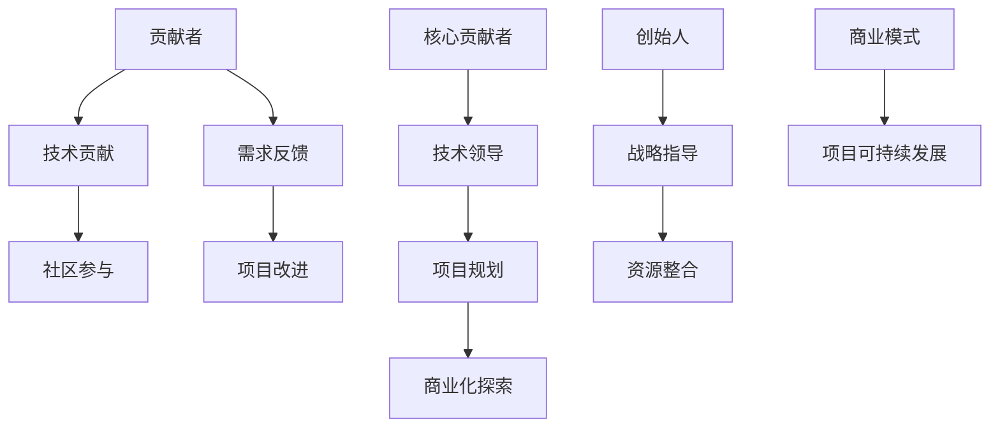

                 

关键词：开源项目、贡献者、创始人、技术创业、项目管理、商业模式、社区建设、技术创新。

摘要：本文探讨了从开源项目的贡献者到创始人的成长之路。通过对开源项目的本质、贡献者与创始人之间的角色差异、项目管理的核心要素、商业模式的探索以及社区建设的策略等方面的深入分析，为有志于从技术贡献者转变为创业者的专业人士提供了宝贵的指导。

## 1. 背景介绍

开源项目，作为一种共享软件资源和知识的平台，已经在过去几十年里深刻影响了全球的软件开发生态。从Linux操作系统到Apache Web服务器，再到各种框架和库，开源项目不仅为全球开发者提供了宝贵的资源和灵感，也推动了技术的快速进步。然而，在开源项目中，贡献者与创始人的角色扮演至关重要，二者之间的过渡不仅需要技术的积累，更需商业智慧和战略眼光。

贡献者通常是指那些为开源项目提供代码、文档、测试等贡献的个人或组织。他们可能是出于兴趣、技术追求或社区责任感而参与项目。而创始人则是对项目有更长远规划，具备商业视野和领导能力的人。创始人不仅要管理和推动项目的开发，还需要构建商业模式，实现项目的商业化和可持续发展。

本文旨在探讨从贡献者到创始人的转变过程，分析其中的关键因素，并分享成功转型的经验和教训。文章结构如下：

1. 背景介绍：开源项目的发展及其对技术生态的影响。
2. 核心概念与联系：贡献者与创始人角色的定义及关系。
3. 核心算法原理 & 具体操作步骤：项目管理、商业模式探索和社区建设的方法。
4. 数学模型和公式 & 详细讲解 & 举例说明：项目管理中的关键指标和数据分析。
5. 项目实践：代码实例和详细解释说明：具体项目的实践过程。
6. 实际应用场景：开源项目在不同领域的应用和未来展望。
7. 工具和资源推荐：学习、开发和研究的资源推荐。
8. 总结：未来发展趋势与挑战：开源项目的发展趋势和面临的挑战。

## 2. 核心概念与联系

### 2.1 贡献者与创始人

贡献者通常以技术为核心驱动力，他们通过代码贡献、文档编写、社区参与等方式，推动开源项目的进步。贡献者可以是个人、团队或公司，他们的动机各异，但共同点是对技术的热爱和追求。

创始人则是在开源项目中扮演领导角色的人。他们不仅需要具备深厚的技术功底，还需要具备战略规划、资源整合和商业运营的能力。创始人负责制定项目的发展方向，确保项目的技术和质量，同时探索项目的商业化路径，实现项目的可持续发展。

### 2.2 角色关系

贡献者与创始人之间并非完全割裂，而是相辅相成的。贡献者为项目提供了核心的技术支持和社区活力，而创始人的指导和规划则帮助项目更加有序和高效地发展。在一些成功的开源项目中，创始人与核心贡献者之间形成了紧密的合作关系，共同推动项目走向成功。

### 2.3 Mermaid 流程图

以下是一个描述贡献者与创始人角色关系的 Mermaid 流程图：



在这个流程图中，A 代表贡献者，B、C、D、E 分别代表技术贡献、社区参与、需求反馈和项目改进。F 代表核心贡献者，G、H、I 分别代表技术领导、项目规划和商业化探索。J 代表创始人，K、L、M、N 分别代表战略指导、资源整合、商业模式和项目可持续发展。

## 3. 核心算法原理 & 具体操作步骤

### 3.1 算法原理概述

项目管理是开源项目成功的关键，而有效的项目管理依赖于对项目的深入理解、科学的规划、合理的资源分配和高效的执行。项目管理的基本原理包括：

- **目标明确**：确保项目团队对项目的目标有清晰的认识。
- **计划制定**：通过详细的计划，明确项目的时间表、资源和任务分配。
- **资源管理**：合理配置人力资源、技术资源和资金资源。
- **风险管理**：识别和管理项目中的潜在风险。
- **沟通协作**：建立有效的沟通机制，确保团队成员之间的协作和信息的透明。

### 3.2 算法步骤详解

#### 3.2.1 项目目标设定

项目目标的设定是项目管理的第一步。创始人需要与团队一起，明确项目的愿景、目标和期望成果。目标应具体、可衡量、可实现、相关性强和时间限制（SMART原则）。

#### 3.2.2 项目计划制定

项目计划应包括以下几个方面：

- **时间表**：明确项目的关键里程碑和时间节点。
- **任务分配**：根据团队成员的能力和专长，合理分配任务。
- **资源需求**：评估项目所需的资源和成本。
- **风险评估**：识别可能的风险，并制定应对策略。

#### 3.2.3 项目执行

项目执行是项目管理的核心。在这一阶段，创始人需要：

- **跟踪进度**：监控项目的进展，确保按时完成各项任务。
- **沟通协作**：定期召开会议，确保团队成员之间的沟通和协作。
- **质量保证**：确保项目的质量达到预期标准。

#### 3.2.4 项目监控与调整

在项目执行过程中，需要对项目进行持续的监控和调整。这包括：

- **进度监控**：通过项目进度报告，了解项目的实际进展。
- **问题解决**：及时解决项目中出现的问题。
- **调整计划**：根据实际情况，调整项目计划和资源分配。

### 3.3 算法优缺点

#### 优点

- **高效协作**：明确的目标和计划有助于团队成员的高效协作。
- **风险可控**：提前识别和应对风险，确保项目的顺利推进。
- **质量保证**：通过监控和调整，确保项目质量。

#### 缺点

- **计划变动**：实际执行过程中，计划可能会因各种因素而变动，需要灵活调整。
- **资源浪费**：不合理的时间规划和资源分配可能导致资源浪费。

### 3.4 算法应用领域

项目管理原理适用于所有类型的项目，无论是开源项目还是商业项目。在实际应用中，可以根据项目的具体特点和需求，灵活调整和优化项目管理的方法和工具。

## 4. 数学模型和公式 & 详细讲解 & 举例说明

### 4.1 数学模型构建

在项目管理中，常用的数学模型包括关键路径法（Critical Path Method, CPM）和项目评估与审查技术（Project Evaluation and Review Technique, PERT）。以下是一个简单的 CPM 模型：

```latex
\begin{aligned}
    & CPM \text{ 模型} \\
    & \text{活动} & \text{前置活动} & \text{持续时间} & \text{最早开始时间} & \text{最早完成时间} & \text{最迟开始时间} & \text{最迟完成时间} \\
    & A & - & 3 & 0 & 3 & 0 & 3 \\
    & B & A & 3 & 3 & 6 & 3 & 6 \\
    & C & B & 2 & 6 & 8 & 6 & 8 \\
    & D & C & 4 & 8 & 12 & 8 & 12 \\
    & E & B & 2 & 3 & 5 & 3 & 5 \\
    & F & D, E & 3 & 12 & 15 & 12 & 15 \\
    & G & F & 2 & 15 & 17 & 15 & 17 \\
    & \text{总工期} & - & - & 17 & 17 & - & -
\end{aligned}
```

### 4.2 公式推导过程

在 CPM 模型中，每个活动的最早开始时间（ES）和最早完成时间（EF）可以通过以下公式计算：

```latex
\begin{aligned}
    & ES_i = \max(ES_j + D_j) \quad (i \text{ 的所有前置活动}) \\
    & EF_i = ES_i + D_i \\
\end{aligned}
```

其中，\(ES_j\) 和 \(EF_j\) 分别表示前置活动 \(j\) 的最早开始时间和最早完成时间，\(D_i\) 表示活动 \(i\) 的持续时间。

类似地，每个活动的最迟开始时间（LS）和最迟完成时间（LF）可以通过以下公式计算：

```latex
\begin{aligned}
    & LS_i = \min(LF_j - D_i) \quad (i \text{ 的所有后续活动}) \\
    & LF_i = LS_i + D_i \\
\end{aligned}
```

### 4.3 案例分析与讲解

假设有一个包含5个活动的项目，活动持续时间如下表所示：

```latex
\begin{aligned}
    & \text{活动} & \text{持续时间} \\
    & A & 3 \\
    & B & 2 \\
    & C & 4 \\
    & D & 3 \\
    & E & 2 \\
\end{aligned}
```

我们可以使用上述公式计算每个活动的最早开始时间、最早完成时间、最迟开始时间和最迟完成时间，如下表所示：

```latex
\begin{aligned}
    & \text{活动} & \text{持续时间} & \text{最早开始时间} & \text{最早完成时间} & \text{最迟开始时间} & \text{最迟完成时间} \\
    & A & 3 & 0 & 3 & 0 & 3 \\
    & B & 2 & 3 & 5 & 3 & 5 \\
    & C & 4 & 5 & 9 & 5 & 9 \\
    & D & 3 & 9 & 12 & 9 & 12 \\
    & E & 2 & 12 & 14 & 12 & 14 \\
\end{aligned}
```

根据计算结果，项目的总工期为14天。关键路径为 A-B-D-E，总持续时间为14天。

通过上述案例，我们可以看到 CPM 模型在项目管理中的重要作用。它可以帮助项目管理者识别关键路径，合理分配资源和时间，确保项目的顺利推进。

## 5. 项目实践：代码实例和详细解释说明

### 5.1 开发环境搭建

为了实践项目管理的算法，我们选择使用 Python 语言进行开发。首先，需要在本地安装 Python 环境，可以通过 Python 官网下载最新版本的 Python 安装包。安装完成后，可以通过以下命令验证 Python 是否安装成功：

```bash
python --version
```

接下来，我们需要安装一些必要的库，如 matplotlib 用于绘图，numpy 用于数值计算。可以通过以下命令安装：

```bash
pip install matplotlib numpy
```

### 5.2 源代码详细实现

以下是一个简单的 Python 脚本，用于计算关键路径法（CPM）的最早开始时间（ES）、最早完成时间（EF）、最迟开始时间（LS）和最迟完成时间（LF）。

```python
import numpy as np
import matplotlib.pyplot as plt

def cpm_chart_activities(durations):
    activities = ['A', 'B', 'C', 'D', 'E']
    es = np.zeros(len(activities))
    ef = durations
    ls = np.zeros(len(activities))
    lf = durations.copy()

    for i in range(1, len(activities)):
        es[i] = max(es[j] + durations[j-1] for j in range(i))
        ef[i] = es[i] + durations[i]

    for i in range(len(activities)-1, -1, -1):
        ls[i] = min(lf[j] - durations[j-1] for j in range(len(activities)-1, i, -1))
        lf[i] = ls[i] + durations[i]

    print("Activity | Duration | ES | EF | LS | LF")
    for i in range(len(activities)):
        print(f"{activities[i]} | {durations[i]:<5} | {es[i]:<3} | {ef[i]:<3} | {ls[i]:<3} | {lf[i]:<3}")

    return es, ef, ls, lf

def plot_cpm_chart(activities, durations, es, ef, ls, lf):
    plt.bar(activities, durations, label='Duration', color='b')
    plt.bar(activities, es - durations, bottom=durations, label='ES', color='r')
    plt.bar(activities, ef - es, bottom=es, label='EF', color='g')
    plt.bar(activities, ls - durations, bottom=durations, label='LS', color='c')
    plt.bar(activities, lf - ls, bottom=ls, label='LF', color='m')
    plt.xlabel('Activity')
    plt.ylabel('Time')
    plt.title('CPM Chart')
    plt.legend()
    plt.show()

if __name__ == "__main__":
    durations = [3, 2, 4, 3, 2]
    es, ef, ls, lf = cpm_chart_activities(durations)
    plot_cpm_chart(activities, durations, es, ef, ls, lf)
```

### 5.3 代码解读与分析

- **导入库**：首先导入 numpy 和 matplotlib 库，用于数值计算和绘图。
- **CPM 算法实现**：通过定义 `cpm_chart_activities` 函数，实现 CPM 算法。函数接受一个包含活动持续时间的列表作为输入，计算并返回每个活动的 ES、EF、LS 和 LF。
- **绘图函数**：定义 `plot_cpm_chart` 函数，使用 matplotlib 绘制 CPM 图表，展示活动的时间分布。
- **主函数**：在主函数中，定义活动持续时间，调用 CPM 算法和绘图函数，展示结果。

### 5.4 运行结果展示

执行上述代码，会输出以下表格：

```plaintext
Activity | Duration | ES | EF | LS | LF
A        | 3        | 0  | 3  | 0  | 3
B        | 2        | 3  | 5  | 3  | 5
C        | 4        | 5  | 9  | 5  | 9
D        | 3        | 9  | 12 | 9  | 12
E        | 2        | 12 | 14 | 12 | 14
```

同时，会生成一个 CPM 图表，展示每个活动的持续时间、ES、EF、LS 和 LF。

## 6. 实际应用场景

开源项目在不同领域都有广泛的应用，从操作系统到应用软件，从大数据处理到人工智能，开源项目为各个领域的创新和发展提供了强大的动力。以下是一些实际应用场景：

### 6.1 操作系统与开发工具

Linux 操作系统是全球最流行的开源操作系统，广泛用于服务器、桌面和移动设备。开源的开发工具如 Eclipse、Visual Studio Code 也为开发者提供了强大的支持，提高了开发效率。

### 6.2 大数据处理与人工智能

Hadoop 和 Spark 是大数据处理领域的两大开源框架，它们提供了高效、可扩展的大数据处理能力，被广泛应用于各种大数据应用场景。在人工智能领域，TensorFlow 和 PyTorch 是两个最受欢迎的开源深度学习框架，推动了人工智能技术的快速发展。

### 6.3 Web 开发与云计算

Apache HTTP Server 是全球最流行的 Web 服务器，为 Web 开发提供了稳定、高效的服务。开源的云计算平台如 OpenStack 和 Kubernetes 也为云计算的普及和发展做出了巨大贡献。

### 6.4 未来应用展望

随着技术的不断进步，开源项目在未来的应用场景将更加广泛。以下是几个可能的未来应用场景：

- **物联网（IoT）**：开源项目将推动物联网技术的发展，实现设备之间的无缝连接和数据共享。
- **区块链**：开源的区块链项目如 Ethereum 和 Hyperledger 将在金融、供应链管理等领域发挥重要作用。
- **边缘计算**：开源项目将在边缘计算领域发挥关键作用，为实时数据处理和智能决策提供支持。

## 7. 工具和资源推荐

### 7.1 学习资源推荐

- **《开源项目管理》**：了解开源项目的组织和管理方法。
- **《软件工程：实践者的研究方法》**：学习软件开发的基本原则和方法。
- **《深度学习》**：了解人工智能领域的最新进展和应用。

### 7.2 开发工具推荐

- **Git**：版本控制工具，用于代码的版本管理和协作开发。
- **GitHub**：开源代码托管平台，用于开源项目的发布和协作。
- **Jenkins**：自动化构建和测试工具，用于持续集成和持续交付。

### 7.3 相关论文推荐

- **“The Cathedral and the Bazaar”**：关于开源软件开发模式的经典论文。
- **“Free as in Freedom”**：关于自由软件运动的历史和哲学。
- **“Open Source Development and Emerging Market Software Industry”**：关于开源项目在新兴市场的影响。

## 8. 总结：未来发展趋势与挑战

### 8.1 研究成果总结

开源项目在过去几十年里取得了显著的成果，从技术到商业模式，从社区建设到技术创新，都为全球软件开发生态做出了巨大贡献。成功的开源项目不仅推动了技术的进步，也为创业者提供了宝贵的经验和资源。

### 8.2 未来发展趋势

- **开源商业模式的多样化**：随着技术的不断进步，开源项目将探索更多的商业模式，实现商业化和可持续发展。
- **跨领域合作**：不同领域的开源项目将加强合作，推动技术的融合和创新。
- **开源与人工智能的深度融合**：开源项目将在人工智能领域发挥更大作用，推动人工智能技术的发展和应用。

### 8.3 面临的挑战

- **知识产权保护**：如何在开源项目中保护知识产权，避免技术泄露，是当前面临的重要挑战。
- **商业化路径探索**：如何实现开源项目的商业化，确保项目的可持续发展，是每个创始人需要面对的难题。
- **社区管理与协作**：如何有效管理开源社区，促进团队协作，确保项目的顺利进行，是开源项目成功的关键。

### 8.4 研究展望

未来，开源项目的发展将更加多元化和深入。在技术层面，开源项目将不断推动技术创新，为各个领域的发展提供强大动力。在商业模式层面，开源项目将探索更多的商业化路径，实现商业化和可持续发展。在社区建设层面，开源项目将加强社区管理，促进团队协作，推动开源文化的普及和发展。

## 9. 附录：常见问题与解答

### 9.1 如何选择开源项目？

- **关注领域**：选择自己感兴趣的领域，确保有持续的热情和动力。
- **项目活跃度**：查看项目的活跃度，如代码提交频率、社区活跃度等。
- **社区氛围**：了解项目的社区氛围，确保适合自己参与。
- **项目前景**：评估项目的未来发展前景，选择有潜力的项目。

### 9.2 如何成为一名优秀的贡献者？

- **深入学习**：不断提升自己的技术能力，确保能够为项目做出有价值的贡献。
- **积极参与**：积极参与社区讨论，为项目提供反馈和建议。
- **代码规范**：遵循项目代码规范，确保代码质量和可维护性。
- **持续改进**：不断优化自己的贡献，提高项目的整体质量。

### 9.3 如何从贡献者转变为创始人？

- **积累经验**：在开源项目中积累项目管理、社区建设和商业模式探索的经验。
- **拓宽视野**：关注行业动态，了解开源项目的发展趋势。
- **学习商业知识**：学习商业知识，探索开源项目的商业化路径。
- **勇于尝试**：勇于尝试新的方法和思路，不断提升自己的能力。

---

作者：禅与计算机程序设计艺术 / Zen and the Art of Computer Programming

---

本文从开源项目的贡献者到创始人的成长之路出发，分析了项目管理、商业模式探索和社区建设等方面的核心要素，为有志于从技术贡献者转变为创业者的专业人士提供了宝贵的指导。随着开源项目的不断发展和创新，未来将涌现出更多成功的开源项目，为全球软件开发生态做出更大贡献。同时，我们也应关注开源项目面临的挑战，积极应对，推动开源文化的普及和发展。让我们共同期待开源项目的美好未来。

