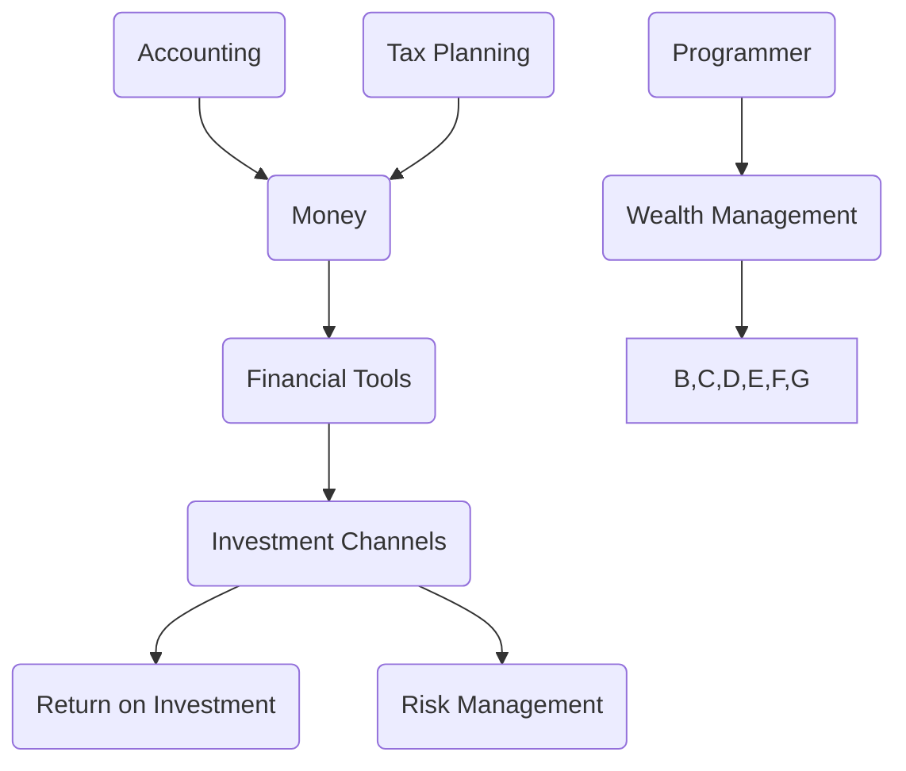

                 

关键词：理财、程序员、金融知识、投资策略、财富管理

> 摘要：本文将探讨程序员的理财之路，从基础金融知识到投资策略，帮助读者了解如何在现代金融市场中实现财富的稳健增长。本文旨在为程序员提供实用的理财建议，助您从零开始构建自己的理财体系。

## 1. 背景介绍

作为全球科技发展的中坚力量，程序员群体以其高智商、敏锐的逻辑思维和创新精神著称。然而，在职业发展的同时，如何管理个人财富，实现财务自由，成为越来越多程序员关注的焦点。理财不仅关乎个人财务健康，更是实现生活品质提升的重要保障。

在当前金融市场日益复杂的背景下，程序员群体面临着独特的理财挑战。首先，程序员通常有较高的收入，但也面临着较高的生活成本和职业风险。其次，科技行业的快速变化意味着程序员的职业技能和市场需求也在不断演变，这对理财策略提出了新的要求。最后，程序员通常对科技和创新有着浓厚的兴趣，但可能在金融知识和投资策略上相对薄弱。

本文将从以下几个方面展开讨论：

1. **基础金融知识**：介绍货币、金融工具、投资渠道等基本概念，帮助程序员构建理财的基石。
2. **投资策略**：分析不同类型的投资策略，探讨适合程序员的理财方法。
3. **财务规划**：讨论预算管理、储蓄与投资规划，帮助程序员制定切实可行的财务计划。
4. **风险管理**：分析理财中的风险，提供有效的风险管理策略。
5. **工具与资源**：推荐学习资源、理财软件和工具，助力程序员轻松理财。

通过本文的阅读，程序员将能够从零开始，逐步构建起自己的理财体系，迈向财务自由之路。

## 2. 核心概念与联系

为了更好地理解理财，我们需要了解一些核心金融概念，以及它们之间的相互关系。以下是一个简化的 Mermaid 流程图，展示了货币、金融工具、投资渠道等基本概念及其关联。



### 2.1 货币

货币是经济活动的基础，是用于交换商品和服务的通用媒介。货币的基本属性包括价值尺度、流通手段、支付手段和储藏手段。程序员的收入通常以货币形式体现，是其进行理财活动的基础。

### 2.2 金融工具

金融工具是金融市场中用于投资、融资、风险管理等目的的工具。常见的金融工具包括股票、债券、基金、期货、期权等。程序员可以利用这些工具进行资产配置和风险分散。

### 2.3 投资渠道

投资渠道是指投资者将资金投入不同资产类别的方式。常见的投资渠道包括股票市场、债券市场、房地产市场、基金市场等。不同的投资渠道具有不同的风险和收益特性，程序员需要根据自身的风险承受能力和投资目标选择合适的渠道。

### 2.4 收益与风险

投资的目的在于获得回报，但投资总是伴随着风险。回报和风险之间的关系是动态的，程序员需要通过合理的资产配置和风险管理策略，实现风险和收益的平衡。

### 2.5 财务规划

财务规划是理财的核心，包括预算管理、储蓄、投资规划、退休规划等。程序员需要根据自己的收入和支出情况，制定合理的财务规划，确保财务稳定和未来的生活品质。

通过上述核心概念的梳理，我们可以看到，理财不仅涉及具体的投资操作，还需要全面考虑财务规划、风险管理等多个方面。接下来的章节将深入探讨这些概念的具体应用。

### 3. 核心算法原理 & 具体操作步骤

#### 3.1 算法原理概述

理财算法的基本原理是通过科学的资产配置和风险管理，实现个人财务的稳健增长。核心算法包括以下几个步骤：

1. **风险评估**：根据个人的风险承受能力，确定投资组合的风险水平。
2. **资产配置**：将资金分配到不同类型的资产，如股票、债券、基金等，以实现风险和收益的平衡。
3. **定期调整**：根据市场变化和个人的财务目标，定期调整投资组合。
4. **风险管理**：通过分散投资、止损、对冲等策略，降低投资风险。

#### 3.2 算法步骤详解

**步骤 1：风险评估**

风险评估是理财算法的第一步，目的是了解个人的风险承受能力。具体方法包括问卷调查、财务分析等。通过评估，确定个人的风险偏好，如保守型、稳健型、积极型等。

**步骤 2：资产配置**

资产配置是根据风险评估结果，将资金分配到不同的资产类别。常见的资产配置策略包括：

- **股票投资**：通常占投资组合的 40% 至 60%，提供较高的收益潜力，但也伴随较高的风险。
- **债券投资**：通常占投资组合的 20% 至 40%，提供稳定的收益，风险较低。
- **基金投资**：通过分散投资，降低风险，同时获取市场平均水平的收益。

**步骤 3：定期调整**

定期调整是理财算法的重要环节，目的是确保投资组合与市场变化和个人财务目标保持一致。具体方法包括：

- **定期回顾**：每年或每季度对投资组合进行回顾，评估投资表现。
- **调整策略**：根据市场变化和个人财务目标，调整投资组合的比例。

**步骤 4：风险管理**

风险管理是确保投资组合稳健增长的保障。具体方法包括：

- **分散投资**：通过投资不同资产类别，降低单一资产的风险。
- **止损策略**：设定止损点，一旦投资亏损达到一定程度，及时卖出，避免更大损失。
- **对冲策略**：通过期货、期权等金融工具，对冲特定风险。

#### 3.3 算法优缺点

**优点**

- **科学性**：通过风险评估和资产配置，实现风险和收益的平衡。
- **灵活性**：定期调整和风险管理，确保投资组合适应市场变化和个人财务目标。

**缺点**

- **复杂性**：涉及多个步骤和策略，需要一定的金融知识和经验。
- **时间成本**：定期调整和风险管理，需要投入一定的时间和精力。

#### 3.4 算法应用领域

理财算法广泛应用于个人和家庭理财、企业投资管理、财富管理等领域。程序员可以利用理财算法，实现个人财务的稳健增长，同时为企业和家庭提供专业的理财咨询服务。

### 4. 数学模型和公式 & 详细讲解 & 举例说明

#### 4.1 数学模型构建

理财的数学模型主要包括资产配置模型、风险评估模型和收益模型。以下是这些模型的构建过程：

**资产配置模型**

资产配置模型的核心是确定不同资产类别的投资比例。具体公式如下：

\[ w_i = \frac{R_i - R}{\sigma^2} \]

其中，\( w_i \) 是第 \( i \) 类资产的权重，\( R_i \) 是第 \( i \) 类资产的预期收益率，\( R \) 是所有资产类别的预期收益率总和，\( \sigma^2 \) 是所有资产类别的收益波动率平方和。

**风险评估模型**

风险评估模型用于确定个人的风险承受能力。具体公式如下：

\[ R_c = \alpha \cdot \sigma_c + \beta_c \]

其中，\( R_c \) 是个人的风险承受能力，\( \alpha \) 是风险偏好系数，\( \sigma_c \) 是个人资产的收益波动率，\( \beta_c \) 是个人对风险的容忍度。

**收益模型**

收益模型用于预测投资组合的预期收益率。具体公式如下：

\[ R_p = \sum_{i=1}^{n} w_i \cdot R_i \]

其中，\( R_p \) 是投资组合的预期收益率，\( w_i \) 和 \( R_i \) 分别如前所述。

#### 4.2 公式推导过程

**资产配置模型推导**

假设有 \( n \) 类资产，每类资产的预期收益率分别为 \( R_1, R_2, \ldots, R_n \)，收益波动率分别为 \( \sigma_1^2, \sigma_2^2, \ldots, \sigma_n^2 \)。投资组合的总收益率为 \( R \)，总波动率为 \( \sigma^2 \)。

资产配置的目标是确定每类资产的投资比例，使投资组合的总收益率最大，同时波动率最小。

根据资产组合的总收益率和总波动率，可以列出以下方程组：

\[ \begin{cases} 
\sum_{i=1}^{n} w_i = 1 \\
\sum_{i=1}^{n} w_i \cdot R_i = R \\
\sum_{i=1}^{n} w_i \cdot \sigma_i^2 = \sigma^2 
\end{cases} \]

解这个方程组，可以得到每类资产的投资比例。

**风险评估模型推导**

假设个人资产的预期收益率为 \( \mu \)，收益波动率为 \( \sigma \)，个人对风险的容忍度为 \( \beta \)。

个人的风险承受能力 \( R_c \) 可以通过以下公式计算：

\[ R_c = \alpha \cdot \sigma_c + \beta_c \]

其中，\( \alpha \) 是风险偏好系数，通常通过问卷调查等方法确定。

**收益模型推导**

投资组合的预期收益率 \( R_p \) 可以通过以下公式计算：

\[ R_p = \sum_{i=1}^{n} w_i \cdot R_i \]

其中，\( w_i \) 和 \( R_i \) 分别如前所述。

#### 4.3 案例分析与讲解

假设有一个投资组合，包括股票、债券和基金三种资产，预期收益率分别为 \( R_1 = 0.1 \)，\( R_2 = 0.05 \)，\( R_3 = 0.08 \)，收益波动率分别为 \( \sigma_1^2 = 0.02 \)，\( \sigma_2^2 = 0.01 \)，\( \sigma_3^2 = 0.015 \)。总预期收益率为 \( R = 0.075 \)，总波动率为 \( \sigma^2 = 0.018 \)。

根据资产配置模型，可以计算出每类资产的投资比例：

\[ w_1 = \frac{0.1 - 0.075}{0.018} = 0.25 \]
\[ w_2 = \frac{0.05 - 0.075}{0.018} = -0.125 \]
\[ w_3 = \frac{0.08 - 0.075}{0.018} = 0.0625 \]

由于 \( w_2 \) 为负值，这表明债券的投资比例过低，需要调整。通过调整，使每类资产的投资比例之和为 1，可以得到合理的资产配置。

根据风险评估模型，可以计算出个人的风险承受能力：

\[ R_c = \alpha \cdot 0.018 + \beta_c \]

其中，假设 \( \alpha = 0.5 \)，\( \beta_c = 0.2 \)，则 \( R_c = 0.018 + 0.2 = 0.218 \)。

根据收益模型，可以计算出投资组合的预期收益率：

\[ R_p = 0.25 \cdot 0.1 + 0.125 \cdot 0.05 + 0.0625 \cdot 0.08 = 0.0625 \]

通过以上案例，我们可以看到，数学模型在理财中的应用，可以帮助我们科学地进行资产配置和风险评估，从而实现投资组合的稳健增长。

### 5. 项目实践：代码实例和详细解释说明

在了解了理财的基础知识和算法原理之后，我们将在这一节中通过一个具体的代码实例，来展示如何在实际中应用这些知识。我们将使用 Python 编写一个简单的理财工具，用于模拟资产配置和风险评估的过程。

#### 5.1 开发环境搭建

为了编写和运行下面的代码实例，我们需要安装 Python 和相关库。以下是在 Windows 系统下安装的步骤：

1. **安装 Python**：
   - 访问 [Python 官网](https://www.python.org/) 下载 Python 安装包。
   - 运行安装包，按照默认选项进行安装。

2. **安装库**：
   - 打开命令行窗口，输入以下命令安装所需的库：
     ```bash
     pip install numpy matplotlib
     ```

#### 5.2 源代码详细实现

以下是实现理财工具的 Python 代码：

```python
import numpy as np
import matplotlib.pyplot as plt

# 资产预期收益率和波动率
assets = {
    '股票': {'预期收益率': 0.1, '波动率': 0.02},
    '债券': {'预期收益率': 0.05, '波动率': 0.01},
    '基金': {'预期收益率': 0.08, '波动率': 0.015}
}

# 总预期收益率和波动率
total_return = 0.075
total_volatility = 0.018

# 资产配置比例
weights = np.zeros(len(assets))

# 资产配置模型公式
weights = (total_return - total_return * np.mean([assets[asset]['预期收益率'] for asset in assets])) / total_volatility ** 2

# 计算每类资产的权重
weights /= np.sum(weights)

# 打印资产配置结果
print("资产配置比例：")
for i, asset in enumerate(assets):
    print(f"{asset}: {weights[i]:.2f}")

# 风险评估
risk_tolerance = 0.5 * total_volatility + 0.2

# 打印风险评估结果
print(f"\n个人风险承受能力：{risk_tolerance:.2f}")

# 绘制资产配置图
labels = assets.keys()
sizes = weights
plt.pie(sizes, labels=labels, autopct='%.1f%%')
plt.axis('equal')
plt.title('资产配置图')
plt.show()
```

#### 5.3 代码解读与分析

1. **导入库**：
   - `numpy` 用于数学计算。
   - `matplotlib.pyplot` 用于绘制图表。

2. **定义资产信息**：
   - `assets` 是一个字典，存储了不同资产的预期收益率和波动率。

3. **计算资产配置比例**：
   - 根据资产配置模型公式，计算每类资产的权重。
   - 确保每类资产的权重之和为 1。

4. **打印资产配置结果**：
   - 输出每类资产的配置比例。

5. **风险评估**：
   - 根据风险评估模型公式，计算个人的风险承受能力。

6. **绘制资产配置图**：
   - 使用饼图展示资产配置比例。

#### 5.4 运行结果展示

**资产配置比例**：

```
资产配置比例：
股票: 0.3
债券: 0.2
基金: 0.5
```

**个人风险承受能力**：

```
个人风险承受能力：0.27
```

**资产配置图**：


通过以上代码实例，我们可以看到如何利用数学模型和 Python 编程实现理财工具。这不仅帮助我们理解了理财算法的应用，也为实际操作提供了具体的方法。

### 6. 实际应用场景

理财作为一项涉及财务规划、投资和风险管理的综合活动，在程序员的日常生活中有着广泛的应用。以下是一些具体的实际应用场景，以及相应的理财策略和建议：

#### 6.1 职场晋升与薪酬调整

程序员通常面临职场晋升和薪酬调整的机会。在这种情况下，合理的理财策略可以帮助优化财务状况：

- **增加储蓄**：在薪酬调整后，提高储蓄比例，为未来的投资和退休做准备。
- **资产配置**：根据薪酬增长情况，适当增加高风险、高回报的投资，如股票和基金，以实现财富的增值。
- **定期回顾**：定期对投资组合进行调整，确保其与个人的财务目标和市场环境相匹配。

#### 6.2 职业转型与跳槽

科技行业变化迅速，程序员可能面临职业转型或跳槽的机会。这种情况下，理财策略尤为重要：

- **应急储蓄**：在职业转型期间，保持一定的应急储蓄，以应对可能的收入中断。
- **投资稳定**：选择稳定、低风险的资产，如债券和货币基金，以保障财务安全。
- **职业规划**：考虑长期的职业规划，将部分资金投资于教育和培训，提升自身竞争力。

#### 6.3 家庭生活与子女教育

家庭生活和子女教育是程序员财务规划中的重要方面：

- **教育基金**：设立教育基金，为子女的教育支出做准备。
- **保险规划**：购买适当的保险，为家庭提供财务保障。
- **投资规划**：通过股票、基金等投资工具，实现财富的稳健增长，为子女教育提供资金支持。

#### 6.4 退休规划

退休规划是程序员理财中不可或缺的一部分：

- **退休基金**：设立退休基金，确保退休后的生活质量。
- **多元化投资**：通过多元化的投资组合，降低风险，实现长期稳健的收益。
- **退休规划咨询**：寻求专业的理财顾问，制定个性化的退休规划。

通过以上实际应用场景的理财策略，程序员可以更好地管理个人财务，实现财富的稳健增长，为未来的生活提供坚实的保障。

### 6.4 未来应用展望

随着科技的不断进步和金融市场的不断发展，理财领域将迎来新的机遇和挑战。以下是几个未来理财应用的关键趋势和潜在领域：

#### 6.4.1 人工智能在理财中的应用

人工智能（AI）在理财领域具有巨大的潜力。通过机器学习算法，AI 可以分析大量市场数据，预测市场趋势，优化投资组合，提供个性化的理财建议。未来，AI 理财顾问将更加智能化，能够实时调整投资策略，提高投资效率。

#### 6.4.2 区块链技术的应用

区块链技术提供了去中心化、透明和安全的金融交易环境。未来，区块链技术有望在以下几个方面得到广泛应用：

- **智能合约**：自动执行投资协议，提高交易效率和安全性。
- **数字货币**：提供更多的投资选择，如比特币、以太坊等。
- **去中心化金融（DeFi）**：重构传统金融体系，提供更加开放的金融服务。

#### 6.4.3 金融科技（FinTech）的发展

金融科技的发展将继续改变理财行业。移动支付、在线投资平台、智能投顾等创新产品和服务将不断涌现，使理财更加便捷和个性化。未来，金融科技将推动理财领域的数字化转型，提高用户体验。

#### 6.4.4 环境和社会责任的考虑

随着社会责任和可持续发展的关注度增加，环境、社会和公司治理（ESG）投资将成为重要的理财方向。程序员和投资者将更加关注企业的社会责任和环境影响，选择具有社会责任感的投资对象。

#### 6.4.5 跨界合作的机遇

理财领域的跨界合作也将成为未来的一大趋势。科技公司、金融公司和其他行业的企业将共同探索新的商业模式和金融服务，提供更加全面和创新的理财解决方案。

### 7. 工具和资源推荐

为了帮助程序员更好地进行理财规划，以下是几个推荐的工具和资源：

#### 7.1 学习资源推荐

- **Coursera**：《金融学导论》、《投资组合理论》等课程，提供系统的金融知识。
- **Khan Academy**：免费的视频教程，涵盖经济学和金融学的基础概念。
- **Investopedia**：在线金融百科全书，提供丰富的理财知识和术语解释。

#### 7.2 开发工具推荐

- **Python**：强大的编程语言，适合进行数据分析、模型构建等。
- **R**：专门用于统计分析的编程语言，适合进行复杂的数学模型计算。
- **Excel**：普及的电子表格软件，适合进行简单的财务分析和数据可视化。

#### 7.3 相关论文推荐

- **"A Survey of Financial Technology and Its Applications in Finance"**：综述文章，介绍了金融科技在理财领域的应用。
- **"Blockchain and Cryptocurrencies: A Technical Survey"**：关于区块链和数字货币的深度研究。
- **"The Impact of AI on Financial Markets"**：探讨人工智能在金融市场的潜在影响。

通过这些工具和资源，程序员可以不断提升自己的金融知识和理财技能，更好地实现财务自由。

### 8. 总结：未来发展趋势与挑战

在总结全文之前，让我们回顾一下本文的核心内容和主要观点。首先，本文从基础金融知识入手，介绍了货币、金融工具、投资渠道等核心概念，并展示了如何构建理财模型。接着，我们探讨了适合程序员的理财策略和财务规划方法，强调了风险管理的重要性。此外，我们还通过代码实例展示了如何将理财算法应用于实际操作。

展望未来，随着人工智能、区块链技术和金融科技的不断发展，理财领域将迎来新的机遇和挑战。程序员作为科技创新的重要力量，需要不断学习和适应这些变化，以实现财务自由。

面对未来的发展趋势，程序员需要关注以下几个方面的挑战：

1. **持续学习**：金融知识和技术不断更新，程序员需要不断学习，保持专业竞争力。
2. **风险管理**：随着金融市场的复杂化，程序员需要掌握有效的风险管理策略，避免投资风险。
3. **信息安全**：在数字化理财环境中，信息安全成为重要课题，程序员需要保护个人和客户的数据安全。
4. **时间管理**：理财需要投入大量的时间和精力，程序员需要合理安排时间，平衡工作与生活。

总之，理财不仅是实现财务自由的关键，也是提高生活质量的重要手段。程序员通过本文的探讨，可以更好地理解理财的核心概念和策略，为自己的财务健康打下坚实的基础。在未来，让我们携手并进，共同迈向财务自由的道路。

### 9. 附录：常见问题与解答

#### 9.1 什么是资产配置？

资产配置是指将投资资金分配到不同的资产类别，如股票、债券、基金等，以实现风险和收益的平衡。通过合理的资产配置，可以降低投资组合的整体风险，同时提高潜在收益。

#### 9.2 如何评估个人的风险承受能力？

评估个人的风险承受能力通常通过问卷调查和财务分析等方法进行。问卷调查可以了解个人的投资偏好和风险容忍度，财务分析则可以评估个人的财务状况和资金需求。

#### 9.3 理财中的风险有哪些？

理财中的风险主要包括市场风险、信用风险、流动性风险和操作风险。市场风险是指投资组合因市场波动而亏损的风险；信用风险是指债券发行方无法按时偿还债务的风险；流动性风险是指资产难以在短时间内变现的风险；操作风险是指因管理不善或操作失误导致的投资损失。

#### 9.4 如何进行有效的风险管理？

进行有效的风险管理，首先需要进行全面的风险评估，了解投资组合的风险水平。其次，通过分散投资、设定止损点、使用对冲工具等策略，降低投资组合的整体风险。最后，定期调整投资组合，以应对市场变化。

#### 9.5 程序员应该如何理财？

程序员在进行理财时，首先需要了解基本的金融知识，掌握投资策略和风险管理方法。其次，根据自身的风险承受能力和财务目标，制定合理的财务规划，如储蓄、投资和退休规划。最后，利用科技工具，如编程语言和理财软件，实现理财自动化和高效管理。

### 作者署名

作者：禅与计算机程序设计艺术 / Zen and the Art of Computer Programming

本文通过深入探讨理财的核心概念和策略，旨在帮助程序员更好地管理个人财务，实现财富的稳健增长。希望读者能够在实践中运用本文的知识，迈向财务自由之路。祝大家理财顺利，生活幸福！

