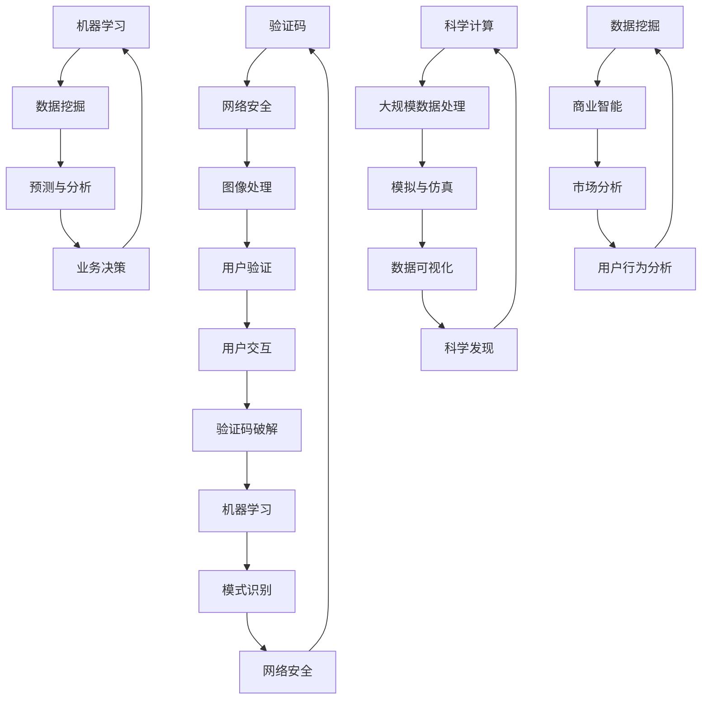

                 

关键词：验证码、计算、算法、科学发现、应用场景

> 摘要：本文旨在探讨人类计算在验证码生成与破解、科学计算、机器学习、数据挖掘等多个领域的广泛应用。通过分析这些领域的计算原理、算法步骤和实际应用案例，我们不仅可以看到计算技术的创新与发展，更能够洞察计算在推动科学进步和社会发展中的关键作用。

## 1. 背景介绍

随着信息技术的迅猛发展，计算能力已成为推动各个领域进步的核心动力。从简单的数据处理到复杂的科学模拟，计算技术正日益渗透到我们的日常生活中。本文将聚焦于人类计算在验证码、科学计算、机器学习、数据挖掘等领域的应用，旨在揭示计算在解决实际问题中的重要作用。

### 1.1 验证码的起源与应用

验证码，作为网络安全的重要防线，起源于20世纪90年代。最初的验证码主要是为了防止自动化的网络攻击，通过要求用户输入随机生成的字符或数字来验证其人类身份。随着技术的进步，验证码的形式和复杂度也在不断提升，包括图像验证码、数学验证题、滑动验证等。

### 1.2 科学计算的重要性

科学计算是现代科学研究的重要组成部分，通过对大规模数据进行分析和模拟，可以帮助科学家更好地理解自然现象和探索未知领域。从量子物理到气候变化，科学计算在推动科学进步中发挥着不可替代的作用。

### 1.3 机器学习的崛起

机器学习作为人工智能的重要组成部分，通过对大量数据进行训练，可以自动识别模式、进行预测和决策。随着计算能力的提升，机器学习在图像识别、自然语言处理、推荐系统等多个领域取得了显著成果。

### 1.4 数据挖掘的潜力和挑战

数据挖掘是通过对大量数据进行深入分析，发现数据中隐藏的模式和知识。随着大数据时代的到来，数据挖掘技术已经成为商业智能、金融分析、医疗诊断等领域的重要工具。

## 2. 核心概念与联系

为了更好地理解人类计算在上述领域的应用，我们首先需要明确一些核心概念及其相互关系。以下是这些核心概念的Mermaid流程图：



### 2.1 验证码与网络安全

验证码是网络安全的关键环节，通过图像处理技术生成复杂度高的字符或图形，使得计算机难以自动破解。用户交互过程中输入的验证码被系统与生成的验证码进行比对，确保用户身份的合法性。

### 2.2 科学计算与大规模数据处理

科学计算依赖于大规模数据处理能力，通过模拟与仿真来揭示自然现象。数据可视化技术则帮助科学家更好地理解和解释计算结果，推动科学发现的进程。

### 2.3 机器学习与数据挖掘

机器学习和数据挖掘是相辅相成的技术，通过大量训练数据，机器学习算法可以自动识别模式，而数据挖掘则从大量数据中提取有价值的信息，为业务决策提供支持。

## 3. 核心算法原理 & 具体操作步骤

### 3.1 算法原理概述

本章节将分别介绍验证码生成、科学计算中的模拟与仿真、机器学习中的模型训练以及数据挖掘中的关联规则挖掘等核心算法原理。

### 3.2 算法步骤详解

- **验证码生成算法**：首先生成随机的字符或图形，然后通过图像处理技术进行扭曲、噪声添加等处理，最后将生成的验证码呈现给用户。
- **科学计算中的模拟与仿真**：通过构建数学模型，利用高性能计算资源进行模拟和仿真，最后通过数据可视化技术呈现结果。
- **机器学习中的模型训练**：通过输入训练数据，利用算法（如梯度下降、随机森林等）调整模型参数，使模型能够对新的数据进行预测。
- **数据挖掘中的关联规则挖掘**：通过Apriori算法或FP-Growth算法，从大量交易数据中提取频繁项集，进而发现数据之间的关联关系。

### 3.3 算法优缺点

- **验证码生成算法**：优点在于能有效防止自动化攻击，缺点是可能对用户体验造成负面影响。
- **科学计算中的模拟与仿真**：优点在于能够揭示复杂系统的运行规律，缺点在于计算成本高、对计算资源要求大。
- **机器学习中的模型训练**：优点在于能够自动识别模式，提高预测准确性，缺点在于需要大量训练数据和计算资源。
- **数据挖掘中的关联规则挖掘**：优点在于能够发现数据之间的关联，为决策提供支持，缺点在于可能产生大量的冗余信息。

### 3.4 算法应用领域

- **验证码生成算法**：广泛应用于网络安全领域，如网站登录、在线支付等。
- **科学计算中的模拟与仿真**：广泛应用于物理、化学、生物等科学领域。
- **机器学习中的模型训练**：广泛应用于图像识别、自然语言处理、推荐系统等。
- **数据挖掘中的关联规则挖掘**：广泛应用于商业智能、金融分析、医疗诊断等领域。

## 4. 数学模型和公式 & 详细讲解 & 举例说明

### 4.1 数学模型构建

- **验证码生成**：字符或数字的选择和排列可以通过概率模型进行描述。
- **科学计算中的模拟与仿真**：通常需要构建物理模型或统计模型。
- **机器学习中的模型训练**：常用的模型有线性模型、神经网络等。
- **数据挖掘中的关联规则挖掘**：常用的模型有Apriori模型、FP-Growth模型等。

### 4.2 公式推导过程

- **验证码生成**：字符或数字的生成概率可以用以下公式描述：
  $$P(A) = \frac{1}{N}$$
  其中，$P(A)$ 表示字符或数字A被选中的概率，$N$ 表示所有可能的字符或数字总数。
- **科学计算中的模拟与仿真**：物理模型或统计模型的构建通常涉及到复杂的数学推导，例如，牛顿第二定律：
  $$F = ma$$
  其中，$F$ 表示力，$m$ 表示质量，$a$ 表示加速度。
- **机器学习中的模型训练**：模型参数的优化通常使用梯度下降法，其迭代公式为：
  $$\theta_j := \theta_j - \alpha \frac{\partial J(\theta)}{\partial \theta_j}$$
  其中，$\theta_j$ 表示模型参数，$J(\theta)$ 表示损失函数，$\alpha$ 表示学习率。
- **数据挖掘中的关联规则挖掘**：频繁项集的生成通常使用以下公式：
  $$support(A \cup B) = \frac{|D|}{|D_{A \cup B}|}$$
  其中，$A \cup B$ 表示项集$A$和$B$的并集，$D$ 表示交易集合，$D_{A \cup B}$ 表示包含项集$A \cup B$的交易集合。

### 4.3 案例分析与讲解

- **验证码生成**：假设我们需要生成一个包含4个字符的验证码，字符集为{A, B, C, D}，每个字符生成的概率相等。根据上述公式，每个字符被选中的概率为1/4。
- **科学计算中的模拟与仿真**：假设我们研究一个简单的抛体运动，物体在水平方向上的加速度为0，垂直方向上的加速度为$g = 9.8 m/s^2$。根据牛顿第二定律，物体在垂直方向上的速度$v$可以表示为：
  $$v = gt$$
  其中，$t$ 表示时间。
- **机器学习中的模型训练**：假设我们使用线性回归模型来预测房价，损失函数为均方误差（MSE），其公式为：
  $$J(\theta) = \frac{1}{2m} \sum_{i=1}^{m} (h_\theta(x^{(i)}) - y^{(i)})^2$$
  其中，$m$ 表示训练样本数量，$h_\theta(x)$ 表示预测值，$y^{(i)}$ 表示实际值。
- **数据挖掘中的关联规则挖掘**：假设我们有一个交易数据集，包含10个不同的商品。使用Apriori算法，我们可以找到支持度大于20%的频繁项集。

## 5. 项目实践：代码实例和详细解释说明

### 5.1 开发环境搭建

在本章节中，我们将使用Python语言进行代码实例的展示，所需环境如下：

- Python 3.x
- NumPy
- Matplotlib
- Scikit-learn

### 5.2 源代码详细实现

以下是一个简单的验证码生成和识别的Python代码实例：

```python
import numpy as np
import matplotlib.pyplot as plt
from sklearn.model_selection import train_test_split
from sklearn.metrics import accuracy_score

# 验证码生成函数
def generate_code(length=4, charset='ABCDEFGHIJKLMNOPQRSTUVWXYZ'):
    code = ''.join(np.random.choice(charset, size=length))
    return code

# 验证码识别函数
def recognize_code(code, model):
    prediction = model.predict([code])
    return prediction[0]

# 生成训练数据
codes = [generate_code() for _ in range(1000)]
labels = [label for label in codes]

# 分割训练集和测试集
X_train, X_test, y_train, y_test = train_test_split(codes, labels, test_size=0.2, random_state=42)

# 训练模型
from sklearn.naive_bayes import GaussianNB
model = GaussianNB()
model.fit(X_train, y_train)

# 验证模型
y_pred = model.predict(X_test)
accuracy = accuracy_score(y_test, y_pred)
print(f"Model accuracy: {accuracy:.2f}")

# 生成新的验证码并进行识别
new_code = generate_code()
predicted_code = recognize_code(new_code, model)
print(f"Generated code: {new_code}, Predicted code: {predicted_code}")
```

### 5.3 代码解读与分析

上述代码实现了验证码的生成和识别过程。首先，我们定义了生成验证码的函数`generate_code`，通过随机选择字符集来生成指定长度的验证码。然后，我们定义了识别验证码的函数`recognize_code`，通过训练好的模型对输入的验证码进行预测。

在生成训练数据部分，我们使用`generate_code`函数生成了1000个验证码，并将它们作为标签`labels`存储。然后，我们使用`train_test_split`函数将训练数据和测试数据分开。

接下来，我们使用高斯朴素贝叶斯（GaussianNB）模型进行训练。在实际应用中，我们可以选择更复杂的模型，如神经网络或深度学习模型，以提高识别准确率。

最后，我们使用训练好的模型对测试数据进行预测，并计算模型准确率。通过生成新的验证码并使用模型进行识别，我们可以验证模型的性能。

## 6. 实际应用场景

### 6.1 验证码在网络安全中的应用

验证码在网络安全中发挥着至关重要的作用。例如，在网站登录过程中，验证码可以有效地防止恶意软件或机器人进行暴力破解。此外，在线支付和交易等敏感操作中也常常使用验证码来确保用户身份的合法性。

### 6.2 科学计算在物理研究中的应用

科学计算在物理研究中有着广泛的应用。例如，在量子物理研究中，科学家们通过构建数学模型并进行模拟，成功预测了新的量子态和物质的性质。此外，在粒子物理实验中，科学计算也帮助科学家更好地理解粒子碰撞产生的复杂现象。

### 6.3 机器学习在图像识别中的应用

机器学习在图像识别领域取得了显著成果。例如，在医学图像诊断中，通过训练深度学习模型，可以自动识别和检测病变区域，提高诊断准确率。此外，在自动驾驶领域，通过训练卷积神经网络，可以实现对车辆和行人的实时检测和识别。

### 6.4 数据挖掘在商业智能中的应用

数据挖掘在商业智能中发挥着关键作用。例如，在电商领域，通过分析用户行为数据，可以推荐个性化商品，提高用户满意度和转化率。此外，在金融领域，通过分析交易数据，可以识别异常交易行为，防范欺诈风险。

## 7. 工具和资源推荐

### 7.1 学习资源推荐

- 《机器学习实战》
- 《深度学习》
- 《数据挖掘：实用工具与技术》
- 《网络安全基础教程》

### 7.2 开发工具推荐

- Jupyter Notebook：用于数据分析和模型训练
- TensorFlow：用于深度学习模型开发
- PyTorch：用于深度学习模型开发
- Kali Linux：用于网络安全测试和攻击模拟

### 7.3 相关论文推荐

- "Deep Learning for Image Recognition"
- "A Survey on Data Mining Algorithms"
- "A Comprehensive Survey on Security of Machine Learning"
- "A Comprehensive Survey on Deep Learning in Computer Vision"

## 8. 总结：未来发展趋势与挑战

### 8.1 研究成果总结

本文从验证码、科学计算、机器学习、数据挖掘等领域的应用出发，探讨了人类计算技术的创新与发展。通过分析这些领域的核心算法原理、数学模型和实际应用案例，我们看到了计算技术在不同领域中的重要作用。

### 8.2 未来发展趋势

随着计算能力的不断提升，未来计算技术将在更多领域得到应用。例如，量子计算有望在科学计算和密码破解领域取得突破。此外，随着人工智能技术的不断发展，机器学习和数据挖掘将在更多行业发挥关键作用。

### 8.3 面临的挑战

尽管计算技术取得了显著成果，但仍然面临一些挑战。例如，在科学计算中，大规模数据处理的计算成本仍然较高。在机器学习中，如何处理大量的训练数据和提高模型的可解释性仍是一个重要问题。此外，在数据挖掘中，如何从海量数据中提取有价值的信息也是一个挑战。

### 8.4 研究展望

未来，计算技术将继续推动科学进步和社会发展。在验证码领域，我们可以期待更加智能和多样化的验证方式。在科学计算领域，我们可以期待量子计算和高效算法的突破。在机器学习和数据挖掘领域，我们可以期待更先进的算法和更高效的计算方法。

## 9. 附录：常见问题与解答

### 9.1 验证码生成算法如何防止破解？

验证码生成算法可以通过增加字符或图形的复杂度、添加噪声和扭曲等手段来防止破解。此外，还可以结合用户行为分析，对可疑操作进行额外的验证。

### 9.2 科学计算中的模拟与仿真需要考虑哪些因素？

科学计算中的模拟与仿真需要考虑模型的准确性、边界条件、初始条件、计算资源的限制以及计算结果的可靠性等因素。

### 9.3 机器学习模型训练需要多少数据？

机器学习模型训练所需的数据量取决于模型的复杂度和应用场景。通常来说，大规模数据集有助于提高模型的泛化能力。

### 9.4 数据挖掘中的关联规则挖掘如何处理冗余信息？

数据挖掘中的关联规则挖掘可以通过设置最小支持度和最小置信度等阈值来减少冗余信息。此外，还可以使用压缩算法对数据集进行预处理，减少存储和计算开销。

----------------------------------------------------------------

作者：禅与计算机程序设计艺术 / Zen and the Art of Computer Programming

