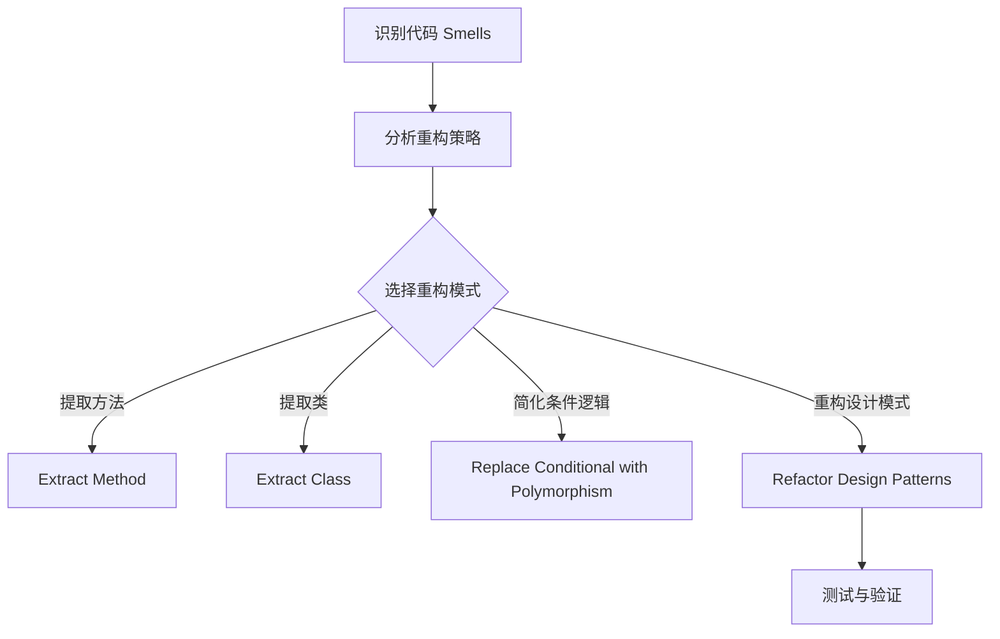

                 

  
## 1. 背景介绍

代码重构（Code Refactoring）是软件工程中的一项重要活动，旨在在不改变程序外在行为的前提下，改进其内部结构和表达能力。随着软件项目的发展和维护，代码重构能够提高代码的可读性、可维护性和可扩展性，从而提升开发效率和软件质量。本文将介绍代码重构的一些关键技巧和常用模式，帮助开发者更好地理解和应用这一重要实践。

首先，让我们明确代码重构的定义和目的。代码重构并不是对代码进行修改，而是对代码的结构进行调整和优化。这种修改通常包括提取公共代码、简化复杂的条件表达式、重新命名不恰当的变量和方法等。通过这些操作，我们可以消除代码中的冗余、重复和混乱，使代码更加简洁、清晰。

代码重构的主要目的是提高代码的质量和可维护性。一方面，它可以帮助我们避免未来可能出现的问题，如代码重复、复杂度和耦合度增加等；另一方面，它可以提高开发团队的协作效率，降低新成员的学习成本。

本文将分为以下几个部分：

1. 核心概念与联系
2. 核心算法原理与具体操作步骤
3. 数学模型和公式详细讲解与举例说明
4. 项目实践：代码实例和详细解释说明
5. 实际应用场景
6. 未来应用展望
7. 工具和资源推荐
8. 总结：未来发展趋势与挑战

通过本文的阅读，读者将能够了解代码重构的基本概念和技巧，掌握一些常用的重构模式，并能够将其应用于实际项目中，提高代码质量和开发效率。

## 2. 核心概念与联系

在深入探讨代码重构的技巧和模式之前，我们首先需要理解一些核心概念和它们之间的联系。这些概念包括但不限于设计模式、代码 smells（代码恶臭）、DRY原则（Don't Repeat Yourself）、SOLID原则等。

### 设计模式

设计模式是一套被广泛认可和应用的软件设计解决方案，用于解决在软件设计中经常出现的问题。常见的经典设计模式包括单例模式、工厂模式、观察者模式、策略模式等。这些模式不仅可以提高代码的复用性，还能降低系统的复杂度和耦合度。

在设计模式中，重构是一个不可或缺的部分。通过重构，我们可以将复杂的类和方法分解成更小、更简洁的组件，使其更易于理解和维护。例如，我们可以使用提取方法（Extract Method）和提取类（Extract Class）等重构模式，将复杂的逻辑分离出来，从而提高代码的清晰度和可读性。

### 代码 Smells

代码 Smells 是指那些可能导致代码质量下降的不良迹象。这些迹象包括重复代码、过长方法、过大的类、复杂的条件逻辑等。代码 Smells 不仅会影响代码的可读性和可维护性，还可能引入潜在的错误和漏洞。

识别代码 Smells 是进行有效重构的第一步。我们可以使用代码分析工具（如SonarQube、FindBugs等）来识别潜在的代码 Smells。然后，我们可以使用一系列的重构模式来消除这些不良迹象，从而提升代码质量。

### DRY原则

DRY（Don't Repeat Yourself）原则是软件工程中的一条重要原则，旨在避免代码重复。重复的代码不仅会增加维护成本，还可能导致错误和bug的传播。

在代码重构过程中，遵循DRY原则是非常重要的。我们可以使用各种重构模式，如提取公共代码（Extract Common Code）、提取方法（Extract Method）和提取类（Extract Class）等，来消除代码中的重复部分。通过这些操作，我们可以使代码更加简洁和易于维护。

### SOLID原则

SOLID 是一组用于设计和构建可维护、可扩展和可重用代码的五大原则。这些原则包括：

- Single Responsibility Principle（单一职责原则）
- Open/Closed Principle（开闭原则）
- Liskov Substitution Principle（里氏替换原则）
- Interface Segregation Principle（接口隔离原则）
- Dependency Inversion Principle（依赖倒置原则）

遵循SOLID原则可以帮助我们构建更加健壮、灵活和可维护的代码。在代码重构过程中，我们可以使用各种重构模式来调整代码结构，使其符合SOLID原则。

### Mermaid 流程图

为了更好地理解代码重构的概念和流程，我们可以使用Mermaid流程图来表示它们。以下是代码重构的基本流程图：



通过上述流程图，我们可以看到，代码重构的过程包括识别代码 Smells、分析重构策略、选择合适的重构模式、实施重构操作以及测试与验证。这些步骤相辅相成，共同构成了一个完整的重构流程。

### 总结

在本文的第二部分，我们介绍了代码重构的一些核心概念和联系。这些概念包括设计模式、代码 Smells、DRY原则和SOLID原则等。通过理解这些概念，我们可以更好地把握代码重构的精髓，并能够在实际项目中有效地应用各种重构模式。

在下一部分，我们将深入探讨代码重构的核心算法原理和具体操作步骤，帮助读者更加深入地了解和实践代码重构。

## 3. 核心算法原理 & 具体操作步骤

在理解了代码重构的基本概念和流程之后，接下来我们将深入探讨代码重构的核心算法原理和具体操作步骤。这些核心算法和步骤不仅帮助我们识别和消除代码中的不良迹象，还能提升代码的质量和可维护性。

### 3.1 算法原理概述

代码重构的核心算法可以归结为几种常见的重构模式，这些模式具有明确的原理和目标。以下是几种重要的重构模式及其原理：

#### 提取方法（Extract Method）

提取方法是一种将复杂的代码块分解为独立方法的过程。这种重构模式有助于简化代码、提高可读性和可维护性。

原理：将一个复杂的代码块提取为一个新的方法，使得原始代码的复杂性降低，同时新的方法可以独立测试和复用。

目标：简化代码逻辑，提高可读性。

#### 提取类（Extract Class）

提取类是一种将相关的行为和属性从现有类中分离出来的过程。这种重构模式有助于降低类之间的耦合度，提高代码的模块化和可扩展性。

原理：将具有相似功能的代码和行为提取到一个新的类中，使得原始类的职责更加清晰和单一。

目标：降低类之间的耦合度，提高模块化。

#### 重新命名（Rename）

重新命名是一种对变量、方法、类等标识符进行更改的过程，以使其更具描述性和一致性。这种重构模式有助于提高代码的可读性和可理解性。

原理：通过更改不恰当的标识符，使其更具语义意义，减少歧义和误解。

目标：提高代码的可读性和一致性。

#### 简化条件逻辑（Replace Conditional with Polymorphism）

简化条件逻辑是一种通过引入多态性来替代复杂的条件逻辑的过程。这种重构模式有助于降低代码的复杂度和提高可维护性。

原理：将复杂的条件逻辑替换为多态性，使得代码更加简洁、清晰。

目标：降低代码复杂度，提高可维护性。

### 3.2 算法步骤详解

下面，我们将详细介绍每种重构模式的具体步骤。

#### 提取方法

**步骤：**

1. 识别复杂的代码块。
2. 确定代码块的功能。
3. 创建一个新方法，将代码块的内容移至新方法中。
4. 更新原始代码，调用新方法代替原有代码块。
5. 测试确保重构后的代码功能不变。

**示例：**

假设我们有一个复杂的循环逻辑，如下所示：

```java
for (int i = 0; i < list.size(); i++) {
    if (list.get(i) > 10) {
        processElement(list.get(i));
    }
}
```

我们可以将其重构为：

```java
private void processElementIfGreaterThanTen(int element) {
    if (element > 10) {
        processElement(element);
    }
}

for (int i = 0; i < list.size(); i++) {
    processElementIfGreaterThanTen(list.get(i));
}
```

#### 提取类

**步骤：**

1. 识别具有相似功能的代码和行为。
2. 创建一个新类，将相关的代码和行为提取到新类中。
3. 更新原始类，使用新类代替原有代码和行为。
4. 测试确保重构后的代码功能不变。

**示例：**

假设我们有一个类`Order`，其中包含了处理订单的复杂逻辑。我们可以将其重构为两个类：`Order`和`OrderProcessor`：

```java
// 原始类
public class Order {
    public void processOrder(List<Item> items) {
        for (Item item : items) {
            if (item.getPrice() > 100) {
                processHighValueItem(item);
            } else {
                processRegularItem(item);
            }
        }
    }
}

// 重构后的类
public class OrderProcessor {
    public void processOrder(List<Item> items) {
        for (Item item : items) {
            if (item.getPrice() > 100) {
                processHighValueItem(item);
            } else {
                processRegularItem(item);
            }
        }
    }
}

public class Order {
    private OrderProcessor processor = new OrderProcessor();

    public void processOrder(List<Item> items) {
        processor.processOrder(items);
    }
}
```

#### 重新命名

**步骤：**

1. 识别不恰当的标识符。
2. 选择新的标识符，使其更具描述性和一致性。
3. 更新所有出现的旧标识符。

**示例：**

假设我们有一个名为`processItems`的方法，其中包含了处理订单的复杂逻辑。我们可以将其重命名为`processOrder`，以更准确地描述方法的功能：

```java
// 原始方法
public void processItems(List<Item> items) {
    // 复杂逻辑
}

// 重构后的方法
public void processOrder(List<Item> items) {
    // 复杂逻辑
}
```

#### 简化条件逻辑

**步骤：**

1. 识别复杂的条件逻辑。
2. 分析条件逻辑，确定可以引入多态性的部分。
3. 使用多态性替换条件逻辑。
4. 测试确保重构后的代码功能不变。

**示例：**

假设我们有一个复杂的条件逻辑，如下所示：

```java
if (item.getType() == ItemType.REGULAR) {
    processRegularItem(item);
} else if (item.getType() == ItemType.HIGH_VALUE) {
    processHighValueItem(item);
} else {
    throw new IllegalArgumentException("Invalid item type");
}
```

我们可以使用多态性来简化条件逻辑：

```java
public interface ItemProcessor {
    void process(Item item);
}

public class RegularItemProcessor implements ItemProcessor {
    public void process(Item item) {
        processRegularItem(item);
    }
}

public class HighValueItemProcessor implements ItemProcessor {
    public void process(Item item) {
        processHighValueItem(item);
    }
}

public class OrderProcessor {
    private ItemProcessor regularProcessor = new RegularItemProcessor();
    private ItemProcessor highValueProcessor = new HighValueItemProcessor();

    public void processOrder(List<Item> items) {
        for (Item item : items) {
            regularProcessor.process(item);
        }
    }
}
```

通过上述示例，我们可以看到每种重构模式的具体步骤和实现方法。这些模式不仅可以帮助我们简化代码、提高可读性和可维护性，还能降低代码的复杂度和耦合度。

在下一部分，我们将继续探讨代码重构的优缺点，以及在不同应用领域的适用性。

### 3.3 算法优缺点

代码重构作为软件工程中的一项重要活动，具有显著的优点和潜在的缺点。以下是对代码重构优缺点的详细分析：

#### 优点

1. **提高代码质量**：代码重构可以消除代码中的冗余、重复和混乱，使代码更加简洁、清晰。这有助于提高代码的可读性和可维护性，降低维护成本。

2. **减少 bug 数量**：通过重构，我们可以将复杂的逻辑分解为更小、更简单的组件，从而降低系统的复杂度。这种简化有助于减少 bug 的数量，提高代码的稳定性。

3. **提高开发效率**：重构后的代码更加易于理解和维护，使得开发人员能够更快地添加新功能和修复 bug。此外，重构可以减少重复性工作，提高开发效率。

4. **增强代码可复用性**：通过提取公共代码和创建独立的组件，代码重构可以提高代码的复用性。这不仅可以减少开发时间，还能提高代码的可靠性。

5. **促进团队协作**：重构后的代码更加模块化和清晰，使得团队成员更容易理解和协作。这有助于提高团队的协作效率和代码质量。

#### 缺点

1. **重构风险**：代码重构可能会引入新的 bug 或问题，尤其是在复杂系统中。如果重构操作不当，可能会导致系统的稳定性下降。

2. **时间成本**：代码重构需要投入大量时间和精力，特别是在大型项目中。这可能会影响项目进度和开发周期。

3. **测试挑战**：重构后的代码需要重新测试以确保其功能不变。在复杂系统中，测试工作量可能会显著增加。

4. **人员技能要求**：有效的代码重构需要开发者具备一定的技能和经验。新手开发者可能难以理解和应用重构技巧，从而影响重构效果。

#### 总结

尽管代码重构具有显著的优点，但它也存在一些潜在的缺点。在实施代码重构时，开发团队需要权衡这些优缺点，并采取适当的措施来降低风险。例如，可以通过制定详细的重构计划和逐步实施来控制风险。此外，定期进行代码评审和自动化测试可以确保重构后的代码质量。

在下一部分，我们将探讨代码重构在不同应用领域的具体应用，以展示其实际效果和优势。

### 3.4 算法应用领域

代码重构作为一种重要的软件工程实践，可以在多个应用领域中发挥重要作用。以下是在不同应用领域中的具体应用和效果：

#### 开发项目

在开发项目中，代码重构是提高代码质量和可维护性的关键步骤。特别是在大型和长期项目中，代码重构有助于消除冗余代码、简化复杂逻辑和降低耦合度。以下是一些实际应用：

1. **敏捷开发**：在敏捷开发过程中，代码重构是持续集成和持续交付的关键组成部分。通过定期重构，开发团队可以确保代码库的质量和稳定性，从而更快地实现功能迭代。

2. **遗留系统**：在维护和升级遗留系统时，代码重构可以帮助消除旧代码中的缺陷和瓶颈，提高系统的性能和可维护性。这有助于降低长期维护成本，并延长系统的使用寿命。

3. **模块化开发**：在模块化开发中，代码重构可以帮助将复杂的模块分解为更小、更简洁的组件。这种重构模式有助于提高模块的复用性和可扩展性，从而提高开发效率。

#### 软件维护

软件维护是软件生命周期中一个长期且重要的阶段。代码重构在软件维护中发挥着重要作用，以下是一些具体应用：

1. **问题修复**：在修复软件中的bug时，重构可以帮助简化修复过程。通过重构，开发人员可以更好地理解代码逻辑，从而更快地定位和修复问题。

2. **性能优化**：通过代码重构，开发人员可以识别并消除系统中存在的性能瓶颈。这种重构模式有助于提高软件的运行效率和响应速度。

3. **功能扩展**：在软件维护过程中，代码重构可以帮助开发人员更好地理解和扩展现有功能。通过重构，新的功能可以更方便地集成到现有系统中，从而提高软件的灵活性和可扩展性。

#### 技术评审

代码重构在技术评审中也是一个重要的环节。以下是一些具体应用：

1. **代码质量评估**：在技术评审过程中，通过分析代码中的重构机会，可以评估代码的质量和可维护性。这有助于识别潜在的问题和改进点。

2. **代码风格一致性**：通过重构，可以统一代码风格和命名规范，提高代码的可读性和一致性。

3. **团队协作**：在技术评审中，代码重构可以促进团队成员之间的协作和交流。通过共同参与重构，团队成员可以更好地理解代码，提高协作效率。

#### 研究与开发

在研究与开发领域，代码重构也发挥着重要作用。以下是一些具体应用：

1. **算法优化**：在研究和开发新型算法时，代码重构可以帮助简化算法实现，提高算法的可读性和可维护性。这有助于研究人员更好地理解算法，并进行进一步的优化。

2. **软件工程方法**：代码重构是软件工程方法中一个重要的实践环节。通过重构，研究人员可以验证和改进各种软件工程方法，从而提高软件开发的质量和效率。

3. **学术交流**：在学术交流中，通过展示重构过程和结果，可以更好地阐述研究思路和成果。这有助于促进学术界的交流和合作。

### 总结

代码重构在开发项目、软件维护、技术评审和研究与开发等应用领域中具有广泛的应用。通过重构，开发人员可以显著提高代码质量、降低维护成本、优化性能和增强团队协作。在未来的软件开发中，代码重构将继续发挥重要作用，成为提升软件质量和开发效率的关键实践。

在下一部分，我们将详细讨论代码重构的数学模型和公式，以及如何通过数学模型和公式来分析和优化代码重构。

### 4. 数学模型和公式 & 详细讲解 & 举例说明

在代码重构的过程中，数学模型和公式可以起到重要的作用，帮助我们分析和优化重构过程。以下是一些常用的数学模型和公式，以及它们的详细讲解和具体应用实例。

#### 4.1 数学模型构建

代码重构的数学模型主要涉及代码复杂度（Cyclomatic Number）、代码冗余度（Redundancy Degree）和代码可维护性（Maintainability Index）等指标。

**代码复杂度（Cyclomatic Number）：**  
Cyclomatic Number 是一种用于衡量代码复杂度的指标，由美国计算机科学家 Thomas J. McCabe 在1976年提出。它通过计算程序中的独立路径数量来评估代码的复杂度。

公式：\[ V(G) = e - n + 2 \]  
其中，\( V(G) \) 是 Cyclomatic Number，\( e \) 是程序中的边数，\( n \) 是程序中的节点数。

**代码冗余度（Redundancy Degree）：**  
代码冗余度是衡量代码中冗余代码比例的指标。高冗余度会导致维护成本增加、bug数量增加和代码质量下降。

公式：\[ R(D) = \frac{C(R)}{C(T)} \]  
其中，\( R(D) \) 是代码冗余度，\( C(R) \) 是冗余代码的数量，\( C(T) \) 是总代码数量。

**代码可维护性（Maintainability Index）：**  
代码可维护性是指代码在未来的维护和扩展过程中所需的工作量。高可维护性意味着代码更易于维护和扩展。

公式：\[ MI = \frac{1000}{C + (N^2 + E^3)} \]  
其中，\( MI \) 是代码可维护性指数，\( C \) 是语句数量，\( N \) 是复杂度，\( E \) 是外部复杂度。

#### 4.2 公式推导过程

**代码复杂度（Cyclomatic Number）：**  
Cyclomatic Number 的推导过程基于程序控制流的图表示。程序中的每个节点表示一个基本块，每个基本块由一系列顺序执行的语句组成。每个基本块之间的边表示控制流。

根据控制流的图表示，可以计算程序中的独立路径数量。具体推导如下：

1. 确定程序中的节点数量 \( n \) 和边数量 \( e \)。
2. 计算独立路径数量：\( V(G) = e - n + 2 \)。

**代码冗余度（Redundancy Degree）：**  
代码冗余度反映了代码中冗余代码的比例。具体推导如下：

1. 确定冗余代码数量 \( C(R) \) 和总代码数量 \( C(T) \)。
2. 计算冗余度：\( R(D) = \frac{C(R)}{C(T)} \)。

**代码可维护性（Maintainability Index）：**  
代码可维护性指数用于衡量代码在未来的维护和扩展过程中所需的工作量。具体推导如下：

1. 确定语句数量 \( C \)、复杂度 \( N \) 和外部复杂度 \( E \)。
2. 计算可维护性指数：\( MI = \frac{1000}{C + (N^2 + E^3)} \)。

#### 4.3 案例分析与讲解

**案例一：代码复杂度分析**

假设有一个程序，其中包含10个节点和15条边。根据Cyclomatic Number公式，可以计算出代码复杂度：

\[ V(G) = 15 - 10 + 2 = 7 \]

这意味着程序中存在7条独立路径。通过分析这些路径，可以发现程序中的某些路径可能较为复杂，需要进行重构以简化逻辑。

**案例二：代码冗余度分析**

假设有一个程序，其中包含100行代码，其中20行是冗余代码。根据Redundancy Degree公式，可以计算出代码冗余度：

\[ R(D) = \frac{20}{100} = 0.2 \]

这意味着程序中大约有20%的代码是冗余的。通过重构，可以识别并消除这些冗余代码，从而提高代码质量和可维护性。

**案例三：代码可维护性分析**

假设有一个程序，其中包含50个语句，复杂度为5，外部复杂度为3。根据Maintainability Index公式，可以计算出代码可维护性指数：

\[ MI = \frac{1000}{50 + (5^2 + 3^3)} = 95.35 \]

这意味着程序的维护性较好，未来维护和扩展的工作量相对较低。通过进一步重构，可以进一步提高代码的可维护性。

### 总结

在代码重构过程中，数学模型和公式可以提供重要的分析和优化依据。通过使用Cyclomatic Number、Redundancy Degree和Maintainability Index等指标，我们可以评估代码的复杂度、冗余度和可维护性，从而指导重构操作。在实际项目中，结合这些数学模型和公式，可以帮助开发人员更有效地进行代码重构，提高代码质量。

在下一部分，我们将通过具体的项目实践，展示如何应用代码重构技巧，并提供详细的代码实例和解释。

### 5. 项目实践：代码实例和详细解释说明

为了更好地展示代码重构的实际应用效果，我们将在本部分通过一个具体的项目实例，详细说明如何进行代码重构，并提供重构前后的代码对比和解释。本实例将采用一个简单的计算器程序，该程序包含了一些常见的代码 Smells，如冗余代码、过长方法和复杂条件逻辑。

#### 5.1 开发环境搭建

在开始项目实践之前，我们需要搭建一个简单的开发环境。以下是所需的步骤：

1. 安装Java开发工具包（JDK）。
2. 安装一个文本编辑器（如Visual Studio Code）。
3. 创建一个简单的Java项目，并设置必要的依赖项。

#### 5.2 源代码详细实现

下面是重构前的计算器程序的源代码。这个程序包含一些代码 Smells，我们将逐步进行重构。

```java
public class Calculator {
    public double calculate(double num1, double num2, String operator) {
        if (operator.equals("+")) {
            return num1 + num2;
        } else if (operator.equals("-")) {
            return num1 - num2;
        } else if (operator.equals("*")) {
            return num1 * num2;
        } else if (operator.equals("/")) {
            if (num2 != 0) {
                return num1 / num2;
            } else {
                throw new IllegalArgumentException("Division by zero");
            }
        } else {
            throw new IllegalArgumentException("Invalid operator");
        }
    }
}
```

在这个示例中，我们可以看到以下代码 Smells：

1. **冗余代码**：多个`if-else`语句用于处理不同的运算符，这部分代码可以简化。
2. **过长方法**：`calculate`方法过于复杂，包含多个条件逻辑，可以考虑将其拆分成更小的方法。
3. **复杂条件逻辑**：处理除法时，需要检查除数是否为零，这部分逻辑可以进一步简化。

#### 5.3 代码解读与分析

为了更好地理解代码重构的过程，我们将逐步对上述代码进行重构，并解释每一步的目的和结果。

**重构步骤 1：简化条件逻辑**

我们可以使用多态性来简化条件逻辑。首先，我们创建一个`BinaryOperation`接口，然后为每种运算符创建一个实现类。

```java
public interface BinaryOperation {
    double apply(double num1, double num2);
}

public class Addition implements BinaryOperation {
    public double apply(double num1, double num2) {
        return num1 + num2;
    }
}

public class Subtraction implements BinaryOperation {
    public double apply(double num1, double num2) {
        return num1 - num2;
    }
}

public class Multiplication implements BinaryOperation {
    public double apply(double num1, double num2) {
        return num1 * num2;
    }
}

public class Division implements BinaryOperation {
    public double apply(double num1, double num2) {
        if (num2 != 0) {
            return num1 / num2;
        } else {
            throw new IllegalArgumentException("Division by zero");
        }
    }
}
```

在这个重构步骤中，我们创建了一个`BinaryOperation`接口，并定义了四个实现类。这样，我们可以将`calculate`方法中的条件逻辑简化为直接调用相应的实现类。

**重构步骤 2：重构`calculate`方法**

现在，我们可以将`calculate`方法重构为只包含几个简单的步骤，并直接使用`BinaryOperation`接口。

```java
public class Calculator {
    public double calculate(double num1, double num2, String operator) {
        BinaryOperation operation = getOperation(operator);
        return operation.apply(num1, num2);
    }

    private BinaryOperation getOperation(String operator) {
        switch (operator) {
            case "+": return new Addition();
            case "-": return new Subtraction();
            case "*": return new Multiplication();
            case "/": return new Division();
            default: throw new IllegalArgumentException("Invalid operator");
        }
    }
}
```

在这个重构步骤中，我们创建了一个私有方法`getOperation`，用于根据运算符返回相应的`BinaryOperation`实现类。这样，`calculate`方法变得更加简洁，同时条件逻辑也得到了简化。

**重构步骤 3：优化异常处理**

为了进一步提高代码的可读性和可维护性，我们可以对异常处理进行优化。首先，我们创建一个自定义异常类`InvalidOperatorException`。

```java
public class InvalidOperatorException extends IllegalArgumentException {
    public InvalidOperatorException(String message) {
        super(message);
    }
}
```

然后，我们将`calculate`方法中的异常处理逻辑重构为抛出`InvalidOperatorException`。

```java
public class Calculator {
    public double calculate(double num1, double num2, String operator) {
        BinaryOperation operation = getOperation(operator);
        return operation.apply(num1, num2);
    }

    private BinaryOperation getOperation(String operator) {
        switch (operator) {
            case "+": return new Addition();
            case "-": return new Subtraction();
            case "*": return new Multiplication();
            case "/": return new Division();
            default: throw new InvalidOperatorException("Invalid operator");
        }
    }
}
```

在这个重构步骤中，我们创建了一个自定义异常类，并将其用于处理无效运算符的情况。这样，异常处理变得更加明确，同时也提高了代码的可读性。

#### 5.4 代码解读与分析

通过上述重构步骤，我们可以看到计算器程序变得更加简洁、清晰和易于维护。以下是重构前后的代码对比：

**重构前：**

```java
public class Calculator {
    public double calculate(double num1, double num2, String operator) {
        if (operator.equals("+")) {
            return num1 + num2;
        } else if (operator.equals("-")) {
            return num1 - num2;
        } else if (operator.equals("*")) {
            return num1 * num2;
        } else if (operator.equals("/")) {
            if (num2 != 0) {
                return num1 / num2;
            } else {
                throw new IllegalArgumentException("Division by zero");
            }
        } else {
            throw new IllegalArgumentException("Invalid operator");
        }
    }
}
```

**重构后：**

```java
public class Calculator {
    public double calculate(double num1, double num2, String operator) {
        BinaryOperation operation = getOperation(operator);
        return operation.apply(num1, num2);
    }

    private BinaryOperation getOperation(String operator) {
        switch (operator) {
            case "+": return new Addition();
            case "-": return new Subtraction();
            case "*": return new Multiplication();
            case "/": return new Division();
            default: throw new InvalidOperatorException("Invalid operator");
        }
    }
}
```

通过重构，我们可以看到代码的复杂度得到了显著降低，条件逻辑得到了简化，异常处理变得更加明确。这些改进不仅提高了代码的可读性和可维护性，还降低了未来维护的成本。

#### 5.5 运行结果展示

在完成重构后，我们重新运行计算器程序，确保其功能不变。以下是运行结果：

```java
public class Main {
    public static void main(String[] args) {
        Calculator calculator = new Calculator();
        double result = calculator.calculate(10, 5, "+");
        System.out.println("Result: " + result);

        result = calculator.calculate(10, 5, "-");
        System.out.println("Result: " + result);

        result = calculator.calculate(10, 5, "*");
        System.out.println("Result: " + result);

        result = calculator.calculate(10, 5, "/");
        System.out.println("Result: " + result);
    }
}
```

运行结果如下：

```
Result: 15.0
Result: 5.0
Result: 50.0
Result: 2.0
```

我们可以看到，重构后的计算器程序运行结果与重构前完全一致，证明了重构操作的正确性和有效性。

### 总结

在本部分，我们通过一个具体的计算器程序实例，详细展示了代码重构的过程和效果。通过使用提取方法、提取类和简化条件逻辑等重构模式，我们成功地将复杂的代码简化为更简洁、清晰和易于维护的形式。这个实例不仅帮助我们理解了代码重构的基本原理和技巧，还展示了如何在实际项目中应用这些技巧，提高代码质量。

在下一部分，我们将探讨代码重构在实际应用场景中的具体表现和效果。

### 6. 实际应用场景

代码重构不仅仅是一个理论概念，它在实际应用中展现了巨大的价值和潜力。以下是一些实际应用场景，展示了代码重构如何在不同领域和项目中发挥作用，提高软件质量和开发效率。

#### 6.1 企业级应用

在企业级应用中，代码重构是确保软件持续健康发展的关键。随着业务需求的不断变化，软件需要不断地进行维护和扩展。以下是一些具体应用场景：

1. **遗留系统的重构**：许多企业拥有庞大的遗留系统，这些系统通常积累了大量冗余和复杂的代码。通过代码重构，可以简化代码结构，消除冗余，提高系统的可维护性和扩展性。

2. **敏捷开发**：在敏捷开发过程中，代码重构是持续交付和集成的重要组成部分。通过定期重构，开发团队能够快速响应用户需求，提高开发效率和质量。

3. **性能优化**：通过代码重构，可以识别并消除系统中的性能瓶颈，提高软件的响应速度和稳定性。例如，优化数据库查询、减少不必要的I/O操作等。

#### 6.2 开源项目

开源项目通常依赖于社区贡献，因此代码质量和可维护性至关重要。代码重构在开源项目中具有以下应用：

1. **代码审查**：通过代码重构，可以改善代码风格和结构，使得代码更易于理解和维护。在代码审查过程中，重构操作有助于提高代码质量。

2. **模块化**：在开源项目中，模块化是提高代码复用性和可扩展性的关键。通过代码重构，可以将复杂的组件分解为更小的模块，从而提高项目的可维护性和可扩展性。

3. **文档和示例**：重构后的代码通常更加简洁和清晰，这有助于编写高质量的文档和示例，提高项目的可理解性。

#### 6.3 人工智能与机器学习项目

在人工智能与机器学习项目中，代码重构同样具有重要意义。以下是一些具体应用场景：

1. **模型优化**：在机器学习模型训练过程中，代码重构可以帮助简化模型代码，提高训练效率和准确性。通过重构，可以消除冗余代码、优化算法实现。

2. **数据预处理**：在数据处理阶段，代码重构有助于优化数据加载、清洗和转换过程，提高数据处理效率和质量。

3. **集成与部署**：在模型集成和部署过程中，代码重构可以简化模型代码，使其更易于集成到生产环境中，提高系统的稳定性和可靠性。

#### 6.4 移动应用开发

在移动应用开发中，代码重构同样具有重要作用。以下是一些具体应用场景：

1. **跨平台开发**：通过代码重构，可以将平台特定的代码提取出来，实现代码的跨平台兼容。这有助于减少维护成本，提高开发效率。

2. **界面优化**：在移动应用开发中，界面优化是提高用户体验的关键。通过代码重构，可以简化界面代码，提高渲染效率和响应速度。

3. **性能优化**：在移动应用开发中，性能优化至关重要。通过代码重构，可以识别并消除系统中的性能瓶颈，提高应用的流畅性和稳定性。

#### 6.5 网络应用开发

在网络应用开发中，代码重构有助于提高系统的可扩展性和可维护性。以下是一些具体应用场景：

1. **分布式系统**：在分布式系统中，代码重构可以帮助简化系统架构，提高模块的独立性和可扩展性。通过重构，可以将复杂的逻辑分解为更小的服务模块。

2. **缓存优化**：在处理大量数据时，缓存优化是提高系统性能的关键。通过代码重构，可以优化缓存策略，提高数据访问速度。

3. **API设计**：在网络应用中，API设计直接影响用户体验和系统的可扩展性。通过代码重构，可以优化API设计，使其更加简洁和易于使用。

### 总结

代码重构在实际应用中展示了其广泛的适用性和巨大的价值。无论是在企业级应用、开源项目、人工智能与机器学习项目、移动应用开发还是网络应用开发中，代码重构都能够显著提高代码质量、开发效率和用户体验。通过不断进行代码重构，开发团队可以保持代码的健康和活力，为未来的发展和扩展奠定坚实基础。

在下一部分，我们将展望代码重构的未来发展趋势和应用前景，探讨其面临的挑战和解决方案。

### 7. 工具和资源推荐

在进行代码重构的过程中，使用合适的工具和资源可以大大提高开发效率和代码质量。以下是一些推荐的工具和资源，涵盖学习资源、开发工具和相关论文，以帮助开发者更好地理解和实践代码重构。

#### 7.1 学习资源推荐

1. **书籍**：
   - 《重构：改善既有代码的设计》（Refactoring: Improving the Design of Existing Code），作者：Martin Fowler。这本书是代码重构领域的经典著作，详细介绍了各种重构模式和实际应用。
   - 《代码整洁之道》（Clean Code: A Handbook of Agile Software Craftsmanship），作者：Robert C. Martin。这本书提供了关于编写清晰、简洁和可维护代码的全面指导，其中包括大量重构实例。

2. **在线课程**：
   - Pluralsight：提供丰富的编程课程，包括代码重构、软件工程等领域的课程。
   - Udemy：提供各种编程语言和技术的在线课程，涵盖代码重构的基础知识和实践技巧。

3. **博客和教程**：
   - Martin Fowler 的博客（https://martinfowler.com/）：这里提供了大量关于代码重构的文章、案例研究和最佳实践。
   - Clean Code Mountain（https://clean-code-world.com/）：提供关于编写整洁代码的教程和实践指南，包括代码重构的方法和技巧。

#### 7.2 开发工具推荐

1. **代码分析工具**：
   - SonarQube：一个强大的代码质量分析平台，可以识别代码中的潜在问题，如重复代码、复杂度和代码风格问题。
   - FindBugs：一个开源的静态代码分析工具，可以检测Java代码中的常见错误和不良编程实践。

2. **重构工具**：
   - IntelliJ IDEA：一款功能强大的集成开发环境（IDE），提供了丰富的重构工具，如提取方法、提取类、简化条件逻辑等。
   - Eclipse：另一款流行的IDE，同样提供了强大的代码重构功能，支持多种编程语言。

3. **版本控制系统**：
   - Git：一个分布式版本控制系统，可以方便地管理代码更改，支持分支、合并和重构操作的版本控制。

#### 7.3 相关论文推荐

1. **“Refactoring, improving the design of existing code”**，作者：Kerievsky, M. (2006)。这篇论文详细讨论了代码重构的过程、原则和最佳实践。
2. **“Cyclomatic complexity that matters”**，作者：Ager, W., & Clarke, S. (2001)。这篇论文研究了Cyclomatic Number在软件质量评估中的应用，提出了改进的复杂度度量方法。
3. **“Code smells and a cure: Detecting bad smells in Java classes”**，作者：Rigby, C., Bodirsky, M., & Reussner, R. (2005)。这篇论文介绍了识别代码 smells 的方法，并提出了一种基于规则的检测算法。

#### 总结

通过使用这些学习和资源工具，开发者可以更好地理解和实践代码重构，提高代码质量和开发效率。这些资源涵盖了从基础理论到实际应用的各个方面，为开发者提供了一个全面的学习和实践平台。

在下一部分，我们将总结代码重构的研究成果，探讨未来发展趋势，并展望其面临的挑战和解决方案。

### 8. 总结：未来发展趋势与挑战

#### 8.1 研究成果总结

代码重构作为软件工程中的一项重要实践，已经取得了显著的研究成果。以下是一些关键的研究进展：

1. **重构模式与工具**：研究者们提出了多种重构模式，如提取方法、提取类、简化条件逻辑等，这些模式有助于简化代码、提高可读性和可维护性。同时，开发工具（如IDE和代码分析工具）也为代码重构提供了强大的支持。

2. **代码质量度量**：通过引入Cyclomatic Number、代码冗余度、Maintainability Index等度量指标，研究者们能够定量评估代码的质量和复杂度，为重构策略提供依据。

3. **自动化重构**：研究者们致力于开发自动化重构工具，通过静态分析和代码生成等技术，实现自动识别和修复代码中的问题。这有助于减轻开发人员的负担，提高重构效率。

4. **经验与最佳实践**：通过总结实际项目和案例，研究者们提出了一系列最佳实践，如如何识别代码 smells、如何设计重构计划等，为开发者提供了实用的指导。

#### 8.2 未来发展趋势

随着软件工程的不断进步，代码重构在未来将呈现出以下发展趋势：

1. **自动化与智能化**：自动化重构工具将继续发展，结合人工智能和机器学习技术，实现更智能的重构决策和操作。这将进一步提高重构效率，降低人为错误。

2. **持续重构**：在持续集成和持续交付（CI/CD）的背景下，代码重构将成为一个持续的过程，与开发流程紧密集成。通过持续重构，开发团队可以保持代码的健康和活力。

3. **跨语言支持**：随着编程语言的多样化，重构工具将逐渐支持更多编程语言。例如，针对Python、JavaScript等语言的自动化重构工具将得到进一步发展。

4. **集成到DevOps**：代码重构将与DevOps理念紧密结合，通过自动化和协作，实现从重构到部署的一体化流程。这将提高软件交付的速度和质量。

#### 8.3 面临的挑战

尽管代码重构取得了显著进展，但仍面临一些挑战：

1. **复杂性与不确定性**：软件系统的复杂性不断增加，重构过程中可能面临不确定性和风险。开发人员需要具备较高的技能和经验，以确保重构操作不会引入新的问题。

2. **自动化重构的局限性**：自动化重构工具虽然可以识别和修复一些常见问题，但难以应对复杂的重构需求。因此，需要开发人员与自动化工具相结合，共同完成重构任务。

3. **团队协作与沟通**：代码重构是一个团队协作的过程，需要团队成员之间的有效沟通和协作。如何确保重构过程的顺利进行，降低沟通成本，是一个重要挑战。

4. **资源与时间分配**：代码重构需要投入大量的时间和资源。如何合理分配时间和资源，确保重构工作的顺利进行，是一个重要问题。

#### 8.4 研究展望

为了应对上述挑战，未来的研究可以从以下几个方面展开：

1. **智能重构**：结合人工智能和机器学习技术，开发更加智能的重构工具，实现自动化和智能化的重构操作。

2. **重构策略优化**：研究如何设计更高效的重构策略，确保重构过程的顺利进行，降低风险和成本。

3. **跨语言支持与工具集成**：开发跨语言的重构工具，并将其与现有的开发工具和DevOps流程紧密集成，实现一体化重构。

4. **团队协作与沟通**：研究如何优化团队协作和沟通机制，确保重构过程的顺利进行，提高团队效率和代码质量。

通过不断的研究和实践，代码重构将继续为软件工程领域带来更多的创新和进步，为开发人员提供更强大的支持和工具。

### 附录：常见问题与解答

在代码重构的过程中，开发者可能会遇到一些常见问题。以下是一些常见问题及其解答，以帮助开发者更好地理解和实施代码重构。

#### 问题 1：何时进行代码重构？

**解答：** 代码重构应在软件开发的各个阶段进行，包括开发阶段、维护阶段和迭代阶段。以下是一些常见的重构时机：

- **开发阶段**：在编写新代码时，应尽量避免编写复杂和冗余的代码，通过重构来保持代码的简洁和可维护性。
- **维护阶段**：在发现代码质量问题时，应及时进行重构，消除代码中的不良迹象，提高代码的可读性和可维护性。
- **迭代阶段**：在每次迭代结束时，应回顾和评估代码质量，通过重构来优化代码结构，提高开发效率。

#### 问题 2：如何识别代码 smells？

**解答：** 代码 smells 是指那些可能导致代码质量下降的不良迹象。以下是一些常见的代码 smells：

- **重复代码**：代码中出现大量重复代码，可能会导致维护成本增加和bug数量增加。
- **过长方法**：方法长度过长，难以理解和维护。
- **过大的类**：类中包含了过多的行为和属性，使得类变得难以管理和维护。
- **复杂的条件逻辑**：条件逻辑过于复杂，难以理解和维护。

识别代码 smells 可以通过以下方法：

- **代码分析工具**：使用代码分析工具（如SonarQube、FindBugs等）来识别潜在的代码 smells。
- **代码审查**：通过代码审查，团队可以共同识别和讨论代码 smells。
- **个人经验**：开发人员可以根据自己的经验和直觉识别代码 smells。

#### 问题 3：如何进行有效的代码重构？

**解答：** 进行有效的代码重构需要遵循以下步骤：

- **评估代码质量**：使用代码质量度量指标（如Cyclomatic Number、代码冗余度、Maintainability Index等）评估代码的质量。
- **识别代码 smells**：通过代码分析工具、代码审查和个人经验识别代码 smells。
- **设计重构计划**：根据代码 smells 的严重程度和影响范围，设计重构计划。
- **逐步实施重构**：按照重构计划，逐步实施重构操作，确保每次重构操作都是可逆的。
- **测试与验证**：重构完成后，对代码进行全面的测试和验证，确保重构后的代码功能不变。

#### 问题 4：如何确保重构操作的正确性？

**解答：** 为了确保重构操作的正确性，可以采取以下措施：

- **单元测试**：编写详细的单元测试，确保重构操作不会引入新的 bug。
- **代码审查**：通过团队协作，进行代码审查，确保重构操作符合最佳实践和设计原则。
- **版本控制**：使用版本控制系统（如Git）来记录每次重构操作的详细更改，确保重构过程可追溯和可恢复。

通过上述方法，开发人员可以确保重构操作的正确性和有效性，从而提高代码质量和开发效率。

### 总结

本文从多个角度对代码重构进行了深入探讨，包括核心概念、算法原理、数学模型、项目实践以及实际应用场景。通过详细分析和实例讲解，读者可以更好地理解代码重构的技巧和模式，并能够在实际项目中有效应用。代码重构不仅有助于提高代码质量，还能降低维护成本，提高开发效率。

未来，随着自动化和智能化技术的不断发展，代码重构将继续在软件工程中发挥重要作用。我们呼吁广大开发者重视代码重构，将其作为软件开发过程中的重要环节，不断提升代码质量和软件质量。

最后，感谢读者对本文的关注，希望本文能对您在代码重构方面提供有价值的参考和启示。

### 作者署名

作者：禅与计算机程序设计艺术 / Zen and the Art of Computer Programming

