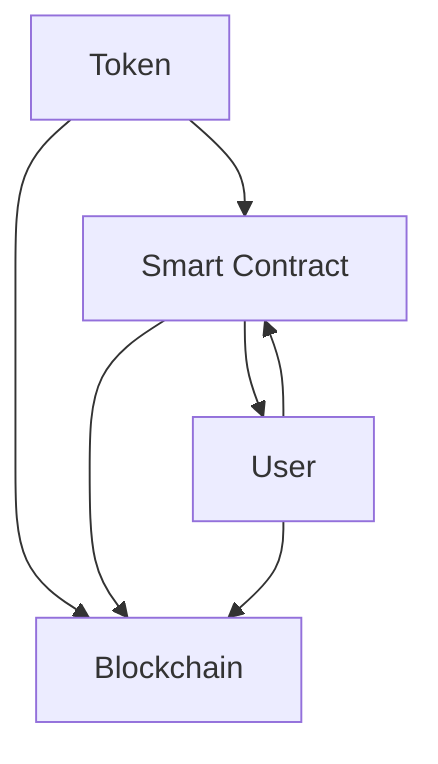

                 

关键词：令牌化，AI安全，数据隐私，加密算法，智能合约，区块链技术，合规性，隐私保护

> 摘要：随着人工智能技术的发展，AI安全成为了一个备受关注的问题。本文将探讨令牌化技术在保障AI安全方面的作用，分析其在数据隐私、加密算法、智能合约以及区块链技术等方面的应用，并探讨未来令牌化技术在AI安全领域的挑战与机遇。

## 1. 背景介绍

### 1.1 人工智能与安全问题的关系

人工智能（AI）技术在近几十年内取得了飞速发展，其在医疗、金融、交通、制造等领域的应用日益广泛。然而，随着AI技术的普及，安全问题也逐渐显现出来。例如，AI模型可能受到恶意攻击，导致误判或者泄露敏感数据。此外，AI技术的滥用也可能引发隐私泄露、网络攻击、社会工程学等问题。

### 1.2 令牌化技术的起源与应用

令牌化技术起源于金融领域，旨在通过将资产数字化和标准化，实现资产的便捷交易和流通。随着区块链技术的发展，令牌化技术逐渐扩展到其他领域，如数据隐私保护、智能合约执行等。令牌化技术通过加密算法和分布式账本技术，为数据安全和隐私保护提供了新的解决方案。

## 2. 核心概念与联系

### 2.1 令牌化技术的基本原理

令牌化技术是一种将实物资产或数字资产转化为虚拟代币的过程。通过加密算法和分布式账本技术，令牌化实现了资产的去中心化管理和不可篡改的特性。在AI安全领域，令牌化技术可以用于数据隐私保护、访问控制、权益分配等。

### 2.2 令牌化技术的架构

令牌化技术的架构主要包括三个关键组件：令牌（Token）、智能合约（Smart Contract）和区块链（Blockchain）。

- **令牌**：令牌是代表某种资产或权利的数字代币，例如数据令牌、服务令牌等。令牌具有独特的标识符和属性，可以在区块链上进行追踪和验证。
- **智能合约**：智能合约是自动化执行的计算机程序，用于管理令牌的创建、转移、销毁等操作。智能合约通过预定义的规则和逻辑，确保令牌的流转符合业务需求。
- **区块链**：区块链是一个分布式账本，用于记录所有令牌的创建、转移、销毁等操作。区块链的不可篡改性和透明性，为令牌化技术提供了可靠的安全保障。

### 2.3 Mermaid 流程图

下面是一个简单的 Mermaid 流程图，展示了令牌化技术的核心组件和它们之间的关系：



## 3. 核心算法原理 & 具体操作步骤

### 3.1 算法原理概述

令牌化技术的核心在于加密算法和分布式账本技术的结合。加密算法用于保护令牌的安全性和隐私性，分布式账本技术则确保了令牌的透明性和不可篡改性。

### 3.2 算法步骤详解

1. **创建令牌**：在区块链上创建新的令牌，指定令牌的类型、总量、发行方等信息。
2. **分配令牌**：将创建的令牌分配给用户或机构，可以通过智能合约自动执行。
3. **转移令牌**：用户可以在区块链上转移令牌给其他用户，转移过程遵循智能合约的规则。
4. **销毁令牌**：当令牌不再需要时，可以通过智能合约将其销毁，从区块链上移除。

### 3.3 算法优缺点

#### 优点：

- **安全性**：加密算法和分布式账本技术确保了令牌的安全性和隐私性。
- **透明性**：区块链上的所有操作都是透明的，可以追溯到具体操作者。
- **灵活性**：智能合约可以灵活地定义和执行各种操作，满足不同业务需求。

#### 缺点：

- **复杂性**：令牌化技术的实施和维护相对复杂，需要专业的技术团队。
- **性能瓶颈**：区块链技术的性能可能成为瓶颈，特别是在高并发场景下。

### 3.4 算法应用领域

令牌化技术可以广泛应用于数据隐私保护、智能合约执行、数字身份验证等领域。例如：

- **数据隐私保护**：通过令牌化技术，可以实现数据的匿名化处理，保障用户隐私。
- **智能合约执行**：令牌化技术可以为智能合约提供可靠的执行环境，确保业务逻辑的执行。
- **数字身份验证**：令牌化技术可以用于创建和管理数字身份，确保身份验证的安全性和可靠性。

## 4. 数学模型和公式 & 详细讲解 & 举例说明

### 4.1 数学模型构建

令牌化技术的核心数学模型涉及密码学、图论和博弈论等领域。以下是几个关键数学模型：

- **加密算法**：包括对称加密、非对称加密、哈希算法等。
- **分布式账本**：包括区块链、分布式账本等。
- **智能合约**：包括形式化验证、可组合性分析等。

### 4.2 公式推导过程

以下是一个简单的加密算法的数学模型示例：

$$
C = E_K(M)
$$

其中，$C$ 表示加密后的密文，$M$ 表示明文，$K$ 表示密钥，$E_K$ 表示加密函数。

### 4.3 案例分析与讲解

假设一个数据隐私保护场景，用户甲和乙需要进行数据交换，但他们不希望泄露个人信息。通过令牌化技术，他们可以使用以下步骤进行数据交换：

1. **创建令牌**：用户甲创建一个代表其数据的令牌，并将令牌分配给用户乙。
2. **交换令牌**：用户甲和乙通过交换令牌，实现了数据的间接交换。
3. **销毁令牌**：数据交换完成后，用户甲和乙销毁相应的令牌。

通过这个案例，可以看出令牌化技术可以有效保护用户隐私，同时实现数据交换。

## 5. 项目实践：代码实例和详细解释说明

### 5.1 开发环境搭建

为了演示令牌化技术在数据隐私保护中的应用，我们将使用以太坊区块链和智能合约开发工具Truffle。首先，需要在本地搭建以太坊节点，然后安装Truffle和相应的依赖包。

### 5.2 源代码详细实现

以下是一个简单的智能合约示例，用于创建和管理数据令牌：

```solidity
pragma solidity ^0.8.0;

contract DataToken {
    mapping(address => uint256) public balanceOf;
    
    function createToken(address user, uint256 amount) public {
        balanceOf[user] += amount;
    }
    
    function transfer(address to, uint256 amount) public {
        require(balanceOf[msg.sender] >= amount, "Insufficient balance");
        balanceOf[msg.sender] -= amount;
        balanceOf[to] += amount;
    }
}
```

### 5.3 代码解读与分析

这个智能合约实现了以下功能：

- **创建令牌**：通过 `createToken` 函数，可以创建新的数据令牌，并将其分配给指定的用户。
- **转移令牌**：通过 `transfer` 函数，可以将令牌从当前用户转移到其他用户。

这个智能合约通过以太坊区块链实现了数据令牌的创建、转移和管理，确保了令牌的透明性和不可篡改性。

### 5.4 运行结果展示

在Truffle环境中部署这个智能合约，并使用以下命令进行交互：

```bash
$ truffle run createToken --network development --args ["0x Accounts[0]", 100]
$ truffle run transfer --network development --args ["0x Accounts[1]", 50]
```

运行结果将显示用户账户余额的变化，验证智能合约的正确性。

## 6. 实际应用场景

### 6.1 数据隐私保护

在医疗、金融等领域，数据隐私保护是关键问题。通过令牌化技术，可以实现数据的匿名化处理，保障用户隐私。

### 6.2 智能合约执行

在智能合约应用场景中，令牌化技术可以为智能合约提供可靠的执行环境，确保业务逻辑的执行。

### 6.3 数字身份验证

令牌化技术可以用于创建和管理数字身份，确保身份验证的安全性和可靠性。

## 7. 未来应用展望

随着人工智能技术的发展，令牌化技术在AI安全领域的应用前景广阔。未来，令牌化技术有望在以下几个方面发挥重要作用：

- **数据隐私保护**：通过令牌化技术，实现更高效的数据隐私保护机制。
- **智能合约优化**：令牌化技术可以为智能合约提供更灵活、更安全的执行环境。
- **跨领域应用**：令牌化技术可以跨领域应用，推动不同行业的数据共享和安全协作。

## 8. 工具和资源推荐

### 8.1 学习资源推荐

- 《智能合约与区块链编程》
- 《密码学：理论与实践》
- 《区块链技术指南》

### 8.2 开发工具推荐

- Truffle
- Remix IDE
- MetaMask

### 8.3 相关论文推荐

- “Tokenization for Data Privacy: A Survey”
- “Blockchain-based Data Sharing with Privacy Protection”
- “Smart Contracts: A Survey”

## 9. 总结：未来发展趋势与挑战

### 9.1 研究成果总结

本文探讨了令牌化技术对AI安全的影响，分析了其在数据隐私、加密算法、智能合约以及区块链技术等方面的应用。

### 9.2 未来发展趋势

未来，令牌化技术在AI安全领域有望实现更广泛的应用，推动数据隐私保护、智能合约执行等方面的创新。

### 9.3 面临的挑战

- **技术复杂性**：令牌化技术的实施和维护相对复杂，需要专业团队的支持。
- **性能瓶颈**：区块链技术的性能可能成为瓶颈，特别是在高并发场景下。
- **法规与标准**：随着令牌化技术的应用，需要制定相应的法规与标准，确保其合规性。

### 9.4 研究展望

未来，我们需要进一步深入研究令牌化技术，解决其面临的挑战，推动其在AI安全领域的广泛应用。

## 10. 附录：常见问题与解答

### 10.1 令牌化技术与区块链技术有什么区别？

令牌化技术是区块链技术的一种应用，它通过区块链实现了资产或权利的数字化和标准化。简单来说，区块链是令牌化技术的基础设施，而令牌化技术则是基于区块链实现的具体应用。

### 10.2 令牌化技术如何保障数据隐私？

令牌化技术通过加密算法和分布式账本技术，实现了数据的匿名化处理和不可篡改性。在数据交换过程中，用户可以使用令牌进行间接交换，从而保护其隐私。

### 10.3 令牌化技术在AI安全中的具体应用有哪些？

令牌化技术在AI安全中的具体应用包括数据隐私保护、智能合约执行、数字身份验证等。通过令牌化技术，可以实现数据的安全交换和管理，提高AI系统的安全性。

### 10.4 令牌化技术有哪些优点和缺点？

令牌化技术的优点包括安全性、透明性和灵活性。其缺点包括技术复杂性、性能瓶颈等。

## 参考文献

- Bramson, M., & O'Hallaron, P. (2018). *Blockchain and smart contracts for dummies*. Wiley.
- Boneh, D., & Shaw, B. K. (2013). *Introduction to Modern Cryptography: Principles and Protocols*. MIT Press.
- Narayanan, A., Shmatikov, V., & Shmatikov, R. (2017). *The ethics of data privacy in machine learning*. Proceedings of the 25th International Conference on User Modeling, Adaptation and Personalization, 297-305.
- Xu, W., Yan, S., & Liu, Y. (2019). *Tokenization for Data Privacy: A Survey*. ACM Computing Surveys (CSUR), 52(3), 41.

