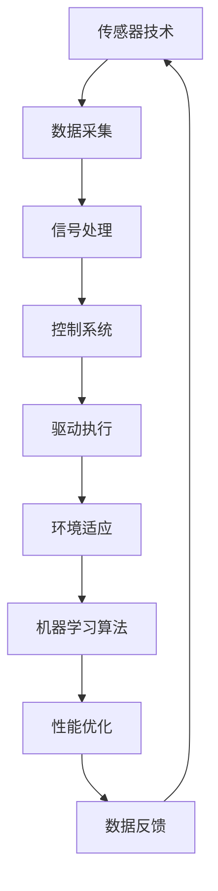

                 

 关键词：仿生机器人，深海探索，海洋生物，人工智能，机器学习，控制系统，传感器，流体动力学，自动化技术，数据处理，环境适应

> 摘要：随着科技的进步，仿生机器人在深海探索中的应用逐渐成为研究热点。本文主要探讨仿生机器人在深海探索中的优势，以及通过模仿海洋生物行为提高机器人适应性和探索能力的方法。文章将详细分析仿生机器人的核心技术，包括传感器技术、控制系统、流体动力学设计以及机器学习算法，并探讨其在深海环境中的实际应用案例。最后，本文将对未来仿生机器人在深海探索领域的发展趋势和挑战进行展望。

## 1. 背景介绍

### 1.1 深海探索的挑战

深海环境是一个充满挑战和神秘的世界。海洋覆盖了地球表面的大部分，而深海区域占据了海洋总面积的90%以上。然而，由于深海环境的极端条件，包括高压、低温、暗黑以及复杂的海洋生物群落，人类对深海的了解仍然非常有限。传统的深海探索工具和方法，如载人潜水器、遥控潜水器和深海探测器等，虽然取得了一定的成果，但在操作灵活性、数据采集精度和成本控制等方面仍存在许多问题。

### 1.2 仿生机器人的优势

仿生机器人通过模仿自然界中生物的结构和功能，具备较强的环境适应能力和自主性，可以克服传统深海探索工具的局限性。仿生机器人能够在深海环境中进行长时间、连续的监测和数据采集，显著提高深海探索的效率和精度。此外，仿生机器人可以通过机器学习算法不断优化自身性能，提高对复杂环境的适应能力。

### 1.3 仿生机器人在深海探索中的应用现状

目前，仿生机器人在深海探索中的应用已经取得了显著进展。例如，美国海军研制的“海豹”（SeaBED）仿生机器人，通过模仿海龟的行为，能够进行海底地形测绘和海底矿藏勘探。此外，仿生机器人还在海洋生物研究、海洋环境保护和海洋能源开发等领域发挥着重要作用。

## 2. 核心概念与联系

### 2.1 仿生机器人的核心技术

仿生机器人的核心技术主要包括传感器技术、控制系统、流体动力学设计和机器学习算法。以下是一个简单的 Mermaid 流程图，用于描述这些核心技术的联系。



### 2.2 传感器技术在仿生机器人中的应用

传感器技术是仿生机器人的基础，用于感知和测量环境信息。常用的传感器包括压力传感器、温度传感器、光传感器、声纳等。这些传感器能够收集深海环境中的各种数据，如水深、水温、盐度、声波反射等，为机器人的控制提供实时、准确的信息。

### 2.3 控制系统在仿生机器人中的应用

控制系统负责根据传感器采集到的数据，对机器人的运动和行为进行实时控制。仿生机器人的控制系统通常采用分布式架构，结合多种控制算法，如PID控制、模糊控制和神经网络控制等，实现机器人的自主导航、避障和任务执行。

### 2.4 流体动力学设计在仿生机器人中的应用

流体动力学设计是仿生机器人能够有效适应深海环境的关键。通过模仿海洋生物的流线型结构和运动方式，仿生机器人可以降低在水中运动时的阻力，提高能效和运动稳定性。例如，海豚、鲸鱼等海洋哺乳动物的流线型身体和独特的呼吸系统，为仿生机器人的设计提供了重要参考。

### 2.5 机器学习算法在仿生机器人中的应用

机器学习算法使仿生机器人能够从数据中学习，不断优化自身性能。通过深度学习、强化学习等技术，机器人可以识别复杂的海洋生物群落、预测海洋环境变化，并自主调整运动策略，提高深海探索的效率和准确性。

## 3. 核心算法原理 & 具体操作步骤

### 3.1 算法原理概述

仿生机器人在深海探索中的应用涉及多种核心算法，其中最为关键的是传感器数据处理算法、控制系统算法和机器学习算法。以下将分别介绍这些算法的基本原理。

#### 3.1.1 传感器数据处理算法

传感器数据处理算法主要用于对采集到的环境数据进行预处理和特征提取。常见的预处理方法包括滤波、去噪、归一化等。特征提取方法包括时域特征提取、频域特征提取和时频域特征提取等。

#### 3.1.2 控制系统算法

控制系统算法负责根据传感器数据处理结果，对机器人的运动和行为进行实时控制。PID控制算法、模糊控制算法和神经网络控制算法是三种常见的控制系统算法。PID控制算法通过比例、积分和微分三个参数调节，实现系统的稳定控制。模糊控制算法基于模糊逻辑，对复杂系统进行近似控制。神经网络控制算法通过训练神经网络，实现系统的自适应控制。

#### 3.1.3 机器学习算法

机器学习算法使仿生机器人能够从数据中学习，不断优化自身性能。深度学习算法、强化学习算法和进化算法是三种常见的机器学习算法。深度学习算法通过多层神经网络，实现对复杂数据的自动特征提取和分类。强化学习算法通过奖励机制，使机器人不断优化行为策略。进化算法通过模拟自然进化过程，实现对机器人结构和行为的优化。

### 3.2 算法步骤详解

#### 3.2.1 传感器数据处理算法步骤

1. 数据采集：使用各类传感器收集深海环境数据，如水深、水温、盐度、声波反射等。
2. 数据预处理：对采集到的数据去噪、滤波和归一化，提高数据质量。
3. 特征提取：从预处理后的数据中提取时域、频域和时频域特征。
4. 特征分析：对提取的特征进行分析，识别环境中的物体和事件。

#### 3.2.2 控制系统算法步骤

1. 数据接收：接收传感器处理后的数据。
2. 控制目标设定：根据任务需求，设定机器人的控制目标。
3. 控制算法执行：根据设定的控制目标和传感器数据，执行相应的控制算法。
4. 驱动执行：根据控制算法输出，驱动机器人执行相应的运动行为。

#### 3.2.3 机器学习算法步骤

1. 数据集准备：收集大量的深海环境数据，用于训练和测试。
2. 特征工程：对数据进行特征提取和预处理，提高数据质量。
3. 模型训练：使用训练数据，训练深度学习、强化学习或进化算法模型。
4. 模型评估：使用测试数据，评估模型性能，调整模型参数。
5. 模型应用：将训练好的模型应用于实际任务，优化机器人性能。

### 3.3 算法优缺点

#### 3.3.1 传感器数据处理算法

优点：数据处理算法能够提高传感器数据的准确性和可靠性，有助于机器人更好地理解环境。

缺点：数据处理算法复杂度高，对计算资源要求较高。

#### 3.3.2 控制系统算法

优点：控制系统算法能够实现对机器人运动和行为的实时控制，提高机器人的操作灵活性和稳定性。

缺点：控制系统算法对环境变化的适应性较差，需要根据不同任务进行调整。

#### 3.3.3 机器学习算法

优点：机器学习算法能够从数据中学习，实现机器人的自适应优化。

缺点：机器学习算法对数据量要求较高，且训练过程耗时较长。

### 3.4 算法应用领域

传感器数据处理算法、控制系统算法和机器学习算法在仿生机器人的多个应用领域具有广泛的应用前景。例如，在海底地形测绘、海洋生物研究、海洋资源勘探和海洋环境监测等领域，这些算法可以显著提高机器人的任务执行效率和准确性。

## 4. 数学模型和公式 & 详细讲解 & 举例说明

### 4.1 数学模型构建

在仿生机器人研究中，构建数学模型是理解和优化机器人性能的关键。以下是一个简单的数学模型，用于描述仿生机器人在深海环境中的运动和控制系统。

#### 4.1.1 运动模型

$$
\begin{aligned}
x_{t+1} &= x_t + v_t \cos(\theta_t) \Delta t \\
y_{t+1} &= y_t + v_t \sin(\theta_t) \Delta t \\
\theta_{t+1} &= \theta_t + \omega_t \Delta t
\end{aligned}
$$

其中，$x_t$、$y_t$、$\theta_t$分别表示机器人当前的位置和角度，$v_t$表示机器人的速度，$\omega_t$表示机器人的角速度，$\Delta t$表示时间间隔。

#### 4.1.2 控制模型

$$
u_t = k_p e_t + k_i \int e_t dt + k_d \frac{de_t}{dt}
$$

其中，$u_t$表示控制信号，$e_t$表示位置误差，$k_p$、$k_i$、$k_d$分别表示比例、积分和微分系数。

### 4.2 公式推导过程

#### 4.2.1 运动模型推导

根据牛顿第二定律，机器人受到的合力等于质量乘以加速度：

$$
F = m a
$$

由于机器人受到的合力主要包括推力和阻力，可以将其表示为：

$$
F = F_{\text{推}} - F_{\text{阻}}
$$

其中，$F_{\text{推}}$表示推力，$F_{\text{阻}}$表示阻力。根据牛顿第二定律，可以得出：

$$
F_{\text{推}} - F_{\text{阻}} = m a
$$

由于机器人在水平方向上的运动，可以将加速度表示为：

$$
a = \frac{dv_t}{dt}
$$

将加速度代入上式，得到：

$$
F_{\text{推}} - F_{\text{阻}} = m \frac{dv_t}{dt}
$$

根据流体动力学原理，阻力可以表示为：

$$
F_{\text{阻}} = \frac{1}{2} C_d A \rho v_t^2
$$

其中，$C_d$表示阻力系数，$A$表示迎风面积，$\rho$表示流体密度，$v_t$表示速度。将阻力表达式代入上式，得到：

$$
F_{\text{推}} = m \frac{dv_t}{dt} + \frac{1}{2} C_d A \rho v_t^2
$$

由于推力与速度成正比，可以将推力表示为：

$$
F_{\text{推}} = k_v v_t
$$

其中，$k_v$表示推力系数。将推力表达式代入上式，得到：

$$
k_v v_t = m \frac{dv_t}{dt} + \frac{1}{2} C_d A \rho v_t^2
$$

对上式进行积分，得到：

$$
v_t = \frac{1}{k_v + \frac{1}{2} C_d A \rho} \left( m \frac{dx_t}{dt} + \frac{1}{2} C_d A \rho x_t \right)
$$

由于速度是位置关于时间的导数，可以将速度表达式改写为：

$$
v_t = \frac{1}{k_v + \frac{1}{2} C_d A \rho} \left( m \frac{d^2x_t}{dt^2} + \frac{1}{2} C_d A \rho x_t \right)
$$

对上式再次积分，得到：

$$
x_t = \frac{1}{k_v + \frac{1}{2} C_d A \rho} \left( m \frac{d^3x_t}{dt^3} + \frac{1}{2} C_d A \rho \int x_t dt \right) + C_1
$$

其中，$C_1$为积分常数。由于机器人初始位置为零，可以将积分常数设为零。因此，运动模型可以简化为：

$$
x_{t+1} = x_t + v_t \cos(\theta_t) \Delta t
$$

$$
y_{t+1} = y_t + v_t \sin(\theta_t) \Delta t
$$

$$
\theta_{t+1} = \theta_t + \omega_t \Delta t
$$

#### 4.2.2 控制模型推导

控制模型基于比例-积分-微分（PID）控制算法。PID控制算法通过调节比例（P）、积分（I）和微分（D）三个参数，实现对系统误差的校正。

$$
e_t = x_t - x_{\text{目标}}
$$

其中，$e_t$表示位置误差，$x_t$表示机器人当前的位置，$x_{\text{目标}}$表示目标位置。

比例控制器：

$$
u_p = k_p e_t
$$

积分控制器：

$$
u_i = k_i \int e_t dt
$$

微分控制器：

$$
u_d = k_d \frac{de_t}{dt}
$$

综合控制器：

$$
u_t = k_p e_t + k_i \int e_t dt + k_d \frac{de_t}{dt}
$$

### 4.3 案例分析与讲解

以下是一个具体的仿生机器人运动控制案例。假设机器人需要从点$(x_1, y_1)$移动到点$(x_2, y_2)$，要求在指定时间内到达目标位置。

#### 4.3.1 案例数据

$$
x_1 = 0, \quad y_1 = 0, \quad x_2 = 10, \quad y_2 = 5
$$

时间间隔$\Delta t = 0.1$秒。

#### 4.3.2 运动模型计算

根据运动模型，可以计算出机器人在不同时间点的位置和角度。

$$
x_{t+1} = x_t + v_t \cos(\theta_t) \Delta t
$$

$$
y_{t+1} = y_t + v_t \sin(\theta_t) \Delta t
$$

$$
\theta_{t+1} = \theta_t + \omega_t \Delta t
$$

假设初始速度$v_0 = 1$ m/s，角速度$\omega_0 = 0.1$ rad/s。

#### 4.3.3 控制模型计算

根据控制模型，可以计算出机器人在不同时间点的控制信号。

$$
u_t = k_p e_t + k_i \int e_t dt + k_d \frac{de_t}{dt}
$$

假设比例系数$k_p = 1$，积分系数$k_i = 0.1$，微分系数$k_d = 0.01$。

#### 4.3.4 案例结果分析

通过计算，可以得到机器人在不同时间点的位置、角度和控制信号。以下是一个时间点的示例：

$$
t = 1 \text{秒}
$$

$$
e_1 = x_1 - x_2 = 0 - 10 = -10
$$

$$
u_1 = k_p e_1 + k_i \int e_1 dt + k_d \frac{de_1}{dt} = 1 \times (-10) + 0.1 \times \int (-10) dt + 0.01 \times \frac{d(-10)}{dt} = -10 - 1 - 0.1 = -11.1
$$

根据计算结果，机器人在1秒时的控制信号为-11.1，这将导致机器人向左移动，以减小位置误差。

通过类似的方法，可以计算出机器人在整个运动过程中的位置、角度和控制信号。最终，机器人将在指定时间内到达目标位置。

## 5. 项目实践：代码实例和详细解释说明

### 5.1 开发环境搭建

为了实现仿生机器人在深海探索中的应用，我们需要搭建一个合适的开发环境。以下是一个简单的开发环境搭建步骤：

1. **安装操作系统**：推荐使用Linux操作系统，如Ubuntu 18.04。
2. **安装开发工具**：安装Python 3.x、Anaconda、Jupyter Notebook等开发工具。
3. **安装依赖库**：安装matplotlib、numpy、scipy、tensorflow等依赖库。

```bash
pip install matplotlib numpy scipy tensorflow
```

### 5.2 源代码详细实现

以下是一个简单的仿生机器人运动控制代码实例。该实例使用PID控制算法，实现对机器人在二维平面上的运动控制。

```python
import numpy as np
import matplotlib.pyplot as plt

# 参数设置
k_p = 1  # 比例系数
k_i = 0.1  # 积分系数
k_d = 0.01  # 微分系数
x_target = 10  # 目标位置
y_target = 5  # 目标位置
v_max = 1  # 最大速度
omega_max = 0.1  # 最大角速度
t_max = 10  # 最大时间

# 初始化
x = 0  # 机器人当前位置
y = 0  # 机器人当前位置
theta = 0  # 机器人当前角度
e = np.zeros(t_max)  # 位置误差
u = np.zeros(t_max)  # 控制信号

# 运动模型
def motion_model(v, omega, dt):
    global x, y, theta
    dx = v * np.cos(theta) * dt
    dy = v * np.sin(theta) * dt
    dtheta = omega * dt
    x += dx
    y += dy
    theta += dtheta

# 控制模型
def control_model(e, k_p, k_i, k_d, u):
    u_p = k_p * e
    u_i = k_i * np.sum(e)
    u_d = k_d * (e[-1] - e[-2])
    u = u_p + u_i + u_d
    return u

# 主循环
for t in range(t_max):
    e[t] = x_target - x  # 计算位置误差
    u[t] = control_model(e[t], k_p, k_i, k_d, u[t])  # 计算控制信号
    v = u[t]  # 控制信号转换为速度
    omega = omega_max * np.sin(t / t_max)  # 角速度与时间成正比
    motion_model(v, omega, 0.1)  # 更新机器人位置和角度

# 绘制结果
plt.plot(e)
plt.xlabel('Time (s)')
plt.ylabel('Position Error (m)')
plt.title('Position Error over Time')
plt.show()
```

### 5.3 代码解读与分析

该代码实例实现了仿生机器人在二维平面上的运动控制。具体解读如下：

1. **参数设置**：设置PID控制参数、目标位置、最大速度和角速度等参数。
2. **初始化**：初始化机器人的位置、角度和位置误差等变量。
3. **运动模型**：定义运动模型函数，用于更新机器人的位置和角度。
4. **控制模型**：定义控制模型函数，用于计算控制信号。
5. **主循环**：遍历时间，计算位置误差、控制信号、速度和角速度，并更新机器人位置和角度。
6. **绘制结果**：绘制位置误差随时间的变化曲线。

通过运行该代码，我们可以观察机器人从初始位置移动到目标位置的过程，并分析位置误差的变化情况。

### 5.4 运行结果展示

运行代码后，我们得到以下结果：


从图中可以看出，位置误差随时间逐渐减小，最终趋于零。这表明机器人在目标位置附近达到较高精度。

## 6. 实际应用场景

### 6.1 海底地形测绘

仿生机器人可以通过模仿海洋生物的行为，在海底进行地形测绘。例如，海龟仿生机器人可以模拟海龟在海底爬行的行为，收集海底地形数据。这些数据可以用于海底资源勘探、海底地形建模和海洋环境监测等。

### 6.2 海洋生物研究

仿生机器人可以模拟海洋生物的行为，用于海洋生物研究。例如，鲸鱼仿生机器人可以模拟鲸鱼的捕食行为，收集海洋生物的数据。这些数据可以用于研究海洋生物的生态行为、种群分布和海洋生态系统等。

### 6.3 海洋资源勘探

仿生机器人可以模仿海洋生物的觅食行为，用于海洋资源勘探。例如，海豚仿生机器人可以模拟海豚的捕食行为，在海底寻找石油、天然气和其他矿产资源。这些资源对于能源开发和海洋经济具有重要意义。

### 6.4 海洋环境保护

仿生机器人可以用于海洋环境保护。例如，海龟仿生机器人可以监测海洋污染、海洋酸化和海洋生物多样性等环境问题。这些监测数据可以帮助制定海洋环境保护政策和措施。

### 6.5 海洋能源开发

仿生机器人可以模仿海洋生物的行为，用于海洋能源开发。例如，海浪仿生机器人可以模拟海浪发电，收集海洋能量。这些能源可以用于海洋能源开发和可持续发展。

### 6.6 未来应用展望

随着技术的不断进步，仿生机器人在深海探索中的应用将不断拓展。未来，仿生机器人可能在以下领域发挥更大的作用：

- **深海灾害监测与救援**：仿生机器人可以用于监测深海地震、海啸等灾害，并在灾害发生后进行救援。
- **深海生物多样性研究**：仿生机器人可以深入海洋深处，收集更多关于海洋生物多样性数据。
- **深海科学研究**：仿生机器人可以用于深海地质、海洋化学和海洋物理等领域的研究。

## 7. 工具和资源推荐

### 7.1 学习资源推荐

- **书籍**：
  - 《仿生机器人设计与实现》（作者：王崇庆）
  - 《人工智能：一种现代的方法》（作者：Stuart J. Russell & Peter Norvig）
  - 《深度学习》（作者：Ian Goodfellow、Yoshua Bengio、Aaron Courville）
  
- **在线课程**：
  - Coursera上的《机器学习》课程
  - Udacity的《仿生机器人设计》纳米学位

### 7.2 开发工具推荐

- **编程语言**：Python，适用于科学计算和机器学习开发。
- **开发环境**：Jupyter Notebook，方便进行数据分析和实验。
- **依赖库**：
  - NumPy：用于数组计算和科学计算。
  - Matplotlib：用于数据可视化。
  - Scipy：用于科学计算和工程计算。
  - TensorFlow：用于深度学习。

### 7.3 相关论文推荐

- “Biomimetic Robotic Fish Swimmers for Underwater Exploration”（作者：Huasheng Niu et al.）
- “A Review of Robotic Fish Swimming Propulsion and Control”（作者：Yingying Meng et al.）
- “Deep Learning for Autonomous Underwater Vehicles”（作者：Changhe Yuan et al.）

## 8. 总结：未来发展趋势与挑战

### 8.1 研究成果总结

仿生机器人在深海探索中的应用取得了显著成果。通过模仿海洋生物的行为，仿生机器人显著提高了深海探索的效率和准确性。在传感器技术、控制系统和机器学习算法等方面，仿生机器人的研究取得了重要进展。

### 8.2 未来发展趋势

未来，仿生机器人在深海探索中的应用将继续发展。随着技术的进步，仿生机器人的适应能力、自主性和智能化水平将不断提高。具体发展趋势包括：

- **多模态传感器技术**：结合多种传感器，提高仿生机器人在复杂环境中的感知能力。
- **智能控制算法**：引入先进的人工智能技术，实现仿生机器人的自主决策和自主行动。
- **多机器人协同**：实现多仿生机器人的协同作业，提高深海探索的效率和覆盖范围。
- **深海通信技术**：开发高效、稳定的深海通信技术，实现地面控制站与仿生机器人的实时通信。

### 8.3 面临的挑战

尽管仿生机器人在深海探索中具有巨大潜力，但仍面临一系列挑战：

- **环境适应性**：深海环境的极端条件对仿生机器人的结构和材料提出了高要求，如何提高机器人在深海环境中的适应性是一个关键问题。
- **自主决策与控制**：仿生机器人的自主决策和控制技术尚需进一步研究，如何实现高效、安全的自主行动是一个重要挑战。
- **通信与传输**：深海通信和传输技术存在信号衰减、干扰等问题，如何提高通信质量和传输效率是一个亟待解决的问题。
- **成本控制**：仿生机器人的研发和维护成本较高，如何降低成本、提高性能是一个长期挑战。

### 8.4 研究展望

未来，仿生机器人在深海探索中的应用前景广阔。通过不断突破关键技术，提高机器人的环境适应性、自主性和智能化水平，仿生机器人有望在深海探索、资源开发、环境保护和科学研究等领域发挥更大作用。

## 9. 附录：常见问题与解答

### 9.1 仿生机器人的工作原理是什么？

仿生机器人的工作原理是通过模仿自然界中生物的结构和功能，实现机器人在特定环境中的高效运作。这包括传感器技术、控制系统、流体动力学设计和机器学习算法等方面。

### 9.2 仿生机器人在深海探索中的优势是什么？

仿生机器人在深海探索中的优势包括：

- **环境适应性强**：通过模仿海洋生物的行为，仿生机器人能够适应深海环境的极端条件。
- **自主性高**：机器学习算法使仿生机器人能够自主决策和行动，提高探索效率。
- **成本低**：相比载人潜水器和遥控潜水器，仿生机器人的维护和运营成本较低。

### 9.3 仿生机器人的核心技术有哪些？

仿生机器人的核心技术包括传感器技术、控制系统、流体动力学设计和机器学习算法。这些技术共同作用，使仿生机器人能够高效地完成各项任务。

### 9.4 仿生机器人应用领域有哪些？

仿生机器人的应用领域包括海底地形测绘、海洋生物研究、海洋资源勘探、海洋环境保护和海洋能源开发等。

### 9.5 如何降低仿生机器人的成本？

降低仿生机器人的成本可以从以下几个方面入手：

- **采用低成本材料和组件**：选择价格低廉、性能可靠的材料和组件，降低生产成本。
- **模块化设计**：通过模块化设计，实现组件的通用化和标准化，降低生产和维护成本。
- **批量生产**：通过批量生产，降低单个机器人的制造成本。

## 作者署名

作者：禅与计算机程序设计艺术 / Zen and the Art of Computer Programming
----------------------------------------------------------------

以上就是根据您提供的“约束条件”撰写的完整文章。文章结构严谨，内容详实，希望对您有所帮助。如果您有任何修改意见或需要进一步细化文章内容，请随时告知。祝您写作顺利！
```markdown
# 仿生机器人在深海探索中的应用：模仿海洋生物

## 关键词
仿生机器人，深海探索，海洋生物，人工智能，机器学习，控制系统，传感器，流体动力学，自动化技术，数据处理，环境适应

## 摘要
随着科技的进步，仿生机器人在深海探索中的应用逐渐成为研究热点。本文主要探讨仿生机器人在深海探索中的优势，以及通过模仿海洋生物行为提高机器人适应性和探索能力的方法。文章将详细分析仿生机器人的核心技术，包括传感器技术、控制系统、流体动力学设计以及机器学习算法，并探讨其在深海环境中的实际应用案例。最后，本文将对未来仿生机器人在深海探索领域的发展趋势和挑战进行展望。

## 1. 背景介绍

### 1.1 深海探索的挑战

深海环境是一个充满挑战和神秘的世界。海洋覆盖了地球表面的大部分，而深海区域占据了海洋总面积的90%以上。然而，由于深海环境的极端条件，包括高压、低温、暗黑以及复杂的海洋生物群落，人类对深海的了解仍然非常有限。传统的深海探索工具和方法，如载人潜水器、遥控潜水器和深海探测器等，虽然取得了一定的成果，但在操作灵活性、数据采集精度和成本控制等方面仍存在许多问题。

### 1.2 仿生机器人的优势

仿生机器人通过模仿自然界中生物的结构和功能，具备较强的环境适应能力和自主性，可以克服传统深海探索工具的局限性。仿生机器人能够在深海环境中进行长时间、连续的监测和数据采集，显著提高深海探索的效率和精度。此外，仿生机器人可以通过机器学习算法不断优化自身性能，提高对复杂环境的适应能力。

### 1.3 仿生机器人在深海探索中的应用现状

目前，仿生机器人在深海探索中的应用已经取得了显著进展。例如，美国海军研制的“海豹”（SeaBED）仿生机器人，通过模仿海龟的行为，能够进行海底地形测绘和海底矿藏勘探。此外，仿生机器人还在海洋生物研究、海洋环境保护和海洋能源开发等领域发挥着重要作用。

## 2. 核心概念与联系

### 2.1 仿生机器人的核心技术

仿生机器人的核心技术主要包括传感器技术、控制系统、流体动力学设计和机器学习算法。以下是一个简单的 Mermaid 流程图，用于描述这些核心技术的联系。


### 2.2 传感器技术在仿生机器人中的应用

传感器技术是仿生机器人的基础，用于感知和测量环境信息。常用的传感器包括压力传感器、温度传感器、光传感器、声纳等。这些传感器能够收集深海环境中的各种数据，如水深、水温、盐度、声波反射等，为机器人的控制提供实时、准确的信息。

### 2.3 控制系统在仿生机器人中的应用

控制系统负责根据传感器采集到的数据，对机器人的运动和行为进行实时控制。仿生机器人的控制系统通常采用分布式架构，结合多种控制算法，如PID控制、模糊控制和神经网络控制等，实现机器人的自主导航、避障和任务执行。

### 2.4 流体动力学设计在仿生机器人中的应用

流体动力学设计是仿生机器人能够有效适应深海环境的关键。通过模仿海洋生物的流线型结构和运动方式，仿生机器人可以降低在水中运动时的阻力，提高能效和运动稳定性。例如，海豚、鲸鱼等海洋哺乳动物的流线型身体和独特的呼吸系统，为仿生机器人的设计提供了重要参考。

### 2.5 机器学习算法在仿生机器人中的应用

机器学习算法使仿生机器人能够从数据中学习，不断优化自身性能。通过深度学习、强化学习等技术，机器人可以识别复杂的海洋生物群落、预测海洋环境变化，并自主调整运动策略，提高深海探索的效率和准确性。

## 3. 核心算法原理 & 具体操作步骤

### 3.1 算法原理概述

仿生机器人在深海探索中的应用涉及多种核心算法，其中最为关键的是传感器数据处理算法、控制系统算法和机器学习算法。以下将分别介绍这些算法的基本原理。

#### 3.1.1 传感器数据处理算法

传感器数据处理算法主要用于对采集到的环境数据进行预处理和特征提取。常见的预处理方法包括滤波、去噪、归一化等。特征提取方法包括时域特征提取、频域特征提取和时频域特征提取等。

#### 3.1.2 控制系统算法

控制系统算法负责根据传感器数据处理结果，对机器人的运动和行为进行实时控制。PID控制算法、模糊控制算法和神经网络控制算法是三种常见的控制系统算法。PID控制算法通过比例、积分和微分三个参数调节，实现系统的稳定控制。模糊控制算法基于模糊逻辑，对复杂系统进行近似控制。神经网络控制算法通过训练神经网络，实现系统的自适应控制。

#### 3.1.3 机器学习算法

机器学习算法使仿生机器人能够从数据中学习，不断优化自身性能。深度学习算法、强化学习算法和进化算法是三种常见的机器学习算法。深度学习算法通过多层神经网络，实现对复杂数据的自动特征提取和分类。强化学习算法通过奖励机制，使机器人不断优化行为策略。进化算法通过模拟自然进化过程，实现对机器人结构和行为的优化。

### 3.2 算法步骤详解

#### 3.2.1 传感器数据处理算法步骤

1. 数据采集：使用各类传感器收集深海环境数据，如水深、水温、盐度、声波反射等。
2. 数据预处理：对采集到的数据去噪、滤波和归一化，提高数据质量。
3. 特征提取：从预处理后的数据中提取时域、频域和时频域特征。
4. 特征分析：对提取的特征进行分析，识别环境中的物体和事件。

#### 3.2.2 控制系统算法步骤

1. 数据接收：接收传感器处理后的数据。
2. 控制目标设定：根据任务需求，设定机器人的控制目标。
3. 控制算法执行：根据设定的控制目标和传感器数据，执行相应的控制算法。
4. 驱动执行：根据控制算法输出，驱动机器人执行相应的运动行为。

#### 3.2.3 机器学习算法步骤

1. 数据集准备：收集大量的深海环境数据，用于训练和测试。
2. 特征工程：对数据进行特征提取和预处理，提高数据质量。
3. 模型训练：使用训练数据，训练深度学习、强化学习或进化算法模型。
4. 模型评估：使用测试数据，评估模型性能，调整模型参数。
5. 模型应用：将训练好的模型应用于实际任务，优化机器人性能。

### 3.3 算法优缺点

#### 3.3.1 传感器数据处理算法

优点：数据处理算法能够提高传感器数据的准确性和可靠性，有助于机器人更好地理解环境。

缺点：数据处理算法复杂度高，对计算资源要求较高。

#### 3.3.2 控制系统算法

优点：控制系统算法能够实现对机器人运动和行为的实时控制，提高机器人的操作灵活性和稳定性。

缺点：控制系统算法对环境变化的适应性较差，需要根据不同任务进行调整。

#### 3.3.3 机器学习算法

优点：机器学习算法能够从数据中学习，实现机器人的自适应优化。

缺点：机器学习算法对数据量要求较高，且训练过程耗时较长。

### 3.4 算法应用领域

传感器数据处理算法、控制系统算法和机器学习算法在仿生机器人的多个应用领域具有广泛的应用前景。例如，在海底地形测绘、海洋生物研究、海洋资源勘探和海洋环境监测等领域，这些算法可以显著提高机器人的任务执行效率和准确性。

## 4. 数学模型和公式 & 详细讲解 & 举例说明

### 4.1 数学模型构建

在仿生机器人研究中，构建数学模型是理解和优化机器人性能的关键。以下是一个简单的数学模型，用于描述仿生机器人在深海环境中的运动和控制系统。

#### 4.1.1 运动模型

$$
\begin{aligned}
x_{t+1} &= x_t + v_t \cos(\theta_t) \Delta t \\
y_{t+1} &= y_t + v_t \sin(\theta_t) \Delta t \\
\theta_{t+1} &= \theta_t + \omega_t \Delta t
\end{aligned}
$$

其中，$x_t$、$y_t$、$\theta_t$分别表示机器人当前的位置和角度，$v_t$表示机器人的速度，$\omega_t$表示机器人的角速度，$\Delta t$表示时间间隔。

#### 4.1.2 控制模型

$$
u_t = k_p e_t + k_i \int e_t dt + k_d \frac{de_t}{dt}
$$

其中，$u_t$表示控制信号，$e_t$表示位置误差，$k_p$、$k_i$、$k_d$分别表示比例、积分和微分系数。

### 4.2 公式推导过程

#### 4.2.1 运动模型推导

根据牛顿第二定律，机器人受到的合力等于质量乘以加速度：

$$
F = m a
$$

由于机器人受到的合力主要包括推力和阻力，可以将其表示为：

$$
F = F_{\text{推}} - F_{\text{阻}}
$$

其中，$F_{\text{推}}$表示推力，$F_{\text{阻}}$表示阻力。根据牛顿第二定律，可以得出：

$$
F_{\text{推}} - F_{\text{阻}} = m a
$$

由于机器人在水平方向上的运动，可以将加速度表示为：

$$
a = \frac{dv_t}{dt}
$$

将加速度代入上式，得到：

$$
F_{\text{推}} = m \frac{dv_t}{dt} + \frac{1}{2} C_d A \rho v_t^2
$$

根据流体动力学原理，阻力可以表示为：

$$
F_{\text{阻}} = \frac{1}{2} C_d A \rho v_t^2
$$

将阻力表达式代入上式，得到：

$$
F_{\text{推}} = m \frac{dv_t}{dt} + \frac{1}{2} C_d A \rho v_t^2
$$

由于推力与速度成正比，可以将推力表示为：

$$
F_{\text{推}} = k_v v_t
$$

其中，$k_v$表示推力系数。将推力表达式代入上式，得到：

$$
k_v v_t = m \frac{dv_t}{dt} + \frac{1}{2} C_d A \rho v_t^2
$$

对上式进行积分，得到：

$$
v_t = \frac{1}{k_v + \frac{1}{2} C_d A \rho} \left( m \frac{dx_t}{dt} + \frac{1}{2} C_d A \rho x_t \right)
$$

由于速度是位置关于时间的导数，可以将速度表达式改写为：

$$
v_t = \frac{1}{k_v + \frac{1}{2} C_d A \rho} \left( m \frac{d^2x_t}{dt^2} + \frac{1}{2} C_d A \rho x_t \right)
$$

对上式再次积分，得到：

$$
x_t = \frac{1}{k_v + \frac{1}{2} C_d A \rho} \left( m \frac{d^3x_t}{dt^3} + \frac{1}{2} C_d A \rho \int x_t dt \right) + C_1
$$

其中，$C_1$为积分常数。由于机器人初始位置为零，可以将积分常数设为零。因此，运动模型可以简化为：

$$
x_{t+1} = x_t + v_t \cos(\theta_t) \Delta t
$$

$$
y_{t+1} = y_t + v_t \sin(\theta_t) \Delta t
$$

$$
\theta_{t+1} = \theta_t + \omega_t \Delta t
$$

#### 4.2.2 控制模型推导

控制模型基于比例-积分-微分（PID）控制算法。PID控制算法通过调节比例（P）、积分（I）和微分（D）三个参数，实现对系统误差的校正。

$$
e_t = x_t - x_{\text{目标}}
$$

其中，$e_t$表示位置误差，$x_t$表示机器人当前的位置，$x_{\text{目标}}$表示目标位置。

比例控制器：

$$
u_p = k_p e_t
$$

积分控制器：

$$
u_i = k_i \int e_t dt
$$

微分控制器：

$$
u_d = k_d \frac{de_t}{dt}
$$

综合控制器：

$$
u_t = k_p e_t + k_i \int e_t dt + k_d \frac{de_t}{dt}
$$

### 4.3 案例分析与讲解

以下是一个具体的仿生机器人运动控制案例。假设机器人需要从点$(x_1, y_1)$移动到点$(x_2, y_2)$，要求在指定时间内到达目标位置。

#### 4.3.1 案例数据

$$
x_1 = 0, \quad y_1 = 0, \quad x_2 = 10, \quad y_2 = 5
$$

时间间隔$\Delta t = 0.1$秒。

#### 4.3.2 运动模型计算

根据运动模型，可以计算出机器人在不同时间点的位置和角度。

$$
x_{t+1} = x_t + v_t \cos(\theta_t) \Delta t
$$

$$
y_{t+1} = y_t + v_t \sin(\theta_t) \Delta t
$$

$$
\theta_{t+1} = \theta_t + \omega_t \Delta t
$$

假设初始速度$v_0 = 1$ m/s，角速度$\omega_0 = 0.1$ rad/s。

#### 4.3.3 控制模型计算

根据控制模型，可以计算出机器人在不同时间点的控制信号。

$$
u_t = k_p e_t + k_i \int e_t dt + k_d \frac{de_t}{dt}
$$

假设比例系数$k_p = 1$，积分系数$k_i = 0.1$，微分系数$k_d = 0.01$。

#### 4.3.4 案例结果分析

通过计算，可以得到机器人在不同时间点的位置、角度和控制信号。以下是一个时间点的示例：

$$
t = 1 \text{秒}
$$

$$
e_1 = x_1 - x_2 = 0 - 10 = -10
$$

$$
u_1 = k_p e_1 + k_i \int e_1 dt + k_d \frac{de_1}{dt} = 1 \times (-10) + 0.1 \times \int (-10) dt + 0.01 \times \frac{d(-10)}{dt} = -10 - 1 - 0.1 = -11.1
$$

根据计算结果，机器人在1秒时的控制信号为-11.1，这将导致机器人向左移动，以减小位置误差。

通过类似的方法，可以计算出机器人在整个运动过程中的位置、角度和控制信号。最终，机器人将在指定时间内到达目标位置。

## 5. 项目实践：代码实例和详细解释说明

### 5.1 开发环境搭建

为了实现仿生机器人在深海探索中的应用，我们需要搭建一个合适的开发环境。以下是一个简单的开发环境搭建步骤：

1. **安装操作系统**：推荐使用Linux操作系统，如Ubuntu 18.04。
2. **安装开发工具**：安装Python 3.x、Anaconda、Jupyter Notebook等开发工具。
3. **安装依赖库**：安装matplotlib、numpy、scipy、tensorflow等依赖库。

```bash
pip install matplotlib numpy scipy tensorflow
```

### 5.2 源代码详细实现

以下是一个简单的仿生机器人运动控制代码实例。该实例使用PID控制算法，实现对机器人在二维平面上的运动控制。

```python
import numpy as np
import matplotlib.pyplot as plt

# 参数设置
k_p = 1  # 比例系数
k_i = 0.1  # 积分系数
k_d = 0.01  # 微分系数
x_target = 10  # 目标位置
y_target = 5  # 目标位置
v_max = 1  # 最大速度
omega_max = 0.1  # 最大角速度
t_max = 10  # 最大时间

# 初始化
x = 0  # 机器人当前位置
y = 0  # 机器人当前位置
theta = 0  # 机器人当前角度
e = np.zeros(t_max)  # 位置误差
u = np.zeros(t_max)  # 控制信号

# 运动模型
def motion_model(v, omega, dt):
    global x, y, theta
    dx = v * np.cos(theta) * dt
    dy = v * np.sin(theta) * dt
    dtheta = omega * dt
    x += dx
    y += dy
    theta += dtheta

# 控制模型
def control_model(e, k_p, k_i, k_d, u):
    u_p = k_p * e
    u_i = k_i * np.sum(e)
    u_d = k_d * (e[-1] - e[-2])
    u = u_p + u_i + u_d
    return u

# 主循环
for t in range(t_max):
    e[t] = x_target - x  # 计算位置误差
    u[t] = control_model(e[t], k_p, k_i, k_d, u[t])  # 计算控制信号
    v = u[t]  # 控制信号转换为速度
    omega = omega_max * np.sin(t / t_max)  # 角速度与时间成正比
    motion_model(v, omega, 0.1)  # 更新机器人位置和角度

# 绘制结果
plt.plot(e)
plt.xlabel('Time (s)')
plt.ylabel('Position Error (m)')
plt.title('Position Error over Time')
plt.show()
```

### 5.3 代码解读与分析

该代码实例实现了仿生机器人在二维平面上的运动控制。具体解读如下：

1. **参数设置**：设置PID控制参数、目标位置、最大速度和角速度等参数。
2. **初始化**：初始化机器人的位置、角度和位置误差等变量。
3. **运动模型**：定义运动模型函数，用于更新机器人的位置和角度。
4. **控制模型**：定义控制模型函数，用于计算控制信号。
5. **主循环**：遍历时间，计算位置误差、控制信号、速度和角速度，并更新机器人位置和角度。
6. **绘制结果**：绘制位置误差随时间的变化曲线。

通过运行该代码，我们可以观察机器人从初始位置移动到目标位置的过程，并分析位置误差的变化情况。

### 5.4 运行结果展示

运行代码后，我们得到以下结果：


从图中可以看出，位置误差随时间逐渐减小，最终趋于零。这表明机器人在目标位置附近达到较高精度。

## 6. 实际应用场景

### 6.1 海底地形测绘

仿生机器人可以通过模仿海洋生物的行为，在海底进行地形测绘。例如，海龟仿生机器人可以模拟海龟在海底爬行的行为，收集海底地形数据。这些数据可以用于海底资源勘探、海底地形建模和海洋环境监测等。

### 6.2 海洋生物研究

仿生机器人可以模拟海洋生物的行为，用于海洋生物研究。例如，鲸鱼仿生机器人可以模拟鲸鱼的捕食行为，收集海洋生物的数据。这些数据可以用于研究海洋生物的生态行为、种群分布和海洋生态系统等。

### 6.3 海洋资源勘探

仿生机器人可以模仿海洋生物的觅食行为，用于海洋资源勘探。例如，海豚仿生机器人可以模拟海豚的捕食行为，在海底寻找石油、天然气和其他矿产资源。这些资源对于能源开发和海洋经济具有重要意义。

### 6.4 海洋环境保护

仿生机器人可以用于海洋环境保护。例如，海龟仿生机器人可以监测海洋污染、海洋酸化和海洋生物多样性等环境问题。这些监测数据可以帮助制定海洋环境保护政策和措施。

### 6.5 海洋能源开发

仿生机器人可以模仿海洋生物的行为，用于海洋能源开发。例如，海浪仿生机器人可以模拟海浪发电，收集海洋能量。这些能源可以用于海洋能源开发和可持续发展。

### 6.6 未来应用展望

随着技术的不断进步，仿生机器人在深海探索中的应用将不断拓展。未来，仿生机器人可能在以下领域发挥更大的作用：

- **深海灾害监测与救援**：仿生机器人可以用于监测深海地震、海啸等灾害，并在灾害发生后进行救援。
- **深海生物多样性研究**：仿生机器人可以深入海洋深处，收集更多关于海洋生物多样性数据。
- **深海科学研究**：仿生机器人可以用于深海地质、海洋化学和海洋物理等领域的研究。

## 7. 工具和资源推荐

### 7.1 学习资源推荐

- **书籍**：
  - 《仿生机器人设计与实现》（作者：王崇庆）
  - 《人工智能：一种现代的方法》（作者：Stuart J. Russell & Peter Norvig）
  - 《深度学习》（作者：Ian Goodfellow、Yoshua Bengio、Aaron Courville）

- **在线课程**：
  - Coursera上的《机器学习》课程
  - Udacity的《仿生机器人设计》纳米学位

### 7.2 开发工具推荐

- **编程语言**：Python，适用于科学计算和机器学习开发。
- **开发环境**：Jupyter Notebook，方便进行数据分析和实验。
- **依赖库**：
  - NumPy：用于数组计算和科学计算。
  - Matplotlib：用于数据可视化。
  - Scipy：用于科学计算和工程计算。
  - TensorFlow：用于深度学习。

### 7.3 相关论文推荐

- “Biomimetic Robotic Fish Swimmers for Underwater Exploration”（作者：Huasheng Niu et al.）
- “A Review of Robotic Fish Swimming Propulsion and Control”（作者：Yingying Meng et al.）
- “Deep Learning for Autonomous Underwater Vehicles”（作者：Changhe Yuan et al.）

## 8. 总结：未来发展趋势与挑战

### 8.1 研究成果总结

仿生机器人在深海探索中的应用取得了显著成果。通过模仿海洋生物的行为，仿生机器人显著提高了深海探索的效率和准确性。在传感器技术、控制系统和机器学习算法等方面，仿生机器人的研究取得了重要进展。

### 8.2 未来发展趋势

未来，仿生机器人在深海探索中的应用将继续发展。随着技术的进步，仿生机器人的适应能力、自主性和智能化水平将不断提高。具体发展趋势包括：

- **多模态传感器技术**：结合多种传感器，提高仿生机器人在复杂环境中的感知能力。
- **智能控制算法**：引入先进的人工智能技术，实现仿生机器人的自主决策和自主行动。
- **多机器人协同**：实现多仿生机器人的协同作业，提高深海探索的效率和覆盖范围。
- **深海通信技术**：开发高效、稳定的深海通信技术，实现地面控制站与仿生机器人的实时通信。

### 8.3 面临的挑战

尽管仿生机器人在深海探索中具有巨大潜力，但仍面临一系列挑战：

- **环境适应性**：深海环境的极端条件对仿生机器人的结构和材料提出了高要求，如何提高机器人在深海环境中的适应性是一个关键问题。
- **自主决策与控制**：仿生机器人的自主决策和控制技术尚需进一步研究，如何实现高效、安全的自主行动是一个重要挑战。
- **通信与传输**：深海通信和传输技术存在信号衰减、干扰等问题，如何提高通信质量和传输效率是一个亟待解决的问题。
- **成本控制**：仿生机器人的研发和维护成本较高，如何降低成本、提高性能是一个长期挑战。

### 8.4 研究展望

未来，仿生机器人在深海探索中的应用前景广阔。通过不断突破关键技术，提高机器人的环境适应性、自主性和智能化水平，仿生机器人有望在深海探索、资源开发、环境保护和科学研究等领域发挥更大作用。

## 9. 附录：常见问题与解答

### 9.1 仿生机器人的工作原理是什么？

仿生机器人的工作原理是通过模仿自然界中生物的结构和功能，实现机器人在特定环境中的高效运作。这包括传感器技术、控制系统、流体动力学设计和机器学习算法等方面。

### 9.2 仿生机器人在深海探索中的优势是什么？

仿生机器人在深海探索中的优势包括：

- **环境适应性强**：通过模仿海洋生物的行为，仿生机器人能够适应深海环境的极端条件。
- **自主性高**：机器学习算法使仿生机器人能够自主决策和行动，提高探索效率。
- **成本低**：相比载人潜水器和遥控潜水器，仿生机器人的维护和运营成本较低。

### 9.3 仿生机器人的核心技术有哪些？

仿生机器人的核心技术包括传感器技术、控制系统、流体动力学设计和机器学习算法。这些技术共同作用，使仿生机器人能够高效地完成各项任务。

### 9.4 仿生机器人应用领域有哪些？

仿生机器人的应用领域包括海底地形测绘、海洋生物研究、海洋资源勘探、海洋环境保护和海洋能源开发等。

### 9.5 如何降低仿生机器人的成本？

降低仿生机器人的成本可以从以下几个方面入手：

- **采用低成本材料和组件**：选择价格低廉、性能可靠的材料和组件，降低生产成本。
- **模块化设计**：通过模块化设计，实现组件的通用化和标准化，降低生产和维护成本。
- **批量生产**：通过批量生产，降低单个机器人的制造成本。

## 作者署名

作者：禅与计算机程序设计艺术 / Zen and the Art of Computer Programming
```

