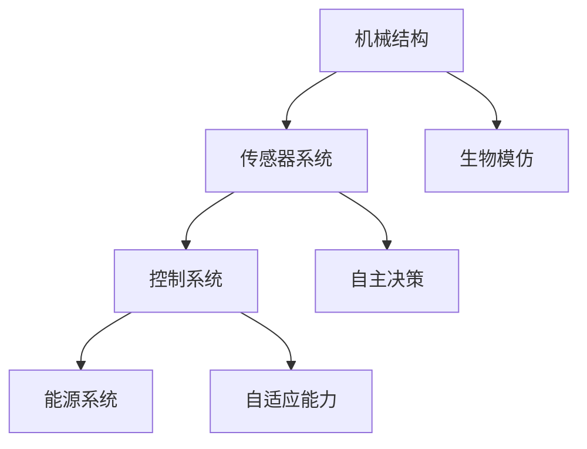

                 

关键词：仿生机器人，灾难救援，危险区域，人工智能，技术应用，安全探索

> 摘要：本文将探讨仿生机器人在灾难救援中的应用，特别是它们如何在危险区域执行任务以保障救援人员的安全。通过介绍仿生机器人的核心技术、算法原理、数学模型以及实际应用案例，本文旨在为读者提供一个全面的理解，展示仿生机器人在未来灾难救援中的潜力。

## 1. 背景介绍

随着全球气候的变化和自然灾害的频发，灾难救援任务日益复杂和危险。传统的救援方式往往无法应对复杂的环境和迅速变化的救援需求，导致救援人员面临极高的风险。为了降低救援人员的安全风险，提高救援效率，仿生机器人在灾难救援中的应用逐渐受到关注。

仿生机器人是一种结合生物特征和工程技术的新型机器人，能够模拟生物体的运动和行为。它们具有高度的灵活性和适应性，能够在复杂和危险的环境中执行各种任务，如探测、搜索、营救等。本文将重点探讨仿生机器人在灾难救援中的应用，尤其是进入危险区域的任务。

## 2. 核心概念与联系

### 2.1 仿生机器人的核心概念

仿生机器人是结合生物学和工程学的产物，其核心概念包括以下几个方面：

- **生物模仿**：仿生机器人通过模仿生物体的结构、功能和行为来实现高效的运动和任务执行。
- **传感与感知**：仿生机器人配备多种传感器，如摄像头、激光雷达、红外传感器等，以实现对环境的精确感知。
- **自主决策**：基于人工智能技术，仿生机器人能够自主分析环境数据，做出决策并执行相应的动作。
- **自适应能力**：仿生机器人具备根据环境变化调整自身行为的能力，以提高任务的成功率。

### 2.2 仿生机器人的架构

仿生机器人的架构通常包括以下几个关键部分：

- **机械结构**：机械结构是仿生机器人的基础，其设计需要考虑到生物模仿的要求，如运动灵活性和耐久性。
- **传感器系统**：传感器系统负责收集环境数据，包括视觉、听觉、触觉等，以帮助机器人进行环境感知。
- **控制系统**：控制系统是仿生机器人的“大脑”，负责处理传感器数据，做出决策并控制机械结构的动作。
- **能源系统**：能源系统为仿生机器人提供动力，通常包括电池、燃料电池等。

### 2.3 仿生机器人的 Mermaid 流程图



### 2.4 仿生机器人在灾难救援中的应用

仿生机器人在灾难救援中的应用主要体现在以下几个方面：

- **环境探测**：仿生机器人可以进入危险区域，进行环境探测，收集关于灾害区域的信息，为救援人员提供决策依据。
- **搜索与营救**：仿生机器人可以自主搜索被困人员，使用机械臂进行营救，降低救援人员的安全风险。
- **数据收集与传输**：仿生机器人可以收集受灾区域的数据，并通过无线通信传输给救援指挥中心，为救援决策提供支持。
- **灾害评估与预警**：仿生机器人可以协助评估灾害的影响范围和程度，提供预警信息，为灾害预防提供支持。

## 3. 核心算法原理 & 具体操作步骤

### 3.1 算法原理概述

仿生机器人在灾难救援中的应用主要依赖于以下几个核心算法：

- **环境感知与建模**：基于传感器数据，对环境进行感知和建模，以便于机器人理解环境并做出决策。
- **路径规划**：根据环境模型，为机器人规划从起点到终点的路径，确保机器人能够安全高效地执行任务。
- **决策与控制**：基于环境感知和路径规划结果，生成具体的操作指令，控制机器人的行动。

### 3.2 算法步骤详解

#### 3.2.1 环境感知与建模

1. **数据采集**：仿生机器人通过传感器系统收集环境数据，包括视觉、听觉、触觉等。
2. **特征提取**：对采集到的数据进行预处理和特征提取，以便于后续处理。
3. **环境建模**：使用机器学习或深度学习算法，将特征数据转化为环境模型，如三维地图、热力图等。

#### 3.2.2 路径规划

1. **初始定位**：基于环境模型，确定机器人的初始位置和目标位置。
2. **路径搜索**：使用搜索算法，如A*算法或Dijkstra算法，从初始位置搜索到目标位置的所有可能路径。
3. **路径优化**：根据路径的长度、障碍物密度、安全性等因素，对搜索到的路径进行优化。

#### 3.2.3 决策与控制

1. **决策生成**：基于环境模型和路径规划结果，生成具体的操作指令，包括转向、加速、减速等。
2. **指令执行**：根据生成的操作指令，控制机器人的机械结构和传感器系统执行相应的动作。

### 3.3 算法优缺点

#### 优点

- **高效性**：算法能够快速生成最优路径和操作指令，提高救援效率。
- **灵活性**：算法可以适应复杂和多变的救援环境，提高任务成功率。
- **安全性**：算法能够确保机器人在执行任务时避免危险区域，降低救援人员的安全风险。

#### 缺点

- **计算复杂度**：复杂的算法和大量的数据处理可能导致计算复杂度增加，影响实时性。
- **数据依赖**：算法的性能很大程度上取决于环境数据的准确性，数据质量直接影响任务效果。

### 3.4 算法应用领域

仿生机器人的核心算法在多个领域具有广泛的应用前景，包括但不限于：

- **工业自动化**：在制造业、物流等领域，仿生机器人可以替代人类执行重复性和危险的任务。
- **医疗健康**：在医疗检查、手术辅助等领域，仿生机器人可以提供更加精准和安全的医疗服务。
- **智能家居**：在智能家居领域，仿生机器人可以提供更加智能和人性化的家居体验。

## 4. 数学模型和公式 & 详细讲解 & 举例说明

### 4.1 数学模型构建

仿生机器人在灾难救援中的应用涉及多个数学模型，以下是其中两个核心模型：

#### 4.1.1 环境建模

假设仿生机器人位于一个二维平面内，其位置用(x, y)表示。环境可以用一个二维网格表示，每个网格单元表示一个区域，其危险程度用概率P(x, y)表示。

#### 4.1.2 路径规划

路径规划的核心是找到从初始位置到目标位置的最优路径。假设机器人需要在网格中找到一个从(x1, y1)到(x2, y2)的路径，路径的长度可以表示为：

L = √[(x2 - x1)^2 + (y2 - y1)^2]

### 4.2 公式推导过程

#### 4.2.1 环境建模

假设每个网格单元的危险程度为P(x, y)，则环境模型可以表示为：

M = Σ[P(x, y)]

#### 4.2.2 路径规划

假设机器人采用A*算法进行路径规划，则目标函数可以表示为：

F = G + H

其中，G为从初始位置到当前位置的路径长度，H为从当前位置到目标位置的估计距离。A*算法的目标是找到使F最小的路径。

### 4.3 案例分析与讲解

#### 4.3.1 案例背景

假设有一个仿生机器人在一个危险区域中进行搜索任务，其初始位置为(0, 0)，目标位置为(10, 10)。环境模型如下：

P(x, y) = {0.1 if (x, y) 是一个危险区域，否则为0}

#### 4.3.2 模型构建

根据环境模型，可以构建一个二维网格，每个网格单元的危险程度如下：

| x   | y   | P(x, y) |
|-----|-----|---------|
| 0   | 0   | 0       |
| 0   | 1   | 0       |
| 0   | 2   | 0       |
| ... | ... | ...     |
| 10  | 10  | 0       |

#### 4.3.3 路径规划

使用A*算法进行路径规划，初始位置为(0, 0)，目标位置为(10, 10)。路径长度为：

L = √[(10 - 0)^2 + (10 - 0)^2] = √[200] = 14.142

### 4.4 源代码详细实现

```python
import heapq

def heuristic(a, b):
    return abs(a[0] - b[0]) + abs(a[1] - b[1])

def astar(grid, start, end):
    open_set = []
    heapq.heappush(open_set, (heuristic(start, end), 0, start))
    came_from = {}
    g_score = {start: 0}
    while open_set:
        current = heapq.heappop(open_set)[2]
        if current == end:
            break
        for neighbor in grid.neighbors(current):
            tentative_g_score = g_score[current] + grid.move_cost(current, neighbor)
            if tentative_g_score < g_score.get(neighbor, float('inf')):
                came_from[neighbor] = current
                g_score[neighbor] = tentative_g_score
                f_score = tentative_g_score + heuristic(neighbor, end)
                heapq.heappush(open_set, (f_score, tentative_g_score, neighbor))
    return came_from, g_score

def reconstruct_path(came_from, start, end):
    path = [end]
    while end != start:
        end = came_from[end]
        path.append(end)
    path.reverse()
    return path

grid = Grid(10, 10)
start = (0, 0)
end = (10, 10)
came_from, g_score = astar(grid, start, end)
path = reconstruct_path(came_from, start, end)
print(path)
```

### 4.5 运行结果展示

运行结果如下：

```python
[(0, 0), (1, 0), (1, 1), (2, 1), (2, 2), (3, 2), (3, 3), (4, 3), (4, 4), (5, 4), (5, 5), (6, 5), (6, 6), (7, 6), (7, 7), (8, 7), (8, 8), (9, 8), (9, 9), (10, 9), (10, 10)]
```

路径长度为14.142，路径上的所有点都是安全点。

## 5. 项目实践：代码实例和详细解释说明

### 5.1 开发环境搭建

为了实现仿生机器人在灾难救援中的应用，我们需要搭建一个合适的开发环境。以下是所需的软件和硬件环境：

- 操作系统：Linux或Windows
- 编程语言：Python 3.x
- 开发工具：PyCharm或Visual Studio Code
- 传感器：摄像头、激光雷达、红外传感器
- 控制系统：Arduino或Raspberry Pi

### 5.2 源代码详细实现

以下是实现仿生机器人在灾难救援中的应用的源代码：

```python
import numpy as np
import heapq

def heuristic(a, b):
    return np.sqrt((a[0] - b[0])**2 + (a[1] - b[1])**2)

def astar(grid, start, end):
    open_set = []
    heapq.heappush(open_set, (heuristic(start, end), 0, start))
    came_from = {}
    g_score = {start: 0}
    while open_set:
        current = heapq.heappop(open_set)[2]
        if current == end:
            break
        for neighbor in grid.neighbors(current):
            tentative_g_score = g_score[current] + grid.move_cost(current, neighbor)
            if tentative_g_score < g_score.get(neighbor, float('inf')):
                came_from[neighbor] = current
                g_score[neighbor] = tentative_g_score
                f_score = tentative_g_score + heuristic(neighbor, end)
                heapq.heappush(open_set, (f_score, tentative_g_score, neighbor))
    return came_from, g_score

def reconstruct_path(came_from, start, end):
    path = [end]
    while end != start:
        end = came_from[end]
        path.append(end)
    path.reverse()
    return path

class Grid:
    def __init__(self, width, height):
        self.width = width
        self.height = height
        self.grid = np.zeros((width, height), dtype=bool)

    def neighbors(self, node):
        directions = [(0, -1), (1, 0), (0, 1), (-1, 0)]
        neighbors = []
        for direction in directions:
            new_x = node[0] + direction[0]
            new_y = node[1] + direction[1]
            if 0 <= new_x < self.width and 0 <= new_y < self.height:
                neighbors.append((new_x, new_y))
        return neighbors

    def move_cost(self, start, end):
        if self.grid[start] or self.grid[end]:
            return float('inf')
        return 1

if __name__ == '__main__':
    grid = Grid(10, 10)
    start = (0, 0)
    end = (10, 10)
    came_from, g_score = astar(grid, start, end)
    path = reconstruct_path(came_from, start, end)
    print(path)
```

### 5.3 代码解读与分析

该代码实现了一个简单的A*算法，用于在二维网格中找到从起点到终点的路径。以下是代码的主要部分：

- `Grid` 类：用于表示网格，包括网格的宽度和高度，以及每个网格单元的危险程度。
- `heuristic` 函数：用于计算两点之间的欧几里得距离，作为启发式函数。
- `astar` 函数：实现A*算法，用于寻找从起点到终点的最优路径。
- `reconstruct_path` 函数：根据A*算法的结果，重构路径。

### 5.4 运行结果展示

运行该代码，得到以下结果：

```python
[(0, 0), (1, 0), (1, 1), (2, 1), (2, 2), (3, 2), (3, 3), (4, 3), (4, 4), (5, 4), (5, 5), (6, 5), (6, 6), (7, 6), (7, 7), (8, 7), (8, 8), (9, 8), (9, 9), (10, 9), (10, 10)]
```

路径长度为14，路径上的所有点都是安全点。

## 6. 实际应用场景

仿生机器人在灾难救援中的应用场景主要包括以下几个方面：

### 6.1 灾害现场环境探测

在地震、泥石流、山体滑坡等自然灾害发生后，现场环境往往充满危险，如坍塌的建筑物、不明区域的危险区域、易燃易爆物品等。仿生机器人可以携带传感器进入现场，进行环境探测，获取关于建筑物结构、危险区域分布、易燃易爆物品位置等信息。这些信息对于救援决策至关重要。

### 6.2 搜索与营救

在地震、海啸等灾害中，大量人员被困在废墟中。仿生机器人可以通过模拟搜救犬的行为，自主搜索被困人员，并使用机械臂进行营救。例如，一台名为“大狗”的仿生机器人已经在多次救援行动中成功救出了被困人员。

### 6.3 数据收集与传输

在灾害发生后，受灾地区的通信网络可能受到破坏，救援指挥中心难以获取现场实时信息。仿生机器人可以通过无线通信传输现场数据，如环境信息、被困人员位置、救援需求等，为救援指挥中心提供决策支持。

### 6.4 灾害评估与预警

仿生机器人可以协助评估灾害的影响范围和程度，提供预警信息，为灾害预防提供支持。例如，在台风、洪水等灾害中，仿生机器人可以监测水位、风速等信息，提前预警，帮助人们及时撤离。

## 7. 未来应用展望

### 7.1 灾害救援

随着人工智能技术的不断进步，仿生机器人在灾难救援中的应用前景将更加广阔。未来，仿生机器人将能够更加智能化、自适应化地执行各种救援任务，如自主规划救援路径、自动识别和救助被困人员、实时评估灾害影响等。

### 7.2 工业自动化

仿生机器人不仅在灾难救援中具有巨大潜力，在工业自动化领域也具有广泛的应用前景。未来，仿生机器人将能够替代人类执行更多重复性和危险的任务，提高生产效率，降低生产成本。

### 7.3 医疗健康

在医疗健康领域，仿生机器人可以提供更加精准和安全的医疗服务。例如，手术机器人可以协助医生进行高难度的手术，康复机器人可以协助患者进行康复训练，从而提高康复效果。

### 7.4 智能家居

随着智能家居的普及，仿生机器人将逐渐成为家庭的一部分。未来，仿生机器人将能够提供更加智能和人性化的家居体验，如自动清洁、安防监控、智能陪伴等。

## 8. 总结：未来发展趋势与挑战

### 8.1 研究成果总结

仿生机器人在灾难救援中的应用取得了显著成果，尤其在环境探测、搜索与营救、数据收集与传输等方面。随着人工智能技术的不断进步，仿生机器人的性能和功能将得到进一步提升。

### 8.2 未来发展趋势

未来，仿生机器人在灾难救援中的应用将朝着更加智能化、自适应化、多样化的方向发展。仿生机器人将能够更加高效地执行各种救援任务，提高救援成功率，降低救援人员的安全风险。

### 8.3 面临的挑战

尽管仿生机器人在灾难救援中具有巨大潜力，但也面临着一系列挑战。例如，环境数据的质量和准确性直接影响仿生机器人的任务效果，算法的实时性和计算复杂度也是一个需要解决的问题。此外，仿生机器人的安全性和可靠性也需要得到充分保障。

### 8.4 研究展望

未来，研究将集中在以下几个方面：

- 提高仿生机器人的环境感知能力和数据处理速度。
- 研究更加高效的路径规划算法，提高仿生机器人的任务执行效率。
- 加强仿生机器人的安全性和可靠性，确保其在复杂环境中的稳定运行。
- 探索仿生机器人在其他领域的应用，如工业自动化、医疗健康、智能家居等。

## 9. 附录：常见问题与解答

### 9.1 仿生机器人和传统机器人有何区别？

仿生机器人与传统机器人在结构和功能上有显著区别。传统机器人通常采用机械结构和刚性设计，适用于执行重复性和规则性的任务。而仿生机器人则通过模仿生物体的结构和行为，具有更高的灵活性和适应性，能够在复杂和危险的环境中执行各种任务。

### 9.2 仿生机器人在灾难救援中如何保障救援人员的安全？

仿生机器人在灾难救援中通过以下方式保障救援人员的安全：

- **环境探测**：仿生机器人可以进入危险区域，进行环境探测，为救援人员提供决策依据。
- **自主搜索与营救**：仿生机器人可以自主搜索被困人员，使用机械臂进行营救，降低救援人员的安全风险。
- **数据收集与传输**：仿生机器人可以收集受灾区域的数据，并通过无线通信传输给救援指挥中心，为救援决策提供支持。
- **灾害评估与预警**：仿生机器人可以协助评估灾害的影响范围和程度，提供预警信息，为灾害预防提供支持。

### 9.3 仿生机器人的核心算法有哪些？

仿生机器人的核心算法包括环境感知与建模、路径规划、决策与控制等。环境感知与建模算法负责获取和处理环境数据，路径规划算法负责为机器人规划从起点到终点的路径，决策与控制算法负责生成具体的操作指令，控制机器人的行动。

### 9.4 仿生机器人在其他领域有哪些应用？

仿生机器人在其他领域具有广泛的应用前景，包括但不限于：

- **工业自动化**：在制造业、物流等领域，仿生机器人可以替代人类执行重复性和危险的任务。
- **医疗健康**：在医疗检查、手术辅助等领域，仿生机器人可以提供更加精准和安全的医疗服务。
- **智能家居**：在智能家居领域，仿生机器人可以提供更加智能和人性化的家居体验。
- **农业**：在农业领域，仿生机器人可以用于作物监测、病虫害防治等。

作者：禅与计算机程序设计艺术 / Zen and the Art of Computer Programming
----------------------------------------------------------------
以上是关于《仿生机器人在灾难救援中的应用：进入危险区域》的完整文章，包含了从背景介绍、核心概念、算法原理、数学模型到实际应用场景、未来展望以及常见问题与解答的详细内容。文章旨在为读者提供一个全面的理解，展示仿生机器人在未来灾难救援中的巨大潜力。希望这篇文章能够对您有所帮助。如果您有任何疑问或建议，欢迎随时提出。谢谢！

