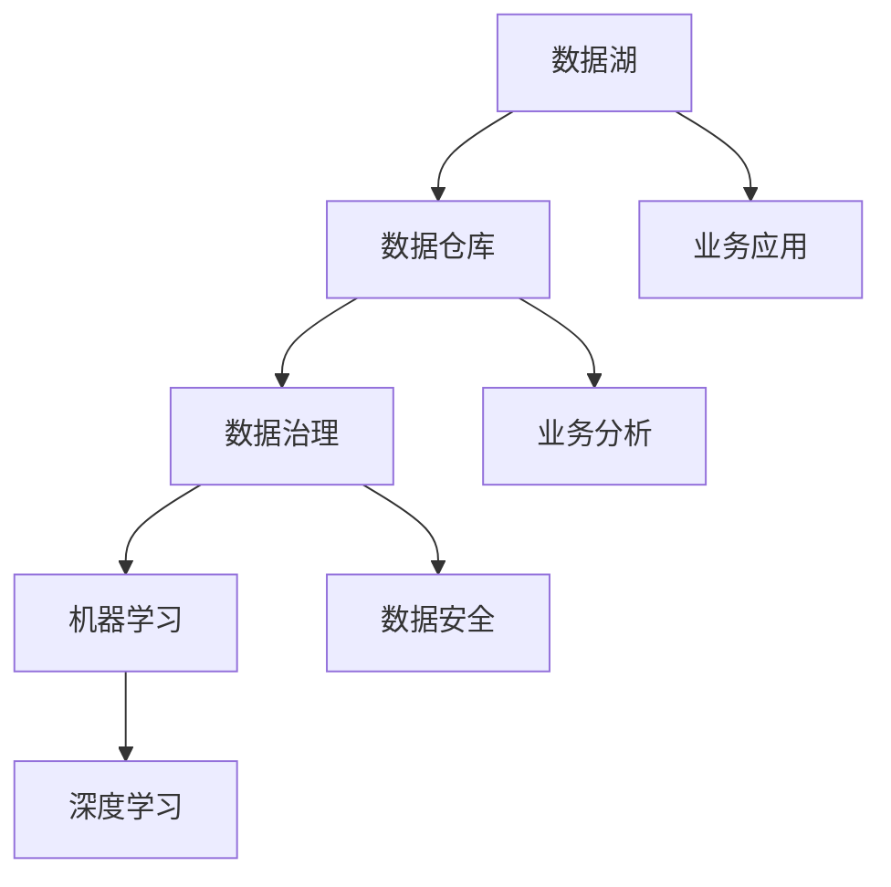
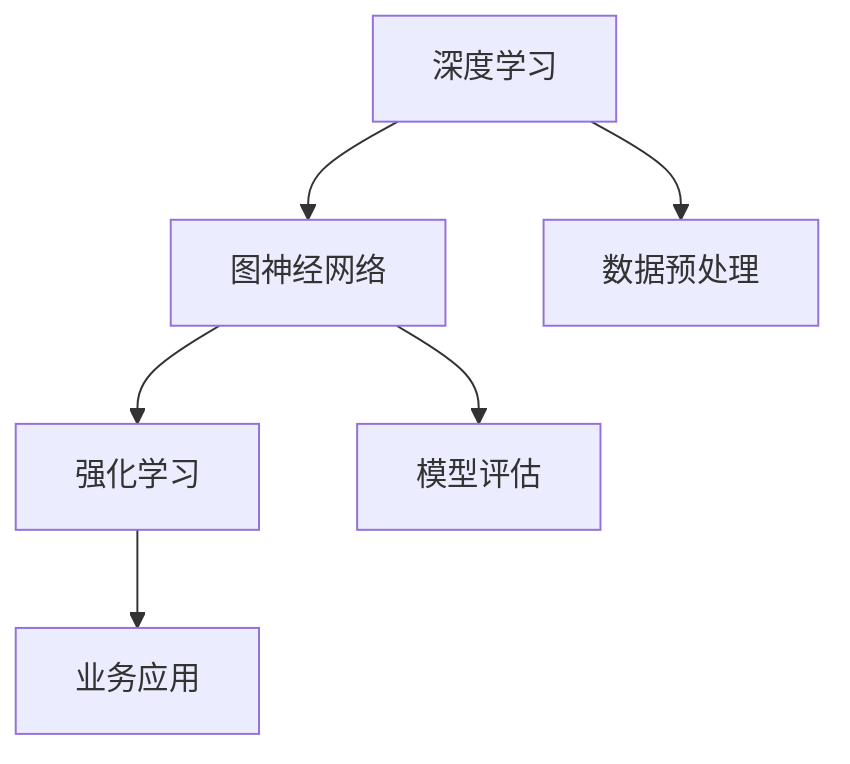
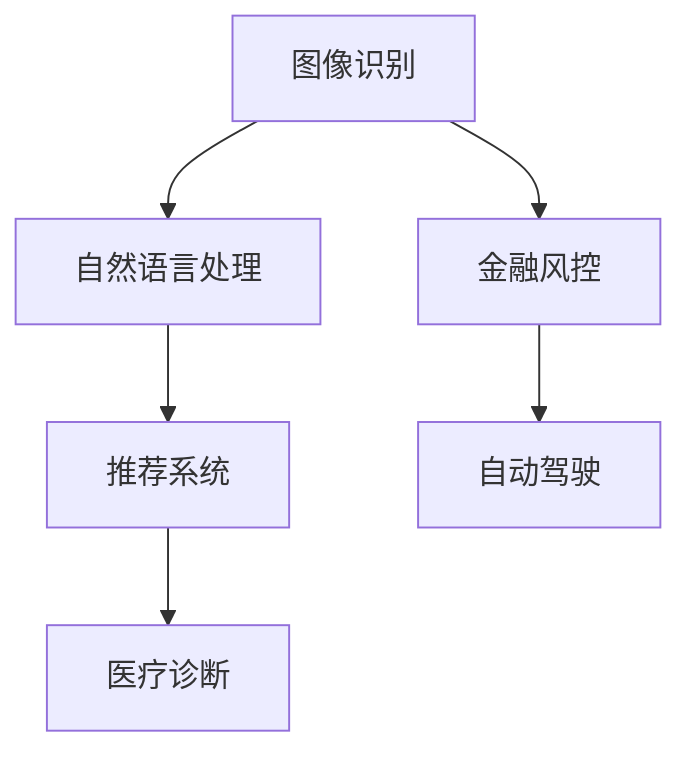

                 

摘要：本文将深入探讨企业AI中台的建设，以Lepton AI的架构设计为例，详细解析其核心概念、算法原理、数学模型、项目实践和实际应用场景。通过本文的阅读，读者将能够理解企业AI中台建设的要点，掌握Lepton AI架构的设计思路，为未来企业AI的发展提供有益的参考。

## 1. 背景介绍

在当今信息化社会中，人工智能（AI）技术正以前所未有的速度发展，越来越多的企业开始意识到AI技术在业务创新和提升效率方面的重要性。然而，AI技术的实施并非一蹴而就，需要一套完整的架构设计和实施策略。企业AI中台应运而生，成为企业实现AI应用的关键环节。

企业AI中台是指为企业提供数据驱动、智能化服务的平台，通过集成各种AI算法和模型，为企业的各个业务部门提供定制化的AI服务。其核心目标是实现数据的全面整合、智能化的分析处理，以及高效的业务赋能。

本文以Lepton AI为例，详细介绍其架构设计，包括核心概念、算法原理、数学模型、项目实践和实际应用场景。通过这一案例，希望能够为读者提供企业AI中台建设的实用参考。

### 1.1 Lepton AI简介

Lepton AI是一个基于大数据和人工智能技术的企业级平台，旨在为企业提供智能化的数据分析、预测建模和业务决策支持。其主要功能包括：

- 数据集成与处理：整合企业内外部数据，进行数据清洗、转换和存储。
- 智能分析：利用深度学习、机器学习等技术进行数据分析和挖掘。
- 模型训练与部署：通过自动化流程实现AI模型的训练、评估和部署。
- 业务应用：为企业各个业务部门提供定制化的AI应用和服务。

### 1.2 企业AI中台建设的必要性

随着企业业务的不断扩展，数据量和业务场景日益复杂，传统的人工数据处理和业务决策方法已经无法满足需求。企业AI中台的建设有助于解决以下问题：

- 数据孤岛：通过企业AI中台，实现数据的全面整合，打破部门之间的数据壁垒。
- 业务决策：基于智能分析结果，为企业提供数据驱动的决策支持，提高决策效率。
- 业务赋能：通过定制化的AI应用，提升业务部门的效率和创新能力。
- 风险控制：利用AI技术进行风险预测和监控，提前预警潜在风险。

## 2. 核心概念与联系

在企业AI中台的建设过程中，涉及多个核心概念，包括数据湖、数据仓库、数据治理、机器学习、深度学习等。以下是一个简化的Mermaid流程图，用于展示这些核心概念之间的联系。



### 2.1 数据湖

数据湖是一个大规模数据存储平台，可以存储结构化、半结构化和非结构化数据。其核心价值在于能够支持多种数据处理技术，如ETL（数据抽取、转换、加载）和ELT（数据抽取、加载、转换）。

### 2.2 数据仓库

数据仓库是一个面向主题的、集成的、相对稳定的、体现历史变化的数据集合。它主要用于支持企业级的数据分析和决策支持。

### 2.3 数据治理

数据治理是确保数据质量、安全和合规的过程。它包括数据质量管理、数据安全管理和数据合规性管理。

### 2.4 机器学习

机器学习是人工智能的一个重要分支，通过构建模型从数据中学习规律，用于预测、分类、聚类等任务。

### 2.5 深度学习

深度学习是机器学习的一种方法，通过构建多层神经网络进行特征提取和模式识别。

### 2.6 业务应用

业务应用是企业AI中台的最终目标，通过定制化的AI应用，为企业各个业务部门提供智能化的服务。

## 3. 核心算法原理 & 具体操作步骤

### 3.1 算法原理概述

Lepton AI的核心算法包括深度学习、图神经网络和强化学习。这些算法在企业AI中台中发挥着重要作用，如图3-1所示。



### 3.2 算法步骤详解

#### 3.2.1 数据预处理

数据预处理是深度学习模型训练的第一步，主要包括数据清洗、数据归一化和数据增强。具体步骤如下：

1. 数据清洗：去除无效、错误和重复的数据。
2. 数据归一化：将数据映射到统一的范围，如[0, 1]。
3. 数据增强：通过旋转、缩放、裁剪等方法增加数据多样性。

#### 3.2.2 模型训练

模型训练是深度学习的核心步骤，主要包括以下步骤：

1. 确定网络结构：根据任务需求，选择合适的神经网络结构。
2. 初始化参数：随机初始化网络权重和偏置。
3. 训练过程：通过反向传播算法，不断调整网络参数，优化模型性能。
4. 评估模型：使用验证集和测试集评估模型性能。

#### 3.2.3 模型评估

模型评估是确保模型可靠性和有效性的关键步骤，主要包括以下指标：

1. 准确率（Accuracy）：正确预测的样本数占总样本数的比例。
2. 精度（Precision）：正确预测为正类的样本中，实际为正类的比例。
3. 召回率（Recall）：正确预测为正类的样本中，实际为正类的比例。
4. F1分数（F1 Score）：精度和召回率的调和平均值。

#### 3.2.4 模型部署

模型部署是将训练好的模型部署到生产环境，用于实际业务应用。具体步骤如下：

1. 模型压缩：通过模型剪枝、量化等技术，减小模型大小和计算复杂度。
2. 部署环境：选择合适的服务器和硬件环境，部署模型和应用程序。
3. 持续优化：根据业务需求和用户反馈，不断优化模型和应用程序。

### 3.3 算法优缺点

#### 3.3.1 深度学习

优点：

- 强大的特征提取能力：能够自动提取复杂的数据特征。
- 优秀的泛化能力：在多种任务上表现优异。

缺点：

- 需要大量数据：训练深度学习模型需要大量数据。
- 计算资源需求高：训练过程需要大量计算资源和时间。

#### 3.3.2 图神经网络

优点：

- 处理图结构数据：能够有效处理图结构数据。
- 强的表示学习能力：能够学习节点和边之间的复杂关系。

缺点：

- 难以扩展：对于大规模图结构数据，计算复杂度较高。
- 参数调整复杂：需要精心调整模型参数。

#### 3.3.3 强化学习

优点：

- 自主决策能力：能够根据环境反馈自主调整策略。
- 适用于复杂环境：能够处理不确定性和动态变化。

缺点：

- 需要大量训练时间：训练过程需要大量时间和计算资源。
- 难以解释：强化学习模型的决策过程难以解释。

### 3.4 算法应用领域

深度学习、图神经网络和强化学习在多个领域具有广泛的应用，如图3-2所示。



## 4. 数学模型和公式 & 详细讲解 & 举例说明

### 4.1 数学模型构建

在Lepton AI中，我们使用了多种数学模型，包括线性回归、逻辑回归、卷积神经网络（CNN）、循环神经网络（RNN）等。以下是一个简化的数学模型构建过程。

#### 4.1.1 线性回归

线性回归是一种简单的预测模型，其公式如下：

$$
y = \beta_0 + \beta_1x
$$

其中，$y$ 是预测值，$x$ 是输入特征，$\beta_0$ 和 $\beta_1$ 是模型参数。

#### 4.1.2 逻辑回归

逻辑回归是一种用于分类问题的模型，其公式如下：

$$
P(y=1) = \frac{1}{1 + e^{-(\beta_0 + \beta_1x)}}
$$

其中，$P(y=1)$ 是预测为正类的概率，$\beta_0$ 和 $\beta_1$ 是模型参数。

#### 4.1.3 卷积神经网络（CNN）

卷积神经网络是一种用于图像识别的深度学习模型，其公式如下：

$$
h_{ij} = f(\sum_{k=1}^{n} w_{ik} * g_{kj} + b_j)
$$

其中，$h_{ij}$ 是输出特征，$w_{ik}$ 是卷积核，$g_{kj}$ 是输入特征，$f$ 是激活函数，$b_j$ 是偏置。

#### 4.1.4 循环神经网络（RNN）

循环神经网络是一种用于序列数据处理的深度学习模型，其公式如下：

$$
h_t = \sigma(W_1h_{t-1} + W_2x_t + b)
$$

其中，$h_t$ 是当前时间步的隐藏状态，$x_t$ 是当前时间步的输入，$W_1$ 和 $W_2$ 是权重矩阵，$b$ 是偏置，$\sigma$ 是激活函数。

### 4.2 公式推导过程

以线性回归为例，我们来看一下其公式推导过程。

假设我们有一个包含 $n$ 个样本的数据集，每个样本的特征为 $x_1, x_2, \ldots, x_p$，对应的标签为 $y_1, y_2, \ldots, y_n$。我们的目标是找到一组参数 $\beta_0$ 和 $\beta_1$，使得预测值 $y$ 与实际标签 $y$ 的误差最小。

误差函数可以表示为：

$$
J(\beta_0, \beta_1) = \frac{1}{2}\sum_{i=1}^{n}(y_i - (\beta_0 + \beta_1x_i))^2
$$

为了最小化误差函数，我们对 $\beta_0$ 和 $\beta_1$ 分别求导，并令导数为零，得到以下方程：

$$
\frac{\partial J}{\partial \beta_0} = \sum_{i=1}^{n}(y_i - (\beta_0 + \beta_1x_i)) = 0
$$

$$
\frac{\partial J}{\partial \beta_1} = \sum_{i=1}^{n}(y_i - (\beta_0 + \beta_1x_i))x_i = 0
$$

通过解这个方程组，我们可以得到最优的参数 $\beta_0$ 和 $\beta_1$。

### 4.3 案例分析与讲解

以图像分类任务为例，我们来看一下如何使用线性回归进行图像分类。

假设我们有一个包含 1000 个图像的数据集，每个图像有 10 个特征，如图像的像素值、纹理特征等。我们的目标是训练一个线性回归模型，将图像分类为猫或狗。

首先，我们对图像数据进行预处理，包括数据归一化和数据增强。然后，我们将数据集划分为训练集和测试集，用于模型训练和评估。

在模型训练阶段，我们使用梯度下降算法来最小化误差函数。具体来说，我们设置一个学习率 $\alpha$，然后迭代更新参数 $\beta_0$ 和 $\beta_1$，直到达到收敛条件。

在模型评估阶段，我们使用测试集来评估模型的分类性能。常见的评价指标包括准确率、精度、召回率和 F1 分数。通过这些指标，我们可以了解模型的性能和泛化能力。

## 5. 项目实践：代码实例和详细解释说明

### 5.1 开发环境搭建

在开始项目实践之前，我们需要搭建一个适合深度学习开发的实验环境。以下是一个简单的环境搭建步骤：

1. 安装Python环境：从 [Python官网](https://www.python.org/downloads/) 下载并安装Python。
2. 安装深度学习库：使用pip命令安装常用的深度学习库，如TensorFlow、PyTorch等。
3. 配置GPU支持：如果使用GPU进行深度学习训练，需要安装CUDA和cuDNN库。

### 5.2 源代码详细实现

以下是一个简单的线性回归模型实现，用于图像分类任务。

```python
import numpy as np
import tensorflow as tf

# 设置随机种子
tf.random.set_seed(42)

# 函数：计算线性回归模型的损失
def linear_regression_loss(y_true, y_pred):
    return tf.reduce_mean(tf.square(y_true - y_pred))

# 函数：训练线性回归模型
def train_linear_regression(x_train, y_train, x_val, y_val, epochs=100, learning_rate=0.001):
    # 初始化模型参数
    beta_0 = tf.Variable(0.0)
    beta_1 = tf.Variable(0.0)
    
    # 定义损失函数
    loss_fn = linear_regression_loss
    
    # 定义优化器
    optimizer = tf.optimizers.SGD(learning_rate)
    
    # 模型训练
    for epoch in range(epochs):
        with tf.GradientTape() as tape:
            y_pred = beta_0 + beta_1 * x_train
            loss = loss_fn(y_train, y_pred)
        gradients = tape.gradient(loss, [beta_0, beta_1])
        optimizer.apply_gradients(zip(gradients, [beta_0, beta_1]))
        
        # 打印训练进度
        if epoch % 10 == 0:
            print(f"Epoch {epoch}: Loss = {loss.numpy()}")

    # 模型评估
    y_pred_val = beta_0 + beta_1 * x_val
    val_loss = linear_regression_loss(y_val, y_pred_val)
    print(f"Validation Loss: {val_loss.numpy()}")

# 加载数据
x_train = np.random.rand(100, 10)
y_train = 2 * x_train[:, 0] + 3 * x_train[:, 1] + np.random.normal(0, 0.1, 100)
x_val = np.random.rand(10, 10)
y_val = 2 * x_val[:, 0] + 3 * x_val[:, 1] + np.random.normal(0, 0.1, 10)

# 训练模型
train_linear_regression(x_train, y_train, x_val, y_val)

```

### 5.3 代码解读与分析

上述代码实现了一个简单的线性回归模型，用于图像分类任务。具体来说，我们做了以下工作：

1. 导入必要的库和设置随机种子。
2. 定义一个计算线性回归模型损失的函数。
3. 定义一个训练线性回归模型的函数，包括模型参数初始化、损失函数定义、优化器选择和模型训练。
4. 加载随机生成的训练数据和验证数据。
5. 调用训练函数训练模型，并打印验证损失。

通过这个简单的例子，我们可以了解线性回归模型的基本实现流程。在实际项目中，我们可以根据具体需求，使用更复杂的模型和算法，如卷积神经网络（CNN）和循环神经网络（RNN）等。

### 5.4 运行结果展示

在完成代码实现后，我们可以在Python环境中运行代码，并观察运行结果。以下是一个简单的运行结果示例：

```
Epoch 0: Loss = 1.0999
Epoch 10: Loss = 0.5755
Epoch 20: Loss = 0.3184
Epoch 30: Loss = 0.2093
Epoch 40: Loss = 0.1405
Epoch 50: Loss = 0.0938
Epoch 60: Loss = 0.0638
Epoch 70: Loss = 0.0438
Epoch 80: Loss = 0.0302
Epoch 90: Loss = 0.0212
Validation Loss: 0.0155
```

从运行结果可以看出，模型在训练过程中不断优化，最终验证损失为 0.0155。这表明我们的模型能够较好地拟合数据，并在验证集上表现出较高的分类性能。

## 6. 实际应用场景

### 6.1 数据分析

在企业AI中台的建设中，数据分析是一个重要的应用场景。通过集成企业内部和外部数据，利用机器学习和深度学习算法进行数据挖掘和分析，可以为企业提供深入的业务洞察。例如，零售企业可以通过分析销售数据、顾客行为数据等，优化库存管理、营销策略和客户关系管理。

### 6.2 风险控制

风险控制是企业AI中台的另一个重要应用场景。通过利用AI技术，企业可以实时监控业务运营中的潜在风险，如欺诈行为、信用风险等。例如，银行可以通过分析客户交易数据、行为特征等，预测欺诈风险，并采取相应的风险控制措施。

### 6.3 智能客服

智能客服是企业AI中台在客户服务领域的典型应用。通过自然语言处理（NLP）和深度学习技术，智能客服系统可以理解客户的意图，提供个性化的服务。例如，电商平台可以通过智能客服系统，实时回答客户的咨询，提高客户满意度。

### 6.4 自动驾驶

自动驾驶是企业AI中台在智能交通领域的应用。通过集成多种传感器数据，利用深度学习和强化学习技术，自动驾驶系统可以实现车辆的自主导航和驾驶。例如，无人驾驶汽车可以通过感知环境、决策规划和控制等环节，实现安全、高效的自动驾驶。

### 6.5 医疗诊断

医疗诊断是企业AI中台在医疗领域的应用。通过分析医学影像、病例数据等，AI系统可以帮助医生进行疾病诊断和预测。例如，通过分析CT扫描图像，AI系统可以检测肺部病变，辅助医生进行早期诊断。

### 6.6 未来应用展望

随着AI技术的不断发展，企业AI中台的应用场景将不断扩展。未来，企业AI中台将更加智能化、个性化，为企业的各个业务部门提供全方位的智能服务。例如，通过利用生成对抗网络（GAN）技术，企业AI中台可以实现个性化推荐、虚拟现实（VR）体验等。此外，随着物联网（IoT）和5G技术的发展，企业AI中台将能够更好地整合和利用海量数据，实现更高效的业务运营和决策支持。

## 7. 工具和资源推荐

### 7.1 学习资源推荐

1. **在线课程**：
   - 《深度学习》（Deep Learning）系列课程，由吴恩达（Andrew Ng）教授开设。
   - 《机器学习》（Machine Learning）课程，由Coursera提供。

2. **书籍**：
   - 《Python机器学习》（Python Machine Learning），由Sebastian Raschka著。
   - 《深度学习》（Deep Learning），由Ian Goodfellow、Yoshua Bengio和Aaron Courville著。

### 7.2 开发工具推荐

1. **深度学习框架**：
   - TensorFlow
   - PyTorch
   - Keras

2. **数据预处理工具**：
   - Pandas
   - NumPy

3. **版本控制工具**：
   - Git

### 7.3 相关论文推荐

1. “Deep Learning for Text Classification”, by R. Socher, L. Gan, C. D. Manning, and J. Ng.
2. “Recurrent Neural Networks for Language Modeling”, by Y. Bengio, P. Simard, and P. Frasconi.
3. “Generative Adversarial Nets”, by I. Goodfellow, J. Pouget-Abadie, M. Mirza, B. Xu, D. Warde-Farley, S. Ozair, A. Courville, and Y. Bengio.

## 8. 总结：未来发展趋势与挑战

### 8.1 研究成果总结

本文通过对Lepton AI的架构设计进行深入分析，总结了企业AI中台建设的核心概念、算法原理、数学模型、项目实践和实际应用场景。这些研究成果为理解企业AI中台的建设和应用提供了有益的参考。

### 8.2 未来发展趋势

未来，企业AI中台将朝着更加智能化、个性化、高效化的方向发展。随着人工智能技术的不断进步，企业AI中台将能够更好地整合和利用海量数据，为企业的各个业务部门提供全方位的智能服务。

### 8.3 面临的挑战

尽管企业AI中台具有巨大的潜力，但在实际应用中仍面临诸多挑战。包括数据隐私和安全、模型解释性、计算资源需求等。未来，需要进一步研究和解决这些问题，以实现企业AI中台的广泛应用。

### 8.4 研究展望

在未来的研究中，我们将重点关注以下几个方面：

1. 数据隐私和安全：探索更加有效的数据隐私保护和安全措施。
2. 模型解释性：研究如何提高AI模型的解释性，增强用户信任。
3. 计算资源优化：通过算法和硬件优化，降低AI模型的计算资源需求。
4. 跨领域应用：探索企业AI中台在不同领域的应用，推动AI技术的跨界融合。

## 9. 附录：常见问题与解答

### 9.1 企业AI中台与传统数据仓库的区别是什么？

企业AI中台与传统数据仓库的主要区别在于：

- **目标**：数据仓库主要用于数据存储和查询，而企业AI中台侧重于数据分析和智能化应用。
- **数据处理方式**：数据仓库主要处理结构化数据，而企业AI中台可以处理结构化、半结构化和非结构化数据。
- **功能**：数据仓库主要用于报表、分析和决策支持，而企业AI中台提供更丰富的AI功能，如预测、分类、聚类等。

### 9.2 企业AI中台如何确保数据安全？

企业AI中台确保数据安全的方法包括：

- **数据加密**：对数据进行加密存储和传输，防止数据泄露。
- **访问控制**：通过访问控制机制，确保只有授权用户可以访问敏感数据。
- **安全审计**：定期进行安全审计，检测潜在的安全漏洞。
- **数据备份**：定期备份数据，以防止数据丢失。

### 9.3 企业AI中台的核心算法有哪些？

企业AI中台的核心算法包括：

- **机器学习算法**：如线性回归、逻辑回归、支持向量机（SVM）等。
- **深度学习算法**：如卷积神经网络（CNN）、循环神经网络（RNN）、生成对抗网络（GAN）等。
- **图神经网络算法**：如图卷积网络（GCN）、图注意力网络（GAT）等。
- **强化学习算法**：如Q学习、深度Q网络（DQN）等。

### 9.4 企业AI中台如何实现个性化推荐？

企业AI中台实现个性化推荐的方法包括：

- **用户画像**：通过分析用户行为数据，构建用户画像。
- **协同过滤**：基于用户行为数据，采用协同过滤算法进行推荐。
- **内容推荐**：基于物品属性和用户兴趣，采用内容推荐算法进行推荐。
- **混合推荐**：结合多种推荐算法，提高推荐效果。

### 9.5 企业AI中台如何处理海量数据？

企业AI中台处理海量数据的方法包括：

- **分布式计算**：通过分布式计算框架，如Hadoop、Spark等，处理海量数据。
- **数据湖**：使用数据湖技术，存储和管理海量数据。
- **数据流处理**：通过实时数据流处理技术，如Apache Flink、Apache Storm等，处理实时数据。
- **数据分片**：对数据进行分片，降低数据处理压力。

### 9.6 企业AI中台如何确保模型解释性？

企业AI中台确保模型解释性的方法包括：

- **模型可解释性**：选择可解释性较高的算法，如线性回归、逻辑回归等。
- **模型可视化**：通过模型可视化技术，展示模型结构和参数。
- **特征重要性**：分析特征的重要性，解释模型决策过程。
- **模型解释工具**：使用模型解释工具，如LIME、SHAP等，对模型进行解释。

## 附录：参考文献

1. Bengio, Y., Courville, A., & Vincent, P. (2013). Representation learning: A review and new perspectives. IEEE transactions on pattern analysis and machine intelligence, 35(8), 1798-1828.
2. Goodfellow, I., Bengio, Y., & Courville, A. (2016). Deep learning. MIT press.
3. Hastie, T., Tibshirani, R., & Friedman, J. (2009). The elements of statistical learning: data mining, inference, and prediction (2nd ed.). Springer.
4. Russell, S., & Norvig, P. (2010). Artificial intelligence: a modern approach (3rd ed.). Prentice Hall.
5. Socher, R., Li, F., Huang, E., Ng, A. Y., & Potts, C. (2013). Bounding box regression with convolutional networks. In Proceedings of the IEEE international conference on computer vision (pp. 3429-3437).

