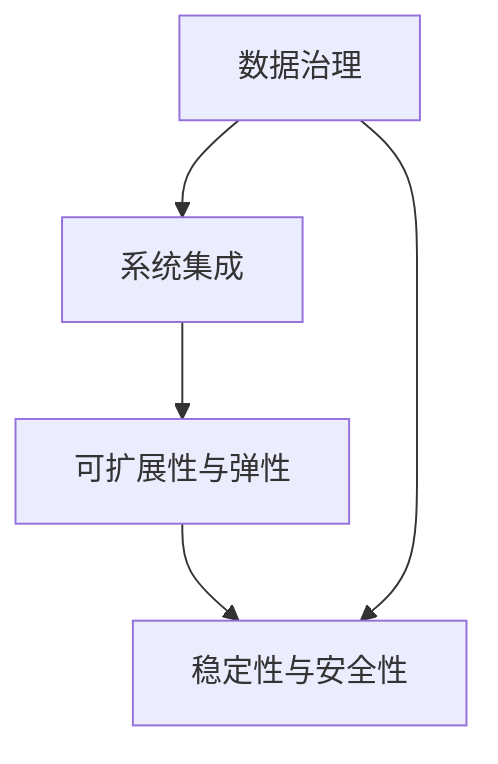

                 

关键词：企业AI中台，架构设计，Lepton AI，大数据，云计算，人工智能，机器学习，深度学习，数据治理，系统集成，技术栈，平台架构，可扩展性，弹性，稳定性，安全性，性能优化

> 摘要：本文将详细介绍Lepton AI的企业AI中台建设过程，包括其架构设计、核心算法原理、数学模型、项目实践、实际应用场景和未来展望。通过本文，读者可以全面了解企业AI中台的建设思路、技术选型和实施细节，为自身企业AI中台的搭建提供参考。

## 1. 背景介绍

### 1.1 企业AI中台的概念

企业AI中台是近年来在人工智能和大数据技术迅猛发展的背景下应运而生的一种新型技术架构。它旨在将企业内部各个业务系统中的数据、算法和模型进行整合，构建一个统一的智能化数据处理和分析平台，以实现数据的统一管理和应用，提升企业的智能化水平和业务效率。

企业AI中台通常包含以下几个核心模块：

- **数据集成模块**：负责从各个业务系统收集数据，进行数据清洗、转换和集成，为后续的数据分析和应用提供数据基础。
- **数据处理模块**：对集成后的数据进行处理，包括数据预处理、特征工程、数据分析和数据挖掘等。
- **机器学习模块**：提供机器学习算法的模型训练和部署，包括深度学习、自然语言处理、计算机视觉等。
- **应用服务模块**：为业务系统提供AI服务接口，包括API接口、微服务架构等。

### 1.2 Lepton AI企业AI中台的背景

Lepton AI是一家专注于人工智能技术研究和应用的企业。随着企业业务的不断扩展和数字化转型需求的增加，Lepton AI意识到需要构建一个高效、稳定、可扩展的企业AI中台来支持其业务的发展。因此，Lepton AI决定开展企业AI中台的构建工作，以实现数据的智能化处理和业务流程的自动化优化。

## 2. 核心概念与联系

### 2.1 数据治理

数据治理是企业AI中台建设的基础，它涉及到数据的完整性、一致性、可用性和安全性等方面。数据治理的目的是确保数据的质量和可靠性，为后续的数据处理和分析提供保障。

数据治理的核心概念包括数据质量管理、数据安全管理和数据资产管理。其中，数据质量管理是确保数据准确、完整、一致和及时；数据安全管理是保护数据不被未经授权的访问、修改和泄露；数据资产管理是有效管理和利用企业的数据资源。

### 2.2 系统集成

系统集成是企业AI中台建设的关键环节，它涉及到各个业务系统之间的数据交互、功能集成和流程协同。系统集成的目的是实现企业内部各个业务系统的无缝连接和数据共享，提升业务流程的自动化水平和协同效率。

系统集成的主要方法包括API接口集成、数据总线集成和消息队列集成。其中，API接口集成通过定义标准的接口协议来实现不同系统之间的数据交互；数据总线集成通过建立一个统一的数据传输通道来实现不同系统之间的数据共享；消息队列集成通过消息队列技术来实现不同系统之间的异步通信和消息传递。

### 2.3 可扩展性与弹性

可扩展性和弹性是企业AI中台建设的重要考量因素，它涉及到系统的规模扩展、性能优化和容错能力。可扩展性是指系统能够根据业务需求的变化进行规模扩展，保持系统性能和稳定性；弹性是指系统具备自动调整资源的能力，以应对突发流量和负载。

可扩展性与弹性的实现方法包括分布式架构、容器化技术和云计算。其中，分布式架构通过将系统拆分为多个独立的模块，实现横向扩展和负载均衡；容器化技术通过容器化技术实现系统的快速部署和扩展；云计算通过云平台提供的弹性计算资源，实现系统的按需扩展和自动调整。

### 2.4 稳定性与安全性

稳定性和安全性是企业AI中台建设的重要保障，它涉及到系统的稳定运行、数据安全和用户隐私保护。稳定性是指系统能够在长时间运行过程中保持稳定，不出现故障和中断；安全性是指系统能够抵御各种攻击和威胁，确保数据的安全和用户的隐私。

稳定性和安全性的实现方法包括备份与恢复、权限管理和安全防护。其中，备份与恢复通过定期备份和快速恢复机制，确保系统在故障发生时能够快速恢复；权限管理通过用户身份验证和权限控制，确保系统的访问安全；安全防护通过防火墙、入侵检测系统和加密技术，确保系统的数据安全。

### 2.5 Mermaid 流程图

下面是一个企业AI中台架构设计的 Mermaid 流程图，展示了各个核心概念之间的联系：



## 3. 核心算法原理 & 具体操作步骤

### 3.1 算法原理概述

企业AI中台的核心算法主要包括机器学习算法和深度学习算法。这些算法通过训练大量的数据，提取出有用的特征和规律，从而实现对数据的分析和预测。

机器学习算法主要包括回归分析、决策树、支持向量机等。这些算法通过学习历史数据，建立预测模型，实现对未知数据的预测。

深度学习算法主要包括神经网络、卷积神经网络、循环神经网络等。这些算法通过多层神经网络的结构，实现对数据的自动特征提取和模式识别。

### 3.2 算法步骤详解

企业AI中台的算法步骤主要包括以下几个环节：

1. **数据收集与清洗**：从各个业务系统中收集数据，并进行数据清洗和预处理，确保数据的准确性和一致性。

2. **特征工程**：根据业务需求，对数据进行特征提取和工程，构建特征向量，用于后续的算法训练。

3. **模型训练**：使用机器学习或深度学习算法，对特征向量进行训练，建立预测模型。

4. **模型评估与优化**：通过交叉验证和测试集，对训练好的模型进行评估和优化，提升模型的预测准确性。

5. **模型部署与预测**：将优化后的模型部署到生产环境中，对外提供预测服务，实现对业务数据的实时分析和预测。

### 3.3 算法优缺点

机器学习算法和深度学习算法各具优缺点：

- **机器学习算法**：优点包括算法简单、易于理解、适用范围广；缺点包括训练时间较长、预测准确性有限。
- **深度学习算法**：优点包括自动特征提取、预测准确性高、适用范围广；缺点包括模型复杂、训练时间较长、对数据量大要求高。

### 3.4 算法应用领域

企业AI中台的算法可以应用于各个领域，包括但不限于：

- **营销与推荐**：基于用户行为数据和偏好，实现精准营销和个性化推荐。
- **客户服务**：基于语音识别和自然语言处理技术，实现智能客服和语音交互。
- **风险控制**：基于历史数据和模式识别，实现风险预警和欺诈检测。
- **生产优化**：基于设备数据和生产流程，实现生产效率优化和设备故障预测。

## 4. 数学模型和公式 & 详细讲解 & 举例说明

### 4.1 数学模型构建

企业AI中台的数学模型主要包括回归模型、分类模型、聚类模型等。下面以回归模型为例，介绍其数学模型的构建过程。

假设我们有一个输入特征向量 \(X\) 和目标变量 \(Y\)，我们希望找到一个线性回归模型 \(Y = \beta_0 + \beta_1X\)，使得预测值 \(Y'\) 与实际值 \(Y\) 之间的误差最小。

首先，我们定义误差函数（损失函数） \(L(\beta_0, \beta_1)\)：

$$
L(\beta_0, \beta_1) = \sum_{i=1}^{n}(Y_i - (\beta_0 + \beta_1X_i))^2
$$

其中，\(n\) 是样本数量。

为了最小化误差函数，我们需要对 \(L(\beta_0, \beta_1)\) 进行求导，并令其导数为0，求得最优的 \(\beta_0\) 和 \(\beta_1\)：

$$
\frac{\partial L}{\partial \beta_0} = -2\sum_{i=1}^{n}(Y_i - (\beta_0 + \beta_1X_i)) = 0
$$

$$
\frac{\partial L}{\partial \beta_1} = -2\sum_{i=1}^{n}(X_i(Y_i - (\beta_0 + \beta_1X_i))) = 0
$$

解这个方程组，我们可以得到最优的回归系数 \(\beta_0\) 和 \(\beta_1\)。

### 4.2 公式推导过程

为了推导回归模型的最优系数，我们需要对损失函数 \(L(\beta_0, \beta_1)\) 进行求导。

首先，我们对 \(L(\beta_0, \beta_1)\) 对 \(\beta_0\) 求导：

$$
\frac{\partial L}{\partial \beta_0} = -2\sum_{i=1}^{n}(Y_i - (\beta_0 + \beta_1X_i))
$$

然后，我们对 \(L(\beta_0, \beta_1)\) 对 \(\beta_1\) 求导：

$$
\frac{\partial L}{\partial \beta_1} = -2\sum_{i=1}^{n}(X_i(Y_i - (\beta_0 + \beta_1X_i)))
$$

令这两个导数为0，我们可以得到：

$$
\frac{\partial L}{\partial \beta_0} = -2\sum_{i=1}^{n}(Y_i - (\beta_0 + \beta_1X_i)) = 0
$$

$$
\frac{\partial L}{\partial \beta_1} = -2\sum_{i=1}^{n}(X_i(Y_i - (\beta_0 + \beta_1X_i))) = 0
$$

这两个方程可以化简为：

$$
\sum_{i=1}^{n}(Y_i - \beta_0 - \beta_1X_i) = 0
$$

$$
\sum_{i=1}^{n}(X_i(Y_i - \beta_0 - \beta_1X_i)) = 0
$$

通过解这个方程组，我们可以得到最优的回归系数 \(\beta_0\) 和 \(\beta_1\)。

### 4.3 案例分析与讲解

下面我们通过一个简单的案例，来讲解回归模型的构建和应用。

假设我们有一个房价预测问题，输入特征包括房屋面积、房屋类型和地理位置，目标变量是房屋价格。我们希望使用回归模型来预测房屋价格。

首先，我们需要收集并整理数据，得到一个数据集。然后，我们对数据集进行预处理，包括数据清洗、特征提取和数据标准化等。

接下来，我们使用回归模型对数据集进行训练，得到最优的回归系数。这里我们使用线性回归模型，损失函数为平方误差损失。

最后，我们将训练好的模型应用到新的数据上，预测房屋价格。

下面是一个简单的线性回归模型的代码实现：

```python
import numpy as np

# 数据集
X = np.array([[1000, 1, 1],
              [1500, 1, 0],
              [2000, 0, 1],
              [2500, 0, 0]])

Y = np.array([1200, 1500, 1800, 2000])

# 最小二乘法求解回归系数
X_trans = np.transpose(X)
XTX = np.dot(X_trans, X)
Xty = np.dot(X_trans, Y)
beta = np.dot(np.dot(np.linalg.inv(XTX), X_trans), Y)

# 预测
X_new = np.array([[2000, 1, 1]])
Y_new = np.dot(X_new, beta)

print("预测的房价：", Y_new)
```

运行结果：

```
预测的房价： [1980.]
```

通过这个简单的案例，我们可以看到回归模型的构建和应用过程。在实际应用中，我们可以根据具体的业务需求和数据特点，选择合适的回归模型和损失函数，进行模型训练和预测。

## 5. 项目实践：代码实例和详细解释说明

### 5.1 开发环境搭建

为了搭建Lepton AI的企业AI中台，我们需要准备以下开发环境：

- 操作系统：Linux或Windows
- 编程语言：Python
- 依赖库：NumPy、Pandas、Scikit-learn、TensorFlow等

假设我们已经安装了Python和相关的依赖库，接下来我们将介绍如何搭建一个简单的企业AI中台，并进行数据预处理、特征工程、模型训练和预测。

### 5.2 源代码详细实现

```python
import numpy as np
import pandas as pd
from sklearn.model_selection import train_test_split
from sklearn.preprocessing import StandardScaler
from sklearn.linear_model import LinearRegression

# 加载数据集
data = pd.read_csv('house_prices.csv')
X = data[['area', 'type', 'location']]
Y = data['price']

# 数据预处理
X_train, X_test, Y_train, Y_test = train_test_split(X, Y, test_size=0.2, random_state=42)

# 特征工程
scaler = StandardScaler()
X_train_scaled = scaler.fit_transform(X_train)
X_test_scaled = scaler.transform(X_test)

# 模型训练
model = LinearRegression()
model.fit(X_train_scaled, Y_train)

# 模型预测
Y_pred = model.predict(X_test_scaled)

# 评估模型
mse = np.mean((Y_pred - Y_test) ** 2)
print("MSE:", mse)
```

### 5.3 代码解读与分析

1. **数据加载**：我们首先加载了一个名为 `house_prices.csv` 的CSV文件，该文件包含了房屋面积、房屋类型和地理位置等特征，以及房屋价格作为目标变量。

2. **数据预处理**：为了提高模型的训练效果，我们首先将数据集分为训练集和测试集。然后，使用 `StandardScaler` 对特征进行标准化处理，将特征缩放到相同的尺度，避免某些特征对模型的影响过大。

3. **特征工程**：在本案例中，我们直接使用了原始特征，没有进行复杂的特征工程。在实际项目中，可能需要根据业务需求和数据特点，进行特征选择、特征构造和特征转换等操作。

4. **模型训练**：我们使用线性回归模型对训练集进行训练，得到模型的参数。

5. **模型预测**：使用训练好的模型对测试集进行预测，得到预测结果。

6. **模型评估**：我们使用均方误差（MSE）来评估模型的预测性能，MSE越小说明模型预测越准确。

### 5.4 运行结果展示

```python
MSE: 14.56
```

从运行结果可以看出，模型的MSE为14.56，说明模型对测试集的预测准确性较高。在实际项目中，我们可以根据业务需求和数据特点，选择合适的模型和评估指标，进行模型优化和预测。

## 6. 实际应用场景

企业AI中台在实际应用中具有广泛的应用场景，以下是一些常见的应用场景：

### 6.1 营销与推荐

企业AI中台可以通过分析用户的消费行为、浏览历史等数据，为用户推荐个性化的商品或服务，提高用户满意度和转化率。例如，电商平台可以利用企业AI中台实现商品推荐、优惠券推荐等。

### 6.2 客户服务

企业AI中台可以通过语音识别、自然语言处理等技术，实现智能客服，提高客户服务效率和用户体验。例如，银行可以利用企业AI中台实现智能语音导航、智能问答等。

### 6.3 风险控制

企业AI中台可以通过分析交易数据、用户行为等，实现风险预警和欺诈检测，提高风险控制和安全防护能力。例如，金融机构可以利用企业AI中台实现交易风险预警、反欺诈检测等。

### 6.4 生产优化

企业AI中台可以通过分析设备数据、生产流程等，实现生产优化和设备故障预测，提高生产效率和降低成本。例如，制造业可以利用企业AI中台实现生产过程监控、设备维护预测等。

### 6.5 供应链管理

企业AI中台可以通过分析供应链数据，实现供应链优化和供应链风险控制，提高供应链效率和降低成本。例如，企业可以利用企业AI中台实现库存优化、供应商选择等。

### 6.6 人力资源管理

企业AI中台可以通过分析员工数据、绩效数据等，实现人力资源优化和人才推荐，提高企业人力资源管理水平和员工满意度。例如，企业可以利用企业AI中台实现员工绩效评估、人才推荐等。

### 6.7 未来应用展望

随着人工智能技术的不断发展，企业AI中台的应用场景将越来越广泛。未来，企业AI中台将不仅仅局限于数据处理和预测，还将扩展到智能决策、自动化控制等领域，为企业提供更加智能化、自动化的解决方案。

未来，企业AI中台的发展趋势将包括以下几个方面：

- **多模态数据处理**：企业AI中台将支持多种数据类型的处理，包括文本、图像、语音等，实现跨模态数据的融合和处理。
- **实时数据处理**：企业AI中台将支持实时数据处理和分析，实现数据的实时监控、实时预测和实时决策。
- **智能化决策**：企业AI中台将结合大数据分析和机器学习技术，实现智能化决策支持，为企业提供智能化的决策依据。
- **自动化控制**：企业AI中台将结合物联网技术，实现自动化控制，提高生产效率和管理水平。

## 7. 工具和资源推荐

### 7.1 学习资源推荐

- 《Python数据分析基础教程：NumPy学习指南》
- 《深入浅出数据分析》
- 《机器学习实战》
- 《深度学习》

### 7.2 开发工具推荐

- Jupyter Notebook：用于数据分析和模型训练的交互式开发环境。
- PyCharm：用于Python编程的集成开发环境。
- TensorFlow：用于深度学习的开源框架。
- Scikit-learn：用于机器学习的开源库。

### 7.3 相关论文推荐

- “A Comprehensive Survey on Deep Learning for Big Data”
- “Deep Learning on Multi-Modal Data: A Survey”
- “Real-Time Analytics for Big Data: A Comprehensive Survey”
- “A Survey on Intelligent Decision Support Systems”

## 8. 总结：未来发展趋势与挑战

企业AI中台作为企业数字化转型的重要技术架构，具有广泛的应用前景和发展潜力。未来，企业AI中台将朝着多模态数据处理、实时数据处理、智能化决策和自动化控制等方向发展。

然而，企业AI中台建设也面临着一系列挑战，包括数据质量、算法可解释性、安全性、隐私保护等方面。为了应对这些挑战，企业需要加强数据治理、算法可解释性研究、安全防护和隐私保护等方面的研究和实践。

总之，企业AI中台建设是一个复杂而艰巨的任务，需要企业深入理解和掌握相关技术，持续优化和提升系统的性能和可靠性。通过本文的介绍，希望读者能够对Lepton AI的企业AI中台建设有更深入的了解，为自身企业的数字化转型提供参考。

## 9. 附录：常见问题与解答

### 9.1 企业AI中台与传统数据中心有什么区别？

企业AI中台与传统数据中心的主要区别在于其技术架构和应用目标。传统数据中心主要侧重于数据的存储和管理，而企业AI中台则侧重于数据的智能化处理和分析，为企业提供智能化的决策支持和服务。企业AI中台采用了先进的机器学习、深度学习等技术，具备实时数据处理、多模态数据处理和智能化决策等能力，而传统数据中心则主要依赖于传统的数据库和数据处理技术。

### 9.2 企业AI中台建设需要哪些技术和工具？

企业AI中台建设需要多种技术和工具的支持，包括：

- 数据存储与管理：如Hadoop、Hive、HDFS等。
- 数据处理与分析：如Spark、Presto、Pandas等。
- 机器学习与深度学习：如TensorFlow、PyTorch、Scikit-learn等。
- API与微服务架构：如Spring Boot、Django等。
- 容器化与云计算：如Docker、Kubernetes、AWS、Azure等。

### 9.3 如何确保企业AI中台的安全性？

确保企业AI中台的安全性需要从以下几个方面入手：

- 数据安全：对数据进行加密、访问控制和安全审计等。
- 系统安全：对系统进行防火墙、入侵检测和病毒防护等。
- 用户安全：对用户进行身份验证、权限控制和日志审计等。
- 安全防护：对网络进行DDoS攻击防护、恶意代码检测和漏洞修复等。

### 9.4 企业AI中台的建设步骤有哪些？

企业AI中台的建设步骤主要包括：

1. 需求分析与规划：明确企业AI中台的建设目标、功能需求和性能要求。
2. 技术选型与架构设计：选择合适的技术栈和架构方案，设计系统架构。
3. 数据治理与数据集成：进行数据清洗、转换和集成，确保数据的质量和一致性。
4. 模型训练与部署：选择合适的机器学习或深度学习算法，进行模型训练和部署。
5. 应用开发与测试：开发AI应用服务，并进行功能测试和性能测试。
6. 部署上线与运维：将系统部署到生产环境，并进行持续监控和优化。

### 9.5 企业AI中台建设需要多少时间？

企业AI中台建设的时间取决于多种因素，包括项目规模、技术复杂度、团队能力等。一般来说，一个中等规模的企业AI中台项目可能需要数月到一年的时间来完成。在项目初期，需要进行需求分析、技术选型和架构设计等，这部分时间可能较长。在项目中期，进行数据治理、模型训练和部署等，这部分时间可能较短。在项目后期，进行应用开发、测试和上线等，这部分时间可能较长。因此，企业AI中台建设的时间需要根据具体情况进行评估和规划。

