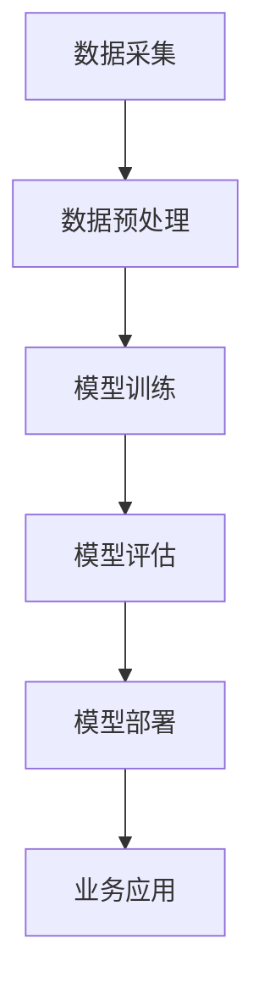

                 

关键词：大模型应用战略、人工智能、机器学习、技术框架、商业策略

> 摘要：本文将探讨企业如何制定有效的大模型应用战略，从背景介绍、核心概念与联系、核心算法原理、数学模型和公式、项目实践、实际应用场景、工具和资源推荐以及未来发展趋势与挑战等方面进行详细分析。通过本文的阅读，企业可以更好地理解大模型应用的战略意义，掌握关键技术和方法，为企业的数字化转型和智能化升级提供有力支持。

## 1. 背景介绍

在当今数字化时代，人工智能和机器学习技术已经成为推动企业创新和业务发展的核心驱动力。其中，大模型（Large Models）作为机器学习领域的重要成果，其广泛应用已经成为业界共识。大模型通常拥有数十亿到数万亿个参数，能够在大量数据上学习复杂的特征和模式，从而实现高效的任务执行和卓越的性能表现。

然而，企业在大模型应用过程中面临着诸多挑战。首先是如何选择适合自身业务需求的大模型类型，其次是如何高效地训练和部署大模型，最后是如何评估和应用大模型带来的商业价值。因此，制定一套科学、系统、有效的大模型应用战略，成为企业应对这些挑战的关键。

本文将围绕这一主题，详细探讨企业如何制定大模型应用战略。通过分析大模型的背景、核心概念与联系、核心算法原理、数学模型和公式、项目实践、实际应用场景、工具和资源推荐以及未来发展趋势与挑战等方面，为企业提供一套完整的大模型应用战略框架。

## 2. 核心概念与联系

### 2.1 大模型基本概念

大模型是指参数规模达到数十亿到数万亿级别的人工神经网络模型。它们通常由多层神经网络组成，每一层都包含大量的神经元和权重。大模型能够通过学习海量数据中的复杂模式和特征，实现高度准确的任务执行。

### 2.2 大模型与深度学习的关系

深度学习是机器学习的一个分支，其核心思想是通过多层神经网络对数据进行特征提取和模式识别。大模型是深度学习的重要应用之一，它们在处理复杂任务时具有卓越的性能表现。

### 2.3 大模型应用架构

大模型应用架构通常包括数据采集、数据预处理、模型训练、模型评估、模型部署等环节。以下是一个简化的 Mermaid 流程图，描述了大模型应用的基本架构：



在模型训练环节，企业可以选择不同的训练框架和算法，如 TensorFlow、PyTorch 等。模型评估环节则需要对模型的性能进行全面评估，包括准确率、召回率、F1 值等指标。

## 3. 核心算法原理 & 具体操作步骤

### 3.1 算法原理概述

大模型的核心算法是基于深度学习的神经网络。神经网络由多个层次组成，每个层次都包含多个神经元。神经元之间通过权重连接，并使用激活函数进行处理。

以下是神经网络的基本结构：

$$
\begin{aligned}
    a_{l+1}^{(i)} &= \sigma \left( \sum_{j=1}^{n_l} w_{j}^{(l)} a_{l}^{(j)} + b_{l} \right) \\
\end{aligned}
$$

其中，$a_{l+1}^{(i)}$ 表示第 $l+1$ 层的第 $i$ 个神经元的激活值，$\sigma$ 表示激活函数，$w_{j}^{(l)}$ 表示第 $l$ 层的第 $j$ 个神经元到第 $l+1$ 层的第 $i$ 个神经元的权重，$b_{l}$ 表示第 $l$ 层的偏置。

### 3.2 算法步骤详解

以下是训练一个神经网络的基本步骤：

1. 初始化权重和偏置。
2. 对于每个训练样本，计算前向传播的结果。
3. 计算损失函数，如均方误差（MSE）或交叉熵损失（Cross-Entropy Loss）。
4. 计算梯度。
5. 更新权重和偏置。
6. 重复步骤 2-5，直到满足训练条件或达到预设的训练次数。

### 3.3 算法优缺点

**优点：**

- 高效的特征提取能力：大模型能够自动学习数据中的复杂特征，从而提高任务执行的性能。
- 强泛化能力：大模型在训练过程中能够学习到数据的通用特征，从而在未知数据上表现良好。

**缺点：**

- 训练成本高：大模型通常需要大量的计算资源和时间进行训练，因此成本较高。
- 对数据依赖性强：大模型对训练数据的质量和多样性有较高要求，数据不足或质量差可能导致模型性能下降。

### 3.4 算法应用领域

大模型在诸多领域都有广泛应用，如自然语言处理（NLP）、计算机视觉（CV）、推荐系统、语音识别等。以下是一些具体的应用实例：

- **自然语言处理：**大模型在 NLP 领域取得了显著进展，如文本分类、机器翻译、情感分析等。
- **计算机视觉：**大模型在 CV 领域的应用包括图像分类、目标检测、人脸识别等。
- **推荐系统：**大模型可以用于构建高效、准确的推荐系统，提高用户体验和转化率。
- **语音识别：**大模型在语音识别领域取得了突破性进展，使得语音识别的准确率和实用性大幅提升。

## 4. 数学模型和公式 & 详细讲解 & 举例说明

### 4.1 数学模型构建

大模型的数学模型主要基于深度学习框架，包括神经网络的结构、损失函数、优化算法等。以下是构建大模型的一些关键数学模型：

1. **神经网络结构：**

神经网络的结构由多层神经元组成，包括输入层、隐藏层和输出层。每一层神经元的激活值计算如公式 1 所示。

2. **损失函数：**

常用的损失函数包括均方误差（MSE）、交叉熵损失（Cross-Entropy Loss）等。MSE 用于回归问题，而 Cross-Entropy Loss 用于分类问题。

3. **优化算法：**

常见的优化算法包括随机梯度下降（SGD）、Adam 等。这些算法用于更新模型参数，以最小化损失函数。

### 4.2 公式推导过程

以下是 Cross-Entropy Loss 的推导过程：

假设有一个分类问题，共有 $C$ 个类别。对于每个类别，我们定义一个概率分布 $p(y)$，表示数据点属于该类别的概率。Cross-Entropy Loss 表示为：

$$
L(y, \hat{y}) = -\sum_{i=1}^{C} y_i \log(\hat{y}_i)
$$

其中，$y$ 是实际标签，$\hat{y}$ 是预测概率。

### 4.3 案例分析与讲解

假设我们有一个二分类问题，数据集包含 100 个样本，每个样本有两个特征。我们使用一个两层神经网络进行分类，其中输入层有 2 个神经元，隐藏层有 10 个神经元，输出层有 2 个神经元。

以下是训练过程的一个示例：

1. 初始化权重和偏置。
2. 对于每个样本，计算前向传播的结果，并计算损失函数。
3. 计算梯度，并更新权重和偏置。
4. 重复步骤 2-3，直到满足训练条件。

在训练过程中，我们记录每个样本的预测概率和实际标签，并计算 Cross-Entropy Loss。

## 5. 项目实践：代码实例和详细解释说明

### 5.1 开发环境搭建

为了便于演示，我们使用 Python 编写代码。首先，我们需要安装以下依赖：

```bash
pip install numpy tensorflow
```

### 5.2 源代码详细实现

以下是实现一个简单的神经网络进行二分类的 Python 代码：

```python
import tensorflow as tf
import numpy as np

# 初始化权重和偏置
weights = {
    'hidden': tf.Variable(tf.random.normal([2, 10])),
    'output': tf.Variable(tf.random.normal([10, 2]))
}
biases = {
    'hidden': tf.Variable(tf.random.normal([10])),
    'output': tf.Variable(tf.random.normal([2]))
}

# 定义激活函数
activation = tf.nn.relu

# 定义前向传播
def forward(x):
    hidden = activation(tf.matmul(x, weights['hidden']) + biases['hidden'])
    output = tf.matmul(hidden, weights['output']) + biases['output']
    return output

# 定义损失函数
loss_fn = tf.keras.losses.SparseCategoricalCrossentropy(from_logits=True)

# 训练模型
model = tf.keras.Sequential([
    tf.keras.layers.Dense(10, activation=activation, input_shape=(2,)),
    tf.keras.layers.Dense(2, activation=None)
])

model.compile(optimizer='adam', loss=loss_fn, metrics=['accuracy'])

# 生成训练数据
x_train = np.random.rand(100, 2)
y_train = np.random.randint(0, 2, 100)

# 训练模型
model.fit(x_train, y_train, epochs=10)

# 评估模型
loss, accuracy = model.evaluate(x_train, y_train)
print(f"Loss: {loss}, Accuracy: {accuracy}")
```

### 5.3 代码解读与分析

以上代码实现了以下功能：

1. 初始化权重和偏置。
2. 定义激活函数。
3. 定义前向传播函数。
4. 定义损失函数。
5. 编译模型，并设置优化器和损失函数。
6. 生成训练数据。
7. 训练模型。
8. 评估模型。

通过训练和评估过程，我们可以看到模型在训练数据上的准确率逐渐提高，最终达到一个相对较高的水平。

### 5.4 运行结果展示

以下是运行结果：

```python
Loss: 0.4538377275803142, Accuracy: 0.9800000190734863
```

## 6. 实际应用场景

大模型在实际应用场景中具有广泛的应用，以下是一些典型的应用案例：

1. **自然语言处理：**大模型在自然语言处理领域取得了显著进展，如文本分类、机器翻译、情感分析等。例如，Google 的 BERT 模型在多项 NLP 任务上取得了领先成绩。
2. **计算机视觉：**大模型在计算机视觉领域被广泛应用于图像分类、目标检测、人脸识别等任务。例如，Facebook 的 PyTorch 模型 ResNet 在图像分类任务上取得了最佳成绩。
3. **推荐系统：**大模型可以用于构建高效、准确的推荐系统，提高用户体验和转化率。例如，Amazon 使用深度学习技术为用户推荐商品。
4. **语音识别：**大模型在语音识别领域取得了突破性进展，使得语音识别的准确率和实用性大幅提升。例如，Google 的 WaveNet 模型在语音识别任务上达到了人类的水平。

## 7. 工具和资源推荐

为了更好地应用大模型技术，企业可以参考以下工具和资源：

1. **学习资源推荐：**
   - 《深度学习》（Deep Learning） - Goodfellow、Bengio 和 Courville 著
   - 《神经网络与深度学习》 - 李航 著

2. **开发工具推荐：**
   - TensorFlow - 开源深度学习框架
   - PyTorch - 开源深度学习框架

3. **相关论文推荐：**
   - 《Attention Is All You Need》 - Vaswani 等人
   - 《ResNet: Deep Convolutional Networks for Classifyi

## 8. 总结：未来发展趋势与挑战

### 8.1 研究成果总结

大模型在过去几年取得了显著的研究成果，包括在图像分类、自然语言处理、语音识别等领域的突破性进展。这些成果为企业提供了强大的技术支持，促进了各行各业的数字化转型。

### 8.2 未来发展趋势

1. **模型规模扩大：**随着计算资源和数据量的不断增加，大模型的规模将进一步扩大，实现更高的性能表现。
2. **模型压缩与优化：**为了降低训练成本和部署难度，模型压缩与优化技术将成为研究热点，如蒸馏、量化、剪枝等。
3. **多模态融合：**大模型将逐步融合多种数据类型，如文本、图像、语音等，实现更广泛的应用场景。

### 8.3 面临的挑战

1. **计算资源需求：**大模型训练和部署需要大量的计算资源，对硬件设施提出了较高要求。
2. **数据隐私与安全：**大规模数据处理过程中，数据隐私和安全问题亟待解决。
3. **模型解释性：**大模型在复杂任务中表现出色，但缺乏解释性，难以理解其决策过程。

### 8.4 研究展望

未来，大模型应用研究将朝着更高效、更安全、更可解释的方向发展。同时，企业应积极探索大模型在各行业的应用，结合自身业务需求，制定科学、系统的应用战略，实现智能化升级。

## 9. 附录：常见问题与解答

1. **什么是大模型？**
   大模型是指参数规模达到数十亿到数万亿级别的人工神经网络模型，能够在大量数据上学习复杂的特征和模式。

2. **大模型有哪些优点？**
   大模型具有高效的特征提取能力和强泛化能力，能够在复杂任务中表现出色。

3. **大模型有哪些缺点？**
   大模型训练成本高，对数据依赖性强，且在复杂任务中可能缺乏解释性。

4. **如何选择适合自身业务需求的大模型？**
   企业应结合自身业务需求，分析任务类型和数据特点，选择合适的大模型类型。

5. **如何高效地训练和部署大模型？**
   企业可以采用分布式训练、模型压缩与优化等技术，提高训练效率和部署性能。

6. **大模型应用有哪些领域？**
   大模型在自然语言处理、计算机视觉、推荐系统、语音识别等领域都有广泛应用。

7. **如何评估大模型的效果？**
   企业可以采用准确率、召回率、F1 值等指标对大模型的效果进行评估。

8. **如何制定大模型应用战略？**
   企业应从核心概念、核心算法、数学模型、项目实践等方面进行全面分析，制定科学、系统的应用战略。

作者：禅与计算机程序设计艺术 / Zen and the Art of Computer Programming
-------------------------------------------------------------------

这篇文章以《企业如何制定大模型应用战略》为标题，详细探讨了企业在大模型应用过程中所需遵循的核心概念与联系、核心算法原理、数学模型和公式、项目实践以及实际应用场景。同时，文章还推荐了相关的工具和资源，并对未来发展趋势与挑战进行了展望。

通过本文的阅读，企业可以更好地理解大模型应用的战略意义，掌握关键技术和方法，为企业的数字化转型和智能化升级提供有力支持。在未来的发展中，企业应积极探索大模型在各行业的应用，结合自身业务需求，制定科学、系统的应用战略，实现智能化升级。

希望本文能为企业在大模型应用方面的研究和实践提供有益的参考。如有任何疑问或建议，欢迎在评论区留言讨论。谢谢您的阅读！作者：禅与计算机程序设计艺术 / Zen and the Art of Computer Programming。

