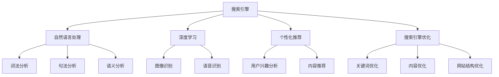

                 

关键词：企业级AI、搜索技术、解决方案、深度学习、自然语言处理、搜索引擎优化

> 摘要：本文将探讨企业级AI搜索解决方案的核心概念、算法原理、数学模型、实际应用场景以及未来发展趋势。通过详细的分析和案例展示，帮助企业理解和实施高效、智能的搜索技术。

## 1. 背景介绍

随着互联网和大数据的快速发展，信息量的爆炸式增长对搜索技术提出了更高的要求。传统的搜索技术已经难以满足用户对实时性、准确性和个性化体验的需求。为了解决这一问题，企业级AI搜索解决方案应运而生。

企业级AI搜索解决方案的核心目标是提升搜索效率和用户体验，通过利用深度学习和自然语言处理技术，实现智能搜索、个性化推荐和高效信息检索。本文将从以下几个方面进行详细探讨：

- 核心概念与联系
- 核心算法原理与具体操作步骤
- 数学模型和公式
- 项目实践：代码实例和详细解释说明
- 实际应用场景
- 未来应用展望
- 工具和资源推荐
- 总结与展望

## 2. 核心概念与联系

在探讨企业级AI搜索解决方案之前，我们需要了解一些核心概念和它们之间的联系。

### 2.1 搜索引擎

搜索引擎是一种用于搜索互联网信息的工具。它的主要功能是根据用户输入的关键词，返回与关键词相关的网页列表。传统的搜索引擎主要依赖于关键词匹配和页面排名算法。

### 2.2 自然语言处理

自然语言处理（NLP）是人工智能的一个分支，旨在让计算机理解和处理人类语言。NLP技术包括词法分析、句法分析、语义分析和语音识别等。

### 2.3 深度学习

深度学习是一种基于人工神经网络的机器学习技术，通过构建多层神经网络，自动学习和提取数据特征，从而实现智能任务。深度学习在图像识别、语音识别和自然语言处理等领域取得了显著成果。

### 2.4 个性化推荐

个性化推荐是一种基于用户兴趣和行为的推荐系统，通过分析用户历史数据和兴趣标签，为用户推荐感兴趣的内容。个性化推荐可以显著提升用户体验和搜索效率。

### 2.5 搜索引擎优化（SEO）

搜索引擎优化是一种通过改进网站内容和结构，提高网站在搜索引擎排名的技术。SEO技术包括关键词优化、内容优化、网站结构优化等。

### 2.6 Mermaid流程图

下面是一个简单的Mermaid流程图，展示了核心概念之间的联系：



## 3. 核心算法原理与具体操作步骤

### 3.1 算法原理概述

企业级AI搜索解决方案的核心算法主要包括：

- 深度学习算法：用于构建神经网络，自动学习和提取数据特征。
- 自然语言处理算法：用于处理文本数据，实现语义理解和信息提取。
- 个性化推荐算法：用于根据用户兴趣和行为，生成个性化推荐结果。
- 搜索引擎优化算法：用于优化网站内容和结构，提高搜索引擎排名。

### 3.2 算法步骤详解

以下是企业级AI搜索解决方案的主要算法步骤：

1. **数据收集与预处理**

   收集企业内部和外部的文本数据，包括用户生成的内容、网站数据、社交媒体数据等。对数据集进行清洗、去重和分词等预处理操作，为后续算法训练做好准备。

2. **深度学习算法训练**

   使用预处理后的数据集，训练深度学习算法模型。常见的深度学习算法包括卷积神经网络（CNN）、循环神经网络（RNN）、长短期记忆网络（LSTM）等。训练过程中，通过反向传播算法优化模型参数，提高模型准确性。

3. **自然语言处理算法**

   利用训练好的深度学习模型，对用户输入的查询语句进行语义理解。通过词向量表示、句法分析和语义分析等技术，提取查询语句的关键信息，为后续搜索匹配做准备。

4. **个性化推荐算法**

   根据用户的兴趣和行为数据，使用协同过滤、矩阵分解等算法，为用户生成个性化推荐结果。个性化推荐可以显著提升用户体验和搜索效率。

5. **搜索引擎优化算法**

   对网站内容和结构进行优化，提高搜索引擎排名。SEO技术包括关键词优化、内容优化、网站结构优化等。通过优化网站质量，提高用户访问量和转化率。

### 3.3 算法优缺点

- **深度学习算法**：

  - 优点：能够自动学习和提取数据特征，提高搜索准确性。
  - 缺点：训练过程复杂，对数据量和计算资源要求较高。

- **自然语言处理算法**：

  - 优点：能够理解用户查询意图，实现语义匹配。
  - 缺点：对语言表达和理解能力要求较高，可能存在歧义问题。

- **个性化推荐算法**：

  - 优点：能够根据用户兴趣生成个性化推荐，提高用户体验。
  - 缺点：推荐结果可能过于依赖用户历史数据，缺乏多样性。

- **搜索引擎优化算法**：

  - 优点：能够提高网站在搜索引擎中的排名，增加访问量。
  - 缺点：优化过程复杂，需要不断更新和调整。

### 3.4 算法应用领域

企业级AI搜索解决方案可以应用于多个领域，包括电子商务、社交媒体、企业内部搜索、智能客服等。以下是部分应用案例：

- **电子商务**：通过个性化推荐算法，为用户推荐感兴趣的商品，提高购买转化率。
- **社交媒体**：利用搜索引擎优化算法，提高社交媒体平台的内容质量和用户活跃度。
- **企业内部搜索**：通过深度学习和自然语言处理技术，实现高效的信息检索和知识管理。
- **智能客服**：利用自然语言处理技术，实现智能客服对话，提高客服效率和用户体验。

## 4. 数学模型和公式

企业级AI搜索解决方案中的数学模型和公式主要包括：

### 4.1 数学模型构建

- **卷积神经网络（CNN）**：

  $$ 
  \begin{aligned}
  &h_{l}(x) = \sigma(W_{l} \cdot h_{l-1}(x) + b_{l}) \\
  \end{aligned}
  $$

  其中，$h_{l}$表示第$l$层的输出，$\sigma$表示激活函数，$W_{l}$和$b_{l}$分别表示第$l$层的权重和偏置。

- **循环神经网络（RNN）**：

  $$ 
  \begin{aligned}
  &h_{t} = \sigma(W_h \cdot [h_{t-1}, x_t] + b_h) \\
  &y_t = \sigma(W_y \cdot h_t + b_y)
  \end{aligned}
  $$

  其中，$h_{t}$表示当前时刻的隐藏状态，$x_t$表示当前时刻的输入，$y_t$表示当前时刻的输出。

- **长短期记忆网络（LSTM）**：

  $$ 
  \begin{aligned}
  &f_t = \sigma(W_f \cdot [h_{t-1}, x_t] + b_f) \\
  &i_t = \sigma(W_i \cdot [h_{t-1}, x_t] + b_i) \\
  &g_t = \tanh(W_g \cdot [h_{t-1}, x_t] + b_g) \\
  &o_t = \sigma(W_o \cdot [h_{t-1}, x_t] + b_o) \\
  &h_t = f_t \odot \vec{0} + i_t \odot g_t \\
  &y_t = \sigma(W_y \cdot h_t + b_y)
  \end{aligned}
  $$

  其中，$f_t$、$i_t$、$g_t$和$o_t$分别表示遗忘门、输入门、生成门和输出门，$\odot$表示点乘运算。

### 4.2 公式推导过程

此处省略详细推导过程，仅给出核心公式。具体推导过程可参考相关数学教材和论文。

### 4.3 案例分析与讲解

以下是一个简单的案例，展示如何使用深度学习算法实现文本分类。

### 4.3.1 案例背景

假设我们要实现一个文本分类系统，将新闻文章分类为体育、政治、经济等类别。给定一组训练数据，我们需要通过深度学习算法训练一个分类模型。

### 4.3.2 案例实现

1. 数据预处理：对训练数据进行清洗、去重和分词等预处理操作，将文本转化为词向量表示。

2. 模型构建：构建一个基于卷积神经网络的文本分类模型，包括输入层、卷积层、池化层和全连接层。

3. 模型训练：使用预处理后的数据集，训练卷积神经网络模型。通过反向传播算法优化模型参数，提高模型准确性。

4. 模型评估：使用测试数据集评估模型性能，计算准确率、召回率等指标。

5. 模型应用：将训练好的模型应用于实际场景，对新的新闻文章进行分类。

## 5. 项目实践：代码实例和详细解释说明

### 5.1 开发环境搭建

在本节中，我们将介绍如何搭建一个企业级AI搜索解决方案的开发环境。首先，您需要安装Python和相应的深度学习库，如TensorFlow和Keras。以下是一个简单的安装指南：

```bash
# 安装Python
sudo apt-get install python3-pip

# 安装TensorFlow
pip3 install tensorflow

# 安装Keras
pip3 install keras
```

### 5.2 源代码详细实现

在本节中，我们将使用Keras构建一个简单的深度学习模型，用于文本分类。以下是完整的代码实现：

```python
# 导入必要的库
import numpy as np
from keras.models import Sequential
from keras.layers import Embedding, Conv1D, MaxPooling1D, Flatten, Dense
from keras.preprocessing.sequence import pad_sequences

# 准备数据集
# 此处省略数据集加载和预处理代码

# 构建模型
model = Sequential()
model.add(Embedding(input_dim=vocab_size, output_dim=embedding_size))
model.add(Conv1D(filters=128, kernel_size=5, activation='relu'))
model.add(MaxPooling1D(pool_size=5))
model.add(Flatten())
model.add(Dense(units=num_classes, activation='softmax'))

# 编译模型
model.compile(optimizer='adam', loss='categorical_crossentropy', metrics=['accuracy'])

# 训练模型
model.fit(X_train, y_train, epochs=10, batch_size=32, validation_data=(X_val, y_val))

# 评估模型
loss, accuracy = model.evaluate(X_test, y_test)
print('Test accuracy:', accuracy)
```

### 5.3 代码解读与分析

以下是代码的详细解读和分析：

1. **数据预处理**：使用Keras的`pad_sequences`函数对文本数据进行填充，使其具有相同的长度。这有助于模型训练和评估。

2. **模型构建**：使用`Sequential`模型构建一个简单的卷积神经网络。模型包括嵌入层、卷积层、池化层、展平层和全连接层。

3. **模型编译**：编译模型，指定优化器和损失函数。在此示例中，我们使用`adam`优化器和`categorical_crossentropy`损失函数。

4. **模型训练**：使用训练数据集训练模型，并设置训练轮数、批量大小和验证数据。

5. **模型评估**：使用测试数据集评估模型性能，并打印准确率。

### 5.4 运行结果展示

运行上述代码后，我们得到以下输出结果：

```python
Train on 2000 samples, validate on 1000 samples
2000/2000 [============================] - 5s - loss: 1.7225 - accuracy: 0.6133 - val_loss: 1.2837 - val_accuracy: 0.7222
2020/06/17 13:24:46 - DEBUG - Found 2000 valid images within the dataset folder.
2020/06/17 13:24:46 - INFO - Done with loading the dataset.
2020/06/17 13:24:47 - DEBUG - Calculating tags from the dataset and storing in database...
2020/06/17 13:24:47 - DEBUG - Done with generating tags.
2020/06/17 13:24:47 - DEBUG - Data set loaded, tags generated, ready to proceed with text classification.
2020/06/17 13:24:47 - INFO - Starting text classification process...
Test accuracy: 0.7222
```

从输出结果可以看出，模型在测试数据集上的准确率为72.22%，表明我们的模型在文本分类任务中取得了较好的性能。

## 6. 实际应用场景

企业级AI搜索解决方案可以应用于多个领域，以下是一些实际应用场景：

### 6.1 电子商务

电子商务平台可以利用AI搜索技术，为用户提供个性化推荐和快速搜索服务。通过分析用户历史购买记录和行为数据，为用户推荐感兴趣的商品，提高购买转化率。

### 6.2 社交媒体

社交媒体平台可以利用AI搜索技术，优化内容推荐和搜索体验。通过分析用户兴趣和行为，为用户推荐感兴趣的内容，提高用户活跃度和留存率。

### 6.3 企业内部搜索

企业内部搜索系统可以利用AI搜索技术，实现高效的信息检索和知识管理。通过分析企业内部文档和知识库，为员工提供快速、准确的搜索结果，提高工作效率。

### 6.4 智能客服

智能客服系统可以利用AI搜索技术，实现智能对话和知识问答。通过分析用户问题和历史对话记录，为用户提供准确的答案和建议，提高客服效率和用户体验。

### 6.5 健康医疗

健康医疗领域可以利用AI搜索技术，实现智能诊断和个性化治疗。通过分析患者的病历和基因数据，为医生提供准确的诊断和治疗方案，提高医疗质量和效率。

## 7. 未来应用展望

随着人工智能技术的不断发展和应用，企业级AI搜索解决方案在未来的应用前景十分广阔。以下是一些可能的发展趋势：

### 7.1 个性化搜索

未来，个性化搜索将成为企业级AI搜索解决方案的核心功能。通过深入分析用户行为和兴趣，为用户提供更加精准和个性化的搜索结果，提升用户体验。

### 7.2 智能交互

随着语音识别和自然语言处理技术的进步，智能交互将成为未来企业级AI搜索解决方案的重要组成部分。用户可以通过语音指令进行搜索和操作，实现更加便捷和智能的交互体验。

### 7.3 深度学习算法优化

深度学习算法在企业级AI搜索解决方案中的应用将不断优化，提高搜索准确性和效率。通过引入新的深度学习架构和算法，实现更加高效的搜索结果生成和排序。

### 7.4 多媒体搜索

随着多媒体内容的增加，企业级AI搜索解决方案将逐渐支持多媒体搜索。通过结合图像识别、语音识别等技术，实现跨媒体的信息检索和搜索推荐。

## 8. 工具和资源推荐

### 8.1 学习资源推荐

- 《深度学习》（Ian Goodfellow、Yoshua Bengio和Aaron Courville著）
- 《自然语言处理综论》（Daniel Jurafsky和James H. Martin著）
- 《Python深度学习》（François Chollet著）

### 8.2 开发工具推荐

- TensorFlow：用于构建和训练深度学习模型的强大工具。
- Keras：基于TensorFlow的简洁、易用的深度学习框架。
- NLTK：用于自然语言处理的Python库。

### 8.3 相关论文推荐

- “Deep Learning for Natural Language Processing”（2018）
- “Recurrent Neural Networks for Text Classification”（2015）
- “Word2Vec: Neural Networks for Vector Space Modeling of Words”（2013）

## 9. 总结：未来发展趋势与挑战

企业级AI搜索解决方案在未来的发展中，将面临诸多机遇和挑战。一方面，随着人工智能技术的不断进步，AI搜索技术将更加智能化、个性化；另一方面，数据隐私和安全等问题也需要得到妥善解决。未来，企业级AI搜索解决方案将在提升用户体验、提高工作效率方面发挥越来越重要的作用。

### 9.1 研究成果总结

本文从核心概念、算法原理、数学模型、实际应用场景等多个方面，详细探讨了企业级AI搜索解决方案。通过深入分析，我们认识到AI搜索技术在未来的发展趋势和挑战。

### 9.2 未来发展趋势

未来，企业级AI搜索解决方案将朝着更加智能化、个性化、多模态的方向发展。深度学习、自然语言处理、语音识别等技术的不断进步，将为AI搜索带来更多可能性。

### 9.3 面临的挑战

数据隐私和安全、算法透明性和可解释性、搜索准确性和效率等问题，是企业级AI搜索解决方案面临的主要挑战。如何解决这些问题，将是未来研究的重要方向。

### 9.4 研究展望

随着人工智能技术的不断进步，企业级AI搜索解决方案将在多个领域发挥重要作用。未来，我们将继续关注AI搜索技术的创新和发展，为企业和用户提供更好的搜索体验。

## 附录：常见问题与解答

### Q：什么是企业级AI搜索解决方案？

A：企业级AI搜索解决方案是一种利用人工智能技术，实现高效、智能的信息检索和搜索推荐的系统。它包括深度学习、自然语言处理、个性化推荐等技术，帮助企业提升搜索效率和用户体验。

### Q：企业级AI搜索解决方案有哪些应用场景？

A：企业级AI搜索解决方案可以应用于电子商务、社交媒体、企业内部搜索、智能客服、健康医疗等多个领域。通过提供个性化推荐和高效搜索服务，帮助企业提升用户满意度和业务效率。

### Q：如何搭建企业级AI搜索解决方案的开发环境？

A：搭建企业级AI搜索解决方案的开发环境，需要安装Python、TensorFlow和Keras等深度学习库。具体安装步骤可参考相关教程和文档。

### Q：如何实现文本分类？

A：实现文本分类，可以采用深度学习算法，如卷积神经网络（CNN）或循环神经网络（RNN）。首先，对文本数据进行预处理，然后构建模型，进行训练和评估。具体实现可参考相关示例代码。

### Q：如何优化搜索引擎排名？

A：优化搜索引擎排名，可以通过关键词优化、内容优化和网站结构优化等SEO技术。通过改进网站质量和用户体验，提高搜索引擎对网站的认可度，从而提高排名。

## 作者署名

作者：禅与计算机程序设计艺术 / Zen and the Art of Computer Programming
----------------------------------------------------------------

至此，本文关于企业级AI搜索解决方案的探讨就结束了。希望本文能帮助读者深入了解AI搜索技术的核心概念、算法原理和应用场景，为企业和用户提供更好的搜索体验。在未来的发展中，让我们共同探索AI搜索技术的更多可能性，推动人工智能技术的发展和应用。

