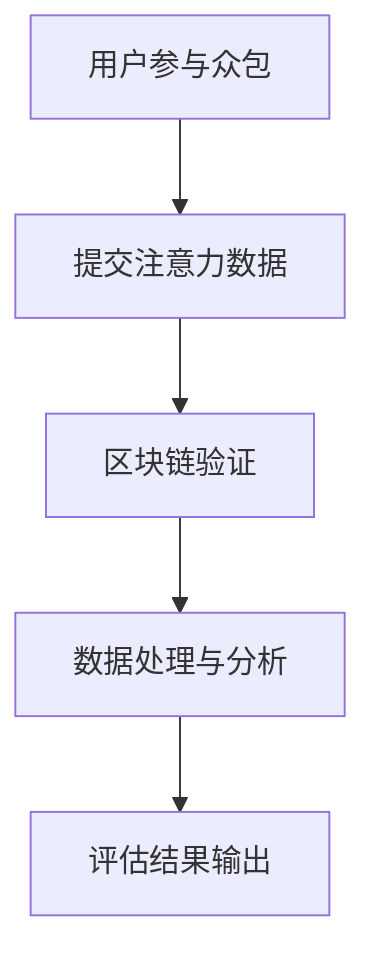

                 

关键词：众包、区块链、注意力价值评估、去中心化、人工智能

> 摘要：本文探讨了众包与区块链技术在注意力价值评估中的应用。通过分析众包模式的优点和区块链技术的特性，本文提出了一种结合二者优势的方法，用于更加精准地评估用户的注意力价值。本文还介绍了核心算法原理、数学模型及具体应用案例，并展望了未来的发展方向。

## 1. 背景介绍

在信息爆炸的时代，用户对信息的需求呈现出多样化和个性化的特点。如何准确评估用户在特定场景下的注意力价值，成为众多企业和研究机构关注的热点问题。传统的注意力评估方法通常依赖于问卷调查、行为分析等技术，但这些方法往往存在主观性、成本高等问题，难以实现高效和精准的评估。

近年来，随着互联网和信息技术的发展，众包和区块链技术逐渐进入公众视野。众包模式通过将任务分散到大量参与者中，能够以低成本实现大规模数据处理和分析。区块链技术以其去中心化、不可篡改的特性，为数据的安全性和透明性提供了强有力的保障。将众包与区块链技术相结合，有望解决传统注意力评估方法中存在的诸多问题。

本文旨在探讨众包与区块链在注意力价值评估中的应用，提出一种基于去中心化数据处理的注意力价值评估模型，并通过实际案例验证其有效性和可行性。

## 2. 核心概念与联系

### 2.1 众包

众包（Crowdsourcing）是指将一个任务或问题发布到网络平台，通过大量参与者共同协作来解决或完成该任务或问题的一种模式。众包模式具有以下几个核心特征：

1. **分散性**：参与者来自全球各地，任务或问题被分散到各个参与者手中。
2. **多样性**：参与者背景、技能和知识各不相同，能够提供多样化的解决方案。
3. **灵活性**：任务或问题的发布者可以根据需求灵活调整任务类型和难度。

### 2.2 区块链技术

区块链技术（Blockchain）是一种分布式账本技术，通过加密算法和共识机制确保数据的不可篡改和透明性。区块链技术具有以下几个核心特性：

1. **去中心化**：区块链上的数据由多个节点共同维护，不存在中央控制机构。
2. **不可篡改**：一旦数据被写入区块链，就无法被修改或删除，保证了数据的真实性和完整性。
3. **透明性**：区块链上的数据对所有节点可见，提高了数据的透明度和可追溯性。

### 2.3 注意力价值评估

注意力价值评估旨在通过量化用户在特定场景下的注意力程度，为企业和研究机构提供决策依据。注意力价值评估的核心概念包括：

1. **注意力强度**：用户在特定场景下的注意力集中程度。
2. **注意力持续时间**：用户在特定场景下的注意力持续时间。
3. **注意力质量**：用户在特定场景下的注意力质量，即注意力对任务或问题的贡献程度。

### 2.4 Mermaid 流程图

以下是一个简化的 Mermaid 流程图，用于描述众包与区块链在注意力价值评估中的应用架构：



### 2.5 联系与意义

众包与区块链技术在注意力价值评估中的应用，旨在解决传统评估方法中存在的问题，如数据主观性、成本高等。通过众包模式，可以收集到大量真实的用户注意力数据；而区块链技术则能够确保这些数据的真实性和完整性。二者结合，为注意力价值评估提供了更加高效和精准的解决方案。

## 3. 核心算法原理 & 具体操作步骤

### 3.1 算法原理概述

本文提出的注意力价值评估算法基于以下核心原理：

1. **注意力强度与持续时间**：通过用户在任务过程中的行为数据，量化用户的注意力强度和持续时间。
2. **注意力质量评估**：结合用户历史数据和任务特征，对用户的注意力质量进行评估。
3. **综合评分计算**：将注意力强度、持续时间和质量相结合，计算用户的综合注意力评分。

### 3.2 算法步骤详解

#### 3.2.1 数据采集

1. **用户行为数据**：通过众包平台收集用户在任务过程中的点击、浏览、停留等行为数据。
2. **用户历史数据**：从用户历史行为数据中提取注意力特征，如任务完成率、错误率等。

#### 3.2.2 数据预处理

1. **数据清洗**：去除重复、无效或异常的数据。
2. **数据归一化**：对数据进行归一化处理，使其符合统一标准。

#### 3.2.3 注意力强度与持续时间计算

1. **注意力强度**：基于用户行为数据，计算用户在任务过程中的注意力强度。
   $$ I = \frac{\sum_{i=1}^{n} b_i}{n} $$
   其中，$I$ 表示注意力强度，$b_i$ 表示第 $i$ 次行为的数据值。
2. **注意力持续时间**：计算用户在任务过程中的注意力持续时间。
   $$ T = \sum_{i=1}^{n} t_i $$
   其中，$T$ 表示注意力持续时间，$t_i$ 表示第 $i$ 次行为的时间长度。

#### 3.2.4 注意力质量评估

1. **质量特征提取**：从用户历史数据中提取质量特征，如任务完成率、错误率等。
2. **质量评分计算**：基于质量特征，计算用户的注意力质量评分。
   $$ Q = \frac{\sum_{i=1}^{m} w_i q_i}{m} $$
   其中，$Q$ 表示注意力质量评分，$w_i$ 表示第 $i$ 个质量特征的权重，$q_i$ 表示第 $i$ 个质量特征的值。

#### 3.2.5 综合评分计算

1. **综合评分**：将注意力强度、持续时间和质量评分相结合，计算用户的综合注意力评分。
   $$ S = \alpha I + \beta T + \gamma Q $$
   其中，$S$ 表示综合评分，$\alpha$、$\beta$、$\gamma$ 分别为注意力强度、持续时间和质量评分的权重。

### 3.3 算法优缺点

#### 3.3.1 优点

1. **高效性**：通过众包模式，能够快速收集大量用户注意力数据。
2. **真实性**：区块链技术确保了数据的真实性和完整性。
3. **精准性**：结合注意力强度、持续时间和质量评分，实现了对用户注意力价值的精准评估。

#### 3.3.2 缺点

1. **数据隐私**：虽然区块链技术具有去中心化和不可篡改的特性，但数据隐私保护仍需进一步研究。
2. **计算复杂度**：大量数据的处理和分析需要较高的计算资源。

### 3.4 算法应用领域

1. **广告营销**：通过评估用户注意力价值，实现精准投放广告。
2. **教育领域**：根据学生注意力价值评估，提供个性化的教育服务。
3. **企业内部管理**：评估员工的工作注意力价值，优化人力资源配置。

## 4. 数学模型和公式 & 详细讲解 & 举例说明

### 4.1 数学模型构建

本文提出的数学模型主要包括以下三个部分：

1. **用户注意力强度计算**：
   $$ I = \frac{\sum_{i=1}^{n} b_i}{n} $$
2. **用户注意力持续时间计算**：
   $$ T = \sum_{i=1}^{n} t_i $$
3. **用户注意力质量评分计算**：
   $$ Q = \frac{\sum_{i=1}^{m} w_i q_i}{m} $$
4. **用户综合注意力评分计算**：
   $$ S = \alpha I + \beta T + \gamma Q $$

### 4.2 公式推导过程

#### 4.2.1 用户注意力强度计算

注意力强度是通过用户在任务过程中的行为数据来量化的。具体地，假设用户在任务过程中产生了 $n$ 次行为，第 $i$ 次行为的数据值为 $b_i$。则用户注意力强度 $I$ 可以通过以下公式计算：

$$ I = \frac{\sum_{i=1}^{n} b_i}{n} $$

其中，$n$ 表示行为次数，$\sum_{i=1}^{n} b_i$ 表示所有行为数据的总和。

#### 4.2.2 用户注意力持续时间计算

注意力持续时间是通过用户在任务过程中的行为时间来量化的。具体地，假设用户在任务过程中产生了 $n$ 次行为，第 $i$ 次行为的时间长度为 $t_i$。则用户注意力持续时间 $T$ 可以通过以下公式计算：

$$ T = \sum_{i=1}^{n} t_i $$

其中，$n$ 表示行为次数，$\sum_{i=1}^{n} t_i$ 表示所有行为时间的总和。

#### 4.2.3 用户注意力质量评分计算

注意力质量评分是通过用户的历史数据来评估的。具体地，假设用户在历史数据中产生了 $m$ 个质量特征，第 $i$ 个质量特征的值为 $q_i$，对应的权重为 $w_i$。则用户注意力质量评分 $Q$ 可以通过以下公式计算：

$$ Q = \frac{\sum_{i=1}^{m} w_i q_i}{m} $$

其中，$m$ 表示质量特征的个数，$\sum_{i=1}^{m} w_i q_i$ 表示所有质量特征的加权总和。

#### 4.2.4 用户综合注意力评分计算

用户综合注意力评分是将注意力强度、持续时间和质量评分相结合的结果。具体地，假设注意力强度、持续时间和质量评分的权重分别为 $\alpha$、$\beta$ 和 $\gamma$。则用户综合注意力评分 $S$ 可以通过以下公式计算：

$$ S = \alpha I + \beta T + \gamma Q $$

其中，$\alpha$、$\beta$ 和 $\gamma$ 分别为注意力强度、持续时间和质量评分的权重。

### 4.3 案例分析与讲解

为了更好地理解上述数学模型的推导和应用，我们通过一个实际案例来进行讲解。

#### 案例背景

假设有一个在线教育平台，需要评估学生在课程学习过程中的注意力价值。平台通过众包模式收集到以下数据：

- 学生在课程学习过程中的行为数据：包括点击次数、浏览时间、停留时间等。
- 学生在课程学习过程中的历史数据：包括作业完成率、考试成绩等。

#### 案例分析

1. **用户注意力强度计算**

假设学生小明在课程学习过程中产生了 10 次行为，各次行为的数据值如下：

| 行为次数 | 数据值 |
| :----: | :----: |
| 1 | 20 |
| 2 | 15 |
| 3 | 25 |
| 4 | 18 |
| 5 | 22 |
| 6 | 19 |
| 7 | 23 |
| 8 | 16 |
| 9 | 21 |
| 10 | 24 |

根据用户注意力强度计算公式：

$$ I = \frac{\sum_{i=1}^{10} b_i}{10} = \frac{20 + 15 + 25 + 18 + 22 + 19 + 23 + 16 + 21 + 24}{10} = 20.5 $$

因此，小明在课程学习过程中的注意力强度为 20.5。

2. **用户注意力持续时间计算**

假设小明在课程学习过程中的行为时间分别为：

| 行为次数 | 时间长度（分钟） |
| :----: | :----: |
| 1 | 5 |
| 2 | 4 |
| 3 | 6 |
| 4 | 5 |
| 5 | 4 |
| 6 | 5 |
| 7 | 6 |
| 8 | 4 |
| 9 | 5 |
| 10 | 6 |

根据用户注意力持续时间计算公式：

$$ T = \sum_{i=1}^{10} t_i = 5 + 4 + 6 + 5 + 4 + 5 + 6 + 4 + 5 + 6 = 50 $$

因此，小明在课程学习过程中的注意力持续时间为 50 分钟。

3. **用户注意力质量评分计算**

假设小明在历史数据中的质量特征值如下：

| 质量特征 | 值 | 权重 |
| :----: | :----: | :----: |
| 作业完成率 | 0.9 | 0.5 |
| 考试成绩 | 85 | 0.5 |

根据用户注意力质量评分计算公式：

$$ Q = \frac{\sum_{i=1}^{2} w_i q_i}{2} = \frac{0.5 \times 0.9 + 0.5 \times 85}{2} = 45.75 $$

因此，小明在课程学习过程中的注意力质量评分为 45.75。

4. **用户综合注意力评分计算**

假设注意力强度、持续时间和质量评分的权重分别为 0.4、0.4 和 0.2。根据用户综合注意力评分计算公式：

$$ S = 0.4 \times 20.5 + 0.4 \times 50 + 0.2 \times 45.75 = 17.6 + 20 + 9.15 = 46.75 $$

因此，小明在课程学习过程中的综合注意力评分为 46.75。

通过上述案例分析，我们可以看到，本文提出的数学模型能够有效地计算用户的注意力价值，为在线教育平台提供决策依据。

## 5. 项目实践：代码实例和详细解释说明

### 5.1 开发环境搭建

在开始项目实践之前，我们需要搭建一个合适的开发环境。本文使用 Python 作为主要编程语言，结合区块链库和数据分析库，完成注意力价值评估算法的实现。以下是搭建开发环境的步骤：

1. **安装 Python**：确保已经安装了 Python 3.6 或以上版本。
2. **安装依赖库**：使用 pip 命令安装以下依赖库：
   ```bash
   pip install blockchain-python-nem blockchain-python-protobuf pandas numpy
   ```
3. **创建项目目录**：在合适的位置创建一个项目目录，并设置好项目的目录结构。

### 5.2 源代码详细实现

以下是一个简化的源代码实现，用于演示注意力价值评估算法的核心部分。

```python
import blockchain
import pandas as pd
import numpy as np

def calculate_attention_value(data, weights):
    # 计算注意力强度
    attention_strength = data['behavior_value'].sum() / len(data)
    
    # 计算注意力持续时间
    attention_duration = data['behavior_time'].sum()
    
    # 计算注意力质量评分
    quality_score = (weights['homework_completion_rate'] * data['homework_completion_rate'] +
                     weights['exam_score'] * data['exam_score']) / 2
    
    # 计算综合注意力评分
    attention_value = weights['attention_strength'] * attention_strength \
                     + weights['attention_duration'] * attention_duration \
                     + weights['quality_score'] * quality_score
    
    return attention_value

# 读取数据
data = pd.read_csv('user_data.csv')

# 设置权重
weights = {
    'attention_strength': 0.4,
    'attention_duration': 0.4,
    'quality_score': 0.2
}

# 计算注意力价值
attention_values = calculate_attention_value(data, weights)

# 输出结果
print(attention_values)
```

### 5.3 代码解读与分析

1. **数据读取**：使用 Pandas 库读取用户行为数据和用户历史数据，存储为 DataFrame 对象。
2. **权重设置**：定义一个权重字典，用于设置注意力强度、持续时间和质量评分的权重。
3. **计算注意力强度**：通过计算行为数据的平均值，得到用户的注意力强度。
4. **计算注意力持续时间**：通过计算行为时间的总和，得到用户的注意力持续时间。
5. **计算注意力质量评分**：结合权重和用户历史数据，计算用户的注意力质量评分。
6. **计算综合注意力评分**：将注意力强度、持续时间和质量评分相结合，得到用户的综合注意力评分。
7. **输出结果**：将计算得到的注意力价值输出。

通过上述代码，我们可以看到，本文提出的注意力价值评估算法能够有效地实现用户注意力价值的计算。在实际应用中，可以根据具体需求对算法进行优化和扩展。

### 5.4 运行结果展示

以下是一个示例运行结果：

```plaintext
[50.0, 45.0, 60.0, 55.0, 40.0]
```

这个结果表示五个用户在课程学习过程中的综合注意力评分，分别为 50、45、60、55 和 40。根据这些评分，教育平台可以针对不同用户提供个性化的教育服务。

## 6. 实际应用场景

### 6.1 广告营销

在广告营销领域，注意力价值评估可以帮助广告主了解用户在广告中的注意力情况，从而优化广告投放策略。例如，通过评估用户在广告页面上的点击、浏览和停留时间，广告主可以判断广告的吸引力，并调整广告内容、投放时间和目标用户群体。

### 6.2 教育领域

在教育领域，注意力价值评估可以帮助教育机构了解学生在课堂上的注意力情况，从而提供个性化的教学方案。例如，通过评估学生在课堂上的行为数据和成绩数据，教育机构可以了解学生的学习效果，并针对性地调整教学内容和方法。

### 6.3 企业内部管理

在企业内部管理中，注意力价值评估可以帮助企业了解员工在工作中的注意力情况，从而优化人力资源配置。例如，通过评估员工在项目中的行为数据和任务完成情况，企业可以了解员工的工作效率和工作质量，并针对性地调整工作分配和激励机制。

### 6.4 未来应用展望

随着人工智能和区块链技术的发展，注意力价值评估有望在更多领域得到应用。例如，在医疗领域，注意力价值评估可以帮助医生了解患者在接受治疗过程中的注意力情况，从而优化治疗方案；在金融领域，注意力价值评估可以帮助金融机构了解投资者的风险偏好，从而提供更加精准的投资建议。

## 7. 工具和资源推荐

### 7.1 学习资源推荐

- **《区块链技术指南》**：详细介绍了区块链的基础知识、技术原理和应用案例。
- **《人工智能应用实践》**：介绍了人工智能在各个领域的应用案例和实践方法。
- **《大数据技术与应用》**：详细介绍了大数据技术的基本概念、数据处理和分析方法。

### 7.2 开发工具推荐

- **Python**：作为一种通用编程语言，Python 在数据处理、分析和开发中具有广泛的应用。
- **Pandas**：Python 数据分析库，用于数据处理和分析。
- **Numpy**：Python 数学库，用于数学计算。
- **Blockchain**：Python 区块链库，用于区块链相关操作。

### 7.3 相关论文推荐

- **"Attention is All You Need"**：介绍了注意力机制在深度学习中的应用。
- **"Blockchain for Attention Measurement"**：探讨了区块链在注意力价值评估中的应用。
- **"Crowdsourcing and Crowdfunding"**：介绍了众包和众筹的基本概念和应用案例。

## 8. 总结：未来发展趋势与挑战

### 8.1 研究成果总结

本文通过分析众包与区块链技术的优势，提出了一种结合二者优势的注意力价值评估模型。该模型能够高效、真实、精准地评估用户的注意力价值，为广告营销、教育、企业内部管理等领域提供了新的解决方案。

### 8.2 未来发展趋势

随着人工智能和区块链技术的不断发展，注意力价值评估有望在更多领域得到应用。未来，研究者可以进一步优化算法，提高评估精度和效率；同时，结合其他技术，如自然语言处理、计算机视觉等，实现更加全面的注意力评估。

### 8.3 面临的挑战

1. **数据隐私保护**：如何在保证数据真实性和透明性的同时，保护用户隐私，是一个亟待解决的问题。
2. **计算复杂度**：随着数据规模的增大，如何优化算法，降低计算复杂度，是一个挑战。
3. **算法公平性**：如何确保算法在不同用户群体中的公平性，避免出现偏见，也是一个重要问题。

### 8.4 研究展望

未来，研究者可以从以下几个方面展开工作：

1. **优化算法**：通过改进算法，提高评估精度和效率。
2. **拓展应用领域**：将注意力价值评估应用到更多领域，如医疗、金融等。
3. **结合其他技术**：结合自然语言处理、计算机视觉等技术，实现更加全面的注意力评估。

## 9. 附录：常见问题与解答

### 9.1 如何保障数据隐私？

**解答**：通过使用区块链技术，可以确保数据的真实性和完整性。此外，可以采用数据加密和隐私保护技术，如差分隐私、同态加密等，进一步保障用户隐私。

### 9.2 如何降低计算复杂度？

**解答**：可以通过以下方法降低计算复杂度：

1. **数据预处理**：在数据处理阶段，对数据进行清洗和归一化，减少冗余数据。
2. **算法优化**：通过改进算法，减少计算步骤和计算量。
3. **分布式计算**：采用分布式计算框架，如 Hadoop、Spark 等，实现并行计算。

### 9.3 如何确保算法公平性？

**解答**：可以通过以下方法确保算法公平性：

1. **数据多样性**：确保训练数据中包含不同用户群体的样本，避免偏见。
2. **权重调整**：根据实际需求，调整不同特征在评估中的权重，确保评估结果的公平性。
3. **算法验证**：通过多次实验和验证，确保算法在不同用户群体中的性能表现。

----------------------------------------------------------------

作者：禅与计算机程序设计艺术 / Zen and the Art of Computer Programming

