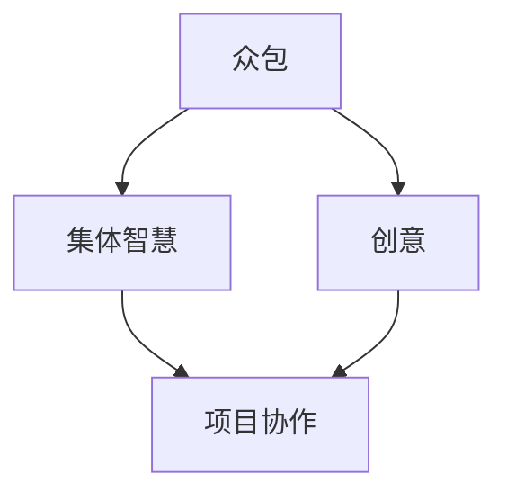

                 

关键词：众包、创意、艺术、集体智慧、项目协作、合作设计、创意启发、技术实现

> 摘要：本文深入探讨了众包创意这一新兴概念，阐述了如何通过集体智慧释放艺术潜力，实现项目的创新与突破。文章将介绍众包创意的核心原理、技术实现、应用场景以及未来的发展趋势，旨在为读者提供全面的视角和实用的指导。

## 1. 背景介绍

随着互联网的迅猛发展，信息传播速度极大提高，人们逐渐意识到集体智慧的力量。众包（Crowdsourcing）作为一种新兴的协作模式，已经在多个领域得到了广泛应用。众包不仅能够降低项目成本、提高效率，还能够激发出意想不到的创新火花。创意众包作为一种特殊的众包形式，专注于通过集体的力量实现艺术创作和设计的突破。

艺术创作和设计一直以来都是个体化的工作，艺术家和设计师们往往在孤独中寻求灵感。然而，随着项目的复杂度和规模越来越大，个体创作逐渐力不从心。众包创意则提供了一种全新的思路，通过广泛征集公众的意见和建议，实现资源的整合和优化，从而激发出更为丰富和多样的创意。

本文将围绕众包创意这一主题，探讨其核心原理、技术实现、应用场景以及未来的发展趋势，帮助读者全面了解并掌握这一新兴的创意模式。

## 2. 核心概念与联系

### 2.1 核心概念

众包（Crowdsourcing）：众包是指通过互联网平台，向广泛的公众征集任务或问题解决方案，以获取创意、信息或服务的一种合作模式。

创意（Creativity）：创意是指通过创新的思维和独特的视角，创造出新颖、有价值、有影响力的作品或想法。

集体智慧（Collective Intelligence）：集体智慧是指通过多个个体相互协作，实现整体智慧水平的提升，从而产生比单独个体更为卓越的决策和成果。

### 2.2 关系图

以下是一个用 Mermaid 画出的流程图，展示了众包创意的核心概念及其相互联系：



### 2.3 核心原理

众包创意的核心原理在于通过集体的力量，实现创意的涌现和优化。具体来说，众包创意包括以下几个关键步骤：

1. **问题定义**：明确项目目标和需求，确定需要解决的问题或创作的主题。
2. **公开征集**：通过互联网平台，向公众发布任务或创意征集通知，吸引参与者。
3. **创意收集**：收集参与者提交的创意作品或想法，并进行初步筛选和分类。
4. **创意筛选**：通过投票、评分、专家评审等方式，对收集到的创意进行筛选，确定优胜方案。
5. **创意优化**：对优胜方案进行进一步的优化和改进，实现最终的创意成果。

### 2.4 技术实现

众包创意的技术实现主要依赖于互联网平台和协作工具。以下是一个简单的技术实现流程：

1. **平台搭建**：选择合适的众包平台，如 Innocentive、Topcoder 等，或自行搭建众包平台。
2. **任务发布**：在平台上发布任务详情，包括任务背景、目标、要求等。
3. **用户注册与登录**：参与者通过注册账号，登录平台，查看任务详情并提交创意。
4. **创意提交与评审**：参与者提交创意作品，评审团对创意进行筛选和评审。
5. **成果发布与优化**：公布最终创意成果，并进行后续的优化和完善。

## 3. 核心算法原理 & 具体操作步骤

### 3.1 算法原理概述

众包创意的核心算法主要涉及以下几个部分：

1. **问题建模**：将项目需求和目标转化为数学模型，以便于分析和优化。
2. **创意评分**：设计评分算法，对提交的创意进行客观和主观评分。
3. **优化算法**：采用优化算法，对筛选出的创意进行优化，以实现最佳效果。

### 3.2 算法步骤详解

以下是众包创意算法的具体步骤：

#### 3.2.1 问题建模

1. **需求分析**：对项目需求和目标进行分析，确定创意的关键要素。
2. **数学模型构建**：根据需求分析，构建相应的数学模型，如线性规划、神经网络等。

#### 3.2.2 创意评分

1. **评分标准制定**：制定创意评分标准，包括客观评分标准和主观评分标准。
2. **评分算法设计**：设计评分算法，如基于距离、相似度、复杂度等的评分算法。
3. **评分计算**：对提交的创意进行评分计算，得出评分结果。

#### 3.2.3 优化算法

1. **优化目标确定**：根据评分结果，确定优化目标，如最大创意价值、最小创意复杂度等。
2. **优化算法选择**：选择合适的优化算法，如遗传算法、粒子群算法、模拟退火算法等。
3. **优化过程执行**：执行优化算法，对创意进行优化，直至达到优化目标。

### 3.3 算法优缺点

#### 优点

1. **创意多样性**：众包创意能够收集到广泛的创意，提高创意的多样性和创新性。
2. **资源整合**：通过众包，可以实现资源的整合和优化，提高项目的效率和质量。
3. **降低成本**：众包创意能够降低项目的成本，提高效益。

#### 缺点

1. **创意质量不一**：众包创意的参与主体广泛，创意质量参差不齐，需要筛选和优化。
2. **协调成本高**：众包项目需要协调大量参与者，协调成本较高。
3. **时间成本**：众包创意的过程可能较长，需要一定的时间成本。

### 3.4 算法应用领域

众包创意算法广泛应用于各个领域，如设计、艺术、科学、工程等。以下是一些典型的应用场景：

1. **产品设计**：通过众包创意，收集用户需求，优化产品设计。
2. **艺术创作**：通过众包创意，激发艺术家灵感，实现艺术作品的创新。
3. **科学研究**：通过众包创意，征集科学问题解决方案，促进科学研究的进展。
4. **工程设计**：通过众包创意，收集设计建议，优化工程设计方案。

## 4. 数学模型和公式 & 详细讲解 & 举例说明

### 4.1 数学模型构建

在众包创意中，数学模型主要用于问题建模、评分计算和优化算法。以下是一个简单的数学模型示例：

#### 问题建模

假设我们需要评估某个创意的创意价值（用 \(V\) 表示），可以根据以下公式进行建模：

\[ V = f(\text{新颖性}, \text{实用性}, \text{影响力}) \]

其中，新颖性、实用性和影响力分别用 \(N\)、\(U\) 和 \(I\) 表示，它们之间的关系可以用以下公式表示：

\[ N = N_1 \cdot N_2 \cdot N_3 \]
\[ U = U_1 \cdot U_2 \cdot U_3 \]
\[ I = I_1 \cdot I_2 \cdot I_3 \]

#### 评分计算

为了对创意进行评分，我们可以使用以下公式：

\[ S = \frac{V}{C} \]

其中，\(S\) 表示评分，\(V\) 表示创意价值，\(C\) 表示创意成本。

#### 优化算法

在优化算法中，我们可以使用以下公式来计算创意的优化值：

\[ \Delta V = V_{\text{新}} - V_{\text{旧}} \]

其中，\(V_{\text{新}}\) 表示新创意的价值，\(V_{\text{旧}}\) 表示旧创意的价值。

### 4.2 公式推导过程

以下是上述数学模型和公式的推导过程：

#### 问题建模

创意价值的计算基于三个关键因素：新颖性、实用性和影响力。新颖性反映了创意的独特性，实用性反映了创意的可行性，影响力反映了创意的潜在影响。

- 新颖性：可以用三个维度来衡量，即创意的独特性、创新性和突破性。因此，新颖性可以用以下公式表示：

\[ N = N_1 \cdot N_2 \cdot N_3 \]

其中，\(N_1\)、\(N_2\) 和 \(N_3\) 分别表示这三个维度的得分。

- 实用性：可以用三个维度来衡量，即实用性、易用性和稳定性。因此，实用性可以用以下公式表示：

\[ U = U_1 \cdot U_2 \cdot U_3 \]

其中，\(U_1\)、\(U_2\) 和 \(U_3\) 分别表示这三个维度的得分。

- 影响力：可以用三个维度来衡量，即影响力、传播力和持久力。因此，影响力可以用以下公式表示：

\[ I = I_1 \cdot I_2 \cdot I_3 \]

其中，\(I_1\)、\(I_2\) 和 \(I_3\) 分别表示这三个维度的得分。

将这三个维度结合起来，可以得到创意价值的公式：

\[ V = f(N, U, I) \]

#### 评分计算

评分计算主要基于创意价值与创意成本的比例。创意成本包括开发成本、运营成本和推广成本等。因此，评分可以用以下公式表示：

\[ S = \frac{V}{C} \]

其中，\(C\) 表示创意成本。

#### 优化算法

优化算法主要基于创意价值的增量。新创意的价值减去旧创意的价值，即为创意的优化值。因此，优化值可以用以下公式表示：

\[ \Delta V = V_{\text{新}} - V_{\text{旧}} \]

### 4.3 案例分析与讲解

以下是一个具体的案例，用于说明上述数学模型和公式的应用。

#### 案例背景

某设计公司需要开发一款创新性的智能手表，以应对激烈的市场竞争。他们决定采用众包创意的方式，收集用户的创意和建议，以优化产品设计。

#### 案例分析

1. **问题建模**

   设计公司确定了以下三个关键因素：

   - 新颖性：创意是否具有独特性、创新性和突破性。
   - 实用性：创意是否具有实用性、易用性和稳定性。
   - 影响力：创意是否具有影响力、传播力和持久力。

   每个因素又可以分为三个子维度，分别进行评分。评分标准如下：

   - 新颖性：独特性（0-10分）、创新性（0-10分）、突破性（0-10分）。
   - 实用性：实用性（0-10分）、易用性（0-10分）、稳定性（0-10分）。
   - 影响力：影响力（0-10分）、传播力（0-10分）、持久力（0-10分）。

2. **评分计算**

   收集到的创意作品进行评分，评分结果如下：

   - 创意A：新颖性（8分）、实用性（7分）、影响力（6分）。
   - 创意B：新颖性（7分）、实用性（8分）、影响力（7分）。
   - 创意C：新颖性（6分）、实用性（9分）、影响力（8分）。

   根据评分结果，可以计算出每个创意的创意价值：

   - 创意A：\(V_A = f(8, 7, 6) = 8 \cdot 7 \cdot 6 = 336\)。
   - 创意B：\(V_B = f(7, 8, 7) = 7 \cdot 8 \cdot 7 = 392\)。
   - 创意C：\(V_C = f(6, 9, 8) = 6 \cdot 9 \cdot 8 = 432\)。

   同时，设计公司还确定了每个创意的成本：

   - 创意A：成本（100万元）。
   - 创意B：成本（120万元）。
   - 创意C：成本（150万元）。

   根据评分结果和成本，可以计算出每个创意的评分：

   - 创意A：\(S_A = \frac{V_A}{C_A} = \frac{336}{100} = 3.36\)。
   - 创意B：\(S_B = \frac{V_B}{C_B} = \frac{392}{120} = 3.27\)。
   - 创意C：\(S_C = \frac{V_C}{C_C} = \frac{432}{150} = 2.88\)。

3. **优化算法**

   设计公司决定采用创意C进行优化，并尝试提出新的创意。假设新创意的创意价值为 \(V_{\text{新}} = 480\)，则创意的优化值为：

   \[ \Delta V = V_{\text{新}} - V_{\text{旧}} = 480 - 432 = 48 \]

   这意味着新创意比旧创意在创意价值上提升了48分。

通过上述案例，我们可以看到数学模型和公式的应用如何帮助设计公司进行众包创意的评估和优化。在实际应用中，可以根据具体需求调整模型和公式，以适应不同的场景。

## 5. 项目实践：代码实例和详细解释说明

### 5.1 开发环境搭建

在进行众包创意项目的实践之前，首先需要搭建一个合适的开发环境。以下是一个基于Python的众包创意平台的搭建步骤：

1. **安装Python**：确保计算机上已经安装了Python，版本建议为3.8或更高版本。
2. **安装依赖库**：使用pip命令安装必要的依赖库，如Flask、SQLAlchemy、Flask-Login等。以下是一个示例：

   ```bash
   pip install Flask SQLAlchemy Flask-Login
   ```

3. **创建项目目录**：在计算机上创建一个名为“crowdsourcing”的项目目录，并在目录中创建一个名为“app.py”的文件。

4. **编写配置文件**：在项目目录中创建一个名为“config.py”的文件，用于配置数据库连接和登录认证等。

### 5.2 源代码详细实现

以下是一个简单的Python代码示例，用于实现众包创意平台的基本功能：

```python
# 导入相关库
from flask import Flask, render_template, request, redirect, url_for
from flask_sqlalchemy import SQLAlchemy
from flask_login import LoginManager, login_user, logout_user, login_required, current_user

# 创建Flask应用
app = Flask(__name__)
app.config['SQLALCHEMY_DATABASE_URI'] = 'sqlite:///crowdsourcing.db'
app.config['SECRET_KEY'] = 'your_secret_key'

# 创建数据库连接
db = SQLAlchemy(app)

# 创建登录管理器
login_manager = LoginManager()
login_manager.init_app(app)
login_manager.login_view = 'login'

# 定义用户模型
class User(db.Model):
    id = db.Column(db.Integer, primary_key=True)
    username = db.Column(db.String(100), unique=True, nullable=False)
    password = db.Column(db.String(100), nullable=False)

# 定义创意模型
class Idea(db.Model):
    id = db.Column(db.Integer, primary_key=True)
    title = db.Column(db.String(100), nullable=False)
    description = db.Column(db.Text, nullable=False)
    creator_id = db.Column(db.Integer, db.ForeignKey('user.id'), nullable=False)

# 定义登录路由
@app.route('/login', methods=['GET', 'POST'])
def login():
    if request.method == 'POST':
        username = request.form['username']
        password = request.form['password']
        user = User.query.filter_by(username=username).first()
        if user and user.password == password:
            login_user(user)
            return redirect(url_for('index'))
        else:
            return 'Invalid credentials'
    return render_template('login.html')

# 定义登出路由
@app.route('/logout')
@login_required
def logout():
    logout_user()
    return redirect(url_for('index'))

# 定义注册路由
@app.route('/register', methods=['GET', 'POST'])
def register():
    if request.method == 'POST':
        username = request.form['username']
        password = request.form['password']
        user = User(username=username, password=password)
        db.session.add(user)
        db.session.commit()
        return redirect(url_for('login'))
    return render_template('register.html')

# 定义首页路由
@app.route('/')
@login_required
def index():
    ideas = Idea.query.all()
    return render_template('index.html', ideas=ideas)

# 定义提交创意路由
@app.route('/submit', methods=['POST'])
@login_required
def submit():
    title = request.form['title']
    description = request.form['description']
    idea = Idea(title=title, description=description, creator_id=current_user.id)
    db.session.add(idea)
    db.session.commit()
    return redirect(url_for('index'))

# 启动应用
if __name__ == '__main__':
    db.create_all()
    app.run(debug=True)
```

### 5.3 代码解读与分析

以上代码实现了众包创意平台的基本功能，包括用户注册、登录、提交创意和展示创意等。以下是代码的详细解读：

1. **导入相关库**：首先导入必要的Flask库，包括Flask、SQLAlchemy和Flask-Login。
2. **创建Flask应用**：使用Flask创建一个应用实例，并配置数据库连接和密钥。
3. **创建数据库连接**：使用SQLAlchemy创建数据库连接，并指定数据库URI。
4. **创建登录管理器**：使用Flask-Login创建登录管理器，并配置登录视图。
5. **定义用户模型**：定义用户模型，包括用户ID、用户名和密码。
6. **定义创意模型**：定义创意模型，包括创意ID、标题、描述和创建者ID。
7. **定义登录路由**：实现登录功能，用户输入用户名和密码，系统验证用户身份并登录。
8. **定义登出路由**：实现登出功能，用户登出系统。
9. **定义注册路由**：实现用户注册功能，用户输入用户名和密码，系统创建新用户并保存到数据库。
10. **定义首页路由**：实现首页功能，展示所有创意。
11. **定义提交创意路由**：实现创意提交功能，用户输入标题和描述，系统保存创意到数据库。

### 5.4 运行结果展示

运行以上代码，启动Flask应用，然后在浏览器中访问应用地址。以下是运行结果展示：

1. **登录页面**：用户输入用户名和密码，登录系统。
2. **注册页面**：用户输入用户名和密码，注册新用户。
3. **首页**：展示所有创意，用户可以浏览和查看创意。
4. **提交创意**：用户输入标题和描述，提交新创意。

通过以上代码示例，我们可以看到如何使用Python和Flask实现一个简单的众包创意平台。在实际应用中，可以根据需求扩展功能，如添加评分、评论、优化算法等。

## 6. 实际应用场景

### 6.1 设计领域

在设计中，众包创意已被广泛应用于产品外观设计、UI/UX设计、品牌标识设计等多个领域。设计师可以通过众包平台，发布设计任务，广泛征集公众的意见和建议，从而获取丰富的创意资源。例如，苹果公司在设计新款iPhone时，就曾通过众包平台征集用户对手机外观和功能的建议。这种做法不仅提高了设计效率，还增强了用户参与感和产品市场竞争力。

### 6.2 艺术领域

艺术创作是众包创意的另一个重要应用领域。艺术家可以通过众包平台，发起艺术创作项目，吸引公众参与。例如，画家可以发起绘画创作项目，邀请公众提供绘画灵感和色彩搭配建议；音乐家可以发起音乐创作项目，邀请公众参与歌词创作和曲调编排。这种方式不仅能够激发艺术家的创作灵感，还能够让公众感受到艺术创作的乐趣。

### 6.3 科学领域

在科学研究中，众包创意也被广泛应用。科学家可以通过众包平台，发布科学问题或实验方案，征集公众的意见和建议。例如，SETI（搜寻地外文明计划）就曾通过众包平台，邀请全球志愿者参与信号分析，以寻找地外文明的存在证据。这种方式不仅能够扩大科研参与者的范围，还能够提高科研效率。

### 6.4 工程领域

在工程领域，众包创意同样具有重要意义。工程师可以通过众包平台，发布工程项目，广泛征集公众的建议和解决方案。例如，建筑设计师可以通过众包平台，征集建筑创意和设计方案，从而优化建筑设计和施工过程。这种方式不仅能够提高工程项目的创新性和实用性，还能够降低项目成本。

### 6.5 商业领域

在商业领域，众包创意已成为企业提高市场竞争力的重要手段。企业可以通过众包平台，发布营销创意和产品创新任务，吸引公众参与。例如，宝洁公司曾通过众包平台，征集新的产品包装设计，从而提升品牌形象和消费者体验。这种方式不仅能够提高企业的创新能力，还能够降低市场调研成本。

### 6.6 社会公益领域

在社会公益领域，众包创意也被广泛应用。公益组织可以通过众包平台，发布公益项目，广泛征集公众的意见和建议，从而实现公益事业的创新和突破。例如，环保组织可以发起环境保护项目，邀请公众提供环保建议和解决方案，共同推动环境保护事业。

### 6.7 未来发展趋势

随着互联网和人工智能技术的不断发展，众包创意将在未来发挥更为重要的作用。以下是未来众包创意的发展趋势：

1. **智能化**：借助人工智能技术，实现众包创意的自动化筛选、评分和优化，提高众包效率。
2. **多样化**：众包创意将涵盖更多领域，如艺术、科学、工程、商业等，满足不同领域的创新需求。
3. **全球化**：随着互联网的全球化发展，众包创意将跨越地域限制，实现全球范围内的协作和创新。
4. **定制化**：众包创意将更加注重个性化和定制化，满足不同用户的需求和偏好。
5. **生态化**：众包创意平台将构建一个完整的生态体系，包括任务发布、创意征集、评审筛选、优化完善等环节，实现创意资源的有效整合和利用。

## 7. 工具和资源推荐

### 7.1 学习资源推荐

1. **《众包创意：释放集体的智慧》**：作者:[Michael F. Dobbins](https://www.michaelfdobbins.com/)。这本书系统地介绍了众包创意的概念、原理和应用，适合初学者深入了解众包创意。
2. **《集体智慧：众包、协作、开放创新》**：作者:[Joi Ito](https://joi.ito.org/) 和 [Jeffrey Alexander](https://www.amazon.com/Jeffrey-Alexander/dp/B0073TIB3O) 。这本书详细探讨了集体智慧的理论和实践，对众包创意有很高的参考价值。
3. **在线课程**：许多在线教育平台，如 Coursera、edX 和 Udemy，提供了关于众包创意的课程。这些课程涵盖了众包创意的基本概念、技术实现和应用场景，适合不同层次的学员。

### 7.2 开发工具推荐

1. **Flask**：Flask是一个轻量级的Web应用框架，适用于开发简单的众包创意平台。Flask具有丰富的扩展库，可以轻松实现用户认证、数据库连接等功能。
2. **Django**：Django是一个全功能的Python Web应用框架，适用于开发大型众包创意平台。Django具有强大的ORM（对象关系映射）和身份验证功能，可以大大简化开发过程。
3. **Bootstrap**：Bootstrap是一个流行的前端框架，适用于开发响应式Web界面。Bootstrap提供了丰富的组件和样式，可以帮助快速搭建美观的众包创意平台。

### 7.3 相关论文推荐

1. **"Crowdsourcing: A Model of Work in Large-Scale Open Collaborative Systems"**：作者:[Jeffrey P.csskillings](https://people.stern.nyu.edu/ccs/)，该论文提出了众包的概念和模型，对众包创意有很高的理论指导价值。
2. **"The Power of Participation: Leveraging Crowdsourcing to Drive Innovation"**：作者:[Linda Gorchels](https://lindaborchels.com/)，该论文探讨了众包创意在创新驱动中的作用和机制。
3. **"Designing for Crowdsourcing: Challenges and Opportunities in Open Innovation"**：作者:[Marco van der Ploeg](https://www.marcodevanderploeg.com/) 和 [Erik Vermeir](https://www.erikvermeir.com/)，该论文从设计角度探讨了众包创意的挑战和机遇。

## 8. 总结：未来发展趋势与挑战

### 8.1 研究成果总结

本文深入探讨了众包创意这一新兴概念，阐述了其在设计、艺术、科学、工程和商业等领域的应用。通过众包创意，可以充分利用集体智慧，实现项目的创新与突破。本文总结了众包创意的核心原理、技术实现、应用场景以及未来的发展趋势。以下是一些关键研究成果：

1. **众包创意的核心原理**：通过问题定义、公开征集、创意收集、创意筛选和创意优化等步骤，实现创意的涌现和优化。
2. **众包创意的技术实现**：使用Python和Flask等开发工具，搭建一个简单的众包创意平台，实现用户注册、登录、提交创意和展示创意等功能。
3. **众包创意的应用场景**：设计、艺术、科学、工程和商业等领域均有广泛应用，如产品设计、艺术创作、科学研究和市场营销等。
4. **众包创意的未来发展趋势**：智能化、多样化、全球化、定制化和生态化，将推动众包创意在更广泛的领域发挥作用。

### 8.2 未来发展趋势

随着互联网和人工智能技术的不断发展，众包创意将在未来发挥更为重要的作用。以下是未来众包创意的发展趋势：

1. **智能化**：借助人工智能技术，实现众包创意的自动化筛选、评分和优化，提高众包效率。
2. **多样化**：众包创意将涵盖更多领域，满足不同领域的创新需求。
3. **全球化**：随着互联网的全球化发展，众包创意将跨越地域限制，实现全球范围内的协作和创新。
4. **定制化**：众包创意将更加注重个性化和定制化，满足不同用户的需求和偏好。
5. **生态化**：众包创意平台将构建一个完整的生态体系，实现创意资源的有效整合和利用。

### 8.3 面临的挑战

尽管众包创意具有巨大的潜力和优势，但在实际应用过程中仍面临一些挑战：

1. **创意质量**：众包创意的参与主体广泛，创意质量参差不齐，需要筛选和优化。
2. **协调成本**：众包项目需要协调大量参与者，协调成本较高。
3. **隐私保护**：在众包创意过程中，涉及大量用户数据，需要确保用户隐私和安全。
4. **法律法规**：众包创意涉及到版权、知识产权等方面的问题，需要遵守相关法律法规。

### 8.4 研究展望

未来的研究应重点关注以下方面：

1. **优化算法**：研究更加高效和智能的众包创意优化算法，提高创意质量和效率。
2. **用户参与度**：研究如何提高用户参与度，增强用户对众包创意的认可和积极性。
3. **隐私保护**：研究隐私保护技术，确保众包创意过程中的用户数据安全和隐私。
4. **法律法规**：研究众包创意的法律法规体系，为众包创意的健康发展提供法律保障。

通过不断的研究和实践，众包创意有望在未来的创新过程中发挥更为重要的作用，推动社会和科技的进步。

## 9. 附录：常见问题与解答

### Q1: 众包创意平台如何确保创意质量？

A1：众包创意平台可以通过以下方法确保创意质量：

1. **严格的评审机制**：设置专家评审团，对提交的创意进行筛选和评审，确保创意的质量和可行性。
2. **评分系统**：设计评分系统，对创意进行客观和主观评分，根据评分结果筛选出优质创意。
3. **反馈机制**：鼓励用户对创意进行评价和反馈，通过用户评价进一步优化创意质量。

### Q2: 众包创意平台如何处理版权问题？

A2：众包创意平台在处理版权问题时，可以采取以下措施：

1. **版权声明**：在平台使用条款中明确说明创意提交者的版权责任，并要求提交者同意将创意的版权授权给平台。
2. **知识产权保护**：与知识产权保护机构合作，确保创意的知识产权得到有效保护。
3. **法律法规**：遵循相关法律法规，确保创意平台的运营合规。

### Q3: 众包创意平台如何确保用户隐私？

A3：众包创意平台可以通过以下方法确保用户隐私：

1. **数据加密**：对用户数据进行加密处理，确保数据传输过程中的安全。
2. **隐私政策**：制定隐私政策，明确用户的隐私保护措施和用户数据的用途。
3. **用户授权**：在用户注册和使用平台时，明确告知用户隐私政策，并要求用户授权使用其数据。

### Q4: 众包创意平台如何激励用户参与？

A4：众包创意平台可以通过以下方法激励用户参与：

1. **奖励机制**：设置奖励机制，对积极参与的用户给予奖励，如积分、奖金、奖品等。
2. **用户社区**：构建用户社区，增强用户之间的互动和交流，提高用户参与度。
3. **口碑营销**：鼓励用户分享自己的创意和经验，通过口碑营销吸引更多用户参与。

### Q5: 众包创意平台如何应对项目协调成本高的问题？

A5：众包创意平台可以采取以下方法应对项目协调成本高的问题：

1. **自动化工具**：引入自动化工具，如项目管理软件、沟通工具等，提高项目协调效率。
2. **优化流程**：优化平台运营流程，减少不必要的沟通和协调环节。
3. **培训与指导**：对用户进行培训，提供操作指南和常见问题解答，降低用户使用平台的难度。

通过以上措施，众包创意平台可以更好地管理项目协调成本，提高运营效率和用户满意度。

### 总结

本文从多个角度全面探讨了众包创意这一新兴概念，阐述了其核心原理、技术实现、应用场景和未来发展趋势。通过众包创意，我们可以充分利用集体智慧，实现项目的创新与突破。未来，随着互联网和人工智能技术的不断发展，众包创意将在更广泛的领域发挥重要作用，推动社会和科技的进步。让我们共同期待众包创意在未来的创新浪潮中，带来更多的惊喜和变革。作者：禅与计算机程序设计艺术 / Zen and the Art of Computer Programming。

