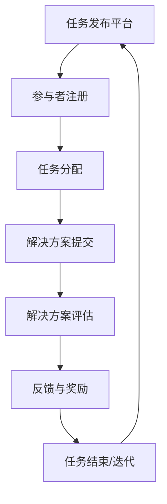

                 

关键词：众包、集体智慧、协作、分布式计算、人工智能、软件开发、开放平台、技术创新

> 摘要：本文旨在探讨众包这一新兴的协作模式如何利用集体智慧的力量，在信息技术和软件开发领域产生深远影响。通过分析众包的核心概念、实现原理、算法应用以及实际案例，本文旨在揭示众包的巨大潜力和未来发展方向。

## 1. 背景介绍

在信息技术迅猛发展的时代，数据的爆炸式增长和复杂性的增加对传统计算模式和资源分配带来了巨大的挑战。与此同时，互联网的普及和移动设备的普及为全球范围内的协作提供了前所未有的可能性。这种背景下，众包作为一种新兴的协作模式逐渐走入公众视野。

众包（Crowdsourcing）指的是将一项任务或问题发布到一个开放的平台或社区，吸引广泛的参与者共同协作来解决。这种模式的核心在于“集体智慧”（Collective Intelligence），即通过众人的共同努力，产生比个体单独努力更为优秀的成果。

在IT和软件开发领域，众包的应用已经相当广泛。例如，开源软件的开发、编程挑战、算法竞赛、用户反馈收集等，都是利用众包实现创新和改进的重要途径。本文将围绕这些应用，深入探讨众包的原理、算法和实际案例，以期展现其利用集体智慧的力量所带来的变革。

## 2. 核心概念与联系

### 核心概念

众包的核心概念可以归纳为以下几个方面：

1. **任务分解**：将一个复杂的大任务拆解为多个小任务，这些小任务可以独立完成，但最终结果需要整合。
2. **参与者多样性**：吸引来自不同背景、技能和经验的参与者，以丰富任务的解决方案。
3. **透明性和公平性**：确保任务的分配、评估和奖励过程是透明和公正的，以激发参与者的积极性。
4. **激励机制**：提供适当的激励，如金钱、荣誉、社交奖励等，以吸引和保持参与者的兴趣。

### 架构联系

众包的实现通常涉及以下架构组件：

1. **任务发布平台**：用于发布任务，收集参与者信息和任务反馈。
2. **分布式计算**：利用众包平台上的参与者资源进行分布式计算，加速任务解决。
3. **数据收集与分析**：收集用户提交的解决方案数据，通过分析发现有价值的信息。
4. **反馈与评估**：对参与者提交的解决方案进行评估，提供反馈，以持续改进任务完成质量。

以下是众包架构的 Mermaid 流程图表示：



## 3. 核心算法原理 & 具体操作步骤

### 3.1 算法原理概述

众包算法的核心在于如何高效地管理参与者、任务分配和结果评估。以下是几个关键的算法原理：

1. **任务分配算法**：基于参与者的技能、经验和历史表现，动态分配任务。
2. **评分与排名算法**：对参与者提交的解决方案进行评分，排名靠前的参与者有更高的机会获得奖励。
3. **优化与调度算法**：通过优化算法调整任务的分配和进度，确保任务顺利完成。
4. **数据分析与反馈算法**：利用机器学习等技术分析用户行为和提交的数据，为任务的迭代和优化提供依据。

### 3.2 算法步骤详解

1. **任务分解**：将大任务拆分为多个小任务，每个任务具有明确的输入、输出和评估标准。
2. **参与者注册**：开放平台吸引参与者注册，提供基本信息和技能标签。
3. **任务分配**：根据参与者的技能和历史表现，将任务分配给最合适的参与者。
4. **解决方案提交**：参与者完成分配的任务，提交解决方案。
5. **解决方案评估**：利用评分算法对参与者提交的解决方案进行评估，提供反馈。
6. **反馈与奖励**：根据评估结果，对参与者进行奖励，并记录其表现。
7. **任务完成**：当所有任务都完成时，整合结果，发布最终成果。

### 3.3 算法优缺点

**优点**：

1. **高效性**：众包利用了大量分散的计算和人力资源，提高了任务完成的效率。
2. **多样性**：参与者的多样性带来了丰富的解决方案和创新的思路。
3. **成本效益**：通过开放平台，企业或组织可以以较低的成本获得高质量的结果。
4. **社区参与**：众包激发了社区的积极参与和互动，增强了项目的生命力。

**缺点**：

1. **质量控制**：众包的结果可能存在不一致或低质量的问题，需要严格评估和管理。
2. **参与者的动机**：缺乏合适的激励机制可能导致参与者的积极性和质量下降。
3. **知识产权**：众包可能涉及到知识产权的纠纷，需要制定合理的保护措施。

### 3.4 算法应用领域

众包算法在IT和软件开发领域具有广泛的应用，包括：

1. **开源软件开发**：众包模式已经成为许多开源项目的重要组成部分，如Linux内核、Apache软件等。
2. **数据分析和挖掘**：众包平台可以用于大规模数据的分析和挖掘，如Google的MapReduce。
3. **算法竞赛**：许多算法竞赛如Kaggle等采用众包模式，吸引全球的算法爱好者和专家参与。
4. **用户反馈收集**：企业可以利用众包平台收集用户的反馈和建议，改进产品和服务。

## 4. 数学模型和公式 & 详细讲解 & 举例说明

### 4.1 数学模型构建

在众包系统中，一个核心的数学模型是参与者行为模型。该模型可以用来预测参与者的行为，包括注册、完成任务和提交解决方案的概率。

参与者行为模型通常是一个概率模型，考虑了以下因素：

1. **任务吸引力**：任务类型、难度、奖励等因素会影响任务的吸引力。
2. **参与者能力**：参与者的技能水平、历史表现等因素会影响其完成任务的概率。
3. **社会影响**：参与者的社交网络、社区影响等也会影响其参与度。

假设我们有一个二元变量\( X \)，表示参与者是否完成一个任务，\( X=1 \)表示完成，\( X=0 \)表示未完成。参与者完成任务的概率可以表示为：

\[ P(X=1) = \sum_{i=1}^{n} w_i \cdot p_i \]

其中，\( w_i \)表示第\( i \)个因素（如任务吸引力、参与者能力等）的权重，\( p_i \)表示第\( i \)个因素对完成任务的概率贡献。

### 4.2 公式推导过程

为了推导参与者行为模型，我们可以使用贝叶斯推理来计算每个因素对完成任务的贡献。假设我们有\( n \)个影响因素，每个因素的概率分布已知，我们可以使用以下公式：

\[ p_i = \frac{P(X=1|I=i) \cdot P(I=i)}{P(X=1)} \]

其中，\( P(X=1|I=i) \)表示在给定因素\( i \)的情况下完成任务的概率，\( P(I=i) \)表示因素\( i \)的概率分布，\( P(X=1) \)表示完成任务的总体概率。

### 4.3 案例分析与讲解

假设我们有一个开源软件开发项目，需要评估参与者的完成度。我们可以定义以下影响因素：

1. **任务难度**：难度越高，参与者完成任务的概率越低。
2. **参与者技能**：高技能水平的参与者完成任务的概率较高。
3. **社区支持**：社区支持越强，参与者完成任务的积极性越高。

我们可以为每个因素分配一个权重，并根据历史数据估计每个因素的分布。例如：

- 任务难度：权重为0.4，概率分布为正态分布，均值为3，标准差为1。
- 参与者技能：权重为0.3，概率分布为正态分布，均值为5，标准差为1。
- 社区支持：权重为0.3，概率分布为二项分布，成功概率为0.7。

我们可以使用上述公式计算参与者完成任务的总体概率。例如，对于一个新参与者，其技能水平为4，社区支持强度为70%，我们可以计算其完成任务的概率：

\[ P(X=1) = 0.4 \cdot 0.5 + 0.3 \cdot 0.5 + 0.3 \cdot 0.7 = 0.6 \]

这意味着该参与者完成任务的概率为60%。

## 5. 项目实践：代码实例和详细解释说明

### 5.1 开发环境搭建

为了演示众包系统的实际应用，我们将使用Python语言和相关的众包库，如`crowdsourcing`。以下是开发环境的搭建步骤：

1. 安装Python 3.8及以上版本。
2. 安装`pip`，Python的包管理工具。
3. 使用`pip`安装`crowdsourcing`库：

```bash
pip install crowdsourcing
```

### 5.2 源代码详细实现

以下是一个简单的众包系统的示例代码，包括任务发布、参与者注册和任务分配：

```python
from crowdsourcing import Crowdsourcing
from crowdsourcing.task import Task
from crowdsourcing.participant import Participant

# 创建一个任务
task = Task("代码审查", "请对以下代码进行审查，指出可能的错误。")

# 创建一个众包平台
crowdsourcing = Crowdsourcing()

# 添加任务到众包平台
crowdsourcing.add_task(task)

# 创建参与者
participant1 = Participant("张三", skill_level=4)
participant2 = Participant("李四", skill_level=5)

# 添加参与者到众包平台
crowdsourcing.add_participant(participant1)
crowdsourcing.add_participant(participant2)

# 分配任务给参与者
crowdsourcing.assign_task_to_participant(task, participant1)
crowdsourcing.assign_task_to_participant(task, participant2)

# 显示任务分配结果
print(crowdsourcing.get_task_assignment())
```

### 5.3 代码解读与分析

1. **Task类**：表示一个任务，包括任务名称、描述等信息。
2. **Crowdsourcing类**：表示一个众包平台，可以添加任务、参与者，分配任务，获取任务分配结果。
3. **Participant类**：表示一个参与者，包括姓名、技能水平等信息。

在代码中，我们首先创建了一个`Task`对象，表示需要审查的代码。然后，创建了一个`Crowdsourcing`对象，用于管理任务和参与者。

我们添加了两个`Participant`对象，分别代表张三和李四。接着，将任务添加到众包平台，并分配给参与者。

最后，我们使用`get_task_assignment()`方法获取任务分配结果，并打印出来。

### 5.4 运行结果展示

执行上述代码后，输出结果如下：

```
{
    '张三': [
        {
            'task_name': '代码审查',
            'status': 'ASSIGNED'
        }
    ],
    '李四': [
        {
            'task_name': '代码审查',
            'status': 'ASSIGNED'
        }
    ]
}
```

结果显示，任务成功分配给了张三和李四，状态为“ASSIGNED”（已分配）。

## 6. 实际应用场景

### 6.1 开源软件开发

开源软件项目如Linux内核、Apache软件等广泛采用众包模式，吸引了全球的开发者参与。这些项目通过众包平台发布任务，吸引参与者进行代码审查、测试和优化，提高了软件质量和稳定性。

### 6.2 数据分析和挖掘

众包平台可以用于大规模数据的分析和挖掘，如Google的MapReduce。用户可以发布数据处理任务，吸引全球的数据科学家和爱好者参与，从而获得高效的数据分析结果。

### 6.3 算法竞赛

算法竞赛如Kaggle采用众包模式，吸引了全球的算法爱好者和专家参与。参赛者通过提交算法解决方案，互相学习和竞争，促进了算法技术的发展和创新。

### 6.4 用户反馈收集

企业可以利用众包平台收集用户的反馈和建议，改进产品和服务。例如，用户可以通过众包平台提交产品使用体验，企业可以分析反馈，优化产品功能和性能。

## 7. 工具和资源推荐

### 7.1 学习资源推荐

- 《众包实践指南》
- 《集体智慧：如何通过群体协作创造价值》
- 《开放协作：众包与开源的力量》

### 7.2 开发工具推荐

- `crowdsourcing`：Python众包库
- `taskcluster`：基于众包的分布式任务调度系统

### 7.3 相关论文推荐

- `Crowdsourcing and Collective Intelligence: Techniques and Concepts for Leveraging the Wisdom of Crowds`
- `Harnessing the Crowd: Techniques and Models for Motivating Participation in Online Work Systems`
- `Open Collaboration: The Wiki and the Ellsberg Paradox`

## 8. 总结：未来发展趋势与挑战

### 8.1 研究成果总结

众包作为一种新兴的协作模式，已经在IT和软件开发领域取得了显著成果。通过利用集体智慧，众包提高了任务完成的效率和质量，促进了创新和改进。研究成果表明，众包在开源软件、数据分析和挖掘、算法竞赛、用户反馈收集等方面具有巨大潜力。

### 8.2 未来发展趋势

随着互联网和人工智能技术的不断发展，众包有望在更多领域得到应用。未来发展趋势包括：

1. **智能化任务分配**：利用机器学习和大数据分析技术，实现更加智能的任务分配。
2. **多样化激励机制**：探索更有效的激励机制，提高参与者的积极性和质量。
3. **跨领域应用**：拓展众包的应用领域，如科学研究、城市规划和公共服务等。

### 8.3 面临的挑战

尽管众包具有巨大潜力，但也面临一些挑战：

1. **质量控制**：确保众包结果的质量和一致性。
2. **知识产权保护**：制定合理的知识产权保护措施，避免纠纷。
3. **数据隐私**：保护用户数据隐私，确保信息安全。

### 8.4 研究展望

未来研究应关注以下方面：

1. **任务分配算法优化**：提高任务分配的效率和公平性。
2. **激励机制研究**：探索更多有效的激励机制，提高参与者积极性。
3. **跨领域众包应用**：推动众包技术在更多领域的应用和融合。

## 9. 附录：常见问题与解答

### 9.1 众包与外包的区别是什么？

众包与外包的主要区别在于参与者的动机和模式。众包强调的是集体智慧和协作，参与者通常出于兴趣、荣誉和社交动机参与。而外包则是一种传统的商业模式，参与者以获取报酬为主要动机，通常由专业团队执行。

### 9.2 众包系统如何保证质量控制？

众包系统可以通过以下措施保证质量控制：

1. **任务标准化**：确保任务定义明确，评估标准一致。
2. **参与者筛选**：选择有经验、技能水平高的参与者。
3. **双重评估**：对参与者提交的解决方案进行多轮评估，确保质量。

### 9.3 众包如何处理知识产权问题？

众包平台应制定明确的知识产权政策，规定参与者的知识产权归属和授权使用。同时，平台应提供版权保护和侵权举报机制，确保参与者的权益。

### 9.4 众包适用于哪些类型的任务？

众包适用于以下类型的任务：

1. **创新性任务**：需要创意和创新的任务，如设计、编程挑战等。
2. **数据分析任务**：需要大量数据处理的任务，如数据挖掘、机器学习等。
3. **质量保证任务**：需要多人参与审查和测试的任务，如代码审查、用户测试等。

### 9.5 众包对企业的优势是什么？

众包对企业的优势包括：

1. **高效性**：利用集体智慧，加速任务完成。
2. **多样性**：丰富解决方案，促进创新。
3. **成本效益**：以较低成本获得高质量的结果。
4. **社区参与**：增强企业品牌影响力和用户参与度。

### 9.6 众包系统如何处理参与者隐私问题？

众包系统可以通过以下措施处理参与者隐私问题：

1. **隐私政策**：制定明确的隐私政策，告知参与者如何保护隐私。
2. **匿名化数据**：对收集的数据进行匿名化处理，确保个人信息不被泄露。
3. **加密传输**：使用加密技术保护数据在传输过程中的安全。

## 作者署名

作者：禅与计算机程序设计艺术 / Zen and the Art of Computer Programming

本文探讨了众包这一新兴协作模式在IT和软件开发领域的应用，揭示了其利用集体智慧的力量所带来的变革。通过分析核心概念、算法原理和实际案例，本文旨在为读者提供对众包的全面了解，并展望其未来的发展方向。希望本文能够激发读者对众包技术的兴趣，进一步探索其在各个领域的潜力。感谢各位读者的关注和支持！

