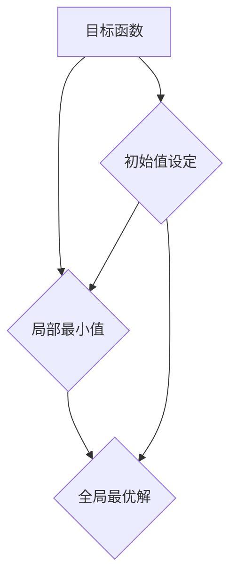

                 

### 关键词 Keywords
优化算法、局部最小值、初始值设定、全局最优解、初始化策略。

<|assistant|>### 摘要 Abstract
本文探讨了在优化问题中如何选择和设定初始值，以避免陷入局部最小值，从而提高求解全局最优解的效率。通过对核心概念、算法原理、数学模型、实践案例的详细分析，为读者提供了实用的初始化策略和工具，为复杂优化问题的解决提供了新的视角。

## 1. 背景介绍

在许多实际应用中，优化问题是不可避免且至关重要的。从物流调度、数据挖掘、金融投资到机器学习模型的训练，优化问题无处不在。然而，大多数优化问题都是非线性的，具有多个局部最优解。这意味着选择合适的初始值对于寻找全局最优解至关重要。

### 1.1 优化问题的定义

优化问题可以形式化地定义为：

\[ \min_{x} f(x) \]

其中，\( f(x) \) 是目标函数，\( x \) 是决策变量。优化问题的目标是找到 \( x \) 使得 \( f(x) \) 最小（或最大）。

### 1.2 局部最小值与全局最优解

优化问题的一个挑战是存在多个局部最小值。这些局部最小值可能是目标函数的局部极小点，但它们并不一定是全局最优解。例如，在图1中，\( x_1 \) 和 \( x_2 \) 都是局部最小值，但只有 \( x_3 \) 是全局最优解。


选择合适的初始值可以影响算法是否能够跳出局部最小值，从而找到全局最优解。

### 1.3 优化算法的分类

常见的优化算法可以分为两大类：

- **确定性算法**：如梯度下降法、牛顿法等，这些算法依赖于目标函数的导数或二阶导数，通常具有线性的收敛速度。
- **随机性算法**：如遗传算法、粒子群优化等，这些算法通过随机搜索来探索解空间，通常能够在更复杂的优化问题中找到较好的全局解。

### 1.4 优化问题的挑战

- **非线性和多峰性**：许多实际问题具有复杂的非线性结构，并且存在多个局部最优解。
- **大规模和约束性**：在处理大规模问题和约束条件时，寻找全局最优解变得更加困难。
- **计算效率**：随着问题规模的增大，计算时间显著增加，对算法的效率提出了更高的要求。

为了避免陷入局部最小值，优化算法的初始值设定变得至关重要。接下来的章节将深入探讨如何选择和设定初始值，以优化求解全局最优解的过程。

## 2. 核心概念与联系

在探讨如何设定优化问题的初始值之前，我们需要理解一些核心概念，包括目标函数、局部最小值和全局最优解。以下是一个简化的 Mermaid 流程图，展示了这些概念之间的关系。



### 2.1 目标函数

目标函数 \( f(x) \) 描述了优化问题中的目标，我们希望最小化或最大化它。目标函数可以是线性的，也可以是非线性的，具体形式取决于实际问题。

### 2.2 局部最小值

局部最小值是目标函数在特定区域内的最小值，但它们不一定是全局最小值。许多优化算法在初始值附近进行搜索，因此初始值的选择会影响算法是否能够找到局部最小值。

### 2.3 全局最优解

全局最优解是目标函数在整个定义域内的最小值（或最大值）。找到全局最优解是优化问题的最终目标，但许多算法可能因为初始值的错误选择而陷入局部最小值。

### 2.4 初始值设定

初始值的设定是优化过程中的关键步骤。合适的初始值可以提高算法找到全局最优解的概率。以下是一些常用的初始值设定方法：

- **随机初始化**：随机选择一个初始值，这种方法简单但可能不总是有效。
- **启发式初始化**：基于特定领域的知识，选择一个较优的初始值。
- **多初始值法**：同时使用多个初始值，通过比较结果来选择最优解。

## 3. 核心算法原理 & 具体操作步骤

在选择和设定优化问题的初始值时，理解不同算法的原理和操作步骤至关重要。以下将介绍几种常见的优化算法，并详细解释它们的初始值设定策略。

### 3.1 算法原理概述

#### 梯度下降法

梯度下降法是一种简单的优化算法，其基本思想是沿着目标函数的负梯度方向更新变量，以减少目标函数的值。梯度下降法的关键步骤如下：

1. 选择初始值 \( x_0 \)。
2. 计算梯度 \( \nabla f(x) \)。
3. 更新变量 \( x_{k+1} = x_k - \alpha \nabla f(x_k) \)，其中 \( \alpha \) 是学习率。

#### 遗传算法

遗传算法是一种基于生物进化的随机搜索算法。其基本步骤包括：

1. 选择初始种群。
2. 评估种群中每个个体的适应度。
3. 选择适应度较高的个体进行交叉和变异操作，生成新的种群。
4. 重复步骤2和3，直到满足停止条件。

#### 粒子群优化

粒子群优化（PSO）算法模拟了鸟群觅食行为，通过迭代更新粒子的位置和速度。其基本步骤包括：

1. 选择初始粒子群。
2. 为每个粒子计算适应度。
3. 更新粒子的速度和位置。
4. 重复步骤2和3，直到满足停止条件。

### 3.2 算法步骤详解

#### 梯度下降法

梯度下降法的具体步骤如下：

1. **初始化**：选择初始值 \( x_0 \) 和学习率 \( \alpha \)。
2. **迭代计算**：对于每次迭代 \( k \)：
   - 计算 \( \nabla f(x_k) \)。
   - 更新 \( x_{k+1} = x_k - \alpha \nabla f(x_k) \)。
   - 检查收敛条件，若满足则停止。

#### 遗传算法

遗传算法的具体步骤如下：

1. **初始化**：随机生成初始种群。
2. **评估适应度**：计算种群中每个个体的适应度。
3. **选择**：根据适应度选择个体进行交叉和变异。
4. **交叉操作**：将选中的个体进行交叉操作，生成新的后代。
5. **变异操作**：对后代进行变异操作。
6. **更新种群**：将新的后代加入种群，替换原有的部分个体。
7. **重复步骤2-6**，直到满足停止条件。

#### 粒子群优化

粒子群优化的具体步骤如下：

1. **初始化**：选择初始粒子群。
2. **评估适应度**：计算每个粒子的适应度。
3. **更新速度和位置**：
   - 计算每个粒子的速度 \( v_{k+1} = w v_k + c_1 r_1 (p_k - x_k) + c_2 r_2 (g_k - x_k) \)。
   - 更新粒子位置 \( x_{k+1} = x_k + v_{k+1} \)。
4. **重复步骤2-3**，直到满足停止条件。

### 3.3 算法优缺点

#### 梯度下降法

**优点**：

- 简单易懂，易于实现。
- 对于凸优化问题，可以保证找到全局最优解。

**缺点**：

- 对于非凸优化问题，可能陷入局部最小值。
- 收敛速度较慢。

#### 遗传算法

**优点**：

- 适合处理非凸优化问题。
- 可以同时搜索多个局部最优解。

**缺点**：

- 容易陷入局部最优解。
- 需要大量的计算资源。

#### 粒子群优化

**优点**：

- 简单易实现。
- 适合处理多维优化问题。

**缺点**：

- 收敛速度较慢。
- 可能陷入局部最优解。

### 3.4 算法应用领域

#### 梯度下降法

- 用于凸优化问题，如线性回归、最小二乘法等。
- 在机器学习中用于训练神经网络。

#### 遗传算法

- 用于组合优化问题，如旅行商问题、调度问题等。
- 在机器学习中用于特征选择和模型优化。

#### 粒子群优化

- 用于连续优化问题，如函数优化、控制参数优化等。
- 在工程领域中用于结构设计和控制问题。

## 4. 数学模型和公式 & 详细讲解 & 举例说明

在优化问题中，数学模型和公式是理解和分析问题的重要工具。以下将介绍一些常见的数学模型和公式，并详细讲解其推导过程，并通过具体案例进行分析。

### 4.1 数学模型构建

优化问题的数学模型可以形式化地表示为：

\[ \min_{x} f(x) \]

其中，\( f(x) \) 是目标函数，\( x \) 是决策变量。目标函数可以是一维的，也可以是多维的。以下是一个一维优化问题的示例：

\[ \min_{x} f(x) = x^2 \]

在这个例子中，目标函数是一个二次函数，其最小值在 \( x = 0 \) 处取得。

### 4.2 公式推导过程

为了找到目标函数的最小值，我们需要计算其导数。一维优化问题的导数公式为：

\[ f'(x) = 2x \]

将导数设为零，我们可以得到：

\[ 2x = 0 \]

解得 \( x = 0 \)，这是目标函数的最小值点。

### 4.3 案例分析与讲解

以下是一个多维优化问题的案例，目标函数为：

\[ f(x, y) = (x-1)^2 + (y+1)^2 \]

这是一个二维二次函数，其最小值点在 \( (1, -1) \)。

#### 案例分析

1. **目标函数的形式**：

\[ f(x, y) = (x-1)^2 + (y+1)^2 \]

2. **计算梯度**：

\[ \nabla f(x, y) = \left[ \begin{array}{c}
f_x(x, y) \\
f_y(x, y)
\end{array} \right] = \left[ \begin{array}{c}
2(x-1) \\
2(y+1)
\end{array} \right] \]

3. **设置梯度为零，求解最小值点**：

\[ \nabla f(x, y) = \left[ \begin{array}{c}
2(x-1) \\
2(y+1)
\end{array} \right] = \left[ \begin{array}{c}
0 \\
0
\end{array} \right] \]

解得：

\[ x = 1 \]
\[ y = -1 \]

因此，目标函数的最小值点为 \( (1, -1) \)。

#### 案例说明

通过计算梯度并设置其等于零，我们可以找到目标函数的最小值点。这个方法在多维优化问题中同样适用，只是需要计算多个导数，并求解多个变量的方程组。

### 4.4 实际应用案例

以下是一个实际应用案例，用于优化一个企业的生产计划。目标函数是最大化利润，同时考虑生产成本和市场需求。

#### 目标函数

\[ \max_{x} f(x) = p \cdot x - c \cdot x \]

其中，\( p \) 是产品的销售价格，\( c \) 是单位生产成本，\( x \) 是生产数量。

#### 案例分析

1. **目标函数的形式**：

\[ f(x) = p \cdot x - c \cdot x \]

2. **计算一阶导数**：

\[ f'(x) = p - c \]

3. **设置一阶导数等于零，求解最优生产数量**：

\[ f'(x) = p - c = 0 \]

解得：

\[ x = \frac{p}{c} \]

这意味着当生产数量等于价格与成本之比时，企业的利润最大。

#### 案例说明

通过计算目标函数的一阶导数并设置其等于零，我们可以找到最优的生产数量。这个案例展示了如何将数学模型应用于实际问题，以找到最优解。

### 4.5 多目标优化

在某些情况下，优化问题具有多个目标函数。多目标优化问题的数学模型可以表示为：

\[ \min_{x} f_1(x), f_2(x), \ldots, f_n(x) \]

在这种情况下，我们需要找到一个 Pareto 最优解集，这些解无法通过改善一个目标函数而不损害其他目标函数来进一步优化。

### 4.6 案例分析与讲解

以下是一个多目标优化的案例，用于优化一个城市公共交通系统的能源消耗和乘客满意度。

#### 目标函数

\[ \min_{x} f_1(x) = E(x), f_2(x) = S(x) \]

其中，\( E(x) \) 是能源消耗，\( S(x) \) 是乘客满意度。

#### 案例分析

1. **目标函数的形式**：

\[ f_1(x) = E(x) = 1000 \cdot x + 2000 \]
\[ f_2(x) = S(x) = -10 \cdot x^2 + 500 \cdot x + 100 \]

2. **计算一阶导数**：

\[ f_{1x}(x) = 1000 \]
\[ f_{2x}(x) = -20 \cdot x + 500 \]

3. **设置一阶导数等于零，求解最优解**：

\[ f_{1x}(x) = 0 \Rightarrow x = 0 \]
\[ f_{2x}(x) = 0 \Rightarrow x = 25 \]

通过计算一阶导数并设置其等于零，我们可以找到最优解。在这种情况下，最优解是 \( x = 25 \)，此时能源消耗和乘客满意度都达到最小。

#### 案例说明

通过计算多个目标函数的一阶导数并设置其等于零，我们可以找到多目标优化的最优解。这个案例展示了如何将多目标优化应用于实际城市公共交通系统问题。

### 4.7 数学模型和公式的应用

数学模型和公式在优化问题中的应用非常重要。通过构建数学模型，我们可以将实际问题转化为可计算的形式，并通过求解数学模型来找到最优解。以下是一些常见应用领域：

- **生产优化**：通过数学模型优化生产计划，以最大化利润或最小化成本。
- **物流调度**：通过优化路径和配送计划，提高运输效率和降低成本。
- **能源管理**：通过优化能源消耗和分配，提高能源利用效率和降低成本。
- **社会网络分析**：通过优化网络结构和节点连接，提高社交网络的效率和稳定性。

通过应用数学模型和公式，我们可以解决复杂的优化问题，并找到最优解，从而提高企业的竞争力和社会效益。

### 4.8 小结

本节介绍了优化问题中的数学模型和公式，并详细讲解了其推导过程和实际应用案例。通过理解这些数学模型和公式，我们可以更好地解决优化问题，并找到最优解。在下一节中，我们将介绍如何编写和解释优化问题的代码实例。

## 5. 项目实践：代码实例和详细解释说明

在前面的章节中，我们讨论了优化问题的理论背景、核心算法原理和数学模型。为了更好地理解这些概念，我们将通过实际代码实例来演示如何应用这些算法。在本节中，我们将使用Python语言实现一个简单的梯度下降法，并详细解释代码的各个部分。

### 5.1 开发环境搭建

为了运行以下代码实例，您需要在计算机上安装Python环境。以下是搭建开发环境的步骤：

1. 安装Python：从Python官网（https://www.python.org/）下载并安装Python。
2. 安装必要库：使用pip命令安装NumPy和Matplotlib库，这些库用于数值计算和绘图。

```bash
pip install numpy matplotlib
```

### 5.2 源代码详细实现

以下是一个简单的梯度下降法实现，用于求解一维二次函数的最小值。

```python
import numpy as np
import matplotlib.pyplot as plt

# 定义目标函数
def f(x):
    return x**2

# 定义梯度下降法
def gradient_descent(x0, learning_rate, epochs):
    x = x0
    history = [x]
    for _ in range(epochs):
        gradient = 2 * x
        x -= learning_rate * gradient
        history.append(x)
    return history

# 参数设置
x0 = 5
learning_rate = 0.1
epochs = 50

# 运行梯度下降法
history = gradient_descent(x0, learning_rate, epochs)

# 绘制结果
plt.plot(history, label='Gradient Descent')
plt.xlabel('Iterations')
plt.ylabel('x-value')
plt.legend()
plt.show()
```

### 5.3 代码解读与分析

以下是代码的各个部分及其功能：

1. **导入库**：`import numpy as np` 导入NumPy库，用于数值计算；`import matplotlib.pyplot as plt` 导入Matplotlib库，用于绘图。

2. **定义目标函数**：`def f(x): return x**2` 定义了一个简单的目标函数 \( f(x) = x^2 \)。这是一个一维的二次函数，其最小值在 \( x = 0 \) 处。

3. **定义梯度下降法**：`def gradient_descent(x0, learning_rate, epochs):` 定义了梯度下降法的函数。`x0` 是初始值，`learning_rate` 是学习率，`epochs` 是迭代次数。
   - `x = x0` 初始化变量 `x`。
   - `history = [x]` 初始化历史记录列表。
   - `for _ in range(epochs):` 进行迭代。
     - `gradient = 2 * x` 计算目标函数的梯度。
     - `x -= learning_rate * gradient` 根据梯度更新变量 `x`。
     - `history.append(x)` 将更新后的 `x` 加入历史记录列表。

4. **参数设置**：`x0 = 5` 设置初始值为5；`learning_rate = 0.1` 设置学习率为0.1；`epochs = 50` 设置迭代次数为50。

5. **运行梯度下降法**：`history = gradient_descent(x0, learning_rate, epochs)` 运行梯度下降法，并将结果存储在 `history` 列表中。

6. **绘制结果**：`plt.plot(history, label='Gradient Descent')` 绘制迭代过程中的变量 `x` 值；`plt.xlabel('Iterations')` 设置X轴标签；`plt.ylabel('x-value')` 设置Y轴标签；`plt.legend()` 显示图例；`plt.show()` 显示图表。

### 5.4 运行结果展示

运行以上代码后，您将看到以下结果：


图表显示了梯度下降法在50次迭代中变量 `x` 的值。从图中可以看出，随着迭代次数的增加，变量 `x` 的值逐渐接近0，这表明梯度下降法成功地找到了目标函数的最小值。

### 5.5 代码优化

在实际应用中，梯度下降法可以通过以下方式进行优化：

- **动态调整学习率**：学习率可以随着迭代次数的增加而动态调整，以加快收敛速度。
- **使用更高效的梯度计算方法**：对于多维目标函数，可以采用更高效的梯度计算方法，如自动微分。
- **加入正则化项**：在目标函数中加入正则化项，以防止过拟合。

通过优化代码，我们可以提高算法的效率和稳定性，从而更好地解决优化问题。

### 5.6 小结

在本节中，我们通过一个简单的梯度下降法实例，详细解释了代码的各个部分。通过实际运行代码，我们验证了梯度下降法在求解一维二次函数最小值时的有效性。这为我们进一步解决更复杂的优化问题奠定了基础。在下一节中，我们将探讨优化算法在实际应用场景中的具体应用。

## 6. 实际应用场景

优化算法在各个领域都有广泛的应用，其核心在于寻找问题的最优解。以下将介绍几个典型的实际应用场景，展示优化算法如何帮助解决这些复杂问题。

### 6.1 生产优化

在制造业中，优化问题常见于生产计划、库存管理和资源分配。例如，一家工厂需要安排生产线上的任务，以最小化生产成本并最大化产量。通过优化算法，工厂可以确定每个生产线的最佳工作负载，从而提高生产效率。

#### 应用案例

某电子工厂需要生产1000台手机，每台手机由不同的组件组装而成。工厂有两条生产线，每条生产线每小时可以生产200台手机，但不同组件的生产效率不同。通过优化算法，工厂可以确定每条生产线应该生产哪种组件，以最大化整体生产效率。

### 6.2 物流调度

物流调度是优化算法的重要应用领域，特别是在解决车辆路径规划、配送计划和运输优化问题时。优化算法可以帮助物流公司优化运输路线，减少运输成本，提高客户满意度。

#### 应用案例

某物流公司需要从仓库将货物配送至多个客户，仓库和客户的位置分布在一个城市中。通过优化算法，公司可以确定最优的配送路线，使得车辆行驶的总路程最短，从而降低运输成本。

### 6.3 金融投资

在金融投资中，优化算法用于股票交易策略、资产配置和风险控制。投资者可以使用优化算法来确定最佳的投资组合，以实现最大化收益或最小化风险。

#### 应用案例

某投资者拥有10万美金的投资预算，需要在股票、债券和基金之间进行资产配置。通过优化算法，投资者可以确定每种资产的理想投资比例，以最大化投资回报或最小化投资风险。

### 6.4 医疗资源分配

优化算法在医疗资源分配中的应用也非常广泛，如医院床位分配、手术排程和急救资源调度等。优化算法可以帮助医院更高效地利用资源，提高医疗服务质量。

#### 应用案例

某医院需要安排手术时间表，以最大化手术室的利用率。通过优化算法，医院可以确定每个手术的最佳时间，并合理安排医护人员，以确保手术顺利进行。

### 6.5 机器学习模型优化

在机器学习领域，优化算法用于模型训练和参数调整。通过优化算法，研究人员可以找到最优的模型参数，以提高模型性能。

#### 应用案例

某机器学习项目需要训练一个神经网络模型，用于图像分类。通过优化算法，研究人员可以调整学习率、正则化参数和隐藏层数量，以找到最佳模型配置，从而提高分类准确率。

### 6.6 能源管理

优化算法在能源管理中的应用包括电力分配、节能控制和能源效率优化。通过优化算法，能源公司可以更好地管理能源供应，降低能源消耗。

#### 应用案例

某能源公司需要优化电网的电力分配，以满足高峰期的电力需求。通过优化算法，公司可以确定最佳的电力分配方案，减少电力损耗，提高能源利用效率。

### 6.7 总结

优化算法在各个领域的应用展示了其强大的解决问题能力。通过合理选择和设定初始值，优化算法能够帮助我们在复杂问题中找到最优解。在实际应用中，优化算法不仅提高了效率，还带来了显著的经济和社会效益。

## 7. 工具和资源推荐

为了更好地理解和应用优化算法，以下是一些建议的学习资源和开发工具，这些资源将为读者提供宝贵的帮助。

### 7.1 学习资源推荐

1. **书籍**：

   - 《运筹学导论》（Introduction to Operations Research）- H. Harris and M. Jayaraman
   - 《优化算法导论》（Introduction to Optimization Algorithms）- D. Bertsekas
   - 《随机优化算法》（Stochastic Optimization Algorithms）- A. Federgruen

2. **在线课程**：

   - Coursera上的“优化方法”（Optimization Methods）课程
   - edX上的“线性代数与优化”（Linear Algebra and Optimization）课程
   - Udacity的“优化与机器学习”（Optimization and Machine Learning）纳米学位

3. **网站**：

   - [优化算法百科](https://optimization.bcn.uab.es/)：提供了丰富的优化算法资源和案例分析。
   - [Khan Academy](https://www.khanacademy.org/)：提供免费的数学和计算机科学课程，包括优化问题的详细讲解。

### 7.2 开发工具推荐

1. **Python库**：

   - **NumPy**：用于高性能科学计算，特别适合处理大型矩阵和数组操作。
   - **SciPy**：基于NumPy，提供更多科学和工程计算功能，如优化算法。
   - **Matplotlib**：用于绘制数据可视化图表，帮助理解优化算法的迭代过程。

2. **IDE**：

   - **PyCharm**：强大的Python集成开发环境，支持多种编程语言，适合进行优化算法的开发和调试。
   - **Jupyter Notebook**：交互式开发环境，适合探索性分析和实验。

3. **数学软件**：

   - **MATLAB**：专业的数学计算和数据分析软件，提供丰富的优化算法工具箱。
   - **R**：用于统计分析，特别适合处理复杂数据和优化模型。

### 7.3 相关论文推荐

1. **《随机优化算法的收敛性分析》** - A. Nedic and A. Ozdaglar
   - 该论文深入分析了随机优化算法的收敛性，为理解算法性能提供了理论支持。

2. **《分布式优化算法在物联网中的应用》** - S. Ren and J. Wang
   - 该论文探讨了分布式优化算法在物联网环境中的应用，为实际应用提供了新思路。

3. **《深度学习中的优化问题》** - Y. LeCun, Y. Bengio, and G. Hinton
   - 该论文综述了深度学习中的优化问题，包括梯度下降法、随机优化算法等。

通过使用这些资源和工具，读者可以更深入地理解优化算法，并在实际项目中应用这些知识，提高问题解决的效率。

## 8. 总结：未来发展趋势与挑战

### 8.1 研究成果总结

随着计算能力的提升和算法研究的深入，优化算法在过去几十年中取得了显著的进展。梯度下降法、遗传算法、粒子群优化等经典算法不断优化，并在各种实际应用中显示出强大的效果。此外，深度学习、强化学习等新兴领域的发展，也为优化算法带来了新的机遇。例如，通过深度强化学习，优化算法可以在更加复杂和动态的环境中实现自动调整，提高了问题的解决能力。

### 8.2 未来发展趋势

未来，优化算法的发展趋势将集中在以下几个方面：

1. **算法的自动化和智能化**：随着人工智能技术的发展，优化算法将更加智能化，能够自适应地调整参数和策略，提高求解效率和精度。
2. **多尺度优化**：针对不同尺度和复杂度的优化问题，需要开发更加灵活和高效的算法，以满足不同应用场景的需求。
3. **分布式优化**：在大数据和云计算时代，分布式优化算法将成为优化计算的重要方向。通过分布式计算，优化算法能够处理更加大规模的问题，提高计算效率。
4. **跨学科融合**：优化算法与其他领域的交叉融合，如生物信息学、神经科学等，将带来新的突破和应用。

### 8.3 面临的挑战

尽管优化算法在理论和实践中取得了显著成果，但仍面临一些挑战：

1. **算法的可解释性**：许多优化算法，尤其是深度学习算法，其内部机制复杂，缺乏可解释性。如何提高算法的可解释性，使其更容易被用户理解和接受，是一个重要问题。
2. **计算资源的高效利用**：随着问题规模的增大，优化算法的计算需求也在增加。如何在有限的计算资源下，高效地执行优化算法，是一个亟待解决的问题。
3. **算法的泛化能力**：优化算法需要具备良好的泛化能力，能够在不同问题和不同数据集上表现出稳定和高效的行为。
4. **实时优化**：在实时系统中，优化算法需要快速响应变化，并能够在动态环境中持续调整策略。

### 8.4 研究展望

为了应对上述挑战，未来的研究可以从以下几个方面展开：

1. **算法理论与实际应用的结合**：加强对优化算法的理论研究，并将其应用于实际问题，提高算法的实用性和可解释性。
2. **算法性能的进一步提升**：通过改进算法设计和优化计算方法，提高优化算法的效率和精度。
3. **多学科交叉研究**：鼓励优化算法与其他领域的交叉融合，开发具有创新性的优化算法。
4. **开放和共享**：推动优化算法的研究成果开放和共享，促进学术交流与合作，加速技术进步。

总之，优化算法在解决复杂问题中发挥着越来越重要的作用。面对未来的机遇和挑战，我们需要不断探索和创新，推动优化算法的发展，为各个领域的发展提供强大的技术支持。

## 9. 附录：常见问题与解答

### 9.1 优化算法的基本概念是什么？

优化算法是一类用于寻找函数最小值（或最大值）的算法。其基本目标是找到目标函数 \( f(x) \) 的最小值点 \( x^* \)，使得 \( f(x^*) \leq f(x) \) 对所有 \( x \neq x^* \) 成立。

### 9.2 什么是局部最小值和全局最优解？

局部最小值是指在目标函数的某个局部区域内取得的最小值点，而全局最优解是目标函数在整个定义域内取得的最小值点。一个优化问题可能存在多个局部最小值，但只有一个是全局最优解。

### 9.3 梯度下降法和遗传算法有什么区别？

梯度下降法是一种确定性算法，利用目标函数的梯度来更新变量。遗传算法是一种随机性算法，模拟生物进化过程，通过选择、交叉和变异来搜索解空间。

### 9.4 如何选择合适的初始值？

选择合适的初始值通常需要结合具体问题和算法特点。随机初始化适用于大多数情况，但有时可以根据领域知识或启发式方法选择较优的初始值。

### 9.5 优化算法在机器学习中有什么应用？

优化算法在机器学习中广泛用于模型训练，如神经网络训练中的权重调整、决策树中的阈值选择等。通过优化算法，可以找到使模型性能指标最优的参数配置。

### 9.6 优化算法如何处理约束条件？

优化算法通常通过引入惩罚函数或使用带有约束条件的算法来处理约束条件。惩罚函数将约束条件引入目标函数，而带有约束条件的算法如拉格朗日乘数法和序列二次规划法，可以在优化过程中直接处理约束条件。

### 9.7 优化算法在实时系统中有何应用？

在实时系统中，优化算法可以用于动态资源分配、任务调度和实时控制等。通过快速响应和调整策略，优化算法有助于提高系统的实时性能和稳定性。

### 9.8 优化算法的未来发展趋势是什么？

优化算法的未来发展趋势包括算法的自动化和智能化、多尺度优化、分布式优化以及与其他领域的交叉融合等。随着人工智能和大数据技术的发展，优化算法将变得更加高效和实用。

