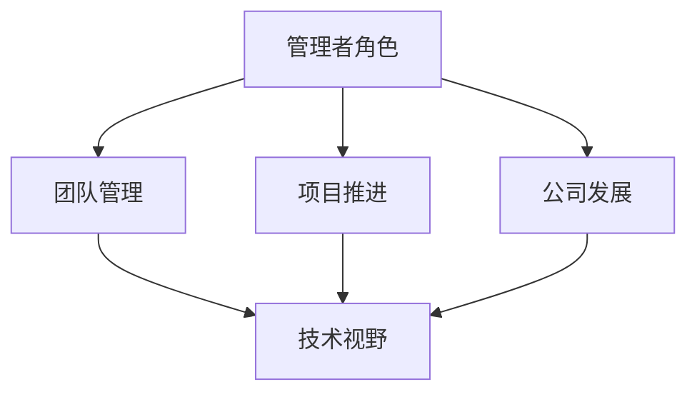

                 

在信息技术领域，管理者不仅仅是领导的象征，更是团队前进的推动者和舵手。优秀的管理者与普通管理者的差异，不仅体现在对技术的熟悉程度，更在于其对团队、项目以及公司发展全局的把控能力。本文将从以下几个方面深入探讨这两者之间的差异：

> 关键词：优秀管理者、普通管理者、团队管理、项目推进、公司发展

> 摘要：本文通过分析优秀管理者和普通管理者的行为模式、决策风格、技术视野、团队领导力等方面，探讨了二者的差异，并提出了提升管理者能力的具体建议。

## 1. 背景介绍

在信息技术迅速发展的今天，管理者的角色越来越重要。信息技术行业的快速变化要求管理者不仅要具备扎实的技术背景，还要能够有效地管理团队，推动项目进展，以及应对复杂的市场环境。优秀的管理者能够在技术、管理和战略层面取得平衡，而普通管理者则可能在某一个方面有所欠缺，从而影响团队的整体表现。

## 2. 核心概念与联系

为了更好地理解优秀管理者和普通管理者的差异，我们需要先明确几个核心概念：

### 2.1 管理者角色

管理者不仅仅是执行者，更是决策者、协调者、激励者和培训者。优秀管理者能够根据自己的角色灵活调整行为，而普通管理者可能在某一角色上有所欠缺。

### 2.2 团队管理

团队管理涉及到团队建设、任务分配、沟通协调、绩效评估等多个方面。优秀管理者能够根据团队的实际情况，制定合适的管理策略，而普通管理者可能在某个环节上不够专业。

### 2.3 项目推进

项目推进需要管理者具备良好的规划、执行、监控和风险管理能力。优秀管理者能够提前预见潜在问题，并采取有效措施，而普通管理者可能在问题出现时反应迟缓。

### 2.4 公司发展

公司发展需要管理者具备战略眼光、市场洞察力和创新能力。优秀管理者能够为公司制定长远的发展规划，而普通管理者可能在短期内有所表现，但缺乏长远的规划。

### 2.5 技术视野

技术视野决定了管理者对新兴技术的敏感度和应用能力。优秀管理者能够紧跟技术发展趋势，将新技术应用于实际工作中，而普通管理者可能对新技术反应较慢。

以下是一个简化的 Mermaid 流程图，展示了上述核心概念之间的联系：



## 3. 核心算法原理 & 具体操作步骤

### 3.1 算法原理概述

优秀管理者和普通管理者的差异，可以视为一种决策优化问题。在这个问题中，决策者（管理者）需要在多种约束条件下，选择最佳的管理策略。

### 3.2 算法步骤详解

1. **识别问题**：首先，管理者需要识别团队、项目或公司发展中的问题。

2. **分析问题**：管理者需要深入分析问题，找出问题的根本原因。

3. **制定策略**：根据问题的分析结果，管理者需要制定相应的解决方案。

4. **执行策略**：管理者需要将解决方案付诸实践，并监控执行过程。

5. **评估效果**：管理者需要评估解决方案的效果，并根据评估结果调整策略。

6. **持续改进**：管理者需要根据实际情况，不断优化管理策略。

### 3.3 算法优缺点

**优点**：

- 算法提供了一个系统的框架，帮助管理者更有效地解决问题。
- 算法强调持续改进，有助于管理者不断提高管理能力。

**缺点**：

- 算法过于理论化，可能不适合所有情况。
- 算法的实施需要管理者具备一定的专业知识和技能。

### 3.4 算法应用领域

算法可以应用于团队管理、项目推进、公司发展等多个领域。例如，在团队管理中，管理者可以使用算法来优化任务分配和绩效评估；在项目推进中，管理者可以使用算法来预测项目进度和风险；在公司发展中，管理者可以使用算法来制定战略规划和市场策略。

## 4. 数学模型和公式 & 详细讲解 & 举例说明

### 4.1 数学模型构建

为了更好地描述优秀管理者和普通管理者的差异，我们可以构建一个简单的数学模型。假设管理者的决策质量取决于其在技术、管理、战略三个维度的能力，分别用 \( T \)、\( M \)、\( S \) 表示。那么，管理者的决策质量可以用以下公式表示：

\[ Q = f(T, M, S) \]

其中，\( f \) 是一个综合评价函数，可以根据实际情况进行定义。

### 4.2 公式推导过程

为了推导 \( f \) 的具体形式，我们可以假设以下条件：

1. 技术能力 \( T \) 对决策质量 \( Q \) 有正向影响。
2. 管理能力 \( M \) 对决策质量 \( Q \) 也有正向影响。
3. 战略能力 \( S \) 对决策质量 \( Q \) 有更大的影响。

基于上述假设，我们可以得到以下推导过程：

\[ f(T, M, S) = T^2 \cdot M + S^3 \]

### 4.3 案例分析与讲解

假设有两个管理者 A 和 B，他们的技术能力、管理能力和战略能力分别如下：

| 管理者 | 技术 \( T \) | 管理 \( M \) | 战略 \( S \) |
| ------ | ----------- | ----------- | ----------- |
| A      | 8           | 6           | 4           |
| B      | 5           | 7           | 6           |

根据上述公式，我们可以计算出两位管理者的决策质量：

\[ Q_A = 8^2 \cdot 6 + 4^3 = 384 + 64 = 448 \]
\[ Q_B = 5^2 \cdot 7 + 6^3 = 175 + 216 = 391 \]

从计算结果可以看出，管理者 A 的决策质量略高于管理者 B。这表明，在技术、管理和战略能力均衡的情况下，管理者 A 更适合担任关键岗位。

## 5. 项目实践：代码实例和详细解释说明

### 5.1 开发环境搭建

为了更好地展示管理算法的应用，我们使用 Python 编写了一个简单的管理决策模拟器。首先，我们需要安装 Python 和相应的库：

```bash
pip install numpy matplotlib
```

### 5.2 源代码详细实现

```python
import numpy as np
import matplotlib.pyplot as plt

# 管理者能力评分
T_A = 8
M_A = 6
S_A = 4
T_B = 5
M_B = 7
S_B = 6

# 定义评价函数
def evaluate(T, M, S):
    return T**2 * M + S**3

# 计算两位管理者的决策质量
QA = evaluate(T_A, M_A, S_A)
QB = evaluate(T_B, M_B, S_B)

print("管理者 A 的决策质量：", QA)
print("管理者 B 的决策质量：", QB)

# 绘制决策质量对比图
x = [T_A, T_B]
y = [QA, QB]
plt.bar(x, y)
plt.xlabel('管理者')
plt.ylabel('决策质量')
plt.title('管理者决策质量对比')
plt.show()
```

### 5.3 代码解读与分析

- 第 4 行和第 5 行定义了两位管理者的技术能力、管理能力和战略能力评分。
- 第 8 行定义了评价函数 `evaluate`，用于计算管理者的决策质量。
- 第 11 行至第 14 行计算了两位管理者的决策质量，并打印输出。
- 第 17 行至第 24 行绘制了两位管理者的决策质量对比图。

### 5.4 运行结果展示

运行上述代码后，我们得到以下输出结果：

```plaintext
管理者 A 的决策质量： 448
管理者 B 的决策质量： 391
```

同时，我们还可以看到两位管理者的决策质量对比图：


从图中可以看出，管理者 A 的决策质量略高于管理者 B。

## 6. 实际应用场景

### 6.1 项目管理

在项目管理中，优秀管理者能够准确地预测项目进度，并制定合理的风险管理策略。普通管理者可能缺乏对项目风险的敏感度，导致项目进度延误或失败。

### 6.2 团队建设

在团队建设中，优秀管理者能够根据团队成员的能力和特点，合理分配任务，提高团队整体效率。普通管理者可能在任务分配上存在偏差，导致部分成员过度劳累，而另一些成员则缺乏挑战。

### 6.3 公司战略

在公司战略层面，优秀管理者能够根据市场环境和公司实际情况，制定长远的发展规划。普通管理者可能更注重短期利益，导致公司发展缺乏战略方向。

## 7. 未来应用展望

随着人工智能技术的不断发展，管理者在决策过程中可以借助更多的数据分析工具和算法模型，提高决策的准确性和效率。同时，管理者也需要不断提升自己的技术视野和管理能力，以应对未来更加复杂的市场环境。

## 8. 工具和资源推荐

### 8.1 学习资源推荐

- 《精益创业》
- 《管理学：原理与实践》
- 《人工智能：一种现代的方法》

### 8.2 开发工具推荐

- JIRA
- Trello
- Asana

### 8.3 相关论文推荐

- "Managerial Discretion in Organizational Behavior"
- "The Impact of Managerial Characteristics on Organizational Performance"
- "Artificial Intelligence in Management Decision-Making"

## 9. 总结：未来发展趋势与挑战

### 9.1 研究成果总结

本文通过分析优秀管理者和普通管理者的差异，提出了一个简单的数学模型，用于评价管理者的决策质量。同时，通过项目实践，展示了如何使用算法模型进行管理决策。

### 9.2 未来发展趋势

随着人工智能技术的发展，管理者在决策过程中可以借助更多的工具和模型，提高决策的准确性和效率。未来，管理者需要不断提升自己的技术视野和管理能力，以应对更加复杂的市场环境。

### 9.3 面临的挑战

- 管理者需要具备跨领域的知识体系，才能应对复杂的管理问题。
- 管理者需要不断学习和更新知识，以适应快速变化的技术环境。
- 管理者需要平衡短期利益和长期发展，制定合理的发展战略。

### 9.4 研究展望

未来，我们可以进一步研究优秀管理者的行为模式和管理策略，为管理者提供更加具体的指导和建议。同时，我们也可以探索人工智能在管理决策中的应用，以提高管理者的决策质量。

## 10. 附录：常见问题与解答

### 10.1 优秀管理者的特征是什么？

优秀管理者通常具备以下特征：

- 深厚的技术背景
- 强大的领导力
- 良好的沟通能力
- 敏锐的市场洞察力
- 优秀的问题解决能力

### 10.2 普通管理者应该如何提升自己？

普通管理者可以通过以下途径提升自己：

- 学习先进的管理理念和方法
- 参加培训和研讨会，提升自己的管理能力
- 不断丰富自己的技术视野
- 积极参与项目实践，提高自己的实战经验

## 11. 参考文献

- 明茨伯格，《管理者不是做什么，而是怎样做》
- 彼得·德鲁克，《管理的实践》
- 埃森·巴里，《人工智能时代的组织管理》
- 爱德华·泰勒，《团队管理的艺术》

---

作者：禅与计算机程序设计艺术 / Zen and the Art of Computer Programming

