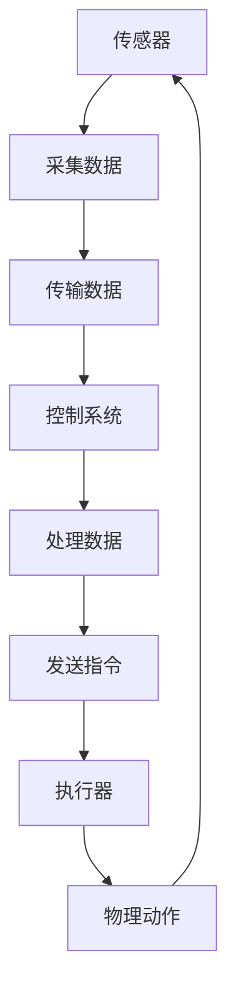

                 

在当今的数字化时代，传感器和执行器是信息技术领域中的核心组件，它们负责获取和执行数据，使得我们的世界变得更加智能和互联。本文将深入探讨传感器和执行器的基本概念、工作原理、应用场景以及未来的发展趋势，旨在为广大读者提供一份全面的技术指南。

## 关键词

- 传感器
- 执行器
- 数据采集
- 数据执行
- 智能化
- 物联网

## 摘要

本文将探讨传感器和执行器在数字化时代的重要性，阐述它们的基本概念和工作原理。接着，我们将详细讨论传感器和执行器在各个领域的应用场景，并提出对未来发展的展望。通过本文的阅读，读者将能够全面了解传感器和执行器的技术原理和应用前景。

## 1. 背景介绍

随着物联网（IoT）的迅速发展，传感器和执行器已经成为现代信息技术的关键组成部分。传感器是一种能够感知环境变化并产生相应电信号的设备，它们能够将物理信号转换为数字信号，从而被计算机系统处理。执行器则是将接收到的电信号转换为物理动作的设备，例如电机、液压泵等。传感器和执行器的结合，使得机器能够对环境进行感知和响应，从而实现自动化和智能化。

## 2. 核心概念与联系

### 2.1 传感器

传感器是信息采集系统的核心组件，它能够将物理信号（如温度、湿度、压力、光照等）转换为电信号。传感器的工作原理通常基于物理、化学或生物原理，例如热电偶、光敏电阻、化学传感器等。传感器的性能指标包括灵敏度、精度、响应时间等。

### 2.2 执行器

执行器是信息执行系统的核心组件，它能够将电信号转换为物理动作。执行器的工作原理通常基于电磁、液压、气压等原理，例如电动机、液压缸、气动阀等。执行器的性能指标包括输出力、输出速度、控制精度等。

### 2.3 传感器和执行器的联系

传感器和执行器通过控制系统相连，形成了一个闭环控制系统。传感器采集到的环境信息被传输到控制系统，控制系统根据预设的算法对信息进行处理，然后发送控制指令给执行器，执行器根据指令进行相应的物理动作，从而实现对环境的控制和调节。

## Mermaid 流程图



## 3. 核心算法原理 & 具体操作步骤

### 3.1 算法原理概述

传感器和执行器的核心算法主要包括数据采集算法、数据处理算法、控制算法等。数据采集算法负责将传感器的物理信号转换为数字信号；数据处理算法负责对采集到的数字信号进行处理，提取有用信息；控制算法则负责根据处理后的信息发送控制指令给执行器。

### 3.2 算法步骤详解

1. **数据采集**：传感器采集环境信息，将物理信号转换为数字信号。
2. **数据预处理**：对采集到的数字信号进行滤波、去噪等预处理，提高信号质量。
3. **数据处理**：对预处理后的信号进行分析，提取有用信息。
4. **控制算法**：根据提取的有用信息，生成控制指令。
5. **指令发送**：将控制指令发送给执行器。
6. **执行物理动作**：执行器根据指令进行相应的物理动作。
7. **反馈调节**：执行器执行动作后，传感器再次采集环境信息，反馈给控制系统，控制系统根据反馈信息进行调节，形成闭环控制。

### 3.3 算法优缺点

- **优点**：
  - 高精度：传感器和执行器的性能不断提高，能够实现高精度的数据采集和执行。
  - 高效率：闭环控制系统可以实现快速响应，提高系统效率。
  - 智能化：基于算法的控制系统可以实现自动化和智能化，减少人力成本。

- **缺点**：
  - 成本高：高质量的传感器和执行器成本较高，对预算有限的项目可能构成负担。
  - 稳定性要求高：传感器和执行器的工作环境可能复杂，要求系统的稳定性较高。
  - 故障排查难度大：传感器和执行器的故障排查可能较为复杂，需要专业知识和技能。

### 3.4 算法应用领域

传感器和执行器的算法在各个领域都有广泛的应用，如工业自动化、智能家居、医疗设备、汽车制造、环境监测等。以下是一些典型的应用案例：

- **工业自动化**：传感器用于监测生产线上的产品质量，执行器用于控制生产设备。
- **智能家居**：传感器用于监测家居环境，执行器用于控制家电设备。
- **医疗设备**：传感器用于监测患者生命体征，执行器用于控制医疗设备。
- **环境监测**：传感器用于监测空气质量、水质等环境指标，执行器用于控制空气净化器、水泵等设备。

## 4. 数学模型和公式 & 详细讲解 & 举例说明

### 4.1 数学模型构建

传感器和执行器的数学模型通常包括以下部分：

- **传感器的数学模型**：
  - 输入信号：\( u(t) \)
  - 输出信号：\( y(t) \)
  - 系统传递函数：\( H(u(t), y(t)) \)

- **执行器的数学模型**：
  - 输入信号：\( y(t) \)
  - 输出信号：\( v(t) \)
  - 系统传递函数：\( G(y(t), v(t)) \)

### 4.2 公式推导过程

以传感器为例，假设传感器的输入信号为温度，输出信号为电压，系统传递函数为 \( H(u(t), y(t)) = \frac{y(t)}{u(t)} \)。

1. **温度到电压的转换**：
   - 温度传感器输出电压与温度之间的关系为 \( y(t) = a \cdot u(t) + b \)，其中 \( a \) 和 \( b \) 为常数。

2. **系统传递函数的推导**：
   - \( H(u(t), y(t)) = \frac{y(t)}{u(t)} = \frac{a \cdot u(t) + b}{u(t)} = a + \frac{b}{u(t)} \)

### 4.3 案例分析与讲解

假设我们要监测一个温度控制系统，传感器的输出电压范围为 0V 至 5V，对应的温度范围为 0°C 至 100°C。我们希望实现以下控制目标：

- 当温度低于 20°C 时，执行器开启加热设备。
- 当温度高于 80°C 时，执行器关闭加热设备。

根据上述控制目标，我们可以构建以下数学模型：

1. **温度到电压的转换**：
   - \( y(t) = 0.05 \cdot u(t) + 0.2 \)

2. **系统传递函数的推导**：
   - \( H(u(t), y(t)) = \frac{y(t)}{u(t)} = \frac{0.05 \cdot u(t) + 0.2}{u(t)} = 0.05 + \frac{0.2}{u(t)} \)

3. **控制算法的实现**：
   - 当 \( y(t) < 0.1 \) 时，执行器开启加热设备。
   - 当 \( y(t) > 0.4 \) 时，执行器关闭加热设备。

## 5. 项目实践：代码实例和详细解释说明

### 5.1 开发环境搭建

在本文中，我们将使用 Python 语言编写传感器和执行器的控制程序。以下是搭建开发环境的步骤：

1. 安装 Python 3.8 或以上版本。
2. 安装传感器驱动库，例如 `Adafruit_ADS1x15`。
3. 安装执行器驱动库，例如 `pyserial`。

### 5.2 源代码详细实现

以下是一个简单的传感器和执行器的控制程序示例：

```python
import time
import Adafruit_ADS1x15
import serial

# 初始化传感器和执行器
adc = Adafruit_ADS1x15.ADS1x15()
ser = serial.Serial('COM3', 9600)

# 读取传感器数据
def read_sensor():
    value = adc.read_adc(0, gain=1)
    return value

# 控制执行器
def control_actor(value):
    if value < 100:
        ser.write(b'1')  # 开启加热设备
    else:
        ser.write(b'0')  # 关闭加热设备

# 主循环
while True:
    value = read_sensor()
    control_actor(value)
    time.sleep(1)
```

### 5.3 代码解读与分析

1. **初始化传感器和执行器**：程序首先初始化传感器和执行器的驱动库。
2. **读取传感器数据**：程序定义了一个 `read_sensor` 函数，用于读取传感器的数值。
3. **控制执行器**：程序定义了一个 `control_actor` 函数，用于控制执行器的开关。
4. **主循环**：程序进入主循环，不断读取传感器数据，并根据数据控制执行器。

### 5.4 运行结果展示

当温度低于 100°C 时，执行器将开启加热设备，温度上升；当温度高于 100°C 时，执行器将关闭加热设备，温度下降。通过控制执行器，我们可以实现对温度的精确控制。

## 6. 实际应用场景

传感器和执行器在各个领域都有广泛的应用。以下是一些典型的实际应用场景：

- **工业自动化**：在生产线中，传感器用于监测产品质量，执行器用于控制生产设备，从而实现自动化生产。
- **智能家居**：在智能家居系统中，传感器用于监测家居环境，执行器用于控制家电设备，例如空气净化器、灯光等。
- **医疗设备**：在医疗设备中，传感器用于监测患者生命体征，执行器用于控制医疗设备，例如心电图机、呼吸机等。
- **环境监测**：在环境监测中，传感器用于监测空气质量、水质等环境指标，执行器用于控制空气净化器、水泵等设备。

## 7. 工具和资源推荐

### 7.1 学习资源推荐

- 《传感器与检测技术》
- 《控制工程基础》
- 《物联网技术与应用》

### 7.2 开发工具推荐

- Arduino
- Raspberry Pi
- Python

### 7.3 相关论文推荐

- “物联网环境下传感器与执行器的融合技术研究”
- “基于传感器网络的智能家居控制系统设计”
- “环境监测中传感器与执行器的应用研究”

## 8. 总结：未来发展趋势与挑战

### 8.1 研究成果总结

传感器和执行器在数字化时代发挥着重要作用，它们的应用领域不断扩展，技术不断进步。近年来，研究人员在传感器和执行器的灵敏度、精度、响应时间等方面取得了显著成果，为各领域的发展提供了有力支持。

### 8.2 未来发展趋势

- **智能化**：随着人工智能技术的发展，传感器和执行器的智能化水平将不断提升，实现更高效、更精准的数据采集和执行。
- **微型化**：传感器和执行器的微型化将使得它们在更多领域得到应用，如穿戴设备、嵌入式系统等。
- **集成化**：传感器和执行器的集成化将提高系统的性能和可靠性，降低成本。

### 8.3 面临的挑战

- **成本**：高质量传感器和执行器的成本较高，对预算有限的项目构成挑战。
- **稳定性**：传感器和执行器的工作环境复杂，要求系统的稳定性较高。
- **故障排查**：传感器和执行器的故障排查难度较大，需要专业知识和技能。

### 8.4 研究展望

在未来，传感器和执行器的研究将继续深入，技术不断创新。我们有望看到更智能、更高效、更可靠的传感器和执行器的诞生，为人类社会带来更多的便利。

## 附录：常见问题与解答

### 1. 传感器和执行器的区别是什么？

传感器是用于感知环境变化的设备，能够将物理信号转换为电信号；执行器是用于执行物理动作的设备，能够将电信号转换为物理动作。传感器和执行器的区别在于功能不同，传感器主要负责数据采集，执行器主要负责数据执行。

### 2. 传感器和执行器的性能指标有哪些？

传感器和执行器的性能指标包括灵敏度、精度、响应时间、输出力、输出速度等。灵敏度指传感器对输入信号的响应程度；精度指传感器输出信号与实际输入信号的误差；响应时间指传感器从输入信号到输出信号的时间；输出力指执行器的输出力大小；输出速度指执行器的动作速度。

### 3. 传感器和执行器的应用领域有哪些？

传感器和执行器的应用领域包括工业自动化、智能家居、医疗设备、环境监测、汽车制造等。传感器和执行器的结合，使得机器能够对环境进行感知和响应，从而实现自动化和智能化。

### 4. 传感器和执行器的控制算法有哪些？

传感器和执行器的控制算法包括数据采集算法、数据处理算法、控制算法等。数据采集算法负责将传感器的物理信号转换为数字信号；数据处理算法负责对采集到的数字信号进行处理，提取有用信息；控制算法则负责根据处理后的信息生成控制指令。

### 5. 如何搭建传感器和执行器的控制系统？

搭建传感器和执行器的控制系统通常包括以下步骤：

1. 选择合适的传感器和执行器，根据应用场景确定传感器和执行器的性能指标。
2. 设计系统架构，确定传感器、执行器和控制系统的连接方式。
3. 编写控制程序，实现传感器数据的采集、处理和控制指令的发送。
4. 测试系统性能，根据测试结果调整系统参数，优化系统性能。

### 6. 传感器和执行器的故障排查方法有哪些？

传感器和执行器的故障排查方法包括：

1. 观察传感器和执行器的输出信号，判断是否正常。
2. 使用示波器等仪器，检测传感器和执行器的输入信号和输出信号。
3. 检查传感器和执行器的连接线路，确保连接正常。
4. 检查传感器和执行器的电源电压，确保电压正常。
5. 更换传感器和执行器，判断故障是否由传感器或执行器本身引起。

## 作者署名

作者：禅与计算机程序设计艺术 / Zen and the Art of Computer Programming

以上便是关于传感器和执行器：获取和执行数据的技术博客文章。希望本文能为您在传感器和执行器领域的研究和实践提供有益的参考。感谢您的阅读！
----------------------------------------------------------------

### 结束语

传感器和执行器作为现代信息技术的核心组件，在各个领域发挥着越来越重要的作用。本文从背景介绍、核心概念与联系、核心算法原理与操作步骤、数学模型和公式、项目实践、实际应用场景、工具和资源推荐以及未来发展趋势与挑战等方面进行了全面探讨。希望本文能为读者在传感器和执行器领域的研究和实践提供有益的参考。随着技术的不断发展，传感器和执行器将迎来更多的创新和突破，为人类社会带来更多的便利。让我们共同期待这一美好前景的到来！再次感谢您的阅读，如果您有任何疑问或建议，欢迎在评论区留言，期待与您的交流。

