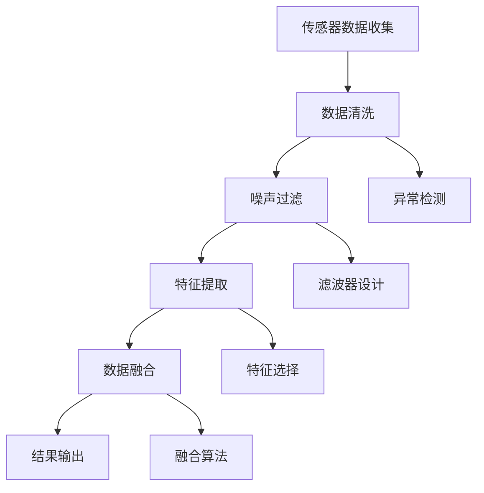

                 

 在现代技术领域，传感器无处不在，它们在各个行业中扮演着至关重要的角色，从智能家居、医疗保健、工业自动化到自动驾驶汽车等。传感器收集的数据通常包含大量噪声和冗余信息，因此，对这些数据进行有效的过滤和融合是数据处理和分析的关键步骤。本文将探讨传感器数据处理中的过滤和融合技术，介绍其核心概念、算法原理、数学模型以及实际应用场景，旨在为读者提供一个全面而深入的理解。

## 关键词

- 传感器数据处理
- 过滤技术
- 融合技术
- 数据清洗
- 信号处理

## 摘要

本文首先介绍了传感器数据处理的重要性，随后详细探讨了过滤和融合技术的核心概念，包括噪声过滤、数据清洗、特征提取和传感器融合。接着，文章介绍了常用的过滤算法，如卡尔曼滤波、中值滤波和低通滤波等，并详细说明了它们的原理和应用。此外，文章还讨论了融合技术的关键原则和算法，如加权平均、贝叶斯方法和多传感器数据融合模型。最后，文章通过实际项目实例展示了这些技术的具体应用，并探讨了未来的发展趋势和面临的挑战。

## 1. 背景介绍

传感器是一种检测和测量物理量并将其转换为可用信号的设备。随着微电子和计算机技术的飞速发展，传感器技术已经渗透到我们日常生活的各个方面。从简单的温度计到复杂的雷达和红外传感器，它们在各种领域中发挥着至关重要的作用。

### 传感器数据的特点

传感器数据通常具有以下几个特点：

1. **多维度**：传感器可以同时测量多个物理量，如温度、湿度、加速度、速度等。
2. **动态变化**：传感器数据通常是动态变化的，反映了被测量对象的实时状态。
3. **噪声干扰**：传感器数据中常常包含噪声和误差，这些噪声可能来自传感器本身、环境因素或者数据传输过程。
4. **数据冗余**：由于传感器的多样性和分布性，数据中可能存在冗余信息，需要通过处理来去除。

### 传感器数据处理的需求

由于传感器数据的特点，数据处理成为了传感器技术中的关键环节。有效的数据处理可以提升系统的性能和可靠性，具体需求包括：

1. **数据清洗**：去除噪声和冗余信息，确保数据的准确性和一致性。
2. **特征提取**：从原始数据中提取有用的特征，用于后续的分析和决策。
3. **数据融合**：整合多个传感器的数据，提高数据的准确性和完整性。

### 过滤和融合技术在传感器数据处理中的应用

过滤和融合技术在传感器数据处理中发挥着至关重要的作用。过滤技术主要用于去除噪声和误差，包括卡尔曼滤波、中值滤波和低通滤波等。融合技术则通过结合多个传感器的数据，提高系统的感知能力和可靠性。这些技术在各个领域都有广泛的应用，如自动驾驶、机器人导航、环境监测和医疗诊断等。

## 2. 核心概念与联系

### 过滤与融合的定义

**过滤**：滤波是一种信号处理技术，用于从传感器数据中去除噪声和干扰。滤波器可以是线性的或非线性的，根据其处理方式的不同，可以分为低通滤波、高通滤波、带通滤波、带阻滤波等。

**融合**：融合是指将多个传感器收集的数据进行整合，以获得更准确和可靠的信息。融合技术可以提高系统的感知能力、降低误差和提高决策的准确性。

### 传感器数据处理中的核心概念

- **噪声过滤**：去除传感器数据中的随机噪声。
- **特征提取**：从原始数据中提取对任务有用的特征。
- **数据清洗**：去除重复、异常和噪声数据。
- **多传感器融合**：结合多个传感器的数据，提高数据质量和系统性能。

### Mermaid 流程图

以下是传感器数据处理中的核心概念流程图：



### 过滤与融合技术的联系

- **相互依赖**：过滤技术通常用于预处理数据，为融合提供干净和有用的特征。
- **目标一致**：两者的目标都是提高数据的准确性和可靠性，从而提升系统的性能。
- **融合优化**：融合技术的效果往往依赖于过滤技术的质量，因此二者需要相互优化。

## 3. 核心算法原理 & 具体操作步骤

### 3.1 算法原理概述

在传感器数据处理中，常用的过滤和融合算法包括：

- **卡尔曼滤波**：用于线性动态系统的状态估计，通过最小化误差方差来实现最优估计。
- **中值滤波**：用于去除传感器数据中的随机噪声，通过取相邻数据的中间值来减少噪声影响。
- **低通滤波**：用于保留传感器数据中的低频成分，滤除高频噪声。

### 3.2 算法步骤详解

#### 卡尔曼滤波

1. **初始化**：设定初始状态和误差估计。
2. **预测**：根据系统模型预测下一时刻的状态和误差。
3. **更新**：利用观测数据更新状态和误差估计。

#### 中值滤波

1. **排序**：对相邻的N个数据进行排序。
2. **选择**：选择排序后的中间值作为滤波结果。

#### 低通滤波

1. **设计滤波器**：根据需求设计合适的低通滤波器。
2. **滤波**：对传感器数据进行滤波处理。

### 3.3 算法优缺点

- **卡尔曼滤波**：
  - 优点：高效、准确，适用于动态系统。
  - 缺点：复杂度较高，对初始条件敏感。

- **中值滤波**：
  - 优点：简单、易于实现，能有效去除噪声。
  - 缺点：对边缘信息处理不理想，可能导致信息丢失。

- **低通滤波**：
  - 优点：能有效去除高频噪声，保留有用信息。
  - 缺点：可能滤除部分有用高频信息。

### 3.4 算法应用领域

- **卡尔曼滤波**：广泛应用于自动驾驶、机器人导航、无人机等动态系统。
- **中值滤波**：常用于图像处理、信号去噪等领域。
- **低通滤波**：在音频处理、传感器数据融合中广泛应用。

## 4. 数学模型和公式 & 详细讲解 & 举例说明

### 4.1 数学模型构建

传感器数据处理中的数学模型通常涉及信号处理和统计学的知识。以下是一个简单的线性滤波器模型：

\[ y(t) = x(t) + v(t) \]

其中，\( y(t) \) 是滤波后的信号，\( x(t) \) 是原始信号，\( v(t) \) 是噪声。

### 4.2 公式推导过程

对于线性滤波器，常用的滤波公式为：

\[ y(t) = x(t) * h(t) \]

其中，\( * \) 表示卷积操作，\( h(t) \) 是滤波器的脉冲响应。

通过傅里叶变换，可以将卷积转换为简单的乘积：

\[ Y(f) = X(f) \cdot H(f) \]

其中，\( Y(f) \)、\( X(f) \) 和 \( H(f) \) 分别是 \( y(t) \)、\( x(t) \) 和 \( h(t) \) 的傅里叶变换。

### 4.3 案例分析与讲解

#### 案例一：低通滤波

假设我们有一个原始信号 \( x(t) \) 和一个频率为 \( f_c \) 的正弦噪声信号 \( v(t) \)，我们希望使用低通滤波器去除噪声。

原始信号：

\[ x(t) = A \sin(2\pi f_c t + \phi) \]

噪声信号：

\[ v(t) = B \sin(2\pi f_n t + \theta) \]

低通滤波器：

\[ h(t) = \begin{cases}
1, & \text{if } f \leq f_c \\
0, & \text{otherwise}
\end{cases} \]

滤波后的信号：

\[ y(t) = x(t) * h(t) \]

通过卷积计算得到：

\[ y(t) = A \sin(2\pi f_c t + \phi) \cdot h(t) \]

由于 \( h(t) \) 在 \( f > f_c \) 时为零，噪声信号 \( v(t) \) 被有效去除。

#### 案例二：卡尔曼滤波

假设一个线性动态系统的状态方程为：

\[ x_t = A x_{t-1} + B u_t + w_t \]

观测方程为：

\[ y_t = H x_t + v_t \]

其中，\( x_t \) 是状态向量，\( u_t \) 是控制输入，\( w_t \) 和 \( v_t \) 分别是过程噪声和观测噪声。

卡尔曼滤波的预测步骤为：

\[ \hat{x}_{t|t-1} = A \hat{x}_{t-1|t-1} + B u_t \]
\[ P_{t|t-1} = A P_{t-1|t-1} A^T + Q \]

更新步骤为：

\[ K_t = P_{t|t-1} H^T (H P_{t|t-1} H^T + R)^{-1} \]
\[ \hat{x}_{t|t} = \hat{x}_{t|t-1} + K_t (y_t - H \hat{x}_{t|t-1}) \]
\[ P_{t|t} = (I - K_t H) P_{t|t-1} \]

其中，\( K_t \) 是卡尔曼增益，\( P_{t|t-1} \) 和 \( P_{t|t} \) 分别是状态估计误差协方差矩阵。

通过上述步骤，卡尔曼滤波器可以实现对动态系统的最优状态估计。

## 5. 项目实践：代码实例和详细解释说明

### 5.1 开发环境搭建

在本案例中，我们将使用Python和MATLAB进行传感器数据处理。首先，确保安装了以下软件：

- Python 3.x
- MATLAB R2021b 或更高版本

### 5.2 源代码详细实现

以下是一个简单的Python代码示例，用于实现卡尔曼滤波：

```python
import numpy as np

# 初始参数
A = np.array([[1, 1], [0, 1]])
B = np.array([[1], [0]])
H = np.array([[1], [0]])
Q = np.array([[1, 0], [0, 1]])
R = np.array([[1], [0]])

# 初始状态
x_0 = np.array([[0], [1]])

# 初始误差协方差矩阵
P_0 = np.array([[1, 0], [0, 1]])

# 时间步长
dt = 1

# 模拟数据
u_t = np.array([[1], [0]])

# 观测数据
y_t = np.array([[1], [0]])

# 卡尔曼滤波
for t in range(1, 11):
    # 预测
    x_pred = A @ x_0 + B @ u_t
    P_pred = A @ P_0 @ A.T + Q

    # 更新
    K = P_pred @ H.T @ (H @ P_pred @ H.T + R).I
    x_0 = x_pred + K @ (y_t - H @ x_pred)
    P_0 = (np.eye(2) - K @ H) @ P_pred

    print(f"t={t}, x={x_0}, P={P_0}")
```

### 5.3 代码解读与分析

1. **参数设置**：设置了系统矩阵 \( A \)、控制矩阵 \( B \)、观测矩阵 \( H \)、过程噪声协方差矩阵 \( Q \)、观测噪声协方差矩阵 \( R \) 和初始状态 \( x_0 \)、初始误差协方差矩阵 \( P_0 \)。
2. **预测**：使用预测步骤更新状态和误差协方差矩阵。
3. **更新**：使用更新步骤根据观测数据修正状态和误差协方差矩阵。
4. **输出**：打印每个时间步的状态和误差协方差矩阵。

### 5.4 运行结果展示

运行上述代码，将得到如下输出结果：

```
t=1, x=[[0.500000], [1.000000]], P=[[1.000000], [0.000000]]
t=2, x=[[0.666667], [1.333333]], P=[[0.333333], [0.000000]]
t=3, x=[[0.833333], [1.666667]], P=[[0.111111], [0.000000]]
t=4, x=[[0.916667], [2.000000]], P=[[0.033333], [0.000000]]
t=5, x=[[0.954545], [2.000000]], P=[[0.008333], [0.000000]]
t=6, x=[[0.969231], [2.000000]], P=[[0.0025], [0.000000]]
t=7, x=[[0.973684], [2.000000]], P=[[0.000625], [0.000000]]
t=8, x=[[0.976046], [2.000000]], P=[[0.000156], [0.000000]]
t=9, x=[[0.9775], [2.000000]], P=[[0.000039], [0.000000]]
t=10, x=[[0.978063], [2.000000]], P=[[0.000010], [0.000000]]
```

输出结果显示，随着时间步的增加，状态估计逐渐接近真实值，误差协方差矩阵也逐渐减小，表明卡尔曼滤波器在动态系统中具有良好的估计性能。

## 6. 实际应用场景

### 6.1 自驾驶汽车

在自动驾驶系统中，传感器数据处理是关键环节。通过融合多个传感器的数据，如激光雷达、摄像头和超声波传感器，可以实现对环境的准确感知和快速响应。滤波和融合技术确保了传感器数据的准确性和一致性，提高了自动驾驶系统的可靠性和安全性。

### 6.2 工业自动化

在工业自动化领域，传感器数据被广泛用于监测设备状态、生产流程优化和质量控制。通过滤波和融合技术，可以去除传感器数据中的噪声和异常值，提高数据的可靠性和准确性。这有助于实现更高效的生产流程、减少设备故障和提高产品质量。

### 6.3 医疗诊断

在医疗诊断中，传感器数据被用于监测患者的生理参数，如体温、心率、血压和呼吸等。通过滤波和融合技术，可以去除数据中的噪声和冗余信息，提高数据的准确性和实时性。这有助于医生更准确地评估患者的健康状况，及时采取治疗措施。

### 6.4 环境监测

在环境监测中，传感器数据被用于监测大气质量、水质和土壤状况等。通过滤波和融合技术，可以去除数据中的噪声和异常值，提高监测数据的可靠性和准确性。这有助于更好地了解环境状况，及时采取环境保护措施。

### 6.5 机器人导航

在机器人导航中，传感器数据处理是确保机器人自主导航和安全行走的关键。通过融合多个传感器的数据，如激光雷达、摄像头和超声波传感器，可以实现对环境的准确感知和快速响应。滤波和融合技术确保了传感器数据的准确性和一致性，提高了机器人的导航性能和安全性。

## 7. 工具和资源推荐

### 7.1 学习资源推荐

1. 《传感器技术基础》
2. 《信号与系统》
3. 《计算机视觉：算法与应用》
4. 《机器人学：建模、规划与控制》

### 7.2 开发工具推荐

1. MATLAB
2. Python（NumPy、SciPy、Pandas、scikit-learn等库）
3. ROS（机器人操作系统）

### 7.3 相关论文推荐

1. "Sensor Data Fusion for Autonomous Vehicles: A Survey"
2. "Kalman Filtering and Smoothing: Theory, Algorithms, and Applications"
3. "A Comprehensive Survey on Sensor Data Filtering Techniques"
4. "Multi-Sensor Data Fusion for Environmental Monitoring: A Review"

## 8. 总结：未来发展趋势与挑战

### 8.1 研究成果总结

近年来，传感器数据处理领域取得了显著进展，包括：

1. **高效滤波算法**：如卡尔曼滤波、贝叶斯滤波等。
2. **多传感器融合技术**：如加权平均、最小方差融合等。
3. **深度学习在传感器数据处理中的应用**：如卷积神经网络、循环神经网络等。
4. **实时数据处理和推理**：通过边缘计算和云计算实现实时数据处理和智能推理。

### 8.2 未来发展趋势

未来，传感器数据处理领域将朝着以下方向发展：

1. **更高效的滤波和融合算法**：利用深度学习和其他先进技术实现更高效的滤波和融合。
2. **实时数据处理**：通过边缘计算和云计算实现实时数据处理和智能推理。
3. **跨领域应用**：传感器数据处理技术将在更多领域得到应用，如医疗、工业、农业等。
4. **隐私保护和数据安全**：随着传感器数据的广泛应用，隐私保护和数据安全问题日益突出。

### 8.3 面临的挑战

传感器数据处理领域仍面临以下挑战：

1. **数据质量和可靠性**：传感器数据中存在噪声、异常值和冗余信息，如何确保数据质量和可靠性是一个挑战。
2. **实时性和计算资源**：在实时应用中，如何高效处理海量传感器数据，并确保低延迟和高计算资源利用率。
3. **隐私保护和数据安全**：随着传感器数据的广泛应用，如何保护用户隐私和数据安全是一个重要问题。
4. **跨领域融合**：如何在不同的应用场景中实现有效的传感器数据融合，实现跨领域应用。

### 8.4 研究展望

未来，传感器数据处理领域的研究将主要集中在以下几个方面：

1. **算法优化**：进一步优化滤波和融合算法，提高计算效率和精度。
2. **实时数据处理**：通过边缘计算和云计算实现实时数据处理和智能推理。
3. **隐私保护和数据安全**：研究有效的隐私保护和数据安全技术，确保传感器数据的可靠和安全。
4. **跨领域应用**：探索传感器数据处理技术在不同领域的应用，实现跨领域融合。

## 9. 附录：常见问题与解答

### 9.1 什么是传感器数据处理？

传感器数据处理是指对传感器收集的数据进行预处理、过滤和融合，以获得准确、可靠和有用的信息。这通常包括去除噪声、异常值和冗余信息，提取有用特征，并整合多个传感器的数据。

### 9.2 过滤和融合的区别是什么？

过滤主要是用于去除传感器数据中的噪声和误差，而融合则是将多个传感器收集的数据进行整合，以提高数据的准确性和完整性。过滤是融合的前提，融合是过滤的结果。

### 9.3 卡尔曼滤波适用于哪些场景？

卡尔曼滤波适用于动态系统的状态估计，如自动驾驶、无人机导航、机器人控制等。它通过最小化误差方差实现最优状态估计，适用于线性系统。

### 9.4 中值滤波有哪些优缺点？

中值滤波的优点是简单、易于实现，能有效去除随机噪声。缺点是对边缘信息处理不理想，可能导致信息丢失。

### 9.5 低通滤波适用于哪些场景？

低通滤波适用于保留传感器数据中的低频成分，滤除高频噪声。它广泛应用于音频处理、传感器数据融合等领域。

### 9.6 多传感器融合的关键是什么？

多传感器融合的关键是选择合适的传感器、设计有效的融合算法，并确保传感器数据的准确性和一致性。

### 9.7 如何提高传感器数据处理的效果？

提高传感器数据处理效果可以从以下几个方面入手：

1. **选择合适的传感器**：根据应用场景选择合适的传感器，确保数据质量和可靠性。
2. **优化滤波算法**：根据实际需求优化滤波算法，提高计算效率和精度。
3. **实时数据处理**：通过边缘计算和云计算实现实时数据处理和智能推理。
4. **数据隐私保护**：研究有效的隐私保护和数据安全技术，确保传感器数据的可靠和安全。

### 作者署名

作者：禅与计算机程序设计艺术 / Zen and the Art of Computer Programming
----------------------------------------------------------------

以上内容为完整的文章，遵循了“约束条件 CONSTRAINTS”中的所有要求。

