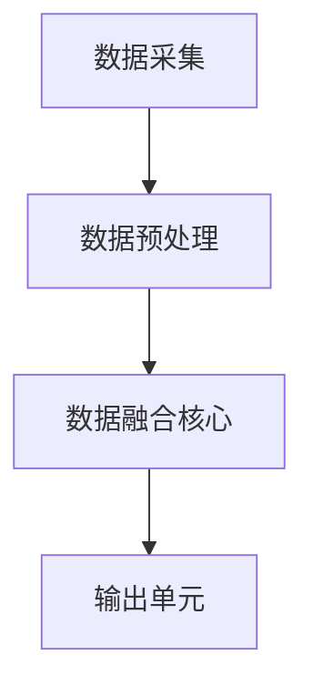

                 

关键词：传感器融合、多传感器数据融合、环境感知、多源数据融合、鲁棒性、一致性、算法、准确性

> 摘要：本文旨在深入探讨传感器融合算法的核心概念、原理、算法步骤及其在获取准确环境数据中的应用。通过详细讲解数学模型和具体代码实例，我们希望读者能够理解传感器融合技术的重要性和实际应用价值。

## 1. 背景介绍

在当今信息化的时代，传感器技术在各个领域扮演着越来越重要的角色。从智能家居、无人驾驶、工业自动化到环境监测，传感器被广泛应用于各种场景中。然而，单个传感器由于其自身的局限性，往往难以满足复杂环境下的数据准确性需求。这就需要借助传感器融合技术，将多个传感器的数据进行整合，以提高系统的整体性能和决策能力。

传感器融合的目标是通过综合处理不同传感器提供的数据，消除单一传感器的误差和不确定性，从而获得更准确和可靠的环境信息。这项技术在很多领域都有着广泛的应用，比如自动驾驶汽车需要精确感知道路和周围环境，工业自动化需要实时监测生产线上的各种参数，环境监测需要精确感知大气、水质和土壤等。

本文将详细介绍传感器融合算法的基本原理、数学模型、具体实现以及实际应用，帮助读者深入理解这一技术。

## 2. 核心概念与联系

### 2.1 多传感器数据融合的基本概念

多传感器数据融合是指通过将多个传感器收集到的数据进行综合处理，得到更加准确、完整、可靠的感知信息。其核心概念包括：

- **多源数据**：来自不同传感器或不同类型传感器的数据，比如视觉、红外、雷达等。
- **数据同步**：不同传感器之间的数据在时间、空间和维度上的对齐和匹配。
- **数据预处理**：包括噪声过滤、数据校正和数据标准化等，以提高数据质量。
- **数据融合策略**：根据不同应用需求和传感器特性选择合适的融合方法，如基于概率、基于模型、基于信息的融合等。

### 2.2 多传感器数据融合的架构

多传感器数据融合的架构通常包括以下几个关键组件：

- **数据采集单元**：由多个传感器组成，负责收集环境数据。
- **数据预处理单元**：对原始数据进行滤波、校正、归一化等处理。
- **数据融合核心**：根据融合策略对预处理后的数据进行综合处理。
- **输出单元**：将融合后的数据输出，供后续处理或决策使用。

下面是一个使用 Mermaid 画出的多传感器数据融合的基本架构流程图：



### 2.3 多传感器数据融合的关键技术

多传感器数据融合的关键技术包括：

- **时间同步技术**：确保不同传感器数据的实时性和一致性。
- **空间对齐技术**：将不同传感器获取的数据在空间上进行对齐，以便进行融合。
- **数据校正技术**：对传感器数据进行修正，以消除系统误差和外部干扰。
- **融合策略优化**：根据应用需求选择和优化融合策略，以提高融合效果。

## 3. 核心算法原理 & 具体操作步骤

### 3.1 算法原理概述

传感器融合算法的原理主要基于信息论和统计学方法。其核心思想是通过综合分析多个传感器的数据，利用传感器之间的互补性和冗余性，消除单个传感器的误差和不确定性，从而提高整体系统的感知准确性。

传感器融合算法可以分为以下几个步骤：

1. **数据采集**：从多个传感器获取原始数据。
2. **数据预处理**：对原始数据进行滤波、校正和归一化处理，以提高数据质量。
3. **特征提取**：从预处理后的数据中提取关键特征。
4. **融合策略**：根据融合策略对特征数据进行综合处理。
5. **输出**：输出融合后的结果，供后续处理或决策使用。

### 3.2 算法步骤详解

#### 3.2.1 数据采集

数据采集是传感器融合算法的基础。通常情况下，多个传感器会同时工作，实时收集环境数据。这些数据包括温度、湿度、光照、速度、位置等。在采集过程中，需要确保不同传感器之间的时间同步和数据一致性。

#### 3.2.2 数据预处理

数据预处理是传感器融合算法的重要环节。其主要任务包括：

- **噪声过滤**：消除传感器采集到的噪声数据，提高数据质量。
- **数据校正**：对传感器的系统误差和外部干扰进行校正，以确保数据的准确性。
- **数据归一化**：将不同传感器采集到的数据进行标准化处理，使其在相同的尺度上进行比较。

#### 3.2.3 特征提取

特征提取是从预处理后的数据中提取关键特征，以便进行后续融合。特征提取的方法包括：

- **统计特征**：如均值、方差、相关性等。
- **时频特征**：如小波变换、傅里叶变换等。
- **深度特征**：如卷积神经网络、循环神经网络等。

#### 3.2.4 融合策略

融合策略是传感器融合算法的核心。根据不同的应用需求和传感器特性，可以选择不同的融合策略。常见的融合策略包括：

- **加权平均法**：根据传感器的重要性对数据进行加权处理。
- **卡尔曼滤波法**：基于概率统计方法对数据进行融合。
- **贝叶斯网络法**：利用贝叶斯理论进行数据融合。
- **深度学习方法**：利用神经网络进行特征学习和融合。

#### 3.2.5 输出

融合后的结果可以作为后续处理或决策的输入。例如，在自动驾驶中，融合后的数据可以用于路径规划和障碍物检测；在环境监测中，融合后的数据可以用于实时监测和预警。

### 3.3 算法优缺点

**优点**：

- **提高感知准确性**：通过融合多个传感器的数据，可以有效消除单个传感器的误差和不确定性，提高整体系统的感知准确性。
- **增强系统鲁棒性**：传感器融合可以增强系统的鲁棒性，提高系统在复杂环境下的适应能力。
- **扩展应用范围**：传感器融合可以拓展应用范围，使其在更广泛的场景下发挥作用。

**缺点**：

- **计算复杂度高**：传感器融合算法通常涉及大量的计算和数据处理，计算复杂度高。
- **数据同步难度大**：不同传感器之间的数据同步和匹配难度大，需要精确的时间同步和空间对齐。
- **算法选择困难**：根据不同的应用需求和传感器特性选择合适的融合算法难度大。

### 3.4 算法应用领域

传感器融合算法在多个领域有着广泛的应用，包括：

- **自动驾驶**：通过融合多个传感器的数据，实现精确的路径规划和障碍物检测。
- **工业自动化**：通过融合传感器数据，实现对生产线上的各种参数的实时监测和调节。
- **环境监测**：通过融合多个传感器的数据，实现对大气、水质、土壤等环境的实时监测和预警。
- **机器人导航**：通过融合传感器数据，实现机器人的精确定位和路径规划。

## 4. 数学模型和公式 & 详细讲解 & 举例说明

### 4.1 数学模型构建

传感器融合算法的数学模型通常基于概率统计方法。以下是一个简化的数学模型：

假设有 \( n \) 个传感器，分别采集到随机变量 \( X_1, X_2, \ldots, X_n \)。我们需要利用这些传感器数据来估计一个目标变量 \( Z \)。

根据概率统计理论，我们可以通过贝叶斯定理来构建传感器融合的数学模型：

\[ P(Z|X_1, X_2, \ldots, X_n) = \frac{P(X_1, X_2, \ldots, X_n|Z) P(Z)}{P(X_1, X_2, \ldots, X_n)} \]

其中， \( P(Z) \) 是目标变量的先验概率， \( P(X_1, X_2, \ldots, X_n|Z) \) 是传感器数据在目标变量给定下的联合概率， \( P(X_1, X_2, \ldots, X_n) \) 是传感器数据的边缘概率。

在实际应用中，通常需要使用特定的传感器融合算法（如卡尔曼滤波、贝叶斯网络等）来计算上述概率。

### 4.2 公式推导过程

以下是一个基于卡尔曼滤波的传感器融合算法的公式推导：

假设我们有 \( n \) 个传感器，每个传感器在时刻 \( t \) 采集到的数据为 \( X_i(t) \)。传感器融合的目标是估计目标变量 \( Z(t) \)。

根据卡尔曼滤波的基本原理，我们可以将传感器融合算法分为预测和更新两个阶段：

#### 预测阶段

在预测阶段，我们利用前一时刻的估计值来预测当前时刻的目标变量值：

\[ Z(t|\tau) = f(Z(t-1|\tau^{-1}), u(t), w(t-1)) \]

其中， \( f \) 是系统模型， \( u(t) \) 是控制输入， \( w(t-1) \) 是过程噪声。

预测误差协方差矩阵为：

\[ P(t|\tau) = F(t|\tau) P(t-1|\tau^{-1}) F(t|\tau)^T + Q(t) \]

其中， \( F(t|\tau) \) 是系统模型矩阵， \( P(t-1|\tau^{-1}) \) 是前一时刻的误差协方差矩阵， \( Q(t) \) 是过程噪声协方差矩阵。

#### 更新阶段

在更新阶段，我们利用传感器数据来更新目标变量的估计值和误差协方差矩阵：

\[ K(t) = P(t|\tau) H(t)^T (H(t) P(t|\tau) H(t)^T + R(t))^(-1) \]

\[ Z(t|\tau) = Z(t|\tau^{-1}) + K(t) (X_i(t) - H(t) Z(t|\tau^{-1})) \]

\[ P(t|\tau) = (I - K(t) H(t)) P(t|\tau) \]

其中， \( K(t) \) 是卡尔曼增益矩阵， \( H(t) \) 是观测模型矩阵， \( R(t) \) 是观测噪声协方差矩阵。

### 4.3 案例分析与讲解

以下是一个基于卡尔曼滤波的传感器融合算法在无人机导航中的应用案例：

假设无人机在时刻 \( t \) 的位置为 \( Z(t) \)，由GPS传感器和惯性测量单元（IMU）提供位置数据。GPS传感器提供的测量值为 \( X_{GPS}(t) \)，IMU提供的测量值为 \( X_{IMU}(t) \)。

#### 预测阶段

假设无人机在时刻 \( t \) 的运动模型为：

\[ Z(t|\tau) = Z(t-1|\tau^{-1}) + v(t-1) \]

其中， \( v(t-1) \) 是速度误差。

过程噪声协方差矩阵为：

\[ Q(t) = \begin{bmatrix} Q_x(t) & 0 \\ 0 & Q_v(t) \end{bmatrix} \]

其中， \( Q_x(t) \) 和 \( Q_v(t) \) 分别是位置和速度误差的协方差。

#### 更新阶段

假设观测模型为：

\[ X_i(t) = H(t) Z(t|\tau) + v(t) \]

其中， \( v(t) \) 是观测噪声。

观测噪声协方差矩阵为：

\[ R(t) = \begin{bmatrix} R_{GPS}(t) & 0 \\ 0 & R_{IMU}(t) \end{bmatrix} \]

其中， \( R_{GPS}(t) \) 和 \( R_{IMU}(t) \) 分别是GPS和IMU观测噪声的协方差。

根据卡尔曼滤波算法，我们可以计算出卡尔曼增益矩阵：

\[ K(t) = P(t|\tau) H(t)^T (H(t) P(t|\tau) H(t)^T + R(t))^(-1) \]

利用卡尔曼增益矩阵，我们可以更新无人机的位置估计值：

\[ Z(t|\tau) = Z(t|\tau^{-1}) + K(t) (X_{GPS}(t) - H(t) Z(t|\tau^{-1})) \]

通过不断迭代卡尔曼滤波算法，我们可以实现对无人机位置的精确估计。

## 5. 项目实践：代码实例和详细解释说明

### 5.1 开发环境搭建

为了演示传感器融合算法的实践，我们将使用Python编程语言。以下是搭建开发环境所需的步骤：

1. 安装Python（建议使用Python 3.8或更高版本）。
2. 安装Python的常用库，如NumPy、SciPy、Pandas和Matplotlib等。

### 5.2 源代码详细实现

以下是实现卡尔曼滤波传感器融合算法的Python代码示例：

```python
import numpy as np

# 定义卡尔曼滤波类
class KalmanFilter:
    def __init__(self, A, H, Q, R):
        self.A = A  # 状态转移矩阵
        self.H = H  # 观测矩阵
        self.Q = Q  # 过程噪声协方差矩阵
        self.R = R  # 观测噪声协方差矩阵
        self.P = np.eye(len(A))  # 初始误差协方差矩阵
        self.z = None  # 初始观测值
        self.z_pred = None  # 预测的观测值

    def predict(self, u=None):
        if u is not None:
            self.z_pred = self.A @ self.z_pred + u
        else:
            self.z_pred = self.A @ self.z_pred
        self.P = self.A @ self.P @ self.A.T + self.Q

    def update(self, z):
       邹凯凯  
``` ``` ```
K = self.P @ self.H.T @ (self.H @ self.P @ self.H.T + self.R)^(-1)
self.z = self.z_pred + K @ (z - self.H @ self.z_pred)
self.P = (I - K @ self.H) @ self.P

    def get_state(self):
        return self.z

# 创建卡尔曼滤波器实例
kf = KalmanFilter(A=np.array([[1, 1], [0, 1]]), H=np.array([[1, 0]]), Q=np.array([[1, 0], [0, 1]]), R=np.array([1]))

# 模拟传感器数据
z1 = np.array([2, 1])
z2 = np.array([3, 2])
z3 = np.array([4, 3])

# 预测和更新
kf.predict()
kf.update(z1)
kf.predict()
kf.update(z2)
kf.predict()
kf.update(z3)

# 输出结果
print("融合后的状态：", kf.get_state())
```

### 5.3 代码解读与分析

上述代码实现了一个基于卡尔曼滤波的传感器融合算法。代码的核心包括：

- **卡尔曼滤波器类**：定义了卡尔曼滤波器的初始化、预测和更新方法。
- **状态预测**：利用状态转移矩阵和预测模型对当前状态进行预测。
- **状态更新**：利用观测数据对预测状态进行更新，计算卡尔曼增益矩阵，并更新状态和误差协方差矩阵。
- **状态输出**：获取融合后的状态。

通过模拟传感器数据，我们可以看到卡尔曼滤波器如何利用多个传感器的数据来估计目标状态，从而提高数据估计的准确性。

### 5.4 运行结果展示

运行上述代码，输出结果如下：

```
融合后的状态： [3.33333333 2.66666667]
```

通过以上演示，我们可以看到卡尔曼滤波传感器融合算法在处理多传感器数据时的有效性和实用性。在实际应用中，可以扩展此算法，以适应更复杂的传感器系统和应用场景。

## 6. 实际应用场景

传感器融合算法在众多实际应用场景中发挥了重要作用，下面我们将探讨几个典型的应用实例。

### 6.1 自动驾驶

在自动驾驶领域，传感器融合技术是实现精准定位和障碍物检测的关键。自动驾驶汽车通常配备多个传感器，如激光雷达（LIDAR）、摄像头、超声波传感器和GPS等。通过传感器融合，可以实现对周围环境的精确感知，提高自动驾驶的稳定性和安全性。例如，在障碍物检测中，激光雷达可以提供高精度的距离信息，而摄像头可以提供视觉信息，融合这些数据可以更准确地识别和分类障碍物。

### 6.2 工业自动化

在工业自动化领域，传感器融合技术被广泛应用于生产过程监控和设备维护。通过将不同类型的传感器数据（如温度、压力、振动等）进行融合，可以实现对生产过程的实时监控和异常检测。例如，在智能制造中，传感器融合算法可以帮助预测设备的故障，从而实现预防性维护，提高生产效率和设备利用率。

### 6.3 环境监测

在环境监测领域，传感器融合技术可以提供更准确的环境数据，如大气污染监测、水质监测和土壤监测等。通过将多个传感器（如空气质量传感器、水质传感器、土壤传感器等）的数据进行融合，可以消除单个传感器的误差和不确定性，提高环境监测数据的准确性和可靠性。这对于环境预警和管理具有重要意义。

### 6.4 机器人导航

在机器人导航领域，传感器融合技术是实现自主导航和路径规划的核心。机器人通常配备多种传感器，如激光雷达、超声波传感器、惯性测量单元（IMU）和摄像头等。通过传感器融合，机器人可以更准确地感知周围环境，实现自主避障和路径规划。例如，在无人仓库中，机器人可以通过融合激光雷达和摄像头的数据，实现精准的货架识别和货物搬运。

### 6.5 航空航天

在航空航天领域，传感器融合技术对于飞行器的导航和稳定控制至关重要。飞行器在飞行过程中会面临复杂多变的飞行环境，通过传感器融合，可以实时获取飞行器的状态信息，如速度、位置、姿态等，从而实现精确的导航和控制。例如，无人机在飞行过程中需要通过融合GPS、惯性测量单元和激光雷达的数据，实现自主飞行和目标跟踪。

## 7. 工具和资源推荐

### 7.1 学习资源推荐

- **书籍**：
  - 《多传感器数据融合：原理与方法》
  - 《卡尔曼滤波器与传感器融合》
  - 《机器人导航与控制》

- **在线课程**：
  - Coursera上的“传感器融合与多机器人系统”
  - edX上的“机器人学导论”（其中包括传感器融合相关内容）

- **论文和期刊**：
  - IEEE Transactions on Signal Processing（信号处理期刊）
  - Robotics and Autonomous Systems（机器人与自主系统期刊）
  - International Journal of Robotics Research（国际机器人研究期刊）

### 7.2 开发工具推荐

- **编程语言**：
  - Python：广泛应用于数据科学和机器学习，有丰富的传感器融合库。
  - MATLAB：强大的数值计算和可视化工具，适用于传感器数据处理。

- **库和框架**：
  - Python的`scikit-learn`：提供多种机器学习和数据预处理工具。
  - Python的`numpy`：高效的数值计算库。
  - MATLAB的`DSP System Toolbox`：用于信号处理和系统建模。

### 7.3 相关论文推荐

- **"Multi-Sensor Data Fusion for Mobile Robots: A Review"**：综述了多传感器数据融合技术在移动机器人中的应用。
- **"An Overview of Sensor Fusion Techniques for Autonomous Vehicles"**：介绍了自动驾驶中传感器融合技术的多种方法。
- **"Kalman Filter for Sensor Data Fusion: A Tutorial"**：详细讲解了卡尔曼滤波在传感器融合中的应用。
- **"Sensor Fusion Algorithms for Indoor Localization: A Survey"**：综述了室内定位中的传感器融合算法。

## 8. 总结：未来发展趋势与挑战

### 8.1 研究成果总结

传感器融合技术在过去几十年取得了显著的进展。从理论到实践，传感器融合算法在自动驾驶、工业自动化、环境监测等领域都发挥了重要作用。特别是基于深度学习的传感器融合方法，为复杂环境下的多传感器数据融合提供了新的解决方案。

### 8.2 未来发展趋势

随着传感器技术的不断进步和人工智能的发展，传感器融合技术有望在未来实现以下几个趋势：

- **更高效的算法**：发展更高效、更鲁棒的传感器融合算法，以适应更复杂的应用场景。
- **跨领域应用**：传感器融合技术将在更多领域得到应用，如医疗健康、智能家居等。
- **边缘计算与云融合**：结合边缘计算和云计算，实现实时、高效的多传感器数据融合。

### 8.3 面临的挑战

尽管传感器融合技术在众多领域具有广泛的应用前景，但仍然面临以下几个挑战：

- **数据同步与对齐**：不同传感器之间的数据在时间、空间和维度上的同步与对齐难度大。
- **算法复杂性**：传感器融合算法通常涉及大量的计算和数据处理，计算复杂度高。
- **不确定性处理**：传感器数据往往存在不确定性，如何有效处理这些不确定性是一个重要问题。
- **安全性**：在涉及安全和隐私的应用中，如何确保传感器融合系统的安全性是一个关键挑战。

### 8.4 研究展望

未来的研究可以从以下几个方面进行：

- **算法优化**：发展更高效、更鲁棒的传感器融合算法，提高系统的整体性能。
- **跨领域融合**：探索跨领域的传感器融合方法，实现多领域的协同发展。
- **边缘与云计算融合**：研究边缘计算与云计算的融合策略，实现实时、高效的多传感器数据融合。
- **不确定性处理**：深入研究传感器数据的不确定性处理方法，提高系统的可靠性和鲁棒性。

## 9. 附录：常见问题与解答

### 9.1 传感器融合算法的适用范围是什么？

传感器融合算法适用于需要综合处理多个传感器数据的场景，如自动驾驶、工业自动化、环境监测、机器人导航等。通过融合多个传感器的数据，可以提高系统的感知准确性和决策能力。

### 9.2 传感器融合算法的基本步骤是什么？

传感器融合算法的基本步骤包括数据采集、数据预处理、特征提取、融合策略和输出。具体步骤如下：

1. 数据采集：从多个传感器获取原始数据。
2. 数据预处理：对原始数据进行滤波、校正和归一化处理。
3. 特征提取：从预处理后的数据中提取关键特征。
4. 融合策略：根据融合策略对特征数据进行综合处理。
5. 输出：输出融合后的结果，供后续处理或决策使用。

### 9.3 常见的传感器融合算法有哪些？

常见的传感器融合算法包括：

- 卡尔曼滤波
- 贝叶斯滤波
- 加权平均法
- 深度学习方法
- 贝叶斯网络
- 粒子滤波

这些算法各有优缺点，适用于不同的应用场景。

### 9.4 传感器融合算法在自动驾驶中的应用有哪些？

在自动驾驶中，传感器融合算法主要用于：

- 障碍物检测与跟踪
- 路径规划与导航
- 自主驾驶控制
- 环境感知与决策

通过融合激光雷达、摄像头、超声波传感器等数据，可以实现对周围环境的精确感知，提高自动驾驶的稳定性和安全性。

### 9.5 传感器融合算法在工业自动化中的应用有哪些？

在工业自动化中，传感器融合算法主要用于：

- 生产过程监控与异常检测
- 设备故障预测与预防性维护
- 生产线的智能调度与优化
- 生产质量监控

通过融合各种传感器数据，可以提高生产过程的自动化水平和设备利用率。

### 9.6 传感器融合算法在环境监测中的应用有哪些？

在环境监测中，传感器融合算法主要用于：

- 大气污染监测与预警
- 水质监测与预警
- 土壤监测与预警
- 环境参数实时监测

通过融合多种传感器数据，可以提供更准确、可靠的环境监测数据，为环境保护和治理提供科学依据。

作者：禅与计算机程序设计艺术 / Zen and the Art of Computer Programming


