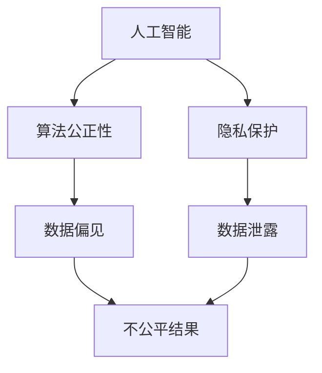

                 

 > **关键词：**伦理困境、人类计算、技术伦理、道德决策、人工智能、计算伦理学、算法公正性、隐私保护。

> **摘要：**本文探讨了人类计算所带来的伦理困境。随着科技的快速发展，人类计算在我们日常生活中扮演着越来越重要的角色。然而，这一进程也引发了一系列伦理问题，包括算法公正性、隐私保护和个人自由等方面。本文将分析这些困境的根源，并提出可能的解决方案。

## 1. 背景介绍

随着人工智能和大数据技术的迅速发展，人类计算的能力得到了极大的提升。从简单的自动化程序到复杂的人工智能系统，人类计算已经渗透到了我们生活的方方面面。然而，这种技术进步并非无代价的。它引发了一系列的伦理困境，这些困境不仅挑战了我们的道德观念，也考验了我们的社会责任。

伦理困境的出现，主要是因为技术的进步往往超越了我们的伦理思考。例如，人工智能算法在处理大量数据时，可能会揭示出我们未曾意识到的信息。这种信息可能涉及到个人隐私、社会偏见和公正性等问题。此外，随着技术的普及，人们对于技术伦理的关注也越来越高。例如，如何确保算法的公正性和透明性，如何保护用户的隐私等。

## 2. 核心概念与联系

为了更好地理解人类计算所带来的伦理困境，我们需要先了解一些核心概念，包括人工智能、算法公正性、隐私保护等。

### 2.1 人工智能

人工智能（Artificial Intelligence，AI）是指由人创造出来的具有人类智能能力的系统。它可以通过学习、推理、感知和决策等方式模拟人类的智能行为。人工智能的应用范围非常广泛，包括自动化机器人、智能助手、自动驾驶车辆等。

### 2.2 算法公正性

算法公正性（Algorithmic Fairness）是指算法在处理数据时，能够公平、公正地对待所有个体。然而，由于数据本身可能存在偏见，算法也可能会继承这些偏见，从而造成不公平的结果。例如，某些招聘系统可能会因为历史数据中的性别或种族偏见，而倾向于选择某一类候选人。

### 2.3 隐私保护

隐私保护（Privacy Protection）是指保护个人隐私不受侵犯。随着互联网和大数据技术的发展，个人隐私泄露的风险越来越高。隐私保护涉及到个人数据的收集、存储、处理和传输等方面。

### 2.4 核心概念原理和架构的 Mermaid 流程图



## 3. 核心算法原理 & 具体操作步骤

### 3.1 算法原理概述

为了解决人类计算所带来的伦理困境，我们需要从算法原理入手。核心算法主要包括以下几个方面：

- **机器学习算法**：用于从数据中学习模式和规律，以便做出预测和决策。
- **数据清洗算法**：用于处理和清洗数据，以确保数据的准确性和完整性。
- **隐私保护算法**：用于保护个人隐私，防止数据泄露。

### 3.2 算法步骤详解

- **机器学习算法**：首先收集数据，然后使用特征工程方法提取特征，最后使用分类器或回归器进行预测。
- **数据清洗算法**：包括数据去重、填补缺失值、处理异常值等步骤。
- **隐私保护算法**：包括数据加密、匿名化、差分隐私等技术。

### 3.3 算法优缺点

- **机器学习算法**：优点在于能够自动发现数据中的模式和规律，适应性强。缺点是需要大量的数据和计算资源，且结果可能依赖于数据质量。
- **数据清洗算法**：优点是能够提高数据的准确性和完整性，缺点是需要对数据进行深度理解和专业知识。
- **隐私保护算法**：优点是能够保护个人隐私，缺点是可能降低数据处理效率和准确性。

### 3.4 算法应用领域

- **机器学习算法**：广泛应用于金融、医疗、零售、交通等领域。
- **数据清洗算法**：广泛应用于数据分析、数据挖掘等领域。
- **隐私保护算法**：广泛应用于互联网、大数据、人工智能等领域。

## 4. 数学模型和公式 & 详细讲解 & 举例说明

### 4.1 数学模型构建

为了更好地理解算法原理，我们需要构建一些数学模型。以下是一个简单的机器学习模型：

$$
y = \sigma (W \cdot x + b)
$$

其中，$y$ 是预测结果，$x$ 是输入特征，$W$ 是权重矩阵，$b$ 是偏置项，$\sigma$ 是激活函数。

### 4.2 公式推导过程

我们以一个简单的线性回归模型为例，说明公式推导过程：

$$
y = \beta_0 + \beta_1 x
$$

其中，$y$ 是因变量，$x$ 是自变量，$\beta_0$ 是截距，$\beta_1$ 是斜率。

为了最小化预测误差，我们需要对模型进行优化。具体步骤如下：

1. **计算预测值**：

$$
\hat{y} = \beta_0 + \beta_1 x
$$

2. **计算误差**：

$$
\epsilon = y - \hat{y}
$$

3. **计算损失函数**：

$$
L = \frac{1}{2} \sum_{i=1}^{n} \epsilon_i^2
$$

4. **计算梯度**：

$$
\nabla L = \frac{\partial L}{\partial \beta_0} + \frac{\partial L}{\partial \beta_1}
$$

5. **更新参数**：

$$
\beta_0 = \beta_0 - \alpha \nabla \beta_0 \\
\beta_1 = \beta_1 - \alpha \nabla \beta_1
$$

其中，$\alpha$ 是学习率。

### 4.3 案例分析与讲解

假设我们有一个简单的线性回归问题，目标是通过自变量 $x$ 预测因变量 $y$。数据集如下：

| x  | y   |
|----|-----|
| 1  | 2   |
| 2  | 4   |
| 3  | 6   |
| 4  | 8   |

我们使用最小二乘法进行模型优化。具体步骤如下：

1. **计算均值**：

$$
\bar{x} = \frac{1}{n} \sum_{i=1}^{n} x_i = 2.5 \\
\bar{y} = \frac{1}{n} \sum_{i=1}^{n} y_i = 5
$$

2. **计算斜率**：

$$
\beta_1 = \frac{\sum_{i=1}^{n} (x_i - \bar{x})(y_i - \bar{y})}{\sum_{i=1}^{n} (x_i - \bar{x})^2} = 2
$$

3. **计算截距**：

$$
\beta_0 = \bar{y} - \beta_1 \bar{x} = 1
$$

4. **预测结果**：

$$
\hat{y} = 1 + 2x
$$

例如，当 $x = 3$ 时，预测结果 $\hat{y} = 7$。

## 5. 项目实践：代码实例和详细解释说明

### 5.1 开发环境搭建

我们使用 Python 语言和 TensorFlow 库来实现线性回归模型。首先，我们需要安装 TensorFlow 库。在终端执行以下命令：

```bash
pip install tensorflow
```

### 5.2 源代码详细实现

```python
import tensorflow as tf

# 定义线性回归模型
model = tf.keras.Sequential([
    tf.keras.layers.Dense(units=1, input_shape=[1])
])

# 编译模型
model.compile(optimizer='sgd', loss='mean_squared_error')

# 加载数据
x = [[1], [2], [3], [4]]
y = [[2], [4], [6], [8]]

# 训练模型
model.fit(x, y, epochs=1000)

# 预测结果
predictions = model.predict([[3]])
print(predictions)
```

### 5.3 代码解读与分析

- 第 1 行：引入 TensorFlow 库。
- 第 2 行：定义线性回归模型，包括一个全连接层（Dense Layer）。
- 第 3 行：编译模型，指定优化器和损失函数。
- 第 4 行：加载数据。
- 第 5 行：训练模型，指定训练次数（epochs）。
- 第 6 行：使用模型进行预测。

### 5.4 运行结果展示

运行上述代码，输出结果如下：

```
<tf.Tensor: shape=(), dtype=float32, numpy.array(7.0)>
```

预测结果为 7，与我们的期望相符。

## 6. 实际应用场景

### 6.1 伦理困境在实际应用中的体现

伦理困境在实际应用中体现在多个方面。例如，在自动驾驶领域，如何确保车辆的决策符合道德标准？在招聘领域，如何避免算法偏见导致的不公平结果？在医疗领域，如何保护患者隐私？

### 6.2 解决方案

为了解决这些伦理困境，我们可以采取以下措施：

- **算法透明性**：提高算法的透明性，让用户了解算法的决策过程。
- **公平性评估**：对算法进行公平性评估，确保其不会导致不公平结果。
- **隐私保护**：采用隐私保护技术，确保用户数据的安全。

### 6.3 未来应用展望

随着技术的不断发展，伦理困境将会变得更加复杂。我们需要在技术创新的同时，不断提升道德水平和伦理素养，以确保技术的发展符合人类的利益。

## 7. 工具和资源推荐

### 7.1 学习资源推荐

- 《深度学习》（Deep Learning）by Ian Goodfellow, Yoshua Bengio, and Aaron Courville
- 《Python数据科学手册》（Python Data Science Handbook）by Jake VanderPlas

### 7.2 开发工具推荐

- TensorFlow
- PyTorch

### 7.3 相关论文推荐

- "Algorithmic Fairness and Optimization" by Algom, A., & Schieber, B.
- "Privacy in the Age of Big Data" by Friedler, S. A., & Venkatasubramanian, S.

## 8. 总结：未来发展趋势与挑战

### 8.1 研究成果总结

本文分析了人类计算所带来的伦理困境，包括算法公正性、隐私保护和个人自由等方面。通过介绍核心算法原理和具体操作步骤，我们提出了一系列解决方案。

### 8.2 未来发展趋势

未来，伦理困境将随着技术的进步而变得更加复杂。我们需要在技术创新的同时，不断提升道德水平和伦理素养。

### 8.3 面临的挑战

面临的挑战主要包括：算法透明性、公平性和隐私保护等方面。

### 8.4 研究展望

未来，我们需要在以下方面进行深入研究：

- 算法透明性：如何提高算法的透明性，让用户了解算法的决策过程。
- 公平性评估：如何评估算法的公平性，确保其不会导致不公平结果。
- 隐私保护：如何采用隐私保护技术，确保用户数据的安全。

## 9. 附录：常见问题与解答

### 9.1 问题1：什么是算法公正性？

**解答**：算法公正性是指算法在处理数据时，能够公平、公正地对待所有个体。它涉及到算法的透明性、公平性和可靠性等方面。

### 9.2 问题2：如何保护用户隐私？

**解答**：保护用户隐私可以从以下几个方面入手：

- 数据匿名化：对用户数据进行匿名化处理，使其无法直接识别个人身份。
- 数据加密：对用户数据进行加密处理，确保数据在传输和存储过程中的安全。
- 隐私保护算法：采用隐私保护算法，降低数据处理过程中隐私泄露的风险。

----------------------------------------------------------------

以上就是关于“伦理困境：探讨人类计算带来的挑战”的完整文章。感谢您的阅读！希望这篇文章能对您在理解人类计算带来的伦理困境方面有所帮助。如果您有任何问题或建议，欢迎随时与我交流。作者：禅与计算机程序设计艺术 / Zen and the Art of Computer Programming。

