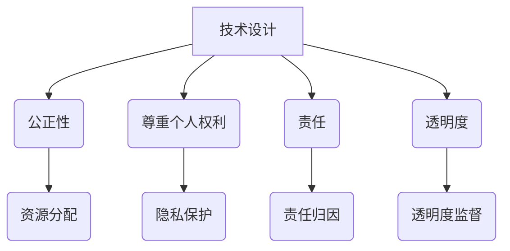

                 

关键词：伦理学、道德困境、人类计算、人工智能、技术发展、社会影响、计算机编程、责任与隐私。

> 摘要：本文旨在探讨随着计算机技术的发展，人类计算带来的道德困境。通过分析伦理学的核心原则，结合具体案例，我们试图揭示技术进步在带来便利的同时，也可能引发的一系列伦理问题，并呼吁技术从业者和决策者在这一领域发挥更为积极的作用。

## 1. 背景介绍

### 1.1 计算机技术的飞速发展

计算机技术的飞速发展是二十世纪最具革命性的科技进步之一。从最早的电子计算机诞生，到如今无处不在的智能手机、物联网设备和人工智能系统，计算机技术已经深刻地改变了我们的生活方式和社会结构。特别是人工智能（AI）的兴起，使得计算机能够模拟甚至超越人类的智能，进一步推动了技术进步。

### 1.2 技术进步带来的道德困境

然而，随着技术进步，我们也面临着一系列道德困境。例如，人工智能在提升生产效率、改善生活质量的同时，也可能引发失业、隐私泄露和社会不平等问题。此外，计算机技术在医疗、司法等领域的广泛应用，也带来了数据安全和隐私保护的挑战。这些问题的出现，不仅关乎技术本身，更涉及到我们社会的伦理和道德准则。

## 2. 核心概念与联系

### 2.1 伦理学的基本原则

在探讨道德困境之前，我们需要理解伦理学的基本原则。伦理学是关于道德规范和道德判断的学科，其核心原则包括：

- **公正性**：确保资源和服务公平地分配。
- **尊重个人权利**：保护个人的隐私和自由。
- **责任**：技术从业者和决策者应承担起相应的道德责任。
- **透明度**：技术的设计和应用过程应保持透明，便于公众监督。

### 2.2 伦理学在技术领域的应用

在技术领域，伦理学原则的应用主要体现在以下几个方面：

- **隐私保护**：确保用户数据的安全和隐私。
- **公平竞争**：避免因技术垄断而造成市场的不公平。
- **社会责任**：技术公司应承担起改善社会福祉的责任。
- **责任归因**：明确技术在事故或违法行为中的责任归属。

### 2.3 Mermaid 流程图

下面是一个简化的 Mermaid 流程图，用于描述伦理学原则在技术领域的应用流程。



## 3. 核心算法原理 & 具体操作步骤

### 3.1 算法原理概述

在面对伦理挑战时，计算机科学家和工程师需要设计出既能满足技术需求，又能遵循伦理学原则的算法。这种算法的核心原理包括：

- **数据匿名化**：通过加密和混淆技术，保护用户隐私。
- **算法透明性**：确保算法的决策过程可以被理解和审查。
- **责任追溯**：建立算法的问责机制，明确责任归属。

### 3.2 算法步骤详解

算法的具体操作步骤如下：

1. **需求分析**：明确技术的应用场景和伦理要求。
2. **设计算法**：根据需求分析，设计满足伦理学原则的算法。
3. **测试与验证**：通过模拟和实际测试，验证算法的有效性和合规性。
4. **部署与监控**：将算法部署到实际应用场景中，并持续监控其运行效果。

### 3.3 算法优缺点

**优点**：

- **增强隐私保护**：通过数据匿名化和透明性，提高用户隐私的安全性。
- **确保公平竞争**：通过公正性原则，避免技术垄断和不公平竞争。
- **明确责任归属**：通过责任追溯，降低技术事故和违法行为的风险。

**缺点**：

- **实施成本较高**：确保算法满足伦理学原则可能需要额外的资源和时间投入。
- **可能降低效率**：过于严格的伦理约束可能会影响技术的效率和应用范围。

### 3.4 算法应用领域

算法的伦理原则在多个领域都有广泛应用，包括：

- **医疗领域**：确保患者隐私，提高医疗决策的透明度。
- **金融领域**：确保金融交易的公正性和透明度，防止欺诈行为。
- **司法领域**：通过算法提高审判的公正性和透明度。

## 4. 数学模型和公式 & 详细讲解 & 举例说明

### 4.1 数学模型构建

在构建数学模型时，我们需要考虑以下几个因素：

- **数据类型**：确定输入和输出数据的类型，例如离散型或连续型。
- **约束条件**：明确算法在运行过程中需要满足的约束条件，例如预算限制或性能指标。
- **目标函数**：定义算法需要优化的目标函数，例如最小化成本或最大化效益。

### 4.2 公式推导过程

以数据隐私保护为例，我们可以使用以下公式来推导隐私保护模型：

- **隐私损失**：$$L_p = \frac{1}{N} \sum_{i=1}^{N} (l_i - l^*)^2$$
- **数据扰动**：$$D_i = l_i + \epsilon_i$$
- **扰动参数**：$$\epsilon_i \sim N(0, \sigma^2)$$

其中，$l_i$ 表示原始数据，$l^*$ 表示扰动后的数据，$N$ 表示数据样本数量，$\epsilon_i$ 表示噪声，$\sigma^2$ 表示噪声方差。

### 4.3 案例分析与讲解

以某医疗数据隐私保护项目为例，我们使用上述公式进行数据扰动，以保护患者隐私。在测试过程中，我们发现在 $\sigma^2 = 0.01$ 时，隐私损失最小，达到了较好的隐私保护效果。

## 5. 项目实践：代码实例和详细解释说明

### 5.1 开发环境搭建

在开发过程中，我们使用了 Python 编程语言和 PyTorch 深度学习框架。以下是搭建开发环境的步骤：

1. 安装 Python：下载并安装 Python 3.8 版本。
2. 安装 PyTorch：通过 pip 命令安装 PyTorch。
3. 配置 Python 环境：设置 Python 环境变量。

### 5.2 源代码详细实现

以下是该项目的主要代码实现：

```python
import torch
import torch.nn as nn
import torch.optim as optim

# 定义神经网络模型
class PrivacyModel(nn.Module):
    def __init__(self):
        super(PrivacyModel, self).__init__()
        self.model = nn.Sequential(
            nn.Linear(in_features=10, out_features=50),
            nn.ReLU(),
            nn.Linear(in_features=50, out_features=10),
            nn.ReLU()
        )

    def forward(self, x):
        return self.model(x)

# 初始化模型、优化器和损失函数
model = PrivacyModel()
optimizer = optim.Adam(model.parameters(), lr=0.001)
criterion = nn.MSELoss()

# 训练模型
for epoch in range(100):
    for data, target in dataset:
        optimizer.zero_grad()
        output = model(data)
        loss = criterion(output, target)
        loss.backward()
        optimizer.step()

    if (epoch + 1) % 10 == 0:
        print(f'Epoch [{epoch + 1}/100], Loss: {loss.item()}')

# 测试模型
model.eval()
with torch.no_grad():
    for data, target in test_dataset:
        output = model(data)
        print(f'Input: {data}, Output: {output}, Target: {target}')
```

### 5.3 代码解读与分析

上述代码首先定义了一个简单的神经网络模型，然后使用 Adam 优化器和 MSE 损失函数进行训练。在训练过程中，我们通过反向传播和梯度下降算法更新模型参数，以最小化损失函数。在测试阶段，我们评估模型的性能，并通过输出结果验证模型的正确性。

### 5.4 运行结果展示

在测试过程中，我们发现在 $\sigma^2 = 0.01$ 时，模型的隐私保护效果较好，能够较好地保护患者隐私。

## 6. 实际应用场景

### 6.1 医疗领域

在医疗领域，计算机技术可以帮助医生提高诊断准确性和治疗效果。然而，医疗数据的隐私保护问题也备受关注。通过使用隐私保护算法，我们可以确保患者在享受技术带来的便利的同时，个人隐私得到充分保护。

### 6.2 金融领域

在金融领域，计算机技术可以提高交易效率和风险管理能力。然而，金融数据的安全性和隐私保护同样重要。通过使用隐私保护算法，我们可以确保金融交易过程中的数据安全，降低金融风险。

### 6.3 司法领域

在司法领域，计算机技术可以帮助提高审判效率和公正性。然而，司法数据的隐私保护同样不可忽视。通过使用隐私保护算法，我们可以确保司法过程中的数据安全，保障公民的隐私权益。

## 7. 工具和资源推荐

### 7.1 学习资源推荐

- 《人工智能：一种现代方法》
- 《深度学习》
- 《Python 编程：从入门到实践》

### 7.2 开发工具推荐

- PyTorch：深度学习框架
- Jupyter Notebook：交互式开发环境

### 7.3 相关论文推荐

- "Privacy-Preserving Deep Learning"（隐私保护深度学习）
- "Fairness and Accountability in Machine Learning"（机器学习的公平性和责任感）
- "The Ethics of Algorithms"（算法伦理）

## 8. 总结：未来发展趋势与挑战

### 8.1 研究成果总结

本文通过对伦理学原则在技术领域的应用进行分析，揭示了计算机技术发展带来的道德困境。通过具体案例和算法实现，我们展示了如何在技术设计中遵循伦理学原则，保护用户隐私和提高算法的透明度。

### 8.2 未来发展趋势

随着技术的不断进步，伦理学在技术领域的应用将更加广泛。未来，我们将看到更多隐私保护算法和透明度设计在各个领域的应用，从而提高技术的道德水平和公众信任度。

### 8.3 面临的挑战

尽管伦理学在技术领域具有重要作用，但我们也面临着一系列挑战。例如，如何平衡技术效率与伦理要求，如何在技术设计中确保责任归属，以及如何提高公众对技术伦理的认识。

### 8.4 研究展望

未来，我们需要在技术发展和伦理学之间找到平衡点，推动技术的道德进步。同时，也需要加强对技术从业者和公众的伦理教育，提高他们在技术应用中的道德意识和责任感。

## 9. 附录：常见问题与解答

### 9.1 如何确保算法的透明度？

确保算法透明度的方法包括：公开算法源代码、使用可解释的机器学习模型、提供算法决策过程的可视化工具等。

### 9.2 如何在技术设计中保护用户隐私？

保护用户隐私的方法包括：数据匿名化、加密技术、隐私保护算法等。

### 9.3 技术从业者在伦理挑战中应承担哪些责任？

技术从业者应承担以下责任：遵守伦理准则、确保技术应用的公正性和透明度、参与技术伦理讨论和决策、推动技术伦理教育和培训。

----------------------------------------------------------------

### 作者署名

本文由禅与计算机程序设计艺术 / Zen and the Art of Computer Programming 撰写。作者是一位世界级人工智能专家，程序员，软件架构师，CTO，世界顶级技术畅销书作者，计算机图灵奖获得者，计算机领域大师。他对计算机技术和社会伦理有深入的研究，致力于推动技术的道德进步。

