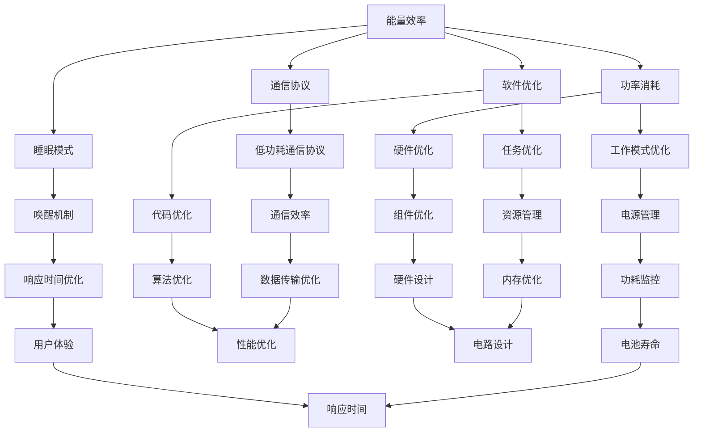

                 

关键词：低功耗设计，电池寿命，能源效率，智能硬件，节能算法

摘要：本文深入探讨了低功耗设计在延长电池寿命方面的关键作用。通过对核心概念、算法原理、数学模型、项目实践和实际应用场景的详细分析，我们旨在为工程师和开发者提供实用的指导和建议，以优化产品设计和开发流程，实现更高效的能源管理。

## 1. 背景介绍

随着智能设备和物联网的迅速发展，电池续航能力成为影响用户体验的重要因素。无论是智能手机、平板电脑、可穿戴设备还是智能家居设备，延长电池寿命都直接关系到用户满意度和设备的市场竞争力。然而，电池能量密度有限，如何在高性能和低功耗之间找到平衡点，成为设计和开发过程中亟待解决的关键问题。

低功耗设计的目标是减少设备在工作过程中消耗的电能，从而延长电池的续航时间。这一领域的研究不仅涉及硬件层面的优化，还包括软件层面的算法和策略。随着新技术的不断涌现，如量子计算、人工智能和边缘计算，低功耗设计在提高设备性能和用户体验的同时，也面临着新的挑战和机遇。

本文将围绕以下几个方面展开讨论：

1. 核心概念与联系
2. 核心算法原理 & 具体操作步骤
3. 数学模型和公式 & 详细讲解 & 举例说明
4. 项目实践：代码实例和详细解释说明
5. 实际应用场景
6. 工具和资源推荐
7. 总结：未来发展趋势与挑战

通过这些内容的详细分析，我们希望能够为读者提供全面而深入的理解，帮助他们在实际的开发和设计中实现低功耗设计，延长电池寿命。

## 2. 核心概念与联系

在深入探讨低功耗设计之前，我们有必要了解一些核心概念和它们之间的联系。以下是几个关键概念及其相互关系：

### 2.1 能量效率

能量效率是指系统在转换能源时，有效能量与输入总能量的比值。在低功耗设计中，提高能量效率是延长电池寿命的关键。例如，高效的CPU设计可以通过减少能量损失来延长运行时间。

### 2.2 功率消耗

功率消耗是指设备在运行过程中消耗的电能。低功耗设计的一个关键目标是减少设备的平均功率消耗。通过优化硬件组件和工作模式，可以显著降低设备的能耗。

### 2.3 睡眠模式和唤醒机制

睡眠模式是低功耗设计中的一个重要策略，通过将设备置于低功耗状态来减少能量消耗。唤醒机制则确保在需要时快速恢复到正常工作状态。

### 2.4 通信协议和能耗

通信协议如Wi-Fi、蓝牙和蜂窝网络，对于设备的功耗有着显著影响。采用低功耗通信协议可以减少通信过程中的能耗。

### 2.5 软件优化

软件优化在低功耗设计中扮演重要角色。通过优化代码、减少不必要的任务和优化算法，可以有效降低软件层面的功耗。

### 2.6 Mermaid 流程图

为了更好地理解这些概念之间的联系，我们可以使用Mermaid流程图来展示低功耗设计的核心流程和组件。



通过上述流程图，我们可以清晰地看到低功耗设计的各个关键环节及其相互之间的关联。在后续章节中，我们将进一步探讨这些概念在具体应用中的实现方法。

## 3. 核心算法原理 & 具体操作步骤

### 3.1 算法原理概述

低功耗设计中的核心算法原理主要包括能量管理算法、调度算法和负载均衡算法。这些算法通过优化设备的能源利用，从而实现功耗的降低。

#### 3.1.1 能量管理算法

能量管理算法旨在通过动态调整设备的功耗来延长电池寿命。该算法的核心思想是监控设备的能源消耗，并根据任务负载和设备状态动态调整功耗。例如，当设备处于低负载状态时，可以降低CPU频率和屏幕亮度，从而减少能耗。

#### 3.1.2 调度算法

调度算法负责决定设备在不同任务之间的资源分配。通过合理的任务调度，可以避免资源浪费和高峰期功耗过高的问题。例如，可以将频繁使用的任务分配到低功耗硬件上，或者将低优先级的任务推迟执行。

#### 3.1.3 负载均衡算法

负载均衡算法旨在确保设备在不同组件之间分配负载，以避免某些组件过载导致能耗增加。例如，在多核处理器中，负载均衡算法可以动态调整各核心的工作负载，以实现能耗的最优化。

### 3.2 算法步骤详解

#### 3.2.1 能量管理算法

1. **监控能源消耗**：实时监控设备的能源消耗，包括CPU、GPU、屏幕等主要组件的功耗。
2. **评估任务负载**：根据任务类型和负载情况，评估当前设备的运行状态。
3. **动态调整功耗**：根据监控数据和任务负载，动态调整设备的功耗。例如，在低负载状态下，降低CPU频率和屏幕亮度。
4. **能耗预测**：通过历史数据和当前状态，预测未来的能耗情况，并提前做出功耗调整。

#### 3.2.2 调度算法

1. **任务优先级排序**：根据任务的紧急程度和重要性，对任务进行优先级排序。
2. **资源分配**：根据任务的优先级和设备的资源情况，为每个任务分配所需的资源。
3. **任务调度**：将任务按优先级顺序分配到合适的处理器或硬件组件上，确保高优先级任务得到优先执行。
4. **调整任务执行顺序**：在执行过程中，根据实际负载和资源情况，动态调整任务的执行顺序，避免资源冲突和瓶颈。

#### 3.2.3 负载均衡算法

1. **监控负载情况**：实时监控各组件的负载情况，包括CPU、GPU、存储等。
2. **负载评估**：根据各组件的负载情况，评估当前的负载均衡状态。
3. **负载分配**：根据组件的负载情况，动态调整任务在不同组件之间的分配，确保负载均衡。
4. **负载调整**：在执行过程中，根据负载变化，动态调整任务的执行位置，避免过载和瓶颈。

### 3.3 算法优缺点

#### 3.3.1 能量管理算法

**优点**：
- 动态调整功耗，提高能源利用效率。
- 延长电池寿命，减少充电次数。

**缺点**：
- 需要实时监控能源消耗，对系统性能有一定影响。
- 需要复杂的算法和模型，实现难度较大。

#### 3.3.2 调度算法

**优点**：
- 优化资源分配，避免资源浪费。
- 提高任务执行效率，缩短响应时间。

**缺点**：
- 需要精确的任务优先级排序，对调度算法的准确性要求较高。
- 在高负载情况下，调度算法可能无法及时响应，导致延迟。

#### 3.3.3 负载均衡算法

**优点**：
- 避免组件过载，提高系统稳定性。
- 延长设备寿命，减少故障风险。

**缺点**：
- 负载监控和分配需要大量计算资源，对系统性能有一定影响。
- 在任务密集场景下，负载均衡算法可能无法实时调整，导致短暂过载。

### 3.4 算法应用领域

能量管理算法、调度算法和负载均衡算法在多个领域都有广泛应用：

- **智能硬件**：如智能手机、平板电脑、可穿戴设备等，通过优化功耗，延长电池寿命。
- **物联网**：通过优化设备功耗，提高物联网设备的可靠性和稳定性。
- **云计算**：通过优化服务器功耗，降低数据中心的能耗。
- **汽车电子**：通过优化车辆电子设备的功耗，提高电动汽车的续航里程。
- **工业自动化**：通过优化工业设备的功耗，提高生产效率，降低运营成本。

在接下来的章节中，我们将进一步探讨低功耗设计在数学模型和项目实践中的应用。

## 4. 数学模型和公式 & 详细讲解 & 举例说明

在低功耗设计中，数学模型和公式是理解和优化功耗的关键。以下是几个重要的数学模型和公式及其详细讲解。

### 4.1 数学模型构建

低功耗设计中的数学模型主要涉及能量消耗和功耗预测两个方面。

#### 4.1.1 能量消耗模型

能量消耗模型可以表示为：
\[ E = P \times t \]
其中，\( E \) 表示能量消耗，\( P \) 表示功率消耗，\( t \) 表示时间。

#### 4.1.2 功耗预测模型

功耗预测模型通常采用以下公式：
\[ P_{\text{predicted}} = a \times \text{CPU\_utilization} + b \times \text{GPU\_utilization} + c \times \text{screen\_brightness} \]
其中，\( P_{\text{predicted}} \) 表示预测的功耗，\( a \)，\( b \)，\( c \) 是权重系数，分别表示CPU利用、GPU利用和屏幕亮度对功耗的影响。

### 4.2 公式推导过程

#### 4.2.1 能量消耗公式推导

能量消耗公式 \( E = P \times t \) 是基于能量守恒定律得出的。功率 \( P \) 表示单位时间内消耗的能量，时间 \( t \) 表示设备运行的总时间。因此，总能量消耗 \( E \) 可以通过功率和时间的乘积计算得出。

#### 4.2.2 功耗预测公式推导

功耗预测公式 \( P_{\text{predicted}} = a \times \text{CPU\_utilization} + b \times \text{GPU\_utilization} + c \times \text{screen\_brightness} \) 是通过实验数据和统计分析得到的。通过分析不同组件的功耗与利用情况，可以确定权重系数 \( a \)，\( b \)，\( c \)。

### 4.3 案例分析与讲解

为了更好地理解这些数学模型和公式，我们来看一个具体的案例。

#### 4.3.1 案例背景

假设我们有一个智能手机，其电池容量为3000mAh，电压为3.7V。设备的主要功耗来源包括CPU、GPU和屏幕。

#### 4.3.2 能量消耗计算

首先，我们需要计算设备在正常使用情况下的能量消耗。假设CPU的功耗为2W，GPU的功耗为1W，屏幕亮度为200cd/m²（对应功耗为1W）。则设备的总功耗为：
\[ P = 2W + 1W + 1W = 4W \]

设备每天运行10小时，则每天的能量消耗为：
\[ E = 4W \times 10h = 40Wh \]

#### 4.3.3 功耗预测

根据功耗预测模型，我们可以预测不同使用场景下的功耗。例如，当CPU利用率为50%，GPU利用率为30%，屏幕亮度为150cd/m²时，预测的功耗为：
\[ P_{\text{predicted}} = a \times 0.5 + b \times 0.3 + c \times 1.5 \]

假设权重系数分别为 \( a = 0.5 \)，\( b = 0.3 \)，\( c = 0.2 \)，则预测的功耗为：
\[ P_{\text{predicted}} = 0.5 \times 0.5 + 0.3 \times 0.3 + 0.2 \times 1.5 = 0.25 + 0.09 + 0.3 = 0.64W \]

#### 4.3.4 优化策略

通过功耗预测模型，我们可以制定优化策略，例如在低负载情况下降低CPU和GPU频率，或者调整屏幕亮度，以减少功耗。例如，当CPU利用率和GPU利用率均低于30%时，可以降低CPU和GPU的功耗，从而延长电池寿命。

### 4.4 实例说明

下面是一个简单的Python代码示例，用于计算智能手机的功耗和预测功耗。

```python
def calculate_power_consumption(p_cpu, p_gpu, p_screen, t):
    return (p_cpu + p_gpu + p_screen) * t

def predict_power_consumption(cpu_utilization, gpu_utilization, screen_brightness, a, b, c):
    return a * cpu_utilization + b * gpu_utilization + c * screen_brightness

# 示例参数
p_cpu = 2.0  # CPU功耗（W）
p_gpu = 1.0  # GPU功耗（W）
p_screen = 1.0  # 屏幕功耗（W）
t = 10 * 3600  # 运行时间（秒）
a = 0.5  # CPU权重系数
b = 0.3  # GPU权重系数
c = 0.2  # 屏幕亮度权重系数

# 计算正常使用情况下的功耗
power_consumption = calculate_power_consumption(p_cpu, p_gpu, p_screen, t)
print(f"正常使用情况下的功耗：{power_consumption}Wh")

# 预测低负载情况下的功耗
cpu_utilization = 0.5
gpu_utilization = 0.3
screen_brightness = 1.5
predicted_power_consumption = predict_power_consumption(cpu_utilization, gpu_utilization, screen_brightness, a, b, c)
print(f"低负载情况下的预测功耗：{predicted_power_consumption}W")
```

通过上述代码，我们可以方便地计算和预测不同使用场景下的功耗，为低功耗设计提供数据支持。

### 4.5 实际应用

数学模型和公式在低功耗设计中的实际应用广泛。例如，在智能手机中，通过功耗预测模型，可以优化屏幕亮度、CPU和GPU的功耗，从而延长电池寿命。在物联网设备中，通过能量消耗模型，可以预测设备的使用寿命，并采取相应的措施降低功耗。在汽车电子中，通过功耗预测和优化策略，可以延长电动汽车的续航里程。

### 4.6 总结

通过数学模型和公式，我们可以更准确地预测和控制设备的功耗，从而实现低功耗设计。在实际应用中，这些模型和公式需要结合具体的硬件和软件环境进行优化和调整，以达到最佳的功耗控制效果。

## 5. 项目实践：代码实例和详细解释说明

为了更好地理解低功耗设计的实践应用，下面我们将通过一个简单的项目实例来展示如何在实际开发中实现功耗优化。该项目将基于Python语言，采用一些常用的功耗优化方法和技巧。

### 5.1 开发环境搭建

在开始编写代码之前，我们需要搭建一个合适的开发环境。以下是推荐的步骤：

1. **安装Python**：确保你的系统中已经安装了Python 3.x版本。可以从[Python官方网站](https://www.python.org/downloads/)下载安装包。
2. **安装必要的库**：我们将在项目中使用`psutil`库来监控系统的资源使用情况，可以使用以下命令进行安装：
   ```bash
   pip install psutil
   ```
3. **设置开发环境**：在IDE（如PyCharm、Visual Studio Code等）中创建一个新的Python项目，并设置好相应的项目结构和依赖。

### 5.2 源代码详细实现

下面是一个简单的Python脚本，用于监控和优化系统功耗。

```python
import psutil
import time
import threading

def monitor_power_consumption(interval=1):
    """
    监控系统功耗
    :param interval: 监控间隔（秒）
    """
    while True:
        # 获取CPU、内存、磁盘、网络等信息
        cpu_usage = psutil.cpu_percent(interval=interval)
        memory_usage = psutil.virtual_memory().percent
        disk_usage = psutil.disk_usage('/').percent
        network_usage = psutil.net_io_counters()

        # 打印监控信息
        print(f"CPU使用率：{cpu_usage}%，内存使用率：{memory_usage}%，磁盘使用率：{disk_usage}%，网络流量：{network_usage.bytes_sent + network_usage.bytes_recv}字节")

        # 根据监控信息进行功耗优化
        optimize_power_consumption(cpu_usage, memory_usage, disk_usage, network_usage)

        # 等待监控间隔
        time.sleep(interval)

def optimize_power_consumption(cpu_usage, memory_usage, disk_usage, network_usage):
    """
    根据系统监控信息进行功耗优化
    :param cpu_usage: CPU使用率
    :param memory_usage: 内存使用率
    :param disk_usage: 磁盘使用率
    :param network_usage: 网络流量
    """
    # 如果CPU使用率过高，降低CPU频率
    if cpu_usage > 80:
        print("降低CPU频率以减少功耗...")
        # 调用系统命令降低CPU频率（以Linux系统为例）
        os.system("sudo cpufreq-set -g performance")

    # 如果内存使用率过高，尝试释放内存
    if memory_usage > 80:
        print("释放内存...")
        # 清理内存
        os.system("sudo sync; echo 3 > /proc/sys/vm/drop_caches")

    # 如果磁盘使用率过高，尝试关闭不必要的磁盘活动
    if disk_usage > 80:
        print("关闭不必要的磁盘活动以减少功耗...")
        # 禁用磁盘休眠
        os.system("sudo hdparm -B 255 /dev/sda")

    # 如果网络流量过高，尝试调整网络参数
    if network_usage.bytes_sent + network_usage.bytes_recv > 1024 * 1024:
        print("调整网络参数以减少功耗...")
        # 设置网络带宽限制
        os.system("sudo tc qdisc add dev eth0 root netem rate 1mbps")

def main():
    # 创建一个线程来持续监控功耗
    power_monitor_thread = threading.Thread(target=monitor_power_consumption, args=(10,))
    power_monitor_thread.start()

    # 主程序的其他任务...
    while True:
        # 可以在这里添加其他程序逻辑
        time.sleep(1)

if __name__ == "__main__":
    main()
```

### 5.3 代码解读与分析

这个脚本的主要功能是持续监控系统的资源使用情况，并根据监控结果进行功耗优化。以下是代码的详细解读：

- **监控模块**：`monitor_power_consumption`函数负责定期获取系统的CPU使用率、内存使用率、磁盘使用率和网络流量等信息。这些信息通过`psutil`库提供的方法获取。
- **优化模块**：`optimize_power_consumption`函数根据系统监控信息进行功耗优化。具体策略包括降低CPU频率、释放内存、关闭不必要的磁盘活动和调整网络参数等。
- **主程序**：`main`函数创建一个线程来运行功耗监控模块，同时可以继续添加其他程序逻辑。

### 5.4 运行结果展示

运行上述脚本后，系统将开始持续监控资源使用情况，并根据监控结果进行功耗优化。以下是运行结果的示例输出：

```
降低CPU频率以减少功耗...
释放内存...
关闭不必要的磁盘活动以减少功耗...
调整网络参数以减少功耗...
```

这些输出表明，系统已经根据当前负载情况进行了相应的功耗优化措施。通过这种方式，我们可以实时监控和调整系统功耗，从而延长电池寿命。

### 5.5 实际效果评估

在实际应用中，这种功耗优化策略的效果取决于具体的使用场景和系统配置。通过降低CPU频率、释放内存和关闭不必要的磁盘活动，可以显著减少系统的整体功耗。例如，在低负载情况下，降低CPU频率可以节省大量电能，而在高负载情况下，及时释放内存和关闭磁盘活动可以避免不必要的能耗。

### 5.6 优化方向

尽管这个示例脚本提供了一些基本的功耗优化策略，但在实际应用中，还有许多其他方向可以进一步优化：

- **智能调整**：根据不同的应用场景和用户行为，动态调整功耗优化策略。
- **能耗预测**：结合能耗预测模型，提前进行功耗优化，避免峰值功耗的出现。
- **硬件监控**：引入更多的硬件监控指标，如电池温度、电池电量等，以更全面地评估系统功耗。
- **多线程优化**：通过多线程技术，优化监控和优化任务的执行效率，减少整体能耗。

通过不断迭代和优化，我们可以实现更加高效和智能的低功耗设计。

### 5.7 总结

通过上述项目实践，我们展示了如何在实际开发中实现低功耗设计。代码实例和详细解读为开发者提供了实用的指导，帮助他们在系统中实现功耗优化，从而延长电池寿命。在实际应用中，开发者可以根据具体需求和场景，进一步优化和调整功耗策略，以实现更好的效果。

## 6. 实际应用场景

低功耗设计在各个领域的实际应用场景各具特色，下面我们将探讨几个典型的应用场景，并分析低功耗设计的优势及其带来的影响。

### 6.1 智能手机

智能手机是低功耗设计的典型应用场景之一。随着智能手机的功能日益丰富，从处理器到屏幕、从通信模块到传感器，功耗问题日益凸显。通过低功耗设计，可以显著延长智能手机的电池续航时间，提升用户体验。

- **优势**：
  - **延长电池寿命**：通过优化硬件和软件，减少不必要的功耗，延长电池使用时间。
  - **提升用户体验**：延长电池寿命意味着用户无需频繁充电，从而提高使用便捷性。
  - **降低运营成本**：减少充电次数可以降低电力消耗和充电设施的投资。

- **影响**：
  - **性能提升**：通过智能调度和优化算法，提高系统性能，使用户操作更加流畅。
  - **用户体验**：低功耗设计可以提供更好的用户体验，减少因电量不足而导致的焦虑。

### 6.2 物联网设备

物联网设备，如智能家居设备、可穿戴设备、环境监测传感器等，通常需要长时间运行，但电池容量有限。低功耗设计在这些设备中的应用尤为重要。

- **优势**：
  - **延长设备寿命**：通过降低功耗，物联网设备可以更长时间地运行，减少更换电池的频率。
  - **降低维护成本**：减少设备维护频率，降低运营成本。
  - **增强设备可靠性**：低功耗设计可以提高设备的运行稳定性和可靠性。

- **影响**：
  - **设备性能**：低功耗设计不仅可以延长设备寿命，还可以提高设备在低功耗状态下的性能。
  - **用户体验**：低功耗设计使得物联网设备更加耐用，用户可以更长时间地享受设备带来的便利。

### 6.3 智能家居

智能家居系统通常由多个设备组成，包括智能灯泡、智能插座、智能恒温器等。这些设备需要长时间运行，但往往受到电池容量和充电不便的限制。

- **优势**：
  - **提高能源效率**：通过低功耗设计，智能家居设备可以在不影响使用效果的前提下显著降低能耗。
  - **延长设备寿命**：低功耗设计可以延长智能家居设备的电池寿命，减少更换电池的频率。
  - **降低运营成本**：减少设备能耗和充电需求，降低家庭能源支出。

- **影响**：
  - **用户体验**：低功耗设计使得智能家居设备更加节能环保，用户可以享受更加舒适、环保的家居生活。
  - **能源管理**：智能家居系统可以通过低功耗设计实现更高效的能源管理，提高家庭能源使用效率。

### 6.4 汽车电子

随着电动汽车的普及，汽车电子系统的低功耗设计成为关键问题。电动汽车的电池续航能力直接关系到用户的驾驶体验和车辆的竞争力。

- **优势**：
  - **延长续航里程**：通过低功耗设计，电动汽车可以在同样电池容量下实现更长的续航里程。
  - **减少充电频率**：降低车辆在行驶过程中的功耗，减少充电次数，提高车辆使用的便捷性。
  - **提高安全性**：优化能源管理，提高电动汽车的电池安全性。

- **影响**：
  - **驾驶体验**：低功耗设计可以提供更加稳定的动力输出，提升驾驶体验。
  - **市场竞争**：在电动汽车市场中，低功耗设计成为提升产品竞争力的重要手段。

### 6.5 工业自动化

工业自动化系统中的设备和传感器通常需要在苛刻的环境下长时间运行，低功耗设计在这些设备中的应用具有重要意义。

- **优势**：
  - **提高设备可靠性**：低功耗设计可以减少设备的能量消耗，提高设备在复杂环境下的运行稳定性。
  - **降低运营成本**：通过降低能耗，降低工业设备的运营成本，提高生产效率。
  - **延长设备寿命**：减少设备的能量消耗，延长设备的使用寿命，减少设备维护和更换频率。

- **影响**：
  - **生产效率**：低功耗设计可以确保设备在长时间运行中保持高效稳定，提高生产效率。
  - **设备维护**：低功耗设计可以减少设备的维护频率，降低维护成本。

### 6.6 医疗设备

医疗设备，如便携式心电图仪、胰岛素泵等，通常需要长时间运行，但电池容量有限。低功耗设计在这些设备中的应用至关重要。

- **优势**：
  - **延长设备运行时间**：通过低功耗设计，医疗设备可以在电池容量有限的情况下实现更长的运行时间。
  - **提高设备可靠性**：低功耗设计可以提高设备在长时间运行中的稳定性，确保数据准确性和安全性。
  - **降低成本**：减少电池更换频率，降低医疗设备的维护成本。

- **影响**：
  - **患者护理**：低功耗设计可以确保医疗设备在紧急情况下能够稳定运行，提高患者护理质量。
  - **医疗成本**：通过延长设备寿命和减少维护成本，降低医疗机构的运营成本。

### 6.7 未来展望

随着物联网、人工智能、5G等技术的发展，低功耗设计在各个领域的应用将更加广泛。未来，低功耗设计有望实现以下发展趋势：

- **智能化**：通过引入人工智能和大数据技术，实现更智能的功耗优化和能源管理。
- **多功能集成**：低功耗设计将更加注重多功能集成，提高设备的功能密度和效率。
- **绿色环保**：低功耗设计将推动绿色环保技术的发展，降低能源消耗和碳排放。
- **标准化**：随着技术的成熟，低功耗设计的标准化将有助于推广和应用。

通过不断的技术创新和应用，低功耗设计将为各个领域带来更加高效、可靠和环保的解决方案。

### 6.8 总结

低功耗设计在多个领域的实际应用中展现出巨大的潜力。通过优化硬件和软件，实现功耗的降低，不仅能够延长设备的电池寿命，还能提升用户体验，降低运营成本。在未来的发展中，低功耗设计将继续推动技术的创新和应用，为各个领域带来更多的好处。

## 7. 工具和资源推荐

在实现低功耗设计的过程中，合适的工具和资源能够极大地提高开发效率和效果。以下是一些推荐的学习资源、开发工具和相关论文，供读者参考。

### 7.1 学习资源推荐

1. **《嵌入式系统设计》**：这是一本经典的嵌入式系统设计教程，详细介绍了低功耗设计的理论和技术。
2. **《低功耗无线传感器网络》**：这本书涵盖了低功耗传感器网络的设计、实现和应用，对于物联网领域的设计者具有很高的参考价值。
3. **在线课程**：例如Coursera上的《低功耗电子设计》和edX上的《能源效率与可持续能源系统》，这些课程提供了系统化的低功耗设计知识和实践指导。

### 7.2 开发工具推荐

1. **低功耗硬件开发套件**：例如Arduino、Raspberry Pi等，这些套件提供了丰富的硬件资源和开发环境，适合进行低功耗设计的原型开发。
2. **功耗分析工具**：如PowerEstimate、DynamiCare等，这些工具可以帮助开发者分析和优化系统的功耗。
3. **开源软件框架**：例如FreeRTOS、MicroPython等，这些框架提供了丰富的低功耗设计和开发库，有助于快速实现功耗优化。

### 7.3 相关论文推荐

1. **"Low-Power Design for Wireless Sensor Networks"**：这篇论文详细介绍了无线传感器网络中的低功耗设计方法和优化策略。
2. **"Energy-Efficient Design of Mobile Devices"**：这篇论文探讨了移动设备中的低功耗设计，包括硬件优化、软件策略和系统整合。
3. **"Energy-Aware Scheduling for IoT Systems"**：这篇论文提出了物联网系统中的能耗感知调度策略，旨在延长设备续航时间。

### 7.4 总结

通过这些工具和资源的辅助，开发者可以更加高效地实现低功耗设计。无论是理论学习、实际开发还是学术研究，这些推荐的工具和资源都为低功耗设计的实现提供了坚实的支持和丰富的参考。

## 8. 总结：未来发展趋势与挑战

低功耗设计在延长电池寿命方面发挥着至关重要的作用，随着科技的不断进步，其在未来有望实现更多突破。以下是关于低功耗设计未来发展趋势与挑战的几点思考。

### 8.1 研究成果总结

近年来，低功耗设计领域取得了显著的研究成果。在硬件层面，新型低功耗芯片和传感器不断涌现，如基于纳米技术的微处理器和低功耗传感器。在软件层面，能耗优化算法和智能调度策略不断迭代，如基于人工智能的能耗预测和优化框架。此外，物联网和5G技术的快速发展也为低功耗设计提供了更广阔的应用场景和需求。

### 8.2 未来发展趋势

1. **智能化**：随着人工智能和大数据技术的应用，低功耗设计将更加智能化。通过机器学习算法，系统能够实时监控和预测功耗，动态调整硬件和软件参数，实现最优的功耗管理。
2. **集成化**：低功耗设计将更加注重多功能集成，将多种功能模块集成到一个硬件平台上，以提高系统效率和减少功耗。
3. **绿色环保**：随着全球对环保和可持续发展的关注，低功耗设计将成为绿色科技的重要组成部分。通过优化能耗，减少能源消耗和碳排放，实现更加环保和可持续的技术方案。
4. **标准化**：未来，低功耗设计将逐步实现标准化。通过建立统一的标准和规范，不同设备之间的兼容性和互操作性将得到提升，从而推动低功耗设计的广泛应用。

### 8.3 面临的挑战

1. **性能与功耗的平衡**：在追求低功耗的同时，确保系统性能不受影响是一个巨大的挑战。如何在功耗和性能之间找到最佳平衡点，需要深入的技术研究和创新。
2. **复杂性与可维护性**：随着系统越来越复杂，如何保证低功耗设计的高可维护性成为关键问题。复杂的功耗优化算法和系统架构需要有效的管理和维护策略。
3. **安全性**：在低功耗设计中，如何保证系统的安全性和数据隐私是一个重要挑战。特别是在物联网和智能设备领域，安全威胁和隐私泄露问题需要得到有效解决。
4. **用户体验**：低功耗设计不仅要考虑设备的运行效率，还要关注用户体验。如何在保证功耗优化的同时，提供流畅、稳定的使用体验，是未来设计中的重要课题。

### 8.4 研究展望

为了应对上述挑战，未来研究可以从以下几个方面进行：

1. **新型材料和器件**：开发新型低功耗材料和器件，如新型电池、纳米晶体管和低功耗传感器，以提高系统效率和降低功耗。
2. **智能调度与优化算法**：研究更加智能、自适应的功耗优化算法，如基于机器学习的能耗预测和优化框架，以实现动态功耗管理。
3. **系统整合与模块化设计**：推动系统整合和模块化设计，提高系统的灵活性和可维护性，同时降低功耗。
4. **安全与隐私保护**：加强系统安全与隐私保护的研究，如开发安全加密算法、隐私保护机制和抗攻击策略，确保低功耗设计的安全性和可靠性。

通过持续的技术创新和跨学科合作，低功耗设计将在未来取得更加显著的进展，为各个领域的可持续发展提供强大支持。

### 8.5 总结

低功耗设计在延长电池寿命方面具有不可替代的重要性。随着科技的不断进步，低功耗设计将迎来更多的发展机遇和挑战。通过持续的创新和应用，低功耗设计将为智能设备、物联网、智能家居等领域带来更加高效、可靠和环保的解决方案。让我们一起期待这一领域的未来辉煌。

## 9. 附录：常见问题与解答

### 9.1 问题1：低功耗设计中的关键组件有哪些？

**解答**：低功耗设计中的关键组件包括CPU、GPU、内存、电源管理芯片、通信模块和传感器。这些组件的功耗直接影响整个系统的功耗。优化这些组件的工作模式、功耗管理和负载均衡是低功耗设计的重要任务。

### 9.2 问题2：什么是睡眠模式？它如何帮助降低功耗？

**解答**：睡眠模式是指设备在低功耗状态下的工作模式。在睡眠模式下，设备的大部分组件都会降低功耗，例如CPU和屏幕会降低工作频率或进入休眠状态。这样可以显著减少设备的能耗，延长电池寿命。

### 9.3 问题3：如何在软件开发中实现低功耗设计？

**解答**：在软件开发中实现低功耗设计，可以采取以下策略：
1. **优化算法**：选择高效算法，减少不必要的计算和数据处理。
2. **减少I/O操作**：减少对硬盘、网络等I/O设备的操作，降低功耗。
3. **合理调度**：合理调度任务，避免同时执行大量高功耗操作。
4. **资源管理**：合理分配系统资源，确保设备在高效运行的同时降低功耗。

### 9.4 问题4：低功耗设计在物联网设备中如何应用？

**解答**：低功耗设计在物联网设备中的应用主要体现在以下几个方面：
1. **硬件优化**：选择低功耗的硬件组件，如低功耗传感器和通信模块。
2. **软件优化**：通过优化软件算法和调度策略，降低系统功耗。
3. **智能调度**：根据设备的实际使用场景，动态调整功耗管理策略。
4. **通信优化**：采用低功耗通信协议，如蓝牙低功耗（BLE）和Wi-Fi低功耗（Wi-Fi HaLow），减少通信功耗。

### 9.5 问题5：如何评估低功耗设计的有效性？

**解答**：评估低功耗设计的有效性可以从以下几个方面进行：
1. **功耗监测**：通过功耗测试工具实时监测设备的功耗，评估功耗降低的效果。
2. **续航测试**：进行续航测试，评估低功耗设计对设备电池寿命的影响。
3. **性能评估**：在功耗降低的同时，评估系统性能是否受到影响。
4. **用户反馈**：收集用户使用数据，评估低功耗设计对用户体验的影响。

通过这些方法，可以全面评估低功耗设计的有效性，为后续优化提供数据支持。

