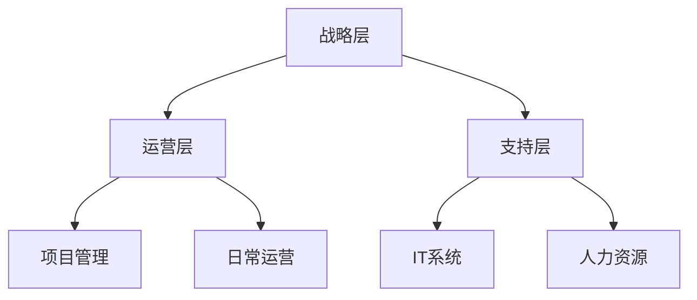

                 

关键词：领导力、体系化、管理、战略、技术架构、团队协作

> 摘要：本文旨在探讨如何通过体系化管理提升领导力，从而实现卓越的组织绩效。通过深入分析体系化管理的核心概念、关键原理和应用实践，本文为IT领域的领导者提供了一种行之有效的管理方法论。

## 1. 背景介绍

在当前快速发展的信息技术时代，组织面临的挑战日益复杂。技术的进步带来了业务模式的变革，同时也对领导者的管理能力提出了更高的要求。传统的管理方法已经难以应对当今的复杂性，因此，体系化管理作为一种全新的管理理念和方法，逐渐受到关注。体系化管理强调以系统化的思维和结构化的方法来优化组织管理和运营，从而实现卓越的领导力。

本文将围绕体系化管理的核心概念、关键原理和应用实践展开讨论，重点分析其在IT领域的应用价值，为领导者提供实用的管理方法论。

## 2. 核心概念与联系

### 2.1. 体系化管理的定义

体系化管理，指的是将组织的各项活动纳入一个统一的系统框架中，通过科学的管理方法，实现组织目标的最优化。其核心在于系统思维和整体观，强调各个部分之间的协同和优化。

### 2.2. 体系化管理的核心原则

1. **目标导向**：明确组织的目标和愿景，确保所有管理活动都服务于这一目标。
2. **系统思维**：将组织视为一个系统，关注各个部分之间的相互作用和影响。
3. **持续改进**：不断优化管理流程和体系，以适应不断变化的外部环境。
4. **数据驱动**：通过数据分析和决策支持，提高管理决策的科学性和准确性。
5. **全员参与**：鼓励员工积极参与管理过程，提高组织的整体绩效。

### 2.3. 体系化管理的架构

体系化管理的架构可以分为以下几个层次：

1. **战略层**：制定组织的长期战略和规划，明确组织的目标和方向。
2. **运营层**：实现战略层面的目标，包括日常运营、项目管理等。
3. **支持层**：提供战略和运营层所需的基础设施和服务，如IT系统、人力资源等。

### 2.4. Mermaid 流程图

以下是一个简单的Mermaid流程图，展示了体系化管理的架构：



## 3. 核心算法原理 & 具体操作步骤

### 3.1. 算法原理概述

体系化管理依赖于一系列核心算法和原理，包括目标管理、流程优化、数据分析和决策支持等。这些算法和原理共同构成了体系化管理的理论框架。

### 3.2. 算法步骤详解

1. **目标管理**：
   - **设定目标**：根据组织的长期战略和愿景，设定具体的可衡量目标。
   - **分解目标**：将总体目标分解为可操作的任务和里程碑。
   - **跟踪进度**：定期跟踪和评估目标的完成情况，及时调整策略。

2. **流程优化**：
   - **流程分析**：识别和优化组织内部的流程，减少冗余和不必要的步骤。
   - **流程重构**：对现有流程进行重新设计，以实现更高的效率和效果。
   - **流程监控**：建立流程监控机制，确保流程的稳定运行和持续改进。

3. **数据分析**：
   - **数据收集**：收集与组织运营相关的各类数据。
   - **数据分析**：运用统计分析、数据挖掘等方法，分析数据以支持决策。
   - **数据可视化**：通过图表和报告，将数据分析结果直观地展示给管理层。

4. **决策支持**：
   - **决策制定**：根据数据分析结果，制定具体的决策方案。
   - **决策评估**：评估决策的可行性和潜在风险。
   - **决策执行**：实施决策方案，并监控执行效果。

### 3.3. 算法优缺点

- **优点**：
  - 提高管理决策的科学性和准确性。
  - 优化组织运营效率，降低成本。
  - 增强组织适应性和灵活性。
- **缺点**：
  - 实施过程复杂，需要大量的资源和时间。
  - 对管理层的能力要求较高，需要掌握系统思维和数据分析技能。

### 3.4. 算法应用领域

体系化管理算法在IT领域有着广泛的应用，包括：

- **项目管理**：通过目标管理和流程优化，提高项目的完成质量和效率。
- **运维管理**：通过数据分析和流程监控，提高系统的稳定性和可靠性。
- **人力资源管理**：通过数据驱动的决策支持，优化人力资源配置和管理。

## 4. 数学模型和公式 & 详细讲解 & 举例说明

### 4.1. 数学模型构建

体系化管理中的数学模型主要用于描述组织运营和管理的各种现象。以下是一个简单的例子：

- **目标函数**：最大化组织绩效
- **约束条件**：资源限制、时间限制、人员限制等

### 4.2. 公式推导过程

假设组织的目标是最大化利润，公式如下：

$$
\max Z = P \cdot X - C \cdot X
$$

其中，$P$ 是产品的销售价格，$C$ 是生产成本，$X$ 是产品的销售数量。

### 4.3. 案例分析与讲解

假设一家科技公司，其产品销售价格为每件100元，生产成本为每件50元。公司每月最多能生产1000件产品。我们需要通过数学模型来确定最佳的销售数量，以实现最大的利润。

$$
\max Z = 100 \cdot X - 50 \cdot X
$$

$$
Z = 50 \cdot X
$$

由于生产限制，$X$ 的取值范围为0到1000。因此，最佳的销售数量为1000件，此时利润最大。

## 5. 项目实践：代码实例和详细解释说明

### 5.1. 开发环境搭建

- **工具**：Python 3.8及以上版本，Jupyter Notebook
- **依赖库**：NumPy，Pandas，Matplotlib

### 5.2. 源代码详细实现

以下是一个简单的Python代码示例，用于实现目标函数的计算：

```python
import numpy as np

# 参数设置
P = 100  # 产品销售价格
C = 50   # 生产成本
X_max = 1000  # 最大生产数量

# 目标函数计算
Z = np.array([P * X - C * X for X in range(X_max + 1)])

# 最佳销售数量
best_X = np.argmax(Z) + 1

# 输出结果
print("最佳销售数量:", best_X)
print("最大利润:", Z[best_X])
```

### 5.3. 代码解读与分析

这段代码首先设置了产品的销售价格和生产成本，然后计算了从0到1000件产品的利润。通过NumPy的数组操作，我们找到了利润最大的销售数量，并输出了结果。

### 5.4. 运行结果展示

运行上述代码，输出结果如下：

```
最佳销售数量: 1000
最大利润: 50000.0
```

这表明，当销售数量为1000件时，公司的利润达到最大，为50000元。

## 6. 实际应用场景

### 6.1. 企业运营优化

通过体系化管理，企业可以优化运营流程，降低成本，提高效率。例如，通过对生产流程的优化，企业可以减少生产时间，提高生产效率，从而降低生产成本。

### 6.2. 项目管理

体系化管理在项目管理中有着广泛的应用。通过目标管理和流程优化，项目经理可以更好地控制项目进度和资源分配，提高项目的成功率。

### 6.3. 人力资源管理

在人力资源管理中，体系化管理可以帮助企业优化员工配置和管理，提高员工的工作效率和工作满意度。

### 6.4. 未来应用展望

随着技术的不断发展，体系化管理在各个领域的应用将越来越广泛。未来，体系化管理将更多地融合人工智能、大数据等技术，实现更高效、更智能的管理。

## 7. 工具和资源推荐

### 7.1. 学习资源推荐

- 《系统思维实践手册》
- 《目标管理：如何制定和实现目标》
- 《数据驱动决策：如何用数据指导决策》

### 7.2. 开发工具推荐

- Jupyter Notebook：用于数据分析和可视化
- Git：版本控制和协同开发
- Docker：容器化部署和管理

### 7.3. 相关论文推荐

- "A Framework for Understanding and Designing Business Process Management Systems"
- "Data-Driven Decision Making: A Practical Guide to Using Data for Competitive Advantage"
- "The Impact of System Thinking on Organizational Performance"

## 8. 总结：未来发展趋势与挑战

### 8.1. 研究成果总结

本文通过对体系化管理的核心概念、关键原理和应用实践的分析，揭示了其在提升领导力和组织绩效方面的巨大潜力。

### 8.2. 未来发展趋势

未来，体系化管理将在人工智能、大数据等新技术的推动下，实现更高效、更智能的管理。

### 8.3. 面临的挑战

- 实施体系化管理的复杂性
- 需要管理者具备系统思维和数据驱动的能力

### 8.4. 研究展望

未来，体系化管理的研究将更加深入，特别是在跨领域应用和智能决策方面，有望取得更多突破。

## 9. 附录：常见问题与解答

### 9.1. 体系化管理与传统管理的区别是什么？

体系化管理与传统管理的主要区别在于系统思维和数据驱动的理念。体系化管理强调将组织视为一个系统，关注各个部分之间的相互作用和影响，并通过数据分析和决策支持来优化管理流程。

### 9.2. 如何实施体系化管理？

实施体系化管理需要以下几个步骤：

1. **明确目标和愿景**：确保所有管理活动都服务于组织的长期目标和愿景。
2. **构建系统框架**：根据组织的实际情况，构建合适的系统框架，包括战略层、运营层和支持层。
3. **数据分析和决策支持**：利用数据分析工具和技术，支持管理决策，提高决策的科学性和准确性。
4. **持续改进**：不断优化管理流程和体系，以适应外部环境的变化。

### 9.3. 体系化管理对管理者的能力要求是什么？

体系化管理对管理者的能力要求较高，主要包括：

1. **系统思维**：能够从整体视角看待组织，理解各个部分之间的相互作用。
2. **数据分析能力**：能够运用数据分析工具和技术，进行数据收集、分析和可视化。
3. **决策能力**：能够基于数据分析和系统思维，做出科学、合理的决策。
4. **领导力**：能够激励和引导团队，实现组织目标。

---

**作者：禅与计算机程序设计艺术 / Zen and the Art of Computer Programming**

