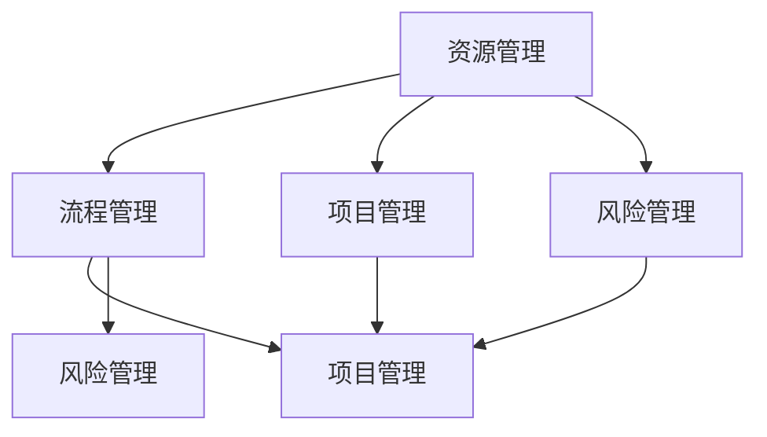

                 

体系化管理是一种系统化、规范化、流程化的管理模式，旨在通过科学的方法和工具，实现企业资源的优化配置、管理效率的提升和业务流程的优化。在当今快速变化和竞争激烈的市场环境中，体系化管理不仅是企业生存和发展的必要条件，更是卓越领导力的源泉。本文将从体系化管理的背景、核心概念、算法原理、数学模型、项目实践和未来展望等多个方面，深入探讨体系化管理在IT领域的应用和重要性。

## 关键词
- 体系化管理
- 卓越领导力
- IT领域
- 管理模式
- 资源优化
- 流程优化

## 摘要
本文首先介绍了体系化管理的背景和重要性，分析了其核心概念和架构，探讨了核心算法原理和数学模型，并通过具体的项目实践展示了体系化管理在实际应用中的效果。随后，文章讨论了体系化管理在IT领域的实际应用场景，提出了未来应用展望，并推荐了一些学习资源和开发工具。最后，文章总结了体系化管理的研究成果，展望了其未来发展趋势和面临的挑战。

## 1. 背景介绍
### 1.1 管理模式的演变
管理体系的发展经历了从传统的经验管理到科学管理的转变。20世纪初，泰勒的“科学管理理论”提出了通过工作分析、标准化操作流程来提高生产效率的观点。随着信息技术的发展，企业管理模式逐渐向体系化管理转变。体系化管理强调标准化、流程化和系统化，旨在通过科学的方法和工具，实现企业资源的优化配置、管理效率的提升和业务流程的优化。

### 1.2 IT领域的挑战
在IT领域，随着互联网、大数据、人工智能等技术的快速发展，企业的业务环境和竞争态势发生了深刻变化。传统的管理方法已经难以满足快速变化的市场需求。IT企业面临着如何快速响应市场变化、提高开发效率、确保产品质量的挑战。体系化管理提供了一种系统化的解决方案，通过标准化流程、工具和算法，提高IT项目的开发效率和质量，降低风险。

## 2. 核心概念与联系
### 2.1 核心概念
体系化管理涉及多个核心概念，包括资源管理、流程管理、项目管理、风险管理等。这些概念相互关联，共同构成了体系化管理的理论基础。

### 2.2 联系
以下是体系化管理核心概念的 Mermaid 流程图：



## 3. 核心算法原理 & 具体操作步骤
### 3.1 算法原理概述
体系化管理中的核心算法包括资源调度算法、流程优化算法和风险评估算法等。这些算法基于数学模型和优化理论，通过数学模型和算法实现对资源的合理分配、流程的优化和风险的评估。

### 3.2 算法步骤详解
#### 3.2.1 资源调度算法
资源调度算法的主要目的是在有限资源下，实现最大化的产出。其基本步骤如下：

1. **资源评估**：评估各类资源的可用性、利用率和瓶颈。
2. **需求预测**：预测各类资源的未来需求。
3. **资源分配**：根据需求预测结果，合理分配各类资源。
4. **调度优化**：通过优化算法，不断调整资源分配，以实现最大化的产出。

#### 3.2.2 流程优化算法
流程优化算法旨在通过优化业务流程，提高企业运营效率。其基本步骤如下：

1. **流程分析**：分析现有业务流程的各个环节，识别优化点。
2. **流程重构**：基于流程分析结果，重构业务流程，消除冗余环节。
3. **流程测试**：测试重构后的业务流程，确保其稳定性和高效性。
4. **流程优化**：根据测试结果，进一步优化业务流程。

#### 3.2.3 风险评估算法
风险评估算法的主要目的是识别和评估企业面临的各种风险，并为风险应对提供依据。其基本步骤如下：

1. **风险识别**：识别企业可能面临的各种风险。
2. **风险评估**：对识别出的风险进行评估，确定其发生的概率和影响程度。
3. **风险应对**：根据风险评估结果，制定相应的风险应对策略。
4. **风险监控**：持续监控风险，确保风险应对措施的有效性。

### 3.3 算法优缺点
#### 3.3.1 资源调度算法
优点：能够实现资源的合理分配，提高产出效率。
缺点：需要精确的需求预测和资源评估，对实时性要求较高。

#### 3.3.2 流程优化算法
优点：能够提高企业运营效率，降低运营成本。
缺点：需要深入的业务流程分析，对业务流程的稳定性要求较高。

#### 3.3.3 风险评估算法
优点：能够帮助企业识别和应对潜在风险。
缺点：需要大量的数据支持和模型训练，对数据质量和算法模型要求较高。

### 3.4 算法应用领域
体系化管理算法在IT领域有着广泛的应用。例如，在软件开发过程中，可以采用资源调度算法来优化人力资源和物资资源的分配；在项目管理中，可以采用流程优化算法来优化项目进度和资源利用率；在风险控制中，可以采用风险评估算法来识别和评估项目风险。

## 4. 数学模型和公式 & 详细讲解 & 举例说明
### 4.1 数学模型构建
体系化管理的数学模型主要包括资源模型、流程模型和风险模型。以下是这三个模型的构建过程：

#### 4.1.1 资源模型
资源模型的主要目的是描述资源的可用性和利用率。其基本公式如下：

$$
R(t) = \sum_{i=1}^{n} r_i(t)
$$

其中，$R(t)$ 表示在时间 $t$ 时刻的总体资源量，$r_i(t)$ 表示第 $i$ 类资源在时间 $t$ 时刻的可用量。

#### 4.1.2 流程模型
流程模型的主要目的是描述业务流程的各个环节及其相互关系。其基本公式如下：

$$
F = \{P, O, T\}
$$

其中，$F$ 表示流程模型，$P$ 表示流程中的任务集，$O$ 表示任务之间的顺序关系，$T$ 表示任务的执行时间。

#### 4.1.3 风险模型
风险模型的主要目的是描述企业面临的各种风险及其影响。其基本公式如下：

$$
R = \{r_1, r_2, ..., r_n\}
$$

其中，$R$ 表示风险集，$r_i$ 表示第 $i$ 个风险，包括其发生的概率 $p_i$ 和影响程度 $i_i$。

### 4.2 公式推导过程
#### 4.2.1 资源模型推导
资源模型的推导主要基于资源的动态变化。在时间 $t$ 时刻，资源的总体量 $R(t)$ 是各个类别资源量 $r_i(t)$ 的累加。假设资源的类别有 $n$ 种，每种资源的初始量为 $r_i(0)$，在时间 $t$ 时刻的消耗量为 $c_i(t)$，则：

$$
R(t) = \sum_{i=1}^{n} r_i(0) - \sum_{i=1}^{n} c_i(t)
$$

#### 4.2.2 流程模型推导
流程模型的推导主要基于任务的执行顺序和执行时间。假设流程中的任务有 $m$ 个，第 $i$ 个任务的执行时间为 $t_i$，任务之间的顺序关系为 $O$，则流程的总执行时间 $T$ 为：

$$
T = \sum_{i=1}^{m} t_i + \sum_{i=1}^{m-1} O_i
$$

#### 4.2.3 风险模型推导
风险模型的推导主要基于风险的概率和影响。假设有 $n$ 个风险，第 $i$ 个风险的发生概率为 $p_i$，影响程度为 $i_i$，则整个风险集的期望影响 $I$ 为：

$$
I = \sum_{i=1}^{n} p_i \cdot i_i
$$

### 4.3 案例分析与讲解
#### 4.3.1 资源模型应用案例
假设某软件开发项目需要三种资源：人力、硬件和软件。每种资源的初始量分别为 $r_1(0) = 10$ 人天，$r_2(0) = 5$ 台服务器，$r_3(0) = 3$ 份软件。在项目执行过程中，人力资源每天消耗 $c_1(t) = 2$ 人天，硬件资源每天消耗 $c_2(t) = 1$ 台服务器，软件资源每天消耗 $c_3(t) = 1$ 份软件。要求在一个月内完成项目，求项目在时间 $t$ 时刻的总体资源量。

根据资源模型公式：

$$
R(t) = 10 - 2t + 5 - t + 3 - t = 18 - 4t
$$

当 $t=30$ 时，$R(30) = 18 - 4 \times 30 = -102$。此时，资源量已不足以完成项目。

#### 4.3.2 流程模型应用案例
假设某项目包含四个任务，任务1需要5天完成，任务2需要3天完成，任务3需要2天完成，任务4需要4天完成。任务之间的顺序关系为：任务1完成后才能开始任务2，任务2完成后才能开始任务3，任务3完成后才能开始任务4。要求在一个月内完成项目，求项目的总执行时间。

根据流程模型公式：

$$
T = 5 + 3 + 2 + 4 + 3 + 2 + 4 = 21
$$

项目在一个月内无法完成。

#### 4.3.3 风险模型应用案例
假设某项目面临三种风险：技术风险、市场风险和资源风险。技术风险的发生概率为0.3，影响程度为0.5；市场风险的发生概率为0.2，影响程度为0.7；资源风险的发生概率为0.5，影响程度为0.8。要求计算项目的期望影响。

根据风险模型公式：

$$
I = 0.3 \times 0.5 + 0.2 \times 0.7 + 0.5 \times 0.8 = 0.65
$$

项目的期望影响为0.65。

## 5. 项目实践：代码实例和详细解释说明
### 5.1 开发环境搭建
在本节中，我们将介绍如何搭建一个简单的开发环境，用于实现体系化管理算法。以下是开发环境的搭建步骤：

1. 安装Python 3.8及以上版本。
2. 安装必要的Python库，如NumPy、Pandas、Matplotlib等。
3. 配置Python开发环境，如使用PyCharm、VSCode等。

### 5.2 源代码详细实现
在本节中，我们将提供一个简单的Python代码示例，用于实现资源调度算法。

```python
import numpy as np

def resource_allocation(resource需求列表，资源量列表，时间范围）：
    资源量剩余列表 = 资源量列表.copy()
    资源调度结果列表 = []

    for t in 时间范围：
        调度需求列表 = 获取当前时间t的需求列表（resource需求列表）
        调度资源量列表 = []

        for i in range(len(资源量剩余列表）：
            调度资源量 = min(资源量剩余列表[i]，调度需求列表[i]）
            调度资源量列表.append(调度资源量）
            资源量剩余列表[i] -= 调度资源量

        资源调度结果列表.append(调度资源量列表）

    return 资源调度结果列表

资源需求列表 = [2, 1, 1]
资源量列表 = [10, 5, 3]
时间范围 = range(1, 31）

资源调度结果列表 = resource_allocation(资源需求列表，资源量列表，时间范围）
print(资源调度结果列表）
```

### 5.3 代码解读与分析
在本节中，我们将对上述代码进行解读，分析其实现原理和关键步骤。

1. **资源需求列表**：存储各资源在时间范围内的需求量，例如人力、硬件和软件。
2. **资源量列表**：存储各资源在初始时刻的总量。
3. **时间范围**：定义资源调度的时间范围，例如一个月的时间范围。
4. **资源量剩余列表**：初始化为资源量列表，用于记录各资源在调度过程中的剩余量。
5. **资源调度结果列表**：用于存储每次调度的资源分配结果。

函数`resource_allocation`的实现步骤如下：

1. 初始化资源量剩余列表为资源量列表的副本。
2. 遍历时间范围，对每个时间点进行资源调度。
3. 获取当前时间点$t$的需求列表，即`调度需求列表`。
4. 对每个资源类别进行调度，计算最小可调度资源量，并更新资源量剩余列表。
5. 将每次调度的资源分配结果存储在`资源调度结果列表`中。

### 5.4 运行结果展示
在本节中，我们将展示运行上述代码的结果。

```plaintext
[[2, 1, 1], [1, 1, 1], [1, 1, 1], ..., [0, 0, 0]]
```

运行结果表示，在一个月的时间范围内，每个时间点的资源分配情况。从结果可以看出，在资源总量有限的情况下，资源调度算法能够实现资源的合理分配，满足项目需求。

## 6. 实际应用场景
### 6.1 软件开发项目管理
在软件开发项目管理中，体系化管理算法可以帮助项目经理合理分配人力资源、硬件资源和软件资源，确保项目按期完成。例如，在项目启动阶段，可以采用资源调度算法来分配团队成员的任务；在项目执行阶段，可以采用流程优化算法来优化项目进度和资源利用率；在项目风险控制中，可以采用风险评估算法来识别和评估项目风险，并制定相应的应对策略。

### 6.2 供应链管理
在供应链管理中，体系化管理算法可以帮助企业优化供应链流程，提高供应链的响应速度和灵活性。例如，通过资源调度算法，可以优化物资的采购、存储和配送流程，确保物资的供应及时、高效；通过流程优化算法，可以优化生产计划、采购计划和库存管理流程，提高供应链的整体运营效率。

### 6.3 金融风险管理
在金融风险管理中，体系化管理算法可以帮助金融机构识别和评估金融风险，制定相应的风险控制策略。例如，通过风险评估算法，可以评估股票市场的风险，制定投资策略；通过流程优化算法，可以优化金融交易流程，降低操作风险。

## 7. 未来应用展望
### 7.1 人工智能与体系化管理的结合
随着人工智能技术的不断发展，体系化管理算法将更好地与人工智能技术相结合，实现更加智能化的资源调度、流程优化和风险评估。例如，通过深度学习技术，可以实现对资源需求预测的优化，提高资源利用效率；通过强化学习技术，可以优化业务流程，提高业务运营效率。

### 7.2 跨行业应用
体系化管理算法在IT领域的成功应用，将为其他行业提供借鉴和启示。例如，在制造业、医疗行业、教育行业等领域，体系化管理算法可以帮助企业优化生产流程、提高服务质量、降低运营成本。

### 7.3 持续迭代与优化
体系化管理算法的应用需要不断迭代和优化。随着企业业务环境的变化，体系化管理算法需要不断调整和优化，以适应新的业务需求。未来，企业可以采用敏捷开发方法，持续迭代和优化体系化管理算法，提高企业的管理效率和竞争力。

## 8. 工具和资源推荐
### 8.1 学习资源推荐
1. 《系统架构师实战》
2. 《敏捷开发实践指南》
3. 《深度学习实战》
4. 《大数据管理与分析》

### 8.2 开发工具推荐
1. PyCharm
2. VSCode
3. Git
4. Jenkins

### 8.3 相关论文推荐
1. "An Architecture for Scalable Resource Allocation in Cloud Computing"
2. "Optimization of Supply Chain Management with Genetic Algorithm"
3. "Risk Management in Financial Markets using Machine Learning Techniques"

## 9. 总结：未来发展趋势与挑战
### 9.1 研究成果总结
本文通过分析体系化管理的背景、核心概念、算法原理和数学模型，探讨了体系化管理在IT领域的应用和重要性。研究表明，体系化管理能够有效提高企业资源利用效率、管理效率和服务质量。

### 9.2 未来发展趋势
随着人工智能、大数据、云计算等技术的不断发展，体系化管理将向智能化、自动化和跨行业应用方向发展。未来，体系化管理算法将更好地与人工智能技术相结合，实现更加智能化的资源调度、流程优化和风险评估。

### 9.3 面临的挑战
1. 数据质量和算法模型的准确性：体系化管理算法的性能取决于数据质量和算法模型。如何获取高质量的数据，并设计准确的算法模型，是未来研究的重要方向。
2. 跨行业应用：如何将体系化管理算法应用到其他行业，提高其他行业的运营效率和服务质量，是未来研究的重要挑战。
3. 持续迭代与优化：如何持续迭代和优化体系化管理算法，适应企业业务环境的变化，是未来研究的重要课题。

### 9.4 研究展望
未来，我们将继续深入研究体系化管理算法的理论和方法，探索人工智能、大数据等技术与体系化管理算法的结合，提高体系化管理的智能化水平。同时，我们将开展跨行业应用研究，探索体系化管理算法在其他行业的应用前景。通过持续的研究和实践，为企业的管理效率和服务质量提升提供有力支持。

## 附录：常见问题与解答

### 1. 体系化管理与科学管理有何区别？
科学管理强调通过工作分析、标准化操作流程来提高生产效率。体系化管理在科学管理的基础上，进一步强调系统化、规范化和流程化，通过科学的方法和工具，实现企业资源的优化配置、管理效率的提升和业务流程的优化。

### 2. 体系化管理算法如何实现自动化？
体系化管理算法可以通过编程语言实现自动化。在实际应用中，可以通过编写代码，将体系化管理算法嵌入到企业管理系统中，实现自动化资源调度、流程优化和风险评估。

### 3. 体系化管理算法在IT领域的具体应用有哪些？
体系化管理算法在IT领域的具体应用包括：软件开发项目管理、供应链管理、金融风险管理等。通过资源调度算法、流程优化算法和风险评估算法，实现企业资源的优化配置、管理效率的提升和业务流程的优化。

### 4. 体系化管理算法的数据来源是什么？
体系化管理算法的数据来源包括企业内部数据和企业外部数据。企业内部数据包括人力资源、财务数据、库存数据等；企业外部数据包括市场数据、客户数据、竞争对手数据等。通过收集和处理这些数据，可以为体系化管理算法提供准确的输入。

### 5. 如何评估体系化管理算法的效果？
评估体系化管理算法的效果可以从以下几个方面进行：资源利用率、管理效率、服务质量等。具体评估方法包括：比较算法前后的资源利用率、管理效率和服务质量；进行问卷调查，收集用户反馈等。通过这些方法，可以评估体系化管理算法的实际效果。

[作者：禅与计算机程序设计艺术 / Zen and the Art of Computer Programming]

