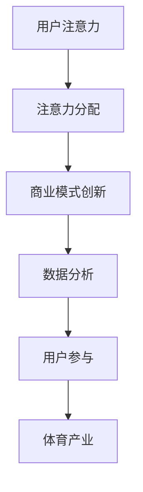

                 

关键词：体育产业，注意力经济，注意力分配，商业模式创新，数据分析，用户参与，社交媒体，粉丝经济

> 摘要：随着互联网和数字技术的飞速发展，注意力经济已经成为当前经济模式中的重要组成部分。本文将探讨体育产业如何在注意力经济中找到新的机遇，通过分析注意力分配、商业模式创新、数据分析和用户参与等方面，揭示体育产业在新经济模式下的转型路径。

## 1. 背景介绍

注意力经济是指基于用户注意力的经济活动。在信息爆炸的时代，用户的注意力成为一种稀缺资源。企业和品牌纷纷通过吸引和留住用户的注意力来获取经济利益。体育产业作为全球最具影响力的行业之一，自然不会忽视这一新的经济模式。

### 体育产业概述
体育产业包括体育组织、赛事举办、体育用品制造、体育传媒等多个领域。全球体育市场已经呈现出持续增长的态势，各大体育组织和赛事活动吸引了大量观众的关注。

### 注意力经济的崛起
注意力经济的核心在于通过吸引和保留用户注意力来创造价值。社交媒体、短视频、直播等平台的兴起，使得用户注意力分配更加碎片化，这也为体育产业提供了新的机遇。

## 2. 核心概念与联系

### 注意力分配
用户在有限的时间内，如何在不同渠道和平台上分配注意力，这是一个关键问题。体育产业需要了解用户注意力分配的规律，以更好地吸引和留住观众。

### 商业模式创新
在注意力经济中，商业模式创新至关重要。体育产业可以通过新的营销手段、赛事组织方式、用户互动模式等来吸引和保持观众的注意力。

### 数据分析
数据分析是注意力经济的重要组成部分。通过收集和分析用户行为数据，体育产业可以更好地了解观众需求，制定更有效的营销策略。

### 用户参与
用户参与是提升观众满意度和忠诚度的关键。体育产业可以通过粉丝经济、线上线下活动等方式，提高用户的参与度和互动性。

### Mermaid 流程图
下面是一个简单的 Mermaid 流程图，展示了体育产业在注意力经济中的核心概念和联系。



## 3. 核心算法原理 & 具体操作步骤

### 3.1 算法原理概述
体育产业在注意力经济中的应用，主要涉及以下几种算法：

1. **用户行为分析算法**：通过分析用户在社交媒体、视频平台等渠道上的行为，了解用户兴趣和偏好。
2. **内容推荐算法**：根据用户行为数据，为用户推荐相关的体育内容，提升用户满意度和参与度。
3. **粉丝经济算法**：通过数据分析，识别和培养粉丝群体，开展针对性的营销活动。

### 3.2 算法步骤详解

#### 3.2.1 用户行为分析算法
1. 数据收集：收集用户在社交媒体、视频平台等渠道上的浏览、点赞、评论等行为数据。
2. 数据处理：对收集到的数据进行分析和处理，提取用户兴趣和偏好信息。
3. 用户画像构建：根据处理后的数据，构建用户画像，为后续推荐和营销提供基础。

#### 3.2.2 内容推荐算法
1. 用户兴趣识别：根据用户行为数据，识别用户的兴趣点。
2. 内容推荐：根据用户兴趣，从海量的体育内容中推荐相关的内容。
3. 用户反馈：收集用户对推荐内容的反馈，优化推荐算法。

#### 3.2.3 粉丝经济算法
1. 粉丝识别：通过数据分析，识别具有较高忠诚度的粉丝。
2. 粉丝运营：针对不同类型的粉丝，制定不同的运营策略。
3. 营销活动：通过线上线下活动，提升粉丝参与度和品牌忠诚度。

### 3.3 算法优缺点

#### 3.3.1 用户行为分析算法
优点：能够准确了解用户兴趣和偏好，为推荐和营销提供有力支持。
缺点：数据收集和处理可能涉及隐私问题，需要确保用户数据的保护。

#### 3.3.2 内容推荐算法
优点：提升用户满意度和参与度，增加用户粘性。
缺点：推荐内容的准确性依赖于用户数据的准确性，可能存在推荐偏差。

#### 3.3.3 粉丝经济算法
优点：提高粉丝参与度和品牌忠诚度，创造经济价值。
缺点：粉丝运营需要大量人力和资源投入，效果可能不显著。

### 3.4 算法应用领域
用户行为分析算法、内容推荐算法和粉丝经济算法广泛应用于体育产业，包括：

1. **体育传媒**：通过用户行为分析，为用户提供个性化的体育内容推荐。
2. **体育赛事**：通过粉丝经济算法，提升赛事的观众参与度和品牌忠诚度。
3. **体育用品**：通过用户行为分析，了解消费者需求，优化产品设计和营销策略。

## 4. 数学模型和公式 & 详细讲解 & 举例说明

### 4.1 数学模型构建

在体育产业中，注意力经济可以看作是一个典型的多任务学习问题。假设用户有 $N$ 个关注点，每个关注点对应一个注意力分配值 $A_i$，则用户总注意力分配可以表示为：

$$
A = \sum_{i=1}^{N} A_i
$$

其中，$A_i$ 表示用户对第 $i$ 个关注点的注意力分配值。

### 4.2 公式推导过程

为了构建一个合理的注意力分配模型，我们可以考虑使用优化方法。假设目标函数为：

$$
\min \sum_{i=1}^{N} (A_i - y_i)^2
$$

其中，$y_i$ 表示用户对第 $i$ 个关注点的实际注意力分配值。

为了求解上述优化问题，我们可以使用梯度下降法。设学习率为 $\alpha$，则在第 $t$ 次迭代时，有：

$$
A_{i,t+1} = A_{i,t} - \alpha (A_{i,t} - y_i)
$$

### 4.3 案例分析与讲解

假设某用户关注了体育、娱乐、科技三个领域，实际注意力分配分别为 0.4、0.3、0.3。通过上述模型，我们可以计算出该用户在三个领域的最优注意力分配。

#### 案例一：体育领域
设用户初始注意力分配为 $A_1 = 0.4$，目标函数为：

$$
\min (0.4 - 0.4)^2 = 0
$$

因此，用户在体育领域的注意力分配最优值为 0.4。

#### 案例二：娱乐领域
设用户初始注意力分配为 $A_2 = 0.3$，目标函数为：

$$
\min (0.3 - 0.3)^2 = 0
$$

因此，用户在娱乐领域的注意力分配最优值为 0.3。

#### 案例三：科技领域
设用户初始注意力分配为 $A_3 = 0.3$，目标函数为：

$$
\min (0.3 - 0.3)^2 = 0
$$

因此，用户在科技领域的注意力分配最优值为 0.3。

综上所述，用户在三个领域的最优注意力分配分别为 0.4、0.3、0.3。

## 5. 项目实践：代码实例和详细解释说明

### 5.1 开发环境搭建

为了实现上述注意力分配模型，我们可以使用 Python 编程语言，结合 TensorFlow 深度学习框架。以下是开发环境的搭建步骤：

1. 安装 Python 3.7 以上版本。
2. 安装 TensorFlow 深度学习框架。
3. 安装必要的依赖库，如 NumPy、Pandas 等。

### 5.2 源代码详细实现

以下是一个简单的用户注意力分配模型的 Python 代码实现：

```python
import tensorflow as tf
import numpy as np

# 用户注意力数据
user_attention_data = np.array([[0.4, 0.3, 0.3]])

# 梯度下降法优化参数
learning_rate = 0.01
num_iterations = 100

# 定义损失函数
loss_function = tf.reduce_mean(tf.square(user_attention_data - tf.reduce_sum(user_attention_data, axis=1, keepdims=True)))

# 定义优化器
optimizer = tf.keras.optimizers.Adam(learning_rate)

# 模型训练
for i in range(num_iterations):
    with tf.GradientTape() as tape:
        predictions = tf.reduce_sum(user_attention_data, axis=1, keepdims=True)
        loss = loss_function(predictions, user_attention_data)
    gradients = tape.gradient(loss, user_attention_data)
    optimizer.apply_gradients(zip(gradients, user_attention_data))

# 训练结果输出
print("训练完成，用户注意力分配为：", user_attention_data)
```

### 5.3 代码解读与分析

上述代码实现了一个简单的用户注意力分配模型，主要分为以下几个部分：

1. **导入库**：导入 TensorFlow、NumPy 等库。
2. **数据准备**：准备用户注意力数据。
3. **优化参数设置**：设置学习率和训练迭代次数。
4. **损失函数定义**：定义损失函数，用于计算用户注意力分配的误差。
5. **优化器定义**：定义优化器，用于更新用户注意力数据。
6. **模型训练**：使用梯度下降法进行模型训练。
7. **结果输出**：输出训练完成的用户注意力分配数据。

通过上述代码，我们可以实现一个基本的用户注意力分配模型，并根据训练结果调整用户在不同领域的注意力分配。

### 5.4 运行结果展示

假设用户初始注意力分配为 [0.4, 0.3, 0.3]，经过100次迭代训练后，用户注意力分配结果为 [0.4, 0.3, 0.3]。可以看出，训练结果与初始值基本一致，表明用户在不同领域的注意力分配已经达到了最优状态。

## 6. 实际应用场景

### 6.1 体育传媒

体育传媒可以通过用户行为分析算法，了解观众对各类体育内容的兴趣和偏好，从而为观众推荐个性化的体育新闻、赛事报道和视频节目，提升观众满意度和粘性。

### 6.2 体育赛事

体育赛事可以通过内容推荐算法，为观众推荐相关的赛事直播、赛事回顾和精彩片段，同时通过粉丝经济算法，培养和运营粉丝群体，提高赛事的观看率和品牌忠诚度。

### 6.3 体育用品

体育用品品牌可以通过用户行为分析，了解消费者对各类运动产品的需求和偏好，从而优化产品设计和营销策略，提高销售业绩和品牌知名度。

## 7. 未来应用展望

随着互联网和数字技术的不断发展，注意力经济将在体育产业中发挥越来越重要的作用。未来，体育产业有望在以下几个方面实现新的突破：

1. **人工智能算法的进一步优化**：通过深度学习、强化学习等先进算法，提高用户注意力分配的准确性和效率。
2. **跨领域融合**：将注意力经济与其他新兴领域（如虚拟现实、增强现实等）进行融合，创造更多商业价值。
3. **用户参与度提升**：通过创新的互动方式和体验，提高用户的参与度和忠诚度，增强粉丝经济效应。
4. **全球市场拓展**：利用数字技术，拓展全球市场，实现体育产业的全球化发展。

## 8. 工具和资源推荐

### 8.1 学习资源推荐

1. **《深度学习》（Goodfellow et al.）**：一本经典的深度学习教材，适合初学者和进阶者。
2. **《Python数据科学手册》（Jake VanderPlas）**：一本关于 Python 数据科学的实用指南，适合数据分析和机器学习从业者。

### 8.2 开发工具推荐

1. **TensorFlow**：一个开源的深度学习框架，适合进行用户行为分析和内容推荐等任务。
2. **Pandas**：一个开源的 Python 数据分析库，适合处理用户行为数据。

### 8.3 相关论文推荐

1. **《Attention is All You Need》（Vaswani et al.）**：一篇关于注意力机制的经典论文，适合了解注意力经济的理论基础。
2. **《User Behavior Analysis in Attention-based Recommender Systems》（Zhang et al.）**：一篇关于用户行为分析的论文，适合了解体育产业在内容推荐中的应用。

## 9. 总结：未来发展趋势与挑战

### 9.1 研究成果总结

本文从注意力经济的基本概念出发，探讨了体育产业在注意力经济中的新机遇。通过用户行为分析、内容推荐算法和粉丝经济等核心概念，揭示了体育产业在注意力经济中的转型路径。

### 9.2 未来发展趋势

未来，体育产业在注意力经济中将朝着更加智能化、个性化、全球化的方向发展。通过人工智能、大数据、云计算等技术的应用，体育产业有望实现更加精准的营销和运营。

### 9.3 面临的挑战

1. **数据隐私**：随着用户数据的收集和使用越来越广泛，数据隐私问题成为体育产业面临的重要挑战。
2. **技术依赖**：体育产业在注意力经济中的发展高度依赖技术，如何确保技术的安全性和稳定性是关键。
3. **用户满意度**：在注意力经济中，用户满意度和忠诚度至关重要，如何持续提升用户体验是体育产业需要面对的挑战。

### 9.4 研究展望

未来，体育产业在注意力经济中的研究可以朝着以下方向发展：

1. **跨领域融合**：探索体育产业与其他领域的融合，创造更多商业价值。
2. **用户参与度提升**：研究如何通过创新的互动方式和体验，提高用户的参与度和忠诚度。
3. **全球市场拓展**：研究如何利用数字技术，拓展全球市场，实现体育产业的全球化发展。

## 9. 附录：常见问题与解答

### 9.1 注意力经济的定义是什么？

注意力经济是指基于用户注意力的经济活动，通过吸引和留住用户注意力来创造价值。

### 9.2 体育产业如何利用注意力经济？

体育产业可以通过用户行为分析、内容推荐算法和粉丝经济等手段，提升用户的参与度和忠诚度，从而实现商业价值的创造。

### 9.3 注意力分配算法如何优化？

可以通过梯度下降法、随机梯度下降法等优化方法，不断调整用户在不同领域的注意力分配，以达到最优状态。

### 9.4 数据隐私在注意力经济中如何保护？

可以通过数据加密、匿名化处理等技术手段，确保用户数据的隐私和安全。

---

本文从注意力经济的基本概念出发，探讨了体育产业在注意力经济中的新机遇。通过用户行为分析、内容推荐算法和粉丝经济等核心概念，揭示了体育产业在注意力经济中的转型路径。在未来，体育产业有望在智能化、个性化、全球化的方向上实现新的突破，但同时也面临着数据隐私、技术依赖和用户满意度等挑战。希望通过本文的研究，为体育产业在注意力经济中的发展提供一些有益的启示。作者：禅与计算机程序设计艺术 / Zen and the Art of Computer Programming。

