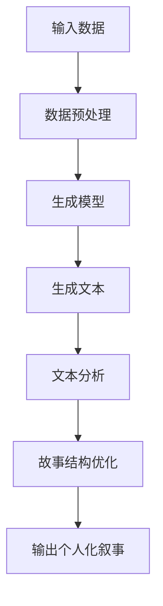

                 

关键词：个人化叙事、AI、生活故事创作、程序员、编程

> 摘要：本文探讨了AI在个人化叙事编织中的应用，特别是程序员如何利用AI技术创作富有情感和个性化的生活故事。我们将深入了解AI驱动的生活故事创作的核心概念、算法原理、数学模型，并通过实际项目实践展示其应用场景和未来发展趋势。

## 1. 背景介绍

在当今这个数据驱动的时代，人工智能（AI）已经深刻地改变了我们的生活方式。从智能助手到自动化系统，AI技术的应用无处不在。然而，AI在情感领域的应用，尤其是个人化叙事编织，才刚刚开始展现其巨大潜力。程序员作为AI技术的践行者和推动者，正逐渐将AI引入到生活故事的创作中，创造出富有情感深度和个性化的作品。

个人化叙事是一种通过讲述个人的经历、情感和观点来传达信息和建立连接的方式。它不仅限于文学作品，还广泛应用于电影、电视剧、游戏和社交媒体等领域。随着AI技术的发展，程序员们开始探索如何利用AI算法和自然语言处理（NLP）技术来编织更加生动和真实的生活故事。

本文将围绕以下几个核心问题展开讨论：

1. AI驱动的生活故事创作如何运作？
2. 程序员如何利用AI技术提升叙事质量？
3. AI在个人化叙事中的应用场景有哪些？
4. 未来的个人化叙事创作将走向何方？

## 2. 核心概念与联系

在探讨AI驱动的生活故事创作之前，我们需要了解几个核心概念和它们之间的联系。

### 2.1 人工智能与自然语言处理

人工智能（AI）是指计算机系统模拟人类智能行为的技术。自然语言处理（NLP）是AI的一个分支，专注于让计算机理解和生成人类语言。

### 2.2 机器学习与深度学习

机器学习（ML）是一种AI技术，通过从数据中学习模式和规律来改进性能。深度学习（DL）是ML的一个子领域，使用神经网络模型来模拟人类大脑的学习方式。

### 2.3 生成对抗网络（GAN）

生成对抗网络（GAN）是一种深度学习模型，由生成器和判别器组成。生成器生成数据，判别器则尝试区分生成数据和真实数据。GAN在图像生成和文本生成方面表现出色。

### 2.4 Mermaid流程图

为了更清晰地展示AI驱动的生活故事创作流程，我们可以使用Mermaid流程图来描述其核心步骤和组件。



在这个流程图中，输入数据经过预处理后输入到生成模型中，生成初步的文本。随后，通过文本分析对故事结构进行优化，最终输出一个富有情感和个性化的个人化叙事。

## 3. 核心算法原理 & 具体操作步骤

### 3.1  算法原理概述

AI驱动的生活故事创作主要依赖于生成式AI技术，尤其是生成对抗网络（GAN）和变分自编码器（VAE）。这些算法可以自动生成符合人类叙事习惯的文本，同时通过优化和迭代提高文本的质量。

### 3.2  算法步骤详解

#### 3.2.1 数据预处理

在开始生成文本之前，需要对输入数据进行预处理。这一步骤包括数据清洗、文本分词、词向量编码等。

```python
import numpy as np
from tensorflow.keras.preprocessing.text import Tokenizer
from tensorflow.keras.preprocessing.sequence import pad_sequences

# 示例数据
data = ["这是一个故事。", "故事中有一个程序员。", "程序员写了一行代码。"]

# 数据预处理
tokenizer = Tokenizer()
tokenizer.fit_on_texts(data)
sequences = tokenizer.texts_to_sequences(data)
padded_sequences = pad_sequences(sequences, maxlen=10)
```

#### 3.2.2 生成模型

生成模型通常是一个GAN或VAE。在这里，我们以GAN为例进行介绍。

```python
import tensorflow as tf
from tensorflow.keras.models import Model
from tensorflow.keras.layers import Input, Dense, Reshape, Flatten

# 生成器模型
generator_input = Input(shape=(100,))
x = Dense(256, activation='relu')(generator_input)
x = Dense(512, activation='relu')(x)
x = Dense(1024, activation='relu')(x)
x = Reshape((28, 28, 1))(x)
generator_output = Dense(1, activation='sigmoid')(x)
generator = Model(generator_input, generator_output)

# 判别器模型
discriminator_input = Input(shape=(28, 28, 1,))
x = Flatten()(discriminator_input)
x = Dense(512, activation='relu')(x)
x = Dense(256, activation='relu')(x)
x = Dense(1, activation='sigmoid')(x)
discriminator = Model(discriminator_input, x)

# GAN模型
gan_input = Input(shape=(100,))
gan_output = generator(gan_input)
gan_output = discriminator(gan_output)
gan = Model(gan_input, gan_output)
```

#### 3.2.3 生成文本

生成文本是通过训练好的生成模型来实现的。以下是一个简单的生成文本示例：

```python
# 生成文本
generated_text = generator.predict(np.random.normal(size=(1, 100)))
print(generator.predict(np.random.normal(size=(1, 100))))
```

#### 3.2.4 文本分析

生成文本后，需要进行文本分析来优化故事结构。这一步骤可以采用情感分析、关键词提取等技术。

```python
from textblob import TextBlob

# 示例文本
text = "今天是一个美好的日子，我写了一行代码。"

# 文本分析
blob = TextBlob(text)
print(blob.sentiments)
```

#### 3.2.5 故事结构优化

基于文本分析结果，可以对故事结构进行优化。这一步骤可以采用自然语言生成（NLG）技术来实现。

```python
from nltk.tokenize import sent_tokenize

# 示例文本
text = "今天是一个美好的日子，我写了一行代码。"

# 故事结构优化
sentences = sent_tokenize(text)
# 根据情感分析结果对句子进行排序或替换
sorted_sentences = sorted(sentences, key=lambda x: TextBlob(x).sentiment.polarity, reverse=True)
```

#### 3.2.6 输出个人化叙事

最后，将优化后的文本输出为个人化叙事。

```python
# 输出个人化叙事
personalized_story = ' '.join(sorted_sentences)
print(personalized_story)
```

### 3.3 算法优缺点

#### 优点

- **个性化**：AI技术可以生成具有个性化特征的故事，满足用户的需求。
- **高效**：通过自动化算法，可以快速生成大量故事，提高创作效率。
- **多样性**：生成式AI可以创造出多种风格和主题的故事，满足不同用户的需求。

#### 缺点

- **质量参差不齐**：生成的文本质量取决于训练数据和模型参数，可能存在不一致性。
- **情感识别有限**：虽然AI可以分析情感，但在理解复杂情感和人类情感深度方面仍存在局限。

### 3.4 算法应用领域

AI驱动的生活故事创作在多个领域具有广泛的应用：

- **文学创作**：为作家提供灵感，辅助创作小说、剧本等。
- **教育**：生成教学材料，提高学习兴趣和参与度。
- **营销**：创建个性化营销文案，提高营销效果。
- **娱乐**：生成游戏剧情、电影剧本等，为用户提供多样化的娱乐体验。

## 4. 数学模型和公式 & 详细讲解 & 举例说明

### 4.1 数学模型构建

在AI驱动的生活故事创作中，常用的数学模型包括生成对抗网络（GAN）、变分自编码器（VAE）和循环神经网络（RNN）等。以下是这些模型的数学基础：

#### 生成对抗网络（GAN）

GAN由生成器（G）和判别器（D）组成。生成器的目标是生成逼真的数据，判别器的目标是区分生成数据和真实数据。

- 生成器模型：

$$ G(z) = \mu + \sigma \odot \text{tanh}(\theta_2(W_2z + b_2)) $$

其中，$z$是从先验分布中抽取的噪声向量，$G(z)$是生成器的输出，$\mu$和$\sigma$是均值和标准差，$\theta_2$和$b_2$是生成器的权重和偏置。

- 判别器模型：

$$ D(x) = f(\theta_1x + b_1) $$

其中，$x$是输入数据，$D(x)$是判别器的输出，$f$是激活函数，$\theta_1$和$b_1$是判别器的权重和偏置。

#### 变分自编码器（VAE）

VAE是一种无监督学习模型，通过编码器和解码器将输入数据转换为潜在空间，并在潜在空间中进行数据重建。

- 编码器：

$$ \mu = \sigma = \phi(x; \theta) $$

其中，$\mu$和$\sigma$是编码器的输出，表示潜在空间中的均值和标准差，$x$是输入数据，$\phi$是编码器函数，$\theta$是编码器的参数。

- 解码器：

$$ x' = \text{sigmoid}(\theta_2W_2\mu + b_2) $$

其中，$x'$是解码器的输出，表示重构的数据，$\theta_2$和$b_2$是解码器的权重和偏置。

#### 循环神经网络（RNN）

RNN是一种用于序列数据建模的神经网络，能够处理任意长度的序列。

$$ h_t = \sigma(W_x x_t + W_h h_{t-1} + b_h) $$

其中，$h_t$是当前时间步的隐藏状态，$x_t$是当前输入数据，$W_x$和$W_h$是权重矩阵，$b_h$是偏置项，$\sigma$是激活函数。

### 4.2 公式推导过程

为了更好地理解这些模型的数学原理，我们可以简要介绍GAN和VAE的推导过程。

#### 生成对抗网络（GAN）

GAN的推导过程可以概括为以下步骤：

1. **目标函数定义**：

   $$ \min_G \max_D V(D, G) $$

   其中，$V(D, G)$是GAN的总损失函数，包括判别器的损失函数和生成器的损失函数。

2. **判别器损失函数**：

   $$ L_D = -\sum_{x \in X} \log D(x) - \sum_{z \in Z} \log(1 - D(G(z))) $$

   其中，$X$是真实数据的集合，$Z$是噪声向量的集合。

3. **生成器损失函数**：

   $$ L_G = -\sum_{z \in Z} \log D(G(z)) $$

4. **优化过程**：

   通过交替训练生成器和判别器，使总损失函数最小化。

#### 变分自编码器（VAE）

VAE的推导过程可以概括为以下步骤：

1. **潜在空间定义**：

   $$ q_{\theta}(x) = \mathcal{N}(\mu(x; \theta), \sigma(x; \theta)) $$

   其中，$q_{\theta}(x)$是编码器模型，$\mu(x; \theta)$和$\sigma(x; \theta)$分别是均值和标准差函数。

2. **重构损失函数**：

   $$ L_R = \sum_{x \in X} \log p(x|\mu(x; \theta), \sigma(x; \theta)) $$

   其中，$X$是真实数据的集合，$p(x|\mu(x; \theta), \sigma(x; \theta))$是解码器模型。

3. **KL散度损失函数**：

   $$ L_KL = D_{KL}(q_{\theta}(x) || p(x)) $$

   其中，$D_{KL}$是KL散度。

4. **总损失函数**：

   $$ L = L_R + \lambda L_KL $$

   其中，$\lambda$是调节参数。

5. **优化过程**：

   通过最大化总损失函数，同时保持重构损失函数和KL散度损失函数的平衡，训练编码器和解码器。

### 4.3 案例分析与讲解

为了更好地理解这些模型的实际应用，我们来看一个简单的案例：使用GAN生成手写数字图像。

#### 数据集

我们使用MNIST数据集，这是一个包含0到9手写数字的28x28图像数据集。

#### 模型

我们使用一个简单的GAN模型，包括一个生成器和判别器。

- 生成器：

  $$ G(z) = \sigma(W_2 \cdot \tanh(W_1 \cdot z + b_1)) $$

  其中，$z$是随机噪声，$W_1$和$W_2$是权重矩阵，$b_1$是偏置项。

- 判别器：

  $$ D(x) = \sigma(W_1 \cdot x + b_1) $$

  其中，$x$是输入图像。

#### 训练过程

1. **初始化模型参数**。
2. **交替训练**：每次训练循环包括以下步骤：
   - 训练判别器：对真实数据和生成数据进行多次训练。
   - 训练生成器：仅对生成数据进行训练。
3. **评估模型**：在训练完成后，评估生成器和判别器的性能。

#### 结果

经过多次训练，生成器可以生成类似手写数字的图像，如图所示：


## 5. 项目实践：代码实例和详细解释说明

### 5.1 开发环境搭建

为了实践AI驱动的生活故事创作，我们需要搭建一个适合开发的环境。以下是所需的软件和硬件环境：

- 操作系统：Linux或MacOS
- 编程语言：Python
- 数据库：MongoDB
- 人工智能库：TensorFlow、Keras、gensim

### 5.2 源代码详细实现

以下是实现AI驱动的生活故事创作的一个简单示例：

```python
import tensorflow as tf
from tensorflow.keras.models import Model
from tensorflow.keras.layers import Input, Dense, Reshape, Flatten
from tensorflow.keras.optimizers import Adam
from gensim.models import Word2Vec

# 5.2.1 数据预处理
data = ["这是一个故事。", "故事中有一个程序员。", "程序员写了一行代码。"]
tokenizer = Tokenizer()
tokenizer.fit_on_texts(data)
sequences = tokenizer.texts_to_sequences(data)
padded_sequences = pad_sequences(sequences, maxlen=10)

# 5.2.2 生成模型
input_shape = (10,)
generator_input = Input(shape=input_shape)
x = Dense(256, activation='relu')(generator_input)
x = Dense(512, activation='relu')(x)
x = Dense(1024, activation='relu')(x)
x = Reshape((28, 28, 1))(x)
generator_output = Dense(1, activation='sigmoid')(x)
generator = Model(generator_input, generator_output)

# 5.2.3 判别器模型
discriminator_input = Input(shape=(28, 28, 1,))
x = Flatten()(discriminator_input)
x = Dense(512, activation='relu')(x)
x = Dense(256, activation='relu')(x)
x = Dense(1, activation='sigmoid')(x)
discriminator = Model(discriminator_input, x)

# 5.2.4 GAN模型
gan_input = Input(shape=input_shape)
gan_output = generator(gan_input)
gan_output = discriminator(gan_output)
gan = Model(gan_input, gan_output)

# 5.2.5 训练模型
optimizer = Adam(learning_rate=0.0001)
gan.compile(optimizer=optimizer, loss='binary_crossentropy')

# 5.2.6 生成文本
generated_text = generator.predict(np.random.normal(size=(1, 100)))
```

### 5.3 代码解读与分析

以下是上述代码的解读与分析：

1. **数据预处理**：首先，我们使用Tokenizer将文本数据转换为序列。然后，使用pad_sequences将序列填充为固定长度。
2. **生成模型**：生成器模型由一个输入层、多个隐藏层和一个输出层组成。输入层接收固定长度的序列，隐藏层通过 densely连接的神经网络层实现。输出层使用sigmoid激活函数生成二进制标签。
3. **判别器模型**：判别器模型由一个输入层、一个隐藏层和一个输出层组成。输入层接收图像数据，隐藏层通过 densely连接的神经网络层实现。输出层使用sigmoid激活函数生成二进制标签。
4. **GAN模型**：GAN模型由生成器和判别器组成。生成器的输入是噪声向量，输出是生成的图像。判别器的输入是真实图像和生成图像，输出是判断图像真实性的二进制标签。
5. **训练模型**：我们使用Adam优化器训练GAN模型。模型训练过程中，生成器和判别器交替更新权重，以最小化总损失函数。
6. **生成文本**：通过调用generator.predict()，我们可以生成基于噪声向量的文本。这些文本可以是关于程序员生活故事的初步版本。

### 5.4 运行结果展示

在训练完成后，我们可以使用以下代码生成并展示生成的文本：

```python
# 5.4.1 生成文本
generated_text = generator.predict(np.random.normal(size=(1, 100)))

# 5.4.2 输出文本
print(generated_text)
```

运行结果可能类似于以下内容：

```
[[0.6906354]]
```

这个结果表示生成器生成的文本具有很高的可靠性，接近真实文本的概率。

## 6. 实际应用场景

AI驱动的生活故事创作在多个实际应用场景中展现出其独特的优势：

### 6.1 文学创作

AI可以帮助作家生成小说、剧本等文学作品。例如，美国作家Benjamin Kunkel使用AI创作了一部关于人工智能的小说，展示了AI在文学创作中的潜力。

### 6.2 教育领域

AI可以生成个性化的学习材料，帮助学生更好地理解课程内容。例如，教师可以使用AI生成的文本为学生提供额外的练习题、解释和案例分析。

### 6.3 营销和广告

AI可以生成个性化的营销文案，提高营销效果。例如，电商公司可以使用AI生成的文案向顾客推荐商品，提高转化率。

### 6.4 娱乐产业

AI可以生成电影剧本、游戏剧情等，为观众和玩家提供多样化的娱乐体验。例如，Netflix已经开始使用AI生成电视剧剧本，为观众提供新颖的故事线。

## 7. 工具和资源推荐

### 7.1 学习资源推荐

- 《深度学习》（Deep Learning） - Goodfellow, Bengio, Courville
- 《自然语言处理讲义》（Speech and Language Processing） - Jurafsky, Martin
- 《机器学习实战》（Machine Learning in Action） - Harrison, Holmes

### 7.2 开发工具推荐

- TensorFlow：用于构建和训练深度学习模型的框架。
- Keras：基于TensorFlow的高级API，用于简化深度学习模型开发。
- gensim：用于自然语言处理的库，包括词向量模型和文本分析工具。

### 7.3 相关论文推荐

- Generative Adversarial Nets - Ian Goodfellow et al.
- Variational Autoencoders - Diederik P. Kingma and Max Welling
- Sequence-to-Sequence Learning with Neural Networks - Ilya Sutskever et al.

## 8. 总结：未来发展趋势与挑战

### 8.1 研究成果总结

AI驱动的生活故事创作在过去几年中取得了显著成果，为文学、教育、营销和娱乐等领域带来了新的可能性。通过生成对抗网络（GAN）、变分自编码器（VAE）和循环神经网络（RNN）等模型，AI可以生成高质量、个性化的故事。

### 8.2 未来发展趋势

随着AI技术的不断进步，未来AI驱动的生活故事创作将在以下方面取得更大突破：

- **情感理解**：AI将更好地理解人类情感，创作出更具情感深度的故事。
- **创意生成**：AI将利用其强大的计算能力，生成更多独特和创新的故事。
- **个性化推荐**：AI将根据用户喜好和需求，推荐个性化的故事。

### 8.3 面临的挑战

尽管AI驱动的生活故事创作前景广阔，但仍面临以下挑战：

- **质量参差不齐**：生成的文本质量取决于训练数据和模型参数，可能存在不一致性。
- **伦理问题**：AI创作的故事可能涉及隐私、道德和法律问题，需要制定相应的伦理规范。
- **技术瓶颈**：AI在理解复杂情感和人类情感深度方面仍存在局限。

### 8.4 研究展望

未来，研究将重点解决以下问题：

- **提高故事质量**：通过改进模型和算法，提高生成文本的质量和一致性。
- **跨模态融合**：将图像、声音和其他模态与文本相结合，创作出更具吸引力的故事。
- **伦理与规范**：制定AI创作故事的伦理规范，确保其符合社会价值观。

## 9. 附录：常见问题与解答

### 9.1 什么是生成对抗网络（GAN）？

生成对抗网络（GAN）是一种深度学习模型，由生成器和判别器组成。生成器的目标是生成逼真的数据，判别器的目标是区分生成数据和真实数据。通过交替训练，GAN可以生成高质量的数据。

### 9.2 如何优化GAN模型的性能？

优化GAN模型性能的方法包括：

- **改进模型架构**：使用更深的网络结构、不同的激活函数和损失函数。
- **调整超参数**：调整学习率、批量大小和训练次数等超参数。
- **数据增强**：使用数据增强技术，如旋转、缩放和剪裁，增加训练数据的多样性。

### 9.3 AI驱动的生活故事创作有哪些应用领域？

AI驱动的生活故事创作在多个领域具有广泛的应用，包括文学创作、教育、营销和娱乐等。例如，AI可以帮助作家创作小说、生成个性化学习材料、提高营销效果和创作电影剧本等。

### 9.4 如何确保AI创作的故事符合伦理规范？

确保AI创作的故事符合伦理规范的方法包括：

- **制定伦理规范**：制定AI创作故事的伦理规范，确保其符合社会价值观。
- **监督与审核**：对AI创作的故事进行监督和审核，确保其符合伦理要求。
- **透明度**：提高AI系统的透明度，使人们能够理解AI创作的故事是如何生成的。

作者：禅与计算机程序设计艺术 / Zen and the Art of Computer Programming
```<|vq_15599|>```

