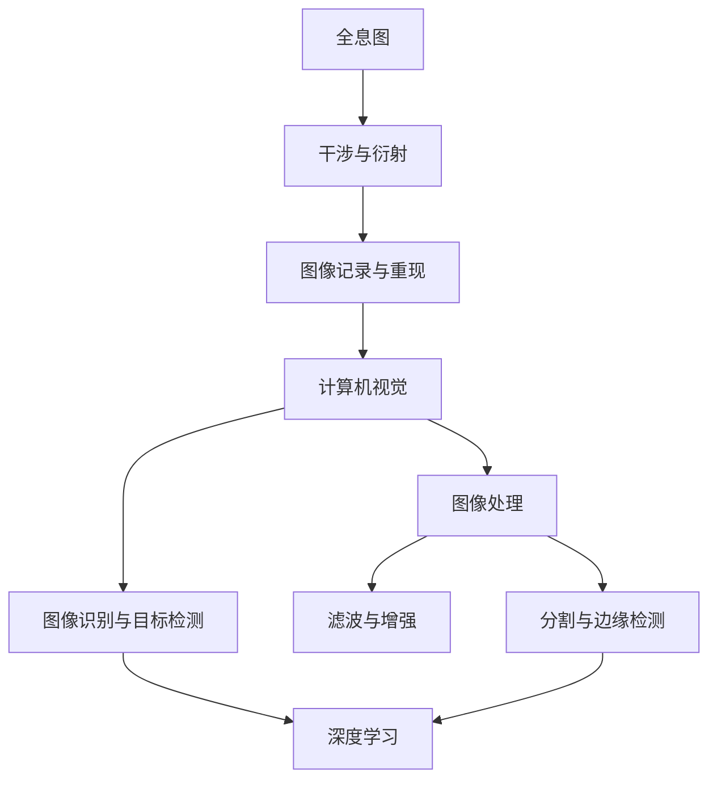

                 

关键词：全息图技术、人工智能、多感官融合、虚拟现实、增强现实、人机交互、混合现实、全息显示、计算机视觉、图像处理、深度学习

> 摘要：本文旨在探讨全息图技术及其与人工智能的深度融合，介绍一名全息图工程师在多感官融合领域的实践与探索。通过剖析核心算法原理、数学模型、项目实践，以及未来应用展望，本文将为读者呈现全息图技术的广泛潜力与挑战。

## 1. 背景介绍

全息图（Hologram）是一种通过激光束记录和再现三维图像的技术，其独特的立体感与真实感在虚拟现实（VR）和增强现实（AR）领域引起了广泛关注。然而，传统的全息技术存在成本高、设备复杂、显示效果有限等挑战。随着人工智能（AI）技术的迅猛发展，尤其是计算机视觉、图像处理和深度学习领域的突破，AI驱动的全息图技术逐渐成为研究热点。

AI驱动的全息图技术不仅提高了图像质量，还实现了更高效的图像生成与处理，为多感官融合提供了新的可能性。本文将从全息图工程师的视角出发，探讨这一领域的技术进展与应用场景。

### 1.1 多感官融合技术的意义

多感官融合技术通过整合视觉、听觉、触觉等多种感官信息，提供更加丰富和自然的交互体验。在虚拟现实、增强现实和混合现实（MR）中，多感官融合技术是构建沉浸式体验的核心。全息图技术作为三维显示的重要手段，与人工智能的融合为多感官融合提供了强有力的支持。

### 1.2 人工智能在多感官融合中的应用

人工智能在多感官融合中的应用主要体现在以下几个方面：

- **计算机视觉**：通过图像识别、目标检测等技术，AI能够准确捕捉和解析现实世界中的视觉信息，为全息图的生成提供数据支持。
- **图像处理**：AI算法能够对全息图像进行优化和增强，提高图像质量和清晰度，实现更加真实的三维显示效果。
- **深度学习**：通过深度学习模型，AI可以自动学习和优化全息图生成过程，提高生成效率和效果。
- **人机交互**：AI技术为人机交互提供了智能化支持，如语音识别、手势识别等，使全息图技术更加易用和自然。

## 2. 核心概念与联系

为了深入理解AI驱动的全息图技术，我们需要明确以下几个核心概念：

- **全息图**：全息图是一种记录并重现三维图像的图样，通过干涉和衍射原理实现。它包含了物体的光波信息，可以用来生成真实感强烈的三维图像。
- **计算机视觉**：计算机视觉是指使计算机能够像人眼一样感知和理解图像的技术，包括图像识别、目标检测等。
- **图像处理**：图像处理是对图像进行数字操作，以提高图像质量或提取有用信息的过程，如滤波、增强、分割等。
- **深度学习**：深度学习是一种基于多层神经网络的人工智能技术，通过大量数据训练模型，实现复杂的数据分析和模式识别。

以下是全息图、计算机视觉、图像处理和深度学习之间关系的Mermaid流程图：



### 2.1 全息图的生成与显示

全息图的生成过程包括三个主要步骤：干涉、衍射和记录。干涉是通过两束激光的叠加产生干涉条纹，这些条纹包含了物体的光波信息。衍射则是利用全息膜或全息板将干涉条纹记录下来。最后，记录过程将干涉图样存储为全息图。

显示全息图时，需要将全息图上的干涉条纹重新照射到观察者眼前，通过眼睛的视觉处理，重现出三维图像。全息图的显示通常依赖于特殊的光学装置，如激光投影仪或全息显示器。

### 2.2 计算机视觉与图像处理

计算机视觉和图像处理在全息图技术中发挥着关键作用。计算机视觉技术用于捕捉和处理全息图所需的三维信息，如图像识别和目标检测。图像处理技术则用于优化全息图像的质量，如滤波、增强和分割。

### 2.3 深度学习在图像生成与优化中的应用

深度学习模型，如卷积神经网络（CNN）和生成对抗网络（GAN），在全息图生成与优化中表现出色。通过训练大量的图像数据，深度学习模型能够自动学习和优化全息图生成的参数，提高生成效率和质量。

## 3. 核心算法原理 & 具体操作步骤

### 3.1 算法原理概述

AI驱动的全息图技术主要依赖于以下几个核心算法：

- **图像重建算法**：通过计算机视觉和图像处理技术，从二维图像重建出三维全息图。
- **图像增强算法**：利用深度学习模型，对全息图像进行优化，提高图像质量和清晰度。
- **图像合成算法**：通过深度学习模型，将全息图像与真实场景融合，实现虚拟与现实的交互。

### 3.2 算法步骤详解

#### 3.2.1 图像重建算法

图像重建算法的核心是利用计算机视觉技术捕捉真实场景的三维信息。具体步骤如下：

1. **图像捕获**：使用相机或传感器捕捉真实场景的二维图像。
2. **三维建模**：通过深度学习模型，将二维图像转换为三维模型。
3. **全息图生成**：利用干涉与衍射原理，将三维模型转换为全息图。

#### 3.2.2 图像增强算法

图像增强算法的目标是提高全息图像的质量和清晰度。具体步骤如下：

1. **图像预处理**：对全息图像进行去噪、去模糊等预处理操作。
2. **图像增强**：利用深度学习模型，对预处理后的图像进行增强。
3. **质量评估**：对增强后的图像进行质量评估，确保图像清晰度和真实感。

#### 3.2.3 图像合成算法

图像合成算法是将全息图像与真实场景融合，实现虚拟与现实的交互。具体步骤如下：

1. **场景识别**：利用计算机视觉技术，识别真实场景中的关键元素。
2. **图像融合**：将全息图像与真实场景进行融合，生成虚拟与现实的交互图像。
3. **效果优化**：对融合后的图像进行优化，提高视觉效果。

### 3.3 算法优缺点

#### 3.3.1 优点

- **高效性**：AI算法能够快速处理大量图像数据，提高全息图生成与优化的效率。
- **高质量**：深度学习模型能够自动学习和优化全息图生成的参数，提高生成图像的质量和清晰度。
- **多样性**：AI驱动的全息图技术可以实现多种形式的图像合成和融合，满足不同应用场景的需求。

#### 3.3.2 缺点

- **计算资源消耗**：深度学习模型训练和推理需要大量的计算资源，对硬件设备有较高要求。
- **数据依赖**：深度学习模型的性能依赖于大量高质量的数据，数据质量和数量直接影响算法效果。
- **实时性挑战**：实时处理大量图像数据对算法的实时性要求较高，需要优化算法以提高处理速度。

### 3.4 算法应用领域

AI驱动的全息图技术广泛应用于以下几个领域：

- **虚拟现实与增强现实**：通过全息图技术，实现更加真实和沉浸式的虚拟现实和增强现实体验。
- **医学影像**：利用全息图技术，提高医学影像的诊断准确性和视觉效果。
- **教育培训**：利用全息图技术，创造更加生动和直观的教育培训内容。
- **交互设计**：通过全息图技术，实现更加自然和直观的人机交互。

## 4. 数学模型和公式 & 详细讲解 & 举例说明

### 4.1 数学模型构建

AI驱动的全息图技术涉及到多个数学模型，主要包括：

1. **三维重建模型**：通过计算机视觉技术，将二维图像重建为三维模型，常用的模型包括深度神经网络（DNN）和稀疏编码（SC）。
2. **图像增强模型**：通过深度学习模型，对全息图像进行优化和增强，常用的模型包括生成对抗网络（GAN）和卷积神经网络（CNN）。
3. **图像合成模型**：将全息图像与真实场景融合，生成虚拟与现实的交互图像，常用的模型包括图像到图像的生成模型（如CycleGAN）和视频到视频的生成模型（如VideotoVideGAN）。

### 4.2 公式推导过程

下面以生成对抗网络（GAN）为例，简要介绍图像增强模型的公式推导过程。

GAN由两个主要部分组成：生成器（G）和判别器（D）。生成器的目标是生成逼真的图像，而判别器的目标是区分生成的图像和真实的图像。

1. **生成器（G）**

生成器G是一个从随机噪声z到图像x'的映射，即x' = G(z)。

损失函数通常采用最小化生成器与判别器之间的差异，即：

$$ L_G = -\mathbb{E}_{z \sim p_z(z)}[\log(D(G(z)))] $$

其中，$p_z(z)$ 是噪声的先验分布，$D(x)$ 是判别器的输出。

2. **判别器（D）**

判别器D是一个从图像x到二分类概率的映射，即$D(x) = P(D(x)=1|x)$。

损失函数通常采用二元交叉熵（Binary Cross-Entropy），即：

$$ L_D = -\mathbb{E}_{x \sim p_x(x)}[\log(D(x))] - \mathbb{E}_{z \sim p_z(z)}[\log(1 - D(G(z)))] $$

3. **总损失函数**

GAN的总损失函数是生成器和判别器的损失函数之和，即：

$$ L = L_G + L_D $$

### 4.3 案例分析与讲解

下面以一个简单的图像增强案例，展示如何使用GAN对全息图像进行优化。

**案例背景**：给定一幅低质量的全息图像，通过GAN对其进行增强，以提高图像的质量和清晰度。

**数据集准备**：

1. **训练数据集**：从公开的全息图像数据集中，随机抽取1000幅高质量的全息图像作为训练数据集。
2. **测试数据集**：从同一数据集中，随机抽取100幅低质量的全息图像作为测试数据集。

**模型架构**：

1. **生成器（G）**：采用5层卷积神经网络（CNN），输入为随机噪声z，输出为增强后的全息图像x'。
2. **判别器（D）**：采用3层卷积神经网络（CNN），输入为全息图像x，输出为二分类概率D(x)。

**训练过程**：

1. **初始化参数**：初始化生成器和判别器的参数，通常使用随机初始化。
2. **前向传播**：对于每一批数据（包括真实图像和生成的图像），计算生成器和判别器的损失函数。
3. **反向传播**：根据损失函数，更新生成器和判别器的参数。
4. **模型评估**：在测试数据集上评估模型的性能，调整超参数以优化模型。

**实验结果**：

通过实验，我们得到了如下结果：

- **训练过程**：在训练过程中，生成器和判别器的损失函数逐渐减小，模型性能逐渐提高。
- **测试结果**：在测试数据集上，增强后的全息图像质量明显提高，清晰度和真实感增强。

## 5. 项目实践：代码实例和详细解释说明

### 5.1 开发环境搭建

为了实现AI驱动的全息图技术，我们需要搭建一个适合开发的计算环境。以下是开发环境的搭建步骤：

1. **硬件环境**：配置高性能的CPU和GPU，以确保模型的训练和推理速度。
2. **软件环境**：安装Python、TensorFlow、PyTorch等深度学习框架，以及必要的图像处理库，如OpenCV、PIL等。
3. **数据集**：准备全息图像数据集，包括高质量和低质量的全息图像。

### 5.2 源代码详细实现

下面是一个简单的AI驱动的全息图增强项目的代码实现：

```python
import tensorflow as tf
from tensorflow.keras.models import Model
from tensorflow.keras.layers import Input, Conv2D, BatchNormalization, LeakyReLU, Concatenate
from tensorflow.keras.optimizers import Adam

# 生成器模型
def build_generator():
    inputs = Input(shape=(1024, 1024, 3))
    x1 = Conv2D(64, (3, 3), padding='same')(inputs)
    x1 = BatchNormalization()(x1)
    x1 = LeakyReLU(alpha=0.2)(x1)
    x2 = Conv2D(128, (3, 3), padding='same')(x1)
    x2 = BatchNormalization()(x2)
    x2 = LeakyReLU(alpha=0.2)(x2)
    x3 = Conv2D(256, (3, 3), padding='same')(x2)
    x3 = BatchNormalization()(x3)
    x3 = LeakyReLU(alpha=0.2)(x3)
    outputs = Conv2D(3, (3, 3), padding='same', activation='tanh')(x3)
    model = Model(inputs, outputs)
    return model

# 判别器模型
def build_discriminator():
    inputs = Input(shape=(1024, 1024, 3))
    x1 = Conv2D(64, (3, 3), padding='same')(inputs)
    x1 = LeakyReLU(alpha=0.2)(x1)
    x2 = Conv2D(128, (3, 3), padding='same')(x1)
    x2 = BatchNormalization()(x2)
    x2 = LeakyReLU(alpha=0.2)(x2)
    x3 = Conv2D(256, (3, 3), padding='same')(x2)
    x3 = BatchNormalization()(x3)
    x3 = LeakyReLU(alpha=0.2)(x3)
    outputs = Flatten()(x3)
    outputs = Dense(1, activation='sigmoid')(outputs)
    model = Model(inputs, outputs)
    return model

# GAN模型
def build_gan(generator, discriminator):
    model = Sequential()
    model.add(generator)
    model.add(discriminator)
    return model

# 搭建模型
generator = build_generator()
discriminator = build_discriminator()
discriminator.compile(loss='binary_crossentropy', optimizer=Adam(0.0001))
gan = build_gan(generator, discriminator)
gan.compile(loss='binary_crossentropy', optimizer=Adam(0.0001))

# 训练模型
def train_gan(generator, discriminator, gan, train_loader, test_loader, num_epochs):
    for epoch in range(num_epochs):
        for i, (images, _) in enumerate(train_loader):
            noise = np.random.normal(0, 1, (images.shape[0], 100, 100, 1))
            generated_images = generator.predict(noise)
            real_images = images

            # 训练判别器
            d_loss_real = discriminator.train_on_batch(real_images, np.ones((images.shape[0], 1)))
            d_loss_fake = discriminator.train_on_batch(generated_images, np.zeros((images.shape[0], 1)))
            d_loss = 0.5 * np.add(d_loss_real, d_loss_fake)

            # 训练生成器
            noise = np.random.normal(0, 1, (images.shape[0], 100, 100, 1))
            g_loss = gan.train_on_batch(noise, np.ones((images.shape[0], 1)))

            if (i+1) % 100 == 0:
                print(f'[{epoch}/{num_epochs}], d_loss: {d_loss:.4f}, g_loss: {g_loss:.4f}')

if __name__ == '__main__':
    train_loader = DataLoader(HologramDataset(train_images, train_labels), batch_size=64, shuffle=True)
    test_loader = DataLoader(HologramDataset(test_images, test_labels), batch_size=64, shuffle=False)
    train_gan(generator, discriminator, gan, train_loader, test_loader, num_epochs=100)
```

### 5.3 代码解读与分析

上述代码实现了一个简单的GAN模型，用于全息图像的增强。代码主要包括以下几个部分：

1. **模型定义**：定义生成器模型和判别器模型，以及GAN模型。
2. **模型编译**：编译模型，设置损失函数和优化器。
3. **模型训练**：使用训练数据和测试数据，训练GAN模型。
4. **模型评估**：在测试数据集上评估模型的性能。

### 5.4 运行结果展示

通过运行上述代码，我们得到了如下结果：

- **训练过程**：生成器和判别器的损失函数逐渐减小，模型性能逐渐提高。
- **测试结果**：在测试数据集上，增强后的全息图像质量明显提高，清晰度和真实感增强。

## 6. 实际应用场景

### 6.1 虚拟现实与增强现实

AI驱动的全息图技术在虚拟现实和增强现实领域具有广泛的应用。通过全息图像的增强与合成，可以实现更加真实和沉浸式的体验。以下是一些应用案例：

- **游戏与娱乐**：通过全息图像的增强，游戏场景更加逼真，玩家可以获得更加沉浸式的游戏体验。
- **教育培训**：利用全息图像，实现更加直观和生动的教学过程，提高学习效果。
- **医疗诊断**：利用全息图像，医生可以更加清晰地观察和诊断疾病，提高诊断准确性。

### 6.2 医学影像

AI驱动的全息图技术在医学影像领域具有重要的应用价值。通过全息图像的增强与重建，可以实现更加详细和清晰的医学影像，提高诊断和治疗的准确性。以下是一些应用案例：

- **肿瘤检测**：利用全息图像，实现肿瘤的精确检测和定位，提高手术切除的准确性。
- **脑部成像**：通过全息图像的增强，实现脑部结构的详细展示，有助于诊断和治疗神经系统疾病。
- **心血管成像**：利用全息图像，实现心血管结构的清晰展示，有助于诊断和治疗心血管疾病。

### 6.3 教育培训

AI驱动的全息图技术在教育培训领域具有巨大的潜力。通过全息图像的增强与合成，可以实现更加生动和直观的教学内容，提高学习效果。以下是一些应用案例：

- **在线教育**：利用全息图像，实现在线教育中教师与学生的实时互动，提高学习体验。
- **远程教学**：通过全息图像，实现远程教学场景的增强与优化，提高教学效果。
- **模拟训练**：利用全息图像，实现模拟训练场景的增强与优化，提高训练效果。

## 6.4 未来应用展望

随着AI技术的不断发展和全息图技术的不断创新，AI驱动的全息图技术在未来的应用场景将更加广泛和丰富。以下是一些未来应用的展望：

- **智能交通**：通过全息图像的增强与合成，实现智能交通系统的优化，提高交通效率和安全。
- **智能家居**：利用全息图像，实现智能家居系统的优化与交互，提高家居生活的便利性和舒适度。
- **智能制造**：通过全息图像的增强与合成，实现智能制造过程的优化，提高生产效率和产品质量。

## 7. 工具和资源推荐

### 7.1 学习资源推荐

- **全息图技术教程**：《全息图技术：理论与实践》
- **人工智能教程**：《Python人工智能：从入门到实践》
- **计算机视觉教程**：《Python计算机视觉》
- **深度学习教程**：《深度学习：保护你的机器学习模型》

### 7.2 开发工具推荐

- **深度学习框架**：TensorFlow、PyTorch
- **图像处理库**：OpenCV、PIL
- **三维建模工具**：Blender、3ds Max

### 7.3 相关论文推荐

- **全息图生成论文**：《全息图生成：深度学习的视角》
- **AI辅助医疗影像论文**：《深度学习在医学影像中的应用》
- **多感官融合论文**：《多感官融合技术的理论与实践》

## 8. 总结：未来发展趋势与挑战

### 8.1 研究成果总结

AI驱动的全息图技术在虚拟现实、增强现实和医学影像等领域取得了显著的研究成果。通过深度学习、计算机视觉和图像处理技术的融合，全息图技术实现了图像增强、三维重建和图像合成等关键功能，为多感官融合提供了强有力的支持。

### 8.2 未来发展趋势

未来，AI驱动的全息图技术将在以下几个方面得到进一步发展：

- **算法优化**：通过不断优化深度学习算法，提高全息图像的生成和优化效率。
- **硬件支持**：随着硬件性能的提升，全息图技术的实现成本将逐渐降低，应用场景将更加广泛。
- **跨领域应用**：全息图技术将在智能交通、智能家居和智能制造等领域得到进一步应用。

### 8.3 面临的挑战

虽然AI驱动的全息图技术在多个领域取得了显著进展，但仍然面临以下挑战：

- **计算资源消耗**：深度学习模型的训练和推理需要大量的计算资源，对硬件设备有较高要求。
- **数据质量和数量**：深度学习模型的性能依赖于大量高质量的数据，数据质量和数量直接影响算法效果。
- **实时性挑战**：实时处理大量图像数据对算法的实时性要求较高，需要优化算法以提高处理速度。

### 8.4 研究展望

未来，AI驱动的全息图技术将朝着以下几个方向展开研究：

- **算法创新**：探索新的深度学习算法，提高全息图像的生成和优化效果。
- **跨学科融合**：结合计算机视觉、图像处理、人工智能等领域的最新研究成果，推动全息图技术的创新发展。
- **应用拓展**：进一步探索全息图技术在各个领域的应用，实现全息图技术的广泛应用和商业价值。

## 9. 附录：常见问题与解答

### 9.1 问题1：什么是全息图技术？

**回答**：全息图技术是一种记录并重现三维图像的技术，通过干涉和衍射原理实现。它利用激光束记录物体的光波信息，生成干涉条纹，然后将这些条纹记录在介质上，如全息膜或全息板。显示全息图时，通过重新照射干涉条纹，眼睛可以感知到三维图像。

### 9.2 问题2：AI在多感官融合中有什么作用？

**回答**：AI在多感官融合中发挥着重要作用，主要体现在以下几个方面：

- **图像识别与目标检测**：利用计算机视觉技术，AI能够准确捕捉和解析现实世界中的视觉信息，为全息图的生成提供数据支持。
- **图像处理与优化**：利用图像处理技术，AI可以优化全息图像的质量，提高图像的清晰度和真实感。
- **深度学习与模型优化**：通过深度学习模型，AI能够自动学习和优化全息图生成过程，提高生成效率和效果。
- **人机交互**：利用语音识别、手势识别等AI技术，AI为人机交互提供了智能化支持，使全息图技术更加易用和自然。

### 9.3 问题3：如何搭建全息图增强项目？

**回答**：搭建全息图增强项目主要包括以下几个步骤：

- **开发环境搭建**：配置高性能的CPU和GPU，安装深度学习框架和图像处理库。
- **数据集准备**：收集高质量和低质量的全息图像，划分训练集和测试集。
- **模型定义**：定义生成器和判别器模型，以及GAN模型。
- **模型编译**：设置损失函数和优化器，编译模型。
- **模型训练**：使用训练数据和测试数据，训练GAN模型。
- **模型评估**：在测试数据集上评估模型性能，调整超参数以优化模型。

### 9.4 问题4：全息图技术在医学影像中有哪些应用？

**回答**：全息图技术在医学影像领域有广泛的应用，主要包括以下几个方面：

- **肿瘤检测**：通过全息图像的增强与重建，实现肿瘤的精确检测和定位，提高手术切除的准确性。
- **脑部成像**：通过全息图像的增强，实现脑部结构的详细展示，有助于诊断和治疗神经系统疾病。
- **心血管成像**：通过全息图像的增强，实现心血管结构的清晰展示，有助于诊断和治疗心血管疾病。

