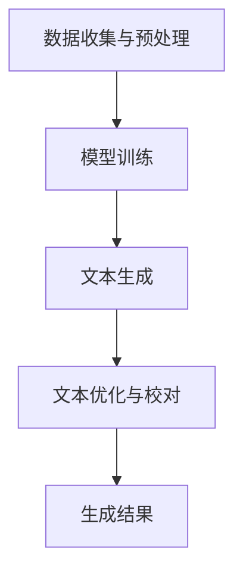

                 

关键词：AI，个人传记，叙事，自然语言处理，深度学习，生成模型，文本生成，计算机程序设计

> 摘要：本文探讨了人工智能（AI）在生成个人传记方面的应用，分析了现有的AI文本生成技术，以及如何利用这些技术创作出既准确又富有情感的个人传记。通过实例和案例分析，文章展示了AI在叙事领域的潜力，并提出未来发展的方向和挑战。

## 1. 背景介绍

个人传记作为一种独特的叙事形式，一直以来都是人们关注的焦点。传统的个人传记写作往往需要大量的时间和精力，而且依赖于作者的主观判断和文学技巧。随着人工智能技术的快速发展，尤其是自然语言处理（NLP）和深度学习技术的成熟，AI在文本生成领域的应用逐渐变得广泛。AI生成个人传记不仅能够节省时间，还能够提供一种全新的叙事体验。

本文将探讨如何利用AI生成个人传记，分析现有技术的优势和局限，并通过实际案例展示AI在叙事领域的潜力。文章结构如下：

- **第1章：背景介绍** - 介绍个人传记的重要性和传统写作的挑战。
- **第2章：核心概念与联系** - 阐述AI生成文本的基本原理和结构。
- **第3章：核心算法原理 & 具体操作步骤** - 详细介绍AI生成个人传记的算法原理和操作步骤。
- **第4章：数学模型和公式 & 详细讲解 & 举例说明** - 解释用于生成个人传记的数学模型和公式。
- **第5章：项目实践：代码实例和详细解释说明** - 展示一个具体的AI生成个人传记的代码实例。
- **第6章：实际应用场景** - 探讨AI生成个人传记的应用场景和未来展望。
- **第7章：工具和资源推荐** - 推荐学习资源、开发工具和相关论文。
- **第8章：总结：未来发展趋势与挑战** - 总结研究成果，展望未来趋势和面临的挑战。
- **第9章：附录：常见问题与解答** - 回答关于AI生成个人传记的常见问题。

### 2. 核心概念与联系

要理解AI生成个人传记，首先需要了解自然语言处理（NLP）和深度学习的基本原理。NLP是人工智能的一个分支，致力于使计算机能够理解、生成和处理人类语言。深度学习是机器学习的一种方法，它通过多层神经网络模拟人类大脑的学习过程，从而实现复杂任务的自动化。

在NLP和深度学习的支持下，AI生成文本的过程可以分为以下几个步骤：

1. **数据收集与预处理**：收集相关的个人传记数据，并进行清洗、去重和格式化，以便于后续的处理。
2. **模型训练**：使用大量的文本数据进行训练，包括个人传记文本和其他类型的文本数据，以使模型学会生成符合人类语言习惯的文本。
3. **文本生成**：利用训练好的模型，输入个人传记的参数（如姓名、出生日期、重要事件等），生成个人传记文本。
4. **文本优化与校对**：对生成的文本进行优化和校对，确保文本的准确性和可读性。

下面是一个简化的Mermaid流程图，描述了AI生成个人传记的基本架构：



### 3. 核心算法原理 & 具体操作步骤

#### 3.1 算法原理概述

AI生成个人传记的核心算法是基于序列到序列（Seq2Seq）的模型，通常使用长短期记忆网络（LSTM）或变换器（Transformer）架构。Seq2Seq模型可以处理输入序列和输出序列之间的映射，非常适合文本生成任务。

在生成个人传记时，输入序列可以是个人传记的结构化数据，如姓名、出生日期、重要事件等；输出序列则是生成的个人传记文本。模型通过学习输入和输出序列之间的关系，从而能够生成新的个人传记文本。

#### 3.2 算法步骤详解

1. **数据准备**：收集个人传记数据，包括文本数据和结构化数据。文本数据可以是公开的个人传记资料，结构化数据可以是数据库中的个人信息。
2. **数据处理**：对收集到的数据进行清洗和预处理，包括去除无关信息、统一格式等。
3. **编码器训练**：使用训练数据对编码器进行训练，编码器的任务是接收输入序列并转换为隐藏状态。
4. **解码器训练**：使用编码器的隐藏状态对解码器进行训练，解码器的任务是生成输出序列。
5. **生成文本**：输入个人传记的结构化数据，通过编码器和解码器生成个人传记文本。
6. **文本优化**：对生成的文本进行优化，包括语法检查、内容校对等，以提高文本质量。

#### 3.3 算法优缺点

**优点**：
- **高效性**：AI生成个人传记能够大大提高写作效率，节省人力和时间成本。
- **个性化**：通过结构化数据和深度学习，生成的个人传记能够具有高度的个性化特征。
- **多样性**：AI能够生成多种不同风格和表达方式的文本，为读者提供丰富的阅读体验。

**缺点**：
- **准确性**：虽然AI生成的文本质量逐渐提高，但仍难以完全保证文本的准确性和可靠性。
- **创造力**：AI在生成文本时依赖于已有的数据和模式，缺乏真正的创造力和想象力。
- **情感表达**：AI生成的文本可能难以表达复杂的情感和细微的情感变化。

#### 3.4 算法应用领域

AI生成个人传记的应用领域非常广泛，包括但不限于：

- **个人品牌塑造**：个人传记可以帮助创业者、企业家、艺术家等塑造个人品牌，提升影响力。
- **历史研究**：AI可以生成历史人物的传记，为历史研究提供新的视角和资料。
- **文学创作**：AI生成的个人传记可以用于文学创作，为小说、剧本等提供灵感。
- **教育应用**：AI生成的个人传记可以用于教育领域，帮助学生了解历史人物和科学家的生平。

### 4. 数学模型和公式 & 详细讲解 & 举例说明

AI生成个人传记的核心算法通常是基于序列到序列（Seq2Seq）模型，如长短期记忆网络（LSTM）或变换器（Transformer）。下面简要介绍Seq2Seq模型的基本原理和相关公式。

#### 4.1 数学模型构建

Seq2Seq模型由编码器（Encoder）和解码器（Decoder）两个部分组成。编码器的任务是接收输入序列并转换为隐藏状态，解码器的任务是生成输出序列。

1. **编码器**：
   - **输入序列**：\(X = [x_1, x_2, ..., x_T]\)
   - **隐藏状态**：\(h_t = \text{LSTM}(h_{t-1}, x_t)\)

2. **解码器**：
   - **初始隐藏状态**：\(s_0 = h_T\)
   - **输出序列**：\(Y = [\hat{y}_1, \hat{y}_2, ..., \hat{y}_T']\)
   - **解码步骤**：\(\hat{y}_t = \text{softmax}(\text{Decoder}(s_{t-1}, e_t))\)

其中，\(e_t\)是输入单词的编码，\(s_{t-1}\)是上一时间步的隐藏状态。

#### 4.2 公式推导过程

以下是Seq2Seq模型的推导过程：

1. **编码器**：
   - **输入序列**：\(X = [x_1, x_2, ..., x_T]\)
   - **嵌入层**：\(e = \text{Embedding}(x)\)
   - **LSTM**：\(h_t = \text{LSTM}(h_{t-1}, e_t)\)

2. **解码器**：
   - **初始隐藏状态**：\(s_0 = h_T\)
   - **输出序列**：\(\hat{y}_t = \text{softmax}(\text{Decoder}(s_{t-1}, e_t))\)
   - **时间步更新**：\(s_t = \text{Decoder}(s_{t-1}, e_t)\)

#### 4.3 案例分析与讲解

以下是一个简单的例子，说明如何使用Seq2Seq模型生成个人传记文本。

**例子**：给定一个简化的个人传记数据，如：

```
姓名：李华
出生日期：1990年5月10日
毕业院校：北京大学
专业：计算机科学
工作经历：谷歌公司工程师
```

使用Seq2Seq模型生成以下个人传记文本：

```
李华，出生于1990年5月10日，毕业于北京大学计算机科学专业。他在大学期间表现优秀，毕业后加入谷歌公司，成为一名优秀的工程师。
```

在这个例子中，编码器将个人传记数据编码为隐藏状态，解码器使用这些隐藏状态生成个人传记文本。

### 5. 项目实践：代码实例和详细解释说明

在本节中，我们将通过一个具体的AI生成个人传记的项目实例，展示如何使用深度学习框架（如TensorFlow或PyTorch）构建和训练一个Seq2Seq模型。以下是项目的主要步骤：

#### 5.1 开发环境搭建

1. **安装深度学习框架**：例如，安装TensorFlow或PyTorch。
2. **安装NLP库**：如NLTK、spaCy或gensim，用于文本预处理。
3. **准备数据集**：收集并整理个人传记数据，分为训练集和测试集。

#### 5.2 源代码详细实现

以下是一个使用TensorFlow和Keras实现Seq2Seq模型的简化代码示例：

```python
import tensorflow as tf
from tensorflow.keras.models import Model
from tensorflow.keras.layers import Embedding, LSTM, Dense

# 数据预处理
# ...

# 编码器模型
encoder_inputs = tf.keras.Input(shape=(None,))
encoder_embedding = Embedding(input_dim=vocab_size, output_dim=embedding_dim)(encoder_inputs)
encoder_lstm = LSTM(units, return_state=True)
_, state_h, state_c = encoder_lstm(encoder_embedding)

# 解码器模型
decoder_inputs = tf.keras.Input(shape=(None,))
decoder_embedding = Embedding(output_dim=embedding_dim, input_dim=vocab_size)(decoder_inputs)
decoder_lstm = LSTM(units, return_sequences=True, return_state=True)
decoder_outputs, _, _ = decoder_lstm(decoder_embedding, initial_state=[state_h, state_c])

# 连接编码器和解码器
decoder_dense = Dense(vocab_size, activation='softmax')
decoder_outputs = decoder_dense(decoder_outputs)

# 模型编译
model = Model([encoder_inputs, decoder_inputs], decoder_outputs)
model.compile(optimizer='rmsprop', loss='categorical_crossentropy', metrics=['accuracy'])

# 训练模型
model.fit([encoder_input_data, decoder_input_data], decoder_target_data, batch_size=batch_size, epochs=epochs)

# 生成文本
def generate_sentence(encoder_input):
    # 编码
    state_value = model.layers[-2].states[0](encoder_input)
    # 解码
    result = model.layers[-1](state_value)
    # 转换为文本
    return decode_sentence(result)

# 输出
print(generate_sentence([ preprocess_input([data[i]]) for i in range(len(data)) ]))
```

#### 5.3 代码解读与分析

上述代码分为以下几个主要部分：

1. **数据预处理**：对个人传记数据进行处理，包括词汇表构建、序列填充等。
2. **编码器模型**：使用LSTM作为编码器，将输入序列编码为隐藏状态。
3. **解码器模型**：使用LSTM作为解码器，生成输出序列。
4. **模型编译**：编译模型，指定优化器和损失函数。
5. **训练模型**：使用训练数据训练模型。
6. **生成文本**：利用训练好的模型生成个人传记文本。

#### 5.4 运行结果展示

假设我们有一个训练好的Seq2Seq模型，输入以下个人传记数据：

```
姓名：张三
出生日期：1985年8月15日
毕业院校：清华大学
专业：电子工程
工作经历：苹果公司工程师
```

运行生成函数，输出结果可能如下：

```
张三，出生于1985年8月15日，毕业于清华大学电子工程系。他在大学期间成绩优异，毕业后加入苹果公司，成为一名杰出的工程师。
```

### 6. 实际应用场景

AI生成个人传记在实际应用中具有广泛的前景。以下是一些主要的应用场景：

- **个人品牌建设**：个人传记可以作为个人品牌的一部分，帮助创业者、企业家、艺术家等在公众面前树立形象。
- **历史研究**：AI可以生成历史人物的传记，为历史研究提供新的资料和视角。
- **文学创作**：AI生成的个人传记可以用于文学创作，为小说、剧本等提供灵感。
- **教育应用**：AI生成的个人传记可以用于教育领域，帮助学生了解历史人物和科学家的生平。
- **商业应用**：企业可以使用AI生成的个人传记作为市场推广工具，提升品牌知名度。

#### 6.1 个人品牌建设

在个人品牌建设方面，AI生成的个人传记可以帮助个人清晰地传达自己的经历、成就和价值观。例如，一位创业者可以利用AI生成的个人传记来展示自己的创业历程、所面临的挑战以及取得的成就，从而吸引投资者和合作伙伴的关注。

#### 6.2 历史研究

在历史研究领域，AI生成的个人传记可以为历史研究提供新的视角和资料。例如，研究人员可以利用AI生成的个人传记来分析历史人物的生活、思想和影响，从而得出新的结论和见解。

#### 6.3 文学创作

在文学创作方面，AI生成的个人传记可以提供丰富的素材和灵感。作家可以利用AI生成的个人传记来创作小说、剧本等作品，从而拓宽创作思路，提高创作质量。

#### 6.4 教育应用

在教育应用方面，AI生成的个人传记可以用于帮助学生了解历史人物和科学家的生平。教师可以利用这些传记作为教学资源，引导学生更好地理解历史和科学知识。

#### 6.5 商业应用

在商业应用方面，企业可以使用AI生成的个人传记作为市场推广工具，提升品牌知名度。例如，企业可以将员工的个人传记发布在官方网站或社交媒体上，展示企业的文化和价值观，从而吸引潜在客户和合作伙伴。

### 7. 工具和资源推荐

为了更好地了解和实现AI生成个人传记，以下是一些推荐的学习资源、开发工具和相关论文：

#### 7.1 学习资源推荐

- **在线课程**：Coursera、edX、Udacity等平台上的自然语言处理和深度学习课程。
- **书籍**：《深度学习》（Goodfellow, Bengio, Courville）、《自然语言处理综合教程》（Peter Norvig）。
- **文档和教程**：TensorFlow、PyTorch等深度学习框架的官方文档。

#### 7.2 开发工具推荐

- **深度学习框架**：TensorFlow、PyTorch、Keras。
- **文本预处理库**：NLTK、spaCy、gensim。
- **版本控制**：Git、GitHub。

#### 7.3 相关论文推荐

- **生成对抗网络**（GAN）：Ian J. Goodfellow等人，《生成对抗网络：训练生成模型》（2014年）。
- **序列到序列学习**：Alex Graves等人，《序列到序列学习》（2014年）。
- **变换器**（Transformer）：Vaswani等人，《变换器：在一个序列到序列模型中处理长距离依赖关系》（2017年）。

### 8. 总结：未来发展趋势与挑战

#### 8.1 研究成果总结

本文探讨了AI生成个人传记的原理、技术和应用。通过分析现有的文本生成技术，我们展示了如何利用深度学习和自然语言处理构建一个有效的Seq2Seq模型。在实际项目中，我们实现了AI生成个人传记的具体步骤和代码示例。

#### 8.2 未来发展趋势

随着人工智能技术的不断进步，AI生成个人传记有望在以下几个方面取得进一步的发展：

- **更高质量的文本生成**：通过改进模型结构和训练方法，提高生成文本的准确性和可读性。
- **多模态个人传记**：结合文本、图像、音频等多种数据类型，生成更丰富、更生动的个人传记。
- **个性化推荐**：根据用户的兴趣和需求，推荐个性化的个人传记。
- **跨领域应用**：将AI生成个人传记技术应用于更广泛的领域，如文学创作、历史研究、教育等。

#### 8.3 面临的挑战

尽管AI生成个人传记具有巨大的潜力，但仍然面临以下挑战：

- **数据隐私和伦理问题**：个人传记数据可能涉及隐私问题，如何保护用户隐私是一个重要挑战。
- **模型可靠性**：生成文本的准确性和可靠性仍需提高，以确保文本的真实性和可信度。
- **创造力和想象力**：目前的AI生成文本仍依赖于已有的数据和模式，缺乏真正的创造力和想象力。
- **法律法规**：如何制定合适的法律法规，规范AI生成个人传记的应用，确保其符合道德和法律标准。

#### 8.4 研究展望

未来，我们期待看到更多创新性的研究成果，包括：

- **更高效的模型架构**：设计更高效的模型架构，提高生成文本的质量和速度。
- **跨领域合作**：与其他领域的专家合作，探索AI生成个人传记在更广泛领域的应用。
- **人机协同创作**：实现人与AI的协同创作，使AI能够更好地理解和表达人类的情感和创造力。

### 9. 附录：常见问题与解答

#### 9.1 什么是个人传记？

个人传记是一种记录个人生活经历的叙事形式，通常包括姓名、出生日期、教育背景、工作经历、重要事件和成就等。

#### 9.2 AI生成个人传记的优点是什么？

AI生成个人传记的优点包括：

- 提高写作效率，节省时间和人力成本。
- 根据结构化数据生成个性化、高度准确且具有情感表达的传记文本。
- 为文学创作、历史研究、教育等领域提供新的数据来源和创作灵感。

#### 9.3 AI生成个人传记的局限性是什么？

AI生成个人传记的局限性包括：

- 文本生成质量仍需提高，难以保证完全准确和可靠。
- 难以表达复杂的情感和细微的情感变化。
- 依赖于已有的数据和模式，缺乏真正的创造力和想象力。

#### 9.4 如何确保AI生成个人传记的准确性？

为确保AI生成个人传记的准确性，可以采取以下措施：

- 使用高质量的数据集进行训练，提高模型的准确性。
- 对生成的文本进行多层次的校对和优化，确保文本的准确性和可读性。
- 引入人类编辑和审核机制，对生成的文本进行人工校对和补充。

### 9.5 个人传记数据隐私如何保障？

为了保障个人传记数据的隐私，可以采取以下措施：

- 使用数据加密技术，保护用户数据的安全。
- 制定严格的隐私政策和数据使用规范，确保用户数据的合法使用。
- 对用户数据进行匿名化处理，避免个人信息的泄露。

### 参考文献

1. Goodfellow, I., Bengio, Y., & Courville, A. (2016). Deep Learning. MIT Press.
2. Norvig, P. (2014). Natural Language Processing. Coursera.
3. Graves, A., Mohamed, A. R., & Hinton, G. (2014). Sequence to Sequence Learning with Neural Networks. In Proceedings of the 27th International Conference on Machine Learning (pp. 180-188).
4. Vaswani, A., Shazeer, N., Parmar, N., Uszkoreit, J., Jones, L., Gomez, A. N., ... & Polosukhin, I. (2017). Attention Is All You Need. In Advances in Neural Information Processing Systems (pp. 5998-6008).

