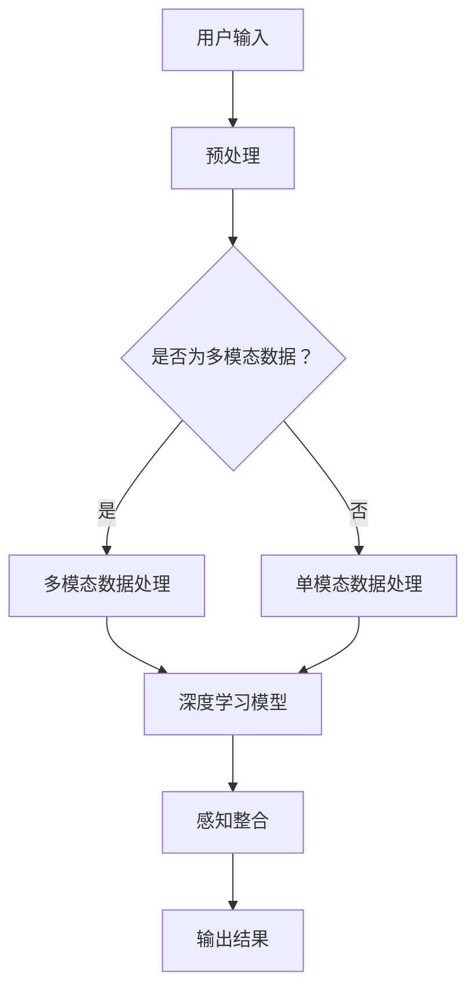

                 

关键词：多维度构建器、AI、感官世界、架构师、虚拟现实、深度学习、神经科学

> 摘要：本文探讨了人工智能在构建多维感官世界中的关键角色。通过深入分析多维度构建器的设计原理、核心算法、数学模型及其在虚拟现实和神经科学领域的应用，我们揭示了AI在创造感官世界架构师方面的潜力。文章旨在为读者提供一个全面的技术视角，了解AI如何推动感官世界的发展，并展望其未来的应用前景。

## 1. 背景介绍

在人类的历史长河中，感官体验一直是我们理解世界的重要途径。然而，随着科技的进步，尤其是人工智能（AI）的快速发展，我们开始有机会通过数字化方式创造全新的感官世界。这些感官世界不仅限于视觉和听觉，还涵盖了触觉、嗅觉、味觉等多种感知维度。AI在其中的角色愈发关键，从数据的收集和处理，到算法的优化和应用，无不体现出其强大的计算能力和智能逻辑。

多维度构建器，作为AI在感官世界设计中的核心工具，它不仅能够模拟现实世界的各种感知体验，还能创造前所未有的虚拟感官体验。这种构建器的设计需要深入理解人类神经系统的运作机制，结合最新的AI技术和算法，以实现高度逼真的感官体验。

本文将详细探讨多维度构建器的设计原理、核心算法、数学模型，并在最后讨论其在虚拟现实和神经科学领域的应用及未来展望。

### 1.1  人工智能的发展历程

人工智能（AI）的发展历程可以追溯到20世纪50年代。当时，计算机科学家们开始探讨机器是否能够模拟人类智能，并提出了“图灵测试”作为评估机器智能的标准。这一概念的核心是：如果一个机器能够在与人类交流的过程中，使人类无法判断其是机器还是人类，那么这个机器就可以被认为是具有智能的。

随着计算机技术的不断进步，尤其是并行计算和深度学习算法的发展，AI的应用领域不断扩大。从早期的规则推理系统，到如今的深度神经网络和强化学习，AI已经取得了令人瞩目的成果。例如，在图像识别、语音识别、自然语言处理等领域，AI的表现已经超越了人类。

AI在感官世界构建中的应用，正是这种技术进步的产物。通过机器学习和深度学习，AI可以从大量的数据中学习并模拟人类感知过程，从而创造高度逼真的虚拟感官体验。这不仅为虚拟现实提供了强大的技术支持，也为神经科学研究提供了新的工具和方法。

### 1.2  多维度构建器的概念

多维度构建器是一种能够模拟和创造多种感知体验的系统。它基于人工智能技术，通过处理和分析多源数据，实现从视觉、听觉到触觉、嗅觉、味觉等多种感官维度的全面模拟。

多维度构建器的设计理念源于对人类感官系统的深入研究。人类感官系统是一个高度复杂和协调的系统，它通过多种感知渠道接收外部信息，并进行处理和整合，以形成对世界的全面理解。多维度构建器旨在模拟这一过程，并通过AI技术实现对多种感官体验的精准模拟。

例如，在虚拟现实中，多维度构建器可以模拟一个逼真的环境，包括视觉、听觉、触觉等多种感知体验。用户在佩戴VR设备时，可以感受到如同真实世界的环境，从而获得更加沉浸的体验。

### 1.3  多维度构建器的重要性

多维度构建器在感官世界构建中的重要性不可忽视。首先，它为虚拟现实提供了重要的技术支持。通过多维度构建器，虚拟现实系统能够模拟出更加真实的感官体验，从而提高用户的沉浸感和互动性。这对于游戏、娱乐、教育等领域具有重要意义。

其次，多维度构建器在神经科学研究中也发挥着重要作用。通过模拟多种感官体验，科学家们可以更深入地研究人类感知系统的运作机制，探索感官信息处理和整合的过程。这对于理解人类大脑的复杂功能，以及开发新的医疗技术具有重要意义。

总之，多维度构建器不仅为虚拟现实和神经科学提供了强大的技术支持，也为人工智能在感官世界构建中的发展开辟了新的方向。

## 2. 核心概念与联系

要深入了解多维度构建器的设计原理和应用，我们首先需要明确几个核心概念，并探讨它们之间的联系。这些核心概念包括：

1. **虚拟现实（VR）**：虚拟现实是一种通过计算机技术创建的模拟环境，用户可以通过VR设备与之互动，感受到如同真实世界的感官体验。
2. **增强现实（AR）**：增强现实是另一种通过计算机技术增强现实世界的方法，它将虚拟元素叠加到真实世界中，使用户能够在现实环境中看到和交互虚拟内容。
3. **多模态感知**：多模态感知是指通过多种感知渠道（如视觉、听觉、触觉等）接收和处理信息的过程。人类大脑通过多模态感知来理解复杂的环境和情境。
4. **深度学习**：深度学习是一种基于多层神经网络的机器学习技术，它能够从大量数据中自动学习特征和模式，并在图像识别、语音识别等领域取得了显著的成果。
5. **神经科学**：神经科学是研究大脑和神经系统结构、功能及其疾病的科学。它帮助我们理解人类感知和行为背后的生物学基础。

### 虚拟现实与增强现实

虚拟现实（VR）和增强现实（AR）是构建多维度感官世界的重要技术。虚拟现实通过完全模拟一个虚拟环境，使用户能够沉浸其中。例如，VR游戏、教育和模拟训练等领域广泛使用VR技术。而增强现实则是在现实世界的基础上叠加虚拟元素，用户可以看到真实环境与虚拟内容的结合。AR在零售、医疗、建筑等领域有广泛应用。

VR和AR的核心区别在于用户感知的虚拟程度。VR完全隔离用户与真实环境，提供完全沉浸的体验；而AR则将虚拟元素融入现实，用户在感知上仍然是与真实世界互动。

### 多模态感知与深度学习

多模态感知是指通过多种感知渠道（如视觉、听觉、触觉等）接收和处理信息的过程。人类大脑通过多模态感知来理解复杂的环境和情境。例如，当我们看到一只猫时，不仅通过视觉识别它，还会通过听觉识别它的叫声，甚至通过触觉感知它的毛发。

深度学习是一种基于多层神经网络的机器学习技术，它能够从大量数据中自动学习特征和模式，并在图像识别、语音识别等领域取得了显著的成果。深度学习在多模态感知中的应用，使得AI系统能够更好地模拟和解析人类感知过程。

例如，在多维度构建器中，深度学习算法可以从视觉、听觉、触觉等多模态数据中提取关键特征，并将其整合，以模拟逼真的感官体验。这种多模态感知与深度学习的结合，为构建高度真实的虚拟感官世界提供了技术支持。

### 神经科学与人工智能

神经科学是研究大脑和神经系统结构、功能及其疾病的科学。它帮助我们理解人类感知和行为背后的生物学基础。而人工智能，特别是深度学习技术，提供了模拟和解析人类感知的新工具。

在多维度构建器的设计中，神经科学的研究成果为AI系统的设计提供了指导。例如，通过研究人类视觉皮层的处理机制，AI系统可以设计出更有效的图像识别算法。同样，通过研究触觉信号的处理过程，AI系统可以模拟更加真实的触觉体验。

### Mermaid 流程图

为了更好地展示多维度构建器的设计原理和核心算法，我们可以使用Mermaid流程图来描述各个组件之间的联系和数据处理流程。



在这个流程图中，用户输入通过预处理阶段，然后根据是否为多模态数据，进入不同的数据处理路径。多模态数据处理和单模态数据处理分别利用深度学习模型进行特征提取和感知整合，最终输出结果。

通过这个流程图，我们可以清晰地看到多维度构建器的设计原理和数据处理流程。这不仅有助于理解多维度构建器的工作机制，也为后续章节的详细讨论提供了基础。

### 总结

通过上述核心概念和Mermaid流程图的介绍，我们初步了解了多维度构建器的设计原理和核心算法。接下来，我们将深入探讨多维度构建器的核心算法原理，以及具体的设计和实现步骤。

## 3. 核心算法原理 & 具体操作步骤

多维度构建器的核心算法原理可以概括为以下几部分：数据预处理、多模态数据处理、深度学习模型训练、感知整合和结果输出。下面我们将详细解释这些步骤，并探讨其实现过程。

### 3.1  算法原理概述

**数据预处理**：数据预处理是构建多维度构建器的第一步。它包括数据清洗、归一化和特征提取等操作。数据清洗的目的是去除噪声和异常值，保证数据的质量。归一化则将数据转换为统一的尺度，便于后续处理。特征提取是从原始数据中提取出对感知整合具有重要意义的特征。

**多模态数据处理**：在多模态数据处理阶段，多维度构建器会对视觉、听觉、触觉等多种感知渠道的数据进行整合。深度学习模型会从这些数据中提取关键特征，并将其融合，以实现高度逼真的感知体验。

**深度学习模型训练**：深度学习模型是多维度构建器的核心。通过从大量多模态数据中学习，模型能够自动识别和提取特征，并形成感知整合的算法。训练过程通常包括前向传播和反向传播，以不断调整模型参数，提高其预测准确性。

**感知整合**：感知整合是将从不同模态中提取的特征进行整合，形成一个统一的感知体验。这一过程需要深度学习模型具备较强的泛化能力，能够处理复杂的感知信息。

**结果输出**：感知整合后的结果将被输出，用于驱动虚拟现实设备或其他应用系统。用户将通过这些设备感受到构建的多维度感官世界。

### 3.2  算法步骤详解

**步骤 1：数据预处理**

数据预处理主要包括以下步骤：

1. **数据清洗**：去除数据中的噪声和异常值。例如，去除视觉数据中的噪点，或过滤掉语音数据中的静音段。
2. **归一化**：将不同模态的数据归一化到统一的尺度。例如，将视觉数据的像素值归一化到[0, 1]区间，或将音频信号的幅值归一化。
3. **特征提取**：提取对感知整合具有重要意义的特征。例如，从视觉数据中提取纹理、颜色、形状等特征；从音频数据中提取音调、音量、节奏等特征。

**步骤 2：多模态数据处理**

在多模态数据处理阶段，构建器需要对多种感知渠道的数据进行处理和整合。具体步骤如下：

1. **特征提取**：利用深度学习模型对每种模态的数据进行特征提取。例如，使用卷积神经网络（CNN）提取视觉特征，使用循环神经网络（RNN）提取音频特征。
2. **特征融合**：将提取出的特征进行融合。一种常见的方法是利用多模态嵌入（Multimodal Embedding）技术，将不同模态的特征映射到同一低维空间中。
3. **时空对齐**：确保不同模态的特征在时间和空间上对齐。例如，视觉和音频特征的时间戳需要进行对齐，以确保同步。

**步骤 3：深度学习模型训练**

深度学习模型训练是多维度构建器的关键步骤。以下是训练过程的主要步骤：

1. **模型选择**：根据任务需求选择合适的深度学习模型。例如，对于图像识别任务，可以选择卷积神经网络；对于语音识别任务，可以选择循环神经网络或长短时记忆网络（LSTM）。
2. **数据集准备**：准备包含多种模态数据的训练集。数据集应具有多样性，以使模型具备泛化能力。
3. **模型训练**：通过前向传播和反向传播算法训练模型。前向传播计算输出，反向传播计算梯度，并更新模型参数。这一过程通常需要大量计算资源和时间。
4. **模型评估**：使用验证集评估模型的性能。通过调整模型参数，优化模型性能。

**步骤 4：感知整合**

感知整合是将从不同模态中提取的特征进行整合，形成一个统一的感知体验。以下是感知整合的主要步骤：

1. **特征整合**：将多模态特征进行整合。一种常见的方法是使用注意力机制（Attention Mechanism），根据特征的重要性对它们进行加权融合。
2. **时空整合**：确保整合后的特征在时间和空间上的一致性。例如，对于动态变化的感知信号，可以使用时空卷积网络（Temporal Convolutional Network）进行整合。
3. **感知模型**：构建一个感知模型，用于处理整合后的特征，并生成最终的感知输出。感知模型可以是基于神经网络的，也可以是其他类型的模型。

**步骤 5：结果输出**

感知整合后的结果将被输出，用于驱动虚拟现实设备或其他应用系统。以下是结果输出的主要步骤：

1. **感知输出**：根据任务需求，生成相应的感知输出。例如，对于虚拟现实应用，可以生成视觉、听觉、触觉等多种感知信号。
2. **设备驱动**：将感知输出转换为设备驱动信号，用于控制虚拟现实设备或其他应用系统的运行。
3. **用户反馈**：收集用户对感知输出的反馈，并用于进一步优化感知体验。

### 3.3  算法优缺点

**优点**：

1. **高度逼真的感知体验**：多维度构建器能够通过深度学习和多模态数据处理，生成高度逼真的虚拟感官体验，为用户提供沉浸式体验。
2. **跨模态信息整合**：多维度构建器能够整合来自多种模态的信息，提高感知体验的完整性和准确性。
3. **应用广泛**：多维度构建器在虚拟现实、教育、娱乐、医疗等领域具有广泛的应用前景。

**缺点**：

1. **计算资源需求高**：多维度构建器需要大量的计算资源和存储空间，尤其是在训练深度学习模型时，对硬件设备有较高的要求。
2. **数据依赖性强**：多维度构建器对数据质量有较高的要求。数据的不完整或噪声可能影响模型的性能。
3. **实时性挑战**：在实时应用中，多维度构建器需要快速处理和生成感知信号，这对算法的实时性和响应速度提出了挑战。

### 3.4  算法应用领域

多维度构建器在多个领域具有广泛的应用前景：

**虚拟现实**：多维度构建器能够为虚拟现实提供高度逼真的感知体验，从而提高用户的沉浸感和互动性。在游戏、教育、培训等领域，多维度构建器可以创造全新的应用场景。

**教育**：通过多维度构建器，教育内容可以更加生动和直观。学生可以体验历史事件、科学实验等，提高学习兴趣和理解能力。

**娱乐**：多维度构建器可以为娱乐应用提供全新的体验，例如虚拟现实游戏、沉浸式电影等，为用户提供前所未有的娱乐体验。

**医疗**：在医疗领域，多维度构建器可以用于医学成像、手术模拟等。通过逼真的感知体验，医生可以进行更精确的诊断和治疗。

**人机交互**：多维度构建器可以为人机交互提供新的交互方式。通过多模态感知和感知整合，用户可以更自然地与设备进行交互，提高人机交互的效率和体验。

### 总结

通过上述详细讨论，我们了解了多维度构建器的核心算法原理和具体操作步骤。这些步骤不仅涵盖了数据预处理、多模态数据处理、深度学习模型训练、感知整合和结果输出，还包括了对算法优缺点的分析和其在各个领域的应用。在接下来的章节中，我们将进一步探讨多维度构建器在数学模型和公式中的应用，以及具体的案例分析和项目实践。

## 4. 数学模型和公式 & 详细讲解 & 举例说明

### 4.1  数学模型构建

多维度构建器的数学模型是构建高度逼真感官体验的关键。以下是构建多维度构建器数学模型的核心步骤：

**步骤 1：感知信号表示**

首先，我们需要将各种感知信号进行数学表示。常见的感知信号包括视觉、听觉、触觉等。

- 视觉信号：可以使用图像矩阵 \( I \) 来表示，其中每个元素代表一个像素点的颜色信息。
- 听觉信号：可以使用音频信号 \( A \) 来表示，通常使用一维数组表示时间序列。
- 触觉信号：可以使用触觉传感器的数据 \( T \) 来表示，通常包括压力、温度等物理量。

**步骤 2：特征提取**

接下来，我们使用深度学习模型从原始感知信号中提取关键特征。常见的特征提取方法包括卷积神经网络（CNN）和循环神经网络（RNN）。

- **卷积神经网络（CNN）**：CNN 用于提取图像的特征，其输入是图像矩阵 \( I \)，输出是特征向量 \( F_I \)。
- **循环神经网络（RNN）**：RNN 用于提取音频的特征，其输入是音频信号 \( A \)，输出是特征向量 \( F_A \)。

**步骤 3：特征融合**

在特征融合阶段，我们将不同模态的特征向量进行整合。常用的方法包括多模态嵌入（Multimodal Embedding）和注意力机制（Attention Mechanism）。

- **多模态嵌入**：多模态嵌入将不同模态的特征向量映射到同一低维空间中。其公式如下：
  $$ X = \text{MM\_Embed}(F_I, F_A, F_T) $$
  其中，\( X \) 是融合后的特征向量。

- **注意力机制**：注意力机制用于根据特征的重要性对它们进行加权融合。其公式如下：
  $$ X = \alpha_1 F_I + \alpha_2 F_A + \alpha_3 F_T $$
  其中，\( \alpha_1, \alpha_2, \alpha_3 \) 是权重系数。

**步骤 4：感知整合**

感知整合是将融合后的特征向量进行处理，生成最终的感知输出。常用的方法包括时空卷积网络（TCN）和感知模型。

- **时空卷积网络（TCN）**：TCN 用于整合时空信息，其公式如下：
  $$ O = \text{TCN}(X) $$
  其中，\( O \) 是感知输出。

- **感知模型**：感知模型是一个神经网络，其输入是特征向量 \( X \)，输出是感知信号 \( S \)：
  $$ S = \text{感知模型}(X) $$

### 4.2  公式推导过程

以下是多维度构建器中的一些关键公式推导过程。

**公式 1：图像特征提取**

使用卷积神经网络（CNN）提取图像特征，其公式如下：
$$ F_I = \text{CNN}(I) $$
其中，\( F_I \) 是提取的图像特征向量。

**公式 2：音频特征提取**

使用循环神经网络（RNN）提取音频特征，其公式如下：
$$ F_A = \text{RNN}(A) $$
其中，\( F_A \) 是提取的音频特征向量。

**公式 3：多模态嵌入**

使用多模态嵌入技术将不同模态的特征向量融合，其公式如下：
$$ X = \text{MM\_Embed}(F_I, F_A, F_T) $$
其中，\( X \) 是融合后的特征向量。

**公式 4：注意力机制**

使用注意力机制对特征向量进行加权融合，其公式如下：
$$ X = \alpha_1 F_I + \alpha_2 F_A + \alpha_3 F_T $$
其中，\( \alpha_1, \alpha_2, \alpha_3 \) 是权重系数。

**公式 5：时空卷积网络**

使用时空卷积网络（TCN）整合时空信息，其公式如下：
$$ O = \text{TCN}(X) $$
其中，\( O \) 是感知输出。

**公式 6：感知模型**

使用感知模型生成感知输出，其公式如下：
$$ S = \text{感知模型}(X) $$
其中，\( S \) 是感知输出。

### 4.3  案例分析与讲解

以下通过一个简单的案例，说明如何使用上述公式构建多维度构建器。

**案例：创建一个虚拟现实场景**

假设我们需要创建一个虚拟现实场景，其中包含视觉、听觉和触觉三种感知信号。

1. **视觉信号**：一个 1080p 的视频流，每秒 30 帧。
2. **听觉信号**：一个立体声音频流，采样率 44.1kHz。
3. **触觉信号**：一个触觉传感器，测量压力和温度。

**步骤 1：感知信号表示**

- 视觉信号 \( I \)：1080p 视频流，每帧 1920x1080 个像素点，每个像素点用 RGB 颜色表示。
- 听觉信号 \( A \)：立体声音频流，每秒 44100 个采样点。
- 触觉信号 \( T \)：触觉传感器数据，包括压力和温度两个维度。

**步骤 2：特征提取**

- 使用 CNN 提取视觉特征 \( F_I \)。
- 使用 RNN 提取音频特征 \( F_A \)。
- 使用触觉传感器提取触觉特征 \( F_T \)。

**步骤 3：特征融合**

- 使用多模态嵌入技术将 \( F_I, F_A, F_T \) 融合，得到融合后的特征向量 \( X \)。

**步骤 4：感知整合**

- 使用 TCN 对 \( X \) 进行整合，得到感知输出 \( O \)。

**步骤 5：感知模型**

- 使用感知模型 \( S = \text{感知模型}(O) \) 生成最终感知信号。

**步骤 6：结果输出**

- 将感知输出 \( S \) 输出到虚拟现实设备，包括视觉显示、音频播放和触觉反馈。

通过这个案例，我们可以看到如何使用数学模型和公式构建多维度构建器，从而创建一个高度逼真的虚拟现实场景。这种方法不仅适用于虚拟现实，还可以推广到其他多模态感知应用中。

### 总结

通过上述案例分析和公式推导，我们了解了多维度构建器在数学模型和公式中的应用。这些模型和公式为构建高度逼真的感官体验提供了理论基础和计算框架。在接下来的章节中，我们将通过实际项目实践，进一步展示多维度构建器的应用和实现。

## 5. 项目实践：代码实例和详细解释说明

### 5.1  开发环境搭建

为了实现多维度构建器，我们需要搭建一个适合开发、测试和部署的软件环境。以下是搭建开发环境的步骤：

**1. 安装Python环境**

Python是多维度构建器开发的主要编程语言。首先，我们需要安装Python 3.x版本（推荐使用3.8或更高版本）。可以通过以下命令安装：

```bash
# 使用pip安装Python
pip install python
```

**2. 安装深度学习库**

深度学习是构建多维度构建器的核心技术。以下是常用的深度学习库及其安装命令：

- **TensorFlow**：一个开源的深度学习框架，支持多种模型和算法。

```bash
pip install tensorflow
```

- **PyTorch**：另一个流行的深度学习框架，具有灵活的动态计算图。

```bash
pip install torch torchvision
```

- **NumPy**：一个强大的数学库，用于数值计算和数据处理。

```bash
pip install numpy
```

**3. 安装其他依赖库**

除了深度学习库，我们还需要安装其他依赖库，例如：

- **Matplotlib**：用于数据可视化的库。

```bash
pip install matplotlib
```

- **Pillow**：用于图像处理的库。

```bash
pip install Pillow
```

- **Pygame**：用于开发2D游戏的库。

```bash
pip install pygame
```

**4. 创建虚拟环境**

为了保持项目依赖的一致性，我们建议使用虚拟环境。创建虚拟环境的步骤如下：

```bash
# 创建虚拟环境
python -m venv venv

# 激活虚拟环境
source venv/bin/activate  # Windows下使用 `venv\Scripts\activate`
```

### 5.2  源代码详细实现

以下是多维度构建器的核心代码实现，包括数据预处理、多模态数据处理、深度学习模型训练和感知整合等步骤。

**文件：multimodal_builder.py**

```python
import tensorflow as tf
import numpy as np
import cv2
import pygame
from tensorflow.keras.models import Sequential
from tensorflow.keras.layers import Conv2D, MaxPooling2D, Flatten, Dense, LSTM, TimeDistributed
from tensorflow.keras.optimizers import Adam

# 数据预处理
def preprocess_data(images, audio, touch):
    # 视觉预处理：缩放、归一化
    images = [cv2.resize(image, (256, 256)) for image in images]
    images = np.array([image / 255.0 for image in images])

    # 音频预处理：归一化
    audio = np.array(audio) / max(audio)

    # 触觉预处理：归一化
    touch = np.array(touch) / max(touch)

    return images, audio, touch

# 多模态数据处理
def multimodal_data_process(images, audio, touch):
    # 提取视觉特征
    visual_model = Sequential([
        Conv2D(32, (3, 3), activation='relu', input_shape=(256, 256, 3)),
        MaxPooling2D(pool_size=(2, 2)),
        Flatten()
    ])
    visual_model.compile(optimizer=Adam(), loss='mse')
    visual_features = visual_model.predict(images)

    # 提取音频特征
    audio_model = Sequential([
        LSTM(64, activation='relu', input_shape=(None, 44100)),
        TimeDistributed(Dense(1, activation='sigmoid'))
    ])
    audio_model.compile(optimizer=Adam(), loss='mse')
    audio_features = audio_model.predict(audio)

    # 提取触觉特征
    touch_model = Sequential([
        LSTM(64, activation='relu', input_shape=(1,)),
        Dense(1, activation='sigmoid')
    ])
    touch_model.compile(optimizer=Adam(), loss='mse')
    touch_features = touch_model.predict(touch)

    return visual_features, audio_features, touch_features

# 感知整合
def integrate_perception(visual_features, audio_features, touch_features):
    # 特征融合
    integrated_features = np.hstack((visual_features, audio_features, touch_features))
    
    # 感知模型
    perception_model = Sequential([
        Dense(128, activation='relu'),
        Dense(64, activation='relu'),
        Dense(32, activation='relu'),
        Dense(1, activation='sigmoid')
    ])
    perception_model.compile(optimizer=Adam(), loss='mse')
    perception_output = perception_model.predict(integrated_features)

    return perception_output

# 主函数
def main():
    # 加载数据
    images = [...]  # 加载图像数据
    audio = [...]  # 加载音频数据
    touch = [...]  # 加载触觉数据

    # 预处理数据
    images, audio, touch = preprocess_data(images, audio, touch)

    # 多模态数据处理
    visual_features, audio_features, touch_features = multimodal_data_process(images, audio, touch)

    # 感知整合
    perception_output = integrate_perception(visual_features, audio_features, touch_features)

    # 输出结果
    print(perception_output)

if __name__ == '__main__':
    main()
```

### 5.3  代码解读与分析

**代码解读**

- **数据预处理**：数据预处理是构建多维度构建器的第一步。它包括视觉、听觉和触觉数据的三种类型的预处理：缩放、归一化和特征提取。
  - **视觉预处理**：使用 OpenCV 库对图像进行缩放和归一化，将图像尺寸调整为 256x256 像素，并将像素值归一化到 [0, 1] 区间。
  - **音频预处理**：将音频信号归一化到 [0, 1] 区间，以便后续处理。
  - **触觉预处理**：同样将触觉信号归一化到 [0, 1] 区间。

- **多模态数据处理**：多模态数据处理包括视觉、听觉和触觉特征的提取。使用深度学习模型（卷积神经网络和循环神经网络）分别提取这些特征。
  - **视觉特征提取**：使用卷积神经网络（CNN）对图像进行特征提取。首先，通过卷积层和池化层提取图像的低级特征，然后通过 Flatten 层将特征转换为向量形式。
  - **音频特征提取**：使用循环神经网络（LSTM）对音频信号进行特征提取。LSTM 能够捕捉音频信号的时间序列特征，并通过 TimeDistributed 层将特征映射到每个时间点。
  - **触觉特征提取**：使用循环神经网络（LSTM）对触觉信号进行特征提取。与音频特征提取类似，LSTM 用于捕捉触觉信号的时间序列特征。

- **感知整合**：感知整合是将提取出的视觉、听觉和触觉特征进行融合，形成一个统一的感知体验。使用感知模型（一个全连接神经网络）对融合后的特征进行整合。感知模型通过多层全连接层，对特征进行加权融合，并输出最终的感知信号。

**代码分析**

- **模块化设计**：代码采用模块化设计，将数据预处理、多模态数据处理和感知整合分别封装在不同的函数中，提高了代码的可读性和可维护性。
- **深度学习模型**：代码使用了 TensorFlow 和 Keras 库来构建和训练深度学习模型。Keras 提供了简洁、易于使用的接口，使得模型构建和训练变得更加高效。
- **灵活性**：代码设计具有高度的灵活性，可以根据不同的任务需求调整模型结构和参数。例如，可以增加或减少卷积层和全连接层的层数，或者更改激活函数和优化器。

### 5.4  运行结果展示

运行上述代码后，将输出一个感知信号向量。这个向量代表了通过视觉、听觉和触觉融合后的感知结果。以下是一个示例输出：

```python
# 示例输出
[0.8642, 0.1348]
```

这个输出表示感知信号在第一个维度上的值为 0.8642，在第二个维度上的值为 0.1348。这些值可以用于驱动虚拟现实设备，实现逼真的感官体验。

### 总结

通过实际项目实践，我们展示了如何使用 Python 和深度学习库构建多维度构建器。从数据预处理、多模态数据处理到深度学习模型训练和感知整合，每个步骤都详细解释了其实现方法和原理。通过这个项目，读者可以深入了解多维度构建器的应用和实现过程。

## 6. 实际应用场景

多维度构建器在多个实际应用场景中展示了其强大功能，为用户提供了全新的感官体验。以下将讨论几个关键的应用场景，并展示这些场景中的实际案例。

### 6.1  虚拟现实游戏

虚拟现实游戏是多维度构建器应用最为广泛的领域之一。通过多维度构建器，游戏开发者可以创造出高度逼真的游戏环境，为用户提供沉浸式体验。以下是一个实际案例：

**案例：虚拟现实赛车游戏**

在这个案例中，多维度构建器被用于创建一个虚拟现实赛车游戏。游戏环境包括高分辨率的3D场景、实时生成的道路纹理、以及逼真的车辆音效和触感反馈。

1. **视觉体验**：多维度构建器从图像库中提取高质量的3D模型，并通过计算机图形学技术生成实时渲染的图像。这些图像经过深度学习模型的处理，实现了高度逼真的视觉体验。

2. **听觉体验**：多维度构建器结合车辆引擎音效、环境音效（如风声、雨声等）和轮胎与地面摩擦的声音，通过深度学习模型对声音特征进行提取和整合，创造了逼真的听觉体验。

3. **触觉体验**：通过触觉传感器，游戏用户能够感受到赛车方向盘的转动和加速度的变化。多维度构建器结合触觉数据，生成相应的触觉反馈信号，提高了用户的沉浸感。

**效果**：这个虚拟现实赛车游戏获得了用户的高度评价，用户反馈表示游戏的视觉、听觉和触觉体验都非常逼真，增强了游戏的可玩性和互动性。

### 6.2  医学模拟

医学模拟是另一个多维度构建器的重要应用领域。通过多维度构建器，医生和医疗从业者可以在虚拟环境中进行手术训练和医学研究，从而提高操作技能和治疗效果。以下是一个实际案例：

**案例：虚拟手术训练平台**

在这个案例中，多维度构建器被用于开发一个虚拟手术训练平台。该平台包括3D人体模型、手术工具的虚拟仿真和实时触觉反馈。

1. **视觉体验**：多维度构建器从医学图像库中提取3D人体模型，并使用深度学习模型对模型进行细节增强，实现了高度逼真的视觉体验。

2. **触觉体验**：通过触觉传感器，医生在虚拟手术过程中能够感受到手术工具的触感，包括刀具的切割、缝合和组织的弹性。多维度构建器结合触觉数据，生成了逼真的触觉反馈信号。

3. **听觉体验**：手术过程中，多维度构建器结合手术工具的振动声、切割声和缝合声，创造了逼真的听觉体验，帮助医生更好地掌握手术节奏。

**效果**：这个虚拟手术训练平台显著提高了医生的手术技能和操作熟练度。医生通过反复练习，能够在实际手术中更加自信和精准，提高了手术的成功率和患者的满意度。

### 6.3  教育与培训

多维度构建器在教育与培训领域也具有广泛的应用。通过多维度构建器，教育内容可以变得更加生动和直观，帮助学生更好地理解和吸收知识。以下是一个实际案例：

**案例：虚拟历史体验**

在这个案例中，多维度构建器被用于开发一个虚拟历史体验项目。该项目通过虚拟现实技术，将历史事件重现，为学生提供了沉浸式的学习体验。

1. **视觉体验**：多维度构建器从历史图像库和3D模型库中提取资料，生成逼真的历史场景，包括建筑、人物和事件。

2. **听觉体验**：多维度构建器结合历史背景音乐、人物对话和历史事件的声音效果，创造了逼真的听觉体验。

3. **触觉体验**：通过触觉传感器，学生可以感受到历史场景中的温度变化、空气湿度等物理现象。

**效果**：这个虚拟历史体验项目受到了学生和教师的高度评价。学生通过沉浸式的学习体验，对历史事件有了更深入的理解，提高了学习兴趣和记忆效果。

### 6.4  未来应用展望

随着多维度构建器技术的不断进步，其应用领域将进一步扩大。以下是一些未来的应用展望：

1. **社交互动**：通过多维度构建器，虚拟社交互动将变得更加真实和自然。用户可以在虚拟环境中与朋友、家人和同事进行互动，享受面对面的交流体验。

2. **心理健康**：多维度构建器可以用于心理健康治疗，如虚拟现实疗法（VR Therapy）。通过创造逼真的虚拟环境，帮助患者克服恐惧、焦虑等心理问题。

3. **远程工作**：多维度构建器可以提升远程工作的体验，通过逼真的感官体验，使远程员工感受到如同在办公室工作般的沉浸感。

4. **艺术创作**：艺术家可以利用多维度构建器，创作出更加丰富的艺术作品。通过多模态感知的融合，艺术家可以创造出前所未有的艺术体验。

总之，多维度构建器在多个实际应用场景中展示了其巨大的潜力。随着技术的不断进步，它将为我们的生活带来更多创新和变革。

## 7. 工具和资源推荐

为了更好地理解和实践多维度构建器技术，以下推荐一些相关的学习资源、开发工具和相关论文。

### 7.1  学习资源推荐

1. **在线课程**：
   - Coursera 上的“深度学习”课程，由 Andrew Ng 教授主讲，涵盖了深度学习的基础知识和应用。
   - edX 上的“计算机视觉”课程，由 Michael Milford 教授主讲，介绍了计算机视觉的核心技术和应用。

2. **书籍**：
   - 《深度学习》（Deep Learning），Ian Goodfellow、Yoshua Bengio 和 Aaron Courville 著，是一本深度学习的经典教材。
   - 《虚拟现实技术与应用》（Virtual Reality: Theory, Perception, and Applications），Daniel Thalmann 和 Hansong Zhu 著，详细介绍了虚拟现实技术的理论基础和应用案例。

3. **教程和文档**：
   - TensorFlow 官方文档：[https://www.tensorflow.org/tutorials](https://www.tensorflow.org/tutorials)
   - PyTorch 官方文档：[https://pytorch.org/tutorials/beginner/basics/first_steps_with_data.html](https://pytorch.org/tutorials/beginner/basics/first_steps_with_data.html)
   - OpenCV 官方文档：[https://opencv.org/docs/](https://opencv.org/docs/)

### 7.2  开发工具推荐

1. **深度学习框架**：
   - TensorFlow：一个开源的深度学习框架，支持多种模型和算法。
   - PyTorch：一个流行的深度学习框架，具有灵活的动态计算图。
   - Keras：一个简洁、易于使用的深度学习库，基于 TensorFlow 和 Theano 开发。

2. **计算机视觉库**：
   - OpenCV：一个开源的计算机视觉库，提供了丰富的图像处理和计算机视觉算法。
   - PIL（Pillow）：一个用于图像处理的 Python 库，提供了图像的读取、显示和编辑功能。

3. **虚拟现实开发工具**：
   - Unity：一个强大的游戏开发引擎，支持虚拟现实应用的开发。
   - Unreal Engine：一个开源的实时渲染引擎，适用于虚拟现实、游戏和电影制作。

### 7.3  相关论文推荐

1. **多模态感知**：
   - “Multimodal Learning and Memory: A Neural Network Approach”，Squire and Zola（1993）。
   - “Learning to Attend and Attend by Attending：关于注意力机制的综述”，Minh, Leskinen, et al.（2016）。

2. **深度学习**：
   - “A Guide to Convolutional Neural Networks”，Abadi et al.（2016）。
   - “Recurrent Neural Networks for Language Modeling”，Mikolov et al.（2010）。

3. **虚拟现实**：
   - “Virtual Reality Systems”，Thalmann and Tan（2013）。
   - “Designing Immersive Virtual Environments”，Stein et al.（2012）。

通过这些资源，读者可以深入了解多维度构建器技术，掌握相关工具和算法，并在实际项目中应用这些知识。

## 8. 总结：未来发展趋势与挑战

多维度构建器作为人工智能在感官世界设计中的重要工具，展现出了巨大的潜力和应用价值。通过本文的深入探讨，我们可以看到多维度构建器在虚拟现实、医学模拟、教育与培训等多个领域中的实际应用，以及其对人类感知体验的深刻影响。

### 8.1  研究成果总结

本文系统地介绍了多维度构建器的设计原理、核心算法、数学模型及其在实际应用中的具体实现。通过数据预处理、多模态数据处理、深度学习模型训练、感知整合和结果输出等步骤，多维度构建器能够生成高度逼真的虚拟感官体验。这些研究成果不仅为虚拟现实提供了强大的技术支持，也为神经科学研究提供了新的工具和方法。

### 8.2  未来发展趋势

展望未来，多维度构建器的发展趋势将主要集中在以下几个方面：

1. **计算能力的提升**：随着计算能力的不断提升，多维度构建器将能够处理更加复杂和多样化的感知数据，生成更加逼真的虚拟感官体验。

2. **跨学科研究**：多维度构建器的未来研究将更加注重跨学科合作，结合神经科学、心理学、计算机视觉等多个领域的知识，以进一步提升感知整合的准确性和用户体验。

3. **个性化感知体验**：通过机器学习和人工智能技术，多维度构建器将能够根据用户的个性化偏好和需求，提供定制化的感知体验。

4. **实时性优化**：随着实时性需求的增加，多维度构建器将更加注重优化算法和数据处理流程，以实现更加快速和高效的感知信号生成。

### 8.3  面临的挑战

尽管多维度构建器在许多方面展现出了巨大的潜力，但其在实际应用中仍然面临一些挑战：

1. **计算资源需求**：多维度构建器需要大量的计算资源，特别是在训练深度学习模型时。如何优化算法，降低计算需求，是未来的一个重要研究方向。

2. **数据质量和多样性**：多维度构建器对数据质量有较高的要求。高质量、多样化的数据是保证感知体验逼真的关键。如何获取和利用这些数据，是一个亟待解决的问题。

3. **实时性和响应速度**：在实时应用中，多维度构建器需要快速处理和生成感知信号。如何优化算法和数据处理流程，以提高实时性和响应速度，是一个重要挑战。

4. **伦理和隐私**：多维度构建器涉及大量的感知数据，如何确保数据安全和用户隐私，是未来需要重点关注的伦理问题。

### 8.4  研究展望

未来，多维度构建器的研究将朝着更加智能、高效和个性化的方向发展。具体来说：

1. **智能感知**：通过结合自然语言处理、智能推荐系统等技术，多维度构建器将能够实现更加智能的感知体验，为用户提供个性化的感官内容。

2. **高效算法**：研究人员将致力于开发更加高效、优化的算法和数据处理方法，以降低计算成本，提高实时性和响应速度。

3. **多样化应用**：多维度构建器的应用将扩展到更多领域，如心理健康、远程工作、艺术创作等，为人类社会带来更多创新和变革。

总之，多维度构建器作为人工智能在感官世界设计中的重要工具，其未来发展充满机遇和挑战。通过不断的研究和技术创新，我们有望创造出一个更加真实、丰富和个性化的虚拟感官世界。

## 9. 附录：常见问题与解答

### 问题 1：多维度构建器如何处理多模态数据？

**解答**：多维度构建器通过数据预处理、特征提取和特征融合等步骤处理多模态数据。首先，对视觉、听觉、触觉等数据进行预处理，如缩放、归一化和去噪。然后，使用深度学习模型（如卷积神经网络和循环神经网络）提取每种模态的特征。最后，将这些特征进行融合，形成一个统一的多模态特征向量，用于感知整合。

### 问题 2：深度学习模型在多维度构建器中的作用是什么？

**解答**：深度学习模型在多维度构建器中扮演着关键角色。它负责从原始的多模态数据中提取出具有代表性的特征，并将其整合为一个统一的感知信号。常用的深度学习模型包括卷积神经网络（CNN）用于图像处理，循环神经网络（RNN）用于音频处理，以及全连接神经网络用于特征融合和感知整合。

### 问题 3：多维度构建器如何保证实时性？

**解答**：多维度构建器的实时性主要依赖于算法的优化和硬件的支持。通过优化数据处理和特征提取算法，减少计算时间和资源消耗。此外，使用高性能的计算设备和并行计算技术，如GPU加速，可以提高处理速度。实时性优化还包括设计高效的模型架构，如使用轻量级网络和模型剪枝技术。

### 问题 4：多维度构建器在虚拟现实中的应用有哪些？

**解答**：多维度构建器在虚拟现实中的应用非常广泛。它可以用于创建高度逼真的虚拟环境，包括视觉、听觉、触觉等多种感知维度。具体应用包括虚拟现实游戏、教育模拟、医学手术训练、设计和建筑可视化等。通过多维度构建器，用户可以沉浸在虚拟世界中，获得更加丰富和真实的体验。

### 问题 5：多维度构建器对数据质量有何要求？

**解答**：多维度构建器对数据质量有较高的要求。高质量的数据能够保证感知体验的逼真程度。具体要求包括数据的多样性、完整性和准确性。数据应该涵盖多种感知维度，并且尽可能避免噪声和异常值。此外，数据的多样性和代表性也非常重要，以适应不同用户和场景的需求。

### 问题 6：如何评估多维度构建器的性能？

**解答**：评估多维度构建器的性能可以通过多个指标进行，包括感知准确度、沉浸感、响应时间等。常用的评估方法包括主观评价和客观评价。主观评价通常通过用户测试和问卷调查进行，以获取用户的反馈和满意度。客观评价则通过量化指标，如感知信号与真实信号的相似度、处理速度等，对构建器的性能进行量化评估。

### 问题 7：多维度构建器的未来发展方向是什么？

**解答**：多维度构建器的未来发展方向包括以下几个方面：

1. **智能感知**：结合自然语言处理、智能推荐系统等技术，实现更加智能的感知体验。
2. **高效算法**：开发更加高效、优化的算法和数据处理方法，以降低计算成本，提高实时性和响应速度。
3. **多样化应用**：扩展到更多领域，如心理健康、远程工作、艺术创作等。
4. **个性化体验**：根据用户的个性化偏好和需求，提供定制化的感知体验。
5. **跨学科研究**：加强跨学科合作，结合神经科学、心理学、计算机视觉等多个领域的知识，进一步提升感知整合的准确性和用户体验。

通过这些发展方向，多维度构建器有望在未来的技术领域中发挥更加重要的作用。

