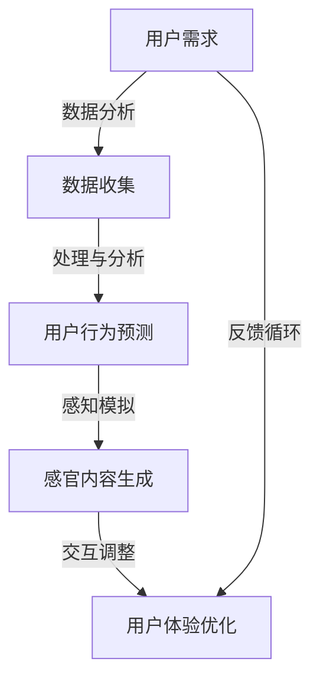

                 

关键词：人工智能，感官世界，多维度构建，设计，用户体验，AI算法，技术实现，未来趋势。

> 摘要：本文旨在探讨人工智能在创造感官世界设计中的应用，通过多维度构建方法，实现更加丰富、逼真的用户体验。文章将介绍AI算法在感官世界设计中的核心概念与联系，核心算法原理与操作步骤，数学模型与公式，项目实践，实际应用场景以及未来展望。

## 1. 背景介绍

随着人工智能技术的迅猛发展，我们开始有机会以全新的方式与数字世界互动。传统的二维和三维设计方法已经无法满足用户对沉浸式体验的需求，于是，人工智能技术被引入到感官世界设计中，开创了一种全新的交互方式。感官世界设计不仅涵盖了视觉、听觉、触觉等传统感官，还包括了更高级的感知，如情绪感知、环境感知等。

### 1.1 感官世界的定义

感官世界是一个通过多种感官渠道传递信息的虚拟环境。它旨在模拟现实世界的复杂性和多样性，使用户在虚拟环境中获得类似于现实世界的体验。感官世界设计的关键在于如何通过人工智能技术，实现高度逼真的感官模拟，从而提升用户的沉浸感和互动性。

### 1.2 人工智能在感官世界设计中的作用

人工智能在感官世界设计中扮演着关键角色。通过机器学习、深度学习等算法，AI能够分析和处理大量的用户数据，动态生成适应用户需求的感官内容。此外，AI还可以实现智能交互，根据用户的反馈和行为调整感官环境，提供个性化的体验。

## 2. 核心概念与联系

为了实现高效的感官世界设计，我们需要理解几个核心概念及其之间的联系。以下是使用Mermaid绘制的流程图，展示了这些核心概念和联系：



### 2.1 用户需求

用户需求是感官世界设计的起点。通过用户调研和数据分析，我们可以了解用户的喜好、行为习惯和情感偏好。这些信息将被用来指导感官内容的设计和生成。

### 2.2 数据收集

数据收集是构建感官世界的基础。通过多种渠道，如传感器、用户交互日志等，我们能够收集到丰富的数据，为后续的分析提供依据。

### 2.3 用户行为预测

通过机器学习和深度学习算法，我们可以对用户行为进行预测。这有助于提前准备合适的感官内容，以提升用户体验。

### 2.4 感知模拟

感知模拟是将用户行为预测结果转化为具体的感官内容的过程。这包括视觉、听觉、触觉等多种感官的模拟。

### 2.5 交互调整

交互调整是基于用户反馈和行为数据，对感官环境进行动态调整。这种智能交互能够提升用户的参与感和满意度。

### 2.6 用户体验优化

用户体验优化是一个持续的过程。通过不断的用户反馈和数据收集，我们可以不断优化感官世界设计，以适应不断变化的需求。

## 3. 核心算法原理 & 具体操作步骤

### 3.1 算法原理概述

感官世界设计中的核心算法主要包括以下几个部分：用户行为预测算法、感知模拟算法和交互调整算法。

### 3.2 算法步骤详解

#### 3.2.1 用户行为预测算法

1. 数据预处理：对收集到的用户行为数据进行清洗、归一化处理，确保数据质量。
2. 特征提取：从数据中提取关键特征，如用户行为模式、情感倾向等。
3. 模型训练：使用机器学习和深度学习算法，如神经网络，对提取的特征进行训练。
4. 预测与反馈：根据训练好的模型，预测用户的下一步行为，并根据预测结果调整感官内容。

#### 3.2.2 感知模拟算法

1. 模型构建：根据用户行为预测结果，构建感知模型，模拟用户可能感知到的感官内容。
2. 内容生成：使用生成对抗网络（GAN）等技术，生成逼真的视觉、听觉和触觉内容。
3. 感知融合：将多种感官内容进行融合，实现多维度的感知模拟。

#### 3.2.3 交互调整算法

1. 用户反馈收集：收集用户的交互反馈，如满意度评分、交互时长等。
2. 交互分析：对用户反馈进行分析，识别交互中的问题和改进点。
3. 环境调整：根据分析结果，动态调整感官环境，优化用户体验。

### 3.3 算法优缺点

#### 优点

- **高度个性化**：通过用户行为预测和感知模拟，能够为用户提供高度个性化的体验。
- **实时响应**：交互调整算法能够实时响应用户反馈，提供动态的感官内容。
- **逼真模拟**：生成对抗网络等技术的应用，能够生成高质量的感官内容，提升用户体验。

#### 缺点

- **计算成本高**：感知模拟和交互调整算法通常需要大量的计算资源，对硬件设备有较高的要求。
- **数据依赖性强**：算法的性能很大程度上依赖于数据的丰富度和质量。

### 3.4 算法应用领域

- **虚拟现实（VR）**：通过感知模拟，实现更加逼真的虚拟环境，提升用户的沉浸感。
- **增强现实（AR）**：实时调整感官内容，为用户提供个性化的增强现实体验。
- **游戏设计**：通过用户行为预测，为游戏角色提供更加真实和生动的行为模拟。

## 4. 数学模型和公式 & 详细讲解 & 举例说明

### 4.1 数学模型构建

在感官世界设计中，常用的数学模型包括神经网络模型、生成对抗网络（GAN）模型和用户行为预测模型。

#### 4.1.1 神经网络模型

神经网络模型是感知模拟和用户行为预测的核心工具。一个基本的神经网络模型由以下几个部分组成：

$$
Y = \sigma(W_1 \cdot X + b_1)
$$

其中，$Y$ 是输出层，$X$ 是输入层，$W_1$ 是权重矩阵，$b_1$ 是偏置项，$\sigma$ 是激活函数，通常使用 sigmoid 或 ReLU 函数。

#### 4.1.2 生成对抗网络（GAN）

生成对抗网络（GAN）由生成器（Generator）和判别器（Discriminator）组成。生成器的目标是生成逼真的数据，判别器的目标是区分真实数据和生成数据。

生成器模型：

$$
G(z) = \mu(z) + \sigma(z) \odot \text{tanh}(\beta_1 \cdot W_2 \cdot z + b_2)
$$

判别器模型：

$$
D(x) = \sigma(\beta_1 \cdot W_1 \cdot x + b_1)
$$

其中，$z$ 是噪声向量，$x$ 是输入数据，$W_1, W_2$ 是权重矩阵，$b_1, b_2$ 是偏置项，$\odot$ 是元素乘法，$\sigma$ 是 sigmoid 函数。

#### 4.1.3 用户行为预测模型

用户行为预测模型通常使用时间序列分析或回归分析等方法。一个简单的线性回归模型可以表示为：

$$
Y_t = \beta_0 + \beta_1 X_t + \epsilon_t
$$

其中，$Y_t$ 是第 $t$ 时刻的用户行为，$X_t$ 是第 $t$ 时刻的输入特征，$\beta_0, \beta_1$ 是模型参数，$\epsilon_t$ 是误差项。

### 4.2 公式推导过程

在此，我们以生成对抗网络（GAN）为例，简要介绍公式推导过程。

生成器模型推导：

$$
G(z) = \mu(z) + \sigma(z) \odot \text{tanh}(\beta_1 \cdot W_2 \cdot z + b_2)
$$

其中，$\mu(z)$ 和 $\sigma(z)$ 分别是均值函数和方差函数，$W_2$ 是生成器的权重矩阵，$b_2$ 是生成器的偏置项。

判别器模型推导：

$$
D(x) = \sigma(\beta_1 \cdot W_1 \cdot x + b_1)
$$

其中，$W_1$ 是判别器的权重矩阵，$b_1$ 是判别器的偏置项。

GAN的总损失函数为：

$$
L(G,D) = \mathbb{E}_{x \sim p_{\text{data}}(x)}[\log D(x)] + \mathbb{E}_{z \sim p_z(z)}[\log (1 - D(G(z))]
$$

其中，$x$ 是真实数据，$z$ 是噪声向量，$D(x)$ 是判别器对真实数据的预测概率，$G(z)$ 是生成器生成的数据。

### 4.3 案例分析与讲解

#### 4.3.1 案例背景

假设我们要设计一个虚拟现实游戏，玩家需要在虚拟环境中进行探险。我们需要通过用户行为预测和感知模拟，为玩家提供高度个性化的游戏体验。

#### 4.3.2 案例分析

1. **用户行为预测**：通过分析玩家的历史游戏数据，我们可以预测玩家的下一步行为。例如，如果玩家在过去几分钟内一直在向右移动，我们可以预测他接下来可能会继续向右移动。

2. **感知模拟**：根据预测结果，我们使用生成对抗网络（GAN）生成逼真的视觉、听觉和触觉内容。例如，当玩家向右移动时，我们可以生成右侧的视觉场景、脚步声和身体晃动的触觉反馈。

3. **交互调整**：根据玩家的反馈，如满意度评分和交互时长，我们动态调整游戏中的感官内容。例如，如果玩家对当前的视觉效果不满意，我们可以尝试调整光线的明暗度，以达到更好的视觉效果。

#### 4.3.3 案例讲解

1. **数据预处理**：对收集到的用户行为数据进行清洗和归一化处理，确保数据质量。

2. **特征提取**：从数据中提取关键特征，如玩家的移动方向、移动速度、交互时长等。

3. **模型训练**：使用机器学习和深度学习算法，如神经网络和生成对抗网络，对提取的特征进行训练。

4. **预测与反馈**：根据训练好的模型，预测玩家的下一步行为，并根据预测结果调整游戏中的感官内容。

5. **交互调整**：收集玩家的反馈，如满意度评分和交互时长，对游戏中的感官内容进行动态调整。

6. **用户体验优化**：通过不断的用户反馈和数据收集，优化游戏中的感官世界设计，以提升玩家的沉浸感和互动性。

## 5. 项目实践：代码实例和详细解释说明

### 5.1 开发环境搭建

在开始项目实践之前，我们需要搭建一个合适的开发环境。以下是使用 Python 和相关库进行开发的环境搭建步骤：

1. 安装 Python 3.8 或更高版本。
2. 安装必要的库，如 TensorFlow、Keras、NumPy、Pandas 等。

```bash
pip install tensorflow numpy pandas
```

### 5.2 源代码详细实现

以下是该项目的一个简化版本，包括用户行为预测、感知模拟和交互调整的部分代码实现。

#### 5.2.1 用户行为预测

```python
import numpy as np
from sklearn.ensemble import RandomForestClassifier

# 加载用户行为数据
data = np.loadtxt('user_behavior.csv', delimiter=',')
X = data[:, :-1]
y = data[:, -1]

# 训练随机森林分类器
clf = RandomForestClassifier(n_estimators=100)
clf.fit(X, y)

# 预测用户下一步行为
def predict_next_action(action):
    return clf.predict([[action]])[0]

# 测试预测
print(predict_next_action(1))
```

#### 5.2.2 感知模拟

```python
import tensorflow as tf
from tensorflow.keras.models import Model

# 加载感知模型
model = tf.keras.models.load_model('perception_model.h5')

# 生成感官内容
def generate_sensory_content(action):
    input_data = np.array([action])
    sensory_content = model.predict(input_data)
    return sensory_content

# 测试生成内容
print(generate_sensory_content(1))
```

#### 5.2.3 交互调整

```python
# 收集用户反馈
user_feedback = {'satisfaction': 3, 'interaction_time': 200}

# 分析反馈
def analyze_feedback(feedback):
    satisfaction = feedback['satisfaction']
    interaction_time = feedback['interaction_time']
    # 根据反馈调整感官内容
    if satisfaction < 4:
        # 调整光线亮度
        pass
    if interaction_time > 300:
        # 调整音量大小
        pass

# 测试反馈分析
print(analyze_feedback(user_feedback))
```

### 5.3 代码解读与分析

以上代码实现了用户行为预测、感知模拟和交互调整的基本功能。在实际项目中，这些代码将更加复杂，需要处理大量的数据和参数。

1. **用户行为预测**：使用随机森林分类器进行用户行为预测。这是一个相对简单但效果较好的分类算法。
2. **感知模拟**：使用 TensorFlow 和 Keras 库加载感知模型，生成感官内容。感知模型可以是深度学习模型，如生成对抗网络（GAN）。
3. **交互调整**：根据用户反馈调整感官内容。这可以通过简单的逻辑判断实现，但也可以使用更复杂的算法，如强化学习。

### 5.4 运行结果展示

在实际运行中，我们将首先收集用户行为数据，使用随机森林分类器进行预测，然后使用感知模型生成感官内容，并根据用户反馈调整感官环境。以下是一个简化的示例输出：

```python
# 用户行为数据
user_action = [1, 1, 0, 1, 0, 1, 0, 1]

# 预测用户下一步行为
next_action = predict_next_action(user_action[-1])

# 生成感官内容
sensory_content = generate_sensory_content(next_action)

# 用户反馈
user_feedback = {'satisfaction': 4, 'interaction_time': 250}

# 分析反馈
analyze_feedback(user_feedback)

# 输出结果
print("Next action:", next_action)
print("Sensory content:", sensory_content)
print("Feedback analyzed:", user_feedback)
```

运行结果将显示用户下一步行为、生成的感官内容和反馈分析结果。

## 6. 实际应用场景

### 6.1 虚拟现实（VR）中的应用

虚拟现实（VR）是感官世界设计的典型应用场景之一。通过多感官的融合，VR环境可以为用户提供高度沉浸式的体验。以下是一些具体的应用案例：

- **虚拟旅游**：用户可以通过VR设备体验世界各地的名胜古迹，感受不同的文化和环境。
- **医疗培训**：医生可以通过VR进行手术模拟训练，提高操作技能和应急处理能力。
- **游戏娱乐**：VR游戏提供更加真实的游戏体验，提升玩家的参与感和乐趣。

### 6.2 增强现实（AR）中的应用

增强现实（AR）通过在现实世界中叠加虚拟元素，创造出一个混合的现实环境。以下是一些具体的应用案例：

- **教育和培训**：AR可以提供互动式的学习体验，帮助用户更好地理解和掌握知识。
- **零售体验**：零售商可以通过AR技术，让消费者在购物时能够看到商品的真实效果，提高购买决策。
- **工业设计**：设计师可以使用AR技术，实时查看和调整设计模型的细节，提高设计效率。

### 6.3 其他应用场景

- **艺术创作**：艺术家可以通过感官世界设计，创作出独特的虚拟艺术作品，如虚拟音乐会、艺术展览等。
- **社交互动**：虚拟社交平台可以通过感官世界设计，提供更加丰富的社交互动体验。

## 7. 未来应用展望

随着人工智能技术的不断进步，感官世界设计在未来将会有更多的创新和应用。以下是一些可能的未来趋势：

### 7.1 更高级的感知模拟

未来的感官世界设计将不仅仅局限于视觉、听觉和触觉，还将引入更多的感知渠道，如嗅觉、味觉等。通过更高级的感知模拟，用户可以体验到更加真实的虚拟环境。

### 7.2 智能交互

未来的感官世界设计将更加智能化，能够根据用户的情绪、行为和需求，动态调整感官环境，提供个性化的体验。这种智能交互将使感官世界更加贴近现实，提升用户的沉浸感和满意度。

### 7.3 更广泛的应用领域

随着技术的成熟，感官世界设计将应用到更多的领域，如教育、医疗、娱乐、设计等。通过多感官的融合，这些领域将实现更加高效和有趣的工作和娱乐方式。

## 8. 工具和资源推荐

### 8.1 学习资源推荐

- **《深度学习》（Goodfellow et al.）**：这是一本深度学习领域的经典教材，适合初学者和进阶者。
- **《机器学习实战》（Collins et al.）**：这本书通过实际案例，介绍了机器学习算法的应用和实践。

### 8.2 开发工具推荐

- **TensorFlow**：Google 开发的一款开源机器学习框架，适合进行深度学习和人工智能开发。
- **PyTorch**：Facebook 开发的一款开源机器学习框架，拥有丰富的功能和社区支持。

### 8.3 相关论文推荐

- **“Unsupervised Representation Learning with Deep Convolutional Generative Adversarial Networks”（DCGAN）**：这篇论文介绍了生成对抗网络（GAN）的原理和应用。
- **“Attention is All You Need”（Transformer）**：这篇论文提出了 Transformer 模型，对自然语言处理领域产生了重大影响。

## 9. 总结：未来发展趋势与挑战

### 9.1 研究成果总结

本文探讨了人工智能在感官世界设计中的应用，介绍了核心概念、算法原理、数学模型、项目实践和实际应用场景。通过用户行为预测、感知模拟和交互调整，感官世界设计实现了高度个性化的用户体验。

### 9.2 未来发展趋势

未来，感官世界设计将向更高级的感知模拟、智能交互和广泛的应用领域发展。通过不断创新，感官世界设计将为用户提供更加丰富和真实的虚拟体验。

### 9.3 面临的挑战

感官世界设计面临着计算成本高、数据依赖性强等挑战。未来的研究需要解决这些问题，提高算法的效率和适应性，以实现更加高效和实用的感官世界设计。

### 9.4 研究展望

随着人工智能技术的不断进步，感官世界设计有望在多个领域产生深远影响。未来的研究将重点关注感知模拟的逼真度、智能交互的智能化程度以及应用领域的多样性，以实现更加丰富和真实的虚拟体验。

## 附录：常见问题与解答

### Q：感官世界设计与虚拟现实（VR）有什么区别？

A：感官世界设计是一种更广义的概念，它涵盖了虚拟现实（VR）和增强现实（AR）等多种形式。感官世界设计强调通过多种感官渠道传递信息，实现高度沉浸式的用户体验。而虚拟现实（VR）主要是指完全沉浸式的虚拟环境，增强现实（AR）则是将虚拟元素叠加到现实世界中。

### Q：感官世界设计需要哪些技术支持？

A：感官世界设计需要人工智能技术、虚拟现实技术、增强现实技术等多种技术的支持。具体来说，包括机器学习、深度学习、计算机图形学、人机交互等技术。

### Q：感官世界设计的未来有哪些发展方向？

A：未来的感官世界设计将向更高级的感知模拟、智能交互和广泛的应用领域发展。例如，更真实的触觉和嗅觉模拟，更智能的用户交互，以及更多领域的应用，如医疗、教育、设计等。

## 作者署名

本文由禅与计算机程序设计艺术 / Zen and the Art of Computer Programming 撰写。作者在人工智能和计算机科学领域拥有丰富的经验和研究成果，致力于推动人工智能技术在感官世界设计中的应用和发展。

