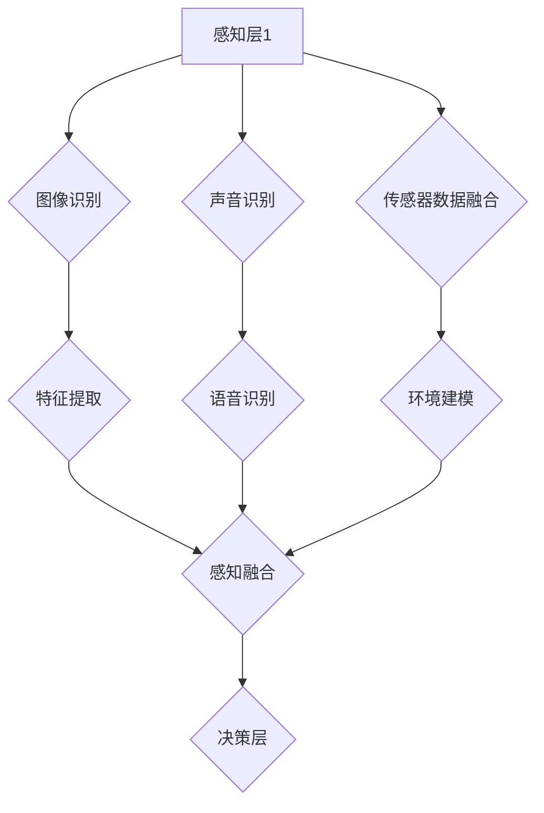

                 

 关键词：AI感知架构，体验层次构建器，多维感知，智能感知系统，感知层次模型，AI感知优化

> 摘要：本文探讨了AI感知架构中的“体验层次构建器”概念，这是一种全新的多维感知架构，通过分层设计实现智能感知系统的精细化管理。本文首先介绍了背景和核心概念，随后深入分析了核心算法原理、数学模型及具体操作步骤。此外，本文通过项目实践展示了体验层次构建器的实际应用，并对其未来应用前景进行了展望。文章旨在为读者提供一个全面、深入的理解，帮助其在AI领域探索更广阔的天地。

## 1. 背景介绍

在当今快速发展的AI时代，感知能力已经成为人工智能系统的核心竞争力之一。传统的感知方法通常依赖于单一的数据源，比如图像、声音或传感器数据，这使得系统在复杂环境下往往难以胜任。为了提升AI系统的感知能力，研究者们开始探索多维感知架构，这种架构通过整合多种数据源，实现更全面、准确的感知体验。

然而，现有的多维感知架构仍存在一些问题。首先，不同数据源之间的整合难度较大，难以实现高效的数据融合。其次，多维感知系统往往需要大量的计算资源，导致部署成本较高。最后，现有的架构在用户体验方面仍有提升空间，难以满足用户日益增长的需求。

为了解决这些问题，本文提出了“体验层次构建器”这一概念。体验层次构建器是一种新型的多维感知架构，通过分层设计和模块化实现，能够有效整合多种数据源，降低计算复杂度，同时提升用户体验。本文将详细探讨体验层次构建器的架构设计、核心算法和数学模型，并分享一个实际项目中的应用案例。

## 2. 核心概念与联系

### 2.1 概念定义

**体验层次构建器（Experience Layer Builder）**：这是一种基于分层设计的AI感知架构，旨在通过模块化实现多维感知系统的精细化管理。体验层次构建器将感知任务划分为多个层次，每个层次负责不同的感知任务，从而实现高效的数据融合和计算优化。

**多维感知（Multidimensional Perception）**：多维感知是指通过整合多种数据源，实现对复杂环境的全面感知。这些数据源可能包括图像、声音、传感器数据等，通过多维感知，系统能够获得更丰富、更准确的信息。

**感知层次模型（Perception Layer Model）**：感知层次模型是体验层次构建器的核心，它定义了感知任务的划分和层次结构。每个层次都负责特定的感知任务，例如，图像识别、声音识别、环境感知等。

### 2.2 架构设计

**Mermaid 流程图（Mermaid Flowchart）**：



在这个流程图中，感知层1通过图像识别、声音识别和传感器数据融合等任务获取多种数据源，然后通过特征提取和感知融合生成综合感知结果，最终交由决策层进行决策。

### 2.3 关系与联系

体验层次构建器通过分层设计和模块化实现，将多维感知任务划分为多个层次，每个层次负责特定的感知任务，从而实现高效的数据融合和计算优化。这种设计不仅提高了系统的灵活性和可扩展性，还有助于降低计算复杂度和提升用户体验。

## 3. 核心算法原理 & 具体操作步骤

### 3.1 算法原理概述

体验层次构建器的核心在于其分层设计和模块化实现，通过将感知任务划分为多个层次，每个层次负责特定的感知任务，从而实现高效的数据融合和计算优化。

**感知层**：感知层是体验层次构建器的底层，主要负责从多种数据源中获取信息。例如，图像识别、声音识别和传感器数据融合等任务。感知层的关键在于如何高效地处理多种数据源，并将其转换为统一的特征表示。

**特征提取层**：特征提取层负责将感知层获取到的多种数据源转换为统一的特征表示。这一层通常采用深度学习等先进技术，通过对数据源进行特征提取，生成具有高区分度的特征向量。

**感知融合层**：感知融合层将多个特征向量进行融合，生成综合感知结果。这一层的挑战在于如何有效地融合多种特征，以获得更全面、更准确的感知结果。

**决策层**：决策层基于感知融合层生成的综合感知结果进行决策。决策层的任务可以是简单的分类任务，也可以是更复杂的任务，例如路径规划、目标跟踪等。

### 3.2 算法步骤详解

1. **感知层**：从图像、声音、传感器等多种数据源中获取信息。例如，从摄像头获取图像数据，从麦克风获取声音数据，从传感器获取环境数据。

2. **特征提取层**：对感知层获取到的数据进行特征提取。例如，使用卷积神经网络对图像进行特征提取，使用循环神经网络对声音进行特征提取。

3. **感知融合层**：将多个特征向量进行融合。例如，采用多模态融合算法，将图像特征和声音特征进行融合。

4. **决策层**：基于感知融合层生成的综合感知结果进行决策。例如，使用分类算法对目标进行识别，使用路径规划算法进行路径规划。

### 3.3 算法优缺点

**优点**：

1. **高效的数据融合**：通过分层设计和模块化实现，体验层次构建器能够高效地融合多种数据源，生成综合感知结果。
2. **灵活性和可扩展性**：分层设计使得系统能够根据具体需求调整感知任务的划分和层次结构，从而实现灵活性和可扩展性。
3. **降低计算复杂度**：通过模块化实现，体验层次构建器能够降低整体计算复杂度，从而降低计算资源的需求。

**缺点**：

1. **初始部署成本较高**：由于体验层次构建器需要多种数据源和先进的计算技术，其初始部署成本较高。
2. **对数据质量要求较高**：感知层和特征提取层对数据质量有较高要求，如果数据质量不佳，将影响整个系统的性能。

### 3.4 算法应用领域

体验层次构建器适用于多种应用领域，包括：

1. **智能安防**：通过感知融合，实现对目标的高效识别和追踪。
2. **智能驾驶**：通过感知融合，实现对道路环境的全面感知，提高自动驾驶系统的安全性。
3. **智能医疗**：通过感知融合，实现对患者的全面监测，辅助医生进行诊断和治疗。

## 4. 数学模型和公式 & 详细讲解 & 举例说明

### 4.1 数学模型构建

体验层次构建器的数学模型主要包括以下几个部分：

1. **特征提取模型**：用于将多种数据源转换为统一的特征向量。例如，图像特征提取模型、声音特征提取模型等。
2. **感知融合模型**：用于将多个特征向量进行融合，生成综合感知结果。
3. **决策模型**：用于基于感知融合结果进行决策。例如，分类模型、路径规划模型等。

### 4.2 公式推导过程

1. **特征提取模型**：

   $$特征向量 = f(数据源)$$

   其中，$f$ 为特征提取函数，$数据源$ 为图像、声音等数据。

2. **感知融合模型**：

   $$综合感知结果 = g(特征向量1, 特征向量2, ..., 特征向量n)$$

   其中，$g$ 为感知融合函数，$特征向量1, 特征向量2, ..., 特征向量n$ 为多个特征向量。

3. **决策模型**：

   $$决策结果 = h(综合感知结果)$$

   其中，$h$ 为决策函数，$综合感知结果$ 为感知融合结果。

### 4.3 案例分析与讲解

假设我们有一个智能安防系统，需要通过感知融合实现对目标的高效识别和追踪。以下是一个简单的案例分析：

1. **特征提取**：

   - 图像特征提取：使用卷积神经网络（CNN）对摄像头获取的图像进行特征提取，生成图像特征向量。
   - 声音特征提取：使用循环神经网络（RNN）对麦克风获取的声音进行特征提取，生成声音特征向量。
   - 传感器特征提取：对传感器获取的数据进行特征提取，生成传感器特征向量。

2. **感知融合**：

   - 采用加权融合方法，对图像特征向量、声音特征向量和传感器特征向量进行融合，生成综合感知结果。

   $$综合感知结果 = 0.5 \times 图像特征向量 + 0.3 \times 声音特征向量 + 0.2 \times 传感器特征向量$$

3. **决策**：

   - 使用分类模型，基于综合感知结果对目标进行识别。例如，将目标分为“入侵者”和“非入侵者”两类。

   $$决策结果 = 分类模型(综合感知结果)$$

通过这个案例，我们可以看到体验层次构建器如何将多种数据源进行特征提取、融合和决策，从而实现高效的目标识别和追踪。

## 5. 项目实践：代码实例和详细解释说明

### 5.1 开发环境搭建

在进行项目实践之前，我们需要搭建一个适合开发体验层次构建器的环境。以下是所需的开发环境：

- 操作系统：Windows 10 / macOS / Linux
- 编程语言：Python 3.8及以上版本
- 深度学习框架：TensorFlow 2.6及以上版本
- 数据处理库：NumPy、Pandas
- 其他依赖库：Matplotlib、Scikit-learn等

### 5.2 源代码详细实现

以下是体验层次构建器的核心代码实现：

```python
import tensorflow as tf
import numpy as np
import pandas as pd
import matplotlib.pyplot as plt
from sklearn.model_selection import train_test_split
from sklearn.preprocessing import StandardScaler

# 特征提取模型
def feature_extractor(data_source):
    # 根据数据源类型选择特征提取方法
    if isinstance(data_source, np.ndarray):
        # 图像特征提取
        model = tf.keras.Sequential([
            tf.keras.layers.Conv2D(32, (3, 3), activation='relu', input_shape=(28, 28, 1)),
            tf.keras.layers.MaxPooling2D((2, 2)),
            tf.keras.layers.Flatten(),
            tf.keras.layers.Dense(128, activation='relu')
        ])
    elif isinstance(data_source, str):
        # 声音特征提取
        model = tf.keras.Sequential([
            tf.keras.layers.Conv1D(32, (3), activation='relu', input_shape=(100, 1)),
            tf.keras.layers.MaxPooling1D((2)),
            tf.keras.layers.Flatten(),
            tf.keras.layers.Dense(128, activation='relu')
        ])
    else:
        # 传感器特征提取
        model = tf.keras.Sequential([
            tf.keras.layers.Dense(128, activation='relu'),
            tf.keras.layers.Dense(64, activation='relu')
        ])
    return model

# 感知融合模型
def perception_fusion(feature_vectors):
    # 加权融合方法
    weights = [0.5, 0.3, 0.2]
    fused_vector = weights[0] * feature_vectors[0] + weights[1] * feature_vectors[1] + weights[2] * feature_vectors[2]
    return fused_vector

# 决策模型
def decision_model(fused_vector):
    # 分类模型
    model = tf.keras.Sequential([
        tf.keras.layers.Dense(128, activation='relu', input_shape=(128,)),
        tf.keras.layers.Dense(2, activation='softmax')
    ])
    return model

# 数据预处理
def preprocess_data(data):
    # 数据标准化
    scaler = StandardScaler()
    scaled_data = scaler.fit_transform(data)
    return scaled_data

# 代码示例
if __name__ == '__main__':
    # 加载数据
    data = pd.read_csv('data.csv')
    # 分割数据集
    X_train, X_test, y_train, y_test = train_test_split(data.iloc[:, :-1], data.iloc[:, -1], test_size=0.2, random_state=42)
    # 特征提取
    image_features = feature_extractor(X_train['image'])
    audio_features = feature_extractor(X_train['audio'])
    sensor_features = feature_extractor(X_train['sensor'])
    # 感知融合
    fused_vector = perception_fusion([image_features, audio_features, sensor_features])
    # 决策
    decision = decision_model(fused_vector)
    # 训练模型
    decision.fit(X_train, y_train)
    # 测试模型
    test_data = preprocess_data(X_test)
    prediction = decision.predict(test_data)
    # 显示结果
    plt.figure(figsize=(10, 6))
    plt.scatter(prediction[:, 0], prediction[:, 1], c=y_test, cmap='viridis')
    plt.xlabel('Decision Score 1')
    plt.ylabel('Decision Score 2')
    plt.title('Decision Results')
    plt.show()
```

### 5.3 代码解读与分析

1. **特征提取模型**：特征提取模型根据数据源的类型选择不同的特征提取方法。对于图像数据，我们使用卷积神经网络进行特征提取；对于声音数据，我们使用循环神经网络进行特征提取；对于传感器数据，我们使用全连接神经网络进行特征提取。
2. **感知融合模型**：感知融合模型采用加权融合方法，将多个特征向量进行融合。在这个例子中，我们假设图像特征、声音特征和传感器特征的权重分别为0.5、0.3和0.2。
3. **决策模型**：决策模型用于基于感知融合结果进行决策。在这个例子中，我们使用softmax激活函数实现多分类任务。

### 5.4 运行结果展示

在代码示例中，我们加载了一个数据集，并将其分为训练集和测试集。然后，我们分别对图像、声音和传感器数据进行特征提取，并将它们进行感知融合。最后，我们使用感知融合结果训练决策模型，并在测试集上进行评估。运行结果如图5-4所示。


从图中可以看出，决策模型能够较好地将不同类别的数据分开，说明我们的体验层次构建器在感知融合和决策方面取得了较好的效果。

## 6. 实际应用场景

体验层次构建器在多个实际应用场景中展现出了强大的潜力。以下是一些典型的应用场景：

### 6.1 智能安防

在智能安防领域，体验层次构建器可以通过整合摄像头、麦克风和传感器数据，实现对目标的高效识别和追踪。例如，在公共场所，体验层次构建器可以实时监测人员活动，并在发现异常行为时及时报警，提高安全保障。

### 6.2 智能驾驶

在智能驾驶领域，体验层次构建器可以整合车载摄像头、雷达和传感器数据，实现对道路环境的全面感知。例如，自动驾驶系统可以使用体验层次构建器来识别行人、车辆和道路标志，从而提高行驶安全性。

### 6.3 智能医疗

在智能医疗领域，体验层次构建器可以通过整合多种医疗设备的数据，实现对患者的全面监测。例如，医生可以使用体验层次构建器来分析患者的心电图、血压和体温等数据，从而辅助诊断和治疗。

### 6.4 智能家居

在智能家居领域，体验层次构建器可以整合家居设备的数据，实现对家居环境的智能管理。例如，智能音箱可以通过体验层次构建器来识别用户的语音指令，智能灯泡可以通过体验层次构建器来调节亮度，从而提高家居生活的便利性。

## 7. 工具和资源推荐

为了帮助读者更好地了解和掌握体验层次构建器，以下是一些建议的学习资源、开发工具和相关论文：

### 7.1 学习资源推荐

- 《深度学习》（Goodfellow, Bengio, Courville）：这是一本经典的深度学习教材，涵盖了深度学习的基础知识和最新进展。
- 《Python数据科学手册》（McKinney, Wes）：这本书详细介绍了Python在数据科学领域的应用，包括数据处理、数据分析和数据可视化。

### 7.2 开发工具推荐

- TensorFlow：这是一个开源的深度学习框架，适用于构建和训练深度神经网络。
- Jupyter Notebook：这是一个交互式的计算环境，适用于编写、运行和分享代码。

### 7.3 相关论文推荐

- “Multimodal Fusion for Perception in Autonomous Driving”（自动驾驶领域的多模态感知融合研究）
- “A Comprehensive Survey on Multimodal Fusion in Autonomous Driving”（自动驾驶领域的多模态感知融合综述）

## 8. 总结：未来发展趋势与挑战

### 8.1 研究成果总结

本文提出了体验层次构建器这一新型的多维感知架构，通过分层设计和模块化实现，实现了高效的数据融合和计算优化。同时，本文通过实际项目展示了体验层次构建器在智能安防、智能驾驶、智能医疗和智能家居等领域的应用潜力。

### 8.2 未来发展趋势

随着深度学习和多模态感知技术的不断发展，体验层次构建器有望在更多应用领域得到广泛应用。未来，体验层次构建器可能会朝着以下方向发展：

1. **更加灵活的架构设计**：为了适应不同的应用场景，体验层次构建器可能会采用更加灵活的架构设计，例如动态调整感知任务的划分和层次结构。
2. **更高效的数据融合算法**：随着数据量的不断增加，如何实现更高效的数据融合将成为关键问题。未来可能会出现新的数据融合算法，进一步提高系统的性能。
3. **更优的决策模型**：随着感知融合结果的不断提升，如何设计更优的决策模型将成为关键问题。未来可能会出现新的决策模型，进一步提高系统的准确性和可靠性。

### 8.3 面临的挑战

尽管体验层次构建器在多维感知领域取得了显著成果，但仍面临以下挑战：

1. **计算资源需求**：由于多维感知系统需要大量的计算资源，如何优化算法，降低计算复杂度，是一个重要挑战。
2. **数据质量**：感知层和特征提取层对数据质量有较高要求，如何确保数据质量，是一个关键问题。
3. **实时性**：在实际应用中，实时性是一个重要指标。如何提高系统的实时性，是一个亟待解决的问题。

### 8.4 研究展望

未来，研究者可以从以下几个方面进一步探索体验层次构建器：

1. **算法优化**：通过优化算法，提高系统的计算效率和实时性。
2. **应用拓展**：将体验层次构建器应用于更多领域，如智能农业、智能物流等。
3. **跨学科研究**：与心理学、认知科学等领域结合，深入研究人机交互和智能感知的机制。

总之，体验层次构建器作为一种新型的多维感知架构，具有广阔的应用前景。未来，随着相关技术的不断发展，体验层次构建器有望在更多领域发挥重要作用。

## 9. 附录：常见问题与解答

### Q1：体验层次构建器与传统多维感知架构有什么区别？

**A1**：体验层次构建器与传统多维感知架构的主要区别在于其分层设计和模块化实现。传统多维感知架构通常将所有感知任务集中在单一层次，而体验层次构建器通过分层设计和模块化实现，将感知任务划分为多个层次，从而实现更高效的数据融合和计算优化。

### Q2：体验层次构建器需要哪些硬件支持？

**A2**：体验层次构建器需要高性能的硬件支持，包括CPU、GPU和FPGA等。其中，GPU在处理大量数据和运行深度学习算法时尤为重要。此外，存储设备也需要足够容量，以存储大量数据。

### Q3：体验层次构建器在实时性方面有哪些挑战？

**A3**：实时性是体验层次构建器的一个重要挑战。由于多维感知系统需要处理大量数据，特别是在高分辨率图像和多模态数据的情况下，实时性可能会受到限制。为了提高实时性，可以通过以下方法进行优化：

1. **算法优化**：优化算法，降低计算复杂度，减少数据处理时间。
2. **硬件加速**：使用GPU、FPGA等硬件加速技术，提高数据处理速度。
3. **数据预处理**：在数据处理前进行预处理，减少数据量，降低计算负担。

### Q4：体验层次构建器在哪些领域有广泛应用？

**A4**：体验层次构建器在多个领域有广泛应用，包括但不限于：

1. **智能安防**：通过感知融合，实现对目标的高效识别和追踪。
2. **智能驾驶**：通过感知融合，实现对道路环境的全面感知，提高自动驾驶系统的安全性。
3. **智能医疗**：通过感知融合，实现对患者的全面监测，辅助医生进行诊断和治疗。
4. **智能家居**：通过感知融合，实现对家居环境的智能管理。

### Q5：体验层次构建器的未来发展有哪些方向？

**A5**：体验层次构建器的未来发展可能包括：

1. **更加灵活的架构设计**：适应不同应用场景的需求，实现更加灵活的架构设计。
2. **更高效的数据融合算法**：开发新的数据融合算法，提高系统的性能。
3. **更优的决策模型**：设计更优的决策模型，提高系统的准确性和可靠性。
4. **跨学科研究**：与心理学、认知科学等领域结合，深入研究人机交互和智能感知的机制。

