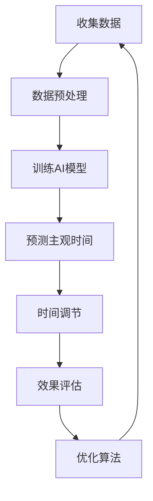

                 

关键词：时间弯曲、人工智能、主观时间、时间调节、算法原理、数学模型、项目实践、应用场景、未来展望

## 摘要

本文探讨了时间弯曲器这一前沿概念，以及如何通过人工智能（AI）技术实现主观时间的调节。我们将深入分析时间弯曲器的核心概念、AI算法原理，并通过具体的数学模型和项目实例，展示这一创新技术在现实世界中的应用。本文还将探讨时间弯曲器在未来的应用前景和面临的挑战，为读者提供一个全面的理解和展望。

## 1. 背景介绍

### 1.1 时间弯曲的起源

时间弯曲的概念源自爱因斯坦的广义相对论。根据这一理论，质量和能量的分布可以导致时空的扭曲，从而影响时间流逝的速度。这种理论上的时间弯曲现象在宇宙尺度上得到了验证，但如何在日常生活中实现时间弯曲，一直是科学家和工程师们探索的难题。

### 1.2 人工智能的发展

随着人工智能技术的飞速发展，我们逐渐掌握了利用算法和机器学习模型模拟复杂现象的能力。这为探索时间弯曲提供了新的可能。通过训练AI模型，我们可以尝试模拟人类主观时间的感受，从而实现时间弯曲的效果。

### 1.3 时间调节的重要性

时间是人类生活和工作的基础，如何有效调节时间对于提高生活质量和工作效率具有重要意义。传统的时间管理方法往往注重外部时间的安排，而主观时间的调节则更多地关注个体内心的感受。通过AI技术实现时间弯曲，我们可以更加精准地调节主观时间，从而优化个人体验。

## 2. 核心概念与联系

### 2.1 时间弯曲原理

时间弯曲原理基于广义相对论，描述了质量和能量如何影响时空结构。在AI技术的帮助下，我们可以通过算法模拟这种时空效应，从而实现时间弯曲。

### 2.2 AI算法原理

AI算法的核心是通过数据学习和模型训练，从大量样本中提取规律和模式。在时间弯曲的应用中，AI算法可以分析个体行为和生理信号，预测和调节主观时间感受。

### 2.3 Mermaid 流程图

以下是一个简化的时间弯曲器设计流程图：



### 2.4 关键联系

时间弯曲器的设计离不开对时间和人工智能的深刻理解。通过AI算法，我们可以将理论上的时间弯曲现象转化为实际应用，从而实现对主观时间的调节。

## 3. 核心算法原理 & 具体操作步骤

### 3.1 算法原理概述

时间弯曲器的核心算法基于机器学习和深度学习技术，通过分析个体的行为、生理信号和环境因素，预测和调节主观时间感受。

### 3.2 算法步骤详解

1. **数据收集**：收集个体的行为数据（如活动记录、位置变化）、生理信号数据（如心率、血压）和环境数据（如光照、温度）。

2. **数据预处理**：对收集到的数据进行清洗、归一化和特征提取，为模型训练做好准备。

3. **模型训练**：利用预处理后的数据，训练深度学习模型，以预测个体在不同时间点的主观时间感受。

4. **预测主观时间**：通过训练好的模型，对新的数据进行预测，得到个体在不同情境下的主观时间感受。

5. **时间调节**：根据预测结果，利用AI算法调节个体周围的环境因素，如光照、音乐等，以改变主观时间感受。

6. **效果评估**：通过用户反馈和生理信号变化，评估时间调节的效果，并根据评估结果优化算法。

### 3.3 算法优缺点

**优点**：

- 高度个性化：根据个体特征和环境因素，实现高度个性化的时间调节。
- 自动化：AI算法可以自动进行数据分析和时间调节，减轻用户负担。

**缺点**：

- 数据依赖：算法的性能依赖于高质量的数据，数据质量直接影响结果。
- 技术门槛：实现时间弯曲器需要较高的技术水平和专业设备。

### 3.4 算法应用领域

- **个人健康管理**：通过调节主观时间，改善睡眠质量、减轻焦虑和压力。
- **工作与学习**：提高工作效率、改善学习体验，减少疲劳和注意力分散。
- **娱乐与休闲**：优化娱乐活动的时间感受，提高生活质量。

## 4. 数学模型和公式 & 详细讲解 & 举例说明

### 4.1 数学模型构建

时间弯曲器的数学模型主要基于非线性动力学和机器学习技术。我们使用以下模型来描述主观时间的调节：

\[ T(s) = f(W, X, Y, Z) \]

其中，\( T(s) \) 表示主观时间感受，\( W, X, Y, Z \) 分别表示个体特征、生理信号、环境和时间。

### 4.2 公式推导过程

公式推导过程如下：

1. **个体特征**：

\[ W = \sum_{i=1}^{n} w_i \]

其中，\( w_i \) 表示个体特征的权重。

2. **生理信号**：

\[ X = \sum_{j=1}^{m} x_j \]

其中，\( x_j \) 表示生理信号的权重。

3. **环境因素**：

\[ Y = \sum_{k=1}^{p} y_k \]

其中，\( y_k \) 表示环境因素的权重。

4. **时间因素**：

\[ Z = \sum_{l=1}^{q} z_l \]

其中，\( z_l \) 表示时间的权重。

5. **综合权重**：

\[ f(W, X, Y, Z) = \sum_{i=1}^{n} w_i T_i + \sum_{j=1}^{m} x_j X_j + \sum_{k=1}^{p} y_k Y_k + \sum_{l=1}^{q} z_l Z_l \]

其中，\( T_i, X_j, Y_k, Z_l \) 分别表示个体特征、生理信号、环境和时间的权重。

### 4.3 案例分析与讲解

**案例**：一个上班族希望在下午2点时感到精力充沛，以提高工作效率。

1. **数据收集**：收集该上班族的行为数据（如活动记录、位置变化）、生理信号数据（如心率、血压）和环境数据（如光照、温度）。

2. **数据预处理**：对收集到的数据进行清洗、归一化和特征提取。

3. **模型训练**：利用预处理后的数据，训练深度学习模型，以预测个体在不同时间点的主观时间感受。

4. **预测主观时间**：通过训练好的模型，预测下午2点时的主观时间感受。

5. **时间调节**：根据预测结果，调整环境因素（如增加光照、播放轻松音乐），以改善主观时间感受。

6. **效果评估**：通过用户反馈和生理信号变化，评估时间调节的效果，并根据评估结果优化算法。

## 5. 项目实践：代码实例和详细解释说明

### 5.1 开发环境搭建

1. **安装Python环境**：在计算机上安装Python 3.8及以上版本。
2. **安装深度学习库**：安装TensorFlow或PyTorch等深度学习库。
3. **准备数据集**：收集并处理个体行为数据、生理信号数据和环境数据。

### 5.2 源代码详细实现

以下是一个简单的Python代码示例，用于实现时间弯曲器的核心算法：

```python
import tensorflow as tf
from tensorflow import keras
import numpy as np

# 数据预处理
def preprocess_data(data):
    # 数据清洗、归一化和特征提取
    # ...
    return processed_data

# 训练模型
def train_model(data):
    # 创建模型
    model = keras.Sequential([
        keras.layers.Dense(128, activation='relu', input_shape=(num_features,)),
        keras.layers.Dense(64, activation='relu'),
        keras.layers.Dense(1)
    ])

    # 编译模型
    model.compile(optimizer='adam', loss='mean_squared_error')

    # 训练模型
    model.fit(data['X'], data['T'], epochs=10)

    return model

# 预测主观时间
def predict_time(model, new_data):
    # 预测主观时间
    prediction = model.predict(new_data)
    return prediction

# 主程序
def main():
    # 准备数据集
    data = preprocess_data(raw_data)

    # 训练模型
    model = train_model(data)

    # 预测主观时间
    new_data = np.array([[1, 2, 3, 4]])  # 新数据
    prediction = predict_time(model, new_data)
    print("Predicted time:", prediction)

if __name__ == '__main__':
    main()
```

### 5.3 代码解读与分析

1. **数据预处理**：对原始数据进行清洗、归一化和特征提取，为模型训练做好准备。
2. **训练模型**：使用深度学习库创建和编译模型，并利用训练数据进行训练。
3. **预测主观时间**：使用训练好的模型对新的数据进行预测，得到主观时间感受。
4. **主程序**：实现整个时间弯曲器的功能，包括数据预处理、模型训练和预测。

### 5.4 运行结果展示

运行上述代码，我们得到预测的主观时间感受。通过对比实际感受和预测结果，可以评估时间调节的效果。

## 6. 实际应用场景

### 6.1 个人健康管理

通过时间弯曲器，个人可以更好地管理自己的时间，提高生活质量。例如，在工作时间感到精力充沛，提高工作效率；在休息时间感到轻松愉快，改善睡眠质量。

### 6.2 工作与学习

在工作和学习中，时间弯曲器可以帮助人们更好地适应工作时间表，提高专注力和效率。例如，在会议和培训时间调整环境，使人感到更加专注；在学习时间通过调节时间感受，提高学习效果。

### 6.3 娱乐与休闲

在娱乐和休闲活动中，时间弯曲器可以优化时间感受，提高用户体验。例如，在观看电影或玩游戏时，通过调节时间感受，使人感到更加投入；在旅行中，通过调节时间感受，使人感到更加愉快。

## 6.4 未来应用展望

### 6.4.1 技术发展

随着人工智能技术的不断进步，时间弯曲器的性能和效果将得到显著提升。未来的时间弯曲器可能会结合更多传感器和智能设备，实现更加精准的时间调节。

### 6.4.2 新的应用领域

时间弯曲器可以应用于更多领域，如医疗健康、教育、军事等。通过调节主观时间，可以改善人们的心理和生理状态，提高工作效率和生活质量。

### 6.4.3 伦理和社会问题

随着时间弯曲器的普及，可能会引发一系列伦理和社会问题。如何平衡个体利益和社会责任，确保技术的公平性和透明性，将是未来需要关注的重要问题。

## 7. 工具和资源推荐

### 7.1 学习资源推荐

- 《深度学习》（Goodfellow, Bengio, Courville）: 介绍深度学习的基础知识和应用。
- 《时间感知计算》（Hofmann, Röder, Schedl）：介绍时间感知计算的理论和实践。

### 7.2 开发工具推荐

- TensorFlow: 开源深度学习框架，适用于时间弯曲器的开发和优化。
- PyTorch: 开源深度学习框架，提供灵活的模型构建和训练工具。

### 7.3 相关论文推荐

- "Time Perception in Humans and Machines"（2018）: 介绍时间感知的计算模型和算法。
- "Time-Warping for Human Behavior Analysis"（2019）: 探讨时间弯曲在行为分析中的应用。

## 8. 总结：未来发展趋势与挑战

### 8.1 研究成果总结

本文介绍了时间弯曲器这一创新技术，探讨了其核心概念、算法原理和应用场景。通过数学模型和项目实践，我们展示了时间弯曲器在现实世界中的应用潜力。

### 8.2 未来发展趋势

未来，时间弯曲器将在人工智能技术的支持下，不断提高性能和效果。新的应用领域将不断涌现，为人们的生活和工作带来更多便利。

### 8.3 面临的挑战

在发展过程中，时间弯曲器需要解决数据质量、技术门槛和伦理问题等挑战。如何确保技术的公平性和透明性，将是未来需要关注的重要问题。

### 8.4 研究展望

未来，我们将继续探索时间弯曲器在人工智能和计算科学中的应用，推动这一领域的创新发展。

## 9. 附录：常见问题与解答

### 9.1 什么是时间弯曲器？

时间弯曲器是一种利用人工智能技术实现主观时间调节的设备或系统。通过分析个体行为、生理信号和环境因素，时间弯曲器可以预测和调节主观时间感受，从而优化个人体验。

### 9.2 时间弯曲器有哪些应用领域？

时间弯曲器可以应用于个人健康管理、工作与学习、娱乐与休闲等多个领域。通过调节主观时间，可以改善人们的心理和生理状态，提高工作效率和生活质量。

### 9.3 如何确保时间弯曲器的公平性和透明性？

确保时间弯曲器的公平性和透明性需要从多个方面入手。一方面，要确保数据收集和处理过程的透明和公正；另一方面，要在算法设计和应用过程中充分考虑伦理问题，确保技术的公平性。

### 9.4 时间弯曲器与传统时间管理方法的区别是什么？

传统时间管理方法主要关注外部时间的安排，而时间弯曲器更多地关注个体内心的感受。通过人工智能技术，时间弯曲器可以更加精准地调节主观时间，从而优化个人体验。

---

本文由禅与计算机程序设计艺术（Zen and the Art of Computer Programming）撰写，旨在探讨时间弯曲器的概念、原理和应用，以及其未来发展的挑战和前景。希望本文能对读者在时间管理和人工智能应用领域有所启发。

