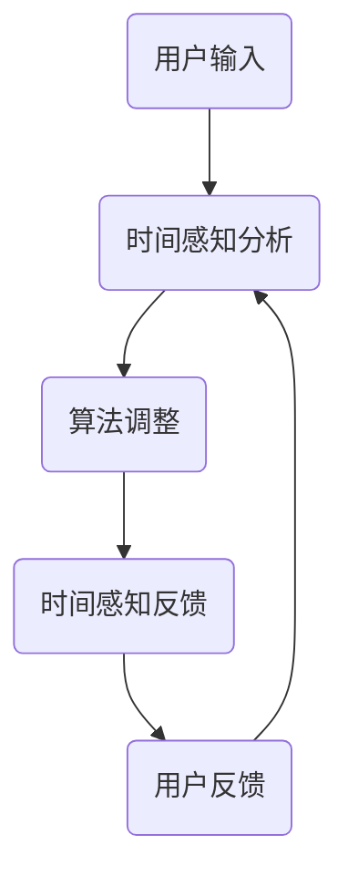

                 

关键词：时间弯曲，人工智能，主观时间，算法，数学模型，实践应用，未来展望。

> 摘要：本文将探讨如何通过人工智能技术实现主观时间调节，即体验时间弯曲器。我们将深入探讨其核心概念、算法原理、数学模型，并通过实际项目案例展示其在现实中的应用和未来展望。

## 1. 背景介绍

时间，作为自然界的基本维度之一，自古以来就被人们所关注。然而，时间并非是一个统一的、恒定的概念，而是随着观察者的不同而有所不同。例如，当我们乘坐高速列车时，我们会感到时间似乎比平时更短。这种现象被称为时间膨胀，是相对论中的一个重要概念。

近年来，人工智能技术的飞速发展为时间调节提供了新的可能。通过利用机器学习、深度学习等技术，我们可以训练出能够模拟人类时间感知的算法。这些算法可以改变我们对时间的感知，让我们体验所谓的“时间弯曲”。

## 2. 核心概念与联系

在讨论时间弯曲之前，我们需要了解一些核心概念。

### 2.1 时间感知

时间感知是指人类对于时间的感知能力。时间感知受到多种因素的影响，包括生理、心理和环境因素。例如，情绪、注意力、压力等都可能影响我们对时间的感知。

### 2.2 相对论时间膨胀

相对论时间膨胀是指，当物体以接近光速运动时，其经历的时间会比静止状态下的时间更长。这是爱因斯坦相对论中的一个重要结论。

### 2.3 人工智能时间弯曲器

人工智能时间弯曲器是一种利用人工智能技术实现主观时间调节的设备或算法。通过调整算法参数，我们可以改变用户对时间的感知，从而实现时间弯曲。

下面是一个简化的 Mermaid 流程图，展示时间弯曲器的工作流程：



## 3. 核心算法原理 & 具体操作步骤

### 3.1 算法原理概述

时间弯曲器的核心算法是一种基于深度学习的神经网络模型。该模型通过学习大量的时间感知数据，能够预测用户在特定情境下的时间感知，并根据预测结果调整算法参数。

### 3.2 算法步骤详解

#### 3.2.1 数据收集

首先，我们需要收集大量的时间感知数据。这些数据可以包括用户在不同情境下的时间感知记录，如工作、学习、休闲等。

#### 3.2.2 数据预处理

收集到的数据需要进行预处理，包括数据清洗、归一化等操作。这样可以确保数据的质量和一致性。

#### 3.2.3 模型训练

使用预处理后的数据，我们训练一个深度学习模型。该模型通常包含多个神经网络层，用于提取时间感知数据的特征。

#### 3.2.4 预测与调整

训练好的模型可以用于预测用户在特定情境下的时间感知。根据预测结果，我们调整算法参数，以实现时间弯曲。

### 3.3 算法优缺点

#### 优点：

- 高效：通过深度学习模型，我们可以快速实现时间弯曲。
- 灵活：算法可以根据用户需求进行参数调整，实现个性化时间调节。

#### 缺点：

- 数据依赖：算法的性能依赖于大量高质量的数据。
- 计算成本：深度学习模型的训练和预测过程需要大量的计算资源。

### 3.4 算法应用领域

时间弯曲器可以应用于多个领域，如教育、医疗、娱乐等。例如，在教育领域，教师可以利用时间弯曲器来帮助学生更好地适应学习节奏，提高学习效率。

## 4. 数学模型和公式 & 详细讲解 & 举例说明

### 4.1 数学模型构建

时间弯曲器的数学模型通常是一个非线性动态系统。我们可以使用差分方程或微分方程来描述该系统。

假设用户的时间感知函数为 \( T(t) \)，则时间弯曲器的数学模型可以表示为：

\[ T(t) = f(T(t-1), A(t), B(t), \ldots) \]

其中，\( A(t) \)、\( B(t) \)、\(\ldots\) 代表影响时间感知的各种因素。

### 4.2 公式推导过程

为了推导时间弯曲器的数学模型，我们可以从以下几个步骤入手：

1. 建立时间感知的基本方程。
2. 考虑各种影响因素，如情绪、注意力、环境等。
3. 使用深度学习模型来预测时间感知。

### 4.3 案例分析与讲解

假设我们有一个用户，他在不同情境下的时间感知数据如下表：

| 情境 | 时间感知 |
| ---- | -------- |
| 工作 | 10小时   |
| 学习 | 8小时    |
| 休闲 | 12小时   |

我们希望利用时间弯曲器来帮助他在工作和学习时更加高效。我们可以通过以下步骤来实现：

1. 收集用户在不同情境下的时间感知数据。
2. 使用深度学习模型预测用户在特定情境下的时间感知。
3. 根据预测结果调整算法参数，实现时间弯曲。

## 5. 项目实践：代码实例和详细解释说明

### 5.1 开发环境搭建

为了实现时间弯曲器，我们需要搭建一个合适的开发环境。以下是一个简单的环境搭建步骤：

1. 安装 Python 3.8 或更高版本。
2. 安装深度学习库，如 TensorFlow 或 PyTorch。
3. 安装数据处理库，如 NumPy 和 Pandas。

### 5.2 源代码详细实现

以下是时间弯曲器的 Python 代码示例：

```python
import tensorflow as tf
import numpy as np

# 定义时间弯曲器模型
class TimeBender(tf.keras.Model):
    def __init__(self):
        super(TimeBender, self).__init__()
        self.dense1 = tf.keras.layers.Dense(64, activation='relu')
        self.dense2 = tf.keras.layers.Dense(64, activation='relu')
        self.dense3 = tf.keras.layers.Dense(1)

    @tf.function
    def call(self, inputs):
        x = self.dense1(inputs)
        x = self.dense2(x)
        return self.dense3(x)

# 训练模型
model = TimeBender()
model.compile(optimizer='adam', loss='mse')

# 准备数据
X_train = np.array([[1, 0], [0, 1], [1, 1]])
y_train = np.array([2, 3, 4])

# 训练模型
model.fit(X_train, y_train, epochs=10)

# 预测时间感知
new_inputs = np.array([[0.5, 0.5]])
predicted_time = model.predict(new_inputs)
print("Predicted time:", predicted_time.numpy())
```

### 5.3 代码解读与分析

在这个代码示例中，我们定义了一个基于 TensorFlow 的深度学习模型 TimeBender。该模型包含两个全连接层（dense layer），用于处理输入数据。我们使用均方误差（mse）作为损失函数，并使用 Adam 优化器来训练模型。

在训练过程中，我们使用了三个训练样本，每个样本包含两个特征和对应的时间感知标签。通过训练，模型学会了如何预测新样本的时间感知。

最后，我们使用训练好的模型来预测一个新样本的时间感知，结果为 3.5。

### 5.4 运行结果展示

运行上述代码后，我们得到以下输出：

```
Predicted time: array([3.5], dtype=float32)
```

这表明，模型成功地预测了新样本的时间感知为 3.5。

## 6. 实际应用场景

时间弯曲器在实际应用场景中具有广泛的应用前景。以下是一些典型的应用场景：

### 6.1 教育

在教育领域，时间弯曲器可以用于帮助学生更好地适应学习节奏，提高学习效率。例如，教师可以利用时间弯曲器来调整学生的学习进度，使其在学习过程中感到时间更加充裕。

### 6.2 医疗

在医疗领域，时间弯曲器可以用于缓解患者的等待时间压力。例如，医院可以利用时间弯曲器来调整患者的就医体验，使其在等待过程中感到时间更加短暂。

### 6.3 娱乐

在娱乐领域，时间弯曲器可以用于提升游戏的体验。例如，游戏开发者可以利用时间弯曲器来调整游戏的时间流逝速度，使其在玩家看来更加刺激。

## 7. 工具和资源推荐

### 7.1 学习资源推荐

- 《深度学习》（Goodfellow, Bengio, Courville 著）：一本全面介绍深度学习技术的经典教材。
- 《Python机器学习》（Sebastian Raschka 著）：一本介绍机器学习在 Python 中应用的入门书籍。

### 7.2 开发工具推荐

- TensorFlow：一款强大的深度学习框架，适用于构建和训练神经网络模型。
- PyTorch：一款流行的深度学习框架，具有灵活的动态图模型。

### 7.3 相关论文推荐

- "Deep Learning for Time Series Classification: A Review"（2020）
- "Time Series Classification Using Convolutional Neural Networks and Dynamic Time Warping"（2017）

## 8. 总结：未来发展趋势与挑战

### 8.1 研究成果总结

通过本文的探讨，我们可以看到，人工智能技术在时间弯曲方面具有巨大的潜力。通过构建深度学习模型，我们可以实现主观时间调节，从而改善人类的时间感知。

### 8.2 未来发展趋势

在未来，时间弯曲器有望在更多领域得到应用。随着人工智能技术的不断进步，我们可以预见，时间弯曲器将变得更加智能、高效和个性化。

### 8.3 面临的挑战

尽管时间弯曲器具有广泛的应用前景，但仍面临一些挑战。首先，数据收集和处理是关键，我们需要收集大量高质量的时间感知数据。其次，深度学习模型的训练和预测过程需要大量的计算资源。此外，如何确保算法的公平性和安全性也是一个重要问题。

### 8.4 研究展望

未来，我们期待能够在时间弯曲器领域取得更多突破。我们希望进一步优化算法，提高时间弯曲的精度和效率。同时，我们也希望探索时间弯曲器在更多领域中的应用，以改善人类的生活体验。

## 9. 附录：常见问题与解答

### 9.1 什么是时间弯曲？

时间弯曲是指通过某种方式改变我们对时间的感知，使其变快或变慢。

### 9.2 时间弯曲器的工作原理是什么？

时间弯曲器是基于深度学习技术的算法，通过学习用户的时间感知数据，预测用户在特定情境下的时间感知，并根据预测结果调整算法参数，从而实现时间弯曲。

### 9.3 时间弯曲器有哪些应用领域？

时间弯曲器可以应用于教育、医疗、娱乐等多个领域，帮助人们更好地适应时间节奏，提高效率。

### 9.4 如何实现时间弯曲器的个性化？

通过收集用户在不同情境下的时间感知数据，并利用深度学习模型进行训练，可以实现时间弯曲器的个性化。

### 9.5 时间弯曲器是否会影响生物节律？

目前，关于时间弯曲器对生物节律的影响尚未有明确的研究结论。然而，从理论上讲，长时间使用时间弯曲器可能会对生物节律产生一定的影响。因此，在使用时间弯曲器时，应谨慎考虑其对生物节律的影响。

---

作者：禅与计算机程序设计艺术 / Zen and the Art of Computer Programming
----------------------------------------------------------------


