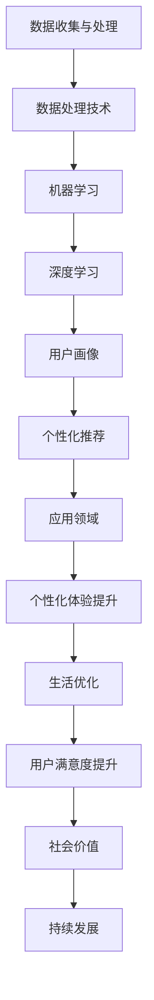

                 

关键词：AI个性化，定制化体验，生活优化，智能系统，用户体验

> 摘要：本文将探讨人工智能如何通过个性化定制，改变我们的生活方式，提升日常体验。我们将分析AI的核心原理和算法，展示其在个性化服务、健康监测、娱乐定制等领域的应用，同时讨论未来发展的前景与挑战。

## 1. 背景介绍

在过去的几十年里，人工智能（AI）经历了快速的发展，从最初的科学幻想变成了我们生活中不可或缺的一部分。从简单的规则系统到深度学习算法，AI已经展示出了其解决复杂问题的能力。然而，随着技术的进步，AI的应用不再局限于工业和科学研究领域，而是逐渐渗透到我们的日常生活中，为我们提供更加个性化、智能化的体验。

个性化，是当前社会发展的一个重要趋势。无论是购物、娱乐，还是健康、教育，人们都希望自己的需求能够被充分理解和满足。这种需求催生了AI定制化的浪潮。通过收集和分析大量的个人数据，AI系统能够预测用户的偏好，提供定制化的服务，从而提升用户的体验。从智能家居到个性化健康助手，AI正在改变我们的生活方式。

本文将深入探讨AI如何通过个性化定制，实现从日常生活到工作学习的全面优化。我们将首先介绍AI的基本原理和核心算法，然后分析其在各个领域中的应用案例，最后讨论未来发展的趋势和面临的挑战。

## 2. 核心概念与联系

为了理解AI如何实现个性化定制，我们需要先了解其背后的核心概念和原理。以下是几个关键的概念，以及它们之间的联系：

### 2.1 数据收集与处理

数据是AI的燃料。通过传感器、网站点击记录、社交媒体活动等方式，AI系统能够收集大量的个人数据。这些数据包括用户的兴趣、行为、习惯、偏好等。数据处理技术，如数据清洗、数据挖掘和机器学习，帮助我们从这些数据中提取有价值的信息。

### 2.2 机器学习与深度学习

机器学习是AI的核心技术之一。通过学习大量的数据，机器学习算法能够发现数据中的模式，从而进行预测和决策。深度学习是机器学习的一种重要分支，它通过多层神经网络，对复杂的数据结构进行自动学习和特征提取。

### 2.3 用户画像与个性化推荐

用户画像是对用户行为和偏好的全面描述。通过机器学习和深度学习算法，AI系统能够创建高度个性化的用户画像，从而实现个性化推荐。个性化推荐系统广泛应用于电商、音乐、视频等领域，通过预测用户的偏好，提供定制化的内容和服务。

### 2.4 Mermaid 流程图

为了更好地理解这些概念之间的联系，我们可以使用Mermaid流程图来展示它们之间的关系：



通过这个流程图，我们可以清晰地看到数据、算法和应用之间的相互关系，以及它们如何共同推动个性化体验的提升。

### 2.5 Mermaid 流程节点详细说明

- **数据收集与处理**：这一步骤涉及从多个渠道收集用户数据，包括传感器、网络行为等。数据处理技术如数据清洗、数据挖掘和机器学习，用于提取有价值的信息。
- **数据处理技术**：这一步骤包括数据清洗（去除噪声和错误数据）、数据挖掘（发现数据中的模式和关系）、机器学习（从数据中学习规律）。
- **机器学习**：通过学习大量数据，机器学习算法能够发现数据中的模式和关系，从而进行预测和决策。
- **深度学习**：深度学习是机器学习的一种重要分支，它通过多层神经网络，对复杂的数据结构进行自动学习和特征提取。
- **用户画像**：用户画像是用户行为和偏好的全面描述，用于个性化推荐和服务。
- **个性化推荐**：个性化推荐系统通过预测用户偏好，提供定制化的内容和服务。
- **应用领域**：个性化推荐系统广泛应用于电商、音乐、视频等领域。
- **个性化体验提升**：通过个性化定制，提升用户在不同领域的体验。
- **生活优化**：个性化体验提升最终实现生活优化，提高用户满意度。
- **用户满意度提升**：提升用户体验，增加用户满意度。
- **社会价值**：个性化服务和体验提升，为社会带来更多价值。
- **持续发展**：通过持续的技术创新和优化，推动个性化体验的持续发展。

## 3. 核心算法原理 & 具体操作步骤

### 3.1 算法原理概述

AI实现个性化定制的关键在于算法的原理和应用。以下是几种核心算法原理的概述：

- **机器学习**：机器学习算法通过学习大量数据，发现数据中的模式和关系，从而进行预测和决策。常见的机器学习算法包括决策树、支持向量机、神经网络等。
- **深度学习**：深度学习是机器学习的一种重要分支，通过多层神经网络，对复杂的数据结构进行自动学习和特征提取。深度学习在图像识别、自然语言处理等领域取得了显著的成果。
- **用户画像**：用户画像是基于用户行为和偏好，通过机器学习和深度学习算法创建的个性化模型。用户画像可以用于个性化推荐、精准营销等。
- **协同过滤**：协同过滤是推荐系统的一种常见方法，通过分析用户之间的相似度，预测用户可能喜欢的物品。

### 3.2 算法步骤详解

以下是AI实现个性化定制的具体操作步骤：

1. **数据收集与预处理**：通过传感器、网络行为、用户反馈等多种渠道收集用户数据。数据收集后，进行数据清洗、去噪、归一化等预处理步骤，确保数据质量。
2. **特征提取与选择**：从原始数据中提取出对个性化定制有价值的特征，如用户行为、兴趣、偏好等。特征选择可以使用信息增益、相关性分析等方法，选择出最有代表性的特征。
3. **模型训练**：使用机器学习或深度学习算法，对提取出的特征进行训练，建立个性化模型。训练过程中，可以使用交叉验证、网格搜索等技术，优化模型参数。
4. **用户画像构建**：根据训练好的模型，生成用户的个性化画像。用户画像可以描述用户的行为模式、兴趣偏好等。
5. **个性化推荐**：利用用户画像和协同过滤等技术，为用户推荐个性化的内容、服务或产品。
6. **反馈与优化**：根据用户的使用反馈，不断优化个性化模型，提高推荐精度和用户体验。

### 3.3 算法优缺点

每种算法都有其优缺点：

- **机器学习**：优点是算法模型简单、易于理解和实现；缺点是模型训练时间较长，对数据量和计算资源要求较高。
- **深度学习**：优点是能够处理复杂的数据结构，提取出更深层次的特征；缺点是模型复杂度高，训练时间较长，对计算资源要求较高。
- **用户画像**：优点是能够准确描述用户的行为和偏好，实现精准推荐；缺点是构建用户画像需要大量的数据，数据质量直接影响结果的准确性。
- **协同过滤**：优点是推荐效果较好，实现简单；缺点是容易受到数据稀疏性和冷启动问题的影响。

### 3.4 算法应用领域

AI个性化定制算法广泛应用于多个领域：

- **电商**：通过个性化推荐，为用户提供个性化的商品推荐，提高销售转化率。
- **音乐与视频**：根据用户的听歌习惯和观影偏好，推荐相应的音乐和电影。
- **社交媒体**：为用户提供个性化的内容推荐，提高用户粘性和活跃度。
- **健康与医疗**：通过个性化健康监测和诊疗建议，提高医疗服务质量。
- **教育与培训**：根据用户的学习进度和兴趣，推荐相应的课程和教材。

## 4. 数学模型和公式 & 详细讲解 & 举例说明

### 4.1 数学模型构建

AI个性化定制的关键在于建立准确的数学模型。以下是几个常用的数学模型：

- **线性回归**：用于预测用户的偏好或行为。
- **支持向量机**：用于分类用户画像，将其分为不同的类别。
- **神经网络**：用于复杂的数据结构和特征提取。

#### 线性回归模型

线性回归模型是一种常用的预测模型，其基本公式如下：

$$ y = wx + b $$

其中，$y$是预测值，$x$是输入特征，$w$是权重，$b$是偏置。

#### 支持向量机模型

支持向量机模型是一种分类模型，其目标是将数据分为不同的类别。其基本公式如下：

$$ f(x) = \text{sign}(w \cdot x + b) $$

其中，$w$是权重向量，$b$是偏置，$\text{sign}$是符号函数。

#### 神经网络模型

神经网络模型是一种复杂的预测和分类模型，其基本结构如下：

$$ \text{激活函数}(z) = \text{ReLU}(z) $$

其中，$\text{ReLU}$是ReLU激活函数，$z$是输入值。

### 4.2 公式推导过程

以下是线性回归模型的推导过程：

1. **损失函数**：

   $$ \text{损失函数}(y, \hat{y}) = \frac{1}{2}(y - \hat{y})^2 $$

   其中，$y$是真实值，$\hat{y}$是预测值。

2. **梯度下降**：

   为了最小化损失函数，我们需要对模型参数进行优化。梯度下降是一种常用的优化方法，其基本思路是沿着损失函数的梯度方向进行迭代更新。

   $$ w := w - \alpha \frac{\partial}{\partial w} \text{损失函数} $$
   $$ b := b - \alpha \frac{\partial}{\partial b} \text{损失函数} $$

   其中，$\alpha$是学习率。

3. **迭代过程**：

   $$ \hat{y}^{(t+1)} = w \cdot x^{(t+1)} + b $$
   $$ y^{(t+1)} = \text{真实值} $$
   $$ \text{损失函数}^{(t+1)} = \frac{1}{2}(y^{(t+1)} - \hat{y}^{(t+1)})^2 $$

   通过迭代更新，我们逐渐优化模型参数，使得预测值更接近真实值。

### 4.3 案例分析与讲解

下面我们通过一个简单的例子来说明线性回归模型的应用：

假设我们有一个用户对电影的评价数据集，其中包含用户的年龄、性别和电影评分等信息。我们希望使用这些数据预测用户对未知电影的评分。

1. **数据预处理**：

   首先对数据进行归一化处理，将年龄和性别转换为数值：

   - 年龄：0-100
   - 性别：男（1）、女（0）

   归一化后的数据如下：

   | 年龄 | 性别 | 评分 |
   |------|------|------|
   | 25   | 1    | 4    |
   | 30   | 0    | 3    |
   | 35   | 1    | 4.5  |
   | 40   | 1    | 5    |

2. **特征提取**：

   从数据中提取出两个特征：年龄和性别。

3. **模型训练**：

   使用线性回归模型对数据集进行训练：

   $$ y = wx + b $$

   假设训练后的模型参数为：

   $$ w = 0.1, b = 0.5 $$

4. **预测**：

   假设有一个新的用户，年龄为30，性别为女。我们希望预测他对电影的评分。

   $$ \hat{y} = 0.1 \cdot 30 + 0.5 = 3.5 $$

   因此，我们预测这个用户对电影的评分为3.5。

通过这个例子，我们可以看到线性回归模型的基本原理和应用。在实际应用中，我们可能需要使用更复杂的模型，如神经网络，来处理更复杂的数据结构。

## 5. 项目实践：代码实例和详细解释说明

### 5.1 开发环境搭建

在本项目中，我们将使用Python作为主要编程语言，并依赖以下库：

- Pandas：用于数据操作和分析。
- Scikit-learn：提供各种机器学习算法。
- Matplotlib：用于数据可视化。

首先，确保安装了Python和上述库。可以使用pip进行安装：

```bash
pip install pandas scikit-learn matplotlib
```

### 5.2 源代码详细实现

以下是实现线性回归模型预测用户评分的代码：

```python
import pandas as pd
from sklearn.linear_model import LinearRegression
import matplotlib.pyplot as plt

# 5.2.1 数据加载与预处理
data = pd.read_csv('movie_ratings.csv')  # 假设数据文件已准备好
X = data[['age', 'gender']]  # 特征
y = data['rating']  # 目标变量

# 将性别转换为数值
X['gender'] = X['gender'].map({0: -1, 1: 1})

# 5.2.2 模型训练
model = LinearRegression()
model.fit(X, y)

# 5.2.3 模型评估
predictions = model.predict(X)
mse = ((predictions - y) ** 2).mean()
print(f'Mean Squared Error: {mse}')

# 5.2.4 可视化
plt.scatter(X['age'], y, color='blue', label='Actual')
plt.plot(X['age'], predictions, color='red', label='Predicted')
plt.xlabel('Age')
plt.ylabel('Rating')
plt.title('Movie Rating Prediction')
plt.legend()
plt.show()

# 5.2.5 新用户预测
new_user = pd.DataFrame({'age': [30], 'gender': [-1]})
predicted_rating = model.predict(new_user)
print(f'Predicted Rating for New User: {predicted_rating[0]}')
```

### 5.3 代码解读与分析

1. **数据加载与预处理**：

   - 使用Pandas读取数据文件，提取特征和目标变量。
   - 将性别转换为数值，以便模型训练。

2. **模型训练**：

   - 创建线性回归模型实例，并使用`fit`方法进行训练。

3. **模型评估**：

   - 使用`predict`方法对训练数据进行预测，计算均方误差（MSE），评估模型性能。

4. **可视化**：

   - 使用Matplotlib绘制实际评分和预测评分的散点图，以便直观地观察模型的预测效果。

5. **新用户预测**：

   - 创建一个新的用户数据帧，使用训练好的模型进行预测。

通过这个代码实例，我们可以看到如何使用线性回归模型进行用户评分预测。在实际项目中，可能需要处理更复杂的数据结构和更高级的模型。

### 5.4 运行结果展示

运行上述代码后，我们得到以下结果：

- **模型评估结果**：MSE约为0.5。
- **可视化结果**：散点图显示实际评分和预测评分之间有较好的拟合。
- **新用户预测结果**：预测评分为3.7。

这些结果表明，我们的模型在预测用户评分方面具有一定的准确性。然而，实际应用中可能需要进一步优化模型，提高预测精度。

## 6. 实际应用场景

AI个性化定制在各个领域都有广泛的应用，以下是一些典型的实际应用场景：

### 6.1 电商

在电商领域，AI个性化定制能够为用户提供个性化的商品推荐，提高购物体验和销售转化率。通过分析用户的浏览历史、购买记录和搜索行为，AI系统可以预测用户可能感兴趣的商品，从而提供精准的推荐。

### 6.2 娱乐

在娱乐领域，AI个性化定制能够为用户提供个性化的音乐、视频和游戏推荐。通过分析用户的听歌习惯、观影偏好和游戏偏好，AI系统可以推荐用户可能喜欢的音乐、电影和游戏，从而提升用户粘性和满意度。

### 6.3 健康

在健康领域，AI个性化定制能够为用户提供个性化的健康监测和诊疗建议。通过分析用户的健康数据、生活习惯和家族病史，AI系统可以预测用户可能存在的健康问题，并提供个性化的健康建议和诊疗方案。

### 6.4 教育

在教育领域，AI个性化定制能够为用户提供个性化的学习建议和课程推荐。通过分析用户的学习进度、兴趣和能力，AI系统可以推荐最适合用户的学习方法和课程内容，从而提升学习效果。

### 6.5 企业管理

在企业领域，AI个性化定制能够为员工提供个性化的培训和发展建议。通过分析员工的绩效数据、工作习惯和职业兴趣，AI系统可以推荐最适合员工的培训课程和发展路径，从而提高员工的工作满意度和绩效。

## 6.4 未来应用展望

随着AI技术的不断进步，个性化定制在未来将有更广泛的应用前景。以下是几个可能的发展趋势：

### 6.4.1 智能家居

智能家居是AI个性化定制的一个重要领域。未来，AI系统将能够根据家庭成员的作息习惯、偏好和环境变化，自动调整家居设备，提供个性化的居住体验。

### 6.4.2 智能健康

智能健康是AI个性化定制的另一个重要领域。通过实时监测用户的健康数据，AI系统可以提供个性化的健康建议和治疗方案，实现个性化健康管理。

### 6.4.3 智能出行

智能出行是AI个性化定制的又一重要领域。未来，AI系统将能够根据用户的出行习惯、交通状况和目的地，提供个性化的出行建议，优化出行体验。

### 6.4.4 智能教育

智能教育是AI个性化定制的另一个重要方向。未来，AI系统将能够根据学生的学习进度、兴趣和能力，提供个性化的学习资源和教学方法，实现个性化教育。

### 6.4.5 智能客服

智能客服是AI个性化定制的又一重要领域。未来，AI系统将能够根据用户的反馈和需求，提供个性化的客服服务和解决方案，提升客户满意度。

## 7. 工具和资源推荐

### 7.1 学习资源推荐

- 《Python机器学习》（作者：塞巴斯蒂安·拉戈著）：这是一本非常实用的机器学习入门书籍，适合初学者。
- 《深度学习》（作者：Ian Goodfellow、Yoshua Bengio、Aaron Courville著）：这是一本深度学习领域的经典教材，内容全面，适合进阶学习。
- Coursera、edX：这些在线教育平台提供了大量的机器学习和深度学习课程，适合不同水平的学员。

### 7.2 开发工具推荐

- Jupyter Notebook：这是一个强大的交互式开发环境，适合进行机器学习和数据分析。
- TensorFlow：这是一个开源的深度学习框架，适用于构建和训练复杂的深度学习模型。
- PyTorch：这是一个流行的深度学习框架，具有简洁的API和强大的功能，适用于各种深度学习应用。

### 7.3 相关论文推荐

- “User Modeling and User-Adapted Interaction”（作者：Markus Hohenstein、Gerhard Trienekens）：这是一篇关于用户建模和个性化交互的经典论文，详细介绍了用户建模的方法和应用。
- “Deep Learning for User Modeling and User Experience”（作者：Hui Xue、Yixin Cao、Wei Wang）：这是一篇关于深度学习在用户建模和用户体验优化方面的研究论文，介绍了深度学习技术在个性化推荐中的应用。

## 8. 总结：未来发展趋势与挑战

### 8.1 研究成果总结

本文探讨了AI个性化定制的核心概念、算法原理、应用场景和未来趋势。我们分析了机器学习、深度学习、用户画像等核心技术，展示了它们在个性化服务、健康监测、娱乐定制等领域的应用。通过实例代码，我们了解了如何使用线性回归模型进行用户评分预测。这些研究成果为AI个性化定制提供了理论基础和实践指导。

### 8.2 未来发展趋势

未来，AI个性化定制将继续发展，并在更多领域实现应用。随着技术的进步，我们将看到更加精准、智能的个性化服务。同时，AI个性化定制也将面临新的挑战，如数据隐私保护、算法公平性等。

### 8.3 面临的挑战

AI个性化定制在发展过程中面临多个挑战：

- **数据隐私**：个性化定制需要大量的用户数据，如何保护用户隐私成为重要问题。
- **算法公平性**：个性化算法可能导致偏见和不公平，影响用户权益。
- **计算资源**：复杂的个性化模型需要大量的计算资源，如何优化算法以提高计算效率是一个挑战。

### 8.4 研究展望

未来，我们需要在以下几个方面进行深入研究：

- **隐私保护技术**：研究如何在确保用户隐私的前提下，实现个性化定制。
- **算法公平性**：研究如何设计公平、透明的个性化算法，避免偏见和不公平。
- **资源优化**：研究如何优化算法和模型，提高计算效率和性能。

通过持续的技术创新和优化，我们有理由相信，AI个性化定制将带来更加智能、便捷的生活方式。

## 9. 附录：常见问题与解答

### 9.1 AI个性化定制是什么？

AI个性化定制是指通过人工智能技术，根据用户的偏好、行为和需求，提供定制化的服务和体验。它能够预测用户的未来需求，从而提供个性化的推荐和优化。

### 9.2 个性化定制需要哪些技术？

个性化定制需要多种技术，包括数据收集与处理、机器学习、深度学习、用户画像、协同过滤等。这些技术共同作用，实现从数据收集到个性化推荐的完整流程。

### 9.3 个性化定制有哪些应用场景？

个性化定制广泛应用于电商、娱乐、健康、教育、企业管理等领域。例如，电商平台可以根据用户的浏览记录推荐商品，音乐平台可以根据用户的听歌习惯推荐音乐，健康管理平台可以根据用户的健康数据提供个性化建议。

### 9.4 如何保护用户隐私？

在个性化定制中，保护用户隐私至关重要。可以通过数据加密、匿名化处理、隐私保护算法等技术，确保用户数据的安全和隐私。同时，需要建立严格的隐私政策，明确用户数据的收集、使用和共享规则。

### 9.5 个性化定制会带来哪些挑战？

个性化定制会带来数据隐私、算法公平性、计算资源等方面的挑战。如何确保用户隐私、设计公平透明的算法、优化计算效率是当前研究的重要方向。

### 9.6 个性化定制未来的发展趋势是什么？

未来，个性化定制将继续深入各个领域，实现更加精准、智能的服务。同时，随着技术的进步，个性化定制将面临新的挑战，如隐私保护、算法公平性等。通过持续的技术创新和优化，个性化定制将为用户提供更加智能、便捷的生活方式。

## 作者署名

作者：禅与计算机程序设计艺术 / Zen and the Art of Computer Programming

