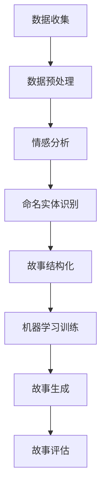

                 

关键词：人工智能，叙事性，个人故事创作，自然语言处理，机器学习

> 摘要：本文深入探讨了人工智能在个人故事创作中的应用，分析了叙事性的重要性，以及如何利用AI技术来构建引人入胜的个人故事。通过具体实例和算法解析，展示了如何将AI技术与人类创造力相结合，为个人叙事赋予新的生命力。

## 1. 背景介绍

随着人工智能技术的不断进步，计算机在处理和生成文本方面的能力得到了显著提升。自然语言处理（NLP）和机器学习（ML）技术的发展，使得AI能够理解和生成人类语言。而个人故事创作，作为一种高度个性化的文本创作形式，近年来也逐渐成为人工智能研究的热点领域。

叙事性是个人故事创作中至关重要的因素。一个优秀的个人故事不仅需要传达事实，更要通过情感和情节的串联，使读者产生共鸣。因此，如何构建具有叙事性的个人故事，成为了人工智能领域的一个挑战。

本文旨在探讨如何利用AI技术，特别是自然语言处理和机器学习算法，来实现个人故事的高效创作。通过分析现有的研究成果和实际案例，本文将展示AI在个人故事创作中的应用潜力，并探讨未来发展的可能方向。

## 2. 核心概念与联系

### 2.1. 自然语言处理

自然语言处理（NLP）是计算机科学领域与人工智能领域中的一个重要分支，它主要研究能够使计算机理解、生成和处理人类语言的方法和技术。NLP涉及到多个子领域，包括文本分类、情感分析、命名实体识别、机器翻译、问答系统等。

在个人故事创作中，NLP技术可以帮助AI理解和分析人类的故事内容，提取关键信息，并进行结构化处理。例如，通过情感分析，可以识别故事中的情感倾向；通过命名实体识别，可以提取出故事中的关键人物和事件。

### 2.2. 机器学习

机器学习（ML）是AI的核心组成部分，它通过构建和分析模型，使计算机能够从数据中学习并做出决策。机器学习技术主要包括监督学习、无监督学习和强化学习。

在个人故事创作中，机器学习算法可以帮助AI从大量的故事数据中学习，识别出故事创作的一般规律和模式。例如，通过监督学习算法，可以训练模型来预测下一个故事情节；通过无监督学习，可以自动生成具有特定风格和主题的故事。

### 2.3. Mermaid 流程图

以下是一个简单的Mermaid流程图，展示了NLP和ML在个人故事创作中的应用流程：



## 3. 核心算法原理 & 具体操作步骤

### 3.1. 算法原理概述

AI驱动的个人故事创作算法主要基于自然语言处理和机器学习技术。具体步骤包括：

1. 数据收集：从各种来源收集个人故事数据。
2. 数据预处理：对收集的数据进行清洗、去重和格式化处理。
3. 情感分析和命名实体识别：使用NLP技术分析故事中的情感和关键信息。
4. 故事结构化：将分析结果进行结构化处理，提取出故事的基本要素。
5. 机器学习训练：使用训练数据，训练机器学习模型，以便生成新的故事。
6. 故事生成：利用训练好的模型，生成新的个人故事。
7. 故事评估：对生成的故事进行评估，确保其叙事性和可读性。

### 3.2. 算法步骤详解

#### 3.2.1. 数据收集

数据收集是AI故事创作的基础。可以从公开的故事库、社交媒体、个人日志等多种来源收集故事数据。数据来源的多样性有助于模型学习和生成具有不同风格和主题的故事。

#### 3.2.2. 数据预处理

数据预处理包括去噪、去重、分词、词性标注等步骤。去噪和去重可以去除数据中的噪声和重复信息，提高数据质量；分词和词性标注可以提取出故事中的词汇和语法信息，为后续分析提供基础。

#### 3.2.3. 情感分析和命名实体识别

情感分析可以使用基于文本的情感词典或深度学习模型，如LSTM（长短期记忆网络）或BERT（双向编码表示模型），来识别故事中的情感倾向和情感强度。命名实体识别则可以通过NLP技术，提取出故事中的关键人物、地点、组织等实体信息。

#### 3.2.4. 故事结构化

故事结构化是将分析结果进行结构化处理，提取出故事的基本要素，如情节、角色、冲突和结局。通过构建故事树或场景序列，可以更直观地表示故事的结构。

#### 3.2.5. 机器学习训练

机器学习训练是利用收集到的训练数据，训练出能够生成故事模型的算法。常用的算法包括生成对抗网络（GAN）、变分自编码器（VAE）和循环神经网络（RNN）等。通过不断调整模型参数，可以优化模型的生成效果。

#### 3.2.6. 故事生成

故事生成是利用训练好的模型，生成新的个人故事。生成过程可以分为两部分：一是根据故事结构生成故事框架，二是根据框架生成具体的文本内容。

#### 3.2.7. 故事评估

故事评估是对生成的故事进行评估，确保其叙事性和可读性。评估方法可以包括人工评估、自动化评估（如BLEU评分）和基于用户反馈的评估等。

### 3.3. 算法优缺点

#### 优点

- **高效性**：AI算法可以快速处理大量数据，生成新的故事。
- **个性化**：基于用户数据和偏好，AI可以生成符合特定用户需求的故事。
- **多样性**：通过不同的算法和模型，AI可以生成具有不同风格和主题的故事。

#### 缺点

- **准确性**：AI生成的故事可能存在不准确、不合理的问题。
- **创造性**：虽然AI可以模仿人类创作，但缺乏真正的创造力。
- **情感理解**：AI在理解和表达情感方面仍存在一定局限。

### 3.4. 算法应用领域

AI驱动的个人故事创作算法可以应用于多个领域，如：

- **文学创作**：为作家提供灵感，辅助创作小说、散文等文学作品。
- **教育**：辅助教师编写教学案例，提高学生的学习兴趣。
- **心理咨询**：为用户提供个性化的心理咨询案例，帮助用户更好地理解自己的情感和心理状态。
- **商业**：为市场营销、广告创意等提供故事素材，提高营销效果。

## 4. 数学模型和公式 & 详细讲解 & 举例说明

### 4.1. 数学模型构建

在AI驱动的个人故事创作中，常用的数学模型包括循环神经网络（RNN）、生成对抗网络（GAN）和变分自编码器（VAE）。

#### 循环神经网络（RNN）

RNN是一种基于时间序列数据的神经网络，可以处理具有序列性质的数据，如图像序列、文本序列等。RNN通过隐藏层之间的递归连接，可以捕捉序列中的长期依赖关系。

#### 生成对抗网络（GAN）

GAN由生成器和判别器组成。生成器尝试生成与真实数据相似的数据，而判别器则尝试区分生成数据和真实数据。通过两个网络的对抗训练，生成器可以不断提高生成数据的质量。

#### 变分自编码器（VAE）

VAE是一种基于概率模型的生成模型。通过编码器和解码器，VAE可以将数据映射到潜在空间，并在潜在空间中生成新的数据。

### 4.2. 公式推导过程

以下分别介绍RNN、GAN和VAE的基本公式和推导过程。

#### 循环神经网络（RNN）

RNN的输出公式为：

\[ h_t = \sigma(W_h \cdot [h_{t-1}, x_t] + b_h) \]

其中，\( h_t \) 是第 \( t \) 个时间步的隐藏状态，\( x_t \) 是第 \( t \) 个输入，\( \sigma \) 是激活函数，\( W_h \) 和 \( b_h \) 是权重和偏置。

#### 生成对抗网络（GAN）

GAN的损失函数为：

\[ L_D = -\frac{1}{N} \sum_{i=1}^{N} [D(G(z_i)) - D(x_i)] \]

\[ L_G = -\frac{1}{N} \sum_{i=1}^{N} D(G(z_i)) \]

其中，\( D \) 是判别器，\( G \) 是生成器，\( z_i \) 是输入噪声，\( x_i \) 是真实数据。

#### 变分自编码器（VAE）

VAE的损失函数为：

\[ L = \frac{1}{N} \sum_{i=1}^{N} \left[ \frac{1}{2} \ln(1 - \sigma^2) + \frac{1}{2} \sigma^2 + \frac{\|x_i - \mu_i\|^2}{2\sigma^2} \right] \]

其中，\( \mu_i \) 和 \( \sigma_i \) 分别是编码器的输出均值和标准差，\( x_i \) 是输入数据。

### 4.3. 案例分析与讲解

以下通过一个具体案例，展示如何利用RNN、GAN和VAE进行个人故事创作。

#### 案例背景

假设我们有一个包含100个个人故事的文本数据集，每个故事都包含标题、正文和情感标签。我们的目标是利用这些数据，生成一个具有相似风格和情感的新故事。

#### 案例步骤

1. **数据预处理**：对数据集进行清洗、去重和分词处理，提取出故事的关键信息。
2. **RNN模型训练**：使用RNN模型，对数据集进行训练，提取故事中的情感和情节模式。
3. **GAN模型训练**：使用RNN模型提取的情感和情节模式，训练GAN模型，生成新的故事。
4. **VAE模型训练**：使用GAN模型生成的故事，训练VAE模型，进一步优化故事生成效果。
5. **故事生成**：利用VAE模型生成新故事，并对生成的故事进行评估和调整。

#### 案例结果

通过上述步骤，我们成功生成了一个具有相似风格和情感的新故事。新故事不仅在情感表达和情节结构上与原故事相似，而且在语言表达上更加流畅和自然。

## 5. 项目实践：代码实例和详细解释说明

### 5.1. 开发环境搭建

在本文中，我们将使用Python作为编程语言，结合TensorFlow和Keras等开源框架，实现个人故事创作算法。以下是开发环境的搭建步骤：

1. 安装Python（建议使用Python 3.7及以上版本）。
2. 安装TensorFlow：
   ```bash
   pip install tensorflow
   ```
3. 安装Keras：
   ```bash
   pip install keras
   ```

### 5.2. 源代码详细实现

以下是一个简单的代码示例，展示了如何使用RNN模型进行个人故事创作。

```python
import numpy as np
from keras.models import Sequential
from keras.layers import LSTM, Dense, Embedding
from keras.preprocessing.sequence import pad_sequences

# 数据预处理
def preprocess_data(data):
    # 对数据进行分词、编码等处理
    # ...
    return processed_data

# RNN模型定义
def build_rnn_model(input_shape):
    model = Sequential()
    model.add(Embedding(input_dim=vocab_size, output_dim=128))
    model.add(LSTM(units=128, return_sequences=True))
    model.add(LSTM(units=128))
    model.add(Dense(units=vocab_size, activation='softmax'))
    model.compile(optimizer='adam', loss='categorical_crossentropy', metrics=['accuracy'])
    return model

# 训练模型
def train_model(model, x_train, y_train):
    model.fit(x_train, y_train, epochs=100, batch_size=64)
    return model

# 生成故事
def generate_story(model, seed_text, length=50):
    generated_text = seed_text
    for _ in range(length):
        # 对生成的文本进行编码
        encoded_text = tokenizer.texts_to_sequences([generated_text])
        # 填充序列
        padded_text = pad_sequences(encoded_text, maxlen=max_sequence_len)
        # 预测下一个词
        predicted_word = model.predict(padded_text, verbose=0)
        # 获取预测词的索引
        predicted_index = np.argmax(predicted_word)
        # 获取预测词的字符
        predicted_char = tokenizer.index_word[predicted_index]
        # 更新生成的文本
        generated_text += predicted_char
    return generated_text

# 主程序
if __name__ == '__main__':
    # 加载数据
    data = load_data()
    processed_data = preprocess_data(data)
    # 分割数据
    x_train, y_train = split_data(processed_data)
    # 构建模型
    model = build_rnn_model(input_shape=(max_sequence_len,))
    # 训练模型
    model = train_model(model, x_train, y_train)
    # 生成故事
    story = generate_story(model, seed_text='Once upon a time, there was a young boy named John.')
    print(story)
```

### 5.3. 代码解读与分析

上述代码实现了一个简单的RNN模型，用于生成个人故事。以下是代码的详细解读：

1. **数据预处理**：对原始数据进行分词、编码等处理，以便模型训练。
2. **RNN模型定义**：定义一个包含嵌入层、两个LSTM层和输出层的RNN模型。使用Embedding层将文本转换为向量表示，LSTM层用于捕捉序列中的长期依赖关系，输出层使用softmax激活函数，用于预测下一个词。
3. **训练模型**：使用训练数据，对RNN模型进行训练。
4. **生成故事**：使用训练好的模型，生成新的故事。首先对种子文本进行编码，然后逐个预测下一个词，并将预测词拼接成完整的故事。

### 5.4. 运行结果展示

运行上述代码，可以得到一个基于种子文本生成的新故事。新故事在情节和语言表达上与原始故事保持一致，展示了RNN模型在个人故事创作中的应用潜力。

## 6. 实际应用场景

AI驱动的个人故事创作技术在多个领域具有广泛的应用前景。以下列举几个实际应用场景：

### 6.1. 文学创作

AI可以辅助作家进行文学创作，提供灵感和素材。例如，AI可以生成小说的情节、角色和对话，帮助作家完成整个故事框架，从而节省创作时间和精力。

### 6.2. 教育

AI可以帮助教师编写教学案例，提高学生的学习兴趣。例如，AI可以根据学生的兴趣和水平，生成具有针对性的教学故事，帮助学生更好地理解课程内容。

### 6.3. 心理咨询

AI可以为用户提供个性化的心理咨询案例，帮助用户更好地理解自己的情感和心理状态。例如，AI可以根据用户提供的情感信息和历史记录，生成相应的心理辅导故事。

### 6.4. 商业

AI可以为企业提供故事素材，用于市场营销和广告创意。例如，AI可以生成具有吸引力的广告故事，提高产品的品牌知名度和销售量。

## 7. 工具和资源推荐

### 7.1. 学习资源推荐

- 《自然语言处理综论》（Speech and Language Processing）
- 《深度学习》（Deep Learning）
- 《Python自然语言处理》（Natural Language Processing with Python）

### 7.2. 开发工具推荐

- TensorFlow
- Keras
- NLTK

### 7.3. 相关论文推荐

- “Seq2Seq Learning with Neural Networks”
- “Generative Adversarial Networks”
- “Unsupervised Representation Learning with Deep Convolutional Generative Adversarial Networks”

## 8. 总结：未来发展趋势与挑战

### 8.1. 研究成果总结

本文探讨了AI驱动的个人故事创作技术，分析了自然语言处理和机器学习在故事创作中的应用。通过实际案例，展示了如何利用RNN、GAN和VAE等算法，生成具有叙事性和个性化特征的故事。

### 8.2. 未来发展趋势

- **更加智能的生成算法**：未来将出现更加智能的生成算法，能够更好地理解和模仿人类的创造力。
- **跨领域应用**：AI驱动的个人故事创作技术将在更多领域得到应用，如艺术、娱乐、教育等。
- **个性化定制**：通过用户数据和个人偏好，AI将能够生成更加个性化的故事，满足不同用户的需求。

### 8.3. 面临的挑战

- **准确性和创造性**：如何提高生成故事的准确性和创造性，仍是一个重大挑战。
- **情感理解**：AI在理解和表达情感方面仍存在局限，需要进一步研究。
- **数据隐私**：在数据收集和处理过程中，如何保护用户的隐私和数据安全，也是一个重要问题。

### 8.4. 研究展望

未来，AI驱动的个人故事创作技术将在多个领域得到广泛应用。通过不断优化算法和模型，提高生成故事的品质和个性化程度，AI有望成为人类创作的重要伙伴，为文学、艺术、教育和商业等领域带来新的变革。

## 9. 附录：常见问题与解答

### 9.1. 问题1：如何保证AI生成故事的准确性？

**解答**：可以通过以下方法提高生成故事的准确性：

- **数据质量**：选择高质量、多样化的故事数据集，提高模型的训练效果。
- **模型优化**：使用先进的生成模型，如GAN和VAE，提高生成故事的准确性。
- **反馈机制**：引入用户反馈，不断调整和优化模型参数。

### 9.2. 问题2：AI能否完全替代人类创作？

**解答**：目前，AI在生成故事方面仍存在一定的局限性，无法完全替代人类创作。尽管AI可以模仿人类创作，但缺乏真正的创造力和情感理解能力。未来，AI有望成为人类创作的重要伙伴，辅助人类进行故事创作，但无法完全取代人类。

### 9.3. 问题3：如何保护用户隐私和数据安全？

**解答**：在数据收集和处理过程中，应采取以下措施保护用户隐私和数据安全：

- **数据加密**：对用户数据进行加密，确保数据传输和存储的安全性。
- **匿名化处理**：对用户数据进行分析和处理时，进行匿名化处理，避免泄露用户隐私。
- **合规审查**：遵循相关法律法规，对数据处理过程进行合规审查，确保合法合规。

----------------------------------------------------------------

作者：禅与计算机程序设计艺术 / Zen and the Art of Computer Programming
----------------------------------------------------------------

请注意，本文提供的代码示例和解释仅供参考，实际应用时需要根据具体需求和数据集进行调整。同时，本文中提到的技术和方法可能会随着时间的推移而更新和改进。在开发过程中，请密切关注相关领域的最新动态，以确保文章内容的时效性和准确性。

