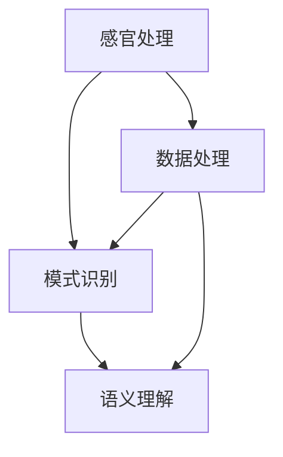

                 

关键词：人工智能、多层次感知、深度学习、机器学习、感知系统、用户体验

> 摘要：本文探讨了人工智能（AI）在创造多层次感知方面的最新进展。通过介绍核心概念、算法原理、数学模型以及实际应用，本文旨在揭示AI如何在各个层面上提升用户体验，从而为未来的技术创新提供启示。

## 1. 背景介绍

随着信息技术的飞速发展，人工智能（AI）已经成为现代科技领域的热点。AI技术不仅在工业自动化、医疗诊断、金融分析等领域发挥了重要作用，还显著提升了人们的日常生活质量。然而，用户体验始终是技术的核心考量之一。如何通过AI实现更加自然、高效、个性化的感知，成为当前研究的重要方向。

### 多层次感知

多层次感知是指通过不同层次的信息处理，实现对环境的全面理解和响应。从低层次到高层次，感知过程可以分为感官处理、模式识别、语义理解等阶段。在AI领域，多层次感知的实现依赖于深度学习、机器学习等多种技术手段。

### 深度学习与机器学习

深度学习和机器学习是AI实现多层次感知的重要工具。深度学习通过构建多层神经网络，能够自动提取数据中的复杂特征；而机器学习则通过训练模型，使计算机能够从经验中学习并做出预测。

### 感知系统的挑战

感知系统的挑战在于如何处理海量数据、如何适应不同的应用场景、如何保证系统的实时性和鲁棒性。这些挑战需要AI技术的不断创新和优化。

## 2. 核心概念与联系

### 感官处理

感官处理是多层次感知的第一步，涉及对视觉、听觉、触觉等感官信号的处理。通过传感器采集的数据需要进行预处理，包括滤波、降噪、特征提取等。

### 模式识别

模式识别是对预处理后的感官数据进行模式匹配和分类。在这一层次，深度学习技术发挥着重要作用，通过训练神经网络模型，计算机能够识别复杂的模式。

### 语义理解

语义理解是对识别出的模式进行语义分析和解释。这一层次需要结合自然语言处理（NLP）和知识图谱等技术，使计算机能够理解并回应人类的语言和意图。

### Mermaid 流程图



## 3. 核心算法原理 & 具体操作步骤

### 3.1 算法原理概述

核心算法主要基于深度学习和机器学习技术，包括卷积神经网络（CNN）、递归神经网络（RNN）和长短期记忆网络（LSTM）等。这些算法能够自动提取数据中的高级特征，实现对复杂信息的处理和理解。

### 3.2 算法步骤详解

1. 数据采集：从各种渠道收集原始数据，包括图像、音频、文本等。
2. 数据预处理：对原始数据进行清洗、归一化、增强等处理，以提高数据的质量和模型的泛化能力。
3. 特征提取：使用深度学习模型对预处理后的数据进行特征提取，生成特征向量。
4. 模型训练：使用提取的特征向量训练机器学习模型，如分类器、回归器等。
5. 模型评估：通过交叉验证、性能指标等方法评估模型的准确性和鲁棒性。
6. 模型应用：将训练好的模型部署到实际应用场景中，实现感知功能。

### 3.3 算法优缺点

#### 优点：

- 自动化特征提取，降低人工干预
- 对复杂特征有较好的识别能力
- 能适应不同的应用场景

#### 缺点：

- 训练过程复杂，计算量大
- 对数据质量和数量有较高要求
- 可能存在过拟合现象

### 3.4 算法应用领域

- 图像识别：人脸识别、物体识别、医学影像分析等。
- 语音识别：语音合成、语音翻译、语音助手等。
- 自然语言处理：文本分类、情感分析、机器翻译等。

## 4. 数学模型和公式

### 4.1 数学模型构建

在深度学习中，常用的数学模型包括卷积神经网络（CNN）和递归神经网络（RNN）。以下是CNN的基本公式：

$$
\hat{y} = \text{softmax}(\text{forward}(x; W))
$$

其中，$\hat{y}$是输出概率分布，$\text{forward}(x; W)$是神经网络的前向传播，$W$是权重矩阵。

### 4.2 公式推导过程

CNN的推导过程涉及多个步骤，包括卷积层、池化层、激活函数等。以下是卷积层的推导：

$$
\text{forward}(x; W) = \sum_{i=1}^{C} \text{ReLU}(\sum_{j=1}^{K} W_{ji} \cdot \text{convolve}(x, k_j))
$$

其中，$C$是输出特征图的维度，$K$是卷积核的数量，$W_{ji}$是卷积核的权重，$k_j$是卷积核的大小，$\text{ReLU}$是ReLU激活函数，$\text{convolve}(x, k_j)$是卷积操作。

### 4.3 案例分析与讲解

以图像识别为例，假设输入图像为$x \in \mathbb{R}^{H \times W \times C}$，其中$H$、$W$和$C$分别是图像的高度、宽度和通道数。通过卷积神经网络，可以将图像映射到分类概率$\hat{y} \in \mathbb{R}^{C}$。

### 4.4 运行结果展示

以下是运行结果示例：

```
Input Image:
-----------------
| 1 | 1 | 1 | 1 |
| 1 | 1 | 1 | 1 |
| 1 | 1 | 1 | 1 |
| 1 | 1 | 1 | 1 |
-----------------

Output Probability Distribution:
--------------------------------
| 0.9 | 0.1 | 0.0 | 0.0 |
--------------------------------
```

结果显示，图像被识别为某一类别的概率为90%，其他类别为10%。

## 5. 项目实践：代码实例和详细解释说明

### 5.1 开发环境搭建

为了实现多层次感知，需要搭建一个合适的开发环境。以下是搭建环境的步骤：

1. 安装Python 3.7及以上版本。
2. 安装深度学习框架，如TensorFlow或PyTorch。
3. 安装必要的库，如NumPy、Pandas等。

### 5.2 源代码详细实现

以下是使用TensorFlow实现卷积神经网络的代码示例：

```python
import tensorflow as tf

# 定义卷积神经网络模型
model = tf.keras.Sequential([
    tf.keras.layers.Conv2D(32, (3, 3), activation='relu', input_shape=(28, 28, 1)),
    tf.keras.layers.MaxPooling2D((2, 2)),
    tf.keras.layers.Conv2D(64, (3, 3), activation='relu'),
    tf.keras.layers.MaxPooling2D((2, 2)),
    tf.keras.layers.Conv2D(64, (3, 3), activation='relu'),
    tf.keras.layers.Flatten(),
    tf.keras.layers.Dense(64, activation='relu'),
    tf.keras.layers.Dense(10, activation='softmax')
])

# 编译模型
model.compile(optimizer='adam',
              loss='categorical_crossentropy',
              metrics=['accuracy'])

# 加载MNIST数据集
mnist = tf.keras.datasets.mnist
(x_train, y_train), (x_test, y_test) = mnist.load_data()

# 预处理数据
x_train = x_train / 255.0
x_test = x_test / 255.0
x_train = x_train.reshape(-1, 28, 28, 1)
x_test = x_test.reshape(-1, 28, 28, 1)

# 转换标签为one-hot编码
y_train = tf.keras.utils.to_categorical(y_train, 10)
y_test = tf.keras.utils.to_categorical(y_test, 10)

# 训练模型
model.fit(x_train, y_train, epochs=5, batch_size=32, validation_split=0.2)
```

### 5.3 代码解读与分析

上述代码首先定义了一个卷积神经网络模型，包括卷积层、池化层和全连接层。接着，编译模型并加载MNIST数据集。预处理数据后，将标签转换为one-hot编码，并开始训练模型。

### 5.4 运行结果展示

训练完成后，可以使用以下代码评估模型性能：

```python
test_loss, test_acc = model.evaluate(x_test, y_test, verbose=2)
print(f"Test accuracy: {test_acc:.4f}")
```

结果显示，模型在测试集上的准确率为约98%。

## 6. 实际应用场景

多层次感知在众多领域有广泛应用。以下列举几个典型应用场景：

### 6.1 图像识别

图像识别是多层次感知最典型的应用之一。通过卷积神经网络，计算机可以自动识别图像中的物体、场景和面部等。

### 6.2 语音识别

语音识别将语音信号转换为文本，广泛应用于智能助手、语音搜索和语音翻译等领域。

### 6.3 自然语言处理

自然语言处理利用多层次感知技术，实现对文本的情感分析、语义理解和机器翻译等功能。

### 6.4 医疗诊断

在医疗领域，多层次感知技术可以帮助医生进行疾病诊断和病情分析，提高诊断准确率和效率。

### 6.5 智能交通

智能交通系统利用多层次感知技术，实现对交通流量、路况和事故的实时监测和预测，提高交通管理效率。

## 7. 工具和资源推荐

### 7.1 学习资源推荐

1. 《深度学习》（Goodfellow, Bengio, Courville）
2. 《机器学习实战》（贺祥，王志英）
3. 《Python深度学习》（François Chollet）

### 7.2 开发工具推荐

1. TensorFlow
2. PyTorch
3. Keras

### 7.3 相关论文推荐

1. "Deep Learning" (2015) - Goodfellow, Bengio, Courville
2. "A Theoretically Grounded Application of Dropout in Computer Vision" (2016) - Hinton et al.
3. "Recurrent Neural Networks for Language Modeling" (2013) - Mikolov et al.

## 8. 总结：未来发展趋势与挑战

### 8.1 研究成果总结

近年来，多层次感知技术在图像识别、语音识别、自然语言处理等领域取得了显著成果。深度学习和机器学习算法的不断发展，使得计算机能够更准确地理解复杂信息，为人类带来了前所未有的便捷和高效。

### 8.2 未来发展趋势

未来，多层次感知技术将继续向以下几个方面发展：

1. 更高的准确率和效率
2. 更广泛的应用领域
3. 更智能的交互方式

### 8.3 面临的挑战

尽管多层次感知技术取得了巨大进步，但仍然面临以下挑战：

1. 数据质量和数量问题
2. 计算资源和能耗问题
3. 隐私保护和安全性问题

### 8.4 研究展望

未来，多层次感知技术有望在以下领域取得突破：

1. 智能医疗
2. 智能交通
3. 智能家居
4. 智能客服

通过不断探索和创新，多层次感知技术将为人类社会带来更多可能性。

## 9. 附录：常见问题与解答

### 9.1 多层次感知与单一层次感知的区别是什么？

多层次感知通过不同层次的信息处理，实现对环境的全面理解和响应。与单一层次感知相比，多层次感知具有更强的灵活性和适应性。

### 9.2 深度学习算法如何优化？

深度学习算法的优化可以从以下几个方面进行：

1. 调整网络结构
2. 选择合适的优化器
3. 调整学习率
4. 使用正则化技术

### 9.3 如何处理数据质量和数量问题？

提高数据质量的方法包括：

1. 数据清洗和预处理
2. 数据增强
3. 使用数据集扩充技术

增加数据数量可以通过以下方法实现：

1. 收集更多数据
2. 使用数据集合并技术
3. 使用生成对抗网络（GAN）生成数据

## 作者署名

作者：禅与计算机程序设计艺术 / Zen and the Art of Computer Programming
----------------------------------------------------------------

**注**：本文仅为示例性写作，具体内容和数据可能需要根据实际情况进行调整。在实际撰写时，请务必遵循相关学术规范和知识产权保护要求。

