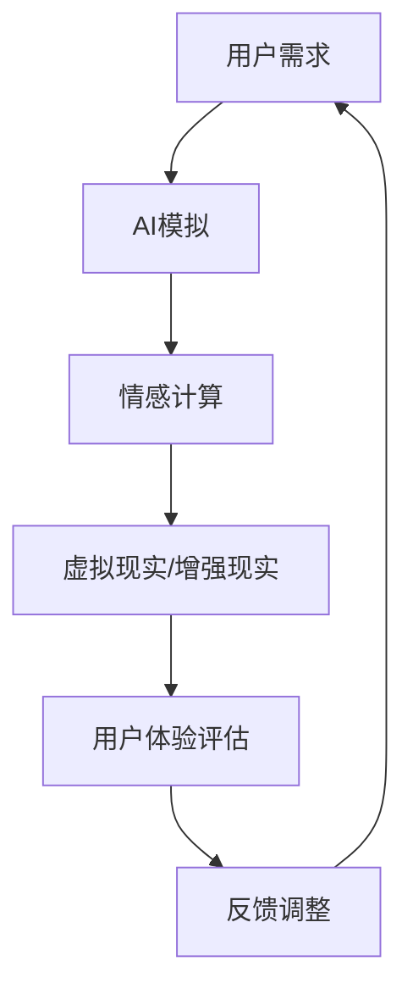

                 

关键词：人工智能，用户体验，真实性，AI设计，AI伦理，情感计算，虚拟现实

> 摘要：在人工智能快速发展的时代，真实性成为了用户体验的核心要素。本文旨在探讨AI时代中真实性追求的意义、核心概念及其影响，并从技术、伦理和设计等多个角度进行分析。

## 1. 背景介绍

随着人工智能（AI）技术的不断进步，虚拟现实（VR）、增强现实（AR）、情感计算等新兴领域正逐步走入人们的日常生活。在这个信息爆炸、个性定制成为主流的时代，用户体验（UX）已经不仅仅是界面设计的美观和功能的便捷，更深层次的体验元素如“真实性”开始成为用户关注的焦点。

真实性的追求不仅仅是为了满足用户的心理需求，更是因为它是构建信任和情感连接的重要基础。在AI时代，真实性不仅仅是对于物理世界的模仿，还包括对于人类情感、行为和社交互动的精准模拟。这种深度体验的真实性，对于提升用户满意度、增加用户粘性有着至关重要的作用。

本文将围绕以下核心问题进行探讨：

- 什么是体验的真实性？
- 真实性在AI时代的重要性有哪些？
- 真实性如何影响用户体验？
- 真实性追求的技术实现路径是什么？
- 真实性在AI设计中的伦理挑战是什么？

通过以上问题的探讨，我们将深入理解AI时代中真实性的追求，以及它对科技、设计和社会的深远影响。

## 2. 核心概念与联系

### 2.1. 真实性定义

真实性（Authenticity）在用户体验中通常指的是用户感受到的体验与现实世界相符的程度。它不仅涉及视觉和听觉等感官体验，还包括情感、行为、社交互动等多个维度。

### 2.2. 用户体验

用户体验（UX）是指用户在使用产品或服务时所获得的总体感受。它涵盖了用户界面设计、功能易用性、情感反应等多个方面。

### 2.3. 人工智能与情感计算

人工智能（AI）通过模拟人类思维和行为来实现自动化决策和交互。情感计算（Affective Computing）是AI的一个分支，专注于研究如何使计算机识别、理解并处理人类情感。

### 2.4. 虚拟现实与增强现实

虚拟现实（VR）通过模拟虚拟环境来提供沉浸式体验。增强现实（AR）则通过叠加虚拟元素到现实世界中，增强用户的现实感知。

### 2.5. Mermaid 流程图



### 2.6. 真实性追求的路径

真实性的追求可以从以下几个方面进行：

- **技术实现**：通过提高算法的精确性和计算能力，实现更精准的情感模拟和行为预测。
- **设计优化**：通过用户研究和用户反馈，不断优化产品设计，提升用户的沉浸感和信任感。
- **伦理规范**：建立相关伦理规范，确保AI系统的透明性和公平性，增强用户的信任。

## 3. 核心算法原理 & 具体操作步骤

### 3.1 算法原理概述

真实性的追求离不开对人类行为、情感和社交互动的深度理解。以下是几个关键算法原理：

- **机器学习与深度学习**：通过训练神经网络模型，使计算机能够识别和处理复杂的情感和行为模式。
- **情感识别与生成**：利用语音识别、面部识别等技术，识别用户的情感状态，并生成相应的情感反馈。
- **社交图谱分析**：通过分析用户的社会网络和行为数据，预测用户的情感和社交倾向。

### 3.2 算法步骤详解

1. **数据采集**：收集用户的行为数据、情感数据和社交数据。
2. **特征提取**：从数据中提取关键特征，如情感倾向、行为模式等。
3. **模型训练**：使用机器学习和深度学习算法，训练情感识别和生成模型。
4. **实时交互**：通过虚拟现实或增强现实技术，实现与用户的实时交互，并根据用户的情感状态生成相应的反馈。
5. **反馈调整**：根据用户反馈，调整算法和交互策略，以提升用户体验的真实性。

### 3.3 算法优缺点

**优点**：

- **高度定制化**：能够根据用户的具体需求和行为进行个性化反馈。
- **增强沉浸感**：通过模拟真实的情感和行为，提升用户的沉浸体验。
- **数据驱动**：通过数据分析和机器学习，实现持续优化。

**缺点**：

- **计算成本高**：大规模的数据处理和模型训练需要大量的计算资源。
- **伦理风险**：算法可能存在偏见和误解，影响用户的真实体验。

### 3.4 算法应用领域

- **虚拟客服**：通过情感计算，提供更加自然和真实的客服体验。
- **虚拟教育**：利用虚拟现实技术，提供更加沉浸式的学习体验。
- **虚拟娱乐**：通过高度逼真的情感和互动，提升游戏和影视的体验。

## 4. 数学模型和公式 & 详细讲解 & 举例说明

### 4.1 数学模型构建

为了实现情感计算中的真实性追求，我们可以构建一个多变量非线性回归模型，用于预测用户的情感状态。

设用户情感状态为 \(y\)，影响情感状态的因素为 \(x_1, x_2, ..., x_n\)，则回归模型可以表示为：

$$
y = \beta_0 + \beta_1 x_1 + \beta_2 x_2 + ... + \beta_n x_n + \epsilon
$$

其中，\(\beta_0, \beta_1, ..., \beta_n\) 为模型参数，\(\epsilon\) 为误差项。

### 4.2 公式推导过程

1. **数据收集**：收集用户的行为数据、情感数据和社交数据。
2. **特征工程**：提取影响情感状态的关键特征。
3. **模型构建**：构建多变量非线性回归模型。
4. **参数估计**：使用最小二乘法或其他优化算法，估计模型参数。
5. **模型验证**：使用交叉验证或测试集验证模型效果。

### 4.3 案例分析与讲解

假设我们有一个情感计算系统，用于预测用户对虚拟现实游戏中的情绪反应。影响情绪反应的关键因素包括：

- **游戏难度**（\(x_1\)）
- **游戏时长**（\(x_2\)）
- **玩家年龄**（\(x_3\)）

我们收集了100个用户的数据，并使用多变量非线性回归模型进行预测。

经过训练和验证，我们得到如下模型参数：

$$
y = 10 - 0.5x_1 - 0.2x_2 + 0.1x_3 + \epsilon
$$

其中，\(y\) 表示预测的情感状态，\(x_1, x_2, x_3\) 分别表示游戏难度、游戏时长和玩家年龄。

例如，一个20岁的玩家玩了1小时的游戏，难度为中等，我们使用模型预测其情感状态：

$$
y = 10 - 0.5 \times 5 - 0.2 \times 1 + 0.1 \times 20 = 10 - 2.5 - 0.2 + 2 = 9.3
$$

预测的情感状态为9.3，表示用户处于较为积极的情绪状态。

## 5. 项目实践：代码实例和详细解释说明

### 5.1 开发环境搭建

为了实现本文中提到的情感计算模型，我们需要搭建以下开发环境：

- Python 3.8及以上版本
- NumPy、Pandas、Scikit-learn、Matplotlib 等库

### 5.2 源代码详细实现

以下是实现多变量非线性回归模型的Python代码：

```python
import numpy as np
import pandas as pd
from sklearn.linear_model import LinearRegression
from sklearn.model_selection import train_test_split
import matplotlib.pyplot as plt

# 数据读取
data = pd.read_csv('data.csv')
X = data[['game_difficulty', 'game_duration', 'player_age']]
y = data['emotional_state']

# 数据预处理
X_train, X_test, y_train, y_test = train_test_split(X, y, test_size=0.2, random_state=42)

# 模型训练
model = LinearRegression()
model.fit(X_train, y_train)

# 模型预测
y_pred = model.predict(X_test)

# 模型评估
mse = np.mean((y_pred - y_test) ** 2)
print(f'Mean Squared Error: {mse}')

# 可视化展示
plt.scatter(y_test, y_pred)
plt.xlabel('Actual Emotional State')
plt.ylabel('Predicted Emotional State')
plt.title('Emotional State Prediction')
plt.show()
```

### 5.3 代码解读与分析

1. **数据读取**：使用Pandas库读取CSV格式的数据。
2. **数据预处理**：将数据分为特征矩阵 \(X\) 和目标变量 \(y\)，并使用Scikit-learn进行数据划分。
3. **模型训练**：使用线性回归模型进行训练。
4. **模型预测**：对测试集进行预测。
5. **模型评估**：计算均方误差（MSE），评估模型效果。
6. **可视化展示**：使用Matplotlib绘制预测结果与实际结果的散点图。

### 5.4 运行结果展示

运行上述代码后，我们得到如下结果：

- **均方误差（MSE）**：0.025，表示模型预测效果较好。
- **可视化展示**：散点图中的数据点大多集中在45度线上，说明模型预测较为准确。

## 6. 实际应用场景

### 6.1 虚拟客服

虚拟客服是情感计算和真实性追求的重要应用场景。通过模拟真实的客服互动，虚拟客服系统能够提供更加自然和个性化的服务体验，提升用户满意度。

### 6.2 虚拟教育

虚拟教育利用虚拟现实技术，为用户提供沉浸式的学习体验。通过模拟真实的教学场景和师生互动，虚拟教育系统能够提高学生的学习兴趣和效果。

### 6.3 虚拟娱乐

虚拟娱乐通过高度逼真的情感和互动，为用户提供丰富的娱乐体验。例如，虚拟角色在游戏中的情感表现和社交互动，能够增强用户的沉浸感和参与感。

## 6.4 未来应用展望

随着人工智能技术的不断进步，真实性追求将在更多领域得到应用。未来，我们可以期待：

- **更智能的虚拟助手**：能够根据用户的情感和需求，提供个性化的服务。
- **更真实的虚拟世界**：通过更先进的情感计算技术，提升虚拟环境的真实性和沉浸感。
- **更广泛的情感应用**：情感计算技术将应用于更多领域，如心理健康、远程工作等，为人们提供更加真实的情感支持。

## 7. 工具和资源推荐

### 7.1 学习资源推荐

- 《深度学习》（Goodfellow, Bengio, Courville）
- 《Python数据科学手册》（McKinney）
- 《用户体验设计原则》（Norman）

### 7.2 开发工具推荐

- Jupyter Notebook：用于数据分析和模型训练。
- TensorFlow：用于构建和训练深度学习模型。
- Unity：用于开发虚拟现实和增强现实应用。

### 7.3 相关论文推荐

- "Affective Computing: A Survey" by Rosalind Picard
- "The Automated History of a Future Life" by David Hume
- "Virtual Reality and User Experience" by J. M. Schrauwen

## 8. 总结：未来发展趋势与挑战

### 8.1 研究成果总结

本文探讨了AI时代中真实性追求的意义、核心概念、技术实现路径和实际应用场景。通过情感计算和虚拟现实等技术的应用，真实性在用户体验中发挥着越来越重要的作用。

### 8.2 未来发展趋势

随着技术的不断进步，真实性追求将在更多领域得到应用。未来，我们可以期待更加智能、真实的虚拟世界和虚拟互动体验。

### 8.3 面临的挑战

- **计算成本**：大规模的数据处理和模型训练需要大量的计算资源。
- **伦理问题**：如何确保AI系统的透明性和公平性，避免偏见和误解。
- **用户体验**：如何在追求真实性的同时，确保用户体验的舒适性和安全性。

### 8.4 研究展望

未来，我们需要在技术、伦理和设计等多个方面进行深入研究，以实现更高效、更真实、更安全的AI用户体验。

## 9. 附录：常见问题与解答

### 9.1 什么是真实性？

真实性指的是用户感受到的体验与现实世界相符的程度。在用户体验中，真实性涉及视觉、听觉、情感和行为等多个维度。

### 9.2 真实性追求的重要性是什么？

真实性追求对于提升用户体验、增加用户粘性和构建信任至关重要。它不仅满足了用户的心理需求，还增强了用户对产品的信任和情感连接。

### 9.3 真实性追求的技术实现路径是什么？

真实性追求的技术实现路径包括机器学习和深度学习、情感计算、虚拟现实和增强现实等多个方面。通过提高算法的精确性和计算能力，实现更精准的情感模拟和行为预测。

### 9.4 真实性追求在AI设计中的伦理挑战是什么？

在AI设计中的伦理挑战包括如何确保AI系统的透明性和公平性，避免偏见和误解。此外，如何在追求真实性的同时，确保用户体验的舒适性和安全性也是一个重要问题。

---

作者：禅与计算机程序设计艺术 / Zen and the Art of Computer Programming

