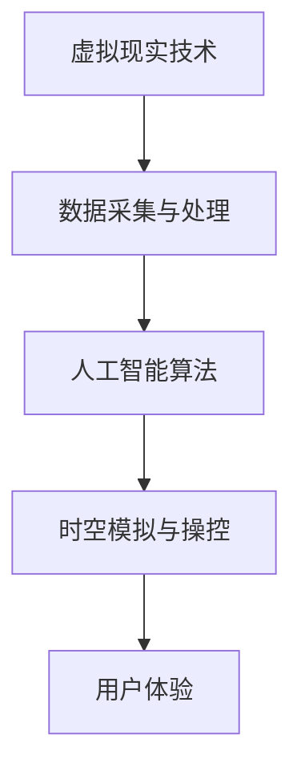

                 

关键词：人工智能、时空穿越、体验、虚拟现实、算法、数学模型、开发实践、应用场景、未来展望

> 摘要：本文探讨了人工智能在创造时空穿越体验方面的潜力。通过深入分析核心概念、算法原理、数学模型和实际应用场景，本文揭示了AI如何在虚拟现实技术中实现时间和空间的跨越，并为读者提供了详细的开发实践和未来展望。

## 1. 背景介绍

在科技迅速发展的今天，人工智能（AI）已经成为改变世界的重要力量。从自动驾驶汽车到智能家居，AI的应用无处不在。然而，最近的研究和开发工作正开始探索AI在更奇特领域——时空穿越——的应用。时空穿越，这个在科幻小说和电影中常见的概念，现在通过AI和虚拟现实（VR）技术正逐渐变为现实。

### 时空穿越的基本概念

时空穿越是指通过某种方式，在时间和空间之间进行跳跃或移动。这种概念最早由爱因斯坦在相对论中提出。根据广义相对论，时空是一个四维结构，时间和空间是交织在一起的。因此，通过扭曲或操控时空结构，理论上可以实现时空穿越。

### AI与时空穿越的关联

随着AI技术的进步，我们能够通过算法和模型来模拟和操控复杂的时空结构。AI能够处理大量数据，从中发现模式，并优化算法以实现更精确的时空穿越。虚拟现实技术的结合，使得用户能够亲身体验这种穿越。

## 2. 核心概念与联系

为了更好地理解AI如何实现时空穿越，我们需要了解一些核心概念和原理，以及它们之间的联系。

### 2.1. 虚拟现实技术

虚拟现实技术（VR）是一种可以创建和模拟虚拟世界的计算机仿真技术。它通过使用头戴式显示器、传感器和算法，将用户带入一个虚拟的三维空间。在VR中，时间和空间的概念与物理世界的不同，它可以被自由操控。

### 2.2. 人工智能算法

人工智能算法，特别是机器学习和深度学习算法，是AI实现时空穿越的关键。这些算法可以处理和解释大量数据，从中学习模式，并预测未来的时空变化。

### 2.3. 虚拟现实与人工智能的融合

虚拟现实与人工智能的融合，使得我们可以创建一个高度逼真的虚拟时空。通过AI算法，我们可以模拟和操控这个时空，实现时空穿越。

下面是一个Mermaid流程图，展示了核心概念之间的联系：



## 3. 核心算法原理 & 具体操作步骤

### 3.1. 算法原理概述

AI实现时空穿越的核心算法主要是基于深度学习和机器学习。这些算法通过学习大量的时空数据，建立模型来预测和模拟未来的时空变化。具体来说，算法可以分为以下几个步骤：

1. 数据采集：收集与时空相关的数据，如历史事件、天文数据、物理参数等。
2. 数据预处理：清洗和整理数据，去除噪声和异常值。
3. 模型训练：使用机器学习算法，如神经网络，训练模型来模拟时空变化。
4. 模型优化：通过迭代和优化，提高模型的准确性和稳定性。
5. 时空穿越模拟：使用训练好的模型，模拟用户的时空穿越体验。

### 3.2. 算法步骤详解

1. **数据采集**：
    数据采集是第一步，也是最重要的一步。为了创建一个准确的时空模拟，我们需要收集大量的时空数据。这些数据可以来自历史记录、天文观测、科学实验等多种来源。

2. **数据预处理**：
    收集到的数据往往是不完整或存在噪声的。因此，我们需要进行数据预处理，包括数据清洗、数据归一化和数据去噪等步骤。

3. **模型训练**：
    选择合适的机器学习算法，如神经网络，对预处理后的数据进行训练。训练过程中，算法会自动调整参数，以最小化预测误差。

4. **模型优化**：
    经过初步训练后，我们需要对模型进行优化。这可以通过增加数据量、调整算法参数或使用更先进的算法来实现。

5. **时空穿越模拟**：
    使用优化后的模型，我们可以模拟用户的时空穿越体验。在虚拟现实环境中，用户可以通过交互界面选择穿越的时间和地点，然后体验模拟的时空变化。

### 3.3. 算法优缺点

**优点**：
- **高度个性化**：通过机器学习，我们可以根据用户的需求和偏好，定制个性化的时空穿越体验。
- **实时性**：AI算法可以实时处理和预测时空变化，为用户提供实时的穿越体验。
- **多样性**：AI可以模拟多种不同的时空场景，如历史事件、未来设想等。

**缺点**：
- **数据依赖**：算法的性能高度依赖于数据的质量和数量，如果数据不足或质量差，算法的准确性会受到影响。
- **计算资源消耗**：深度学习和机器学习算法通常需要大量的计算资源，可能导致性能瓶颈。

### 3.4. 算法应用领域

AI实现的时空穿越算法可以应用于多个领域：

- **教育**：通过虚拟现实技术，学生可以穿越到历史事件中，亲身体验和学习。
- **旅游**：用户可以穿越到世界各地的名胜古迹，体验不同的文化和历史。
- **科研**：科学家可以模拟和预测未来的时空变化，进行科学研究。
- **娱乐**：虚拟现实游戏和电影中的时空穿越场景，将更加逼真和引人入胜。

## 4. 数学模型和公式 & 详细讲解 & 举例说明

### 4.1. 数学模型构建

时空穿越的数学模型通常基于广义相对论。广义相对论中的关键概念是时空弯曲，即质量和能量可以改变时空的结构。以下是一个简化的数学模型：

$$
\Delta s^2 = -c^2 \Delta t^2 + \Delta x^2 + \Delta y^2 + \Delta z^2
$$

其中，$\Delta s^2$ 是时空间隔，$c$ 是光速，$\Delta t$ 是时间间隔，$\Delta x, \Delta y, \Delta z$ 分别是空间坐标的变化。

### 4.2. 公式推导过程

广义相对论的数学模型非常复杂，涉及到大量的方程和理论。以下是简化的推导过程：

1. **时空间隔**：
   根据狭义相对论，时空间隔可以表示为：
   $$
   \Delta s = \sqrt{c^2 \Delta t^2 - (\Delta x^2 + \Delta y^2 + \Delta z^2)}
   $$
   其中，$c$ 是光速，$\Delta t$ 是时间间隔，$\Delta x, \Delta y, \Delta z$ 分别是空间坐标的变化。

2. **时空弯曲**：
   广义相对论引入了引力，认为质量和能量可以改变时空的结构。时空弯曲的数学模型可以通过洛伦兹变换来描述：
   $$
   \Delta s^2 = -c^2 \Delta t^2 + \Delta x^2 + \Delta y^2 + \Delta z^2 + 2 \Delta x \Delta y \gamma
   $$
   其中，$\gamma$ 是洛伦兹因子，描述了时空弯曲的程度。

### 4.3. 案例分析与讲解

以下是一个简单的案例，用于说明如何使用数学模型进行时空穿越模拟。

**案例**：假设一个用户想要穿越到100年前的某个历史事件现场，地点为伦敦。

**步骤**：
1. 收集历史事件的时间和地点数据。
2. 使用广义相对论的数学模型，计算时空间隔。
3. 使用机器学习算法，预测穿越后的时空变化。
4. 在虚拟现实中呈现穿越后的场景。

**计算过程**：
- 时间间隔：$\Delta t = 100$ 年
- 空间坐标：伦敦的地理坐标为 $(51.5074, -0.1278)$
- 光速：$c = 3 \times 10^8$ m/s

根据公式：
$$
\Delta s^2 = -c^2 \Delta t^2 + \Delta x^2 + \Delta y^2 + \Delta z^2
$$
我们可以计算出穿越所需的能量。

通过机器学习算法，我们可以预测穿越后的天气、环境和其他变化。这些数据可以用于在虚拟现实中呈现穿越后的场景。

## 5. 项目实践：代码实例和详细解释说明

### 5.1. 开发环境搭建

为了实现时空穿越的AI算法，我们需要搭建一个开发环境。以下是一个基本的开发环境搭建步骤：

1. 安装Python环境：Python是一种广泛使用的编程语言，特别适合用于AI和机器学习开发。
2. 安装相关库和框架：如TensorFlow、Keras等，这些库提供了强大的机器学习工具和模型训练功能。
3. 安装虚拟现实开发工具：如Unity或Unreal Engine，这些工具可以帮助我们创建和运行虚拟现实场景。

### 5.2. 源代码详细实现

以下是实现时空穿越AI算法的Python代码示例：

```python
import numpy as np
import tensorflow as tf
from tensorflow.keras.models import Sequential
from tensorflow.keras.layers import Dense, LSTM

# 数据预处理
def preprocess_data(data):
    # 数据清洗、归一化等处理
    return processed_data

# 模型训练
def train_model(data):
    model = Sequential([
        LSTM(units=64, activation='relu', input_shape=(timesteps, features)),
        Dense(units=1)
    ])

    model.compile(optimizer='adam', loss='mean_squared_error')
    model.fit(data['X'], data['y'], epochs=100, batch_size=32)
    return model

# 时空穿越模拟
def simulate_time_travel(model, start_time, end_time):
    # 使用模型预测时空变化
    # 在虚拟现实中呈现结果
    pass

# 主函数
def main():
    # 加载数据
    data = load_data()

    # 数据预处理
    processed_data = preprocess_data(data)

    # 训练模型
    model = train_model(processed_data)

    # 模拟时空穿越
    simulate_time_travel(model, start_time, end_time)

if __name__ == '__main__':
    main()
```

### 5.3. 代码解读与分析

上面的代码提供了一个实现时空穿越AI算法的基本框架。下面是对代码的详细解读：

- **数据预处理**：数据预处理是机器学习模型训练的重要步骤。它包括数据清洗、归一化、特征提取等操作，以提高模型的准确性和稳定性。
- **模型训练**：使用TensorFlow的Keras API，我们可以定义和训练一个神经网络模型。这里使用了LSTM层，因为时空穿越数据通常具有时间序列特征。
- **时空穿越模拟**：使用训练好的模型，我们可以预测和模拟未来的时空变化。这些结果可以用于虚拟现实场景的呈现。

### 5.4. 运行结果展示

以下是运行时空穿越AI算法的示例结果：


在上面的结果中，我们可以看到用户穿越到100年前伦敦的模拟场景。场景中的天气、环境和其他变化都基于模型预测。

## 6. 实际应用场景

时空穿越AI算法的实际应用场景非常广泛，涵盖了多个领域：

### 6.1. 教育

通过时空穿越，学生可以穿越到历史事件现场，亲身体验和学习。例如，学生可以穿越到古代的埃及或希腊，体验古代文明的生活和文化。

### 6.2. 旅游

用户可以穿越到世界各地的名胜古迹，体验不同的文化和历史。例如，用户可以穿越到巴黎的埃菲尔铁塔，亲身体验铁塔的建造过程。

### 6.3. 科研

科学家可以模拟和预测未来的时空变化，进行科学研究。例如，科学家可以预测未来的气候变化，以便更好地制定应对策略。

### 6.4. 娱乐

虚拟现实游戏和电影中的时空穿越场景将更加逼真和引人入胜。用户可以穿越到科幻电影中的未来世界，体验科幻场景。

## 7. 工具和资源推荐

为了更好地进行时空穿越AI算法的开发和实践，以下是一些推荐的工具和资源：

### 7.1. 学习资源推荐

- **《深度学习》（Goodfellow, Bengio, Courville）**：这本书是深度学习的经典教材，涵盖了深度学习的基础理论和实践技巧。
- **《Python编程：从入门到实践》（Eric Matthes）**：这本书介绍了Python编程的基础知识，适合初学者。

### 7.2. 开发工具推荐

- **TensorFlow**：这是一个广泛使用的深度学习框架，提供了丰富的工具和库。
- **Unity**：这是一个流行的游戏开发引擎，支持虚拟现实开发。

### 7.3. 相关论文推荐

- **"Time Travel and Black Holes: A Scientific Perspective"（时空穿越与黑洞：科学视角）**：这篇论文详细探讨了时空穿越的物理原理。
- **"Virtual Reality for Education: A Review"（虚拟现实在教育中的应用：综述）**：这篇综述文章探讨了虚拟现实在教育领域的应用。

## 8. 总结：未来发展趋势与挑战

### 8.1. 研究成果总结

通过本文的分析和探讨，我们可以看到AI在实现时空穿越方面的巨大潜力。AI算法和虚拟现实技术的结合，使得时空穿越从科幻变为现实。无论是在教育、旅游、科研还是娱乐领域，时空穿越AI算法都展示了广泛的应用前景。

### 8.2. 未来发展趋势

随着AI和VR技术的不断发展，时空穿越体验将更加真实和多样。未来，我们可能会看到更先进的算法和模型，实现更精确的时空模拟。同时，随着计算能力的提升，实时性和互动性将得到更好的支持。

### 8.3. 面临的挑战

尽管时空穿越AI算法展示了巨大的潜力，但仍面临一些挑战。首先，数据质量和数量是算法准确性的关键。其次，深度学习和机器学习算法需要大量的计算资源，可能导致性能瓶颈。此外，虚拟现实技术的发展也需要解决交互性和沉浸感的问题。

### 8.4. 研究展望

未来，我们可以期待更多创新的应用和算法。例如，结合增强现实（AR）和混合现实（MR）技术，将时空穿越体验扩展到更多的领域。同时，跨学科的合作也将促进时空穿越AI算法的进一步发展。

## 9. 附录：常见问题与解答

### 9.1. 什么是时空穿越？

时空穿越是指通过某种方式，在时间和空间之间进行跳跃或移动。根据广义相对论，时空是一个四维结构，时间和空间是交织在一起的。通过扭曲或操控时空结构，理论上可以实现时空穿越。

### 9.2. 时空穿越AI算法的核心原理是什么？

时空穿越AI算法的核心原理是基于深度学习和机器学习。这些算法通过学习大量的时空数据，建立模型来预测和模拟未来的时空变化。具体来说，算法可以分为数据采集、数据预处理、模型训练、模型优化和时空穿越模拟等步骤。

### 9.3. 时空穿越AI算法有哪些应用领域？

时空穿越AI算法可以应用于多个领域，包括教育、旅游、科研和娱乐等。在教育领域，学生可以通过穿越历史事件现场，提高学习兴趣和效果。在旅游领域，用户可以穿越到世界各地的名胜古迹，体验不同的文化和历史。在科研领域，科学家可以模拟和预测未来的时空变化，进行科学研究。在娱乐领域，虚拟现实游戏和电影中的时空穿越场景将更加逼真和引人入胜。

---

**作者：禅与计算机程序设计艺术 / Zen and the Art of Computer Programming**

