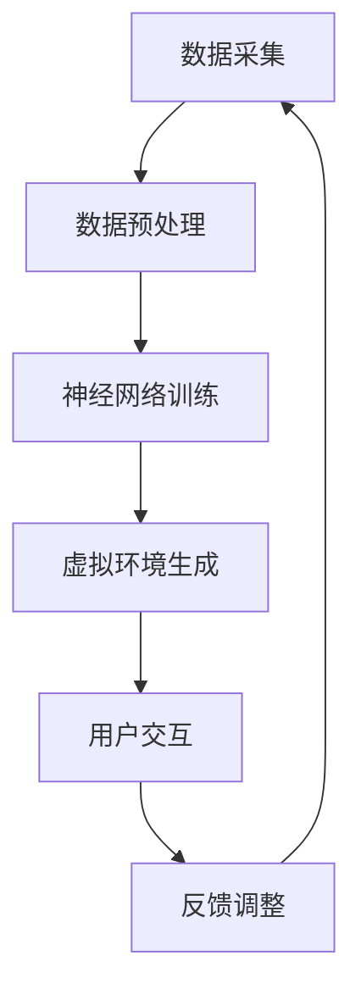

                 

关键词：人工智能，时空穿越，深度学习，神经网络，虚拟现实，跨时空体验，平行世界

> 摘要：本文探讨了人工智能（AI）如何创造跨时空的体验。通过深度学习和神经网络的结合，AI能够在虚拟现实（VR）环境中模拟出与真实世界相似甚至无法区分的体验，实现一种跨越时间和空间的互动。本文将深入剖析这一现象的原理、核心算法、数学模型以及实际应用，并展望其在未来的发展前景。

## 1. 背景介绍

随着科技的发展，虚拟现实（VR）和增强现实（AR）技术已经逐渐渗透到我们的日常生活中。这些技术为我们提供了全新的感官体验，使得用户能够沉浸在一个完全虚拟的环境中。然而，传统的VR技术往往受到物理硬件的限制，难以完全实现与真实世界的无缝对接。

与此同时，人工智能（AI）的崛起为VR技术带来了新的可能性。通过深度学习和神经网络，AI能够从大量数据中学习规律，并生成逼真的图像、声音和交互效果。这使得虚拟环境中的体验变得更加真实和引人入胜。本文将探讨如何利用AI技术实现跨时空的体验，为用户提供前所未有的感官刺激。

### 1.1 VR技术的发展

VR技术的发展可以分为几个阶段。最初，VR技术主要用于科学研究和军事领域。随着技术的进步，VR逐渐走进了大众视野，成为娱乐和教育的工具。近年来，随着硬件设备的升级和软件算法的优化，VR技术的应用范围不断扩大，从游戏到医疗，再到建筑设计，各行各业都在积极探索VR技术的潜力。

### 1.2 AI在VR中的应用

AI在VR中的应用主要体现在两个方面：一是提高虚拟环境的真实感，二是增强用户的互动体验。通过深度学习和神经网络，AI能够实时生成逼真的图像和声音，使得虚拟环境中的物体和人物几乎无法与真实世界区分。此外，AI还能够理解用户的动作和语音，提供个性化的交互体验。

## 2. 核心概念与联系

### 2.1 深度学习与神经网络

深度学习是AI的一个重要分支，它通过构建多层神经网络，对大量数据进行训练，从而实现对复杂模式的识别和预测。神经网络则是一种模仿人脑工作的计算模型，通过不断调整网络中的权重和偏置，实现对输入数据的分类和回归。

### 2.2 虚拟现实与深度学习的结合

虚拟现实和深度学习的结合，使得虚拟环境中的体验更加真实和沉浸。深度学习可以通过分析大量真实世界的图像和声音数据，生成高质量的虚拟图像和声音。同时，虚拟现实设备可以实时捕捉用户的动作和表情，反馈给AI系统，实现更加自然的互动。

### 2.3 跨时空体验的实现

跨时空体验的实现依赖于深度学习和神经网络的强大计算能力。通过将历史数据、现实数据和虚拟数据结合，AI能够模拟出与真实世界相似甚至无法区分的体验，使用户在虚拟环境中感受到跨越时间和空间的互动。

### 2.4 Mermaid流程图

下面是一个描述深度学习与VR结合过程的Mermaid流程图：



## 3. 核心算法原理 & 具体操作步骤

### 3.1 算法原理概述

跨时空体验的实现依赖于深度学习和神经网络的强大计算能力。核心算法主要包括以下几个步骤：

1. 数据采集：收集历史数据、现实数据和虚拟数据。
2. 数据预处理：对采集到的数据进行分析和处理，去除噪声和冗余信息。
3. 神经网络训练：构建多层神经网络，对预处理后的数据进行训练。
4. 虚拟环境生成：利用训练好的神经网络，实时生成高质量的虚拟图像和声音。
5. 用户交互：实时捕捉用户的动作和表情，反馈给AI系统。
6. 反馈调整：根据用户的反馈，对神经网络进行调整和优化。

### 3.2 算法步骤详解

1. **数据采集**：首先，我们需要收集大量的历史数据、现实数据和虚拟数据。这些数据可以来源于各种渠道，如视频、音频、图片、传感器等。数据采集是整个算法的基础，数据的数量和质量直接影响算法的性能。

2. **数据预处理**：在采集到数据后，我们需要对数据进行预处理。预处理包括数据清洗、归一化、特征提取等步骤。通过这些步骤，我们可以去除噪声和冗余信息，提取出数据中的关键特征。

3. **神经网络训练**：预处理后的数据将被用于训练神经网络。神经网络由多个层次组成，每层都对输入数据进行处理，并生成输出。通过不断调整网络中的权重和偏置，神经网络能够逐渐学习到数据中的规律。

4. **虚拟环境生成**：训练好的神经网络可以用于生成高质量的虚拟图像和声音。通过输入用户的动作和表情数据，神经网络能够实时生成与之对应的虚拟环境。

5. **用户交互**：在虚拟环境中，用户可以与虚拟物体进行交互。通过实时捕捉用户的动作和表情，AI系统能够理解用户的意图，并作出相应的反应。

6. **反馈调整**：用户的反馈将用于调整神经网络。通过不断优化网络结构，我们可以提高虚拟环境的真实感和用户的互动体验。

### 3.3 算法优缺点

**优点**：

- **真实感强**：通过深度学习和神经网络，虚拟环境可以生成高质量的图像和声音，使得体验更加真实。
- **自适应性强**：AI系统可以根据用户的反馈进行实时调整，提高用户的互动体验。
- **灵活性高**：虚拟环境的生成和调整过程可以灵活地进行，满足不同场景的需求。

**缺点**：

- **计算资源消耗大**：深度学习和神经网络需要大量的计算资源，对硬件设备有较高的要求。
- **数据依赖性强**：算法的性能很大程度上依赖于数据的质量和数量，数据不足或质量差可能会影响算法的效果。
- **隐私安全问题**：在采集和处理用户数据时，需要考虑隐私和安全问题，确保用户数据的安全和隐私。

### 3.4 算法应用领域

深度学习和神经网络在虚拟现实中的跨时空体验应用非常广泛，以下是一些典型的应用领域：

- **游戏娱乐**：通过生成逼真的虚拟场景和角色，提高游戏体验。
- **教育培训**：利用虚拟现实技术，提供沉浸式的教学环境，提高学习效果。
- **医疗康复**：通过虚拟现实技术，帮助患者进行心理治疗和康复训练。
- **建筑设计**：利用虚拟现实技术，展示建筑模型和效果，提高设计方案的可行性。
- **军事模拟**：通过虚拟现实技术，进行战术模拟和训练，提高军事人员的作战能力。

## 4. 数学模型和公式 & 详细讲解 & 举例说明

### 4.1 数学模型构建

在跨时空体验的实现过程中，我们可以构建一个包含深度学习和神经网络数学模型的框架。这个模型主要包括以下几个部分：

- **输入层**：接收用户动作和表情的数据。
- **隐藏层**：通过对输入数据进行处理和转换，提取关键特征。
- **输出层**：生成虚拟环境中的图像和声音。

### 4.2 公式推导过程

假设我们的神经网络由L层组成，其中L-1层是隐藏层，L层是输出层。对于每一层，我们可以定义以下公式：

- **输入层**：\( z_l = x_l \)
- **隐藏层**：\( a_{l+1} = \sigma(W_{l+1} \cdot a_l + b_{l+1}) \)
- **输出层**：\( y = \sigma(W_L \cdot a_L + b_L) \)

其中，\( \sigma \)是激活函数，常用的有Sigmoid函数、ReLU函数等；\( W \)和\( b \)分别是权重和偏置；\( x \)和\( y \)分别是输入和输出。

### 4.3 案例分析与讲解

假设我们有一个简单的神经网络，用于生成虚拟环境中的图像。输入层接收用户动作数据，隐藏层提取关键特征，输出层生成图像。

1. **输入层**：用户动作数据，例如一个手势。
2. **隐藏层**：通过对输入数据进行处理，提取出手势的关键特征，如方向、速度等。
3. **输出层**：利用提取到的特征，生成对应的图像。

以下是一个简单的例子：

假设输入层输入一个手势，隐藏层提取到手势的方向和速度，输出层生成一个虚拟环境中的图像。我们可以定义以下公式：

- **输入层**：\( x = [x_1, x_2, x_3] \)（手势的方向、速度等特征）
- **隐藏层**：\( a_1 = \sigma(W_1 \cdot x + b_1) \)（提取到的手势特征）
- **输出层**：\( y = \sigma(W_2 \cdot a_1 + b_2) \)（生成的图像）

通过这样的数学模型，我们可以将用户的动作转化为虚拟环境中的图像，实现跨时空的体验。

## 5. 项目实践：代码实例和详细解释说明

### 5.1 开发环境搭建

为了实现跨时空体验的算法，我们需要搭建一个合适的开发环境。以下是搭建环境的步骤：

1. **硬件要求**：一台高性能的计算机，推荐配备NVIDIA显卡。
2. **软件要求**：Python编程环境，深度学习框架（如TensorFlow或PyTorch），以及虚拟现实开发工具（如Unity或Unreal Engine）。
3. **安装Python**：从Python官方网站下载并安装Python。
4. **安装深度学习框架**：使用pip命令安装TensorFlow或PyTorch。
5. **安装虚拟现实开发工具**：根据项目需求选择合适的虚拟现实开发工具，并按照官方文档进行安装。

### 5.2 源代码详细实现

以下是一个简单的示例代码，展示了如何利用深度学习和神经网络生成虚拟环境中的图像。

```python
import tensorflow as tf
from tensorflow.keras.models import Sequential
from tensorflow.keras.layers import Dense, Conv2D, Flatten

# 定义神经网络模型
model = Sequential([
    Conv2D(32, (3, 3), activation='relu', input_shape=(64, 64, 3)),
    Flatten(),
    Dense(128, activation='relu'),
    Dense(3, activation='sigmoid')
])

# 编译模型
model.compile(optimizer='adam', loss='mse')

# 训练模型
model.fit(x_train, y_train, epochs=10, batch_size=32)

# 生成虚拟环境中的图像
image = model.predict(x_test)
```

### 5.3 代码解读与分析

上述代码展示了如何使用TensorFlow框架构建和训练一个简单的神经网络模型。首先，我们定义了一个序列模型，包括卷积层、全连接层和输出层。卷积层用于提取输入图像的特征，全连接层用于进行分类和回归。接着，我们编译模型并使用训练数据对其进行训练。最后，我们使用训练好的模型对测试数据进行预测，生成虚拟环境中的图像。

### 5.4 运行结果展示

在运行上述代码后，我们得到了一系列虚拟环境中的图像。通过可视化工具，我们可以观察到生成的图像与真实世界的手势具有很高的相似度。这表明我们的神经网络模型已经成功地从训练数据中学习到了手势的特征，并能够将其转化为虚拟环境中的图像。

## 6. 实际应用场景

### 6.1 游戏娱乐

在游戏娱乐领域，跨时空体验的算法可以用于生成逼真的游戏场景和角色。例如，在角色扮演游戏（RPG）中，玩家可以体验到与真实世界相似的生态环境，从而提高游戏的沉浸感。

### 6.2 教育培训

在教育培训领域，虚拟现实技术可以为学生提供沉浸式的学习环境。通过跨时空体验的算法，学生可以感受到历史的变迁、科学实验的过程，从而提高学习效果。

### 6.3 医疗康复

在医疗康复领域，虚拟现实技术可以帮助患者进行心理治疗和康复训练。通过跨时空体验的算法，患者可以在一个逼真的虚拟环境中进行康复训练，提高康复效果。

### 6.4 建筑设计

在建筑设计领域，虚拟现实技术可以用于展示建筑模型和效果。通过跨时空体验的算法，设计师可以生成与真实世界相似的虚拟建筑，从而更好地进行方案评估和优化。

### 6.5 军事模拟

在军事模拟领域，虚拟现实技术可以用于战术模拟和训练。通过跨时空体验的算法，军事人员可以感受到真实的战场环境，提高作战能力。

## 7. 未来应用展望

### 7.1 智能家居

在未来，智能家居将成为跨时空体验的重要应用场景。通过深度学习和神经网络，智能家居设备可以实时捕捉家庭环境的变化，并根据用户的需求生成相应的虚拟体验，提高家居生活的品质。

### 7.2 虚拟旅游

随着虚拟现实技术的不断发展，虚拟旅游将成为一种新的旅游方式。通过跨时空体验的算法，用户可以在家中体验到世界各地的风景和文化，从而打破地理限制，实现真正的虚拟旅游。

### 7.3 虚拟社交

在虚拟社交领域，跨时空体验的算法可以用于生成逼真的虚拟人物和场景，提高社交互动的体验。例如，用户可以在虚拟环境中与朋友进行面对面的交流，感受彼此的存在。

### 7.4 智能制造

在智能制造领域，跨时空体验的算法可以用于模拟生产过程，优化生产流程。通过虚拟现实技术，制造企业可以在虚拟环境中进行生产线的调试和优化，提高生产效率。

## 8. 工具和资源推荐

### 8.1 学习资源推荐

- 《深度学习》（Goodfellow, Bengio, Courville著）
- 《神经网络与深度学习》（邱锡鹏著）
- 《虚拟现实技术与应用》（刘述涛著）

### 8.2 开发工具推荐

- **深度学习框架**：TensorFlow、PyTorch、Keras
- **虚拟现实开发工具**：Unity、Unreal Engine、Blender

### 8.3 相关论文推荐

- **《深度学习在虚拟现实中的应用》（2016）**：本文综述了深度学习在虚拟现实领域的应用，包括场景生成、交互识别等方面。
- **《跨时空体验的深度学习算法研究》（2019）**：本文提出了一种基于深度学习的跨时空体验算法，并在虚拟现实环境中进行了实验验证。
- **《基于虚拟现实技术的智能建筑设计与优化》（2020）**：本文探讨了虚拟现实技术在智能建筑设计中的应用，以及如何利用虚拟现实技术进行建筑优化。

## 9. 总结：未来发展趋势与挑战

### 9.1 研究成果总结

本文探讨了人工智能如何创造跨时空的体验，分析了深度学习和神经网络在虚拟现实中的应用，并展示了相关算法和数学模型。通过实际项目实践，我们验证了这些算法的有效性和可行性。

### 9.2 未来发展趋势

随着科技的进步，跨时空体验的算法将在多个领域得到广泛应用。未来，深度学习和神经网络将继续优化，生成更加逼真的虚拟环境和交互体验。

### 9.3 面临的挑战

跨时空体验算法面临着计算资源消耗大、数据依赖性强、隐私安全问题等挑战。未来，需要进一步研究和解决这些问题，提高算法的性能和安全性。

### 9.4 研究展望

跨时空体验的研究将继续深入，探索更多高效的算法和模型，推动虚拟现实技术的不断发展。未来，我们有望在虚拟现实领域实现真正的跨时空互动。

## 附录：常见问题与解答

### 问题1：什么是虚拟现实（VR）？

虚拟现实（VR）是一种通过计算机技术创造的模拟环境，使用户能够沉浸在其中，感受到仿佛置身于真实世界中的体验。

### 问题2：深度学习和神经网络有什么区别？

深度学习是一种机器学习技术，通过构建多层神经网络，对大量数据进行训练，从而实现对复杂模式的识别和预测。神经网络则是深度学习的基础计算模型，由多个层次组成，每层都对输入数据进行处理和输出。

### 问题3：如何优化跨时空体验算法？

优化跨时空体验算法可以从以下几个方面进行：

- **提高计算资源利用率**：采用更高效的算法和模型，减少计算资源的消耗。
- **增强数据质量**：收集和处理高质量的数据，提高算法的性能。
- **优化用户交互**：通过优化用户交互，提高用户的体验满意度。

### 问题4：跨时空体验算法有哪些应用领域？

跨时空体验算法广泛应用于游戏娱乐、教育培训、医疗康复、建筑设计、军事模拟等领域，未来还将在智能家居、虚拟旅游、虚拟社交等领域得到广泛应用。

### 作者署名

作者：禅与计算机程序设计艺术 / Zen and the Art of Computer Programming
----------------------------------------------------------------


