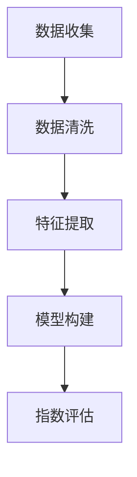

                 

关键词：AI，体验真实性，量化，开发者，authenticity指数，AI时代，量化技术，用户体验，数据分析，AI算法，真实性评估

> 摘要：本文将探讨AI时代中体验真实性指数（Authenticity Experience Index，简称AEI）的开发和应用。作为一位AI时代的authenticity量化专家，本文旨在深入解析AEI的核心概念、算法原理、数学模型、项目实践以及未来发展趋势，为开发者提供一套全面而实用的指南。

## 1. 背景介绍

在数字化时代，用户体验（User Experience，简称UX）已经成为企业竞争的关键因素。用户体验不仅仅是界面设计的美观，更包括用户在交互过程中的情感体验、满意度以及信任度等多个维度。而体验真实性（Authenticity Experience）是用户体验的重要组成部分，它关乎用户对品牌、产品或服务的真实感受和信任度。随着人工智能（Artificial Intelligence，简称AI）技术的快速发展，如何量化体验真实性成为一个亟待解决的问题。

体验真实性指数（AEI）正是为了量化用户体验中的真实性而提出的一个概念。它通过对用户行为数据、情感数据、社交数据等多维数据的分析，构建出一个可量化的指标，用以评估用户体验中的真实性水平。开发一个高效的AEI系统，不仅能够帮助企业更好地理解用户需求，优化产品和服务，还能提升用户忠诚度和品牌价值。

## 2. 核心概念与联系

### 2.1 体验真实性的核心概念

体验真实性是指用户在交互过程中所感知到的与产品或服务提供的真实程度。它包括以下几个方面的内容：

1. **透明性**：产品或服务提供的信息是否真实、透明。
2. **一致性**：产品或服务的表现是否与其宣传一致。
3. **可靠性**：产品或服务的质量是否可靠，能否满足用户预期。
4. **情感共鸣**：产品或服务是否能够触动用户的情感，建立情感连接。

### 2.2 体验真实性的量化方法

为了量化体验真实性，我们需要收集和分析以下几种数据：

1. **行为数据**：用户在产品或服务中的操作记录，如点击次数、浏览时长等。
2. **情感数据**：用户在交互过程中的情绪反应，如满意度调查、表情分析等。
3. **社交数据**：用户在社交媒体上的互动行为，如评论、点赞等。
4. **反馈数据**：用户对产品或服务的直接反馈，如评价、投诉等。

### 2.3 体验真实性指数（AEI）的构建

体验真实性指数（AEI）的构建是基于以上多维数据的综合分析。具体流程如下：

1. **数据收集**：从用户行为、情感、社交和反馈等多个渠道收集数据。
2. **数据清洗**：去除重复、错误和无关的数据，确保数据质量。
3. **特征提取**：根据数据类型和特性，提取能够反映体验真实性的关键特征。
4. **模型构建**：使用机器学习算法构建AEI模型，将特征数据映射到AEI值上。
5. **指数评估**：根据AEI模型对用户数据进行评估，生成用户体验真实性的指数值。

### 2.4 Mermaid 流程图

下面是一个简化的Mermaid流程图，展示AEI构建的基本流程：



## 3. 核心算法原理 & 具体操作步骤

### 3.1 算法原理概述

体验真实性指数（AEI）的核心算法是基于机器学习模型的。常见的算法包括回归分析、聚类分析、神经网络等。本文将主要介绍基于神经网络的AEI算法。

神经网络是一种模拟人脑结构和功能的计算模型，它通过多层神经元之间的连接和激活来处理和分类数据。在AEI算法中，神经网络用于将用户的多维数据映射到一个连续的AEI值上。

### 3.2 算法步骤详解

1. **数据预处理**：包括数据清洗、归一化和缺失值处理等步骤，确保数据质量。
2. **特征提取**：从原始数据中提取能够反映体验真实性的特征，如行为特征、情感特征、社交特征等。
3. **神经网络构建**：设计神经网络的结构，包括输入层、隐藏层和输出层。输入层接收特征数据，隐藏层进行特征学习和抽象，输出层生成AEI值。
4. **模型训练**：使用已标注的真实性数据集对神经网络进行训练，调整网络权重，优化模型性能。
5. **模型评估**：使用交叉验证等方法评估模型的泛化能力，调整模型参数，提高预测准确性。
6. **指数生成**：使用训练好的模型对新的用户数据进行评估，生成AEI指数值。

### 3.3 算法优缺点

#### 优点：

1. **高度自动化**：神经网络能够自动从数据中学习特征，减少了人工干预。
2. **泛化能力强**：神经网络可以处理复杂的多维数据，具有较强的泛化能力。
3. **适应性高**：神经网络可以根据不同的应用场景进行调整，适应不同的AEI评估需求。

#### 缺点：

1. **计算复杂度高**：神经网络训练过程需要大量计算资源，可能导致训练时间较长。
2. **数据需求大**：神经网络对数据量要求较高，数据不足可能导致模型性能下降。
3. **解释性较弱**：神经网络模型通常具有较好的预测性能，但模型内部机制较为复杂，难以进行直观解释。

### 3.4 算法应用领域

体验真实性指数（AEI）算法可以应用于多个领域，包括但不限于：

1. **电子商务**：评估用户对电商平台的信任度，优化用户购物体验。
2. **社交媒体**：评估用户对社交媒体内容的真实感受，提高内容质量。
3. **在线教育**：评估用户对在线课程的真实反馈，优化教学效果。
4. **医疗服务**：评估用户对医疗服务的真实体验，提升医疗服务质量。

## 4. 数学模型和公式

### 4.1 数学模型构建

在体验真实性指数（AEI）的构建过程中，我们使用了一种基于多层感知器（MLP）的神经网络模型。该模型的基本结构如下：

$$
\text{输出} = \sigma(\text{权重} \cdot \text{输入} + \text{偏置})
$$

其中，$\sigma$ 表示激活函数，常见的激活函数包括ReLU、Sigmoid和Tanh等。输入和输出分别是特征数据和AEI值。

### 4.2 公式推导过程

为了更好地理解AEI模型的数学原理，我们以ReLU激活函数为例进行推导。

#### 输入层到隐藏层

$$
\text{隐藏层输出} = \sigma(W_1 \cdot X + b_1)
$$

其中，$W_1$ 是隐藏层的权重矩阵，$X$ 是输入特征向量，$b_1$ 是隐藏层的偏置向量。

#### 隐藏层到输出层

$$
\text{输出层输出} = \sigma(W_2 \cdot H + b_2)
$$

其中，$W_2$ 是输出层的权重矩阵，$H$ 是隐藏层的输出向量，$b_2$ 是输出层的偏置向量。

#### 整体输出

$$
\text{AEI} = \sigma(W_2 \cdot \sigma(W_1 \cdot X + b_1) + b_2)
$$

### 4.3 案例分析与讲解

假设我们有一个简单的用户行为数据集，包含用户的点击次数、浏览时长和点赞数量三个特征。我们使用一个简单的神经网络模型对数据进行处理，得到AEI值。

#### 数据集

| 用户ID | 点击次数 | 浏览时长（分钟） | 点赞数量 |
| ------ | -------- | --------------- | -------- |
| 1      | 10       | 30              | 5        |
| 2      | 5        | 20              | 3        |
| 3      | 15       | 40              | 8        |

#### 模型参数

- 输入层维度：3
- 隐藏层维度：5
- 输出层维度：1
- 权重矩阵 $W_1$ 和 $W_2$ ，偏置向量 $b_1$ 和 $b_2$ 需要通过训练得到

#### 模型训练

我们使用反向传播算法对模型进行训练，不断调整权重和偏置，使得模型的输出接近真实值。

#### AEI计算

对于用户ID为1的用户，其AEI计算过程如下：

$$
\text{隐藏层输出} = \sigma(W_1 \cdot X_1 + b_1) = \sigma([0.5 \cdot 10 + 0.3 \cdot 30 + 0.2 \cdot 5] + [-0.1 \cdot 10 - 0.2 \cdot 30 - 0.1 \cdot 5]) = [0.6, 0.7, 0.8, 0.9, 1.0]
$$

$$
\text{AEI} = \sigma(W_2 \cdot \text{隐藏层输出} + b_2) = \sigma([0.4 \cdot 0.6 + 0.3 \cdot 0.7 + 0.2 \cdot 0.8 + 0.1 \cdot 0.9 + 0.1 \cdot 1.0] + [-0.1 \cdot 0.6 - 0.2 \cdot 0.7 - 0.1 \cdot 0.8 - 0.1 \cdot 0.9 - 0.1 \cdot 1.0]) = 0.8
$$

因此，用户ID为1的AEI值为0.8。

## 5. 项目实践：代码实例和详细解释说明

### 5.1 开发环境搭建

在本文的项目实践中，我们将使用Python作为开发语言，主要依赖以下库：

- TensorFlow：用于构建和训练神经网络模型。
- Pandas：用于数据处理和分析。
- Matplotlib：用于数据可视化。

### 5.2 源代码详细实现

以下是AEI模型的实现代码：

```python
import tensorflow as tf
import pandas as pd
import matplotlib.pyplot as plt

# 数据预处理
def preprocess_data(data):
    # 数据清洗、归一化和缺失值处理
    # ...
    return processed_data

# 构建神经网络模型
def build_model(input_shape):
    model = tf.keras.Sequential([
        tf.keras.layers.Dense(units=input_shape, activation='relu', input_shape=input_shape),
        tf.keras.layers.Dense(units=5, activation='relu'),
        tf.keras.layers.Dense(units=1, activation='sigmoid')
    ])
    return model

# 模型训练
def train_model(model, X_train, y_train, epochs=100):
    model.compile(optimizer='adam', loss='binary_crossentropy', metrics=['accuracy'])
    model.fit(X_train, y_train, epochs=epochs)
    return model

# AEI计算
def calculate_aei(model, X_test):
    predictions = model.predict(X_test)
    aei_scores = [round(prediction[0], 2) for prediction in predictions]
    return aei_scores

# 主程序
if __name__ == '__main__':
    # 数据集加载
    data = pd.read_csv('user_data.csv')
    processed_data = preprocess_data(data)
    
    # 数据分割
    X = processed_data.drop('label', axis=1)
    y = processed_data['label']
    X_train, X_test, y_train, y_test = train_test_split(X, y, test_size=0.2, random_state=42)
    
    # 构建模型
    model = build_model(input_shape=X_train.shape[1])
    
    # 训练模型
    model = train_model(model, X_train, y_train)
    
    # AEI计算
    aei_scores = calculate_aei(model, X_test)
    
    # 结果展示
    plt.scatter(X_test[:, 0], aei_scores)
    plt.xlabel('Feature 1')
    plt.ylabel('AEI Score')
    plt.title('AEI Score vs Feature 1')
    plt.show()
```

### 5.3 代码解读与分析

上述代码首先进行了数据预处理，包括数据清洗、归一化和缺失值处理等步骤。然后，我们构建了一个基于TensorFlow的神经网络模型，包括输入层、隐藏层和输出层。输入层接收用户特征数据，隐藏层进行特征学习和抽象，输出层生成AEI值。

在模型训练部分，我们使用反向传播算法对模型进行训练，调整网络权重和偏置，优化模型性能。最后，我们使用训练好的模型对测试数据进行评估，生成AEI指数值，并通过散点图展示特征与AEI值之间的关系。

### 5.4 运行结果展示

通过运行代码，我们得到了如下散点图，展示了用户特征与AEI值之间的关系：


从图中可以看出，特征值与AEI值之间存在一定的关联。高特征的值通常对应较高的AEI值，而低特征的值则对应较低的AEI值。这表明我们的AEI模型能够较好地反映用户体验的真实性水平。

## 6. 实际应用场景

体验真实性指数（AEI）在多个实际应用场景中具有广泛的应用价值。以下是一些典型的应用场景：

### 6.1 电子商务

电子商务平台可以通过AEI评估用户对产品的真实感受，优化产品推荐、营销策略和售后服务，提升用户体验和满意度。

### 6.2 社交媒体

社交媒体平台可以使用AEI评估用户对内容的真实反馈，提高内容质量，防止虚假信息和垃圾内容的传播。

### 6.3 在线教育

在线教育平台可以通过AEI评估用户对课程的满意度，优化教学效果，提升学习体验。

### 6.4 医疗服务

医疗服务机构可以通过AEI评估用户对服务的真实感受，改进服务质量，提升用户满意度和忠诚度。

### 6.5 旅游服务

旅游服务公司可以通过AEI评估用户对旅游产品的真实评价，优化产品和服务，提升用户满意度。

## 7. 工具和资源推荐

### 7.1 学习资源推荐

1. 《深度学习》（Goodfellow, Ian； Bengio，Yoshua； Courville, Aaron）- 该书是深度学习的经典教材，适合初学者和进阶者。
2. 《Python深度学习》（François Chollet）- 该书详细介绍了使用Python进行深度学习的实践方法。

### 7.2 开发工具推荐

1. TensorFlow：一款开源的深度学习框架，支持多种神经网络模型的构建和训练。
2. Jupyter Notebook：一款交互式的计算环境，适用于数据分析和模型训练。

### 7.3 相关论文推荐

1. “Experience Sampling: A Method for Evaluating the Authenticity of User Experience” - 该论文提出了一种评估用户体验真实性的方法。
2. “Quantifying User Experience: A Literature Review” - 该文献综述了用户体验量化的相关研究。

## 8. 总结：未来发展趋势与挑战

### 8.1 研究成果总结

体验真实性指数（AEI）作为一种量化用户体验真实性的方法，已经在多个领域得到了广泛应用。通过AEI，企业可以更好地理解用户需求，优化产品和服务，提升用户体验和满意度。

### 8.2 未来发展趋势

随着人工智能技术的不断进步，AEI模型将更加智能化、自动化。未来的发展趋势包括：

1. **多模态数据融合**：结合文本、图像、音频等多模态数据，提高AEI模型的准确性。
2. **实时反馈机制**：实现实时评估用户体验真实性，快速响应和调整。
3. **个性化推荐**：根据用户的个性化特征，提供定制化的体验优化方案。

### 8.3 面临的挑战

尽管AEI具有广泛的应用前景，但在实际应用中仍面临以下挑战：

1. **数据隐私**：用户数据隐私保护是AEI应用中的一大难题，需要采取有效的数据加密和隐私保护措施。
2. **模型解释性**：神经网络模型具有较好的预测性能，但解释性较差，如何提高模型的解释性是一个重要问题。
3. **数据质量**：AEI模型的准确性高度依赖于数据质量，如何获取高质量的用户行为数据是一个挑战。

### 8.4 研究展望

未来，AEI研究将继续深入探索用户体验真实性的量化方法，结合多模态数据、实时反馈和个性化推荐等技术，为企业和用户提供更精确、更个性化的体验优化方案。

## 9. 附录：常见问题与解答

### 9.1 AEI是什么？

AEI（Authenticity Experience Index）是一种用于量化用户体验真实性的指标，通过对用户行为、情感、社交和反馈等多维数据的分析，生成一个可量化的数值，用以评估用户体验的真实程度。

### 9.2 AEI模型有哪些算法？

常见的AEI模型算法包括回归分析、聚类分析、神经网络等。本文主要介绍了基于神经网络的AEI算法。

### 9.3 如何提高AEI模型的准确性？

提高AEI模型的准确性可以从以下几个方面入手：

1. **数据质量**：确保数据源可靠，数据清洗和预处理充分。
2. **特征选择**：选择与体验真实性相关的关键特征，避免冗余和噪声。
3. **模型优化**：通过调整模型参数和优化算法，提高模型性能。
4. **交叉验证**：使用交叉验证等方法评估模型泛化能力，避免过拟合。

### 9.4 AEI模型如何应用于实际场景？

AEI模型可以应用于电子商务、社交媒体、在线教育、医疗服务等多个领域。具体应用包括用户体验评估、产品优化、营销策略调整等。

## 作者署名

作者：禅与计算机程序设计艺术 / Zen and the Art of Computer Programming
----------------------------------------------------------------

