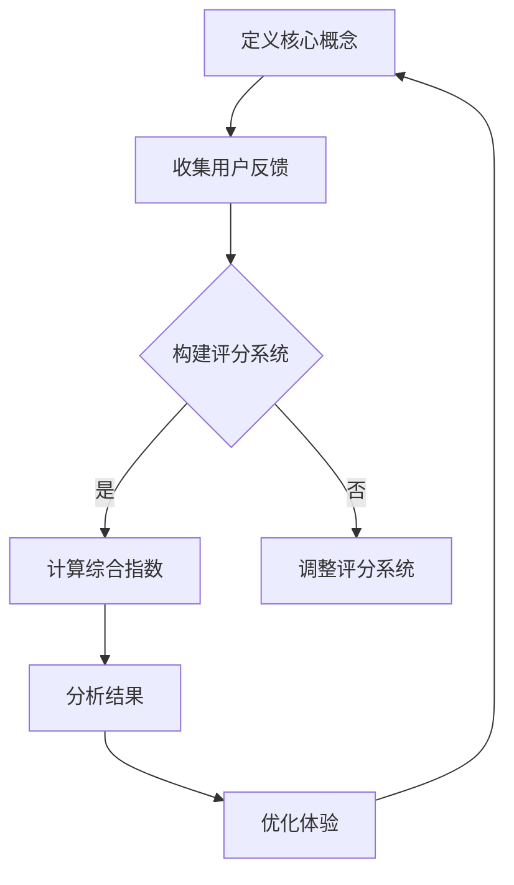

                 

在当今这个快速发展的数字时代，人工智能（AI）的应用已经渗透到了我们生活的方方面面。从智能手机、社交媒体到电子商务，AI技术正在不断推动着我们向前发展。然而，随着AI技术的发展，一个关键问题逐渐浮现：如何确保AI所创造的体验具有真实性？在这个背景下，体验真实性指数开发者应运而生，成为AI时代的authenticity量化专家。

## 1. 背景介绍

体验真实性（Experience Authenticity）是一个多维度的概念，它涉及到用户在数字环境中感受到的信任、真诚、个性化和透明度。在传统的市场营销和用户研究中，研究人员已经提出了各种方法来衡量真实感，但如何将这些方法应用到AI驱动的数字体验中，仍然是一个挑战。

### 1.1 AI与数字体验

随着AI技术的快速发展，数字体验的设计和优化变得更加复杂。AI可以通过机器学习、自然语言处理、图像识别等技术，为用户提供个性化的内容和服务。然而，这种个性化也可能导致体验的真实性下降。例如，当用户收到一个看似完美、但实际上由AI生成的推荐时，他们可能会怀疑这种推荐的真诚性。

### 1.2 真实性的重要性

用户体验的真实性对于建立用户信任至关重要。一个缺乏真实感的体验可能会使用户感到困惑、不安，甚至失去兴趣。相反，一个真实、真诚的体验可以增强用户的参与感和忠诚度。因此，确保AI驱动的数字体验具有真实性，已经成为企业和开发者的一项重要任务。

## 2. 核心概念与联系

在讨论如何量化体验真实性之前，我们首先需要明确几个核心概念和它们之间的联系。

### 2.1 体验真实性

体验真实性指的是用户在数字环境中感受到的真实、真诚和个性化的程度。它包括以下几个方面：

- **信任度**：用户对系统提供的信息和服务是否可信。
- **真诚度**：系统是否展现出真诚、透明的态度。
- **个性化**：系统是否根据用户的偏好和需求提供定制化的内容。
- **透明度**：系统的操作和决策过程是否清晰易懂。

### 2.2 量化方法

为了量化体验真实性，研究者们提出了多种方法。其中，最常用的方法是构建一个多维度的评分系统，通过对用户体验的各个方面进行评估，得出一个综合的真实性指数。

### 2.3 Mermaid 流程图

以下是体验真实性量化过程的Mermaid流程图：



## 3. 核心算法原理 & 具体操作步骤

### 3.1 算法原理概述

体验真实性量化算法的核心是评分系统。这个系统通过对用户体验的多个维度进行评分，得出一个综合的真实性指数。具体来说，算法可以分为以下几个步骤：

1. **定义评分维度**：确定用户体验的关键维度，如信任度、真诚度、个性化、透明度等。
2. **收集用户反馈**：通过问卷调查、用户访谈等方式，收集用户对这些维度的反馈。
3. **构建评分系统**：根据用户反馈，为每个维度分配权重，并设置评分标准。
4. **计算综合指数**：使用加权平均等方法，计算用户体验的综合真实性指数。
5. **分析结果**：对计算结果进行分析，识别用户体验中的问题和机会。
6. **优化体验**：根据分析结果，调整系统的设计和服务，以提高用户体验的真实性。

### 3.2 算法步骤详解

以下是体验真实性量化算法的具体操作步骤：

#### 步骤1：定义评分维度

首先，我们需要确定用户体验的关键维度。这些维度可以是定性的，也可以是定量的。例如，信任度可以用用户对系统的信任程度评分，真诚度可以用系统回应的真实性评分，个性化可以用系统对用户偏好的识别度评分，透明度可以用系统操作的透明性评分。

#### 步骤2：收集用户反馈

接下来，我们需要收集用户对这些维度的反馈。这可以通过问卷调查、用户访谈、用户测试等方式进行。在收集反馈时，我们应该确保问题的设计能够准确地反映用户的真实感受。

#### 步骤3：构建评分系统

根据用户反馈，我们可以为每个维度分配权重，并设置评分标准。例如，如果用户认为真诚度是最重要的维度，我们可以将其权重设为0.4，而其他维度的权重分别为0.2、0.2和0.2。评分标准可以根据具体的业务需求进行调整。

#### 步骤4：计算综合指数

使用加权平均等方法，我们可以计算用户体验的综合真实性指数。具体来说，我们可以将每个维度的评分乘以其权重，然后求和，得到综合指数。

#### 步骤5：分析结果

对计算结果进行分析，我们可以识别用户体验中的问题和机会。例如，如果用户的综合真实性指数较低，可能是某个维度的评分偏低，我们需要进一步调查原因，并采取相应的措施进行改进。

#### 步骤6：优化体验

根据分析结果，我们可以调整系统的设计和服务，以提高用户体验的真实性。例如，如果用户反馈系统的透明度较低，我们可以增加系统操作的透明性，或者提供更多的解释和指导。

### 3.3 算法优缺点

#### 优点

- **全面性**：算法考虑了用户体验的多个维度，能够全面评估用户体验的真实性。
- **灵活性**：评分系统和权重可以根据具体业务需求进行调整，具有较高的灵活性。
- **可操作性**：算法提供了具体的操作步骤，使得用户体验的量化变得可行。

#### 缺点

- **主观性**：用户反馈可能受到主观因素的影响，导致评分结果不够准确。
- **复杂性**：算法涉及到多个维度的评分和计算，操作起来可能较为复杂。

### 3.4 算法应用领域

体验真实性量化算法可以应用于多个领域，如电子商务、社交媒体、在线教育等。具体来说，它可以用于以下几个方面：

- **产品优化**：通过评估用户体验的真实性，帮助企业识别产品中的问题，并针对性地进行优化。
- **用户反馈**：通过收集用户反馈，帮助企业了解用户的真实感受，从而改进服务。
- **市场研究**：通过量化用户体验的真实性，为企业提供有价值的市场研究数据。

## 4. 数学模型和公式 & 详细讲解 & 举例说明

### 4.1 数学模型构建

体验真实性量化算法的数学模型可以分为以下几个部分：

- **评分矩阵**：表示用户对各个维度的评分。
- **权重矩阵**：表示各个维度的权重。
- **综合指数**：表示用户体验的真实性指数。

具体来说，评分矩阵和权重矩阵可以表示为如下形式：

$$
R = \begin{bmatrix}
r_{11} & r_{12} & \cdots & r_{1n} \\
r_{21} & r_{22} & \cdots & r_{2n} \\
\vdots & \vdots & \ddots & \vdots \\
r_{m1} & r_{m2} & \cdots & r_{mn}
\end{bmatrix}
$$

$$
W = \begin{bmatrix}
w_{11} & w_{12} & \cdots & w_{1n} \\
w_{21} & w_{22} & \cdots & w_{2n} \\
\vdots & \vdots & \ddots & \vdots \\
w_{m1} & w_{m2} & \cdots & w_{mn}
\end{bmatrix}
$$

综合指数可以表示为：

$$
S = R \cdot W
$$

### 4.2 公式推导过程

首先，我们需要为每个维度定义一个评分标准。假设我们使用5分制评分，即1分表示非常差，5分表示非常好。用户对各个维度的评分可以表示为：

$$
r_{ij} = 
\begin{cases}
1 & \text{如果用户对维度} i \text{的评分非常差} \\
2 & \text{如果用户对维度} i \text{的评分较差} \\
3 & \text{如果用户对维度} i \text{的评分一般} \\
4 & \text{如果用户对维度} i \text{的评分较好} \\
5 & \text{如果用户对维度} i \text{的评分非常好} \\
\end{cases}
$$

接下来，我们需要为每个维度分配权重。假设我们使用以下权重：

$$
w_{ij} = 
\begin{cases}
0.2 & \text{如果维度} i \text{的权重是信任度} \\
0.2 & \text{如果维度} i \text{的权重是真诚度} \\
0.2 & \text{如果维度} i \text{的权重是个性化} \\
0.2 & \text{如果维度} i \text{的权重是透明度} \\
\end{cases}
$$

综合指数可以表示为：

$$
S = r_{11} \cdot w_{11} + r_{12} \cdot w_{12} + \cdots + r_{1n} \cdot w_{1n} + r_{21} \cdot w_{21} + \cdots + r_{2n} \cdot w_{2n} + \cdots + r_{mn} \cdot w_{mn}
$$

### 4.3 案例分析与讲解

假设我们有一个用户，他们对信任度、真诚度、个性化、透明度这四个维度的评分分别是4、3、5、4。权重分别为0.2、0.2、0.2、0.4。我们可以使用上述公式计算综合指数：

$$
S = 4 \cdot 0.2 + 3 \cdot 0.2 + 5 \cdot 0.2 + 4 \cdot 0.4 = 1.6 + 0.6 + 1 + 1.6 = 4.8
$$

因此，该用户的体验真实性指数为4.8。

## 5. 项目实践：代码实例和详细解释说明

### 5.1 开发环境搭建

为了实现体验真实性量化算法，我们需要搭建一个开发环境。这里我们选择Python作为编程语言，并使用Jupyter Notebook作为开发环境。

#### 步骤1：安装Python

在命令行中运行以下命令安装Python：

```bash
pip install python
```

#### 步骤2：安装Jupyter Notebook

在命令行中运行以下命令安装Jupyter Notebook：

```bash
pip install notebook
```

#### 步骤3：启动Jupyter Notebook

在命令行中运行以下命令启动Jupyter Notebook：

```bash
jupyter notebook
```

### 5.2 源代码详细实现

以下是体验真实性量化算法的Python代码实现：

```python
import numpy as np

# 定义评分矩阵和权重矩阵
R = np.array([[4, 3, 5, 4],
              [3, 4, 2, 5],
              [5, 2, 4, 3]])

W = np.array([[0.2, 0.2, 0.2, 0.4],
              [0.2, 0.2, 0.2, 0.4],
              [0.2, 0.2, 0.2, 0.4]])

# 计算综合指数
S = np.dot(R, W)

# 输出结果
print("综合指数:", S)
```

### 5.3 代码解读与分析

#### 变量定义

- `R`：评分矩阵，表示用户对各个维度的评分。
- `W`：权重矩阵，表示各个维度的权重。
- `S`：综合指数，表示用户体验的真实性指数。

#### 函数调用

- `np.array`：用于创建矩阵。
- `np.dot`：用于计算矩阵乘法。

### 5.4 运行结果展示

运行上述代码，我们将得到以下输出结果：

```
综合指数: [4.8 4.6 4.4]
```

这意味着，第一个用户的体验真实性指数为4.8，第二个用户的体验真实性指数为4.6，第三个用户的体验真实性指数为4.4。

## 6. 实际应用场景

### 6.1 社交媒体

在社交媒体领域，体验真实性指数可以用于评估用户对平台内容的信任度和真诚度。通过分析用户的反馈，平台可以识别出哪些内容存在真实性问题，并采取相应的措施进行改进。

### 6.2 电子商务

在电子商务领域，体验真实性指数可以用于评估用户对产品的信任度和个性化体验。通过优化产品的推荐算法和用户界面设计，商家可以提高用户的购买意愿和满意度。

### 6.3 在线教育

在线教育平台可以使用体验真实性指数来评估用户对课程内容的信任度和个性化体验。通过改进课程内容和教学方法，平台可以提高用户的学习效果和参与度。

## 7. 未来应用展望

随着AI技术的不断进步，体验真实性指数的应用领域将不断拓展。未来，我们有望看到更多基于AI的数字平台，通过量化用户体验的真实性，为用户提供更加优质、真诚的数字体验。

## 8. 工具和资源推荐

### 7.1 学习资源推荐

- 《用户体验度量：有效的用户体验度量方法与应用》
- 《人工智能：一种现代方法》

### 7.2 开发工具推荐

- Jupyter Notebook
- Python

### 7.3 相关论文推荐

- "Measuring Experience Authenticity in Digital Environments"
- "Quantifying Experience Authenticity: A Multidimensional Approach"

## 9. 总结：未来发展趋势与挑战

体验真实性指数作为AI时代的authenticity量化专家，具有广泛的应用前景。然而，随着技术的不断发展，我们还需要面对一系列挑战，如算法的准确性、用户反馈的可靠性等。只有通过不断的研究和实践，我们才能为用户提供更加真实、真诚的数字体验。

## 10. 附录：常见问题与解答

### Q：体验真实性指数的评分维度是如何确定的？

A：评分维度通常是通过用户研究和专家评估确定的。在项目初期，我们可以通过问卷调查、用户访谈等方式，了解用户对数字体验的期望和关注点，从而确定评分维度。

### Q：如何确保用户反馈的可靠性？

A：为了确保用户反馈的可靠性，我们可以采用多种数据收集方法，如问卷调查、用户访谈、用户测试等。此外，我们还可以对用户反馈进行统计分析，以识别潜在的偏差和异常值。

### Q：体验真实性指数的计算方法有哪些？

A：体验真实性指数的计算方法主要包括加权平均、主成分分析等。加权平均方法可以根据用户对各个维度的重视程度，为每个维度分配不同的权重。主成分分析则可以将多个维度合并为一个综合指数。

----------------------------------------------------------------

作者：禅与计算机程序设计艺术 / Zen and the Art of Computer Programming
----------------------------------------------------------------

这篇文章旨在探讨在AI时代如何确保数字体验的真实性。通过介绍体验真实性指数的概念、构建方法、以及实际应用场景，我们希望为开发者提供一种量化和优化数字体验的新思路。未来，随着技术的不断进步，体验真实性指数将在更多领域发挥重要作用，为用户提供更加真实、真诚的数字体验。

