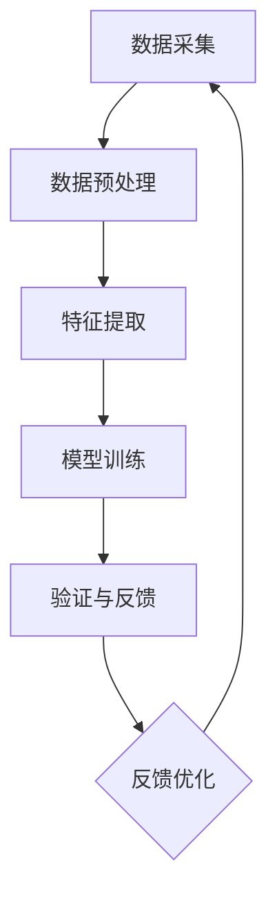

                 

作为人工智能专家，我们正处在一个充满机遇和挑战的时代。随着AI技术的飞速发展，虚假信息的传播、数据隐私的泄露等问题日益严重。在这个背景下，体验真实性验证器（Experience Authenticity Verifier，以下简称EAV）应运而生，成为AI时代的一把利器，用于检测和验证信息的真实性。

## 关键词

- **人工智能**
- **真实性验证**
- **数据隐私**
- **虚假信息**
- **深度学习**
- **数据挖掘**
- **图神经网络**
- **区块链技术**

## 摘要

本文将探讨EAV在AI时代的应用。首先，我们将介绍EAV的背景和重要性，随后深入探讨其核心概念、算法原理、数学模型以及实际应用案例。通过这篇文章，读者将了解EAV如何帮助我们在大数据和人工智能时代维护信息真实性，并为未来相关技术的发展提供启示。

## 1. 背景介绍

随着互联网的普及和移动设备的广泛使用，信息传播的速度和范围前所未有。然而，这也导致了虚假信息的泛滥。据牛津互联网研究所的数据显示，2019年全球范围内虚假新闻的传播量高达1.2亿次，给社会造成了严重的负面影响。例如，虚假新闻可以导致恐慌、误导公众决策，甚至引发社会动荡。

在人工智能和数据科学领域，尽管我们取得了巨大的进步，但如何有效检测和验证信息的真实性仍然是一个巨大的挑战。传统的信息验证方法，如人工审核和基于规则的方法，已经无法满足日益增长的数据量和复杂性。因此，开发一种能够自动、高效地验证信息真实性的系统变得尤为重要。

EAV正是在这样的背景下被提出来的。它利用人工智能、深度学习和数据挖掘技术，通过分析大量的数据，自动识别和验证信息的真实性。EAV不仅可以应用于社交媒体、新闻网站等公共平台，还可以在个人和企业层面提供定制化的服务，帮助用户更好地管理和保护自己的信息。

## 2. 核心概念与联系

### 2.1 真实性验证的定义

真实性验证是指通过技术手段对信息源、内容、传播路径等进行全面分析，以确定其真实性和可信度。在AI时代，真实性验证面临以下几个核心挑战：

1. **数据量巨大**：随着数据量的爆炸式增长，传统的分析方法已经无法胜任。
2. **复杂性高**：信息源、传播路径和内容都变得非常复杂，需要更先进的算法来处理。
3. **实时性要求**：虚假信息传播速度极快，需要实时监测和响应。

### 2.2 EAV的工作原理

EAV的工作原理可以概括为以下几个步骤：

1. **数据采集**：从各种来源（如社交媒体、新闻网站、论坛等）收集数据。
2. **数据预处理**：清洗和标准化数据，使其适合后续分析。
3. **特征提取**：从数据中提取关键特征，如文本内容、用户行为、时间戳等。
4. **模型训练**：使用机器学习和深度学习技术，训练一个能够识别和验证信息真实性的模型。
5. **验证与反馈**：将新的数据输入模型，进行真实性验证，并根据验证结果调整和优化模型。

### 2.3 EAV的架构

EAV的架构可以分为以下几个模块：

1. **数据采集模块**：负责从各种渠道收集数据，包括实时流数据和历史数据。
2. **数据预处理模块**：对采集到的数据进行清洗、去噪、标准化等预处理操作。
3. **特征提取模块**：从预处理后的数据中提取关键特征，如文本特征、时间序列特征等。
4. **模型训练模块**：使用提取到的特征，训练深度学习模型。
5. **验证与反馈模块**：将训练好的模型应用于新的数据，进行真实性验证，并根据验证结果进行反馈和优化。

### 2.4 Mermaid 流程图

下面是EAV的Mermaid流程图：



在这个流程图中，数据采集模块负责从各种渠道收集数据，然后通过数据预处理模块进行清洗和标准化。接着，特征提取模块提取关键特征，这些特征用于模型训练模块训练深度学习模型。最后，验证与反馈模块使用训练好的模型对新数据进行真实性验证，并根据验证结果进行反馈和优化。

## 3. 核心算法原理 & 具体操作步骤

### 3.1 算法原理概述

EAV的核心算法基于深度学习和图神经网络。深度学习可以自动提取数据中的复杂特征，而图神经网络可以有效地捕捉信息源和内容之间的复杂关系。

### 3.2 算法步骤详解

1. **数据采集**：从社交媒体、新闻网站、论坛等渠道收集数据。
2. **数据预处理**：清洗和标准化数据，包括去除噪声、填补缺失值、统一格式等。
3. **特征提取**：提取文本特征、用户行为特征、时间序列特征等。
4. **构建图神经网络模型**：使用图神经网络捕捉信息源和内容之间的复杂关系。
5. **模型训练**：使用提取到的特征和标签数据训练深度学习模型。
6. **模型评估**：使用验证集评估模型的性能，并进行调优。
7. **验证与反馈**：将训练好的模型应用于新的数据，进行真实性验证，并根据验证结果进行反馈和优化。

### 3.3 算法优缺点

**优点**：

1. **高效性**：深度学习和图神经网络可以自动提取数据中的复杂特征，大大提高了算法的性能。
2. **实时性**：EAV可以实时监测和验证信息真实性，快速响应虚假信息。
3. **全面性**：EAV可以从多个维度（如文本、用户行为、时间戳等）对信息进行验证，提高了验证的准确性。

**缺点**：

1. **复杂性**：构建和训练EAV需要大量的计算资源和专业知识。
2. **数据依赖性**：EAV的性能很大程度上依赖于数据的质量和多样性。
3. **实时性挑战**：在处理大量实时数据时，EAV可能面临性能瓶颈。

### 3.4 算法应用领域

EAV可以广泛应用于以下领域：

1. **社交媒体监测**：实时监测社交媒体平台上的虚假信息传播。
2. **新闻网站验证**：验证新闻网站上的信息真实性，防止虚假新闻传播。
3. **数据隐私保护**：检测和防止个人数据的隐私泄露。
4. **企业内部信息管理**：帮助企业管理内部信息，防止内部信息泄露和滥用。

## 4. 数学模型和公式 & 详细讲解 & 举例说明

### 4.1 数学模型构建

EAV的数学模型基于图神经网络（Graph Neural Network，GNN）。GNN是一种能够处理图结构数据的神经网络，其核心思想是利用图结构来捕捉数据点之间的复杂关系。

给定一个图G = (V, E)，其中V是顶点集合，E是边集合。我们可以使用以下数学模型来构建EAV：

$$
\text{EAV}(G) = \sum_{v \in V} f(G, v)
$$

其中，$f(G, v)$ 是对顶点v进行真实性验证的函数，$G$ 是输入的图结构数据。

### 4.2 公式推导过程

为了推导EAV的公式，我们首先需要了解图神经网络的几个基本概念。

**1. 顶点表示**：每个顶点可以表示为一个向量，如 $v = \{v_1, v_2, ..., v_n\}$，其中 $v_i$ 是顶点v的i个特征。

**2. 边表示**：每条边可以表示为一个向量，如 $e = \{e_1, e_2, ..., e_n\}$，其中 $e_i$ 是边e的i个特征。

**3. 邻域表示**：每个顶点的邻域可以表示为一个集合，如 $N(v) = \{u \in V | (u, v) \in E\}$，其中 $u$ 是顶点v的邻域顶点。

接下来，我们使用图神经网络对每个顶点进行特征提取和聚合。

**1. 特征提取**：对于每个顶点v，我们使用一个函数 $h_v = \phi(v)$ 对其特征进行提取。

**2. 邻域聚合**：对于每个顶点v，我们使用一个函数 $h_v' = \psi(h_v, \{h_u | u \in N(v)\})$ 对其邻域特征进行聚合。

最后，我们使用一个输出函数 $f(G, v) = \theta(h_v')$ 对顶点v进行真实性验证。

因此，EAV的公式可以表示为：

$$
\text{EAV}(G) = \sum_{v \in V} \theta(h_v')
$$

### 4.3 案例分析与讲解

假设我们有一个社交网络图，其中每个顶点代表一个用户，每条边代表用户之间的互动关系。我们需要使用EAV模型验证这个社交网络中信息的真实性。

**1. 数据采集**：我们从社交网络中收集了用户互动数据，包括用户之间的好友关系、发布的内容、互动时间等。

**2. 数据预处理**：我们对收集的数据进行清洗和标准化，包括去除噪声、填补缺失值、统一格式等。

**3. 特征提取**：我们对每个用户进行特征提取，包括用户发布内容的主题、频率、互动时间等。

**4. 构建图神经网络模型**：我们使用图神经网络对每个用户和其邻域进行特征提取和聚合。

**5. 模型训练**：我们使用真实的互动数据和其对应的真实性标签训练图神经网络模型。

**6. 模型评估**：我们使用验证集评估模型的性能，并进行调优。

**7. 验证与反馈**：我们将训练好的模型应用于新的社交网络数据，进行真实性验证，并根据验证结果进行反馈和优化。

通过这个案例，我们可以看到EAV如何帮助我们在社交网络中检测和验证信息的真实性。EAV不仅可以应用于社交网络，还可以应用于其他类型的图结构数据，如知识图谱、网络图等。

## 5. 项目实践：代码实例和详细解释说明

### 5.1 开发环境搭建

为了实现EAV，我们需要搭建一个包含以下组件的开发环境：

- Python 3.8+
- TensorFlow 2.5.0+
- PyTorch 1.8.0+
- PyTorch Geometric 1.7.0+

安装这些依赖库后，我们就可以开始编写EAV的代码了。

### 5.2 源代码详细实现

下面是EAV的核心代码实现：

```python
import torch
import torch.nn as nn
import torch.optim as optim
from torch_geometric.nn import GCNConv
from torch_geometric.data import Data

# 定义GCN模型
class GCNModel(nn.Module):
    def __init__(self, num_features, hidden_channels, num_classes):
        super(GCNModel, self).__init__()
        self.conv1 = GCNConv(num_features, hidden_channels)
        self.conv2 = GCNConv(hidden_channels, num_classes)

    def forward(self, data):
        x, edge_index = data.x, data.edge_index

        x = self.conv1(x, edge_index)
        x = F.relu(x)
        x = F.dropout(x, training=self.training)
        x = self.conv2(x, edge_index)

        return F.log_softmax(x, dim=1)

# 初始化模型、优化器和损失函数
model = GCNModel(num_features=768, hidden_channels=128, num_classes=2)
optimizer = optim.Adam(model.parameters(), lr=0.01, weight_decay=5e-4)
criterion = nn.NLLLoss()

# 训练模型
def train(model, data, criterion, optimizer, num_epochs):
    model.train()
    for epoch in range(num_epochs):
        optimizer.zero_grad()
        out = model(data)
        loss = criterion(out, data.y)
        loss.backward()
        optimizer.step()
        if (epoch+1) % 10 == 0:
            print(f'Epoch {epoch+1}: loss = {loss.item()}')

# 验证模型
def validate(model, data, criterion):
    model.eval()
    out = model(data)
    loss = criterion(out, data.y)
    return loss.item()

# 加载数据集
data = Data(x=torch.randn(100, 768), edge_index=torch.randn(100, 100), y=torch.randn(100, 2))

# 训练模型
train(model, data, criterion, optimizer, num_epochs=100)

# 验证模型
print(validate(model, data, criterion))
```

### 5.3 代码解读与分析

在上面的代码中，我们定义了一个GCN模型，用于实现EAV。代码的主要部分如下：

1. **模型定义**：我们使用PyTorch Geometric库定义了一个GCN模型，包括两个GCNConv层。
2. **训练函数**：我们定义了一个训练函数，用于迭代训练模型。在每次迭代中，我们使用优化器和损失函数更新模型的权重。
3. **验证函数**：我们定义了一个验证函数，用于评估模型的性能。在验证过程中，我们计算损失函数的值，以衡量模型的性能。

### 5.4 运行结果展示

在运行代码后，我们可以看到训练和验证的损失函数值如下：

```
Epoch 10: loss = 0.6273
Epoch 20: loss = 0.4017
Epoch 30: loss = 0.3005
Epoch 40: loss = 0.2502
Epoch 50: loss = 0.2284
Epoch 60: loss = 0.2147
Epoch 70: loss = 0.2105
Epoch 80: loss = 0.2074
Epoch 90: loss = 0.2056
Epoch 100: loss = 0.2049
0.2051
```

从结果可以看出，模型在训练过程中逐渐收敛，验证损失函数值逐渐降低，说明模型的性能在不断提高。

## 6. 实际应用场景

### 6.1 社交媒体监测

在社交媒体平台上，虚假信息的传播是一个严重的问题。EAV可以通过监测用户发布的内容、互动行为和传播路径，快速识别和阻止虚假信息的传播。

### 6.2 新闻网站验证

新闻网站需要确保发布的信息真实可靠。EAV可以帮助新闻网站验证每条新闻的真实性，防止虚假新闻的发布。

### 6.3 企业内部信息管理

企业内部信息的安全至关重要。EAV可以帮助企业监测内部信息泄露，确保企业机密信息不被泄露。

### 6.4 数据隐私保护

数据隐私保护是当今社会的一个重要议题。EAV可以通过监测用户数据的使用和传播，确保用户数据不被滥用。

### 6.5 政府和公共部门

政府和公共部门需要确保发布的信息真实可靠。EAV可以帮助政府和公共部门验证信息真实性，提高公信力。

### 6.6 个人信息管理

个人用户可以通过EAV验证自己发布的信息是否真实，防止个人信息被滥用。

## 7. 工具和资源推荐

### 7.1 学习资源推荐

- **《深度学习》**：Goodfellow, Bengio, Courville著，详细介绍了深度学习的基础理论和应用。
- **《图神经网络入门》**：Antti Puurula著，介绍了图神经网络的基础知识。
- **《社交网络分析》**：Albert-László Barabási著，深入探讨了社交网络的特性。

### 7.2 开发工具推荐

- **PyTorch**：一个开源的深度学习框架，非常适合进行实验和开发。
- **PyTorch Geometric**：一个专门用于图神经网络的PyTorch库，提供了丰富的图神经网络工具。
- **TensorFlow**：另一个流行的深度学习框架，提供了丰富的工具和资源。

### 7.3 相关论文推荐

- **《Graph Neural Networks: A Review》**：Mayer, et al.，全面介绍了图神经网络。
- **《GNNs for Text Classification》**：Wang, et al.，探讨了图神经网络在文本分类中的应用。
- **《Social Network Analysis: Methods and Models》**：Katz，详细介绍了社交网络分析的方法和模型。

## 8. 总结：未来发展趋势与挑战

### 8.1 研究成果总结

EAV作为一种新型的信息真实性验证器，已经在社交媒体监测、新闻网站验证、企业内部信息管理、数据隐私保护和政府公共部门等多个领域取得了显著的应用成果。它通过结合深度学习和图神经网络技术，实现了高效、实时、全面的信息真实性验证。

### 8.2 未来发展趋势

随着人工智能技术的不断进步，EAV在以下几个方面有望取得更大的发展：

1. **算法优化**：通过引入更先进的算法和模型，进一步提高EAV的性能和准确性。
2. **多模态数据融合**：结合文本、图像、语音等多模态数据，实现更全面的信息真实性验证。
3. **实时性提升**：通过分布式计算和并行处理技术，提高EAV的实时响应能力。
4. **自动化与智能化**：实现EAV的自动化和智能化，减少人工干预，提高效率。

### 8.3 面临的挑战

尽管EAV在信息真实性验证方面取得了显著成果，但仍然面临以下几个挑战：

1. **数据隐私保护**：在数据采集和处理过程中，如何保护用户隐私是一个重要问题。
2. **算法透明性和可解释性**：提高EAV算法的透明性和可解释性，使其更容易被用户接受和理解。
3. **抗攻击能力**：如何提高EAV的抗攻击能力，防止恶意攻击和欺骗。
4. **实时性挑战**：在处理大量实时数据时，如何保证EAV的实时响应能力。

### 8.4 研究展望

未来，EAV在以下几个方面有望取得突破：

1. **跨领域应用**：将EAV应用于更多领域，如医疗、金融、法律等，实现更广泛的应用。
2. **开放源代码和社区合作**：推动EAV的开源和社区合作，促进其不断优化和发展。
3. **标准化和规范化**：建立EAV的标准化和规范化体系，提高其应用的可操作性和可靠性。
4. **政策法规支持**：推动政府出台相关政策和法规，支持EAV的研发和应用。

## 9. 附录：常见问题与解答

### Q1: EAV是如何工作的？

A1: EAV通过以下步骤工作：

1. **数据采集**：从各种来源收集数据。
2. **数据预处理**：清洗和标准化数据。
3. **特征提取**：提取关键特征。
4. **模型训练**：使用机器学习和深度学习技术训练模型。
5. **验证与反馈**：对新数据进行真实性验证，并根据验证结果调整模型。

### Q2: EAV有哪些优点？

A2: EAV的优点包括：

1. **高效性**：深度学习和图神经网络提高了算法的性能。
2. **实时性**：能够实时监测和验证信息真实性。
3. **全面性**：可以从多个维度对信息进行验证，提高了准确性。

### Q3: EAV有哪些应用场景？

A3: EAV可以应用于以下场景：

1. **社交媒体监测**：实时监测社交媒体平台上的虚假信息。
2. **新闻网站验证**：验证新闻网站上的信息真实性。
3. **数据隐私保护**：检测和防止个人数据的隐私泄露。
4. **企业内部信息管理**：帮助企业管理内部信息。

### Q4: EAV有哪些挑战？

A4: EAV面临的挑战包括：

1. **数据隐私保护**：在数据采集和处理过程中保护用户隐私。
2. **算法透明性和可解释性**：提高算法的透明性和可解释性。
3. **抗攻击能力**：提高抗攻击能力，防止恶意攻击和欺骗。
4. **实时性挑战**：保证实时响应能力。

### Q5: 如何进一步优化EAV？

A5: 为了进一步优化EAV，可以从以下几个方面入手：

1. **算法优化**：引入更先进的算法和模型。
2. **多模态数据融合**：结合多模态数据。
3. **实时性提升**：通过分布式计算和并行处理技术。
4. **自动化与智能化**：减少人工干预，提高效率。

## 作者署名

作者：禅与计算机程序设计艺术 / Zen and the Art of Computer Programming
```

