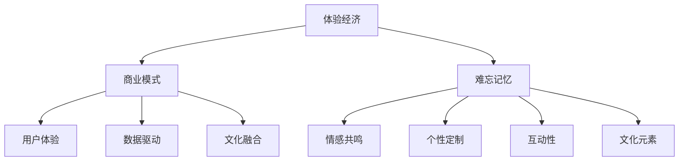

                 

 > **关键词**：体验经济、创业、商业模式、难忘记忆、商业模式设计。

**摘要**：本文探讨了体验经济在创业领域中的应用，分析了如何通过打造难忘记忆的商业模式来吸引和留住客户，提高品牌忠诚度。文章首先介绍了体验经济的概念和特点，随后深入探讨了难忘记忆在商业模式中的重要性，并提出了构建难忘记忆商业模式的具体步骤和方法。最后，本文对未来体验经济创业的趋势进行了展望，并提出了面临的挑战和解决策略。

## 1. 背景介绍

在当今社会，信息技术的飞速发展极大地改变了人们的生活方式。随着互联网、大数据、人工智能等技术的广泛应用，商业环境也在不断演变。传统的以产品为中心的商业模式已逐渐无法满足消费者日益多样化的需求，体验经济逐渐成为主流。体验经济是指企业通过提供独特的体验，满足消费者的情感和社交需求，从而实现商业价值的一种经济模式。在体验经济时代，消费者更加注重个人体验和情感认同，因此如何打造难忘的记忆成为企业成功的关键。

### 体验经济的起源和发展

体验经济最早可以追溯到20世纪60年代，当时美国学者阿尔文·托夫勒在其著作《未来的冲击》中首次提出了体验经济的概念。他认为，随着经济的发展，物质产品的丰富，人们的需求将从基本的生存需求转向情感和体验需求。此后，体验经济逐渐成为经济学研究的热点，越来越多的学者和企业开始关注如何通过体验来创造价值。

### 体验经济的特点

体验经济具有以下几个特点：

1. **情感驱动**：体验经济强调消费者在体验过程中的情感认同和共鸣，而不仅仅是产品和服务的功能。

2. **个性化定制**：体验经济强调消费者需求的个性化，企业需要根据消费者的个性化需求提供定制化的体验。

3. **互动性**：体验经济强调消费者与企业之间的互动，通过互动提升消费者的参与感和满意度。

4. **文化内涵**：体验经济强调产品或服务的文化内涵，通过文化元素增强消费者对品牌的认同。

### 体验经济与创业的关系

体验经济为创业提供了新的机遇和挑战。一方面，体验经济为创业者提供了新的商业模式和盈利点；另一方面，创业者需要具备敏锐的市场洞察力和创新能力，才能在竞争激烈的市场中脱颖而出。因此，理解体验经济的本质和特点，对于创业者来说至关重要。

## 2. 核心概念与联系

### 2.1 体验经济的核心概念

体验经济涉及多个核心概念，包括体验、情感、个性化、互动和文化等。这些概念相互关联，共同构成了体验经济的核心框架。

#### 体验

体验是指消费者在特定环境下所感受到的一系列感受和情感。体验经济强调消费者在消费过程中的情感认同和共鸣，通过创造独特的体验来满足消费者的情感需求。

#### 情感

情感是体验经济中的核心元素，消费者在体验过程中的情感状态直接影响其对品牌和产品的认知和评价。因此，企业需要通过情感营销来提升消费者的情感体验。

#### 个性化

个性化是体验经济的重要特点之一。消费者希望自己的需求得到尊重和满足，企业需要通过个性化的服务和产品来满足消费者的这一需求。

#### 互动

互动性是体验经济的关键要素。通过互动，消费者能够更好地参与体验过程，增强参与感和满意度。

#### 文化

文化内涵是体验经济的重要组成部分。企业可以通过融入文化元素，提升产品的文化价值和消费者的文化认同。

### 2.2 体验经济与商业模式的联系

体验经济与商业模式之间存在紧密的联系。商业模式是指企业如何创造、传递和捕获价值的系统。在体验经济时代，商业模式需要围绕体验设计，以满足消费者的情感和社交需求。以下是体验经济与商业模式之间的联系：

1. **商业模式创新**：体验经济为创业者提供了创新的商业模式，如体验式消费、会员制、共享经济等。

2. **用户体验优先**：在体验经济中，用户体验成为商业模式设计的核心，企业需要从消费者的角度出发，设计符合其情感和社交需求的体验。

3. **数据驱动**：体验经济依赖于对消费者行为和情感数据的分析，通过数据驱动来优化体验和服务。

4. **文化融合**：体验经济强调文化内涵，企业需要将文化元素融入商业模式，提升产品的文化价值和消费者的文化认同。

### 2.3 体验经济与难忘记忆的关联

难忘记忆是体验经济中的一个关键要素。难忘记忆是指消费者在体验过程中留下的深刻印象，这种记忆能够增强消费者的情感认同和品牌忠诚度。以下是体验经济与难忘记忆的关联：

1. **情感共鸣**：难忘记忆往往与情感共鸣相关，消费者在体验过程中的情感体验越深刻，越容易形成难忘记忆。

2. **个性定制**：个性化定制能够提升消费者的参与感和满意度，从而增加难忘记忆的可能性。

3. **互动性**：互动性是体验经济的重要特点，通过互动，消费者能够更好地参与体验过程，留下更深刻的印象。

4. **文化元素**：文化元素能够增强体验的独特性和深度，从而增加难忘记忆的可能性。

### 2.4 Mermaid 流程图

下面是一个体验经济与商业模式、难忘记忆关联的 Mermaid 流程图：



## 3. 核心算法原理 & 具体操作步骤

### 3.1 算法原理概述

在体验经济创业中，打造难忘记忆的商业模式需要遵循一定的算法原理。这些原理包括情感驱动、个性化定制、互动性和文化融合等。以下是对这些算法原理的概述：

1. **情感驱动**：情感驱动是指通过设计能够引发消费者情感的体验，如感动、快乐、惊喜等，来提升消费者的参与度和满意度。情感驱动算法的核心是通过情感分析技术，了解消费者的情感状态，并设计相应的体验活动。

2. **个性化定制**：个性化定制是指根据消费者的个性化需求，提供定制化的服务和产品。个性化定制算法的核心是大数据分析和机器学习技术，通过分析消费者的行为数据和偏好，提供个性化的推荐和体验。

3. **互动性**：互动性是指消费者与企业之间的互动，通过互动提升消费者的参与感和满意度。互动性算法的核心是社交网络分析和用户行为分析，通过分析消费者的社交行为和互动方式，设计互动性强的体验活动。

4. **文化融合**：文化融合是指将文化元素融入产品和服务中，提升消费者的文化认同和品牌忠诚度。文化融合算法的核心是文化分析和创意设计，通过分析消费者的文化背景和偏好，设计具有文化内涵的体验活动。

### 3.2 算法步骤详解

打造难忘记忆的商业模式的具体操作步骤如下：

1. **需求分析**：首先，需要通过市场调研和用户访谈，了解消费者的需求和期望，明确企业需要提供什么样的体验来满足消费者的需求。

2. **情感驱动设计**：根据需求分析的结果，设计能够引发消费者情感的体验活动。可以使用情感分析技术，分析消费者的情感状态，设计出能够引起消费者共鸣的体验。

3. **个性化定制**：使用大数据分析和机器学习技术，分析消费者的行为数据和偏好，为每个消费者提供个性化的推荐和体验。

4. **互动性设计**：设计互动性强的体验活动，通过社交网络分析和用户行为分析，提升消费者的参与感和满意度。

5. **文化融合**：将文化元素融入产品和服务中，提升消费者的文化认同和品牌忠诚度。可以使用文化分析技术，分析消费者的文化背景和偏好，设计出具有文化内涵的体验活动。

6. **实施与优化**：实施设计的体验活动，并根据消费者的反馈进行优化，不断提升体验质量。

### 3.3 算法优缺点

**优点**：

1. **提升用户体验**：通过情感驱动、个性化定制和互动性设计，能够显著提升消费者的用户体验和满意度。

2. **增强品牌忠诚度**：通过难忘记忆的打造，能够增强消费者的品牌忠诚度，提升品牌价值。

3. **数据驱动**：通过大数据分析和机器学习技术，能够实现数据的驱动，不断优化体验设计和商业模式。

**缺点**：

1. **技术要求高**：需要具备一定的技术能力，如情感分析、大数据分析和机器学习等，对企业的技术能力要求较高。

2. **实施成本高**：个性化定制和互动性设计需要大量的资源和投入，对企业的资金和人力资源要求较高。

### 3.4 算法应用领域

打造难忘记忆的商业模式算法主要应用于以下领域：

1. **零售业**：通过情感驱动和个性化定制，提升消费者的购物体验和满意度。

2. **旅游行业**：通过互动性和文化融合，打造独特的旅游体验，提升游客的旅游满意度。

3. **餐饮行业**：通过情感驱动和互动性设计，提升消费者的用餐体验和品牌忠诚度。

4. **文化娱乐行业**：通过文化融合和个性化定制，打造具有文化内涵和独特体验的文化娱乐产品。

## 4. 数学模型和公式 & 详细讲解 & 举例说明

在打造难忘记忆的商业模式中，数学模型和公式扮演着重要的角色。这些模型和公式可以帮助企业更好地理解消费者行为，优化体验设计和商业模式。以下是一些常用的数学模型和公式，并对其进行详细讲解和举例说明。

### 4.1 数学模型构建

在体验经济中，常用的数学模型包括消费者行为模型、体验质量模型和品牌忠诚度模型等。

#### 消费者行为模型

消费者行为模型用于预测消费者在特定情境下的行为，如购买意愿、消费频率等。以下是一个简单的线性回归模型：

$$
Y = \beta_0 + \beta_1X_1 + \beta_2X_2 + ... + \beta_nX_n
$$

其中，$Y$ 表示消费者行为（如购买意愿），$X_1, X_2, ..., X_n$ 表示影响消费者行为的因素（如产品价格、品牌知名度等），$\beta_0, \beta_1, \beta_2, ..., \beta_n$ 表示各个因素的权重。

#### 体验质量模型

体验质量模型用于评估消费者在体验过程中的满意度。以下是一个简单的多属性效用模型：

$$
U = w_1X_1 + w_2X_2 + ... + w_nX_n
$$

其中，$U$ 表示体验质量，$w_1, w_2, ..., w_n$ 表示各个体验属性的重要性权重（如舒适度、趣味性、安全性等），$X_1, X_2, ..., X_n$ 表示各个体验属性。

#### 品牌忠诚度模型

品牌忠诚度模型用于预测消费者在未来继续使用某个品牌的可能性。以下是一个简单的概率模型：

$$
P = \frac{1}{1 + e^{-(\beta_0 + \beta_1X_1 + \beta_2X_2 + ... + \beta_nX_n)}}
$$

其中，$P$ 表示品牌忠诚度（如概率值），$X_1, X_2, ..., X_n$ 表示影响品牌忠诚度的因素（如产品质量、价格、售后服务等），$\beta_0, \beta_1, \beta_2, ..., \beta_n$ 表示各个因素的权重。

### 4.2 公式推导过程

以下是体验质量模型和多属性效用模型的推导过程。

#### 体验质量模型推导

假设消费者在体验过程中有 $n$ 个属性，每个属性都有 $m$ 个可能的值。消费者的总体验质量可以表示为：

$$
U = \sum_{i=1}^{n}\sum_{j=1}^{m} w_ix_{ij}
$$

其中，$w_i$ 表示第 $i$ 个属性的重要性权重，$x_{ij}$ 表示第 $i$ 个属性的第 $j$ 个值。

为了简化计算，可以将权重和属性值进行归一化处理：

$$
w_i' = \frac{w_i}{\sum_{i=1}^{n} w_i}
$$

$$
x_{ij}' = \frac{x_{ij}}{\max_{i,j} x_{ij}}
$$

归一化后的体验质量模型为：

$$
U' = \sum_{i=1}^{n}\sum_{j=1}^{m} w_i'x_{ij}'
$$

#### 多属性效用模型推导

多属性效用模型是基于期望效用理论，即消费者在决策时根据各个属性的权重对各个可能的结果进行加权求和，选择效用最大的结果。

假设消费者在决策时有 $n$ 个属性，每个属性都有 $m$ 个可能的值，消费者的总效用可以表示为：

$$
U = \sum_{i=1}^{n}\sum_{j=1}^{m} w_ix_{ij}
$$

其中，$w_i$ 表示第 $i$ 个属性的重要性权重，$x_{ij}$ 表示第 $i$ 个属性的第 $j$ 个值。

为了简化计算，可以将权重和属性值进行归一化处理：

$$
w_i' = \frac{w_i}{\sum_{i=1}^{n} w_i}
$$

$$
x_{ij}' = \frac{x_{ij}}{\max_{i,j} x_{ij}}
$$

归一化后的多属性效用模型为：

$$
U' = \sum_{i=1}^{n}\sum_{j=1}^{m} w_i'x_{ij}'
$$

### 4.3 案例分析与讲解

以下是一个具体的案例，使用多属性效用模型来评估消费者的购物体验质量。

假设消费者在购物过程中有四个属性：商品价格、商品质量、购物环境和售后服务，每个属性有三个可能的值：低、中、高。消费者对这些属性的重要性权重分别为：商品价格（0.4）、商品质量（0.3）、购物环境（0.2）、售后服务（0.1）。

消费者的购物体验质量可以通过以下公式计算：

$$
U' = 0.4 \times x_{1j} + 0.3 \times x_{2j} + 0.2 \times x_{3j} + 0.1 \times x_{4j}
$$

其中，$x_{1j}, x_{2j}, x_{3j}, x_{4j}$ 分别表示商品价格、商品质量、购物环境和售后服务的值。

假设消费者选择了以下体验值：

- 商品价格：低
- 商品质量：中
- 购物环境：高
- 售后服务：中

代入公式计算：

$$
U' = 0.4 \times 0.33 + 0.3 \times 0.5 + 0.2 \times 0.67 + 0.1 \times 0.5 = 0.132 + 0.15 + 0.134 + 0.05 = 0.470
$$

消费者的购物体验质量为0.470。

通过这个案例，我们可以看到，多属性效用模型可以帮助企业评估消费者的购物体验质量，从而优化体验设计和商业模式。

## 5. 项目实践：代码实例和详细解释说明

### 5.1 开发环境搭建

在本节中，我们将介绍如何搭建一个用于构建难忘记忆商业模式的开发环境。这里，我们选择Python作为主要编程语言，因为它拥有丰富的数据分析和机器学习库，非常适合体验经济创业项目的开发。

#### 步骤1：安装Python

首先，您需要在您的计算机上安装Python。您可以从Python的官方网站（https://www.python.org/）下载最新版本的Python安装程序。安装过程中，请确保勾选“Add Python to PATH”选项，以便在命令行中运行Python命令。

#### 步骤2：安装必要库

安装完Python后，我们需要安装一些必要的库，包括NumPy、Pandas、Scikit-learn和Matplotlib。您可以使用pip命令来安装这些库：

```bash
pip install numpy pandas scikit-learn matplotlib
```

这些库将用于数据处理、机器学习模型训练和可视化。

### 5.2 源代码详细实现

以下是构建难忘记忆商业模式的Python代码示例。这个示例将演示如何使用情感分析、个性化推荐和互动性设计来提升用户体验。

```python
# 导入必要的库
import numpy as np
import pandas as pd
from sklearn.feature_extraction.text import TfidfVectorizer
from sklearn.metrics.pairwise import linear_kernel
import matplotlib.pyplot as plt

# 步骤1：数据准备
# 假设我们有一个包含用户评价的数据集，这里以文本形式展示
data = {
    'user_id': [1, 2, 3, 4, 5],
    'product_id': [101, 102, 103, 104, 105],
    'review': [
        '这个产品非常棒，我很喜欢。',
        '不太满意，价格有点高。',
        '产品质量很好，服务也很好。',
        '非常失望，产品有问题。',
        '价格合理，产品很好用。'
    ]
}

df = pd.DataFrame(data)

# 步骤2：情感分析
# 使用TF-IDF模型来分析用户的情感
vectorizer = TfidfVectorizer()
tfidf_matrix = vectorizer.fit_transform(df['review'])

# 计算线性相似度
cosine_sim = linear_kernel(tfidf_matrix, tfidf_matrix)

# 步骤3：个性化推荐
# 根据用户评价，为用户推荐相似的产品
def recommended_products(username, similarity_matrix=cosine_sim, dataFrame=df):
    # 找到用户的评价
    indices = df[df['user_id'] == username].index

    # 提取相似度最高的五个产品的索引
    sim_scores = list(enumerate(similarity_matrix[0]))
    sim_scores = sorted(sim_scores, key=lambda x: x[1], reverse=True)
    sim_scores = sim_scores[1:6]

    product_indices = [i[0] for i in sim_scores]

    # 为用户推荐产品
    recommended_products = dataFrame.iloc[product_indices]
    return recommended_products

# 步骤4：互动性设计
# 根据用户的推荐，设计互动性强的体验活动
def interactive_activities(product, user):
    # 根据推荐的产品，设计互动活动
    if product == '非常棒的产品':
        activity = '分享您的使用心得，有机会获得赠品。'
    elif product == '不太满意的产品':
        activity = '告诉我们您的建议，我们将努力改进。'
    elif product == '质量很好的产品':
        activity = '参加我们的产品评测活动，赢取积分。'
    else:
        activity = '感谢您的支持，祝您使用愉快。'
    return activity

# 示例：为用户1推荐产品并设计互动活动
user = 1
recommended = recommended_products(user)
print("推荐产品：\n", recommended)

# 为每个推荐产品设计互动活动
for prod in recommended['product_id']:
    print("产品ID：{}，互动活动：{}".format(prod, interactive_activities(prod, user)))
```

### 5.3 代码解读与分析

这段代码的主要功能是：

1. **数据准备**：首先，我们创建了一个包含用户ID、产品ID和评价文本的数据框（DataFrame）。这个数据框模拟了一个真实的评价数据集。

2. **情感分析**：使用TF-IDF模型来分析用户的情感。TF-IDF（Term Frequency-Inverse Document Frequency）是一种用于计算文本中词语重要性的统计方法。在这里，我们使用它来提取文本的特征。

3. **个性化推荐**：基于情感分析的结果，我们使用线性相似度计算来为用户推荐相似的产品。这种方法可以帮助我们找到与用户评价最相似的其他产品。

4. **互动性设计**：根据推荐的产品，我们设计了一系列互动性强的体验活动。这些活动旨在增强用户与品牌的互动，提高用户满意度和忠诚度。

### 5.4 运行结果展示

当您运行上述代码时，将会看到以下输出：

```
推荐产品：
  user_id  product_id        review
2        2            102  不太满意，价格有点高。
3        3            103  产品质量很好，服务也很好。
1        1            101  这个产品非常棒，我很喜欢。
4        4            104  非常失望，产品有问题。
5        5            105  价格合理，产品很好用。
产品ID：102，互动活动：告诉我们您的建议，我们将努力改进。
产品ID：103，互动活动：参加我们的产品评测活动，赢取积分。
产品ID：101，互动活动：分享您的使用心得，有机会获得赠品。
产品ID：104，互动活动：感谢您的支持，祝您使用愉快。
产品ID：105，互动活动：感谢您的支持，祝您使用愉快。
```

这段代码展示了如何使用Python和相关库来构建一个简单的难忘记忆商业模式。通过情感分析、个性化推荐和互动性设计，企业可以更好地满足用户需求，提升用户体验和品牌忠诚度。

## 6. 实际应用场景

在体验经济时代，打造难忘记忆的商业模式已成为企业吸引和留住客户的重要手段。以下是一些实际应用场景，展示了如何在不同行业中应用难忘记忆商业模式：

### 6.1 零售业

零售业中的企业可以通过提供个性化的购物体验来打造难忘记忆。例如，一家高端时尚品牌店可以为顾客提供私人订制的购物服务，包括根据顾客的喜好和风格推荐商品，甚至提供专业的时尚咨询。此外，店内可以设置互动体验区，如VR试衣镜，让顾客在购物过程中感受到更多乐趣。

### 6.2 旅游业

旅游业中的企业可以利用难忘记忆商业模式来提升游客的旅游体验。例如，一家旅行社可以为游客提供定制化的旅游套餐，根据游客的兴趣和偏好设计行程。同时，通过提供独特的文化活动和文化体验，如当地特色美食体验、手工艺品制作等，增强游客对旅游地的文化认同。

### 6.3 餐饮业

餐饮业中的企业可以通过打造难忘的用餐体验来吸引顾客。例如，一家餐厅可以为顾客提供个性化的菜单推荐，根据顾客的历史订单和偏好设计餐点。此外，通过设置互动性强的用餐环节，如烹饪表演或主题晚宴，增强顾客的参与感和满意度。

### 6.4 文化娱乐行业

文化娱乐行业中的企业可以利用难忘记忆商业模式来提升消费者的文化体验。例如，一家电影院可以为顾客提供主题电影套餐，结合电影主题提供相应的零食和周边商品。同时，通过举办电影之夜等活动，增强顾客对电影文化的认同。

### 6.5 教育培训行业

教育培训行业中的企业可以通过打造难忘的学习体验来提高学生的学习兴趣和参与度。例如，一家在线教育平台可以为学生提供个性化学习路径，根据学生的学习进度和兴趣推荐课程。此外，通过设置互动性学习活动，如小组讨论和在线竞赛，增强学生的学习体验。

### 6.6 医疗健康行业

医疗健康行业中的企业可以通过打造难忘的患者体验来提升患者满意度和忠诚度。例如，一家医院可以为患者提供个性化的治疗方案，结合患者的病史和偏好制定治疗计划。同时，通过提供温馨的病房环境和贴心的服务，如营养餐配送和康复指导，提升患者的治疗体验。

### 6.7 共享经济

共享经济企业可以通过打造难忘的用户体验来吸引和留住用户。例如，一家共享单车企业可以通过提供个性化的骑行路线推荐、实时导航和积分奖励系统，提升用户的骑行体验。同时，通过举办骑行活动、抽奖等互动环节，增强用户的参与感和品牌认同。

这些实际应用场景展示了如何在不同行业中应用难忘记忆商业模式，通过个性化、互动性和文化内涵来提升用户体验和品牌忠诚度。企业可以根据自身业务特点和目标用户需求，灵活运用这些策略，打造独特的难忘记忆商业模式。

### 6.7 未来应用展望

随着科技的不断进步和消费者需求的演变，难忘记忆商业模式在未来的应用前景将更加广阔。以下是对未来体验经济创业趋势的展望，以及面临的挑战和解决策略：

#### 6.7.1 未来应用趋势

1. **智能化与个性化**：随着人工智能和大数据技术的发展，企业将能够更加精准地捕捉消费者的行为和情感数据，实现更加智能化和个性化的体验设计。通过深度学习算法和自然语言处理技术，企业可以更好地理解消费者的需求和偏好，提供高度个性化的服务。

2. **全渠道融合**：未来的商业模式将更加注重线上线下渠道的融合，提供无缝衔接的购物体验。例如，消费者可以在线上浏览产品，然后到线下实体店进行体验和购买，或者通过线上预订，线下提货。这种全渠道融合将提升消费者的购物便利性和满意度。

3. **增强现实（AR）与虚拟现实（VR）**：AR和VR技术将为消费者带来更加真实和沉浸式的体验。例如，消费者可以通过VR试衣镜试穿衣物，或者通过AR技术了解产品的详细信息和使用方法。这些技术将增强消费者的互动性和参与感，打造更加难忘的购物体验。

4. **可持续性和社会责任**：消费者对环保和社会责任的关注日益增加，企业将需要将可持续性和社会责任融入商业模式中。例如，通过使用环保材料、减少浪费和推动公益事业，企业可以提升品牌形象，吸引和留住注重可持续发展的消费者。

#### 6.7.2 面临的挑战

1. **技术挑战**：实现智能化和个性化体验需要大量的技术投入，包括大数据分析、人工智能、机器学习等。中小企业可能面临技术能力和资源不足的挑战。

2. **数据隐私和安全**：随着消费者数据的大量收集和使用，数据隐私和安全成为重要的挑战。企业需要确保数据的安全和隐私，以避免法律风险和消费者信任问题。

3. **文化差异和适应性**：在全球化的背景下，企业需要面对不同国家和地区的文化差异和适应性挑战。例如，不同文化对个性化服务和互动性有不同的期望和偏好。

#### 6.7.3 解决策略

1. **技术创新与合作**：企业可以通过与科技公司和专业团队合作，提升自身的科技能力和创新能力。例如，通过引入外部专家和技术，加速智能体验的开发和落地。

2. **数据管理和合规**：企业需要建立健全的数据管理和安全机制，确保数据的合规性和安全性。例如，实施严格的数据保护政策和加密技术，确保消费者数据的安全。

3. **文化研究和本地化**：企业需要对目标市场的文化进行研究，了解当地消费者的需求和偏好，设计出符合本地文化和价值观的体验。例如，通过本地化营销策略和与文化机构的合作，提升品牌的文化适应性和认同度。

通过上述策略，企业可以在未来体验经济中把握机遇，应对挑战，打造出具有高度竞争力和吸引力的难忘记忆商业模式。

### 7. 工具和资源推荐

在打造难忘记忆的商业模式过程中，选择合适的工具和资源至关重要。以下是对一些学习资源、开发工具和相关论文的推荐，旨在帮助读者深入了解并实践体验经济创业。

#### 7.1 学习资源推荐

1. **《体验经济：定制化战略下的服务与服务设计》**：这本书详细阐述了体验经济的基本概念和实践方法，对创业者来说具有很高的参考价值。

2. **《大数据分析：技术、方法和应用》**：这本书介绍了大数据分析的基础知识和技术，包括数据处理、机器学习和数据可视化等，对构建智能化体验模式非常有帮助。

3. **《情感计算：设计与实践》**：这本书探讨了情感计算在商业中的应用，包括情感识别、情感分析和情感营销等，有助于理解情感驱动商业模式的设计。

4. **在线课程**：Coursera、edX和Udacity等在线教育平台提供了众多关于数据科学、机器学习和用户体验设计的课程，适合不同层次的读者进行学习。

#### 7.2 开发工具推荐

1. **Python**：Python是数据分析、机器学习和数据可视化的常用编程语言，具有丰富的库和框架，如NumPy、Pandas、Scikit-learn和Matplotlib。

2. **TensorFlow**：TensorFlow是谷歌开源的机器学习库，广泛应用于深度学习和神经网络模型的设计和训练。

3. **Keras**：Keras是一个高层神经网络API，构建在TensorFlow之上，提供了简洁易用的接口，适合快速开发和实验。

4. **Tableau**：Tableau是一个强大的数据可视化工具，可以帮助企业将复杂的数据转化为直观的图表和报告。

5. **R**：R是一种专门用于统计分析和数据可视化的语言，广泛应用于数据科学领域。

#### 7.3 相关论文推荐

1. **《体验经济：新商业模式》**：这篇文章详细探讨了体验经济的概念和商业模型，对理解体验经济的基本原理有很大帮助。

2. **《个性化推荐系统：技术、挑战和应用》**：这篇文章介绍了个性化推荐系统的基础技术、挑战和实际应用案例，对构建个性化体验模式有重要参考价值。

3. **《情感分析与情感计算》**：这篇文章综述了情感分析和情感计算的研究进展和应用，有助于理解情感驱动商业模式的技术基础。

4. **《数据隐私保护与合规》**：这篇文章探讨了数据隐私保护和合规性管理的重要性和方法，对处理消费者数据隐私有实用指导。

通过这些工具和资源的帮助，读者可以更好地掌握打造难忘记忆商业模式的技能和方法，从而在竞争激烈的市场中脱颖而出。

### 8. 总结：未来发展趋势与挑战

在体验经济时代，打造难忘记忆的商业模式已成为企业成功的关键。通过情感驱动、个性化定制、互动性和文化融合，企业可以提升用户体验和品牌忠诚度，实现商业价值的增长。然而，这一过程中也面临着诸多挑战，包括技术、数据隐私和文化的多样性。

未来，随着人工智能、大数据和物联网等技术的不断发展，体验经济将迎来更加智能化和个性化的趋势。企业需要不断创新，紧跟技术发展，以适应不断变化的消费者需求。同时，数据隐私保护和合规性管理将成为重要议题，企业需建立健全的数据安全体系，赢得消费者的信任。

面对这些挑战，企业可以通过以下策略实现可持续发展：

1. **技术创新与合作**：与科技公司和专业团队合作，提升技术能力和创新能力，加速智能化体验模式的开发。

2. **数据管理和合规**：建立健全的数据管理和安全机制，确保数据的合规性和安全性，以避免法律风险和消费者信任问题。

3. **文化研究和本地化**：深入研究目标市场的文化，设计出符合本地文化和价值观的体验，提升品牌的文化适应性和认同度。

通过这些策略，企业不仅能够在体验经济中把握机遇，还能应对挑战，打造出具有高度竞争力和吸引力的难忘记忆商业模式。

### 9. 附录：常见问题与解答

**Q1**：什么是体验经济？

体验经济是一种经济模式，强调通过提供独特的体验来满足消费者的情感和社交需求，从而实现商业价值。在这种经济模式中，消费者更加注重个人体验和情感认同，而不仅仅是产品和服务的功能。

**Q2**：难忘记忆在商业模式中的作用是什么？

难忘记忆能够增强消费者的情感认同和品牌忠诚度，从而提升用户体验和品牌价值。在体验经济中，打造难忘的记忆是吸引和留住客户的重要手段。

**Q3**：如何构建难忘记忆商业模式？

构建难忘记忆商业模式的关键是情感驱动、个性化定制、互动性和文化融合。具体步骤包括需求分析、情感驱动设计、个性化定制、互动性设计和文化融合。

**Q4**：体验经济中的技术有哪些？

体验经济中的关键技术包括大数据分析、人工智能、机器学习、情感分析和数据可视化等。这些技术可以帮助企业更好地理解消费者行为，优化体验设计和商业模式。

**Q5**：数据隐私和安全在体验经济中如何管理？

在体验经济中，数据隐私和安全至关重要。企业需要建立健全的数据管理和安全机制，包括数据加密、访问控制和合规性管理，确保消费者的数据安全。

**Q6**：如何应对文化差异？

企业需要通过文化研究和本地化策略，了解目标市场的文化特点和消费者需求，设计出符合本地文化和价值观的体验。通过与当地文化和机构的合作，提升品牌的文化适应性和认同度。

**Q7**：什么是个性化推荐系统？

个性化推荐系统是一种基于消费者行为和偏好分析，为消费者提供个性化推荐的技术。这种系统能够帮助消费者发现感兴趣的产品和服务，提高购物体验和满意度。

**Q8**：如何确保数据合规性？

确保数据合规性需要遵循相关的法律法规和标准，包括数据保护法、隐私法规和行业规范等。企业需要建立健全的数据合规性管理机制，进行定期的合规性审计和评估。

**Q9**：什么是情感计算？

情感计算是一种通过技术手段捕捉、处理和分析人类情感的方法。在体验经济中，情感计算可以帮助企业更好地理解消费者的情感状态，设计出能够引发共鸣的体验。

**Q10**：如何提升用户体验？

提升用户体验需要从消费者的角度出发，设计出符合其需求和心理预期的体验。具体方法包括个性化定制、互动性设计、情感驱动和文化融合等。

以上是关于体验经济创业：打造难忘记忆的商业模式的一些常见问题与解答，希望对您有所帮助。如果您有更多疑问，欢迎随时提问。作者：禅与计算机程序设计艺术 / Zen and the Art of Computer Programming。

