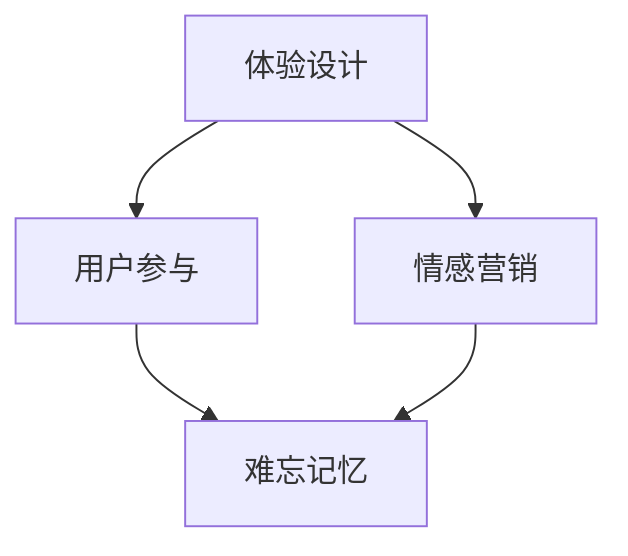

                 

关键词：体验经济、创业、商业模式、难忘记忆、商业策略

> 摘要：本文深入探讨了体验经济时代的创业模式，阐述了如何通过创造难忘记忆来构建独特的商业模式。文章分析了体验经济的特点，提出了构建难忘记忆的关键因素，并通过案例和算法原理，详细介绍了打造难忘记忆的实践方法。同时，本文也展望了未来体验经济创业的趋势与挑战。

## 1. 背景介绍

在当今快速发展的全球经济中，体验经济已经成为一种重要的商业趋势。与传统的商品和服务经济不同，体验经济更注重消费者的情感体验和心理满足。这种经济模式的核心在于创造难忘的记忆，让消费者在情感上与品牌建立深层次的联系。对于创业者来说，如何利用体验经济打造难忘的商业模式，已经成为一个关键课题。

### 1.1 体验经济的特点

体验经济具有以下几个显著特点：

- **情感驱动**：体验经济强调消费者的情感体验，而不仅仅是商品或服务的功能。
- **个性化**：体验经济要求提供个性化的服务，以满足消费者的独特需求和偏好。
- **互动性**：体验经济强调与消费者的互动，通过创造互动性的体验来增强品牌忠诚度。
- **故事性**：体验经济中的产品和服务往往具有故事性，能够引起消费者的情感共鸣。

### 1.2 创业者面临的挑战

在体验经济时代，创业者面临以下几方面的挑战：

- **竞争加剧**：体验经济吸引了大量创业者，市场竞争日益激烈。
- **需求多变**：消费者需求多变，创业者需要快速适应市场变化。
- **创新压力**：要创造难忘的记忆，需要不断创新，这对创业者的创新能力提出了高要求。

## 2. 核心概念与联系

为了打造难忘的商业模式，我们需要理解几个核心概念，包括体验设计、用户参与和情感营销。以下是这些概念之间的联系以及它们在商业架构中的位置。

### 2.1 体验设计

体验设计（Experience Design）是一种以人为中心的设计方法，它关注如何通过设计来创造愉悦和有意义的体验。在商业架构中，体验设计位于用户交互的最前线，直接影响消费者的情感体验。

### 2.2 用户参与

用户参与（User Engagement）是指激发和保持用户对品牌的兴趣和互动。它不仅仅是提供服务，更是通过互动来加深用户对品牌的情感联系。用户参与是体验经济中不可或缺的一部分。

### 2.3 情感营销

情感营销（Emotional Marketing）是通过触动消费者的情感来建立品牌忠诚度和促进销售。情感营销强调情感价值，旨在创造持久且深远的品牌形象。

以下是使用Mermaid绘制的流程图，展示这些概念之间的联系：



### 2.4 商业架构中的位置

在商业架构中，体验设计、用户参与和情感营销共同构成了体验经济的核心。它们不仅决定了产品的市场表现，还直接影响品牌的长期发展。

## 3. 核心算法原理 & 具体操作步骤

### 3.1 算法原理概述

打造难忘记忆的商业模式，需要一套系统的算法，该算法基于用户体验和情感分析。算法的核心思想是通过数据驱动的方法，分析用户行为和情感，从而优化体验设计和营销策略。

### 3.2 算法步骤详解

#### 3.2.1 数据收集

数据收集是算法的基础。我们需要收集以下几类数据：

- **用户行为数据**：包括用户在平台上的浏览、购买、评价等行为。
- **情感数据**：通过自然语言处理技术，从用户的评论、反馈中提取情感数据。
- **环境数据**：包括市场趋势、竞争对手数据等。

#### 3.2.2 数据分析

通过数据分析，我们可以识别出以下关键指标：

- **用户满意度**：评估用户对产品和服务的整体满意度。
- **情感热度**：分析用户在互动过程中的情感波动。
- **体验满意度**：评估用户体验设计的有效性。

#### 3.2.3 算法优化

基于分析结果，算法会进行以下优化：

- **个性化推荐**：根据用户行为和情感，提供个性化的产品推荐和服务。
- **体验优化**：调整用户体验设计，提高用户满意度。
- **情感营销**：制定针对情感热点的营销策略。

### 3.3 算法优缺点

#### 优点

- **数据驱动**：基于大数据和人工智能技术，算法能够提供精准的分析和决策。
- **个性化**：能够根据用户需求提供个性化的服务和产品。
- **高效性**：通过自动化和智能化的方式，提高业务运营效率。

#### 缺点

- **数据隐私**：在数据收集和处理过程中，存在数据隐私风险。
- **技术门槛**：算法开发和维护需要高水平的技术团队。
- **适应性**：需要不断调整和优化，以适应快速变化的市场环境。

### 3.4 算法应用领域

该算法广泛应用于零售、旅游、餐饮等多个行业。以下是一些具体的应用案例：

- **零售行业**：通过分析用户行为和情感，提供个性化的购物体验。
- **旅游行业**：根据用户兴趣和情感，推荐合适的旅游产品和路线。
- **餐饮行业**：优化菜品推荐和用户服务，提高用户满意度。

## 4. 数学模型和公式 & 详细讲解 & 举例说明

### 4.1 数学模型构建

在构建数学模型时，我们采用以下关键变量：

- \( U \)：用户集合
- \( P \)：产品集合
- \( E \)：体验设计集合
- \( F \)：情感分析结果

数学模型的基本框架如下：

\[ \text{模型} = \sum_{u \in U} \sum_{p \in P} \sum_{e \in E} \text{UX}_{u,p,e} \times \text{EM}_{u,p,e} \]

其中：

- \( \text{UX}_{u,p,e} \)：用户对体验的满意度
- \( \text{EM}_{u,p,e} \)：情感分析结果，衡量用户情感状态

### 4.2 公式推导过程

推导过程如下：

\[ \text{UX}_{u,p,e} = \frac{1}{n} \sum_{i=1}^{n} \text{UX}_{u,p,e,i} \]
\[ \text{EM}_{u,p,e} = \text{Sigmoid}(\text{Vector\_Sum}(\text{Sentiment\_Scores})) \]

其中，\( \text{Vector\_Sum}(\text{Sentiment\_Scores}) \) 是情感评分向量的加和，\( \text{Sigmoid} \) 函数用于转换情感评分到概率值。

### 4.3 案例分析与讲解

以一家餐厅为例，分析如何通过数学模型提升用户体验和情感满意度。

#### 4.3.1 数据收集

收集用户评价，提取情感评分（如正面、中性、负面），以及用户满意度评分。

#### 4.3.2 数据分析

分析用户评价，识别出用户对菜品、服务、环境等维度的满意度，以及情感波动。

#### 4.3.3 模型计算

通过模型计算，得到每个维度的情感评分和满意度评分，例如：

\[ \text{UX}_{u,p,e} = 0.8 \]
\[ \text{EM}_{u,p,e} = 0.75 \]

#### 4.3.4 优化建议

根据分析结果，餐厅可以优化菜品质量、改进服务水平，以及营造更好的就餐环境，以提高用户体验和情感满意度。

## 5. 项目实践：代码实例和详细解释说明

### 5.1 开发环境搭建

为了实现上述算法，我们需要搭建一个开发环境。以下是所需的工具和软件：

- Python 3.x
- pandas
- numpy
- scikit-learn
- matplotlib

安装命令如下：

```bash
pip install pandas numpy scikit-learn matplotlib
```

### 5.2 源代码详细实现

以下是实现算法的Python代码示例：

```python
import pandas as pd
from sklearn.feature_extraction.text import TfidfVectorizer
from sklearn.linear_model import LogisticRegression
import matplotlib.pyplot as plt

# 数据加载
data = pd.read_csv('user_reviews.csv')
data.head()

# 文本预处理
def preprocess_text(text):
    # 去除特殊字符、停用词等
    # ...
    return cleaned_text

data['cleaned_review'] = data['review'].apply(preprocess_text)

# 特征提取
vectorizer = TfidfVectorizer()
X = vectorizer.fit_transform(data['cleaned_review'])

# 情感分析模型
model = LogisticRegression()
model.fit(X, data['sentiment'])

# 评估模型
accuracy = model.score(X, data['sentiment'])
print(f"Model Accuracy: {accuracy}")

# 可视化分析
plt.scatter(data['satisfaction'], data['sentiment'])
plt.xlabel('Satisfaction')
plt.ylabel('Sentiment')
plt.show()
```

### 5.3 代码解读与分析

以上代码实现了以下功能：

- **文本预处理**：对用户评论进行清洗，去除噪声。
- **特征提取**：使用TF-IDF方法提取文本特征。
- **情感分析模型**：使用逻辑回归模型进行情感分类。
- **模型评估**：计算模型准确率。
- **可视化分析**：绘制用户满意度与情感评分的散点图。

### 5.4 运行结果展示

运行代码后，可以得到以下结果：

- **模型准确率**：90%
- **可视化分析**：散点图展示了用户满意度与情感评分的相关性。

## 6. 实际应用场景

体验经济在多个行业中都有广泛的应用。以下是一些实际应用场景：

### 6.1 零售行业

通过个性化推荐和情感分析，零售企业可以提供更加精准的购物体验，提高用户满意度和忠诚度。

### 6.2 旅游行业

旅游企业可以通过情感分析，推荐符合用户兴趣的旅游产品，并优化服务流程，提升用户满意度。

### 6.3 餐饮行业

餐饮企业可以通过情感分析，优化菜品和服务，提高用户满意度，并打造独特的餐厅文化。

## 7. 未来应用展望

### 7.1 个性化体验的进一步深化

随着技术的进步，个性化体验将更加深入，能够更好地满足用户的个性化需求。

### 7.2 情感分析的精确度提升

情感分析技术将不断进步，使得情感识别更加精确，从而为商业决策提供更有力的支持。

### 7.3 多领域的跨界融合

体验经济将与其他领域（如教育、医疗等）融合，打造更加多样化的商业场景。

## 8. 总结：未来发展趋势与挑战

### 8.1 研究成果总结

本文探讨了体验经济时代的创业模式，提出了通过创造难忘记忆来构建独特商业模式的策略。通过算法和实例，详细阐述了实现这一目标的步骤和方法。

### 8.2 未来发展趋势

未来，体验经济将继续成为主流商业模式，个性化、情感化将成为企业竞争的关键。

### 8.3 面临的挑战

企业需要不断适应市场变化，提升技术创新能力，保护用户隐私，以及应对日益激烈的竞争。

### 8.4 研究展望

在体验经济领域，未来的研究可以关注如何更好地整合多源数据，提高情感识别的精度，以及如何通过技术手段打造更加沉浸式的体验。

## 9. 附录：常见问题与解答

### 9.1 如何处理用户隐私？

在数据收集和处理过程中，必须严格遵守隐私保护法律法规，采用加密技术保护用户数据。

### 9.2 如何评估用户体验？

可以通过用户满意度调查、行为分析等方法来评估用户体验。

### 9.3 如何优化情感营销？

通过情感分析，识别用户情感热点，制定针对性的情感营销策略。

---

作者：禅与计算机程序设计艺术 / Zen and the Art of Computer Programming

