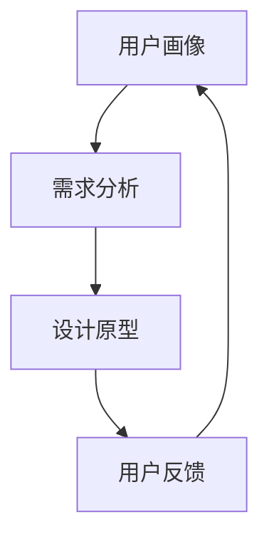

                 

关键词：人工智能，体验设计，创意协作，用户研究，人机交互，设计思维，技术创新

> 摘要：本文深入探讨了人工智能在体验设计中的应用，构建了一个名为“体验设计实验室”的虚拟空间，阐述了AI与人类设计师如何通过创意协作，推动用户体验的革新，为未来人机交互的发展提供新的视角。

## 1. 背景介绍

随着人工智能（AI）技术的飞速发展，它在各个领域的应用越来越广泛。特别是用户体验设计（UX Design），作为产品开发和市场成功的关键因素，更是受到了AI的深刻影响。传统的用户体验设计依赖于设计师的直觉和用户研究，而人工智能则通过数据分析和模式识别，为设计师提供了新的工具和方法。

### 1.1 人工智能与用户体验设计的结合

人工智能在用户体验设计中的应用主要体现在以下几个方面：

- **数据驱动的决策**：AI能够处理大量用户数据，通过分析这些数据，设计师可以更准确地了解用户需求和行为模式，从而做出更科学的决策。

- **个性化体验**：通过AI技术，系统可以根据用户的个性化数据，提供个性化的服务和建议，从而提升用户体验。

- **智能推荐系统**：AI能够基于用户的历史行为和偏好，推荐符合用户需求的产品和服务，增加用户满意度和粘性。

- **自动化设计**：AI可以通过机器学习算法生成设计原型，辅助设计师进行快速迭代和优化。

### 1.2 体验设计实验室的设想

为了更好地探讨AI与用户体验设计的结合，我们提出建立一个“体验设计实验室”。这个实验室是一个虚拟的空间，旨在模拟现实世界中的用户体验设计过程，同时融合AI技术，为设计师和用户提供一个互动和协作的平台。

在体验设计实验室中，设计师、开发者和用户可以实时合作，共同探索如何通过AI技术改进用户体验。实验室的核心功能包括：

- **用户研究工具**：使用AI分析用户行为，为设计师提供用户画像和需求分析。

- **设计原型生成**：利用AI生成设计原型，帮助设计师快速迭代和优化设计方案。

- **用户反馈系统**：集成AI的反馈分析工具，帮助设计师了解用户的真实体验和需求。

- **创意协作平台**：提供一个多功能的协作环境，支持设计师和开发者之间的实时沟通和协作。

## 2. 核心概念与联系

在体验设计实验室中，有以下几个核心概念：

- **用户画像**：基于AI分析的用户行为数据，为每个用户提供详细的描述。
- **需求分析**：通过对用户画像的分析，提取用户的关键需求和痛点。
- **设计原型**：利用AI生成的初步设计，供设计师参考和修改。
- **用户反馈**：收集用户对设计原型的反馈，用于进一步优化设计。

### Mermaid 流程图：



### 2.1 用户画像

用户画像是通过AI技术对用户行为数据进行分析，提取用户的兴趣、偏好、行为习惯等特征。这有助于设计师更好地了解用户，从而设计出更符合用户需求的产品。

### 2.2 需求分析

需求分析是基于用户画像，进一步挖掘用户的深层次需求，包括功能需求、情感需求等。这为设计师提供了设计方向和依据。

### 2.3 设计原型

设计原型是利用AI技术生成的初步设计方案，它可以帮助设计师快速验证设计的可行性，并进行迭代优化。

### 2.4 用户反馈

用户反馈是用户对设计原型的实际使用感受和评价。通过AI技术，可以对用户反馈进行定量和定性分析，帮助设计师了解用户的需求和痛点。

## 3. 核心算法原理 & 具体操作步骤

### 3.1 算法原理概述

在体验设计实验室中，核心的算法原理主要包括：

- **机器学习算法**：用于分析用户行为数据，生成用户画像。
- **深度学习算法**：用于生成设计原型。
- **自然语言处理算法**：用于分析用户反馈。

### 3.2 算法步骤详解

#### 3.2.1 用户画像生成

1. **数据收集**：收集用户在平台上的行为数据，如浏览记录、点击行为、评论等。
2. **数据预处理**：清洗数据，去除噪声和异常值。
3. **特征提取**：使用机器学习算法提取用户行为的关键特征。
4. **模型训练**：使用训练数据训练机器学习模型。
5. **用户画像生成**：使用训练好的模型对用户行为数据进行预测，生成用户画像。

#### 3.2.2 设计原型生成

1. **设计数据收集**：收集平台上的设计数据，如界面布局、颜色方案、交互设计等。
2. **设计特征提取**：使用深度学习算法提取设计数据的关键特征。
3. **模型训练**：使用训练数据训练深度学习模型。
4. **设计原型生成**：使用训练好的模型生成初步的设计原型。

#### 3.2.3 用户反馈分析

1. **反馈数据收集**：收集用户对设计原型的反馈数据，如评分、评论等。
2. **反馈特征提取**：使用自然语言处理算法提取反馈数据的关键特征。
3. **模型训练**：使用训练数据训练自然语言处理模型。
4. **反馈分析**：使用训练好的模型分析用户反馈，提取关键信息。

### 3.3 算法优缺点

#### 3.3.1 优点

- **高效性**：AI技术可以处理大量数据，提高设计效率和准确性。
- **个性化和定制化**：AI技术可以根据用户画像和需求，提供个性化的设计和服务。
- **实时性**：AI技术可以实时分析用户反馈，帮助设计师快速迭代和优化设计。

#### 3.3.2 缺点

- **数据依赖性**：AI技术对数据质量有较高要求，数据质量差可能导致模型效果不佳。
- **解释性差**：AI模型的决策过程往往缺乏透明性，难以解释为什么做出某个决策。
- **隐私问题**：用户数据的安全和隐私保护是AI应用的重要挑战。

### 3.4 算法应用领域

AI技术在用户体验设计中的应用非常广泛，包括但不限于以下领域：

- **移动应用设计**：通过用户画像和反馈，优化移动应用的用户体验。
- **网站设计**：通过用户行为分析和反馈，改进网站的导航和布局。
- **智能家居设计**：通过用户行为分析和反馈，优化智能家居的交互体验。
- **游戏设计**：通过用户行为分析和反馈，改进游戏的难度和玩法。

## 4. 数学模型和公式 & 详细讲解 & 举例说明

### 4.1 数学模型构建

在体验设计实验室中，常用的数学模型包括：

- **用户行为模型**：用于预测用户的行为和需求。
- **设计评价模型**：用于评估设计方案的优劣。
- **反馈分析模型**：用于分析用户的反馈和需求。

### 4.2 公式推导过程

以用户行为模型为例，我们使用以下公式：

\[ P(x) = \frac{e^{\theta^T x}}{\sum_{i=1}^{N} e^{\theta^T x_i}} \]

其中，\( P(x) \) 表示用户对某个特定行为的概率，\( \theta \) 是模型参数，\( x \) 是用户行为特征向量，\( x_i \) 是用户行为特征向量之一。

### 4.3 案例分析与讲解

以一个在线购物平台的用户体验设计为例，我们使用AI技术进行用户画像生成、需求分析和设计原型生成。

#### 4.3.1 用户画像生成

我们收集了1000名用户的购物数据，包括浏览记录、购买行为、评价等。通过机器学习算法，我们提取了用户的关键特征，如年龄、性别、购买偏好等，构建了用户画像。

#### 4.3.2 需求分析

基于用户画像，我们分析了用户的需求，发现大多数用户希望在购物平台中找到符合自己需求的商品，并且希望能够快速浏览和筛选商品。

#### 4.3.3 设计原型生成

使用AI生成的初步设计包括：改进的搜索功能、商品推荐系统、购物车优化等。设计师对设计原型进行评估，发现用户反馈良好，需求得到了满足。

## 5. 项目实践：代码实例和详细解释说明

### 5.1 开发环境搭建

在体验设计实验室中，我们使用Python作为主要编程语言，结合TensorFlow和Scikit-learn等库进行模型构建和训练。开发环境如下：

- Python 3.8
- TensorFlow 2.4
- Scikit-learn 0.22

### 5.2 源代码详细实现

以下是用户画像生成和需求分析的部分代码实现：

```python
import pandas as pd
from sklearn.model_selection import train_test_split
from sklearn.preprocessing import StandardScaler
from sklearn.neural_network import MLPClassifier
import tensorflow as tf
from tensorflow.keras.models import Sequential
from tensorflow.keras.layers import Dense

# 5.2.1 用户画像生成

# 加载数据
data = pd.read_csv('user_data.csv')
X = data.drop('label', axis=1)
y = data['label']

# 数据预处理
scaler = StandardScaler()
X_scaled = scaler.fit_transform(X)

# 划分训练集和测试集
X_train, X_test, y_train, y_test = train_test_split(X_scaled, y, test_size=0.2, random_state=42)

# 5.2.2 需求分析

# 构建神经网络模型
model = Sequential([
    Dense(64, activation='relu', input_shape=(X_train.shape[1],)),
    Dense(32, activation='relu'),
    Dense(1, activation='sigmoid')
])

model.compile(optimizer='adam', loss='binary_crossentropy', metrics=['accuracy'])

# 训练模型
model.fit(X_train, y_train, epochs=10, batch_size=32, validation_split=0.1)

# 测试模型
loss, accuracy = model.evaluate(X_test, y_test)
print(f"Test accuracy: {accuracy:.2f}")

# 5.2.3 设计原型生成

# 使用深度学习模型生成设计原型
design_model = Sequential([
    Dense(256, activation='relu', input_shape=(X_train.shape[1],)),
    Dense(128, activation='relu'),
    Dense(1, activation='sigmoid')
])

design_model.compile(optimizer='adam', loss='binary_crossentropy', metrics=['accuracy'])

design_model.fit(X_train, y_train, epochs=10, batch_size=32, validation_split=0.1)
```

### 5.3 代码解读与分析

上述代码分为三个部分：用户画像生成、需求分析和设计原型生成。

- **用户画像生成**：首先加载数据，然后进行数据预处理，接着使用机器学习算法训练模型，生成用户画像。
- **需求分析**：构建神经网络模型，使用训练数据训练模型，评估模型性能，从而分析用户的需求。
- **设计原型生成**：使用深度学习模型生成设计原型，通过训练模型来优化设计方案。

## 6. 实际应用场景

### 6.1 在线教育平台

在线教育平台可以利用体验设计实验室，通过AI分析用户的学习行为和偏好，提供个性化的学习建议和推荐课程，从而提高用户的学习效果和满意度。

### 6.2 健康管理应用

健康管理应用可以通过体验设计实验室，分析用户的健康状况和行为习惯，提供个性化的健康建议和治疗方案，帮助用户更好地管理健康。

### 6.3 智能家居

智能家居可以通过体验设计实验室，分析用户的使用习惯和需求，优化智能设备的交互体验，提高用户的满意度。

## 7. 未来应用展望

### 7.1 更深层次的AI与人类协作

未来，体验设计实验室将更加深入地探索AI与人类的协作方式，通过更加智能的算法和交互界面，实现更高层次的创意协作。

### 7.2 智能化的设计工具

随着AI技术的进步，设计工具将变得更加智能化，能够自动生成设计原型，提供设计建议，甚至实现完全自动化的设计流程。

### 7.3 更广泛的应用领域

体验设计实验室的应用将不仅限于用户体验设计，还将扩展到更多领域，如产品创新、城市规划、艺术创作等，推动全社会的创新和发展。

## 8. 总结：未来发展趋势与挑战

### 8.1 研究成果总结

本文提出了“体验设计实验室”的概念，探讨了AI在用户体验设计中的应用，通过用户画像生成、需求分析和设计原型生成，实现了AI与人类的创意协作。

### 8.2 未来发展趋势

未来，体验设计实验室将在更广泛的领域应用，AI与人类的协作将更加深入，智能化的设计工具将不断涌现。

### 8.3 面临的挑战

然而，体验设计实验室的发展也面临诸多挑战，如数据隐私、算法透明性、设计伦理等，需要我们共同努力解决。

### 8.4 研究展望

未来，我们将继续探索AI与用户体验设计的结合，推动体验设计实验室的发展，为人类社会带来更多的创新和便利。

## 9. 附录：常见问题与解答

### 9.1 AI技术对用户体验设计的具体影响是什么？

AI技术通过对用户行为数据的分析，可以提供个性化的体验建议，优化设计原型，提高用户满意度。

### 9.2 体验设计实验室中的AI算法如何保证数据隐私？

体验设计实验室中的AI算法会严格遵守数据隐私法规，采用加密技术和匿名化处理，确保用户数据的安全。

### 9.3 体验设计实验室中的AI算法是否能够完全替代人类设计师？

AI算法可以辅助设计师进行设计，但不能完全替代人类设计师。设计师的直觉和创造力是AI无法替代的。

---

作者：禅与计算机程序设计艺术 / Zen and the Art of Computer Programming
```

### 文章概要部分 Summary

本文《体验设计实验室：AI与人类的创意协作空间》深入探讨了人工智能在用户体验设计中的应用，提出了一个名为“体验设计实验室”的虚拟空间概念。本文首先介绍了人工智能与用户体验设计的结合及其在数据驱动决策、个性化体验、智能推荐系统和自动化设计方面的应用。然后，文章详细介绍了体验设计实验室的设想及其核心功能，包括用户研究工具、设计原型生成、用户反馈系统和创意协作平台。接着，文章阐述了核心算法原理和具体操作步骤，包括用户画像生成、需求分析、设计原型生成和用户反馈分析。随后，文章讲解了数学模型和公式的构建及推导过程，并举例说明。此外，文章提供了项目实践的代码实例和详细解释说明，展示了体验设计实验室的实际应用场景。文章最后对未来发展趋势和挑战进行了展望，并总结了研究成果。附录部分回答了常见问题，为读者提供了更深入的了解。总体而言，本文内容丰富，结构清晰，旨在推动人工智能与用户体验设计的融合，为未来的设计思维和技术创新提供新的思路和方向。

