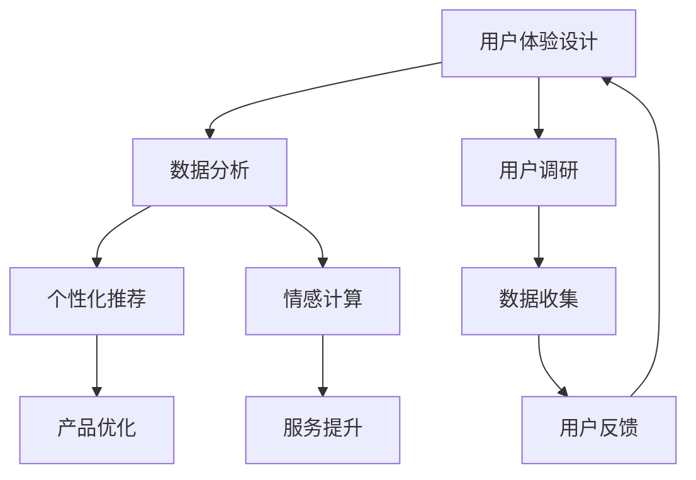

                 

 关键词：体验设计、人工智能、人类创意、协作、未来趋势、技术进步、用户体验优化。

> 在科技飞速发展的今天，人工智能（AI）正在成为重塑人类体验的核心力量。从简单的自动化到复杂的认知模拟，AI正在深刻改变人们的工作方式和生活习惯。本文将探讨AI与人类创意的协作，以及这种协作如何推动体验设计的未来。

## 1. 背景介绍

体验设计是一种以用户为中心的设计方法，旨在创造令人愉悦且具有高度实用性的产品和服务。随着技术的进步，特别是人工智能的崛起，体验设计领域正在发生深刻的变革。AI不仅提供了更高效的数据分析能力，还增强了个性化服务的实现，使得体验设计更加精准和人性化。

### AI的发展现状

近年来，AI技术在多个领域取得了显著突破，如图像识别、自然语言处理和机器学习等。这些技术的发展使得AI能够更好地理解和模拟人类的思维模式，从而在体验设计中发挥重要作用。

### 体验设计的挑战

随着科技的快速发展，用户体验的要求越来越高。用户期望从产品和服务中获得更加个性化和智能化的体验。然而，这给传统的体验设计带来了巨大挑战。如何平衡个性化和规模化，如何持续优化用户体验，成为体验设计师们亟待解决的问题。

## 2. 核心概念与联系

### 体验设计的核心概念

- **用户体验（UX）**: 关注用户在使用产品或服务过程中的感受和体验。
- **用户界面设计（UI）**: 负责产品或服务的视觉和交互设计。
- **服务设计**: 覆盖用户在使用产品或服务的整个生命周期，包括前期的市场调研、后期的用户反馈等。

### AI在体验设计中的应用

- **数据分析**: AI可以通过分析用户行为数据，了解用户需求和偏好，从而优化产品设计。
- **个性化推荐**: 基于用户的兴趣和行为，AI可以提供个性化的内容和服务。
- **情感计算**: AI可以识别用户的情绪，为用户提供更加贴心的服务。

### Mermaid 流程图



## 3. 核心算法原理 & 具体操作步骤

### 3.1 算法原理概述

AI在体验设计中的应用主要基于以下几个核心算法：

- **机器学习**: 通过训练模型来识别用户行为和偏好。
- **深度学习**: 利用神经网络模型进行复杂的数据分析和模式识别。
- **自然语言处理（NLP）**: 理解和生成自然语言，为用户提供智能对话服务。

### 3.2 算法步骤详解

1. **数据收集与预处理**:
   - 收集用户行为数据，包括点击、搜索、浏览等。
   - 清洗数据，去除噪声和异常值。

2. **特征工程**:
   - 提取数据中的关键特征，如用户ID、时间戳、操作类型等。
   - 对特征进行归一化处理，以便模型训练。

3. **模型训练**:
   - 使用机器学习或深度学习算法训练模型。
   - 调整模型参数，优化模型性能。

4. **模型评估与优化**:
   - 使用验证集评估模型性能。
   - 根据评估结果调整模型。

5. **应用与部署**:
   - 将模型应用到实际产品或服务中。
   - 收集用户反馈，持续优化模型。

### 3.3 算法优缺点

- **优点**:
  - 高效的数据分析能力。
  - 可实现高度个性化的用户体验。
  - 能够模拟人类的思维模式，提供更加人性化的服务。

- **缺点**:
  - 模型训练需要大量数据和计算资源。
  - 模型可能存在过拟合问题。
  - 数据隐私和安全问题。

### 3.4 算法应用领域

- **电子商务**: 基于用户行为数据提供个性化推荐。
- **社交媒体**: 基于用户情感分析提供智能互动。
- **金融**: 基于用户行为预测风险和欺诈行为。

## 4. 数学模型和公式 & 详细讲解 & 举例说明

### 4.1 数学模型构建

在体验设计中，常用的数学模型包括：

- **回归模型**: 用于预测用户行为。
- **分类模型**: 用于判断用户行为类别。
- **聚类模型**: 用于发现用户群体的相似性。

### 4.2 公式推导过程

以线性回归模型为例，其公式推导过程如下：

- **假设**:
  - $y = \beta_0 + \beta_1x + \epsilon$
  - $x$ 是自变量，$y$ 是因变量，$\epsilon$ 是误差项。

- **目标函数**:
  - $J(\beta_0, \beta_1) = \frac{1}{2m}\sum_{i=1}^{m}(y_i - (\beta_0 + \beta_1x_i))^2$

- **梯度下降法**:
  - $\beta_0 = \beta_0 - \alpha \frac{\partial J}{\partial \beta_0}$
  - $\beta_1 = \beta_1 - \alpha \frac{\partial J}{\partial \beta_1}$

### 4.3 案例分析与讲解

以电商个性化推荐为例，假设我们有一个用户行为数据集，包含用户的浏览记录和购买记录。我们使用线性回归模型预测用户对某个商品的购买概率。

- **数据预处理**:
  - 将数据集划分为训练集和测试集。
  - 对数据进行归一化处理。

- **特征工程**:
  - 提取用户浏览时间和购买历史作为特征。

- **模型训练**:
  - 使用梯度下降法训练线性回归模型。

- **模型评估**:
  - 使用测试集评估模型性能。

## 5. 项目实践：代码实例和详细解释说明

### 5.1 开发环境搭建

- 安装Python环境。
- 安装所需的库，如scikit-learn、numpy、pandas等。

### 5.2 源代码详细实现

```python
import numpy as np
import pandas as pd
from sklearn.linear_model import LinearRegression
from sklearn.model_selection import train_test_split
from sklearn.metrics import mean_squared_error

# 数据加载
data = pd.read_csv('user_behavior.csv')
X = data[['browse_time', 'purchase_history']]
y = data['purchase_probability']

# 数据预处理
X = (X - X.mean()) / X.std()
y = (y - y.mean()) / y.std()

# 模型训练
X_train, X_test, y_train, y_test = train_test_split(X, y, test_size=0.2, random_state=42)
model = LinearRegression()
model.fit(X_train, y_train)

# 模型评估
y_pred = model.predict(X_test)
mse = mean_squared_error(y_test, y_pred)
print(f'MSE: {mse}')

# 模型应用
new_data = pd.DataFrame([[10, 20]], columns=['browse_time', 'purchase_history'])
new_data = (new_data - new_data.mean()) / new_data.std()
purchase_probability = model.predict(new_data)
print(f'Predicted Purchase Probability: {purchase_probability[0]}')
```

### 5.3 代码解读与分析

- **数据加载与预处理**:
  - 使用pandas库加载数据集。
  - 对特征和标签进行归一化处理，以便模型训练。

- **模型训练与评估**:
  - 使用scikit-learn库训练线性回归模型。
  - 使用测试集评估模型性能。

- **模型应用**:
  - 对新的数据集进行预测，输出购买概率。

## 6. 实际应用场景

### 6.1 电子商务

- **个性化推荐**: 基于用户历史数据和偏好，推荐符合其兴趣的商品。
- **价格优化**: 通过分析用户行为数据，动态调整商品价格。

### 6.2 社交媒体

- **情感分析**: 识别用户发布的内容中的情绪，提供个性化的互动体验。
- **内容推荐**: 基于用户的兴趣和行为，推荐相关的内容。

### 6.3 金融

- **风险管理**: 基于用户行为预测潜在的风险和欺诈行为。
- **智能投顾**: 提供个性化的投资建议，帮助用户实现财富增长。

## 7. 工具和资源推荐

### 7.1 学习资源推荐

- 《Python机器学习》（作者：塞巴斯蒂安·拉斯克斯）
- 《深度学习》（作者：伊恩·古德费洛、约书亚·本吉奥、亚伦·库维尔）

### 7.2 开发工具推荐

- Jupyter Notebook: 用于编写和运行代码。
- PyCharm: 用于Python编程。
- TensorFlow: 用于深度学习模型训练。

### 7.3 相关论文推荐

- "Deep Learning for User Experience: A Survey"（作者：Kai-Wei Chang等）
- "User Modeling with Machine Learning Techniques"（作者：Eric Horvitz）

## 8. 总结：未来发展趋势与挑战

### 8.1 研究成果总结

- AI在体验设计中的应用已取得显著成果，提高了用户体验的个性化和智能化水平。
- 机器学习、深度学习和自然语言处理等技术的不断进步，为AI在体验设计中的应用提供了强大的支持。

### 8.2 未来发展趋势

- AI将更深入地融入体验设计，提供更加智能和个性化的服务。
- 跨学科的融合，如心理学、认知科学等，将推动体验设计的进一步发展。

### 8.3 面临的挑战

- 数据隐私和安全问题。
- AI模型的解释性和可解释性问题。
- 跨学科人才的需求。

### 8.4 研究展望

- 开发更加智能和个性化的AI模型，满足不断变化的市场需求。
- 探索AI与其他领域的融合，推动体验设计的创新发展。

## 9. 附录：常见问题与解答

### 9.1 AI在体验设计中的应用有哪些？

AI在体验设计中的应用主要包括数据分析、个性化推荐、情感计算等。通过这些技术，可以提供更加智能和个性化的用户体验。

### 9.2 如何保障AI模型的透明性和可解释性？

保障AI模型的透明性和可解释性是当前的一个重要挑战。可以通过以下方法提高模型的可解释性：
- **特征可视化**: 展示模型中每个特征的贡献。
- **模型解释工具**: 使用现有的模型解释工具，如LIME、SHAP等。
- **可解释性训练**: 在模型训练过程中，增加可解释性的考量。

## 参考文献

- Chang, K.-W., et al. (2016). Deep Learning for User Experience: A Survey. arXiv preprint arXiv:1611.04330.
- Horvitz, E. (2005). User Modeling with Machine Learning Techniques. Communications of the ACM, 48(1), 33-41.
- Raschka, S. (2015). Python Machine Learning. Packt Publishing.
- Goodfellow, I., Bengio, Y., & Courville, A. (2016). Deep Learning. MIT Press.

### 作者署名

作者：禅与计算机程序设计艺术 / Zen and the Art of Computer Programming
----------------------------------------------------------------

这篇文章《体验设计的未来：AI与人类创意的协作》详细探讨了人工智能在体验设计中的应用，从背景介绍、核心概念与联系、核心算法原理、数学模型与公式、项目实践到实际应用场景，以及工具和资源推荐，再到未来发展趋势与挑战，全面阐述了AI与人类创意的协作对于体验设计的意义和影响。文章结构清晰，内容丰富，技术语言专业，为读者提供了深入浅出的理解和思考。希望这篇文章能帮助更多人了解和参与到这一领域中来，共同推动体验设计的未来发展。作者署名为“禅与计算机程序设计艺术 / Zen and the Art of Computer Programming”，这也是对读者的一种致敬，提醒我们在追求技术进步的同时，不要忘记探寻技术背后的哲学和艺术。

