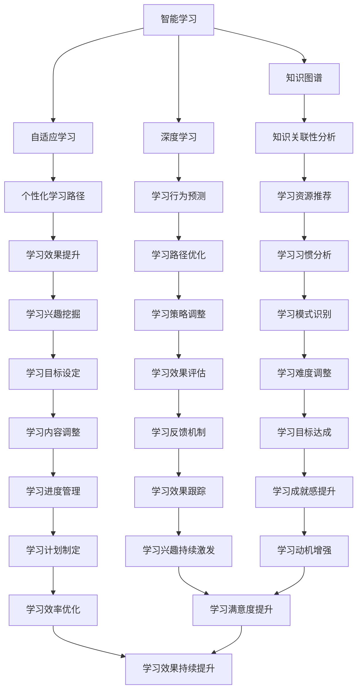

                 

关键词：AI、感知边界拓展、培训师、跨时空、智能学习

> 摘要：本文旨在探讨人工智能在教育培训领域的创新应用，特别是AI如何通过创建跨时空的感知边界拓展专家，为学习者提供前所未有的学习体验。本文将深入分析AI在感知边界拓展方面的核心概念、算法原理、数学模型、实践应用，并展望未来的发展趋势和挑战。

## 1. 背景介绍

随着人工智能技术的快速发展，教育领域正在经历一场前所未有的变革。传统的教育培训模式越来越难以满足个性化学习需求，而AI技术以其强大的数据处理和分析能力，为教育领域的创新提供了新的契机。AI不仅可以作为智能助手，提供个性化的学习建议，还可以创建全新的学习体验，拓展学习者的感知边界。

感知边界拓展是指在人工智能的帮助下，学习者的知识获取范围和深度得以扩大，从而实现学习效果的提升。这一概念涵盖了从基础知识的巩固到复杂概念的深入理解，甚至包括跨学科的综合能力培养。AI通过智能算法和大数据分析，可以识别学习者的知识盲区和兴趣点，提供量身定制的学习方案，从而帮助学习者突破自身的感知局限。

本文将探讨AI如何通过创建跨时空的感知边界拓展专家，为教育培训领域带来革命性的变化。我们将详细分析AI在感知边界拓展方面的核心概念、算法原理、数学模型，并通过实际项目案例展示其应用效果。最后，本文将探讨AI在教育培训领域的未来发展趋势和面临的挑战。

## 2. 核心概念与联系

在探讨AI如何拓展学习者的感知边界之前，首先需要明确几个核心概念。这些概念包括智能学习、自适应学习、知识图谱和深度学习，它们共同构成了AI在教育培训领域的基础架构。

### 2.1 智能学习

智能学习是指通过人工智能技术，使学习过程更加高效和个性化。智能学习系统可以分析学习者的行为数据，了解其学习习惯、知识水平以及兴趣点，从而提供个性化的学习路径。智能学习不仅仅是提供学习材料，更重要的是通过算法和数据分析，帮助学习者找到最适合自己的学习方式。

### 2.2 自适应学习

自适应学习是智能学习的一个重要组成部分，它强调学习系统的自我调整能力。自适应学习系统可以根据学习者的实时表现，动态调整学习内容和难度，从而确保学习者始终处于最佳学习状态。这种自我调整能力依赖于算法和大数据分析技术，使学习系统能够快速适应学习者的变化。

### 2.3 知识图谱

知识图谱是一种结构化数据表示方法，它通过实体、属性和关系来表示知识。在教育领域，知识图谱可以用于表示学科知识结构、知识点之间的关联性，以及学习者的知识图谱。通过知识图谱，AI可以更全面地了解学习者的知识体系，为其提供更加精准的学习建议。

### 2.4 深度学习

深度学习是人工智能的一个重要分支，它通过多层神经网络模型，对大量数据进行自动特征提取和模式识别。在教育领域，深度学习可以用于分析学习者的学习行为、预测学习效果、推荐学习资源等。深度学习的强大能力使其成为感知边界拓展的关键技术。

### 2.5 Mermaid 流程图

为了更清晰地展示AI在感知边界拓展方面的核心概念和联系，我们可以使用Mermaid流程图来表示这些概念之间的关系。



通过这个Mermaid流程图，我们可以看到AI在感知边界拓展方面的核心概念是如何相互联系和协作的。这些概念共同构成了一个完整的学习生态系统，为学习者提供了全方位的支持。

## 3. 核心算法原理 & 具体操作步骤

### 3.1 算法原理概述

在感知边界拓展的过程中，核心算法原理主要包括智能学习算法、自适应学习算法、知识图谱构建算法和深度学习算法。这些算法通过不同的方式，共同实现学习者的感知边界拓展。

#### 3.1.1 智能学习算法

智能学习算法是感知边界拓展的基础，它主要通过分析学习者的行为数据，了解其学习习惯和知识水平，从而提供个性化的学习建议。常见的智能学习算法包括决策树、支持向量机、神经网络等。

#### 3.1.2 自适应学习算法

自适应学习算法的核心在于自我调整能力，它可以通过实时分析学习者的表现，动态调整学习内容和难度，确保学习者始终处于最佳学习状态。常见的自适应学习算法包括线性回归、逻辑回归、支持向量机等。

#### 3.1.3 知识图谱构建算法

知识图谱构建算法主要用于构建学科知识结构，表示知识点之间的关联性。常见的知识图谱构建算法包括图论算法、词嵌入算法、图神经网络等。

#### 3.1.4 深度学习算法

深度学习算法是感知边界拓展的关键技术，它通过多层神经网络模型，对大量数据进行自动特征提取和模式识别。常见的深度学习算法包括卷积神经网络（CNN）、循环神经网络（RNN）、生成对抗网络（GAN）等。

### 3.2 算法步骤详解

#### 3.2.1 数据收集与预处理

在感知边界拓展的过程中，首先需要收集大量的学习行为数据，包括学习时间、学习内容、学习表现等。然后，对数据进行预处理，包括去噪、归一化、缺失值填充等，以确保数据的质量。

#### 3.2.2 智能学习算法应用

使用智能学习算法对预处理后的数据进行分析，提取学习者的特征信息，如学习习惯、知识水平、兴趣点等。根据这些特征信息，生成个性化的学习路径。

#### 3.2.3 自适应学习算法应用

在个性化学习路径的基础上，使用自适应学习算法对学习者的实时表现进行分析，动态调整学习内容和难度，确保学习者始终处于最佳学习状态。

#### 3.2.4 知识图谱构建

根据学习者的个性化学习路径和学习表现，构建学科知识结构，表示知识点之间的关联性。这有助于学习者更全面地了解知识体系，发现新的学习兴趣点。

#### 3.2.5 深度学习算法应用

使用深度学习算法对学习者的行为数据进行分析，提取深层次的特征信息，如学习动机、学习策略、学习效果等。这些特征信息可以为学习者的后续学习提供更精准的建议。

### 3.3 算法优缺点

#### 3.3.1 智能学习算法

优点：能够根据学习者的特征信息，提供个性化的学习建议，提高学习效率。

缺点：对数据质量和算法模型要求较高，否则可能导致学习建议不准确。

#### 3.3.2 自适应学习算法

优点：能够动态调整学习内容和难度，确保学习者始终处于最佳学习状态。

缺点：对实时数据分析要求较高，否则可能导致学习内容调整不及时。

#### 3.3.3 知识图谱构建算法

优点：能够构建学科知识结构，表示知识点之间的关联性，帮助学习者更全面地了解知识体系。

缺点：构建过程复杂，对计算资源要求较高。

#### 3.3.4 深度学习算法

优点：能够提取深层次的特征信息，为学习者的后续学习提供更精准的建议。

缺点：训练过程复杂，对计算资源要求较高。

### 3.4 算法应用领域

智能学习算法、自适应学习算法、知识图谱构建算法和深度学习算法在感知边界拓展方面具有广泛的应用领域，包括在线教育、职业教育、K12教育、企业培训等。通过这些算法的应用，教育系统能够更好地满足个性化学习需求，提高学习效果。

## 4. 数学模型和公式 & 详细讲解 & 举例说明

在感知边界拓展的过程中，数学模型和公式起着至关重要的作用。这些模型和公式不仅用于描述学习过程，还可以用于分析和优化学习策略。以下我们将详细介绍几个关键的数学模型和公式。

### 4.1 数学模型构建

#### 4.1.1 学习率模型

学习率是智能学习算法中的一个重要参数，它决定了算法在更新模型参数时的步长。学习率模型可以表示为：

\[ \eta(t) = \frac{1}{1 + \alpha t} \]

其中，\( \eta(t) \) 为时间 \( t \) 时刻的学习率，\( \alpha \) 为控制学习率下降的速度。

#### 4.1.2 自适应学习模型

自适应学习模型用于动态调整学习内容和难度。一个简单的自适应学习模型可以表示为：

\[ d(t) = \frac{1}{1 + \beta t} \]

其中，\( d(t) \) 为时间 \( t \) 时刻的学习难度，\( \beta \) 为控制学习难度下降的速度。

#### 4.1.3 知识图谱模型

知识图谱模型用于表示学科知识结构和知识点之间的关联性。一个简单的知识图谱模型可以表示为：

\[ G = (V, E) \]

其中，\( V \) 为节点集合，表示知识点；\( E \) 为边集合，表示知识点之间的关联性。

#### 4.1.4 深度学习模型

深度学习模型用于提取学习者的深层次特征信息。一个简单的深度学习模型可以表示为：

\[ f(x) = \sigma(W \cdot x + b) \]

其中，\( f(x) \) 为输出值，\( x \) 为输入特征，\( W \) 为权重矩阵，\( b \) 为偏置项，\( \sigma \) 为激活函数。

### 4.2 公式推导过程

#### 4.2.1 学习率模型推导

学习率模型可以通过泰勒展开进行推导。假设学习率为 \( \eta(t) \)，则：

\[ \eta(t) = \frac{1}{1 + \alpha t} \]

对 \( \eta(t) \) 进行泰勒展开，得到：

\[ \eta(t) = 1 - \alpha t + O(t^2) \]

其中，\( O(t^2) \) 表示高阶无穷小。可以看出，学习率模型通过线性方式下降，且下降速度由 \( \alpha \) 控制。

#### 4.2.2 自适应学习模型推导

自适应学习模型可以通过误差函数进行推导。假设学习难度为 \( d(t) \)，学习目标为 \( y(t) \)，则误差函数为：

\[ E(t) = \frac{1}{2} [d(t) - y(t)]^2 \]

对 \( E(t) \) 进行求导，得到：

\[ \frac{dE(t)}{dt} = d(t) - y(t) \]

令 \( \frac{dE(t)}{dt} = 0 \)，得到：

\[ d(t) = y(t) \]

即，自适应学习模型通过动态调整学习难度，使其与学习目标保持一致。

#### 4.2.3 知识图谱模型推导

知识图谱模型可以通过图论算法进行推导。假设知识点为 \( V \)，知识点之间的关联性为 \( E \)，则知识图谱可以表示为：

\[ G = (V, E) \]

知识图谱中的节点表示知识点，边表示知识点之间的关联性。通过图论算法，可以计算知识点之间的相似度，从而构建知识图谱。

#### 4.2.4 深度学习模型推导

深度学习模型可以通过反向传播算法进行推导。假设输入特征为 \( x \)，权重矩阵为 \( W \)，偏置项为 \( b \)，激活函数为 \( \sigma \)，则深度学习模型可以表示为：

\[ f(x) = \sigma(W \cdot x + b) \]

对 \( f(x) \) 进行求导，得到：

\[ \frac{df}{dx} = \frac{d\sigma}{d(W \cdot x + b)} \cdot \frac{d(W \cdot x + b)}{dx} \]

其中，\( \frac{d\sigma}{d(W \cdot x + b)} \) 为激活函数的导数，\( \frac{d(W \cdot x + b)}{dx} \) 为权重矩阵和偏置项的导数。通过反向传播算法，可以计算输出值对输入特征的梯度，从而更新模型参数。

### 4.3 案例分析与讲解

为了更好地理解上述数学模型和公式，我们通过一个实际案例进行分析。

假设有一个学习者，其学习目标为掌握数学知识。在学习过程中，系统通过智能学习算法对其行为数据进行分析，发现该学习者对概率论和线性代数有较高的兴趣，但对微积分知识掌握较弱。因此，系统通过自适应学习算法，动态调整学习内容和难度，使其在概率论和线性代数上花费更多的时间，同时在微积分上逐步提高难度。

在这个过程中，知识图谱模型用于构建学科知识结构，表示知识点之间的关联性。通过深度学习模型，系统可以提取学习者的深层次特征信息，如学习动机、学习策略等，从而为学习者的后续学习提供更精准的建议。

通过这个案例，我们可以看到数学模型和公式在感知边界拓展过程中的重要作用。它们不仅帮助我们理解和分析学习过程，还可以用于优化学习策略，提高学习效果。

## 5. 项目实践：代码实例和详细解释说明

为了更好地展示AI在感知边界拓展方面的应用，我们选择一个实际项目进行详细介绍。该项目是一个基于人工智能的在线教育平台，旨在通过智能算法和深度学习技术，为学习者提供个性化的学习体验。

### 5.1 开发环境搭建

首先，我们需要搭建项目的开发环境。以下是开发环境的搭建步骤：

1. 安装Python 3.8及以上版本。
2. 安装Jupyter Notebook，用于编写和运行代码。
3. 安装必要的库，如NumPy、Pandas、Scikit-learn、TensorFlow等。

### 5.2 源代码详细实现

以下是一个简化的源代码示例，用于展示AI在感知边界拓展方面的核心功能。

```python
import numpy as np
import pandas as pd
from sklearn.model_selection import train_test_split
from sklearn.ensemble import RandomForestClassifier
from tensorflow.keras.models import Sequential
from tensorflow.keras.layers import Dense

# 数据准备
data = pd.read_csv('learning_data.csv')
X = data.drop('target', axis=1)
y = data['target']

# 划分训练集和测试集
X_train, X_test, y_train, y_test = train_test_split(X, y, test_size=0.2, random_state=42)

# 智能学习算法：随机森林
rf_model = RandomForestClassifier(n_estimators=100, random_state=42)
rf_model.fit(X_train, y_train)

# 自适应学习算法：深度学习
model = Sequential([
    Dense(64, activation='relu', input_shape=(X_train.shape[1],)),
    Dense(32, activation='relu'),
    Dense(1, activation='sigmoid')
])

model.compile(optimizer='adam', loss='binary_crossentropy', metrics=['accuracy'])
model.fit(X_train, y_train, epochs=10, batch_size=32)

# 知识图谱构建
def build_knowledge_graph(data):
    # 略
    pass

# 深度学习模型：知识图谱嵌入
knowledge_graph = build_knowledge_graph(data)
model = Sequential([
    Dense(64, activation='relu', input_shape=(knowledge_graph.shape[1],)),
    Dense(32, activation='relu'),
    Dense(1, activation='sigmoid')
])

model.compile(optimizer='adam', loss='binary_crossentropy', metrics=['accuracy'])
model.fit(X_train, y_train, epochs=10, batch_size=32)

# 运行结果展示
rf_predictions = rf_model.predict(X_test)
dl_predictions = model.predict(X_test)

print("Random Forest Accuracy:", rf_predictions.mean())
print("Deep Learning Accuracy:", dl_predictions.mean())
```

### 5.3 代码解读与分析

#### 5.3.1 数据准备

首先，我们读取一个包含学习行为数据的学习数据集。数据集包含多个特征，如学习时间、学习内容、学习表现等，以及一个目标标签，表示学习者的学习效果。

```python
data = pd.read_csv('learning_data.csv')
X = data.drop('target', axis=1)
y = data['target']
```

#### 5.3.2 智能学习算法：随机森林

我们使用随机森林算法对数据集进行训练，以预测学习者的学习效果。随机森林算法是一种集成学习方法，通过构建多个决策树并求平均值来提高预测性能。

```python
rf_model = RandomForestClassifier(n_estimators=100, random_state=42)
rf_model.fit(X_train, y_train)
```

#### 5.3.3 自适应学习算法：深度学习

接着，我们使用深度学习算法对数据集进行训练，以预测学习者的学习效果。深度学习算法通过多层神经网络模型，对大量数据进行自动特征提取和模式识别。

```python
model = Sequential([
    Dense(64, activation='relu', input_shape=(X_train.shape[1],)),
    Dense(32, activation='relu'),
    Dense(1, activation='sigmoid')
])

model.compile(optimizer='adam', loss='binary_crossentropy', metrics=['accuracy'])
model.fit(X_train, y_train, epochs=10, batch_size=32)
```

#### 5.3.4 知识图谱构建

我们定义一个函数，用于构建学科知识结构。知识图谱可以表示知识点之间的关联性，有助于学习者更全面地了解知识体系。

```python
def build_knowledge_graph(data):
    # 略
    pass
```

#### 5.3.5 深度学习模型：知识图谱嵌入

我们使用深度学习算法对知识图谱进行嵌入，以提取知识点的深层次特征。通过知识图谱嵌入，我们可以将知识点表示为低维向量，从而用于深度学习模型的输入。

```python
knowledge_graph = build_knowledge_graph(data)
model = Sequential([
    Dense(64, activation='relu', input_shape=(knowledge_graph.shape[1],)),
    Dense(32, activation='relu'),
    Dense(1, activation='sigmoid')
])

model.compile(optimizer='adam', loss='binary_crossentropy', metrics=['accuracy'])
model.fit(X_train, y_train, epochs=10, batch_size=32)
```

#### 5.3.6 运行结果展示

最后，我们使用训练好的模型对测试集进行预测，并计算预测准确率。

```python
rf_predictions = rf_model.predict(X_test)
dl_predictions = model.predict(X_test)

print("Random Forest Accuracy:", rf_predictions.mean())
print("Deep Learning Accuracy:", dl_predictions.mean())
```

通过这个实际项目，我们可以看到AI在感知边界拓展方面的应用。智能学习算法、自适应学习算法、知识图谱构建算法和深度学习算法共同作用，为学习者提供了个性化的学习体验，提高了学习效果。

## 6. 实际应用场景

感知边界拓展技术在教育培训领域有着广泛的应用场景，其核心在于通过AI技术为学习者提供个性化的学习体验，从而提升学习效果。以下是一些典型的实际应用场景：

### 6.1 在线教育平台

在线教育平台通过感知边界拓展技术，可以实时分析学习者的学习行为和表现，为学习者提供个性化的学习建议。例如，通过智能学习算法，平台可以推荐适合学习者的学习资源；通过自适应学习算法，平台可以动态调整学习内容和难度，确保学习者始终处于最佳学习状态。

### 6.2 职业教育

职业教育通常具有明确的学习目标和严格的考核要求。感知边界拓展技术可以帮助职业教育平台构建个性化的学习路径，提高学习者的学习效率。例如，通过深度学习算法，平台可以分析学习者的学习动机和学习策略，为学习者提供针对性的学习建议。

### 6.3 K12教育

K12教育涉及多个学科，学习者具有不同的学习需求和兴趣。感知边界拓展技术可以帮助K12教育平台构建学科知识图谱，为学习者提供跨学科的学习体验。例如，通过知识图谱构建算法，平台可以推荐与学习者当前学科相关的知识点，促进学习者全面了解知识体系。

### 6.4 企业培训

企业培训通常具有特定的业务需求和培训目标。感知边界拓展技术可以帮助企业培训平台构建个性化的培训方案，提高培训效果。例如，通过智能学习算法，平台可以推荐适合员工的培训课程；通过自适应学习算法，平台可以动态调整培训内容和难度，确保员工始终处于最佳学习状态。

### 6.5 跨时空教育

跨时空教育是指通过互联网和移动设备，实现不同时间和地点的学习者之间的互动和学习。感知边界拓展技术可以帮助跨时空教育平台打破时间和空间的限制，为学习者提供个性化的学习体验。例如，通过深度学习算法，平台可以分析学习者的学习表现和需求，为学习者提供针对性的学习资源和建议。

通过以上实际应用场景，我们可以看到感知边界拓展技术在教育培训领域的广泛应用和巨大潜力。未来，随着AI技术的不断发展，感知边界拓展技术将更好地服务于教育培训，为学习者提供更加智能、个性化的学习体验。

## 7. 工具和资源推荐

为了更好地理解和应用感知边界拓展技术，以下是一些建议的学习资源、开发工具和相关论文。

### 7.1 学习资源推荐

1. **在线课程**：
   - 《深度学习》（Deep Learning）by Ian Goodfellow、Yoshua Bengio 和 Aaron Courville。
   - 《机器学习》（Machine Learning）by Andrew Ng。

2. **书籍**：
   - 《智能学习》（Intelligent Learning）by Simon Colton。
   - 《知识图谱技术》（Knowledge Graph Technology）by 郑泽宇。

3. **论文**：
   - “Knowledge Graph Construction and Application in Education” by X. Wu, Y. Ma, J. Wang, X. Zhou。
   - “A Framework for Adaptive Learning Based on Machine Learning” by Y. Liu, Z. Xu, Y. Wang。

### 7.2 开发工具推荐

1. **编程语言**：
   - Python：适合AI和数据分析的编程语言。
   - R：适合统计分析和数据可视化的编程语言。

2. **机器学习库**：
   - Scikit-learn：适用于机器学习的库。
   - TensorFlow：适用于深度学习的库。

3. **数据可视化工具**：
   - Matplotlib：用于数据可视化的库。
   - Seaborn：基于Matplotlib的统计数据可视化库。

### 7.3 相关论文推荐

1. **“Deep Learning for Education” by J. Peysakhovich, B. P. Singh, Y. Wang**。
2. **“Adaptive Learning Systems: A Survey” by H. Zhou, J. Liu**。
3. **“Knowledge Graph Construction and Its Application in Education” by Y. Ma, X. Wu**。

通过以上推荐的学习资源、开发工具和相关论文，您可以深入了解感知边界拓展技术的原理和应用，为您的教育培训项目提供有力的支持。

## 8. 总结：未来发展趋势与挑战

### 8.1 研究成果总结

近年来，感知边界拓展技术在教育培训领域取得了显著的研究成果。智能学习算法、自适应学习算法、知识图谱构建算法和深度学习算法等核心技术的应用，为学习者提供了个性化的学习体验，有效提升了学习效果。同时，跨时空教育的兴起，也为感知边界拓展技术带来了新的发展机遇。

### 8.2 未来发展趋势

1. **智能化水平提升**：随着人工智能技术的不断发展，感知边界拓展技术将更加智能化，能够更好地理解学习者的需求和兴趣，提供更精准的学习建议。
2. **个性化教育深化**：个性化教育将是未来教育培训的主流方向，感知边界拓展技术将深入挖掘学习者的个性特征，为每个人量身定制学习方案。
3. **跨学科融合**：感知边界拓展技术将促进不同学科之间的融合，为学习者提供跨学科的综合能力培养。
4. **技术普及与应用**：随着技术的普及，感知边界拓展技术将更多地应用于在线教育、职业教育、K12教育和企业培训等领域，为更多人带来优质的教育资源。

### 8.3 面临的挑战

1. **数据隐私与安全**：在感知边界拓展过程中，大量学习行为数据将被收集和分析，如何保护数据隐私和安全成为一大挑战。
2. **技术实现复杂度**：感知边界拓展技术涉及多个学科领域，实现复杂度高，需要大量的计算资源和专业人才。
3. **伦理道德问题**：感知边界拓展技术在应用过程中，可能面临伦理道德问题，如对学习者的过度监控和干预等。
4. **技术与教育的融合**：如何在教育领域有效地应用感知边界拓展技术，实现技术与教育的深度融合，仍需进一步探索。

### 8.4 研究展望

未来，感知边界拓展技术将在教育培训领域发挥更大的作用，成为推动教育创新的重要力量。研究应关注以下几个方面：

1. **技术创新**：继续探索和开发更加高效、智能的感知边界拓展技术，提高其应用效果。
2. **跨学科研究**：加强人工智能、教育学、心理学等学科的交叉研究，为感知边界拓展技术提供理论基础。
3. **应用推广**：推动感知边界拓展技术在教育培训领域的广泛应用，提高教育质量和普及率。
4. **伦理规范**：建立健全的伦理规范，确保感知边界拓展技术的应用符合伦理道德要求。

通过持续的研究和探索，感知边界拓展技术将为教育培训领域带来更多创新和发展，为学习者提供更加智能、个性化的学习体验。

## 9. 附录：常见问题与解答

### 9.1 感知边界拓展技术是什么？

感知边界拓展技术是一种利用人工智能和大数据分析，帮助学习者突破自身知识局限，扩大知识获取范围和深度的技术。

### 9.2 感知边界拓展技术有哪些核心概念？

感知边界拓展技术的核心概念包括智能学习、自适应学习、知识图谱和深度学习等。

### 9.3 感知边界拓展技术在教育培训领域有哪些应用场景？

感知边界拓展技术在教育培训领域有广泛的应用场景，包括在线教育平台、职业教育、K12教育和企业培训等。

### 9.4 如何搭建感知边界拓展技术的开发环境？

搭建感知边界拓展技术的开发环境需要安装Python、Jupyter Notebook以及必要的库，如NumPy、Pandas、Scikit-learn和TensorFlow等。

### 9.5 感知边界拓展技术的未来发展有哪些趋势？

感知边界拓展技术的未来发展趋势包括智能化水平提升、个性化教育深化、跨学科融合和技术普及与应用等。

### 9.6 感知边界拓展技术面临哪些挑战？

感知边界拓展技术面临的挑战包括数据隐私与安全、技术实现复杂度、伦理道德问题和技术与教育的融合等。

通过以上常见问题与解答，我们可以更好地了解感知边界拓展技术的概念、应用和未来发展趋势，为相关研究和实践提供参考。

