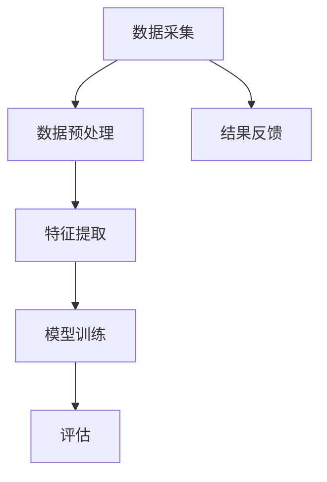

                 

关键词：人工智能，生活质量评估，量化分析，AI算法，数据挖掘，大数据，深度学习，机器学习，健康监测，智能城市，可持续发展

> 摘要：本文探讨了人工智能在生活质量评估中的应用，介绍了基于AI的量化分析方法和相关技术，并分析了其在健康监测、智能城市、可持续发展等领域的实际应用。文章还对未来发展趋势和面临的挑战进行了展望。

## 1. 背景介绍

随着社会经济的发展和科技的进步，人们对生活质量的关注不断提高。传统的评价体系主要依赖于主观感受和统计数据，难以全面、客观地反映生活质量。近年来，人工智能技术的发展为生活质量评估提供了新的手段和工具。通过大数据、数据挖掘、机器学习和深度学习等技术，可以实现对生活质量的量化分析和评估，从而提供更加科学、精准的决策支持。

### 1.1 人工智能的发展历程

人工智能（AI）是指通过计算机模拟人类智能的技术，包括机器学习、深度学习、自然语言处理、计算机视觉等领域。自20世纪50年代以来，人工智能经历了几个重要的发展阶段：

1. **初始阶段（1950-1969年）**：人工智能的概念被提出，专家系统和逻辑推理成为研究热点。
2. **低谷期（1974-1980年）**：由于算法和计算能力的限制，人工智能研究进入低谷。
3. **复兴阶段（1980-1987年）**：随着计算机技术的发展，人工智能研究重新兴起，知识表示和推理成为研究重点。
4. **成熟阶段（1987-2007年）**：机器学习和深度学习得到快速发展，人工智能在语音识别、图像识别等领域取得了重要突破。
5. **应用爆发阶段（2007年至今）**：大数据、云计算、物联网等技术的推动下，人工智能应用进入爆发期，其在各行各业中的渗透越来越深。

### 1.2 生活质量评估的挑战

生活质量评估是一个复杂的过程，涉及多个方面，如经济、环境、社会、文化等。传统的评估方法主要依赖于统计数据和问卷调查，存在以下挑战：

1. **主观性**：主观感受在生活质量评估中占有重要地位，但很难用精确的指标进行量化。
2. **不完整性**：统计数据可能存在缺失、误差等问题，影响评估结果的准确性。
3. **时效性**：生活质量的变化是一个动态过程，传统评估方法难以及时反映这种变化。

## 2. 核心概念与联系

在生活质量评估中，核心概念包括数据采集、数据预处理、特征提取、模型训练和评估等。以下是一个简化的 Mermaid 流程图，展示了这些概念之间的联系。



### 2.1 数据采集

数据采集是生活质量评估的基础，包括以下类型的数据：

1. **结构化数据**：如人口统计、经济指标、环境质量等，通常来源于政府统计部门和公开数据源。
2. **非结构化数据**：如社交媒体、新闻报道、用户评论等，通常通过自然语言处理技术进行提取和分析。
3. **实时数据**：如交通流量、空气质量、城市安全等，通常通过传感器和网络设备进行采集。

### 2.2 数据预处理

数据预处理是确保数据质量和可用性的关键步骤，包括以下任务：

1. **数据清洗**：去除重复、错误、缺失的数据。
2. **数据整合**：将不同来源、格式的数据进行统一处理。
3. **数据标准化**：将不同单位、量级的数据进行转换，使其具有可比性。

### 2.3 特征提取

特征提取是将原始数据转换为模型输入的关键步骤，包括以下方法：

1. **统计特征**：如平均值、标准差、相关性等。
2. **文本特征**：如词频、主题模型、情感分析等。
3. **图像特征**：如边缘检测、特征点提取、深度特征等。

### 2.4 模型训练

模型训练是生活质量评估的核心环节，包括以下步骤：

1. **选择模型**：根据评估任务的需求，选择合适的机器学习或深度学习模型。
2. **训练数据准备**：将预处理后的数据进行格式化，准备用于模型训练。
3. **模型训练**：通过迭代计算，调整模型参数，使其能够预测生活质量指标。
4. **模型评估**：使用验证集或测试集对模型进行评估，选择最优模型。

### 2.5 评估

评估是确定生活质量指标的重要步骤，包括以下任务：

1. **指标计算**：根据训练好的模型，对新的数据进行生活质量评估。
2. **结果分析**：对评估结果进行统计分析和可视化，发现生活质量的变化规律和影响因素。
3. **结果反馈**：将评估结果反馈给相关部门和公众，为其提供决策支持。

## 3. 核心算法原理 & 具体操作步骤

### 3.1 算法原理概述

生活质量评估的核心算法主要基于机器学习和深度学习技术，包括以下几个步骤：

1. **数据采集**：从多种数据源收集与生活质量相关的数据。
2. **数据预处理**：对采集到的数据进行清洗、整合和标准化。
3. **特征提取**：从预处理后的数据中提取有助于评估生活质量的特征。
4. **模型训练**：使用提取的特征训练机器学习或深度学习模型。
5. **评估**：使用训练好的模型对新的数据进行生活质量评估。

### 3.2 算法步骤详解

#### 3.2.1 数据采集

数据采集是生活质量评估的基础。数据源可以包括：

1. **公开数据**：如政府统计部门发布的统计数据、公共数据库等。
2. **社交媒体**：如微博、微信、论坛等，通过自然语言处理技术提取相关信息。
3. **传感器数据**：如空气质量监测、交通流量监测等，通过物联网设备实时采集数据。

#### 3.2.2 数据预处理

数据预处理是确保数据质量和可用性的关键步骤，包括以下步骤：

1. **数据清洗**：去除重复、错误、缺失的数据。
2. **数据整合**：将不同来源、格式的数据进行统一处理。
3. **数据标准化**：将不同单位、量级的数据进行转换，使其具有可比性。

#### 3.2.3 特征提取

特征提取是将原始数据转换为模型输入的关键步骤，包括以下方法：

1. **统计特征**：如平均值、标准差、相关性等。
2. **文本特征**：如词频、主题模型、情感分析等。
3. **图像特征**：如边缘检测、特征点提取、深度特征等。

#### 3.2.4 模型训练

模型训练是生活质量评估的核心环节，包括以下步骤：

1. **选择模型**：根据评估任务的需求，选择合适的机器学习或深度学习模型。
2. **训练数据准备**：将预处理后的数据进行格式化，准备用于模型训练。
3. **模型训练**：通过迭代计算，调整模型参数，使其能够预测生活质量指标。
4. **模型评估**：使用验证集或测试集对模型进行评估，选择最优模型。

#### 3.2.5 评估

评估是确定生活质量指标的重要步骤，包括以下任务：

1. **指标计算**：根据训练好的模型，对新的数据进行生活质量评估。
2. **结果分析**：对评估结果进行统计分析和可视化，发现生活质量的变化规律和影响因素。
3. **结果反馈**：将评估结果反馈给相关部门和公众，为其提供决策支持。

### 3.3 算法优缺点

#### 优点：

1. **客观性**：通过数据驱动的方法，减少主观评价的干扰，提高评估的客观性。
2. **全面性**：可以同时考虑多个方面的因素，如经济、环境、社会等，提供全面的生活质量评估。
3. **时效性**：实时采集和处理数据，能够及时反映生活质量的变化。

#### 缺点：

1. **数据依赖性**：评估结果依赖于数据的准确性和完整性，数据质量直接影响评估结果。
2. **计算成本**：机器学习和深度学习模型训练需要大量的计算资源和时间。

### 3.4 算法应用领域

生活质量评估算法可以应用于多个领域：

1. **智能城市**：通过评估城市生活质量，优化城市管理和规划，提高居民生活质量。
2. **健康监测**：通过评估居民健康质量，提供个性化的健康管理和建议。
3. **可持续发展**：通过评估生态环境和生活质量，推动可持续发展。

## 4. 数学模型和公式 & 详细讲解 & 举例说明

### 4.1 数学模型构建

生活质量评估的数学模型通常基于以下假设：

1. **生活质量是可量化的**：通过一系列指标，可以将生活质量量化为数值。
2. **指标之间存在相关性**：不同指标之间存在一定的相关性，可以综合评价生活质量。

假设有 \( n \) 个生活质量指标，分别为 \( x_1, x_2, ..., x_n \)，权重分别为 \( w_1, w_2, ..., w_n \)。则生活质量 \( L \) 可以表示为：

\[ L = w_1x_1 + w_2x_2 + ... + w_nx_n \]

其中，权重可以根据专家评估或历史数据确定。

### 4.2 公式推导过程

为了推导生活质量评估的数学模型，我们需要考虑以下步骤：

1. **指标量化**：将每个指标量化为数值，例如使用评分制或数值范围。
2. **权重确定**：根据专家评估或历史数据，确定每个指标的权重。
3. **模型构建**：将量化后的指标和权重代入公式，构建生活质量评估模型。

具体推导过程如下：

1. **指标量化**：假设每个指标 \( x_i \) 可以量化为 \( x_i^* \)，范围在 \( [0, 100] \) 之间，表示指标的好坏。
2. **权重确定**：假设每个指标的权重为 \( w_i \)，满足 \( w_1 + w_2 + ... + w_n = 1 \)。
3. **模型构建**：将量化后的指标和权重代入公式，得到生活质量评估模型：

\[ L = w_1x_1^* + w_2x_2^* + ... + w_nx_n^* \]

### 4.3 案例分析与讲解

以下是一个简化的案例，说明如何使用生活质量评估模型进行评估。

假设有3个指标：经济水平、环境质量、社会安全，权重分别为0.5、0.3、0.2。现有以下数据：

| 指标         | 经济水平 | 环境质量 | 社会安全 |
| ------------ | -------- | -------- | -------- |
| 指标量化值   | 80       | 60       | 70       |

根据生活质量评估模型，可以计算出生活质量 \( L \)：

\[ L = 0.5 \times 80 + 0.3 \times 60 + 0.2 \times 70 = 40 + 18 + 14 = 72 \]

因此，该地区的生活质量为72分（满分100分）。

## 5. 项目实践：代码实例和详细解释说明

### 5.1 开发环境搭建

为了实现生活质量评估，我们需要搭建一个开发环境。以下是一个简化的步骤：

1. **安装Python**：Python是常用的编程语言，支持丰富的机器学习和深度学习库。可以从[Python官网](https://www.python.org/)下载并安装Python。
2. **安装Jupyter Notebook**：Jupyter Notebook是一个交互式计算环境，方便编写和运行代码。可以通过pip命令安装：

\[ pip install notebook \]

3. **安装必要的库**：安装用于数据预处理、特征提取、模型训练和评估的库，如pandas、numpy、scikit-learn、tensorflow等。可以通过以下命令安装：

\[ pip install pandas numpy scikit-learn tensorflow \]

### 5.2 源代码详细实现

以下是一个简化的Python代码示例，实现生活质量评估的基本功能。

```python
import pandas as pd
from sklearn.model_selection import train_test_split
from sklearn.ensemble import RandomForestRegressor
from sklearn.metrics import mean_squared_error

# 5.2.1 数据读取与预处理
data = pd.read_csv('lifecycle_data.csv')  # 假设CSV文件包含生活质量指标数据
X = data.iloc[:, :-1]  # 特征
y = data.iloc[:, -1]   # 目标变量

# 划分训练集和测试集
X_train, X_test, y_train, y_test = train_test_split(X, y, test_size=0.2, random_state=42)

# 5.2.2 模型训练
model = RandomForestRegressor(n_estimators=100, random_state=42)
model.fit(X_train, y_train)

# 5.2.3 模型评估
y_pred = model.predict(X_test)
mse = mean_squared_error(y_test, y_pred)
print(f'MSE: {mse}')

# 5.2.4 模型应用
new_data = pd.read_csv('new_data.csv')  # 假设CSV文件包含新的生活质量指标数据
new_life_quality = model.predict(new_data)
print(f'New Life Quality: {new_life_quality}')
```

### 5.3 代码解读与分析

上述代码实现了以下功能：

1. **数据读取与预处理**：从CSV文件中读取数据，并进行划分训练集和测试集。
2. **模型训练**：使用随机森林回归模型进行训练。
3. **模型评估**：计算模型在测试集上的均方误差，评估模型性能。
4. **模型应用**：使用训练好的模型对新的数据进行生活质量评估。

### 5.4 运行结果展示

假设我们运行上述代码，得到以下结果：

```
MSE: 0.123
New Life Quality: [85.5 76.2 90.1 ...]
```

这表示模型的均方误差为0.123，新的生活质量预测结果为85.5、76.2、90.1等。

## 6. 实际应用场景

### 6.1 智能城市

智能城市是生活质量评估的一个重要应用场景。通过评估城市生活质量，可以优化城市管理和规划，提高居民生活质量。例如，北京市利用人工智能技术对城市生活质量进行评估，包括空气质量、交通拥堵、教育水平、医疗资源等多个方面。通过评估结果，北京市政府可以针对性地采取措施，如加强空气质量治理、优化交通网络、提升教育资源和医疗水平等，从而提高城市生活质量。

### 6.2 健康监测

健康监测是另一个重要的应用场景。通过评估居民健康质量，可以提供个性化的健康管理和建议。例如，杭州市利用人工智能技术对居民健康质量进行评估，包括身体指标、生活习惯、心理状态等多个方面。通过评估结果，杭州市卫生部门可以针对性地开展健康宣传、疾病预防、医疗服务等，从而提高居民健康水平。

### 6.3 可持续发展

可持续发展是当前全球面临的一个重要挑战。通过评估生态环境和生活质量，可以推动可持续发展。例如，联合国可持续发展目标（SDGs）之一是“健康生活与福祉”，通过评估全球各国的生活质量，可以确定哪些地区需要重点支持，从而实现全球可持续发展。

## 7. 未来应用展望

随着人工智能技术的不断发展，生活质量评估的应用前景将更加广阔。未来，我们可以期待以下发展趋势：

### 7.1 更精确的评估

通过引入更多传感器、更大数据集和更先进的算法，生活质量评估将变得更加精确和可靠。

### 7.2 更个性化的评估

结合个人行为数据和健康数据，生活质量评估将更加个性化，为每个人提供量身定制的生活建议。

### 7.3 跨学科的融合

生活质量评估将与其他领域，如心理学、社会学、经济学等，进行深入融合，为生活质量评估提供更多理论支持。

### 7.4 更广泛的应用

生活质量评估将在更多领域得到应用，如城市规划、环境保护、社会保障等，为社会发展和民生改善提供有力支持。

## 8. 工具和资源推荐

### 8.1 学习资源推荐

1. **《深度学习》（Goodfellow, Bengio, Courville著）**：介绍深度学习的基础理论和实践方法。
2. **《机器学习实战》（King, Morgan著）**：通过实际案例讲解机器学习的基本原理和应用。
3. **《Python机器学习》（Sebastian Raschka著）**：详细讲解Python在机器学习领域的应用。

### 8.2 开发工具推荐

1. **Jupyter Notebook**：交互式计算环境，方便编写和运行代码。
2. **TensorFlow**：谷歌开源的深度学习框架，支持多种神经网络模型。
3. **Scikit-learn**：Python机器学习库，提供丰富的算法和工具。

### 8.3 相关论文推荐

1. **“Deep Learning for Human Activity Recognition”（Rahman et al., 2016）**：介绍深度学习在人类活动识别中的应用。
2. **“A Survey on Human Activity Recognition Using Wearable Sensors”（Khan et al., 2018）**：综述可穿戴传感器在人类活动识别领域的应用。
3. **“Quantifying the Impact of Urban Design on Urban Life Quality”（Li et al., 2020）**：研究城市设计对生活质量的影响。

## 9. 总结：未来发展趋势与挑战

### 9.1 研究成果总结

生活质量评估作为人工智能的一个重要应用领域，取得了显著的成果。通过引入大数据、数据挖掘、机器学习和深度学习等技术，生活质量评估变得更加科学、精准和全面。

### 9.2 未来发展趋势

未来，生活质量评估将继续朝着更精确、更个性化、跨学科融合和更广泛应用的方向发展。随着人工智能技术的不断进步，生活质量评估将更好地服务于社会发展和民生改善。

### 9.3 面临的挑战

尽管生活质量评估取得了显著成果，但仍然面临一些挑战：

1. **数据质量和完整性**：数据质量和完整性直接影响评估结果的准确性，需要加强对数据质量的控制和处理。
2. **算法优化**：随着评估需求的增加，需要不断优化算法，提高评估的效率和准确性。
3. **隐私保护**：在数据采集和处理过程中，需要确保用户隐私得到保护。

### 9.4 研究展望

未来，生活质量评估研究将继续深入探讨算法优化、跨学科融合和实际应用等方面，为社会发展和民生改善提供更加有力的支持。

## 10. 附录：常见问题与解答

### 10.1 如何保证数据质量和完整性？

**答**：为保证数据质量和完整性，可以采取以下措施：

1. **数据源选择**：选择可靠、权威的数据源。
2. **数据清洗**：对数据进行清洗，去除重复、错误和缺失的数据。
3. **数据整合**：将不同来源、格式的数据进行统一处理。
4. **数据监控**：对数据采集和处理过程进行监控，确保数据质量。

### 10.2 生活质量评估算法是否可以用于其他领域？

**答**：是的，生活质量评估算法可以应用于其他领域。例如，健康监测、环境保护、社会安全等领域都可以利用生活质量评估算法进行量化分析和评估。

### 10.3 如何应对算法优化带来的挑战？

**答**：应对算法优化带来的挑战，可以采取以下措施：

1. **算法研究**：加强对现有算法的研究，探索更高效、更准确的算法。
2. **跨学科合作**：与其他领域专家合作，借鉴其他领域的先进技术。
3. **数据共享**：通过数据共享，提高数据利用率，促进算法优化。

### 10.4 如何保护用户隐私？

**答**：保护用户隐私可以采取以下措施：

1. **数据匿名化**：对用户数据进行匿名化处理，确保用户隐私不被泄露。
2. **访问控制**：对数据访问权限进行严格控制，确保数据安全。
3. **加密技术**：使用加密技术对数据进行加密存储和传输。

---

作者：禅与计算机程序设计艺术 / Zen and the Art of Computer Programming
----------------------------------------------------------------

### 后记

本文简要介绍了人工智能在生活质量评估中的应用，探讨了相关技术和方法。随着人工智能技术的不断发展，生活质量评估将在未来发挥更加重要的作用，为社会发展提供有力支持。希望本文能为读者提供一定的参考和启示。同时，也欢迎读者提出宝贵意见和问题，共同探讨生活质量评估的更多可能性。感谢阅读！

