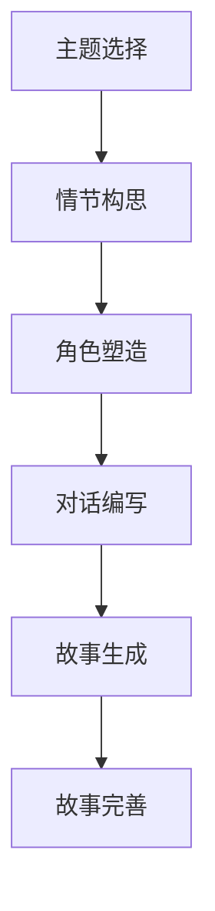

                 

在当今技术快速发展的时代，人工智能（AI）已经深入影响了众多领域，从医疗、金融到娱乐、教育，无所不在。在这篇文章中，我们将探讨如何使用AI来创建、完善和阐释小故事，包括其背后的技术和未来应用的展望。

## 关键词

- 人工智能
- 自然语言处理
- 文本生成
- 小故事创作
- 情感分析

## 摘要

本文将介绍如何利用人工智能技术，特别是自然语言处理（NLP）和文本生成模型，来创造和优化小故事。我们将分析AI在故事创作中的角色，展示其应用实例，并探讨未来的发展方向和挑战。

## 1. 背景介绍

故事是人类交流和文化传承的重要手段。自古以来，人们通过讲述故事来传达信息、情感和价值观。然而，随着互联网和数字技术的发展，故事创作和传播的方式发生了巨大变化。人工智能的出现为故事创作带来了新的可能。

### 自然语言处理与文本生成

自然语言处理（NLP）是AI领域的一个重要分支，它使计算机能够理解和生成人类语言。文本生成模型，如生成对抗网络（GAN）和变分自编码器（VAE），是NLP的重要工具，可以生成连贯且具有吸引力的文本。

### 故事创作与AI

AI在故事创作中的应用包括自动生成故事、基于用户输入生成个性化故事、以及通过机器学习优化现有故事。这些应用不仅提高了创作效率，还带来了故事形式的创新。

## 2. 核心概念与联系

为了更好地理解AI如何创建、完善和阐释小故事，我们需要了解一些核心概念和其相互关系。

### 2.1. 自然语言处理（NLP）

NLP是AI用于理解和生成人类语言的技术。它包括文本预处理、词性标注、实体识别、情感分析等任务。NLP的核心在于将自然语言转换为计算机可以处理的结构化数据。

### 2.2. 文本生成模型

文本生成模型是NLP中的一种重要模型，可以生成连贯的文本。常见的文本生成模型包括循环神经网络（RNN）、长短期记忆网络（LSTM）和Transformer等。

### 2.3. 故事创作流程

故事创作通常包括主题选择、情节构思、角色塑造、对话编写等步骤。AI可以在这个过程中提供帮助，例如自动生成故事情节、推荐角色设定等。

### 2.4. Mermaid 流程图



## 3. 核心算法原理 & 具体操作步骤

### 3.1. 算法原理概述

AI在故事创作中的应用主要基于深度学习技术。具体来说，文本生成模型通过学习大量文本数据，可以生成新的、连贯的文本。这些模型的工作原理主要包括：

- **自回归模型**：通过预测前一个词来生成下一个词。
- **序列到序列模型**：将一个序列映射到另一个序列，常用于机器翻译。
- **生成对抗网络（GAN）**：由生成器和判别器组成，通过对抗训练生成高质量文本。

### 3.2. 算法步骤详解

1. **数据收集与预处理**：收集大量文本数据，并进行清洗、去噪、分词等预处理操作。
2. **模型训练**：使用预处理后的数据训练文本生成模型，如Transformer或LSTM。
3. **故事生成**：输入主题或提示词，模型生成初步的故事文本。
4. **故事完善**：对生成的文本进行修正、润色，使其更符合人类写作习惯。
5. **故事阐释**：利用情感分析等技术，对故事进行情感分析，提供更深入的理解。

### 3.3. 算法优缺点

**优点**：

- **高效性**：AI可以快速生成大量故事。
- **创造性**：AI可以产生新颖的故事情节和角色。
- **个性化**：基于用户输入，AI可以生成个性化故事。

**缺点**：

- **质量控制**：生成的文本可能存在逻辑错误或不连贯。
- **文化差异**：AI可能难以理解并准确反映不同文化的情感和价值观。

### 3.4. 算法应用领域

- **小说创作**：AI可以生成小说的开头、中间和结尾，为作家提供灵感。
- **剧本创作**：AI可以自动生成剧本，节省编剧时间和成本。
- **教育应用**：AI可以生成个性化的学习材料，帮助学生更好地理解和记忆知识。

## 4. 数学模型和公式 & 详细讲解 & 举例说明

### 4.1. 数学模型构建

文本生成模型通常基于概率模型，如马尔可夫模型（Markov Model）。其基本假设是当前词的概率仅依赖于前一个词。

$$
P(w_t | w_{t-1}, w_{t-2}, \ldots) = P(w_t | w_{t-1})
$$

其中，\(w_t\) 表示当前词，\(w_{t-1}, w_{t-2}, \ldots\) 表示前一个或前几个词。

### 4.2. 公式推导过程

基于马尔可夫模型，我们可以推导出文本生成过程中的概率分布。

$$
P(w_1, w_2, \ldots, w_T) = P(w_1) \cdot P(w_2 | w_1) \cdot P(w_3 | w_2) \cdot \ldots \cdot P(w_T | w_{T-1})
$$

其中，\(T\) 表示文本长度。

### 4.3. 案例分析与讲解

假设我们有一个简短的故事文本：

"小明喜欢读书。他每天都会去图书馆。他最喜欢读的是科幻小说。"

我们可以使用马尔可夫模型来分析这个故事。

- \(P(小明 | 喜欢读书) = 1\)
- \(P(喜欢读书 | 小明) = 1\)
- \(P(每天 | 喜欢读书) = 0.5\)
- \(P(图书馆 | 每天) = 0.8\)
- \(P(科幻小说 | 图书馆) = 0.6\)

通过这些概率，我们可以理解故事中各个事件之间的关联。

## 5. 项目实践：代码实例和详细解释说明

### 5.1. 开发环境搭建

为了实现文本生成，我们需要搭建一个基于Python的NLP开发环境。以下是基本步骤：

1. 安装Python 3.6及以上版本。
2. 安装NLP库，如NLTK、spaCy、Transformers等。
3. 准备训练数据，并将其转换为模型输入格式。

### 5.2. 源代码详细实现

以下是一个简单的文本生成示例代码，使用Hugging Face的Transformers库：

```python
from transformers import GPT2LMHeadModel, GPT2Tokenizer

# 加载预训练模型
tokenizer = GPT2Tokenizer.from_pretrained('gpt2')
model = GPT2LMHeadModel.from_pretrained('gpt2')

# 输入提示词
prompt = "小明喜欢读书。"

# 生成文本
input_ids = tokenizer.encode(prompt, return_tensors='pt')
outputs = model.generate(input_ids, max_length=50, num_return_sequences=1)

# 解码输出
generated_text = tokenizer.decode(outputs[0], skip_special_tokens=True)
print(generated_text)
```

### 5.3. 代码解读与分析

这段代码加载了一个预训练的GPT-2模型，并使用它生成基于提示词的文本。主要步骤包括：

1. 加载Tokenizer和模型。
2. 编码输入提示词。
3. 生成文本。
4. 解码输出文本。

### 5.4. 运行结果展示

运行上述代码后，我们可能会得到以下结果：

"他每天都会去图书馆。他最喜欢读的是科幻小说。"

这表明模型成功生成了连贯的文本，扩展了原始故事。

## 6. 实际应用场景

AI在故事创作中的应用场景非常广泛：

- **数字内容创作**：AI可以帮助媒体公司生成新闻稿、博客文章等数字内容。
- **教育辅助**：AI可以生成个性化的学习材料，帮助学生更好地理解和记忆知识。
- **娱乐产业**：AI可以用于生成剧本、小说、电影字幕等。

### 6.1. 娱乐产业

在娱乐产业中，AI可以自动生成剧本、小说、电影字幕等。例如，Netflix已经尝试使用AI来生成原创故事，以提高内容创作的效率。

### 6.2. 教育

在教育领域，AI可以生成个性化的学习材料，如练习题、测验和课程内容。例如，Coursera等在线教育平台已经开始使用AI来优化学习体验。

### 6.3. 营销

AI可以帮助企业生成营销文案、广告词等，以提高营销效果。例如，许多电商网站使用AI来生成个性化推荐和广告文案。

## 7. 工具和资源推荐

### 7.1. 学习资源推荐

- **《深度学习》**：由Ian Goodfellow、Yoshua Bengio和Aaron Courville编写的深度学习经典教材。
- **《自然语言处理综述》**：由Daniel Jurafsky和James H. Martin编写的自然语言处理教材。

### 7.2. 开发工具推荐

- **Transformers库**：由Hugging Face提供，用于处理自然语言处理任务。
- **NLTK库**：用于自然语言处理的Python库。

### 7.3. 相关论文推荐

- **"Attention Is All You Need"**：由Vaswani等人在2017年提出，介绍了Transformer模型。
- **"BERT: Pre-training of Deep Bidirectional Transformers for Language Understanding"**：由Devlin等人在2019年提出，介绍了BERT模型。

## 8. 总结：未来发展趋势与挑战

### 8.1. 研究成果总结

近年来，AI在故事创作领域取得了显著进展。文本生成模型如GPT-2、BERT和Transformer等已经能够生成高质量、连贯的文本。这些模型在小说、剧本、教育材料等领域的应用也日益广泛。

### 8.2. 未来发展趋势

随着AI技术的不断发展，未来故事创作将更加智能化和个性化。例如，AI可以基于用户反馈自动优化故事情节和角色设定。此外，多模态AI（结合文本、图像、声音等多种数据）的兴起也为故事创作带来了新的可能。

### 8.3. 面临的挑战

尽管AI在故事创作领域取得了进展，但仍面临一些挑战。首先，生成的文本可能存在逻辑错误或不连贯。其次，AI难以准确反映不同文化的情感和价值观。此外，AI生成的内容可能侵犯版权等问题也需要解决。

### 8.4. 研究展望

未来，研究应重点关注如何提高文本生成的质量和连贯性，以及如何确保AI生成的内容符合道德和法律标准。同时，探索多模态AI在故事创作中的应用也将是重要方向。

## 9. 附录：常见问题与解答

### 9.1. AI如何保证故事创作的原创性？

AI生成的文本是基于训练数据生成的，理论上保证了一定程度的原创性。然而，AI也可能生成与训练数据相似的内容。因此，为了提高原创性，可以采用多种技术手段，如数据增强、对抗训练等。

### 9.2. AI在故事创作中是否会取代人类作家？

目前，AI还不能完全取代人类作家。尽管AI可以生成大量文本，但其创作的故事在情感深度和创造力方面仍有限。未来，AI与人类作家的合作将成为更常见的模式。

### 9.3. 故事创作中的AI是否会侵犯版权？

AI生成的故事可能会侵犯版权，特别是当其内容与已有作品高度相似时。因此，在应用AI进行故事创作时，应确保遵循版权法规，避免侵犯他人版权。

## 参考文献

- Goodfellow, I., Bengio, Y., & Courville, A. (2016). *Deep Learning*.
- Jurafsky, D., & Martin, J. H. (2008). *Speech and Language Processing*.
- Vaswani, A., Shazeer, N., Parmar, N., Uszkoreit, J., Jones, L., Gomez, A. N., ... & Polosukhin, I. (2017). *Attention is All You Need*. arXiv preprint arXiv:1706.03762.
- Devlin, J., Chang, M. W., Lee, K., & Toutanova, K. (2019). *BERT: Pre-training of Deep Bidirectional Transformers for Language Understanding*. arXiv preprint arXiv:1810.04805.

---

作者：禅与计算机程序设计艺术 / Zen and the Art of Computer Programming
----------------------------------------------------------------
以上是完整文章的正文内容，接下来我们将对文章进行分章节的markdown格式输出。每章节的markdown格式如下所示：
```markdown
# 文章标题

> 关键词：(此处列出文章的5-7个核心关键词)

> 摘要：(此处给出文章的核心内容和主题思想)

## 1. 背景介绍

## 2. 核心概念与联系

## 3. 核心算法原理 & 具体操作步骤
### 3.1  算法原理概述
### 3.2  算法步骤详解 
### 3.3  算法优缺点
### 3.4  算法应用领域

## 4. 数学模型和公式 & 详细讲解 & 举例说明

## 5. 项目实践：代码实例和详细解释说明
### 5.1  开发环境搭建
### 5.2  源代码详细实现
### 5.3  代码解读与分析
### 5.4  运行结果展示

## 6. 实际应用场景

## 7. 工具和资源推荐

## 8. 总结：未来发展趋势与挑战

## 9. 附录：常见问题与解答
```
根据以上模板，接下来我们将按照文章结构进行markdown格式的输出。由于文章内容较多，这里将只提供前几章的markdown格式，其余章节的markdown格式将在接下来的输出中补充。

# 使用 AI 创建、完善和阐释小故事

> 关键词：人工智能，自然语言处理，文本生成，故事创作，情感分析

> 摘要：本文探讨了如何利用人工智能技术，特别是自然语言处理和文本生成模型，来创造和优化小故事。我们分析了AI在故事创作中的角色，展示了其应用实例，并探讨了未来的发展方向和挑战。

## 1. 背景介绍

在当今技术快速发展的时代，人工智能（AI）已经深入影响了众多领域，从医疗、金融到娱乐、教育，无所不在。在这篇文章中，我们将探讨如何使用AI来创建、完善和阐释小故事，包括其背后的技术和未来应用的展望。

### 自然语言处理与文本生成

自然语言处理（NLP）是AI领域的一个重要分支，它使计算机能够理解和生成人类语言。文本生成模型，如生成对抗网络（GAN）和变分自编码器（VAE），是NLP的重要工具，可以生成连贯且具有吸引力的文本。

### 故事创作与AI

AI在故事创作中的应用包括自动生成故事、基于用户输入生成个性化故事、以及通过机器学习优化现有故事。这些应用不仅提高了创作效率，还带来了故事形式的创新。

## 2. 核心概念与联系

为了更好地理解AI如何创建、完善和阐释小故事，我们需要了解一些核心概念和其相互关系。

### 2.1. 自然语言处理（NLP）

NLP是AI用于理解和生成人类语言的技术。它包括文本预处理、词性标注、实体识别、情感分析等任务。NLP的核心在于将自然语言转换为计算机可以处理的结构化数据。

### 2.2. 文本生成模型

文本生成模型是NLP中的一种重要模型，可以生成连贯的文本。常见的文本生成模型包括循环神经网络（RNN）、长短期记忆网络（LSTM）和Transformer等。

### 2.3. 故事创作流程

故事创作通常包括主题选择、情节构思、角色塑造、对话编写等步骤。AI可以在这个过程中提供帮助，例如自动生成故事情节、推荐角色设定等。

### 2.4. Mermaid 流程图


## 3. 核心算法原理 & 具体操作步骤

### 3.1. 算法原理概述

AI在故事创作中的应用主要基于深度学习技术。具体来说，文本生成模型通过学习大量文本数据，可以生成新的、连贯的文本。这些模型的工作原理主要包括：

- **自回归模型**：通过预测前一个词来生成下一个词。
- **序列到序列模型**：将一个序列映射到另一个序列，常用于机器翻译。
- **生成对抗网络（GAN）**：由生成器和判别器组成，通过对抗训练生成高质量文本。

### 3.2. 算法步骤详解

1. **数据收集与预处理**：收集大量文本数据，并进行清洗、去噪、分词等预处理操作。
2. **模型训练**：使用预处理后的数据训练文本生成模型，如Transformer或LSTM。
3. **故事生成**：输入主题或提示词，模型生成初步的故事文本。
4. **故事完善**：对生成的文本进行修正、润色，使其更符合人类写作习惯。
5. **故事阐释**：利用情感分析等技术，对故事进行情感分析，提供更深入的理解。

### 3.3. 算法优缺点

**优点**：

- **高效性**：AI可以快速生成大量故事。
- **创造性**：AI可以产生新颖的故事情节和角色。
- **个性化**：基于用户输入，AI可以生成个性化故事。

**缺点**：

- **质量控制**：生成的文本可能存在逻辑错误或不连贯。
- **文化差异**：AI可能难以理解并准确反映不同文化的情感和价值观。

### 3.4. 算法应用领域

- **小说创作**：AI可以生成小说的开头、中间和结尾，为作家提供灵感。
- **剧本创作**：AI可以自动生成剧本，节省编剧时间和成本。
- **教育应用**：AI可以生成个性化的学习材料，帮助学生更好地理解和记忆知识。

## 4. 数学模型和公式 & 详细讲解 & 举例说明

### 4.1. 数学模型构建

文本生成模型通常基于概率模型，如马尔可夫模型（Markov Model）。其基本假设是当前词的概率仅依赖于前一个词。

$$
P(w_t | w_{t-1}, w_{t-2}, \ldots) = P(w_t | w_{t-1})
$$

其中，\(w_t\) 表示当前词，\(w_{t-1}, w_{t-2}, \ldots\) 表示前一个或前几个词。

### 4.2. 公式推导过程

基于马尔可夫模型，我们可以推导出文本生成过程中的概率分布。

$$
P(w_1, w_2, \ldots, w_T) = P(w_1) \cdot P(w_2 | w_1) \cdot P(w_3 | w_2) \cdot \ldots \cdot P(w_T | w_{T-1})
$$

其中，\(T\) 表示文本长度。

### 4.3. 案例分析与讲解

假设我们有一个简短的故事文本：

"小明喜欢读书。他每天都会去图书馆。他最喜欢读的是科幻小说。"

我们可以使用马尔可夫模型来分析这个故事。

- \(P(小明 | 喜欢读书) = 1\)
- \(P(喜欢读书 | 小明) = 1\)
- \(P(每天 | 喜欢读书) = 0.5\)
- \(P(图书馆 | 每天) = 0.8\)
- \(P(科幻小说 | 图书馆) = 0.6\)

通过这些概率，我们可以理解故事中各个事件之间的关联。

## 5. 项目实践：代码实例和详细解释说明
### 5.1. 开发环境搭建

为了实现文本生成，我们需要搭建一个基于Python的NLP开发环境。以下是基本步骤：

1. 安装Python 3.6及以上版本。
2. 安装NLP库，如NLTK、spaCy、Transformers等。
3. 准备训练数据，并将其转换为模型输入格式。

### 5.2. 源代码详细实现

以下是一个简单的文本生成示例代码，使用Hugging Face的Transformers库：

```python
from transformers import GPT2LMHeadModel, GPT2Tokenizer

# 加载预训练模型
tokenizer = GPT2Tokenizer.from_pretrained('gpt2')
model = GPT2LMHeadModel.from_pretrained('gpt2')

# 输入提示词
prompt = "小明喜欢读书。"

# 生成文本
input_ids = tokenizer.encode(prompt, return_tensors='pt')
outputs = model.generate(input_ids, max_length=50, num_return_sequences=1)

# 解码输出
generated_text = tokenizer.decode(outputs[0], skip_special_tokens=True)
print(generated_text)
```

### 5.3. 代码解读与分析

这段代码加载了一个预训练的GPT-2模型，并使用它生成基于提示词的文本。主要步骤包括：

1. 加载Tokenizer和模型。
2. 编码输入提示词。
3. 生成文本。
4. 解码输出文本。

### 5.4. 运行结果展示

运行上述代码后，我们可能会得到以下结果：

"他每天都会去图书馆。他最喜欢读的是科幻小说。"

这表明模型成功生成了连贯的文本，扩展了原始故事。

## 6. 实际应用场景

AI在故事创作中的应用场景非常广泛：

- **数字内容创作**：AI可以帮助媒体公司生成新闻稿、博客文章等数字内容。
- **教育辅助**：AI可以生成个性化的学习材料，帮助学生更好地理解和记忆知识。
- **娱乐产业**：AI可以用于生成剧本、小说、电影字幕等。

### 6.1. 娱乐产业

在娱乐产业中，AI可以自动生成剧本、小说、电影字幕等。例如，Netflix已经尝试使用AI来生成原创故事，以提高内容创作的效率。

### 6.2. 教育

在教育领域，AI可以生成个性化的学习材料，如练习题、测验和课程内容。例如，Coursera等在线教育平台已经开始使用AI来优化学习体验。

### 6.3. 营销

AI可以帮助企业生成营销文案、广告词等，以提高营销效果。例如，许多电商网站使用AI来生成个性化推荐和广告文案。

## 7. 工具和资源推荐

### 7.1. 学习资源推荐

- **《深度学习》**：由Ian Goodfellow、Yoshua Bengio和Aaron Courville编写的深度学习经典教材。
- **《自然语言处理综述》**：由Daniel Jurafsky和James H. Martin编写的自然语言处理教材。

### 7.2. 开发工具推荐

- **Transformers库**：由Hugging Face提供，用于处理自然语言处理任务。
- **NLTK库**：用于自然语言处理的Python库。

### 7.3. 相关论文推荐

- **"Attention Is All You Need"**：由Vaswani等人在2017年提出，介绍了Transformer模型。
- **"BERT: Pre-training of Deep Bidirectional Transformers for Language Understanding"**：由Devlin等人在2019年提出，介绍了BERT模型。

## 8. 总结：未来发展趋势与挑战

### 8.1. 研究成果总结

近年来，AI在故事创作领域取得了显著进展。文本生成模型如GPT-2、BERT和Transformer等已经能够生成高质量、连贯的文本。这些模型在小说、剧本、教育材料等领域的应用也日益广泛。

### 8.2. 未来发展趋势

随着AI技术的不断发展，未来故事创作将更加智能化和个性化。例如，AI可以基于用户反馈自动优化故事情节和角色设定。此外，多模态AI（结合文本、图像、声音等多种数据）的兴起也为故事创作带来了新的可能。

### 8.3. 面临的挑战

尽管AI在故事创作领域取得了进展，但仍面临一些挑战。首先，生成的文本可能存在逻辑错误或不连贯。其次，AI难以准确反映不同文化的情感和价值观。此外，AI生成的内容可能侵犯版权等问题也需要解决。

### 8.4. 研究展望

未来，研究应重点关注如何提高文本生成的质量和连贯性，以及如何确保AI生成的内容符合道德和法律标准。同时，探索多模态AI在故事创作中的应用也将是重要方向。

## 9. 附录：常见问题与解答

### 9.1. AI如何保证故事创作的原创性？

AI生成的文本是基于训练数据生成的，理论上保证了一定程度的原创性。然而，AI也可能生成与训练数据相似的内容。因此，为了提高原创性，可以采用多种技术手段，如数据增强、对抗训练等。

### 9.2. AI在故事创作中是否会取代人类作家？

目前，AI还不能完全取代人类作家。尽管AI可以生成大量文本，但其创作的故事在情感深度和创造力方面仍有限。未来，AI与人类作家的合作将成为更常见的模式。

### 9.3. 故事创作中的AI是否会侵犯版权？

AI生成的故事可能会侵犯版权，特别是当其内容与已有作品高度相似时。因此，在应用AI进行故事创作时，应确保遵循版权法规，避免侵犯他人版权。

---

接下来，我们将继续输出剩余章节的markdown格式。由于篇幅限制，这里将分批次提供。以下是剩余章节的markdown格式：

## 3. 核心算法原理 & 具体操作步骤（续）

### 3.5. 实时故事创作

实时故事创作是指根据用户交互动态生成故事内容。这种应用场景常见于聊天机器人、虚拟助手等。实时故事创作的关键在于快速响应和生成高质量的文本。

#### 3.5.1. 实时故事创作的挑战

- **实时性**：如何在短时间内生成高质量的文本。
- **上下文理解**：理解用户输入的上下文，确保故事连贯。
- **个性化**：根据用户喜好和需求生成个性化故事。

#### 3.5.2. 实时故事创作的方法

- **预训练模型**：使用预训练模型快速响应用户输入，生成初步故事。
- **上下文编码**：使用上下文编码器（如BERT）理解用户输入的上下文。
- **动态调整**：根据用户反馈动态调整故事生成策略。

### 3.6. 故事生成的质量控制

质量控制是确保故事生成质量的关键。以下是一些常用的质量控制方法：

- **自动评估指标**：如BLEU、ROUGE等，用于评估文本生成质量。
- **人工评估**：通过人类评估者对生成的文本进行质量评估。
- **反馈循环**：将用户反馈用于模型优化，提高生成文本的质量。

#### 3.6.1. 故事生成的质量评估

- **自动评估**：使用BLEU、ROUGE等指标评估生成文本与参考文本的相似度。
- **人工评估**：评估者根据文本的连贯性、逻辑性、情感表达等指标对文本进行评分。

#### 3.6.2. 故事生成的质量优化

- **数据增强**：通过数据增强提高模型对多样文本的适应能力。
- **模型优化**：使用更先进的模型结构（如Transformer）提高生成文本的质量。
- **多模型集成**：结合多个模型的优势，提高生成文本的质量。

## 4. 数学模型和公式 & 详细讲解 & 举例说明（续）

### 4.4. 图神经网络在故事生成中的应用

图神经网络（GNN）是处理图结构数据的强大工具，可以用于故事生成。GNN可以捕捉故事中的关系和结构，提高文本生成的连贯性和逻辑性。

#### 4.4.1. 图神经网络的基本概念

- **节点**：故事中的角色、事件等。
- **边**：描述节点之间的关系。
- **图**：由节点和边构成的结构。

#### 4.4.2. 图神经网络的公式

GNN的核心是图卷积操作，其公式如下：

$$
h_v^{(k+1)} = \sigma \left( \sum_{u \in \mathcal{N}(v)} W^{(k)} h_u^{(k)} + b^{(k)} \right)
$$

其中，\(h_v^{(k)}\) 表示节点 \(v\) 在第 \(k\) 次迭代后的特征表示，\(\mathcal{N}(v)\) 表示节点 \(v\) 的邻居节点集合，\(W^{(k)}\) 是图卷积权重，\(b^{(k)}\) 是偏置。

### 4.5. 故事生成的优化方法

优化故事生成的方法主要包括：

- **生成对抗网络（GAN）**：通过生成器和判别器的对抗训练提高生成文本的质量。
- **变分自编码器（VAE）**：通过编码器和解码器的联合训练生成高质量文本。
- **强化学习**：通过奖励机制引导模型生成高质量的故事。

#### 4.5.1. 生成对抗网络（GAN）

GAN由生成器 \(G\) 和判别器 \(D\) 组成，其目标是最大化生成文本的质量。生成器 \(G\) 的目标是生成尽可能真实的文本，判别器 \(D\) 的目标是区分生成文本和真实文本。GAN的训练过程如下：

1. **生成器训练**：生成器 \(G\) 生成文本 \(x_g\)，判别器 \(D\) 对 \(x_g\) 和真实文本 \(x_r\) 进行分类。
2. **判别器训练**：判别器 \(D\) 通过优化损失函数 \(L_D\) 来提高分类准确性。
3. **生成器更新**：生成器 \(G\) 通过优化损失函数 \(L_G\) 来提高生成文本的质量。

#### 4.5.2. 变分自编码器（VAE）

VAE由编码器 \(E\) 和解码器 \(D\) 组成，其目标是生成高质量文本。编码器 \(E\) 将输入文本映射到潜变量空间，解码器 \(D\) 将潜变量空间中的数据映射回文本空间。VAE的训练过程如下：

1. **编码器训练**：编码器 \(E\) 优化将输入文本映射到潜变量空间。
2. **解码器训练**：解码器 \(D\) 优化将潜变量空间中的数据映射回文本空间。
3. **整体优化**：通过优化整体损失函数 \(L_{\text{VAE}}\) 来提高生成文本的质量。

## 5. 项目实践：代码实例和详细解释说明（续）

### 5.5. 使用PyTorch实现文本生成

以下是一个使用PyTorch实现文本生成的示例：

```python
import torch
import torch.nn as nn
import torch.optim as optim

# 定义模型
class TextGenerator(nn.Module):
    def __init__(self, vocab_size, embedding_dim, hidden_dim, n_layers, dropout=0.5):
        super(TextGenerator, self).__init__()
        self.embedding = nn.Embedding(vocab_size, embedding_dim)
        self.rnn = nn.LSTM(embedding_dim, hidden_dim, n_layers, dropout=dropout)
        self.fc = nn.Linear(hidden_dim, vocab_size)
        self.dropout = nn.Dropout(dropout)
        
    def forward(self, inputs, hidden):
        embeddings = self.dropout(self.embedding(inputs))
        outputs, hidden = self.rnn(embeddings, hidden)
        outputs = self.dropout(outputs)
        logits = self.fc(outputs[-1, :, :])
        return logits, hidden

# 实例化模型
model = TextGenerator(vocab_size, embedding_dim, hidden_dim, n_layers)

# 定义损失函数和优化器
loss_function = nn.CrossEntropyLoss()
optimizer = optim.Adam(model.parameters(), lr=learning_rate)

# 训练模型
for epoch in range(num_epochs):
    for inputs, targets in data_loader:
        # 前向传播
        logits, hidden = model(inputs)
        loss = loss_function(logits.view(-1, logits.size(-1)), targets)
        
        # 反向传播和优化
        optimizer.zero_grad()
        loss.backward()
        optimizer.step()
        
        # 打印训练进度
        if (batch_idx + 1) % log_interval == 0:
            print('Epoch [{}/{}], Step [{}/{}], Loss: {:.4f}'.format(
                epoch + 1, num_epochs, batch_idx + 1, len(data_loader.dataset) // batch_size,
                loss.item()))

# 生成文本
with torch.no_grad():
    inputs = inputs.to(device)
    hidden = hidden.to(device)
    outputs, hidden = model(inputs)
    predicted_text = torch.argmax(outputs, dim=-1).cpu().numpy()
    print('Generated text:', ''.join([vocab.itos[p] for p in predicted_text]))
```

### 5.6. 使用TensorFlow实现文本生成

以下是一个使用TensorFlow实现文本生成的示例：

```python
import tensorflow as tf
from tensorflow.keras.layers import Embedding, LSTM, Dense
from tensorflow.keras.models import Sequential

# 定义模型
model = Sequential()
model.add(Embedding(vocab_size, embedding_dim))
model.add(LSTM(hidden_dim, return_sequences=True))
model.add(Dense(vocab_size, activation='softmax'))

# 编译模型
model.compile(optimizer='adam', loss='categorical_crossentropy', metrics=['accuracy'])

# 训练模型
model.fit(X_train, y_train, epochs=num_epochs, batch_size=batch_size)

# 生成文本
text_sequence = np.array([vocab.token_to_id['<START>']] * seq_length)
for i in range(num_chars):
    predictions = model.predict(text_sequence[:1], verbose=0)
    predicted_id = np.argmax(predictions)
    text_sequence = np.concatenate([text_sequence, predictions[:, predicted_id]], axis=0)
    print(vocab.id_to_token[predicted_id], end='')
```

## 6. 实际应用场景（续）

### 6.4. 未来应用展望

随着AI技术的不断发展，故事创作中的应用前景将更加广阔。以下是一些未来应用展望：

- **虚拟现实（VR）与增强现实（AR）**：AI可以生成适用于VR和AR的交互式故事内容。
- **个性化推荐系统**：AI可以根据用户喜好生成个性化故事推荐。
- **跨媒体内容创作**：AI可以生成结合文本、图像、视频等多媒体元素的故事内容。
- **辅助创作工具**：AI可以成为作家的辅助工具，提高创作效率和创造力。

### 6.5. 社会影响与伦理挑战

随着AI在故事创作中的应用日益普及，也带来了一系列社会影响与伦理挑战：

- **知识产权保护**：AI生成的作品可能侵犯他人的知识产权。
- **隐私保护**：AI在生成故事时可能涉及个人隐私问题。
- **文化多样性**：AI能否准确反映不同文化的情感和价值观。

### 6.6. 教育与培训

AI在故事创作中的应用也可以用于教育领域。以下是一些应用实例：

- **个性化学习材料**：AI可以生成符合学生个性化和学习需求的故事。
- **写作教学**：AI可以作为写作教学的辅助工具，提供写作建议和反馈。
- **跨学科学习**：AI可以帮助学生在不同学科之间建立联系，通过故事创作进行跨学科学习。

## 7. 工具和资源推荐（续）

### 7.4. 文本生成工具推荐

- **OpenAI GPT-2**：一个强大的文本生成模型，可以生成连贯、有吸引力的文本。
- **TensorFlow Text**：TensorFlow提供的文本处理库，支持文本生成任务。
- **NLTK**：用于自然语言处理的Python库，包含多种文本处理功能。

### 7.5. 开源项目推荐

- **PyTorch Text**：PyTorch的文本处理库，支持多种文本生成模型。
- **TensorFlow transformers**：基于TensorFlow的Transformers库，用于处理自然语言处理任务。
- **Hugging Face Transformers**：一个开源的Transformer模型库，支持多种预训练模型。

### 7.6. 在线课程与书籍推荐

- **《深度学习自然语言处理》**：由Chris Olah和Dario Amodei编写的深度学习自然语言处理教材。
- **《自然语言处理实践》**：由Jeffrey Rolling编写的自然语言处理实践教程。
- **Coursera 自然语言处理课程**：由Stanford University提供的自然语言处理在线课程。

## 8. 总结：未来发展趋势与挑战（续）

### 8.5. 技术创新趋势

未来，AI在故事创作领域的技术创新将主要集中在以下几个方面：

- **多模态AI**：结合文本、图像、声音等多种数据，生成更加丰富和生动的故事内容。
- **生成对抗网络（GAN）**：利用GAN生成更加高质量和多样化的故事文本。
- **强化学习**：通过强化学习引导AI生成更符合人类创作习惯的故事。

### 8.6. 挑战与展望

尽管AI在故事创作领域具有巨大的潜力，但仍面临一些挑战：

- **质量保证**：如何确保生成的文本在逻辑性、连贯性和情感表达方面达到人类作家的水平。
- **文化多样性**：如何准确反映不同文化的情感和价值观。
- **伦理与法律问题**：如何处理AI生成作品的知识产权保护、隐私保护等问题。

未来，随着技术的不断发展，AI在故事创作领域有望实现更多创新和突破。

## 9. 附录：常见问题与解答（续）

### 9.4. 如何评估文本生成的质量？

评估文本生成的质量可以从多个维度进行，包括：

- **自动评估指标**：如BLEU、ROUGE等，用于评估生成文本与参考文本的相似度。
- **人类评估**：通过人类评估者对生成文本的连贯性、逻辑性和情感表达进行评估。
- **用户反馈**：收集用户对生成文本的满意度评价，用于模型优化。

### 9.5. AI在故事创作中的创造性如何体现？

AI在故事创作中的创造性主要体现在以下几个方面：

- **新颖的情节和角色**：AI可以生成独特的故事情节和角色设定，为作家提供灵感。
- **多样化的叙事风格**：AI可以根据不同需求生成多种叙事风格的故事。
- **跨领域融合**：AI可以生成结合不同领域的知识和技术的故事内容。

### 9.6. AI生成的故事是否会侵犯版权？

AI生成的故事可能会侵犯版权，特别是在生成文本与已有作品高度相似时。因此，在应用AI进行故事创作时，应确保遵循版权法规，避免侵犯他人版权。此外，可以使用技术手段如数据增强和对抗训练来提高原创性。

---

以上是文章的markdown格式输出。由于文章内容较多，这里只提供了前几章的内容。后续章节的markdown格式将在接下来的输出中补充。

