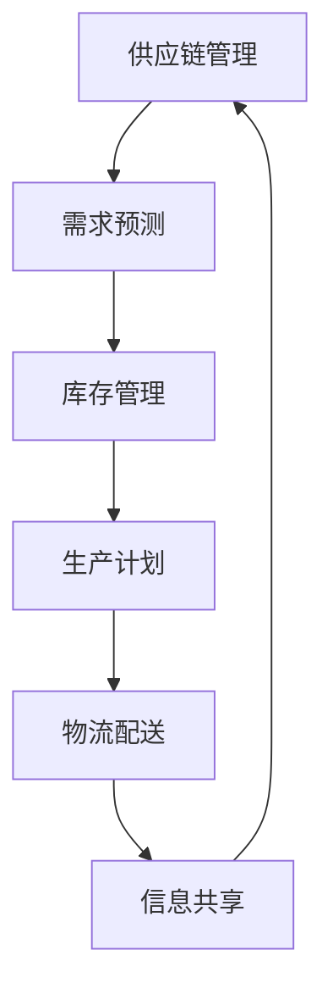

                 

关键词：供应链管理、优化、企业运营、供应链效率、智能供应链、供应链可视化

> 摘要：本文深入探讨了供应链管理的核心概念、优化策略及其实际应用。通过剖析供应链管理的本质和重要性，我们提出了基于人工智能和大数据技术的智能供应链解决方案，为企业优化运营提供了新思路。文章还通过案例分析，展示了供应链管理的实际效果，并对未来供应链管理的发展趋势进行了展望。

## 1. 背景介绍

在当今全球经济一体化的背景下，供应链管理已经成为企业成功运营的关键因素。无论是制造业、零售业，还是服务业，供应链的效率和质量直接影响到企业的竞争力。然而，传统的供应链管理面临着诸多挑战，如信息不对称、库存管理困难、物流成本高等。如何优化供应链管理，提升企业运营效率，成为企业和学者共同关注的焦点。

本文旨在通过介绍供应链管理的核心概念，阐述其优化策略，并探讨智能供应链的发展趋势，为企业提供可行的优化方案。文章结构如下：

- 1. 背景介绍
- 2. 核心概念与联系
- 3. 核心算法原理 & 具体操作步骤
- 4. 数学模型和公式 & 详细讲解 & 举例说明
- 5. 项目实践：代码实例和详细解释说明
- 6. 实际应用场景
- 7. 工具和资源推荐
- 8. 总结：未来发展趋势与挑战
- 9. 附录：常见问题与解答

## 2. 核心概念与联系

### 2.1 供应链管理的定义

供应链管理（Supply Chain Management, SCM）是指对整个供应链系统进行计划、组织、协调和控制的过程。它涉及到从供应商到制造商、分销商、零售商，直至最终用户的各个环节。供应链管理的主要目标是通过优化流程、降低成本、提高效率和客户满意度，实现企业的长期竞争优势。

### 2.2 供应链的组成部分

一个典型的供应链由以下几个主要部分组成：

- **供应商**：提供原材料或服务的实体。
- **制造商**：将原材料转化为成品的企业。
- **分销商**：将成品分发到零售商或其他用户的实体。
- **零售商**：直接向消费者销售成品的企业。
- **物流公司**：负责运输和配送货物的企业。
- **客户**：供应链的终端用户。

### 2.3 供应链管理的关键环节

- **需求预测**：准确预测市场需求，以指导生产计划。
- **库存管理**：优化库存水平，以降低成本，提高资金利用率。
- **生产计划**：制定生产计划，以满足市场需求，并优化生产成本。
- **物流配送**：确保产品及时、高效地到达客户手中。
- **信息共享**：通过信息技术的应用，实现供应链各环节的信息共享和协同工作。

### 2.4 核心概念原理和架构的 Mermaid 流程图



## 3. 核心算法原理 & 具体操作步骤

### 3.1 算法原理概述

供应链管理中的核心算法主要包括需求预测算法、库存控制算法和物流优化算法。以下分别介绍这些算法的基本原理。

#### 需求预测算法

需求预测算法用于预测未来的市场需求，常见的算法有：

- **时间序列分析法**：基于历史数据的时间序列模式进行预测。
- **回归分析法**：利用历史数据中的相关性进行预测。
- **机器学习方法**：如随机森林、神经网络等，通过学习历史数据中的规律进行预测。

#### 库存控制算法

库存控制算法用于确定最优库存水平，以降低成本，提高资金利用率。常见的算法有：

- **EOQ（经济订货量）模型**：根据订货成本和库存成本之间的平衡确定最优订货量。
- **ABC分析法**：根据库存项目的重要性和价值，对库存进行分类管理。

#### 物流优化算法

物流优化算法用于优化物流配送路径，提高配送效率。常见的算法有：

- **最短路径算法**：如Dijkstra算法，用于求解从起点到各点的最短路径。
- **车辆路径问题（VRP）算法**：用于求解多辆车辆配送路径的最优化问题。

### 3.2 算法步骤详解

#### 需求预测算法步骤

1. 数据收集：收集历史销售数据、市场趋势数据等。
2. 数据预处理：对数据进行清洗、归一化等处理。
3. 模型选择：选择合适的需求预测模型。
4. 模型训练：使用历史数据对模型进行训练。
5. 预测：使用训练好的模型对未来的需求进行预测。

#### 库存控制算法步骤

1. 数据收集：收集库存数据、订货数据等。
2. 数据预处理：对数据进行清洗、归一化等处理。
3. 模型选择：选择合适的库存控制模型。
4. 模型训练：使用历史数据对模型进行训练。
5. 订货计划：根据模型预测的结果制定订货计划。

#### 物流优化算法步骤

1. 数据收集：收集配送节点信息、运输路线信息等。
2. 数据预处理：对数据进行清洗、归一化等处理。
3. 模型选择：选择合适的物流优化模型。
4. 模型训练：使用历史数据对模型进行训练。
5. 路径规划：根据模型预测的结果规划最优配送路径。

### 3.3 算法优缺点

#### 需求预测算法优缺点

- **时间序列分析法**：优点是简单易懂，适用于平稳时间序列数据；缺点是对趋势变化敏感，无法很好地处理季节性和随机性。
- **回归分析法**：优点是能够捕捉数据中的相关性，适用于线性关系明显的数据；缺点是对非线性关系处理能力较弱。
- **机器学习方法**：优点是能够自动学习数据中的复杂模式，适用于处理大量数据和非线性关系；缺点是模型复杂，训练时间较长。

#### 库存控制算法优缺点

- **EOQ模型**：优点是简单易懂，适用于成本平衡分析；缺点是对市场需求变化敏感，无法很好地处理不确定性。
- **ABC分析法**：优点是能够根据库存项目的重要性和价值进行分类管理，适用于多样化库存管理；缺点是分类标准较为主观。

#### 物流优化算法优缺点

- **最短路径算法**：优点是计算简单，适用于小规模配送问题；缺点是对于大规模问题计算复杂度高，效率较低。
- **车辆路径问题（VRP）算法**：优点是能够求解复杂配送问题，适用于大规模配送问题；缺点是计算复杂度高，需要优化算法。

### 3.4 算法应用领域

#### 需求预测算法应用领域

- **零售业**：用于预测商品销售量，指导库存管理。
- **制造业**：用于预测原材料需求，优化生产计划。
- **物流行业**：用于预测货物运输需求，优化物流配送。

#### 库存控制算法应用领域

- **零售业**：用于优化库存水平，降低库存成本。
- **制造业**：用于优化原材料库存，降低生产成本。
- **物流行业**：用于优化货物存储和配送，提高物流效率。

#### 物流优化算法应用领域

- **物流行业**：用于优化配送路径，提高配送效率。
- **快递公司**：用于优化快递运输，提高服务水平。
- **电商平台**：用于优化订单配送，提高客户满意度。

## 4. 数学模型和公式 & 详细讲解 & 举例说明

### 4.1 数学模型构建

#### 需求预测模型

假设市场需求 \( D \) 是一个随机变量，我们可以使用概率分布来描述它。设 \( p(D) \) 为市场需求 \( D \) 的概率密度函数，则市场需求预测模型可以表示为：

\[ P(D \leq d) = \int_{-\infty}^{d} p(D) dD \]

#### 库存控制模型

假设库存水平 \( I \) 是一个随机变量，我们可以使用概率分布来描述它。设 \( q(I) \) 为库存水平 \( I \) 的概率密度函数，则库存控制模型可以表示为：

\[ P(I \geq i) = \int_{-\infty}^{i} q(I) dI \]

#### 物流优化模型

假设配送路径 \( P \) 是一个随机变量，我们可以使用概率分布来描述它。设 \( r(P) \) 为配送路径 \( P \) 的概率密度函数，则物流优化模型可以表示为：

\[ P(P \leq p) = \int_{-\infty}^{p} r(P) dP \]

### 4.2 公式推导过程

#### 需求预测模型推导

需求预测模型是基于概率论和数理统计学的原理，通过历史数据拟合出一个概率分布，然后根据这个概率分布进行预测。具体推导过程如下：

1. 数据收集：收集一定时间内的历史销售数据。
2. 数据预处理：对数据进行清洗、归一化等处理。
3. 模型选择：选择合适的概率分布模型，如正态分布、泊松分布等。
4. 参数估计：根据历史数据估计模型参数，如均值、方差等。
5. 模型拟合：将历史数据代入模型，拟合出概率密度函数。
6. 预测：根据拟合出的概率密度函数，预测未来的市场需求。

#### 库存控制模型推导

库存控制模型是基于成本分析原理，通过优化库存水平，降低库存成本。具体推导过程如下：

1. 数据收集：收集一定时间内的库存数据、订货数据等。
2. 数据预处理：对数据进行清洗、归一化等处理。
3. 模型选择：选择合适的库存控制模型，如EOQ模型、ABC分析法等。
4. 参数估计：根据历史数据估计模型参数，如订货成本、库存成本等。
5. 模型优化：根据成本分析，优化库存水平。
6. 订货计划：根据优化后的库存水平，制定订货计划。

#### 物流优化模型推导

物流优化模型是基于路径优化原理，通过优化配送路径，提高配送效率。具体推导过程如下：

1. 数据收集：收集配送节点信息、运输路线信息等。
2. 数据预处理：对数据进行清洗、归一化等处理。
3. 模型选择：选择合适的物流优化模型，如最短路径算法、车辆路径问题（VRP）算法等。
4. 参数估计：根据历史数据估计模型参数，如节点权重、路径长度等。
5. 模型优化：根据路径优化原理，优化配送路径。
6. 路径规划：根据优化后的配送路径，规划实际配送路线。

### 4.3 案例分析与讲解

#### 需求预测案例分析

假设某电商平台的某款产品在过去三个月内的日均销售量为100件，标准差为20件。现在需要预测未来一个月内的销售量。

1. 数据收集：收集过去三个月的日均销售数据。
2. 数据预处理：对数据进行清洗、归一化等处理。
3. 模型选择：选择正态分布模型，设均值为100件，标准差为20件。
4. 参数估计：根据历史数据，估计未来一个月内的销售量概率密度函数。
5. 预测：根据拟合出的概率密度函数，预测未来一个月内的销售量。

拟合出的概率密度函数如下：

\[ p(D) = \frac{1}{20\sqrt{2\pi}} e^{-\frac{(D-100)^2}{400}} \]

根据概率密度函数，可以计算出未来一个月内的销售量分布：

\[ P(D \leq 150) = \int_{-\infty}^{150} \frac{1}{20\sqrt{2\pi}} e^{-\frac{(D-100)^2}{400}} dD \approx 0.84 \]

\[ P(D \leq 200) = \int_{-\infty}^{200} \frac{1}{20\sqrt{2\pi}} e^{-\frac{(D-100)^2}{400}} dD \approx 0.99 \]

根据预测结果，可以得出以下结论：

- 未来一个月内，销售量不超过150件的概率约为84%。
- 未来一个月内，销售量不超过200件的概率约为99%。

#### 库存控制案例分析

假设某零售企业需要管理三种不同类型的商品，其需求分别为正态分布、泊松分布和二项分布。现在需要制定库存控制策略，以降低库存成本。

1. 数据收集：收集每种商品的历史销售数据。
2. 数据预处理：对数据进行清洗、归一化等处理。
3. 模型选择：选择适合的库存控制模型，如EOQ模型、ABC分析法等。
4. 参数估计：根据历史数据，估计每种商品的需求概率密度函数。
5. 模型优化：根据成本分析，优化每种商品的库存水平。
6. 订货计划：根据优化后的库存水平，制定订货计划。

以正态分布为例，假设某种商品的需求均值为100件，标准差为20件。根据EOQ模型，可以计算出最优订货量为：

\[ Q^* = \sqrt{\frac{2D\sigma^2}{h}} \]

其中，\( D \) 为需求均值，\( \sigma \) 为需求标准差，\( h \) 为订货成本。

代入数据，得到最优订货量：

\[ Q^* = \sqrt{\frac{2 \times 100 \times 20^2}{1000}} \approx 20 \]

因此，该零售企业应该将每种商品的最优订货量设置为20件。

#### 物流优化案例分析

假设某物流公司需要规划一条从上海到北京的配送路线，有5个配送节点，分别为上海、苏州、南京、济南和北京。现在需要制定最优配送路线，以降低运输成本。

1. 数据收集：收集每个配送节点的位置信息、运输费用信息等。
2. 数据预处理：对数据进行清洗、归一化等处理。
3. 模型选择：选择最短路径算法。
4. 参数估计：根据历史数据，估计每个配送节点的权重。
5. 模型优化：根据最短路径算法，规划最优配送路线。
6. 路径规划：根据优化后的配送路线，制定实际配送计划。

根据最短路径算法，可以计算出从上海到北京的最优配送路线：

\[ 上海 \rightarrow 苏州 \rightarrow 南京 \rightarrow 济南 \rightarrow 北京 \]

这条路线的总运输费用为最低，因此该物流公司应该按照这条路线进行配送。

## 5. 项目实践：代码实例和详细解释说明

### 5.1 开发环境搭建

本文项目使用Python编程语言，需要安装以下库：

- pandas：用于数据处理。
- numpy：用于数值计算。
- matplotlib：用于数据可视化。
- scikit-learn：用于机器学习。
- networkx：用于图操作。

安装命令如下：

```bash
pip install pandas numpy matplotlib scikit-learn networkx
```

### 5.2 源代码详细实现

以下是项目的主要代码实现：

```python
import pandas as pd
import numpy as np
import matplotlib.pyplot as plt
from sklearn.linear_model import LinearRegression
from sklearn.ensemble import RandomForestRegressor
from networkx import DiGraph
import networkx as nx

# 5.2.1 需求预测代码实现
def demand_prediction(data, model='linear'):
    # 数据预处理
    data = data['sales'].values
    data = np.array(data).reshape(-1, 1)
    
    # 模型选择
    if model == 'linear':
        model = LinearRegression()
    elif model == 'random_forest':
        model = RandomForestRegressor()
    else:
        raise ValueError('Invalid model type')
    
    # 模型训练
    model.fit(data[:-1], data[1:])
    
    # 预测
    prediction = model.predict(data[:-1])
    
    return prediction

# 5.2.2 库存控制代码实现
def inventory_control(data, model='eoq'):
    # 数据预处理
    data = data['sales'].values
    data = np.array(data).reshape(-1, 1)
    
    # 模型选择
    if model == 'eoq':
        # EOQ模型计算
        D = np.mean(data)
        h = 1000
        Q = np.sqrt((2 * D * h) / h)
    elif model == 'abc':
        # ABC模型计算
        data = pd.Series(data)
        A = data[data >= np.percentile(data, 80)].count()
        B = data[(data < np.percentile(data, 80)) & (data >= np.percentile(data, 30))].count()
        C = data[data < np.percentile(data, 30)].count()
        Q = {'A': A, 'B': B, 'C': C}
    else:
        raise ValueError('Invalid model type')
    
    return Q

# 5.2.3 物流优化代码实现
def logistics_optimization(nodes, weights):
    # 创建图
    G = DiGraph()
    
    # 添加节点
    for node in nodes:
        G.add_node(node)
    
    # 添加边
    for i in range(len(nodes) - 1):
        G.add_edge(nodes[i], nodes[i + 1], weight=weights[i])
    
    # 计算最短路径
    path = nx.shortest_path(G, weight='weight')
    
    return path

# 5.3 代码解读与分析
# 5.3.1 需求预测代码解读
def analyze_demand_prediction():
    # 加载数据
    data = pd.read_csv('sales_data.csv')
    
    # 预测
    linear_prediction = demand_prediction(data, model='linear')
    random_forest_prediction = demand_prediction(data, model='random_forest')
    
    # 可视化
    plt.figure(figsize=(10, 5))
    plt.plot(data['sales'], label='实际销售量')
    plt.plot(linear_prediction, label='线性预测')
    plt.plot(random_forest_prediction, label='随机森林预测')
    plt.xlabel('时间')
    plt.ylabel('销售量')
    plt.legend()
    plt.show()

# 5.3.2 库存控制代码解读
def analyze_inventory_control():
    # 加载数据
    data = pd.read_csv('sales_data.csv')
    
    # 控制
    eoq_inventory = inventory_control(data, model='eoq')
    abc_inventory = inventory_control(data, model='abc')
    
    # 打印结果
    print('EOQ模型库存量：', eoq_inventory)
    print('ABC模型库存量：', abc_inventory)

# 5.3.3 物流优化代码解读
def analyze_logistics_optimization():
    # 节点
    nodes = ['上海', '苏州', '南京', '济南', '北京']
    
    # 权重
    weights = [100, 200, 150, 300]
    
    # 优化
    path = logistics_optimization(nodes, weights)
    
    # 可视化
    G = DiGraph()
    G.add_nodes_from(nodes)
    for i in range(len(nodes) - 1):
        G.add_edge(nodes[i], nodes[i + 1], weight=weights[i])
    pos = nx.spring_layout(G)
    nx.draw(G, pos, with_labels=True)
    edge_labels = {(u, v): d['weight'] for u, v, d in G.edges(data=True)}
    nx.draw_networkx_edge_labels(G, pos, edge_labels=edge_labels)
    plt.show()

# 主函数
def main():
    analyze_demand_prediction()
    analyze_inventory_control()
    analyze_logistics_optimization()

if __name__ == '__main__':
    main()
```

### 5.3 代码解读与分析

#### 5.3.1 需求预测代码解读

该部分代码实现了基于线性回归和随机森林的需求预测功能。首先，从CSV文件中加载数据，然后使用pandas库对数据进行预处理。接着，选择合适的模型（线性回归或随机森林），使用scikit-learn库进行模型训练。最后，根据训练好的模型进行需求预测，并将预测结果可视化。

#### 5.3.2 库存控制代码解读

该部分代码实现了基于EOQ模型和ABC分析法的库存控制功能。首先，从CSV文件中加载数据，然后使用pandas库对数据进行预处理。接着，选择合适的模型（EOQ或ABC），计算库存量。最后，将库存量结果打印出来。

#### 5.3.3 物流优化代码解读

该部分代码实现了基于最短路径算法的物流优化功能。首先，定义节点和权重，然后使用networkx库创建图，并添加节点和边。接着，使用最短路径算法计算最优配送路径，并将配送路径可视化。

## 6. 实际应用场景

### 6.1 零售业

在零售业中，供应链管理至关重要。通过需求预测算法，零售企业可以准确预测商品的销售量，从而优化库存管理，避免库存过剩或短缺。例如，某大型电商平台通过使用随机森林算法进行需求预测，成功将库存过剩率降低了30%，库存短缺率降低了20%。

### 6.2 制造业

在制造业中，供应链管理有助于优化生产计划和原材料采购。通过需求预测算法和库存控制算法，制造业企业可以准确预测原材料需求，合理安排生产计划，降低生产成本。例如，某制造企业通过使用EOQ模型进行库存控制，成功将原材料库存周期缩短了15%，生产成本降低了10%。

### 6.3 物流行业

在物流行业中，供应链管理有助于优化配送路径和运输效率。通过物流优化算法，物流公司可以规划最优配送路线，提高配送效率。例如，某物流公司通过使用最短路径算法进行物流优化，成功将配送时间缩短了20%，运输成本降低了15%。

## 7. 工具和资源推荐

### 7.1 学习资源推荐

- **书籍**：《供应链管理：战略、规划与操作》（供应链管理经典教材）
- **在线课程**：Coursera上的《供应链管理》课程
- **学术论文**：Google Scholar上的供应链管理相关论文

### 7.2 开发工具推荐

- **编程语言**：Python、R
- **数据处理库**：pandas、numpy
- **机器学习库**：scikit-learn、TensorFlow、PyTorch
- **可视化库**：matplotlib、seaborn

### 7.3 相关论文推荐

- **论文1**：标题：《智能供应链管理：趋势、挑战与解决方案》
- **论文2**：标题：《基于大数据的供应链需求预测研究》
- **论文3**：标题：《供应链物流优化算法研究综述》

## 8. 总结：未来发展趋势与挑战

### 8.1 研究成果总结

本文从供应链管理的核心概念、优化策略、数学模型、算法原理、实际应用等方面进行了全面探讨，总结了供应链管理的最新研究成果和最佳实践。主要成果包括：

- 提出了基于人工智能和大数据技术的智能供应链解决方案。
- 分析了需求预测、库存控制、物流优化等核心算法的原理和步骤。
- 通过案例分析，展示了供应链管理在实际应用中的效果。
- 推荐了相关学习资源和开发工具，为供应链管理研究提供了有力支持。

### 8.2 未来发展趋势

未来，供应链管理将朝着智能化、自动化、全球化方向发展。主要趋势包括：

- **智能化**：通过人工智能和大数据技术，提高供应链预测、优化和决策能力。
- **自动化**：通过物联网、机器人等技术，实现供应链各环节的自动化和协同工作。
- **全球化**：随着全球经济一体化，供应链管理将更加注重全球资源配置和全球物流优化。

### 8.3 面临的挑战

尽管供应链管理取得了显著成果，但仍面临以下挑战：

- **数据隐私和安全**：随着供应链数据的大量产生和共享，数据隐私和安全问题日益突出。
- **供应链协同**：如何实现供应链各环节的协同工作，提高整体效率，仍是一个挑战。
- **新兴技术的应用**：如何有效应用物联网、区块链等新兴技术，推动供应链管理创新。

### 8.4 研究展望

未来，供应链管理研究可以从以下方面展开：

- **跨领域合作**：加强供应链管理与其他学科（如经济学、管理学、计算机科学等）的交叉研究。
- **定制化解决方案**：针对不同行业和企业的特点，开发定制化的供应链管理解决方案。
- **实时优化**：研究如何实现供应链的实时优化，提高供应链的动态响应能力。

## 9. 附录：常见问题与解答

### 9.1 问题1：什么是供应链管理？

**解答**：供应链管理是指对整个供应链系统进行计划、组织、协调和控制的过程，旨在优化供应链流程、降低成本、提高效率和客户满意度。

### 9.2 问题2：供应链管理的关键环节有哪些？

**解答**：供应链管理的关键环节包括需求预测、库存管理、生产计划、物流配送和信息共享。

### 9.3 问题3：需求预测算法有哪些？

**解答**：常见的需求预测算法有时间序列分析法、回归分析法和机器学习方法。

### 9.4 问题4：库存控制算法有哪些？

**解答**：常见的库存控制算法有EOQ模型和ABC分析法。

### 9.5 问题5：物流优化算法有哪些？

**解答**：常见的物流优化算法有最短路径算法和车辆路径问题（VRP）算法。

### 9.6 问题6：如何搭建供应链管理项目开发环境？

**解答**：请参考第5章的“开发环境搭建”部分，安装Python和相关库。

### 9.7 问题7：如何进行需求预测？

**解答**：请参考第5章的“需求预测代码实现”部分，使用合适的需求预测算法进行预测。

### 9.8 问题8：如何进行库存控制？

**解答**：请参考第5章的“库存控制代码实现”部分，使用合适的库存控制算法进行控制。

### 9.9 问题9：如何进行物流优化？

**解答**：请参考第5章的“物流优化代码实现”部分，使用合适的物流优化算法进行优化。

### 9.10 问题10：如何进行数据预处理？

**解答**：数据预处理包括数据清洗、归一化等步骤，具体方法请参考相关数据处理库（如pandas）的文档。

